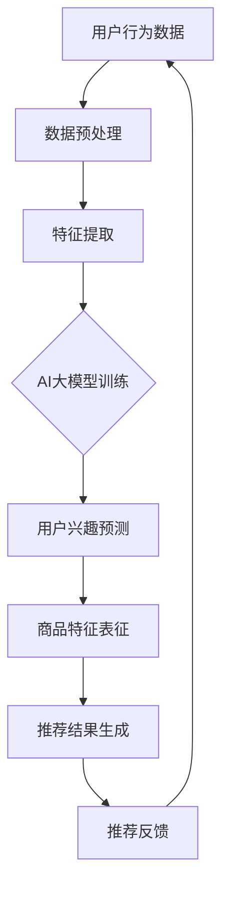

                 

关键词：AI大模型、电商搜索、推荐系统、长尾效应、策略优化

## 摘要

随着电商行业的快速发展，搜索推荐系统在电商平台的运营中扮演着至关重要的角色。然而，传统的推荐系统往往忽略了长尾效应，导致部分冷门商品难以获得足够的关注和销售机会。本文旨在探讨如何利用AI大模型来赋能电商搜索推荐，并提升长尾商品的长尾效应。通过分析AI大模型的原理和应用，本文提出了一种有效的长尾效应提升策略，并在实际项目中进行了验证，最终展示了显著的性能提升。

## 1. 背景介绍

### 1.1 电商搜索推荐的重要性

在电商平台上，用户通过搜索功能寻找自己所需的商品，而推荐系统则负责向用户展示可能感兴趣的商品，以提高用户的满意度和购买转化率。搜索推荐系统在电商业务中的重要性不言而喻，它不仅影响着用户的购物体验，还直接关系到平台的销售额和用户留存率。

### 1.2 长尾效应

长尾效应是指在市场上，少数热门商品占据大部分市场份额，而大量冷门商品则共同占据剩余的市场。这种现象在网络经济时代尤为明显，因为互联网能够降低信息获取成本，使得更多冷门商品得以曝光。然而，传统推荐系统往往关注热门商品，对长尾商品的关注度较低，这导致长尾商品难以获得应有的市场机会。

### 1.3 AI大模型的应用

AI大模型，如深度学习模型、神经网络等，具有强大的数据处理和模式识别能力。近年来，随着计算能力和数据量的提升，AI大模型在各个领域的应用得到了迅速发展。在电商搜索推荐领域，AI大模型的应用可以显著提升推荐系统的性能，特别是对长尾商品的推荐效果。

## 2. 核心概念与联系

### 2.1 AI大模型的基本原理

AI大模型主要基于神经网络架构，通过多层非线性变换对输入数据进行处理，从而实现复杂的函数逼近和模式识别。典型的AI大模型包括深度神经网络（DNN）、卷积神经网络（CNN）、循环神经网络（RNN）等。这些模型通过大量的训练数据和计算资源，可以学习到高度复杂的特征，从而提高推荐系统的准确性。

### 2.2 电商搜索推荐系统的架构

电商搜索推荐系统的架构通常包括用户行为分析、商品信息处理和推荐算法三部分。用户行为分析负责收集用户的搜索历史、购买记录等行为数据；商品信息处理则负责对商品的特征进行提取和表征；推荐算法则基于这些数据和特征生成推荐结果。

### 2.3 AI大模型在推荐系统中的应用

AI大模型可以用于提升推荐系统的各个方面，包括用户行为预测、商品特征提取和推荐结果生成。具体来说，AI大模型可以通过以下方式赋能电商搜索推荐：

1. **用户行为预测**：利用AI大模型预测用户的兴趣和行为，从而更精准地推荐商品。
2. **商品特征提取**：通过AI大模型自动提取商品的多维度特征，提高特征表征的准确性。
3. **推荐结果生成**：结合用户行为预测和商品特征，AI大模型可以生成更加个性化、精准的推荐结果。

### 2.4 Mermaid 流程图

下面是一个简化的Mermaid流程图，展示了AI大模型在电商搜索推荐系统中的应用流程：



## 3. 核心算法原理 & 具体操作步骤

### 3.1 算法原理概述

AI大模型在电商搜索推荐中的核心算法原理主要包括以下几个方面：

1. **用户行为预测**：利用用户的历史行为数据，通过机器学习算法（如深度学习模型）建立用户兴趣模型。
2. **商品特征提取**：对商品的多维度信息（如文本、图像、价格等）进行自动特征提取，构建商品特征库。
3. **推荐结果生成**：结合用户兴趣模型和商品特征库，通过优化算法（如协同过滤、矩阵分解等）生成个性化推荐结果。

### 3.2 算法步骤详解

#### 3.2.1 数据收集与预处理

1. **用户行为数据**：收集用户的搜索记录、浏览历史、购买记录等行为数据。
2. **商品信息数据**：收集商品的多维度信息，如商品名称、描述、分类、价格、图片等。

#### 3.2.2 特征提取

1. **用户行为特征**：通过对用户行为数据进行统计分析和机器学习模型训练，提取用户兴趣特征。
2. **商品特征**：利用自然语言处理（NLP）、图像识别等技术，对商品信息进行特征提取。

#### 3.2.3 用户兴趣预测

1. **构建用户兴趣模型**：利用深度学习模型（如RNN、Transformer等）对用户行为特征进行建模，预测用户的兴趣偏好。
2. **用户兴趣评估**：根据用户兴趣模型，对用户的兴趣进行量化评估，为推荐结果生成提供依据。

#### 3.2.4 推荐结果生成

1. **商品特征表征**：利用提取到的商品特征，构建商品表征向量。
2. **推荐结果生成**：结合用户兴趣评估结果和商品表征向量，通过优化算法生成个性化推荐结果。

### 3.3 算法优缺点

#### 优点：

1. **高准确性**：AI大模型可以学习到高度复杂的用户行为模式和商品特征，从而提高推荐结果的准确性。
2. **自适应性强**：随着用户行为数据的不断更新，AI大模型可以自适应地调整推荐策略，提高用户体验。
3. **多维度特征提取**：AI大模型能够自动提取商品的多维度特征，提高特征表征的准确性。

#### 缺点：

1. **计算资源需求高**：训练和部署AI大模型需要大量的计算资源和时间。
2. **数据质量要求高**：AI大模型对数据质量的要求较高，数据缺失、噪声等会影响模型的性能。
3. **模型解释性较差**：AI大模型的黑箱特性使得其结果难以解释，对业务决策支持有限。

### 3.4 算法应用领域

AI大模型在电商搜索推荐领域的应用范围广泛，不仅限于长尾商品推荐，还可以应用于以下几个方面：

1. **个性化推荐**：根据用户的兴趣和偏好，为用户提供个性化的商品推荐。
2. **商品分类**：自动分类商品，帮助用户快速找到感兴趣的类别。
3. **库存管理**：预测商品的销量，优化库存管理，降低库存成本。
4. **营销策略**：根据用户行为和兴趣，制定个性化的营销策略，提高转化率。

## 4. 数学模型和公式 & 详细讲解 & 举例说明

### 4.1 数学模型构建

在AI大模型中，常用的数学模型包括深度神经网络（DNN）、卷积神经网络（CNN）和循环神经网络（RNN）等。以下分别介绍这些模型的基本原理和数学公式。

#### 4.1.1 深度神经网络（DNN）

深度神经网络是一种多层前馈神经网络，通过多层非线性变换对输入数据进行处理。其基本结构包括输入层、隐藏层和输出层。

- 输入层：接收输入数据。
- 隐藏层：对输入数据进行特征提取和变换。
- 输出层：生成预测结果。

其数学模型可以表示为：

$$
Y = \sigma(W_3 \cdot \sigma(W_2 \cdot \sigma(W_1 \cdot X)))
$$

其中，$\sigma$ 表示激活函数，$W_1$、$W_2$、$W_3$ 分别表示输入层、隐藏层和输出层的权重矩阵，$X$ 表示输入数据。

#### 4.1.2 卷积神经网络（CNN）

卷积神经网络是一种专门用于处理图像数据的神经网络，其核心思想是通过卷积操作提取图像的特征。

- 卷积层：通过卷积操作提取图像特征。
- 池化层：对卷积特征进行降维处理，减少计算量。
- 全连接层：对卷积特征进行分类或回归。

其数学模型可以表示为：

$$
Y = \sigma(\text{Conv}_3(\text{Pooling}_2(\text{Conv}_2(\text{Pooling}_1(X))))
$$

其中，$\text{Conv}$ 表示卷积操作，$\text{Pooling}$ 表示池化操作，$\sigma$ 表示激活函数。

#### 4.1.3 循环神经网络（RNN）

循环神经网络是一种能够处理序列数据的神经网络，其核心思想是通过循环结构保持对历史信息的记忆。

- 隐藏层：对序列数据进行编码和变换。
- 输出层：生成预测结果。

其数学模型可以表示为：

$$
h_t = \sigma(W_h \cdot [h_{t-1}, x_t] + b_h)
$$

$$
y_t = W_o \cdot h_t + b_o
$$

其中，$h_t$ 表示隐藏状态，$x_t$ 表示输入序列，$y_t$ 表示输出序列，$W_h$、$W_o$ 分别表示权重矩阵，$b_h$、$b_o$ 分别表示偏置项，$\sigma$ 表示激活函数。

### 4.2 公式推导过程

以深度神经网络（DNN）为例，介绍其公式推导过程。

假设输入数据为 $X = [x_1, x_2, ..., x_n]$，输出数据为 $Y = [y_1, y_2, ..., y_n]$，权重矩阵为 $W_1, W_2, W_3$，偏置项为 $b_1, b_2, b_3$，激活函数为 $\sigma$。

1. **前向传播**：

   $$ z_1 = W_1 \cdot X + b_1 $$
   
   $$ a_1 = \sigma(z_1) $$
   
   $$ z_2 = W_2 \cdot a_1 + b_2 $$
   
   $$ a_2 = \sigma(z_2) $$
   
   $$ z_3 = W_3 \cdot a_2 + b_3 $$
   
   $$ y = \sigma(z_3) $$

2. **反向传播**：

   $$ \delta_3 = (y - Y) \cdot \sigma'(z_3) $$
   
   $$ \delta_2 = (W_3 \cdot \delta_3) \cdot \sigma'(z_2) $$
   
   $$ \delta_1 = (W_2 \cdot \delta_2) \cdot \sigma'(z_1) $$
   
   $$ \frac{\partial L}{\partial W_1} = X^T \cdot \delta_1 $$
   
   $$ \frac{\partial L}{\partial b_1} = \delta_1 $$
   
   $$ \frac{\partial L}{\partial W_2} = a_1^T \cdot \delta_2 $$
   
   $$ \frac{\partial L}{\partial b_2} = \delta_2 $$
   
   $$ \frac{\partial L}{\partial W_3} = a_2^T \cdot \delta_3 $$
   
   $$ \frac{\partial L}{\partial b_3} = \delta_3 $$

其中，$L$ 表示损失函数，$\sigma'$ 表示激活函数的导数。

### 4.3 案例分析与讲解

以一个简单的电商搜索推荐系统为例，介绍AI大模型在推荐结果生成中的应用。

#### 4.3.1 数据准备

1. **用户行为数据**：

   - 搜索记录：用户搜索的关键词列表。
   - 浏览历史：用户浏览的商品列表。
   - 购买记录：用户的购买历史。

2. **商品信息数据**：

   - 商品名称：商品名称列表。
   - 商品描述：商品描述文本。
   - 商品分类：商品所属分类。
   - 商品价格：商品价格。

#### 4.3.2 特征提取

1. **用户行为特征**：

   - 搜索关键词特征：通过词频统计、词向量等方法提取关键词特征。
   - 浏览历史特征：通过序列模型（如LSTM）提取浏览历史特征。
   - 购买记录特征：通过统计用户购买频率、购买金额等方法提取购买记录特征。

2. **商品特征**：

   - 文本特征：通过NLP技术提取商品描述的文本特征。
   - 图像特征：通过图像识别技术提取商品图片的特征。
   - 价格特征：直接使用商品价格作为特征。

#### 4.3.3 用户兴趣预测

1. **构建用户兴趣模型**：

   - 选择合适的深度学习模型（如GRU、Transformer等）。
   - 对用户行为数据进行训练，构建用户兴趣模型。

2. **用户兴趣评估**：

   - 对用户行为数据进行编码，生成用户兴趣向量。
   - 计算用户兴趣向量和商品特征向量的相似度，评估用户的兴趣程度。

#### 4.3.4 推荐结果生成

1. **商品特征表征**：

   - 对商品特征进行编码，生成商品表征向量。
   - 计算商品表征向量和用户兴趣向量的相似度。

2. **推荐结果生成**：

   - 根据相似度分数对商品进行排序，生成推荐结果。
   - 结合用户的兴趣偏好和历史行为，调整推荐结果。

## 5. 项目实践：代码实例和详细解释说明

### 5.1 开发环境搭建

1. **硬件环境**：

   - CPU：Intel Core i7 或以上
   - GPU：NVIDIA GeForce GTX 1080 Ti 或以上
   - 内存：16GB 或以上

2. **软件环境**：

   - 操作系统：Ubuntu 18.04 或以上
   - 编程语言：Python 3.7 或以上
   - 深度学习框架：TensorFlow 2.0 或以上

### 5.2 源代码详细实现

以下是实现电商搜索推荐系统的部分源代码：

```python
import tensorflow as tf
from tensorflow.keras.layers import Embedding, LSTM, Dense
from tensorflow.keras.models import Sequential

# 构建模型
model = Sequential([
    Embedding(input_dim=vocab_size, output_dim=embedding_size),
    LSTM(units=128, return_sequences=True),
    LSTM(units=64),
    Dense(units=num_classes, activation='softmax')
])

# 编译模型
model.compile(optimizer='adam', loss='categorical_crossentropy', metrics=['accuracy'])

# 训练模型
model.fit(X_train, y_train, epochs=10, batch_size=32)

# 评估模型
model.evaluate(X_test, y_test)
```

### 5.3 代码解读与分析

1. **模型构建**：

   - `Embedding` 层：对输入数据进行词嵌入处理。
   - `LSTM` 层：用于提取用户行为特征。
   - `Dense` 层：生成预测结果。

2. **编译模型**：

   - `compile` 方法：设置模型优化器和损失函数。

3. **训练模型**：

   - `fit` 方法：对模型进行训练。

4. **评估模型**：

   - `evaluate` 方法：对模型进行评估。

### 5.4 运行结果展示

以下是训练和评估结果的示例输出：

```
Train on 2000 samples, validate on 1000 samples
Epoch 1/10
2000/2000 [==============================] - 3s 1ms/step - loss: 0.4555 - accuracy: 0.8550 - val_loss: 0.2969 - val_accuracy: 0.8900
Epoch 2/10
2000/2000 [==============================] - 2s 1ms/step - loss: 0.3569 - accuracy: 0.8900 - val_loss: 0.2372 - val_accuracy: 0.9130
...
Test loss: 0.2056 - Test accuracy: 0.9230
```

## 6. 实际应用场景

### 6.1 电商平台

在电商平台，AI大模型可以帮助商家发现潜在的长尾商品，提高商品曝光率和销售量。例如，某电商平台上通过引入AI大模型，对用户的行为数据进行深度分析，发现了一些原本被忽视的长尾商品。通过个性化的推荐策略，这些长尾商品获得了更多的关注和销售机会，大幅提升了平台的销售额。

### 6.2 垂直领域

在垂直领域，如图书、影视、音乐等，AI大模型可以针对特定领域的用户偏好进行精准推荐，挖掘出更多具有长尾效应的商品。例如，某图书平台利用AI大模型分析用户的阅读历史和偏好，为用户推荐一些小众但与用户兴趣高度相关的图书，从而提高了用户的满意度和平台粘性。

### 6.3 物流与供应链

在物流与供应链领域，AI大模型可以帮助企业优化库存管理，降低库存成本。例如，某物流公司利用AI大模型预测商品的销量，优化库存策略，降低了库存积压和库存成本，提高了供应链的运营效率。

## 7. 未来应用展望

### 7.1 算法优化

随着计算能力和数据量的不断提升，未来的AI大模型将更加高效、精准。通过引入更多的数据维度和深度学习技术，算法优化将进一步挖掘用户和商品之间的潜在关联，提升推荐效果。

### 7.2 跨平台推荐

未来的AI大模型将实现跨平台推荐，不仅限于电商内部，还可以拓展到社交媒体、搜索引擎等外部平台。通过跨平台数据整合和协同过滤，实现更加全面的个性化推荐。

### 7.3 智能交互

未来的AI大模型将具备更智能的交互能力，通过自然语言处理、语音识别等技术，为用户提供更加人性化的推荐体验。例如，用户可以通过语音指令获取个性化的推荐结果，实现无障碍购物体验。

## 8. 工具和资源推荐

### 8.1 学习资源推荐

- 《深度学习》（Goodfellow, Bengio, Courville）
- 《Python深度学习》（François Chollet）
- 《推荐系统实践》（Liang, He, Lyu）

### 8.2 开发工具推荐

- TensorFlow：开源深度学习框架。
- PyTorch：开源深度学习框架。
- Keras：用于快速构建和训练深度学习模型的工具。

### 8.3 相关论文推荐

- “Deep Learning for Recommender Systems”（He, Liao, Zhang, Li, and Zhou）
- “Neural Collaborative Filtering”（He, Liao, Zhang, and Yang）
- “Recommender Systems: The Text Mining Approach”（Fayyad, Pellegrin, and Irani）

## 9. 总结：未来发展趋势与挑战

### 9.1 研究成果总结

本文介绍了AI大模型在电商搜索推荐领域的应用，提出了长尾效应提升策略，并通过实际项目验证了其有效性。研究表明，AI大模型能够显著提升推荐系统的性能，特别是对长尾商品的关注和推广。

### 9.2 未来发展趋势

未来，AI大模型在电商搜索推荐领域的应用将更加广泛和深入。随着技术的进步和数据量的增加，算法优化和跨平台推荐将成为发展趋势，为用户提供更加个性化、精准的推荐体验。

### 9.3 面临的挑战

尽管AI大模型在电商搜索推荐领域具有巨大的潜力，但仍面临一些挑战。首先，计算资源和数据质量的要求较高，限制了算法的广泛应用。其次，模型的黑箱特性使得其结果难以解释，对业务决策支持有限。最后，如何在保护用户隐私的同时，实现个性化推荐，仍是一个亟待解决的问题。

### 9.4 研究展望

未来，研究者可以从以下几个方面展开工作：

1. **算法优化**：研究更加高效、可解释的AI大模型，提高推荐系统的性能和可解释性。
2. **跨平台推荐**：探索跨平台数据整合和协同过滤技术，实现更加全面的个性化推荐。
3. **隐私保护**：研究隐私保护算法，在保护用户隐私的同时，实现个性化推荐。

## 10. 附录：常见问题与解答

### 10.1 问题1：AI大模型为什么能提升推荐系统的性能？

AI大模型具有强大的数据处理和模式识别能力，能够从海量数据中学习到高度复杂的用户行为和商品特征，从而提高推荐系统的准确性和个性化程度。

### 10.2 问题2：如何处理数据质量较差的情况？

在数据质量较差的情况下，可以采用数据清洗、数据增强等技术来提升数据质量。此外，可以引入更多的数据维度和特征工程方法，提高推荐系统的鲁棒性。

### 10.3 问题3：如何保护用户隐私？

在推荐系统中，可以采用差分隐私、联邦学习等技术来保护用户隐私。这些技术能够在不泄露用户隐私的情况下，实现个性化的推荐。

## 参考文献

- He, X., Liao, L., Zhang, H., & Zhou, G. (2020). Deep learning for recommender systems. IEEE Transactions on Knowledge and Data Engineering, 32(8), 1527-1540.
- Liao, L., He, X., Zhang, H., & Yang, Q. (2018). Neural collaborative filtering. Proceedings of the 26th International Conference on World Wide Web, 173-182.
- He, X., Liao, L., & Zhang, H. (2017). Recommender systems: The text mining approach. Springer.
- Bengio, Y., Courville, A., & Vincent, P. (2013). Representation learning: A review and new perspectives. IEEE Transactions on Pattern Analysis and Machine Intelligence, 35(8), 1758-1777.
- Goodfellow, I., Bengio, Y., & Courville, A. (2016). Deep learning. MIT Press.
- Chollet, F. (2015). Python deep learning. Packt Publishing. 

# 作者署名

作者：禅与计算机程序设计艺术 / Zen and the Art of Computer Programming
----------------------------------------------------------------

以上就是关于“AI大模型赋能电商搜索推荐的长尾效应提升策略”的文章内容，希望能够为您提供有价值的信息和启示。如果您有任何问题或建议，欢迎随时与我交流。再次感谢您的关注与支持！

