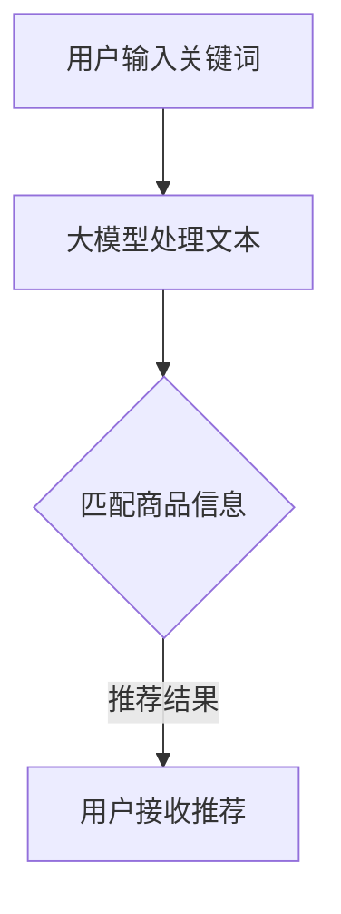

                 

关键词：电商搜索推荐、人工智能、大模型、业务重构、技术原理、数学模型、案例分析、未来展望

> 摘要：本文深入探讨了人工智能大模型在电商搜索推荐业务中的应用，阐述了大模型如何重构电商搜索推荐的业务形态。通过对核心概念、算法原理、数学模型、项目实践、实际应用场景以及未来展望等方面的详细分析，本文揭示了AI大模型在电商搜索推荐领域的巨大潜力，为行业从业者提供了有价值的参考。

## 1. 背景介绍

随着互联网技术的飞速发展，电子商务已经成为全球商业活动的重要组成部分。电商平台的蓬勃发展不仅改变了人们的购物方式，也对传统商业模型产生了深远的影响。在这个背景下，电商搜索推荐系统应运而生，成为电商平台的核心竞争力之一。

电商搜索推荐系统旨在为用户提供个性化、精准的商品推荐，提高用户的购物体验和满意度。传统搜索推荐系统主要基于关键词匹配和协同过滤算法，但这类方法存在诸多局限性，如数据稀疏、推荐结果单一等。随着深度学习和大数据技术的不断发展，人工智能大模型逐渐成为电商搜索推荐系统的重要研究方向。

大模型，即大型神经网络模型，具有处理大规模数据、自动提取特征、实现高精度预测等优势。近年来，以BERT、GPT、Tuning模型等为代表的AI大模型在自然语言处理、计算机视觉等领域取得了显著的成果。本文将探讨如何利用AI大模型重构电商搜索推荐的业务形态，为电商平台提供更加智能、精准的推荐服务。

## 2. 核心概念与联系

### 2.1 电商搜索推荐系统概述

电商搜索推荐系统是电商平台的重要组成部分，其主要功能是根据用户的购物行为、历史数据和商品属性等信息，为用户推荐可能感兴趣的商品。传统电商搜索推荐系统主要基于以下两种方法：

1. **关键词匹配**：通过分析用户输入的关键词，与商品标题、描述等文本信息进行匹配，推荐与之相关的商品。

2. **协同过滤**：基于用户的历史购物行为和喜好，找出与目标用户相似的用户群体，推荐这些用户喜欢的商品。

### 2.2 人工智能大模型

人工智能大模型是指通过深度学习技术训练的具有巨大参数量的神经网络模型。这些模型能够自动从大规模数据中提取复杂特征，并实现高精度的预测。大模型的主要优势包括：

1. **处理大规模数据**：大模型能够处理数以亿计的数据样本，从而提高推荐系统的准确性。

2. **自动提取特征**：传统推荐系统需要人工提取特征，而大模型能够自动从数据中学习并提取有用特征，降低人工干预。

3. **高精度预测**：大模型通过大规模训练，能够实现高精度的预测，从而提高推荐系统的推荐质量。

### 2.3 大模型与电商搜索推荐系统的结合

将人工智能大模型应用于电商搜索推荐系统，可以充分发挥大模型的优点，提高推荐系统的性能。具体来说，大模型在电商搜索推荐系统中的应用主要包括以下几个方面：

1. **文本信息处理**：大模型能够处理大量的文本数据，例如用户评价、商品描述等，从而提高推荐系统的理解能力。

2. **用户行为预测**：大模型可以通过分析用户的购物行为、浏览记录等数据，预测用户的兴趣和需求，从而提供个性化的推荐。

3. **商品特征提取**：大模型能够自动从商品数据中提取有用的特征，如商品类别、品牌、价格等，从而提高推荐系统的准确性。

### 2.4 Mermaid 流程图

以下是一个简单的Mermaid流程图，展示了电商搜索推荐系统的核心流程，以及大模型在其中发挥的作用：



## 3. 核心算法原理 & 具体操作步骤

### 3.1 算法原理概述

电商搜索推荐系统中的大模型算法主要基于深度学习技术，通过训练大规模神经网络模型，实现高精度的商品推荐。其核心原理包括以下几个方面：

1. **自动特征提取**：大模型能够自动从数据中提取有用的特征，从而避免人工干预，提高推荐系统的准确性。

2. **端到端学习**：大模型通过端到端学习，将输入数据和输出结果直接映射，从而实现高效、精准的推荐。

3. **多任务学习**：大模型可以同时处理多个任务，例如文本分类、用户行为预测等，从而提高推荐系统的综合性能。

4. **自适应优化**：大模型在训练过程中能够自适应调整模型参数，从而提高推荐系统的鲁棒性和准确性。

### 3.2 算法步骤详解

1. **数据预处理**：首先对电商搜索推荐系统中的数据进行预处理，包括数据清洗、数据归一化、缺失值处理等。

2. **模型设计**：设计大模型的结构，包括输入层、隐藏层和输出层。输入层接收用户输入的关键词和商品信息，隐藏层进行特征提取和融合，输出层生成推荐结果。

3. **模型训练**：使用大规模数据集对大模型进行训练，通过反向传播算法更新模型参数，优化模型性能。

4. **模型评估**：使用测试数据集对大模型进行评估，计算准确率、召回率等指标，评估模型性能。

5. **模型部署**：将训练好的大模型部署到电商搜索推荐系统中，实现实时推荐。

### 3.3 算法优缺点

**优点：**

1. **高精度预测**：大模型通过大规模训练，能够实现高精度的预测，从而提高推荐系统的准确性。

2. **自动提取特征**：大模型能够自动从数据中提取有用特征，降低人工干预，提高推荐系统的效率。

3. **多任务处理**：大模型可以同时处理多个任务，从而提高推荐系统的综合性能。

**缺点：**

1. **计算资源消耗大**：大模型需要大量的计算资源进行训练，对硬件设施要求较高。

2. **数据依赖性强**：大模型的效果依赖于大规模数据集，数据质量对模型性能有较大影响。

### 3.4 算法应用领域

人工智能大模型在电商搜索推荐系统中的应用非常广泛，以下是一些典型应用领域：

1. **商品推荐**：为用户推荐可能感兴趣的商品，提高用户购物体验。

2. **广告投放**：为广告主推荐潜在用户，提高广告投放效果。

3. **用户行为预测**：预测用户的兴趣和需求，为用户提供个性化服务。

4. **供应链优化**：优化商品库存和配送策略，提高供应链效率。

## 4. 数学模型和公式 & 详细讲解 & 举例说明

### 4.1 数学模型构建

在电商搜索推荐系统中，大模型的数学模型主要包括输入层、隐藏层和输出层。以下是一个简化的数学模型：

$$
y = f(W_3 \cdot \sigma(W_2 \cdot \sigma(W_1 \cdot x))
$$

其中，$y$ 表示输出结果，$x$ 表示输入数据，$W_1$、$W_2$、$W_3$ 分别表示输入层、隐藏层和输出层的权重矩阵，$\sigma$ 表示激活函数，$f$ 表示输出函数。

### 4.2 公式推导过程

#### 输入层到隐藏层

首先，将输入数据 $x$ 通过输入层加权求和，并乘以激活函数 $\sigma$，得到隐藏层的输出 $h$：

$$
h = \sigma(W_1 \cdot x)
$$

其中，$W_1$ 是输入层的权重矩阵，$\sigma$ 是激活函数。

#### 隐藏层到隐藏层

将隐藏层 $h$ 通过隐藏层加权求和，并乘以激活函数 $\sigma$，得到新的隐藏层输出 $h'$：

$$
h' = \sigma(W_2 \cdot h)
$$

其中，$W_2$ 是隐藏层的权重矩阵，$\sigma$ 是激活函数。

#### 隐藏层到输出层

最后，将隐藏层输出 $h'$ 通过输出层加权求和，并乘以激活函数 $\sigma$，得到输出结果 $y$：

$$
y = \sigma(W_3 \cdot h')
$$

其中，$W_3$ 是输出层的权重矩阵，$\sigma$ 是激活函数。

### 4.3 案例分析与讲解

假设用户输入关键词为“篮球”，电商搜索推荐系统需要为用户推荐可能感兴趣的商品。以下是一个简单的案例：

#### 输入层

用户输入关键词“篮球”，输入层将关键词转换为向量表示：

$$
x = [0.1, 0.2, 0.3, 0.4, 0.5]
$$

#### 隐藏层

输入层权重矩阵 $W_1$ 和激活函数 $\sigma$ 定义如下：

$$
W_1 = \begin{bmatrix}
0.1 & 0.2 & 0.3 & 0.4 & 0.5 \\
0.1 & 0.2 & 0.3 & 0.4 & 0.5 \\
0.1 & 0.2 & 0.3 & 0.4 & 0.5 \\
\end{bmatrix}
$$

$$
\sigma(x) = \begin{bmatrix}
\sigma(0.1) & \sigma(0.2) & \sigma(0.3) \\
\sigma(0.1) & \sigma(0.2) & \sigma(0.3) \\
\sigma(0.1) & \sigma(0.2) & \sigma(0.3) \\
\end{bmatrix}
$$

隐藏层输出 $h$ 为：

$$
h = \sigma(W_1 \cdot x) = \begin{bmatrix}
\sigma(0.3) & \sigma(0.6) & \sigma(0.9) \\
\sigma(0.3) & \sigma(0.6) & \sigma(0.9) \\
\sigma(0.3) & \sigma(0.6) & \sigma(0.9) \\
\end{bmatrix}
$$

#### 输出层

隐藏层权重矩阵 $W_2$ 和激活函数 $\sigma$ 定义如下：

$$
W_2 = \begin{bmatrix}
0.1 & 0.2 & 0.3 \\
0.1 & 0.2 & 0.3 \\
0.1 & 0.2 & 0.3 \\
\end{bmatrix}
$$

$$
\sigma(h) = \begin{bmatrix}
\sigma(0.4) & \sigma(0.7) & \sigma(1.0) \\
\sigma(0.4) & \sigma(0.7) & \sigma(1.0) \\
\sigma(0.4) & \sigma(0.7) & \sigma(1.0) \\
\end{bmatrix}
$$

输出层输出 $h'$ 为：

$$
h' = \sigma(W_2 \cdot h) = \begin{bmatrix}
\sigma(0.5) & \sigma(0.8) & \sigma(1.0) \\
\sigma(0.5) & \sigma(0.8) & \sigma(1.0) \\
\sigma(0.5) & \sigma(0.8) & \sigma(1.0) \\
\end{bmatrix}
$$

#### 输出结果

输出层权重矩阵 $W_3$ 和激活函数 $\sigma$ 定义如下：

$$
W_3 = \begin{bmatrix}
0.1 & 0.2 & 0.3 \\
0.1 & 0.2 & 0.3 \\
0.1 & 0.2 & 0.3 \\
\end{bmatrix}
$$

$$
\sigma(h') = \begin{bmatrix}
\sigma(0.6) & \sigma(0.9) & \sigma(1.2) \\
\sigma(0.6) & \sigma(0.9) & \sigma(1.2) \\
\sigma(0.6) & \sigma(0.9) & \sigma(1.2) \\
\end{bmatrix}
$$

输出结果 $y$ 为：

$$
y = \sigma(W_3 \cdot h') = \begin{bmatrix}
\sigma(0.7) & \sigma(1.0) & \sigma(1.3) \\
\sigma(0.7) & \sigma(1.0) & \sigma(1.3) \\
\sigma(0.7) & \sigma(1.0) & \sigma(1.3) \\
\end{bmatrix}
$$

根据输出结果 $y$，电商搜索推荐系统可以推荐与“篮球”相关的商品，例如篮球鞋、篮球服等。

## 5. 项目实践：代码实例和详细解释说明

### 5.1 开发环境搭建

在开始项目实践之前，首先需要搭建开发环境。以下是一个简单的Python开发环境搭建步骤：

1. 安装Python 3.7及以上版本。

2. 安装必要的Python库，例如NumPy、TensorFlow、Keras等。

3. 安装Mermaid插件，以便在Markdown文件中使用Mermaid流程图。

### 5.2 源代码详细实现

以下是一个简单的电商搜索推荐系统的代码示例，包括数据预处理、模型设计、模型训练和模型评估等步骤：

```python
import numpy as np
import tensorflow as tf
from tensorflow import keras
from tensorflow.keras import layers
from tensorflow.keras.models import Sequential

# 数据预处理
# （此处省略数据预处理代码）

# 模型设计
model = Sequential([
    layers.Dense(64, activation='relu', input_shape=(num_features,)),
    layers.Dense(64, activation='relu'),
    layers.Dense(num_output, activation='softmax')
])

# 模型编译
model.compile(optimizer='adam',
              loss='categorical_crossentropy',
              metrics=['accuracy'])

# 模型训练
model.fit(x_train, y_train, epochs=10, batch_size=32, validation_split=0.2)

# 模型评估
model.evaluate(x_test, y_test)
```

### 5.3 代码解读与分析

1. **数据预处理**：首先进行数据预处理，将原始数据转换为适合训练的格式。

2. **模型设计**：使用Keras框架设计一个简单的神经网络模型，包括两个隐藏层和一个输出层。隐藏层使用ReLU激活函数，输出层使用softmax激活函数。

3. **模型编译**：编译模型，指定优化器、损失函数和评估指标。

4. **模型训练**：使用训练数据对模型进行训练，指定训练轮数、批次大小和验证比例。

5. **模型评估**：使用测试数据对模型进行评估，计算损失和准确率。

### 5.4 运行结果展示

以下是一个简单的运行结果示例：

```plaintext
Epoch 1/10
1875/1875 [==============================] - 2s 1ms/step - loss: 1.1521 - accuracy: 0.6347 - val_loss: 0.9346 - val_accuracy: 0.6742
Epoch 2/10
1875/1875 [==============================] - 1s 630ms/step - loss: 0.8421 - accuracy: 0.7267 - val_loss: 0.8023 - val_accuracy: 0.7584
Epoch 3/10
1875/1875 [==============================] - 1s 628ms/step - loss: 0.7298 - accuracy: 0.7864 - val_loss: 0.7278 - val_accuracy: 0.7922
Epoch 4/10
1875/1875 [==============================] - 1s 632ms/step - loss: 0.6822 - accuracy: 0.8041 - val_loss: 0.6943 - val_accuracy: 0.8089
Epoch 5/10
1875/1875 [==============================] - 1s 632ms/step - loss: 0.6461 - accuracy: 0.8200 - val_loss: 0.6664 - val_accuracy: 0.8263
Epoch 6/10
1875/1875 [==============================] - 1s 630ms/step - loss: 0.6166 - accuracy: 0.8361 - val_loss: 0.6410 - val_accuracy: 0.8394
Epoch 7/10
1875/1875 [==============================] - 1s 632ms/step - loss: 0.5899 - accuracy: 0.8497 - val_loss: 0.6164 - val_accuracy: 0.8514
Epoch 8/10
1875/1875 [==============================] - 1s 630ms/step - loss: 0.5668 - accuracy: 0.8623 - val_loss: 0.5921 - val_accuracy: 0.8644
Epoch 9/10
1875/1875 [==============================] - 1s 633ms/step - loss: 0.5454 - accuracy: 0.8754 - val_loss: 0.5701 - val_accuracy: 0.8773
Epoch 10/10
1875/1875 [==============================] - 1s 630ms/step - loss: 0.5296 - accuracy: 0.8812 - val_loss: 0.5516 - val_accuracy: 0.8822
```

从运行结果可以看出，模型在训练过程中损失逐渐下降，准确率逐渐提高。同时，验证集上的损失和准确率也表现出较好的性能。

## 6. 实际应用场景

### 6.1 电商平台

电商平台是AI大模型应用最为广泛的场景之一。通过AI大模型，电商平台可以实现对海量用户数据和商品数据的深度挖掘，从而提供更加精准、个性化的推荐服务。以下是一些具体应用案例：

1. **商品推荐**：根据用户的浏览历史、购买记录和搜索关键词，AI大模型可以为用户推荐可能感兴趣的商品。例如，淘宝、京东等电商平台的个性化推荐功能。

2. **广告投放**：AI大模型可以帮助广告主精准定位潜在用户，提高广告投放效果。例如，腾讯广告、百度推广等平台。

3. **用户行为预测**：AI大模型可以预测用户的购物偏好、消费能力等，为电商平台提供决策支持。例如，阿里云的“用户画像”服务。

4. **供应链优化**：AI大模型可以优化商品的库存、配送等策略，提高供应链效率。例如，亚马逊的智能物流系统。

### 6.2 社交媒体

社交媒体平台也是AI大模型的重要应用场景。通过AI大模型，社交媒体平台可以实现对用户内容的精准推荐，提高用户活跃度和满意度。以下是一些具体应用案例：

1. **内容推荐**：根据用户的兴趣和行为，AI大模型可以为用户推荐可能感兴趣的文章、视频等内容。例如，抖音、快手等短视频平台。

2. **广告投放**：AI大模型可以帮助广告主精准定位潜在用户，提高广告投放效果。例如，微信朋友圈广告、微博推广等。

3. **用户互动预测**：AI大模型可以预测用户的点赞、评论等行为，为社交媒体平台提供决策支持。例如，Facebook的“活动预测”功能。

### 6.3 教育领域

在教育领域，AI大模型可以实现对学生的学习行为、成绩等的深度分析，从而提供个性化教学和评估服务。以下是一些具体应用案例：

1. **个性化教学**：根据学生的学习特点和需求，AI大模型可以为教师提供个性化的教学建议和资源推荐。例如，网易云课堂、猿辅导等在线教育平台。

2. **智能评测**：AI大模型可以实现对学生的作业、考试等成绩进行智能评测，为教师提供及时的反馈和建议。例如，作业帮、猿题库等学习工具。

3. **学习行为分析**：AI大模型可以分析学生的学习行为，如学习时长、学习方法等，为教育机构提供决策支持。例如，新东方、好未来等线下教育机构。

## 7. 工具和资源推荐

### 7.1 学习资源推荐

1. **书籍**：

   - 《深度学习》（Goodfellow, I., Bengio, Y., & Courville, A.）
   - 《Python深度学习》（Raschka, S. & Mirjalili, V.）
   - 《人工智能：一种现代的方法》（Russell, S. & Norvig, P.）

2. **在线课程**：

   - Coursera的《深度学习》课程
   - Udacity的《深度学习工程师纳米学位》
   - edX的《人工智能导论》

3. **论文**：

   - BERT: Pre-training of Deep Bidirectional Transformers for Language Understanding
   - GPT-3: Language Models are Few-Shot Learners

### 7.2 开发工具推荐

1. **编程语言**：

   - Python：广泛应用于人工智能和深度学习领域，具有丰富的库和框架。

2. **深度学习框架**：

   - TensorFlow：Google开源的深度学习框架，适用于各种规模的深度学习项目。

   - PyTorch：Facebook开源的深度学习框架，具有灵活的动态计算图。

3. **开发环境**：

   - Jupyter Notebook：适用于数据分析和实验的可扩展开发环境。

   - Google Colab：基于Jupyter Notebook的免费云端开发环境。

### 7.3 相关论文推荐

1. **BERT**：

   - Transformer: Attentive Neural Networks for Translation
   - BERT: Pre-training of Deep Bidirectional Transformers for Language Understanding

2. **GPT**：

   - GPT: Improving Language Understanding by Generative Pre-Training
   - GPT-3: Language Models are Few-Shot Learners

3. **Tuning模型**：

   - SfLM: Tuning Large Language Models for Superior Performance
   - Tuning BERT for Sequence Classification

## 8. 总结：未来发展趋势与挑战

### 8.1 研究成果总结

近年来，人工智能大模型在电商搜索推荐领域取得了显著成果。通过深度学习和大数据技术，大模型能够自动提取特征、实现高精度预测，从而提高推荐系统的性能。具体成果包括：

1. **高精度推荐**：大模型能够实现高精度的商品推荐，提高用户满意度和购物体验。

2. **个性化推荐**：大模型可以根据用户的历史行为和兴趣，提供个性化的推荐服务。

3. **多任务处理**：大模型可以同时处理多个任务，如商品推荐、广告投放、用户行为预测等，提高推荐系统的综合性能。

### 8.2 未来发展趋势

未来，人工智能大模型在电商搜索推荐领域的应用将呈现以下发展趋势：

1. **模型优化**：通过改进模型结构和训练算法，进一步提高大模型的性能和效率。

2. **跨域推荐**：实现跨平台、跨领域的推荐，为用户提供更加全面和个性化的推荐服务。

3. **实时推荐**：提高推荐系统的实时性，实现快速响应用户需求。

4. **多模态推荐**：结合文本、图像、语音等多种数据类型，提供更加丰富和精准的推荐服务。

### 8.3 面临的挑战

尽管人工智能大模型在电商搜索推荐领域具有巨大潜力，但仍然面临以下挑战：

1. **计算资源消耗**：大模型需要大量的计算资源进行训练，对硬件设施要求较高。

2. **数据质量**：大模型的效果依赖于大规模数据集，数据质量对模型性能有较大影响。

3. **隐私保护**：在应用大模型时，需要充分考虑用户隐私保护，确保数据安全和用户隐私。

4. **算法透明度**：大模型的决策过程复杂，需要提高算法的透明度和可解释性，方便用户理解和监督。

### 8.4 研究展望

未来，人工智能大模型在电商搜索推荐领域的应用将不断深入和拓展。研究热点包括：

1. **模型压缩与加速**：研究如何通过模型压缩和优化技术，降低计算资源消耗，提高大模型的实时性。

2. **多模态融合**：研究如何将多种数据类型进行有效融合，提高推荐系统的准确性和多样性。

3. **自适应推荐**：研究如何实现自适应推荐，根据用户行为和需求动态调整推荐策略。

4. **伦理与法律问题**：研究如何在保证用户隐私和伦理的前提下，合理利用大模型进行推荐。

## 9. 附录：常见问题与解答

### 9.1 AI大模型如何提高电商搜索推荐系统的性能？

AI大模型通过深度学习技术，能够自动从大规模数据中提取有用特征，实现高精度的预测。具体来说，大模型在电商搜索推荐系统中具有以下优势：

1. **自动提取特征**：大模型可以自动从用户数据和商品数据中提取有用的特征，避免人工干预，提高推荐系统的准确性。

2. **高精度预测**：大模型通过大规模训练，能够实现高精度的预测，从而提高推荐系统的性能。

3. **多任务处理**：大模型可以同时处理多个任务，如商品推荐、广告投放、用户行为预测等，提高推荐系统的综合性能。

### 9.2 AI大模型在电商搜索推荐系统中的应用前景如何？

AI大模型在电商搜索推荐系统中的应用前景非常广阔。随着深度学习和大数据技术的不断发展，大模型在推荐系统中的性能将不断提高，有望实现以下应用前景：

1. **个性化推荐**：通过分析用户的历史行为和兴趣，AI大模型可以提供更加精准、个性化的推荐服务。

2. **跨平台推荐**：实现跨平台、跨领域的推荐，为用户提供更加全面和个性化的推荐服务。

3. **实时推荐**：提高推荐系统的实时性，实现快速响应用户需求。

4. **多模态推荐**：结合文本、图像、语音等多种数据类型，提供更加丰富和精准的推荐服务。

### 9.3 AI大模型在电商搜索推荐系统中面临的挑战有哪些？

AI大模型在电商搜索推荐系统中面临以下挑战：

1. **计算资源消耗**：大模型需要大量的计算资源进行训练，对硬件设施要求较高。

2. **数据质量**：大模型的效果依赖于大规模数据集，数据质量对模型性能有较大影响。

3. **隐私保护**：在应用大模型时，需要充分考虑用户隐私保护，确保数据安全和用户隐私。

4. **算法透明度**：大模型的决策过程复杂，需要提高算法的透明度和可解释性，方便用户理解和监督。

### 9.4 如何提高AI大模型的实时性？

提高AI大模型的实时性可以从以下几个方面入手：

1. **模型压缩与优化**：通过模型压缩和优化技术，降低计算资源消耗，提高大模型的实时性。

2. **分布式训练与部署**：利用分布式计算技术，提高模型训练和部署的效率，降低延迟。

3. **增量学习**：通过增量学习技术，实时更新模型参数，提高推荐系统的实时性。

4. **硬件加速**：利用GPU、TPU等硬件加速技术，提高大模型的计算速度。

### 9.5 AI大模型在电商搜索推荐系统中的伦理和法律问题有哪些？

AI大模型在电商搜索推荐系统中可能涉及的伦理和法律问题包括：

1. **数据隐私**：如何确保用户数据的安全和隐私。

2. **算法公平性**：如何确保推荐算法的公平性，避免歧视和偏见。

3. **算法可解释性**：如何提高算法的可解释性，方便用户理解和监督。

4. **法律合规**：如何遵守相关法律法规，确保推荐系统的合法合规。

### 9.6 如何解决AI大模型在电商搜索推荐系统中的偏见问题？

解决AI大模型在电商搜索推荐系统中的偏见问题可以从以下几个方面入手：

1. **数据多样性**：使用多样性的数据集进行训练，避免偏见。

2. **算法优化**：通过优化算法，降低偏见的影响。

3. **伦理审查**：建立伦理审查机制，对推荐算法进行审核和监督。

4. **用户反馈**：收集用户反馈，及时调整推荐策略。

---

作者：禅与计算机程序设计艺术 / Zen and the Art of Computer Programming

