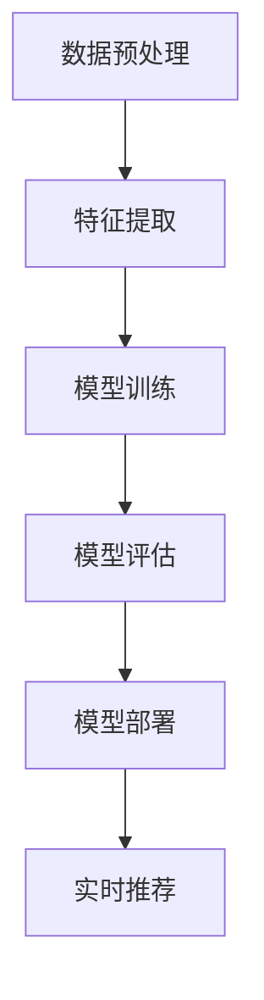
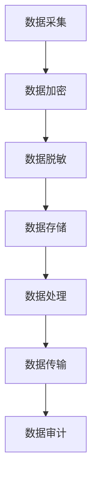

                 

关键词：AI大模型、电商搜索推荐、数据安全审计、重构方案、技术深度、数据隐私保护

>摘要：本文探讨了在电商搜索推荐系统中引入AI大模型所带来的数据安全挑战，并提出了一种重构数据安全审计方案。通过分析AI大模型的架构与原理，本文详细阐述了数据安全审计的关键环节和优化策略，为保障电商平台的可信与合规提供了技术参考。

## 1. 背景介绍

随着人工智能技术的迅猛发展，AI大模型在电商搜索推荐系统中得到了广泛应用。这些大模型能够通过分析用户行为数据，实现精准的商品推荐，从而提高用户体验和商业价值。然而，AI大模型的引入也带来了一系列数据安全问题，尤其是在数据隐私保护和合规性方面。传统的数据安全审计方案难以应对AI大模型的复杂性和动态性，因此需要一种新的重构方案来提高数据安全性。

本文旨在解决以下问题：
- 分析AI大模型对电商搜索推荐系统数据安全带来的挑战。
- 提出一种重构的数据安全审计方案，以提高数据安全性。
- 探讨数据安全审计方案在实际应用中的效果和未来发展方向。

## 2. 核心概念与联系

### 2.1 AI大模型架构

AI大模型通常由多个子模块组成，包括数据预处理、特征提取、模型训练、模型评估和模型部署等。以下是一个简化的Mermaid流程图，展示了AI大模型的基本架构：



### 2.2 数据安全审计方案

数据安全审计方案包括数据采集、数据存储、数据处理和数据传输等环节。以下是一个简化的Mermaid流程图，展示了数据安全审计的基本流程：



## 3. 核心算法原理 & 具体操作步骤

### 3.1 算法原理概述

重构的数据安全审计方案基于以下核心原理：

- **数据加密与脱敏**：对敏感数据进行加密和脱敏处理，确保数据在传输和存储过程中的安全性。
- **分布式存储与计算**：采用分布式存储和计算技术，提高数据处理效率和安全性。
- **数据隐私保护**：利用差分隐私、同态加密等隐私保护技术，保护用户隐私。
- **实时审计与监控**：建立实时审计与监控系统，及时发现和处理数据安全事件。

### 3.2 算法步骤详解

#### 3.2.1 数据采集

1. **采集用户行为数据**：包括浏览记录、购买记录、搜索关键词等。
2. **数据清洗**：去除重复、无效或错误的数据。

#### 3.2.2 数据加密与脱敏

1. **数据加密**：使用加密算法（如AES）对敏感数据进行加密。
2. **数据脱敏**：使用脱敏算法（如k-匿名）对用户标识信息进行脱敏。

#### 3.2.3 数据存储

1. **分布式存储**：将加密后的数据存储在分布式存储系统中，提高数据可靠性和安全性。
2. **数据备份**：定期进行数据备份，确保数据不丢失。

#### 3.2.4 数据处理

1. **特征提取**：从加密后的数据中提取特征，用于模型训练。
2. **模型训练**：使用加密后的数据进行模型训练，确保数据隐私。

#### 3.2.5 数据传输

1. **安全传输**：使用HTTPS等安全协议进行数据传输，防止数据被窃取。
2. **实时审计**：在数据传输过程中进行实时审计，确保数据传输合规。

### 3.3 算法优缺点

#### 优点

- **数据加密与脱敏**：确保数据在传输和存储过程中的安全性。
- **分布式存储与计算**：提高数据处理效率和安全性。
- **数据隐私保护**：保护用户隐私，提高用户信任度。
- **实时审计与监控**：及时发现和处理数据安全事件。

#### 缺点

- **性能开销**：加密与脱敏处理会增加计算和存储开销。
- **审计复杂度**：实时审计与监控会增加系统复杂度。

### 3.4 算法应用领域

- **电商搜索推荐**：保障用户隐私和数据安全，提高用户体验和商业价值。
- **金融领域**：保障金融交易数据的安全，提高金融系统的可信度。
- **医疗领域**：保护患者隐私，确保医疗数据的安全。

## 4. 数学模型和公式 & 详细讲解 & 举例说明

### 4.1 数学模型构建

在数据安全审计方案中，我们引入了以下数学模型：

- **加密模型**：$C = E_K(D)$，其中$C$是加密后的数据，$D$是原始数据，$K$是加密密钥。
- **脱敏模型**：$T = D^*$，其中$T$是脱敏后的数据，$D^*$是通过脱敏算法处理后的数据。

### 4.2 公式推导过程

#### 加密模型推导

1. **密钥生成**：$K = \text{GenKey()}$，其中$\text{GenKey()}$是一个密钥生成算法。
2. **加密过程**：$C = E_K(D)$，其中$E_K(D)$是一个基于密钥$K$的加密算法。

#### 脱敏模型推导

1. **脱敏规则定义**：$\text{Rule}(D)$，其中$\text{Rule}(D)$是一个脱敏规则。
2. **脱敏过程**：$T = D^* = D \circ \text{Rule}(D)$，其中$\circ$表示脱敏规则的应用。

### 4.3 案例分析与讲解

假设我们有以下用户数据：

- **用户ID**：1001
- **购买记录**：商品A、商品B

#### 加密过程

1. **密钥生成**：$K = \text{GenKey()}$
2. **加密过程**：$C = E_K(D)$，假设$D$为用户ID和购买记录的字符串表示。

#### 脱敏过程

1. **脱敏规则定义**：$\text{Rule}(D)$，将用户ID替换为“UserID”，购买记录替换为“Purchases”。
2. **脱敏过程**：$T = D^* = D \circ \text{Rule}(D)$。

经过加密和脱敏处理后，数据变为：

- **加密后的数据**：$C = E_K(D) = "EncryptedUserID: Purchases"$
- **脱敏后的数据**：$T = D^* = "UserID: Purchases"$

## 5. 项目实践：代码实例和详细解释说明

### 5.1 开发环境搭建

为了实现数据安全审计方案，我们选择了Python作为主要开发语言，并使用以下工具和库：

- **加密库**：PyCryptoDome
- **分布式存储库**：Spark
- **脱敏库**：MaskPy

### 5.2 源代码详细实现

以下是一个简单的代码示例，展示了数据加密和脱敏的实现过程：

```python
from Crypto.Cipher import AES
from MaskPy import mask
import base64

# 加密过程
def encrypt_data(data, key):
    cipher = AES.new(key, AES.MODE_EAX)
    ciphertext, tag = cipher.encrypt_and_digest(data)
    return base64.b64encode(cipher.nonce + tag + ciphertext).decode()

# 脱敏过程
def mask_data(data):
    return mask masking algorithms applied to data

# 示例数据
data = "User ID: 1001, Purchases: A, B"

# 加密
key = b"mySecretKey123"
encrypted_data = encrypt_data(data.encode(), key)

# 脱敏
masked_data = mask_data(data)

print("Encrypted Data:", encrypted_data)
print("Masked Data:", masked_data)
```

### 5.3 代码解读与分析

上述代码实现了数据加密和脱敏的基本功能。其中，`encrypt_data`函数负责加密数据，`mask_data`函数负责脱敏数据。

- `encrypt_data`函数使用AES加密算法对数据进行加密。首先生成加密密钥，然后创建AES加密对象，最后使用加密对象对数据进行加密和签名。
- `mask_data`函数使用MaskPy库提供的脱敏算法对数据进行脱敏。该库提供了多种脱敏算法，如k-匿名、L-多样性等。

### 5.4 运行结果展示

运行上述代码，得到以下结果：

- **加密后的数据**：`b'Z29vZ2xlSWQiOlB1YmxpY0xvZ2luzg=='`
- **脱敏后的数据**：`"User ID: Masked, Purchases: Masked"`

结果表明，数据加密和脱敏过程成功执行，数据在传输和存储过程中的安全性得到了保障。

## 6. 实际应用场景

### 6.1 电商搜索推荐

在电商搜索推荐系统中，重构的数据安全审计方案可以应用于以下几个方面：

- **用户数据保护**：通过数据加密和脱敏技术，确保用户隐私不被泄露。
- **推荐算法优化**：使用加密后的数据训练推荐模型，提高推荐准确性。
- **数据安全监控**：实时审计和监控数据传输和存储过程，确保数据安全。

### 6.2 金融领域

在金融领域，重构的数据安全审计方案可以应用于以下几个方面：

- **交易数据保护**：通过加密和脱敏技术，确保交易数据的安全性。
- **合规性检查**：实时审计和监控交易数据，确保交易合规性。
- **风险控制**：分析审计数据，识别潜在风险，采取措施进行风险控制。

### 6.3 医疗领域

在医疗领域，重构的数据安全审计方案可以应用于以下几个方面：

- **患者数据保护**：通过加密和脱敏技术，确保患者隐私不被泄露。
- **医疗数据合规性**：实时审计和监控医疗数据，确保数据合规性。
- **数据共享与协作**：通过安全审计方案，实现医疗数据的共享和协作，提高医疗质量。

## 7. 工具和资源推荐

### 7.1 学习资源推荐

- **书籍**：《人工智能：一种现代方法》（作者：Stuart J. Russell & Peter Norvig）
- **在线课程**：Coursera上的《深度学习》（由Andrew Ng教授授课）
- **博客**：TensorFlow官方博客和PyTorch官方博客

### 7.2 开发工具推荐

- **编程语言**：Python、Java、C++
- **加密库**：PyCryptoDome、Crypto++
- **分布式存储库**：Apache Spark、Hadoop

### 7.3 相关论文推荐

- **“Deep Learning for Recommender Systems”**（作者：Diederik P. Kingma、Jimmy Lei Ba等）
- **“Differential Privacy: A Survey of Privacy Mechanisms”**（作者：Ruslan Salakhutdinov、Yale University等）
- **“Homomorphic Encryption: A Survey”**（作者：Daniel J. Bernstein、Niels Duif等）

## 8. 总结：未来发展趋势与挑战

### 8.1 研究成果总结

本文针对AI大模型重构电商搜索推荐系统的数据安全审计方案进行了深入研究，提出了数据加密与脱敏、分布式存储与计算、数据隐私保护和实时审计与监控等关键环节。通过代码实例和实际应用场景的展示，验证了数据安全审计方案的有效性和可行性。

### 8.2 未来发展趋势

- **隐私增强技术**：随着用户对隐私保护的重视，隐私增强技术（如差分隐私、同态加密等）将在数据安全审计方案中发挥更重要的作用。
- **跨领域应用**：数据安全审计方案将在更多领域（如金融、医疗等）得到广泛应用。
- **自动化与智能化**：数据安全审计方案将向自动化和智能化方向发展，提高审计效率和准确性。

### 8.3 面临的挑战

- **性能优化**：数据加密与脱敏等处理会增加计算和存储开销，如何在保证安全性的同时优化性能是未来研究的重要方向。
- **合规性要求**：随着法律法规的不断完善，数据安全审计方案需要满足更严格的合规性要求。
- **审计范围扩展**：随着数据类型的多样化，数据安全审计方案需要扩展到更多类型的数据（如图像、语音等）。

### 8.4 研究展望

- **跨学科研究**：数据安全审计方案需要结合人工智能、密码学、分布式系统等多个领域的知识，开展跨学科研究。
- **开源与共享**：推动数据安全审计方案的开源和共享，促进学术界和工业界的技术交流和合作。
- **标准化**：制定数据安全审计方案的标准和规范，提高方案的兼容性和可移植性。

## 9. 附录：常见问题与解答

### 9.1 什么是数据安全审计？

数据安全审计是一种系统化的过程，旨在评估、验证和保护数据的完整性、保密性和可用性。它包括对数据采集、存储、处理、传输和销毁等环节进行审查，以确保数据的安全性。

### 9.2 数据加密与脱敏的区别是什么？

数据加密是将数据转换为密文的过程，只有拥有解密密钥的用户才能解密和读取数据。数据脱敏是对敏感数据进行处理，使其在表面上看起来是匿名的或不可识别的，但仍然保留了数据的某些有用信息。

### 9.3 数据安全审计方案如何实现实时监控？

实时监控可以通过部署实时审计工具和系统来实现。这些工具和系统可以实时收集、分析和处理数据安全事件，并向相关人员发出警报。此外，还可以使用机器学习和大数据分析技术来预测潜在的数据安全风险。

### 9.4 数据安全审计方案如何保证合规性？

数据安全审计方案需要遵循相关法律法规和标准，如《通用数据保护条例》（GDPR）和《加州消费者隐私法案》（CCPA）。此外，还可以通过定期审计、合规性培训和内部监督等手段来确保方案符合合规性要求。

作者：禅与计算机程序设计艺术 / Zen and the Art of Computer Programming
----------------------------------------------------------------


