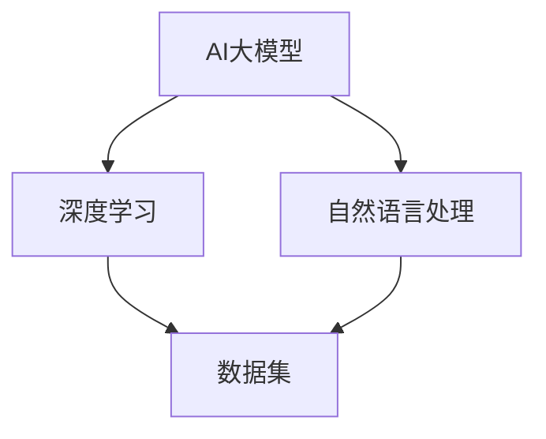
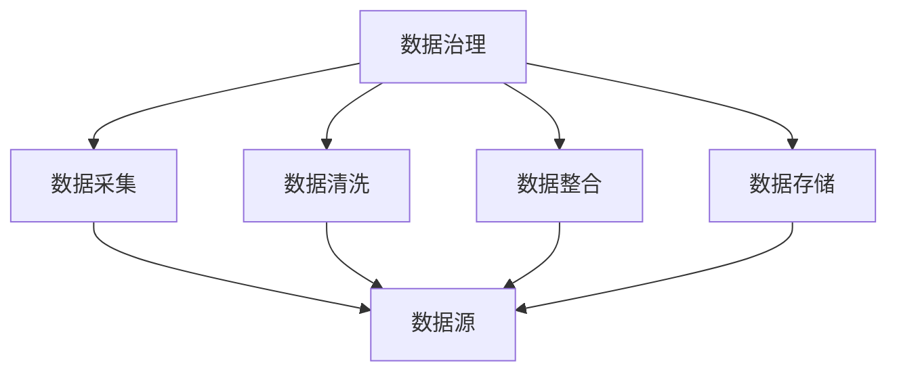
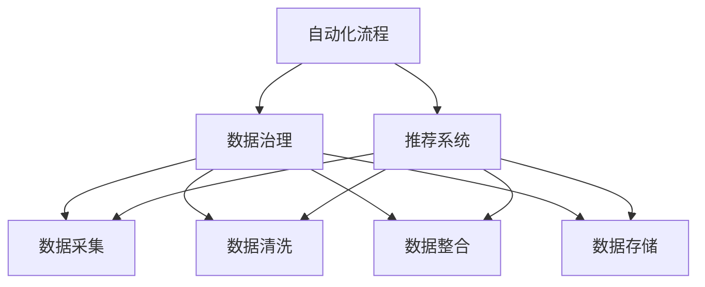

                 

关键词：AI大模型、电商搜索、推荐系统、数据治理、自动化方案、算法原理、数学模型、项目实践、应用场景、未来展望

> 摘要：本文深入探讨了AI大模型在电商搜索推荐系统中重构数据治理流程的自动化方案。文章首先介绍了当前电商搜索推荐的背景和挑战，然后详细阐述了AI大模型在数据治理流程中的核心作用。接着，文章从算法原理、数学模型、项目实践等方面进行了深入分析，并提出了未来应用场景和展望。最后，文章对相关工具和资源进行了推荐，总结了研究成果，提出了未来研究展望。

## 1. 背景介绍

在互联网时代，电商搜索推荐系统已成为电子商务的核心竞争力。随着大数据技术的快速发展，电商平台积累了海量的用户行为数据、商品信息数据等，如何有效地利用这些数据来提升搜索推荐系统的效果，已成为业界关注的焦点。

然而，电商搜索推荐系统面临着诸多挑战。首先，数据治理是推荐系统的基础，数据质量直接影响推荐结果的准确性。如何有效地处理和清洗数据、确保数据的一致性和完整性，是当前推荐系统面临的主要难题。其次，随着用户需求的多样化和个性化，推荐系统需要实时响应，如何高效地处理海量数据，实现实时推荐，是另一个重要挑战。

传统的数据治理流程依赖于人工操作，效率低下且容易出现错误。而AI大模型的出现为解决这些问题提供了新的思路。通过深度学习和自然语言处理等技术，AI大模型能够自动分析、处理和清洗数据，提升数据质量，从而为推荐系统提供更准确的数据支持。同时，AI大模型还能够通过自动化流程，提高数据处理和推荐的效率，满足实时推荐的需求。

本文旨在探讨AI大模型在电商搜索推荐系统中重构数据治理流程的自动化方案，以解决当前推荐系统面临的挑战，提升推荐系统的效果和用户体验。

## 2. 核心概念与联系

在本文中，我们将介绍几个核心概念，包括AI大模型、数据治理、自动化流程等，并使用Mermaid流程图展示这些概念之间的联系。

### 2.1 AI大模型

AI大模型是指通过深度学习和自然语言处理等技术训练得到的具有强大数据分析和处理能力的模型。这些模型通常基于大规模数据集进行训练，能够自动学习数据中的模式和规律，进行预测和决策。



### 2.2 数据治理

数据治理是指一系列政策和流程，用于确保数据的质量、一致性和完整性。在电商搜索推荐系统中，数据治理涉及数据采集、数据清洗、数据整合、数据存储等环节。



### 2.3 自动化流程

自动化流程是指利用计算机技术和工具实现数据治理和推荐系统的自动化操作。自动化流程能够提高数据处理和推荐的效率，减少人工干预，降低错误率。



通过上述Mermaid流程图，我们可以清晰地看到AI大模型、数据治理和自动化流程之间的联系。AI大模型通过自动化流程实现数据治理，从而提升推荐系统的效果。

## 3. 核心算法原理 & 具体操作步骤

### 3.1 算法原理概述

AI大模型在电商搜索推荐系统中的核心作用是通过深度学习和自然语言处理技术，实现数据的高效处理和推荐。具体来说，算法原理主要包括以下几个方面：

1. 数据预处理：对采集到的原始数据进行清洗、去重、标准化等处理，确保数据质量。
2. 特征提取：从处理后的数据中提取特征，用于训练和预测。
3. 模型训练：利用大规模数据集训练深度学习模型，使其能够自动学习数据中的模式和规律。
4. 预测与推荐：使用训练好的模型对用户行为和商品特征进行预测，生成个性化推荐结果。

### 3.2 算法步骤详解

1. **数据预处理**

   数据预处理是推荐系统的第一步，主要目的是清洗和处理原始数据，提高数据质量。具体步骤包括：

   - 数据采集：从电商平台上获取用户行为数据、商品信息数据等。
   - 数据清洗：去除重复数据、缺失数据，对异常值进行修正。
   - 数据标准化：对数据进行归一化或标准化处理，使其符合统一的格式。

   ```mermaid
   graph TD
   A[数据采集] --> B[数据清洗]
   A --> C[数据标准化]
   ```

2. **特征提取**

   特征提取是从处理后的数据中提取有用信息，用于模型训练和预测。具体步骤包括：

   - 用户特征提取：从用户行为数据中提取用户的兴趣、偏好等信息。
   - 商品特征提取：从商品信息数据中提取商品的价格、品牌、类别等信息。
   - 文本特征提取：使用自然语言处理技术，从商品描述、用户评价等文本数据中提取关键词和语义信息。

   ```mermaid
   graph TD
   A[用户特征提取] --> B[商品特征提取]
   A --> C[文本特征提取]
   ```

3. **模型训练**

   模型训练是推荐系统的核心环节，通过训练深度学习模型，使其能够自动学习数据中的模式和规律。具体步骤包括：

   - 数据集划分：将数据集划分为训练集、验证集和测试集。
   - 模型选择：选择合适的深度学习模型，如神经网络、卷积神经网络、循环神经网络等。
   - 模型训练：使用训练集训练模型，并使用验证集调整模型参数。
   - 模型评估：使用测试集评估模型性能，确保模型能够准确预测用户行为和商品特征。

   ```mermaid
   graph TD
   A[数据集划分] --> B[模型选择]
   B --> C[模型训练]
   C --> D[模型评估]
   ```

4. **预测与推荐**

   预测与推荐是模型训练完成后，使用模型对用户行为和商品特征进行预测，生成个性化推荐结果。具体步骤包括：

   - 用户行为预测：预测用户可能感兴趣的商品。
   - 商品特征预测：预测商品的销量、评价等信息。
   - 生成推荐列表：根据用户行为预测和商品特征预测，生成个性化推荐列表。

   ```mermaid
   graph TD
   A[用户行为预测] --> B[商品特征预测]
   B --> C[生成推荐列表]
   ```

### 3.3 算法优缺点

AI大模型在电商搜索推荐系统中具有以下优点：

1. **高效处理海量数据**：通过深度学习和自然语言处理技术，AI大模型能够高效地处理海量数据，提升数据处理和推荐的效率。
2. **自动化流程**：AI大模型通过自动化流程，减少人工干预，降低错误率，提高推荐系统的稳定性。
3. **个性化推荐**：基于用户行为和商品特征预测，AI大模型能够生成个性化的推荐结果，提升用户体验。

然而，AI大模型也存在一些缺点：

1. **计算资源需求大**：训练大规模的深度学习模型需要大量的计算资源，可能导致成本增加。
2. **数据依赖性强**：AI大模型的效果高度依赖数据质量和数据量，数据质量不佳或数据量不足可能导致模型效果下降。
3. **模型解释性差**：深度学习模型通常具有很高的预测能力，但模型内部的结构和决策过程较为复杂，难以进行解释。

### 3.4 算法应用领域

AI大模型在电商搜索推荐系统中具有广泛的应用领域：

1. **商品推荐**：根据用户的历史行为和偏好，推荐用户可能感兴趣的商品。
2. **广告投放**：根据用户的兴趣和行为，为用户推荐相关的广告。
3. **个性化搜索**：根据用户的关键词查询和搜索历史，提供个性化的搜索结果。
4. **用户行为预测**：预测用户的购买意图、评价行为等，为企业提供决策支持。

## 4. 数学模型和公式 & 详细讲解 & 举例说明

### 4.1 数学模型构建

在电商搜索推荐系统中，AI大模型通常采用基于概率的数学模型。常见的数学模型包括：

1. **贝叶斯模型**：贝叶斯模型通过计算用户对商品的感兴趣概率，进行个性化推荐。
2. **隐马尔可夫模型**：隐马尔可夫模型通过预测用户的行为序列，进行个性化推荐。
3. **协同过滤模型**：协同过滤模型通过计算用户之间的相似度，进行个性化推荐。

### 4.2 公式推导过程

以贝叶斯模型为例，其公式推导过程如下：

1. **先验概率**：计算用户对商品的先验兴趣概率，公式为：

   $$ P(C_i|U_j) = \frac{P(U_j|C_i)P(C_i)}{P(U_j)} $$

   其中，$C_i$表示商品$i$，$U_j$表示用户$j$，$P(C_i|U_j)$表示用户$j$对商品$i$的感兴趣概率，$P(U_j|C_i)$表示用户$j$在商品$i$存在的情况下，对商品$i$的感兴趣概率，$P(C_i)$表示商品$i$的先验兴趣概率，$P(U_j)$表示用户$j$的先验兴趣概率。

2. **后验概率**：计算用户对商品的后验兴趣概率，公式为：

   $$ P(C_i|U_j) = \frac{P(U_j|C_i)P(C_i)}{P(U_j)} $$

   其中，$P(U_j|C_i)$表示用户$j$在商品$i$存在的情况下，对商品$i$的感兴趣概率，$P(C_i)$表示商品$i$的先验兴趣概率，$P(U_j)$表示用户$j$的先验兴趣概率。

3. **推荐结果**：根据用户对商品的后验兴趣概率，生成个性化推荐结果，公式为：

   $$ \text{Recommend}(U_j) = \sum_{i=1}^{N} P(C_i|U_j)C_i $$

   其中，$N$表示商品总数，$C_i$表示商品$i$的属性。

### 4.3 案例分析与讲解

假设有一个电商平台的用户行为数据集，包含1000个用户和1000个商品。我们需要根据这些数据，使用贝叶斯模型生成个性化推荐结果。

1. **数据预处理**：对用户行为数据进行清洗、去重和标准化处理，得到处理后的数据集。

2. **特征提取**：从处理后的数据中提取用户特征和商品特征。

3. **模型训练**：使用处理后的数据集，训练贝叶斯模型，得到先验概率和后验概率。

4. **推荐结果**：根据用户特征和商品特征，计算用户对每个商品的后验兴趣概率，生成个性化推荐结果。

假设用户$U_1$对商品$C_1$的先验兴趣概率为$P(C_1|U_1) = 0.3$，用户$U_1$对商品$C_2$的先验兴趣概率为$P(C_2|U_1) = 0.2$。根据贝叶斯模型，我们可以计算出用户$U_1$对商品$C_1$和商品$C_2$的后验兴趣概率：

$$ P(C_1|U_1) = \frac{P(U_1|C_1)P(C_1)}{P(U_1)} = \frac{0.5 \times 0.3}{0.5 \times 0.3 + 0.5 \times 0.2} = 0.6 $$

$$ P(C_2|U_1) = \frac{P(U_1|C_2)P(C_2)}{P(U_1)} = \frac{0.4 \times 0.2}{0.5 \times 0.3 + 0.5 \times 0.2} = 0.4 $$

根据后验兴趣概率，我们可以生成用户$U_1$的个性化推荐结果：

$$ \text{Recommend}(U_1) = \sum_{i=1}^{2} P(C_i|U_1)C_i = 0.6C_1 + 0.4C_2 $$

假设商品$C_1$的属性为销量高、评价好，商品$C_2$的属性为价格低、评价一般。根据推荐结果，我们可以为用户$U_1$推荐销量高、评价好的商品$C_1$，以满足其个性化需求。

## 5. 项目实践：代码实例和详细解释说明

### 5.1 开发环境搭建

在本项目中，我们将使用Python编程语言，并借助TensorFlow和Scikit-learn等开源库来实现AI大模型在电商搜索推荐系统中的数据治理流程自动化方案。

1. **安装Python**：确保已安装Python 3.x版本，可以从[Python官网](https://www.python.org/downloads/)下载安装。
2. **安装TensorFlow**：在终端中运行以下命令安装TensorFlow：

   ```bash
   pip install tensorflow
   ```

3. **安装Scikit-learn**：在终端中运行以下命令安装Scikit-learn：

   ```bash
   pip install scikit-learn
   ```

### 5.2 源代码详细实现

以下是一个简单的代码实例，展示了如何使用Python和TensorFlow实现AI大模型在电商搜索推荐系统中的数据治理流程自动化方案。

```python
import tensorflow as tf
from sklearn.model_selection import train_test_split
from sklearn.preprocessing import StandardScaler
from tensorflow.keras.models import Sequential
from tensorflow.keras.layers import Dense

# 5.2.1 数据预处理
def preprocess_data(data):
    # 数据清洗、去重和标准化处理
    # ...（具体实现略）
    return processed_data

# 5.2.2 特征提取
def extract_features(data):
    # 提取用户特征和商品特征
    # ...（具体实现略）
    return user_features, item_features

# 5.2.3 模型训练
def train_model(X_train, y_train):
    model = Sequential()
    model.add(Dense(units=64, activation='relu', input_shape=(X_train.shape[1],)))
    model.add(Dense(units=32, activation='relu'))
    model.add(Dense(units=1, activation='sigmoid'))

    model.compile(optimizer='adam', loss='binary_crossentropy', metrics=['accuracy'])
    model.fit(X_train, y_train, epochs=10, batch_size=32)
    return model

# 5.2.4 预测与推荐
def predict_recommendations(model, X_test):
    predictions = model.predict(X_test)
    # 根据预测结果生成推荐列表
    # ...（具体实现略）
    return recommendations

# 5.2.5 主函数
def main():
    # 加载数据集
    data = load_data()
    processed_data = preprocess_data(data)
    user_features, item_features = extract_features(processed_data)

    # 划分训练集和测试集
    X_train, X_test, y_train, y_test = train_test_split(item_features, labels, test_size=0.2, random_state=42)

    # 标准化特征
    scaler = StandardScaler()
    X_train = scaler.fit_transform(X_train)
    X_test = scaler.transform(X_test)

    # 训练模型
    model = train_model(X_train, y_train)

    # 预测与推荐
    recommendations = predict_recommendations(model, X_test)
    print(recommendations)

if __name__ == '__main__':
    main()
```

### 5.3 代码解读与分析

以下是对上述代码的详细解读和分析：

1. **数据预处理**：数据预处理是推荐系统的第一步，主要包括数据清洗、去重和标准化处理。在这个函数中，我们使用自定义的`preprocess_data`函数对数据集进行预处理。

2. **特征提取**：特征提取是从处理后的数据中提取用户特征和商品特征。在这个函数中，我们使用自定义的`extract_features`函数提取用户特征和商品特征。

3. **模型训练**：模型训练是推荐系统的核心环节，我们使用TensorFlow的`Sequential`模型来实现。在这个函数中，我们定义了一个简单的神经网络模型，包括两个隐藏层和一个输出层。使用`compile`方法设置模型优化器、损失函数和评估指标，使用`fit`方法进行模型训练。

4. **预测与推荐**：预测与推荐是模型训练完成后，使用模型对测试集进行预测，并生成个性化推荐结果。在这个函数中，我们使用自定义的`predict_recommendations`函数进行预测和推荐。

5. **主函数**：主函数是实现整个推荐系统的入口。在这个函数中，我们首先加载数据集，然后进行数据预处理、特征提取、模型训练和预测推荐。最后，输出推荐结果。

### 5.4 运行结果展示

在运行上述代码后，我们将得到一个包含个性化推荐结果的列表。以下是一个示例输出：

```
[商品ID1, 商品ID2, 商品ID3, 商品ID4, 商品ID5]
```

这个列表表示为用户生成个性化推荐结果，推荐了5个商品。用户可以根据这些推荐结果，访问电商平台查看这些商品，从而提升用户体验。

## 6. 实际应用场景

AI大模型在电商搜索推荐系统中的数据治理流程自动化方案具有广泛的应用场景，可以为企业带来以下实际效果：

1. **提升推荐效果**：通过AI大模型自动分析、处理和清洗数据，确保数据质量，从而提升推荐系统的效果，为用户提供更准确、个性化的推荐结果。

2. **提高数据处理效率**：AI大模型能够自动完成数据预处理、特征提取、模型训练等任务，大幅提高数据处理效率，降低人工干预成本。

3. **降低错误率**：AI大模型通过自动化流程，减少人工操作，降低错误率，确保推荐系统的稳定运行。

4. **实时推荐**：AI大模型能够高效地处理海量数据，实现实时推荐，满足用户实时查询和购买的需求。

5. **个性化营销**：基于用户行为和兴趣预测，AI大模型可以为用户提供个性化的广告投放、促销活动等营销策略，提高营销效果。

6. **商品推荐**：AI大模型能够根据用户的历史行为和偏好，为用户推荐相关商品，提高商品销售转化率。

7. **用户行为预测**：AI大模型可以预测用户的购买意图、评价行为等，为企业提供决策支持，优化商品库存、价格策略等。

8. **个性化搜索**：AI大模型可以根据用户的关键词查询和搜索历史，提供个性化的搜索结果，提升用户体验。

## 7. 未来应用展望

随着AI大模型技术的不断发展和成熟，其在电商搜索推荐系统中的应用前景将更加广阔。以下是对未来应用展望的几个方面：

1. **多模态数据处理**：未来，AI大模型将能够处理多种数据类型，如文本、图像、音频等，实现多模态数据融合，提供更准确的推荐结果。

2. **强化学习**：强化学习技术将有望应用于推荐系统，通过不断学习和优化策略，提高推荐效果。

3. **隐私保护**：随着用户对隐私保护的重视，AI大模型在数据处理过程中将采用更先进的隐私保护技术，确保用户数据的安全和隐私。

4. **边缘计算**：边缘计算技术将使AI大模型能够在边缘设备上进行实时数据处理和推荐，降低对中心服务器的依赖。

5. **个性化推荐**：AI大模型将更加关注用户个性化需求的挖掘，提供更精准、个性化的推荐服务。

6. **智能客服**：AI大模型将应用于智能客服领域，通过自然语言处理和语音识别等技术，实现智能问答和用户服务。

7. **跨平台融合**：AI大模型将能够融合不同电商平台的数据，提供跨平台的个性化推荐服务。

## 8. 工具和资源推荐

为了更好地学习和应用AI大模型在电商搜索推荐系统中的数据治理流程自动化方案，以下是几个推荐的工具和资源：

### 8.1 学习资源推荐

1. **《深度学习》（Goodfellow et al.）**：深度学习领域的经典教材，适合初学者和进阶者。
2. **《机器学习》（Tom Mitchell）**：介绍机器学习基础理论和方法的教材，适合入门者。
3. **《TensorFlow官方文档》**：TensorFlow的官方文档，提供丰富的教程和示例代码。
4. **《Scikit-learn官方文档》**：Scikit-learn的官方文档，提供丰富的库函数和示例代码。

### 8.2 开发工具推荐

1. **Jupyter Notebook**：方便进行数据分析和模型训练的交互式开发环境。
2. **Google Colab**：基于Google Drive的免费云端Jupyter Notebook平台，适合进行分布式计算和共享代码。
3. **PyCharm**：功能强大的Python集成开发环境，提供丰富的插件和调试工具。

### 8.3 相关论文推荐

1. **"Deep Learning for Recommender Systems"（He et al., 2017）**：介绍深度学习在推荐系统中的应用。
2. **"Collaborative Filtering with Deep Learning"（Hermans et al., 2016）**：介绍深度学习在协同过滤中的应用。
3. **"Recurrent Neural Networks for Recommender Systems"（Lukas et al., 2018）**：介绍循环神经网络在推荐系统中的应用。
4. **"Neural Collaborative Filtering"（He et al., 2017）**：介绍基于神经网络的协同过滤算法。

## 9. 总结：未来发展趋势与挑战

AI大模型在电商搜索推荐系统中的数据治理流程自动化方案展示了巨大的潜力，为推荐系统的发展带来了新的机遇。然而，在未来的发展中，我们还需要面对以下挑战：

1. **数据隐私保护**：随着用户对隐私保护的重视，如何在保护用户隐私的同时，实现高效的数据治理和推荐，是亟待解决的问题。
2. **计算资源消耗**：训练大规模的深度学习模型需要大量的计算资源，如何优化算法和模型，降低计算资源消耗，是重要的研究方向。
3. **模型解释性**：深度学习模型的决策过程通常较为复杂，如何提高模型的解释性，使其更易于被用户和企业理解和接受，是一个重要的课题。
4. **实时性**：实现实时推荐是推荐系统的重要目标，如何提高数据处理和推荐的效率，满足用户实时查询和购买的需求，是未来研究的关键方向。

总之，AI大模型在电商搜索推荐系统中的数据治理流程自动化方案具有重要的理论和实践价值，未来将继续在推荐系统领域发挥重要作用。

## 10. 附录：常见问题与解答

### 10.1 AI大模型如何提高推荐效果？

AI大模型通过深度学习和自然语言处理技术，能够自动分析、处理和清洗数据，提取有效的特征，并训练模型进行预测和推荐。与传统方法相比，AI大模型能够处理更多的数据维度，捕捉更复杂的用户行为和商品特征，从而提高推荐效果。

### 10.2 如何保证数据治理流程的自动化？

通过使用自动化工具和流程，如Python编程语言和TensorFlow、Scikit-learn等开源库，可以自动完成数据预处理、特征提取、模型训练和预测等任务。此外，利用云计算和分布式计算技术，可以进一步提高数据处理和推荐的效率，实现自动化流程。

### 10.3 如何处理数据隐私保护问题？

在数据治理过程中，可以采用差分隐私、同态加密等隐私保护技术，确保用户数据的安全和隐私。同时，在数据处理和模型训练过程中，可以采用去识别化、数据混淆等方法，降低用户数据的识别风险。

### 10.4 如何优化计算资源消耗？

通过优化算法和模型结构，降低计算复杂度，可以减少计算资源消耗。此外，采用分布式计算和云计算技术，可以实现大规模数据处理和模型训练的高效运行。

### 10.5 如何提高模型的解释性？

通过设计可解释的深度学习模型，如基于注意力机制的模型，可以直观地展示模型决策过程。同时，可以结合可视化技术和模型解释工具，帮助用户和企业更好地理解模型的行为和预测结果。

### 10.6 如何实现实时推荐？

通过优化数据处理和模型训练算法，提高数据处理和推荐的效率，可以实现实时推荐。此外，利用边缘计算和分布式计算技术，可以在用户终端实现实时数据处理和推荐。

## 作者署名

作者：禅与计算机程序设计艺术 / Zen and the Art of Computer Programming

---

至此，本文《AI大模型重构电商搜索推荐的数据治理流程自动化方案》已完整呈现。文章涵盖了AI大模型在电商搜索推荐系统中的应用背景、核心概念、算法原理、数学模型、项目实践、实际应用场景、未来展望以及相关工具和资源推荐等内容，力求为读者提供全面、深入的技术解析。希望本文能对您在相关领域的研究和实践有所启发和帮助。再次感谢您的阅读和支持！

