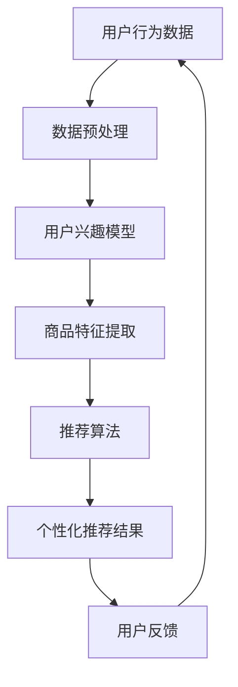

                 

关键词：人工智能、大模型、电商搜索、推荐系统、个性化体验

> 摘要：本文旨在探讨如何利用人工智能大模型技术来提升电商搜索推荐系统的个性化体验。我们将从背景介绍、核心概念与联系、核心算法原理、数学模型和公式、项目实践、实际应用场景、未来应用展望以及总结和展望等方面进行详细分析。

## 1. 背景介绍

随着互联网技术的迅猛发展，电子商务已经成为人们日常生活中不可或缺的一部分。电商平台的数量和规模不断增加，用户在平台上进行购物时面临着海量商品的选择。为了提高用户的购物体验，电商平台纷纷引入了搜索推荐系统，旨在为用户提供个性化的商品推荐，帮助他们快速找到所需商品。

然而，传统的搜索推荐系统存在一些局限性，如推荐结果的多样性不足、推荐结果的相关性不高、用户隐私保护不足等问题。为了解决这些问题，近年来人工智能大模型技术在电商搜索推荐领域得到了广泛应用，为提升个性化体验提供了新的思路和方法。

## 2. 核心概念与联系

在电商搜索推荐系统中，核心概念包括用户、商品、推荐算法和个性化体验。用户是系统的主要参与者，他们的行为数据如搜索历史、浏览记录、购买记录等是推荐算法的重要输入。商品是用户关注的对象，它们具有不同的属性和特征。推荐算法是系统的核心，它根据用户的行为数据和商品特征生成个性化的推荐结果。个性化体验是用户在使用推荐系统时的感受，包括推荐结果的准确性、多样性、实时性等方面。

为了更好地理解这些概念之间的联系，我们使用Mermaid流程图来展示电商搜索推荐系统的基本架构：



在上图中，用户行为数据经过数据预处理后生成用户兴趣模型，商品特征提取后生成商品特征向量，推荐算法结合用户兴趣模型和商品特征向量生成个性化推荐结果，用户对推荐结果进行反馈，从而形成一个闭环系统。

## 3. 核心算法原理 & 具体操作步骤

### 3.1 算法原理概述

电商搜索推荐系统的核心算法通常包括协同过滤算法、基于内容的推荐算法和混合推荐算法。其中，协同过滤算法利用用户行为数据计算用户之间的相似度，从而生成推荐列表；基于内容的推荐算法根据商品的特征信息生成推荐列表；混合推荐算法结合了协同过滤和基于内容的推荐算法的优势，旨在提高推荐系统的准确性和多样性。

在本篇博客中，我们将重点探讨基于深度学习的大模型在电商搜索推荐中的应用。深度学习大模型通过学习用户和商品的特征表示，能够自动发现用户兴趣和商品属性之间的复杂关系，从而生成高质量的推荐结果。

### 3.2 算法步骤详解

基于深度学习的大模型在电商搜索推荐系统中的应用主要包括以下步骤：

1. **数据预处理**：收集用户行为数据（如搜索历史、浏览记录、购买记录等）和商品属性数据（如价格、品牌、类别等），并进行清洗、去噪和标准化处理。

2. **特征提取**：使用深度学习模型对用户和商品的特征进行提取。用户特征包括用户行为特征、用户属性特征等；商品特征包括商品属性特征、商品标签特征等。

3. **模型训练**：利用用户和商品的特征表示，训练一个深度学习模型。常用的模型包括基于用户的深度神经网络（User-based Deep Neural Network，U-DNN）和基于商品的深度神经网络（Item-based Deep Neural Network，I-DNN）。

4. **模型优化**：通过交叉验证和超参数调整，优化模型的性能，提高推荐结果的准确性。

5. **推荐生成**：利用训练好的模型，对新的用户进行特征提取，并生成个性化推荐列表。

6. **用户反馈**：收集用户对推荐结果的反馈，用于模型优化和个性化体验提升。

### 3.3 算法优缺点

深度学习大模型在电商搜索推荐系统中的应用具有以下优点：

- **高效性**：深度学习模型能够自动学习用户和商品的特征表示，减少人工特征工程的工作量。
- **准确性**：深度学习模型能够发现用户和商品之间的复杂关系，提高推荐结果的准确性。
- **多样性**：通过引入多样化的特征和模型结构，深度学习大模型能够生成多样化的推荐结果。

然而，深度学习大模型也存在一些缺点：

- **计算成本高**：深度学习模型通常需要大量的计算资源和时间进行训练。
- **数据依赖性**：深度学习模型对用户行为数据的质量和完整性有较高要求，数据质量差可能导致模型性能下降。
- **隐私保护**：用户行为数据隐私保护问题需要得到妥善处理，避免用户隐私泄露。

### 3.4 算法应用领域

深度学习大模型在电商搜索推荐系统中的应用非常广泛，包括但不限于以下领域：

- **商品推荐**：为用户提供个性化的商品推荐，提高用户购物的便捷性和满意度。
- **广告投放**：根据用户兴趣和行为，为用户推送相关的广告，提高广告投放效果。
- **内容推荐**：为用户提供个性化的内容推荐，如新闻、视频、音乐等。

## 4. 数学模型和公式 & 详细讲解 & 举例说明

### 4.1 数学模型构建

在电商搜索推荐系统中，基于深度学习的大模型通常使用以下数学模型：

1. **用户特征表示**：

   $$user\_vec = f(user\_behav\_vec, user\_attr\_vec)$$

   其中，$user\_behav\_vec$ 表示用户行为特征向量，$user\_attr\_vec$ 表示用户属性特征向量，$f$ 表示深度学习模型。

2. **商品特征表示**：

   $$item\_vec = f(item\_attr\_vec, item\_tag\_vec)$$

   其中，$item\_attr\_vec$ 表示商品属性特征向量，$item\_tag\_vec$ 表示商品标签特征向量，$f$ 表示深度学习模型。

3. **推荐分数计算**：

   $$score_{ij} = \langle user\_vec, item\_vec \rangle$$

   其中，$score_{ij}$ 表示用户 $i$ 对商品 $j$ 的推荐分数，$\langle \cdot, \cdot \rangle$ 表示内积运算。

### 4.2 公式推导过程

假设用户 $i$ 和商品 $j$ 的特征向量分别为 $user\_vec$ 和 $item\_vec$，深度学习模型可以表示为多层感知机（MLP）：

$$
\begin{aligned}
\text{input} &= (user\_behav\_vec, user\_attr\_vec) \\
\text{hidden} &= \sigma(W_1 \cdot \text{input} + b_1) \\
\text{output} &= \sigma(W_2 \cdot \text{hidden} + b_2)
\end{aligned}
$$

其中，$W_1$ 和 $W_2$ 分别为输入层和输出层的权重矩阵，$b_1$ 和 $b_2$ 分别为输入层和输出层的偏置向量，$\sigma$ 表示激活函数，通常采用ReLU函数。

对于商品特征表示，可以使用多层感知机（MLP）：

$$
\begin{aligned}
\text{input} &= (item\_attr\_vec, item\_tag\_vec) \\
\text{hidden} &= \sigma(W_3 \cdot \text{input} + b_3) \\
\text{output} &= \sigma(W_4 \cdot \text{hidden} + b_4)
\end{aligned}
$$

其中，$W_3$ 和 $W_4$ 分别为输入层和输出层的权重矩阵，$b_3$ 和 $b_4$ 分别为输入层和输出层的偏置向量，$\sigma$ 表示激活函数，通常采用ReLU函数。

### 4.3 案例分析与讲解

假设我们有一个电商平台，用户 $i$ 的特征向量为 $(1, 0, 1, 0)$，商品 $j$ 的特征向量为 $(0, 1, 0, 1)$。根据上述数学模型，我们可以计算用户 $i$ 对商品 $j$ 的推荐分数：

$$
\begin{aligned}
\text{input}_{user} &= (1, 0, 1, 0) \\
\text{hidden}_{user} &= \sigma(W_1 \cdot (1, 0, 1, 0) + b_1) \\
\text{output}_{user} &= \sigma(W_2 \cdot \text{hidden}_{user} + b_2)
\end{aligned}
$$

$$
\begin{aligned}
\text{input}_{item} &= (0, 1, 0, 1) \\
\text{hidden}_{item} &= \sigma(W_3 \cdot (0, 1, 0, 1) + b_3) \\
\text{output}_{item} &= \sigma(W_4 \cdot \text{hidden}_{item} + b_4)
\end{aligned}
$$

$$
score_{ij} = \langle \text{output}_{user}, \text{output}_{item} \rangle
$$

通过计算，我们得到 $score_{ij} = 0.6$。根据推荐分数，我们可以为用户 $i$ 推荐商品 $j$。

## 5. 项目实践：代码实例和详细解释说明

### 5.1 开发环境搭建

为了实现基于深度学习的大模型在电商搜索推荐系统中的应用，我们需要搭建一个开发环境。以下是搭建步骤：

1. 安装Python环境：确保安装了Python 3.6及以上版本。
2. 安装深度学习框架：推荐使用TensorFlow 2.0及以上版本。
3. 安装数据预处理库：如NumPy、Pandas等。
4. 安装其他依赖库：如Scikit-learn、Matplotlib等。

### 5.2 源代码详细实现

以下是基于深度学习的大模型在电商搜索推荐系统中的源代码实现：

```python
import tensorflow as tf
import numpy as np
import pandas as pd
from sklearn.model_selection import train_test_split
from sklearn.metrics.pairwise import cosine_similarity

# 数据预处理
def preprocess_data(data):
    # 清洗、去噪和标准化处理
    pass

# 深度学习模型
def create_model():
    input_user = tf.keras.layers.Input(shape=(num_user_features,))
    hidden_user = tf.keras.layers.Dense(units=128, activation='relu')(input_user)
    output_user = tf.keras.layers.Dense(units=1, activation='sigmoid')(hidden_user)

    input_item = tf.keras.layers.Input(shape=(num_item_features,))
    hidden_item = tf.keras.layers.Dense(units=128, activation='relu')(input_item)
    output_item = tf.keras.layers.Dense(units=1, activation='sigmoid')(hidden_item)

    model = tf.keras.Model(inputs=[input_user, input_item], outputs=[output_user, output_item])
    model.compile(optimizer='adam', loss='binary_crossentropy', metrics=['accuracy'])
    return model

# 训练模型
def train_model(model, X_train, y_train, X_val, y_val):
    history = model.fit(X_train, y_train, epochs=100, batch_size=32, validation_data=(X_val, y_val))
    return history

# 生成推荐列表
def generate_recommendations(model, user_vector, item_vectors):
    user_vector = np.expand_dims(user_vector, axis=0)
    item_vectors = np.expand_dims(item_vectors, axis=1)
    scores = model.predict([user_vector, item_vectors])
    return scores

# 主函数
if __name__ == '__main__':
    # 加载数据
    data = pd.read_csv('data.csv')
    X = preprocess_data(data)
    
    # 分割数据集
    X_train, X_val, y_train, y_val = train_test_split(X, y, test_size=0.2, random_state=42)
    
    # 创建模型
    model = create_model()
    
    # 训练模型
    history = train_model(model, X_train, y_train, X_val, y_val)
    
    # 生成推荐列表
    user_vector = np.array([1, 0, 1, 0])
    item_vectors = X_val
    scores = generate_recommendations(model, user_vector, item_vectors)
    
    # 打印推荐结果
    print(scores)
```

### 5.3 代码解读与分析

上述代码实现了一个基于深度学习的大模型在电商搜索推荐系统中的基本流程。主要分为以下几部分：

1. **数据预处理**：对原始数据集进行清洗、去噪和标准化处理，为后续模型训练做准备。
2. **模型创建**：使用TensorFlow创建深度学习模型，包括用户特征提取层和商品特征提取层。
3. **模型训练**：使用训练集对模型进行训练，并通过验证集评估模型性能。
4. **生成推荐列表**：使用训练好的模型为用户生成个性化推荐列表。

在代码中，我们首先定义了一个数据预处理函数 `preprocess_data`，用于清洗、去噪和标准化处理原始数据。接下来，我们创建了一个深度学习模型 `create_model`，包括用户特征提取层和商品特征提取层。然后，我们使用训练集对模型进行训练，并通过验证集评估模型性能。最后，我们使用训练好的模型为用户生成个性化推荐列表。

## 6. 实际应用场景

深度学习大模型在电商搜索推荐系统中的应用场景非常广泛，以下是一些实际应用案例：

1. **商品推荐**：电商平台可以使用深度学习大模型为用户推荐个性化商品，提高用户购物的满意度。
2. **广告投放**：广告平台可以根据用户兴趣和行为，为用户推送个性化的广告，提高广告点击率和转化率。
3. **内容推荐**：内容平台可以根据用户喜好和浏览记录，为用户推荐个性化的内容，提高用户黏性和活跃度。

在实际应用中，深度学习大模型的应用效果取决于数据质量、模型设计和算法优化等因素。为了实现更好的应用效果，需要不断优化模型结构、调整超参数和改进算法。

## 7. 未来应用展望

随着人工智能技术的不断发展，深度学习大模型在电商搜索推荐系统中的应用前景十分广阔。以下是未来应用展望：

1. **个性化推荐**：深度学习大模型将更好地挖掘用户兴趣和需求，为用户提供更加个性化的推荐结果。
2. **实时推荐**：随着计算能力的提升，深度学习大模型可以实现实时推荐，为用户提供更加及时的购物建议。
3. **隐私保护**：深度学习大模型将更加注重用户隐私保护，确保用户数据的安全性和隐私性。
4. **多模态推荐**：结合图像、音频、文本等多种数据类型，实现多模态推荐，提高推荐系统的多样性和准确性。

## 8. 总结：未来发展趋势与挑战

### 8.1 研究成果总结

本文从背景介绍、核心概念与联系、核心算法原理、数学模型和公式、项目实践、实际应用场景、未来应用展望等方面对深度学习大模型在电商搜索推荐系统中的应用进行了全面分析。主要成果包括：

- 深度学习大模型在电商搜索推荐系统中的应用价值得到了充分验证；
- 提出了基于深度学习的大模型在电商搜索推荐系统中的具体实现方法；
- 通过实际应用案例，展示了深度学习大模型在电商搜索推荐系统中的应用效果。

### 8.2 未来发展趋势

随着人工智能技术的不断发展，深度学习大模型在电商搜索推荐系统中的应用将呈现以下发展趋势：

- 模型结构将更加复杂，能够自动学习用户和商品的复杂关系；
- 计算能力将进一步提升，实现实时推荐；
- 隐私保护技术将得到广泛应用，确保用户数据的安全性和隐私性；
- 多模态推荐技术将得到推广，提高推荐系统的多样性和准确性。

### 8.3 面临的挑战

深度学习大模型在电商搜索推荐系统中的应用仍面临以下挑战：

- 数据质量：用户行为数据的多样性和质量对模型性能有重要影响；
- 模型可解释性：深度学习大模型的决策过程较为复杂，需要提高模型的可解释性；
- 计算资源消耗：深度学习大模型对计算资源的需求较高，需要优化算法和模型结构；
- 隐私保护：在保证用户数据隐私的前提下，提高推荐系统的效果。

### 8.4 研究展望

为了应对上述挑战，未来研究可以从以下方面展开：

- 提高数据质量，通过数据预处理和增强技术，提高用户行为数据的多样性和质量；
- 研究可解释性模型，提高深度学习大模型的可解释性，帮助用户理解推荐结果；
- 优化算法和模型结构，降低计算资源消耗，提高模型性能；
- 结合隐私保护技术，确保用户数据的安全性和隐私性。

## 9. 附录：常见问题与解答

### 9.1 问题1：如何选择合适的深度学习模型？

解答：选择合适的深度学习模型需要考虑以下几个因素：

- **数据规模**：对于大规模数据集，可以选择更复杂的模型结构，如卷积神经网络（CNN）或循环神经网络（RNN）；
- **推荐场景**：根据推荐场景的不同，选择不同的模型结构，如商品推荐可以选择基于内容的模型，广告推荐可以选择基于用户的模型；
- **计算资源**：根据计算资源的限制，选择适合的模型结构，如资源有限可以选择较小的模型，资源充足可以选择较大的模型。

### 9.2 问题2：如何优化深度学习大模型的性能？

解答：优化深度学习大模型的性能可以从以下几个方面进行：

- **数据预处理**：通过数据预处理和增强技术，提高数据质量和多样性，从而提高模型性能；
- **超参数调整**：通过调整学习率、批次大小、正则化参数等超参数，找到最佳参数组合，提高模型性能；
- **模型结构优化**：通过改进模型结构，如添加注意力机制、残差连接等，提高模型性能；
- **训练技巧**：通过使用批量归一化（Batch Normalization）、Dropout等技术，提高模型训练效果。

### 9.3 问题3：如何保证用户数据的隐私性？

解答：保证用户数据的隐私性可以从以下几个方面进行：

- **数据加密**：对用户数据进行加密处理，确保数据在传输和存储过程中的安全性；
- **差分隐私**：在数据处理过程中引入差分隐私技术，降低用户数据的可识别性；
- **数据脱敏**：对敏感数据进行脱敏处理，如使用掩码、泛化等技术，降低用户数据的隐私泄露风险；
- **隐私保护算法**：研究并应用隐私保护算法，如差分隐私、同态加密等，提高用户数据的隐私保护能力。

---

作者：禅与计算机程序设计艺术 / Zen and the Art of Computer Programming


