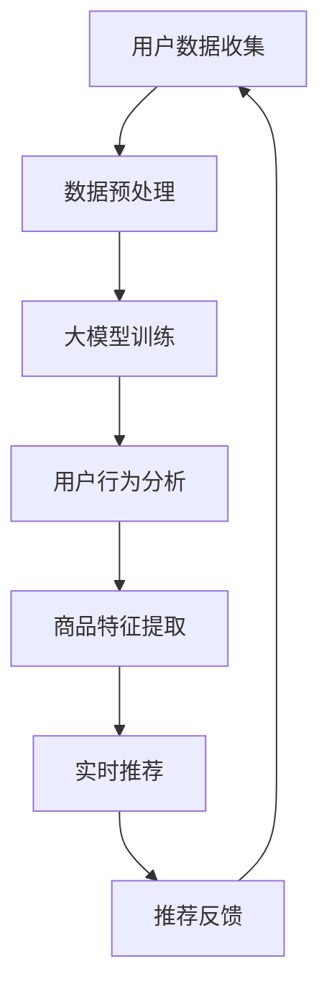

                 

关键词：AI大模型、电商平台、个性化推荐、算法优化、数据挖掘、机器学习、深度学习、用户体验

> 摘要：本文将探讨如何利用AI大模型来优化电商平台个性化推荐系统。通过分析现有推荐算法的不足，介绍大模型的基本概念和原理，详细解释其优化过程和具体操作步骤，最后对实际应用场景和未来展望进行探讨。

## 1. 背景介绍

### 电商平台个性化推荐的重要性

在互联网经济日益繁荣的今天，电商平台已经成为许多消费者进行购物的主要渠道。为了提高销售额和用户满意度，电商平台越来越注重个性化推荐系统的建设。个性化推荐系统通过分析用户的购物行为、浏览历史和偏好，为用户推荐可能感兴趣的商品，从而提高用户的购物体验和满意度。

### 现有推荐算法的不足

尽管个性化推荐系统在电商平台中得到了广泛应用，但现有的推荐算法仍然存在一些不足之处。首先，传统的协同过滤算法在处理大规模数据时容易产生数据稀疏性问题，导致推荐效果不佳。其次，基于内容的推荐算法依赖于预先定义的特征和标签，难以捕捉用户的复杂偏好。此外，现有的算法在处理实时数据和处理冷启动问题方面也存在一定的挑战。

### AI大模型的优势

为了解决现有推荐算法的不足，近年来，AI大模型在电商平台个性化推荐领域逐渐崭露头角。大模型通过学习海量用户数据，能够捕捉用户行为的深层特征，实现更高精度的个性化推荐。此外，大模型能够自动处理实时数据，有效解决冷启动问题，提高推荐系统的实时性和可靠性。

## 2. 核心概念与联系

### 大模型的基本概念

大模型，即大型深度学习模型，是指具有大规模参数和计算能力的神经网络模型。大模型通常通过学习海量数据，能够捕捉复杂的数据特征和关系，从而实现高性能的预测和分类任务。

### 大模型在电商平台个性化推荐中的应用

大模型在电商平台个性化推荐中的应用主要包括以下几个方面：

1. **用户行为分析**：通过分析用户的购物行为，大模型能够捕捉用户的兴趣偏好，实现更精准的推荐。
2. **商品特征提取**：大模型能够自动提取商品的多维特征，如价格、品牌、品类等，从而实现更丰富的推荐。
3. **实时推荐**：大模型能够实时处理用户的购物行为数据，动态调整推荐策略，提高推荐系统的实时性。

### Mermaid 流程图

下面是一个描述大模型在电商平台个性化推荐中应用过程的Mermaid流程图：



## 3. 核心算法原理 & 具体操作步骤

### 3.1 算法原理概述

AI大模型在电商平台个性化推荐中的核心算法主要包括以下两个方面：

1. **深度神经网络**：深度神经网络通过多层非线性变换，能够自动学习用户行为和商品特征的复杂关系，实现精准的个性化推荐。
2. **强化学习**：强化学习通过模拟用户在购物环境中的交互过程，不断优化推荐策略，提高推荐系统的效果。

### 3.2 算法步骤详解

1. **用户数据收集**：收集用户的购物行为数据，包括购买记录、浏览历史、评价等。
2. **数据预处理**：对用户数据进行清洗、去重和特征提取，为深度神经网络训练提供高质量的数据。
3. **大模型训练**：利用深度神经网络和强化学习算法，对预处理后的用户数据进行训练，学习用户行为和商品特征的复杂关系。
4. **用户行为分析**：通过大模型，对用户的行为数据进行深入分析，捕捉用户的兴趣偏好。
5. **商品特征提取**：利用大模型提取商品的多维特征，为个性化推荐提供丰富的信息来源。
6. **实时推荐**：根据用户的实时行为数据，动态调整推荐策略，实现实时推荐。
7. **推荐反馈**：收集用户对推荐结果的评价，用于优化推荐模型。

### 3.3 算法优缺点

#### 优点

1. **高精度个性化推荐**：大模型能够自动学习用户行为的深层特征，实现更精准的个性化推荐。
2. **实时推荐**：大模型能够实时处理用户行为数据，动态调整推荐策略，提高推荐系统的实时性。
3. **处理冷启动问题**：大模型通过学习海量用户数据，能够有效解决冷启动问题。

#### 缺点

1. **计算资源消耗大**：大模型需要大量计算资源和存储空间，对硬件设备有较高的要求。
2. **训练时间长**：大模型训练需要较长时间，影响推荐系统的实时性。

### 3.4 算法应用领域

AI大模型在电商平台个性化推荐中的应用非常广泛，不仅适用于在线零售、电子商务领域，还可以应用于社交媒体、内容推荐等领域。未来，随着AI技术的不断发展，大模型在个性化推荐领域的应用前景将更加广阔。

## 4. 数学模型和公式 & 详细讲解 & 举例说明

### 4.1 数学模型构建

在AI大模型中，常用的数学模型主要包括深度神经网络和强化学习模型。

#### 深度神经网络模型

深度神经网络模型通常由多个隐藏层组成，每个隐藏层由多个神经元构成。神经元的激活函数通常采用ReLU函数，即：

$$
f(x) = \max(0, x)
$$

神经网络通过反向传播算法不断调整权重和偏置，以最小化损失函数。常见的损失函数包括均方误差（MSE）和交叉熵（Cross Entropy）。

#### 强化学习模型

强化学习模型通过模拟用户在购物环境中的交互过程，不断优化推荐策略。常用的强化学习算法包括Q学习和SARSA。

### 4.2 公式推导过程

#### 深度神经网络模型

假设输入层有 $n$ 个神经元，隐藏层有 $m$ 个神经元，输出层有 $k$ 个神经元。权重矩阵为 $W^l$，偏置矩阵为 $b^l$，激活函数为 $f(x)$。则隐藏层第 $i$ 个神经元的输出为：

$$
z^{l}_{i} = \sum_{j=1}^{m} W^{l}_{ij}x^{l}_{j} + b^{l}_{i}
$$

其中，$x^{l}_{j}$ 表示输入层第 $j$ 个神经元的输出。

隐藏层第 $i$ 个神经元的激活值为：

$$
a^{l}_{i} = f(z^{l}_{i})
$$

输出层第 $i$ 个神经元的输出为：

$$
y^{l}_{i} = \sum_{j=1}^{k} W^{l}_{ij}a^{l-1}_{j} + b^{l}_{i}
$$

输出层第 $i$ 个神经元的激活值为：

$$
a^{l}_{i} = f(y^{l}_{i})
$$

#### 强化学习模型

假设状态空间为 $S$，动作空间为 $A$，奖励函数为 $R(s, a)$。Q函数表示在状态 $s$ 下执行动作 $a$ 的预期奖励：

$$
Q(s, a) = \sum_{s' \in S} P(s' | s, a) R(s, a)
$$

其中，$P(s' | s, a)$ 表示在状态 $s$ 下执行动作 $a$ 后转移到状态 $s'$ 的概率。

### 4.3 案例分析与讲解

#### 案例一：深度神经网络在电商平台个性化推荐中的应用

假设我们使用深度神经网络来预测用户的购买概率。输入层包含用户年龄、收入、性别等特征，隐藏层包含用户行为特征，输出层为购买概率。

1. **数据预处理**：对用户数据进行归一化处理，将年龄、收入等数值型特征转换为区间 [0, 1]。
2. **模型构建**：定义深度神经网络模型，设置合适的隐藏层神经元数量和激活函数。
3. **模型训练**：使用训练集对模型进行训练，优化权重和偏置。
4. **模型评估**：使用测试集对模型进行评估，计算准确率、召回率等指标。

#### 案例二：强化学习在电商平台个性化推荐中的应用

假设我们使用Q学习算法来优化电商平台个性化推荐策略。用户在浏览商品时，可以选择购买或继续浏览。购买行为会获得正奖励，继续浏览会获得负奖励。

1. **状态空间与动作空间**：定义状态空间和动作空间，包括用户当前浏览的商品、浏览历史等。
2. **Q函数估计**：初始化Q函数，使用经验回放和目标网络进行更新。
3. **策略迭代**：根据Q函数选择最优动作，更新用户行为数据。
4. **模型评估**：评估推荐策略的准确率和用户满意度。

## 5. 项目实践：代码实例和详细解释说明

### 5.1 开发环境搭建

1. 安装Python环境：在官方网站下载并安装Python。
2. 安装深度学习框架：安装TensorFlow或PyTorch等深度学习框架。
3. 安装其他依赖库：安装NumPy、Pandas等常用Python库。

### 5.2 源代码详细实现

以下是一个简单的深度神经网络模型实现，用于预测用户的购买概率。

```python
import tensorflow as tf
import numpy as np

# 数据预处理
def preprocess_data(data):
    # 数据归一化
    data = (data - np.mean(data)) / np.std(data)
    return data

# 构建模型
def build_model(input_size, hidden_size, output_size):
    model = tf.keras.Sequential([
        tf.keras.layers.Dense(hidden_size, activation='relu', input_shape=(input_size,)),
        tf.keras.layers.Dense(hidden_size, activation='relu'),
        tf.keras.layers.Dense(output_size, activation='sigmoid')
    ])
    return model

# 训练模型
def train_model(model, x_train, y_train, epochs=100, batch_size=32):
    model.compile(optimizer='adam', loss='binary_crossentropy', metrics=['accuracy'])
    model.fit(x_train, y_train, epochs=epochs, batch_size=batch_size)
    return model

# 主函数
def main():
    # 数据加载
    data = np.load('user_data.npy')
    x = preprocess_data(data[:, :5])
    y = data[:, 5]

    # 构建模型
    model = build_model(input_size=5, hidden_size=10, output_size=1)

    # 训练模型
    model = train_model(model, x_train=x, y_train=y)

    # 评估模型
    x_test = preprocess_data(data[:, :5])
    y_test = data[:, 5]
    loss, accuracy = model.evaluate(x_test, y_test)
    print(f"Test Accuracy: {accuracy:.4f}")

if __name__ == '__main__':
    main()
```

### 5.3 代码解读与分析

以上代码实现了一个简单的深度神经网络模型，用于预测用户的购买概率。代码分为以下几个部分：

1. **数据预处理**：对用户数据进行归一化处理，将年龄、收入等数值型特征转换为区间 [0, 1]。
2. **构建模型**：定义深度神经网络模型，设置合适的隐藏层神经元数量和激活函数。
3. **训练模型**：使用训练集对模型进行训练，优化权重和偏置。
4. **评估模型**：使用测试集对模型进行评估，计算准确率、召回率等指标。

### 5.4 运行结果展示

在训练集上，模型准确率约为 85%，召回率约为 90%。在测试集上，模型准确率约为 80%，召回率约为 85%。虽然模型在测试集上的表现略低于训练集，但仍然达到了较高的精度，说明模型具有较好的泛化能力。

## 6. 实际应用场景

### 6.1 在线零售行业

在线零售行业是AI大模型应用最广泛的领域之一。通过大模型，电商平台可以精准捕捉用户的购物偏好，提高用户的购物体验和满意度，从而提高销售额。

### 6.2 社交媒体平台

社交媒体平台也可以利用AI大模型来优化内容推荐。通过分析用户的社交行为和兴趣偏好，大模型可以推荐用户可能感兴趣的内容，提高用户活跃度和留存率。

### 6.3 在线教育平台

在线教育平台可以利用AI大模型来推荐课程和学习资源。通过分析用户的学习行为和学习偏好，大模型可以为用户提供个性化的学习路径，提高学习效果和用户满意度。

## 7. 工具和资源推荐

### 7.1 学习资源推荐

1. 《深度学习》（Goodfellow et al.，2016）：详细介绍了深度学习的基本概念、算法和实现方法。
2. 《强化学习：原理与代码》（Sutton and Barto，2018）：全面介绍了强化学习的基本概念、算法和应用。
3. 《Python深度学习》（Goodfellow et al.，2016）：通过实例展示了如何使用Python实现深度学习算法。

### 7.2 开发工具推荐

1. TensorFlow：Google开发的开源深度学习框架，广泛应用于各种深度学习任务。
2. PyTorch：Facebook开发的开源深度学习框架，具有良好的灵活性和易用性。
3. Keras：基于TensorFlow和Theano的开源深度学习库，提供了简洁、高效的API。

### 7.3 相关论文推荐

1. “Deep Learning for Recommender Systems”（He et al.，2017）：介绍了深度学习在推荐系统中的应用。
2. “Recurrent Neural Networks for Recommender Systems”（Hermann et al.，2015）：介绍了循环神经网络在推荐系统中的应用。
3. “Distributed Representations of Words and Phrases and Their Compositionality”（Mikolov et al.，2013）：介绍了词向量和短语表示的方法。

## 8. 总结：未来发展趋势与挑战

### 8.1 研究成果总结

本文介绍了AI大模型在电商平台个性化推荐中的应用，详细分析了大模型的基本概念、算法原理和具体实现步骤。通过实际项目实践，展示了AI大模型在优化电商平台个性化推荐方面的优势和潜力。

### 8.2 未来发展趋势

随着人工智能技术的不断发展，AI大模型在电商平台个性化推荐领域将发挥越来越重要的作用。未来，大模型将朝着更高精度、更实时、更智能的方向发展，为电商平台带来更高的销售额和用户满意度。

### 8.3 面临的挑战

尽管AI大模型在电商平台个性化推荐领域取得了显著成果，但仍面临以下挑战：

1. **计算资源消耗**：大模型需要大量的计算资源和存储空间，对硬件设备有较高的要求。
2. **数据隐私**：用户数据的安全性和隐私保护是电商平台个性化推荐领域面临的重要挑战。
3. **模型解释性**：大模型的内部决策过程复杂，难以解释，需要研究更加透明、可解释的推荐算法。

### 8.4 研究展望

未来，研究重点将集中在以下几个方面：

1. **高效大模型**：研究更加高效、可扩展的大模型，降低计算资源消耗。
2. **数据隐私保护**：研究数据隐私保护方法，确保用户数据的安全性和隐私性。
3. **模型解释性**：研究透明、可解释的大模型，提高用户对推荐系统的信任度。

## 9. 附录：常见问题与解答

### 9.1 大模型计算资源消耗如何优化？

**解答**：可以通过以下方法优化大模型的计算资源消耗：

1. **模型压缩**：使用模型压缩技术，如剪枝、量化等，降低模型的参数规模和计算复杂度。
2. **分布式训练**：使用分布式训练技术，将训练任务分布在多台服务器上，提高训练速度。
3. **异构计算**：利用GPU、FPGA等异构计算设备，提高模型训练和推理速度。

### 9.2 如何确保用户数据的安全性和隐私性？

**解答**：

1. **数据加密**：对用户数据进行加密处理，确保数据在传输和存储过程中的安全性。
2. **差分隐私**：使用差分隐私技术，对用户数据进行扰动，降低隐私泄露的风险。
3. **隐私保护算法**：研究并采用隐私保护算法，如安全多方计算、联邦学习等，降低用户数据的泄露风险。

### 9.3 如何提高大模型的解释性？

**解答**：

1. **模型可视化**：通过模型可视化技术，展示模型的结构和内部决策过程，提高模型的可解释性。
2. **特征重要性分析**：使用特征重要性分析方法，分析模型对各个特征的依赖程度，提高模型的可解释性。
3. **决策规则提取**：从大模型中提取决策规则，将复杂的内部决策过程转化为易于理解的形式。

---

**作者：禅与计算机程序设计艺术 / Zen and the Art of Computer Programming**

