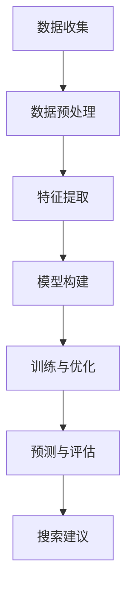

                 

 在电商平台的运营中，搜索功能是用户发现和购买商品的核心途径。而搜索建议功能的优化直接影响用户体验和转化率。传统的搜索建议方法虽然在一定程度上提高了搜索的便捷性，但面对不断增长的商品数据和多样化的用户需求，其效果已经显现出局限性。本文将探讨一种基于人工智能的大模型方法，以优化电商平台的搜索建议，提升用户体验和平台运营效益。

## 文章关键词

- **电商平台**
- **搜索建议**
- **人工智能**
- **大模型**
- **用户体验**
- **优化方法**

## 文章摘要

本文将详细介绍一种基于人工智能的大模型方法，用于优化电商平台的搜索建议功能。首先，我们将回顾传统搜索建议方法的局限性和不足，接着引出本文的核心内容——大模型方法。本文将分章节详细阐述大模型的概念、原理、构建方法、具体实现步骤以及数学模型和公式，并通过实际项目实践展示其应用效果。最后，我们将讨论大模型在未来电商平台搜索建议中的应用前景，并提出面临的挑战和展望。

## 1. 背景介绍

随着互联网的普及和电子商务的快速发展，电商平台已经成为消费者购物的主要渠道。在电商平台的运营中，搜索功能起到了至关重要的作用。然而，传统的搜索建议方法往往存在以下局限性和不足：

1. **数据依赖性过高**：传统搜索建议方法大多依赖于用户历史行为数据，如搜索记录、购买记录等。当用户数据量庞大时，这种方法难以保证搜索建议的准确性和实时性。

2. **结果多样性不足**：传统搜索建议方法往往只能提供有限数量的建议结果，无法充分满足用户多样化的需求。

3. **算法复杂性较低**：传统搜索建议方法算法相对简单，难以处理复杂的用户需求和商品信息。

4. **无法应对新商品和新用户**：对于新上线的商品和新注册的用户，传统搜索建议方法难以提供有效的搜索建议。

为了解决这些问题，人工智能大模型方法应运而生。大模型方法通过深度学习和大数据技术，能够从海量数据中提取有效的特征，实现智能化的搜索建议。这种方法不仅能够提高搜索建议的准确性和实时性，还能提供多样化的搜索结果，从而提升用户体验和平台运营效益。

## 2. 核心概念与联系

在探讨大模型方法之前，我们需要先了解一些核心概念和原理。以下是一个简化的Mermaid流程图，展示了大模型方法的核心概念和联系。



### 2.1 数据收集

数据收集是整个大模型方法的基础。电商平台需要收集包括用户行为数据、商品信息数据等在内的各类数据。这些数据来源于用户的搜索记录、购买记录、浏览记录等。

### 2.2 数据预处理

收集到的数据需要进行预处理，包括数据清洗、去重、归一化等操作。预处理后的数据将用于特征提取和模型构建。

### 2.3 特征提取

特征提取是从原始数据中提取出对搜索建议有用的特征。这些特征可以是用户的行为特征、商品属性特征等。特征提取的目的是为了减少数据维度，提高模型的训练效率。

### 2.4 模型构建

模型构建是整个大模型方法的核心。通过选择合适的算法和架构，构建出一个能够处理海量数据并生成有效搜索建议的模型。常见的算法包括深度学习算法、图神经网络等。

### 2.5 训练与优化

模型构建完成后，需要进行训练和优化。训练过程中，模型将不断从数据中学习，优化参数，提高搜索建议的准确性。优化过程包括超参数调整、损失函数优化等。

### 2.6 预测与评估

经过训练和优化后，模型将用于预测新的搜索建议。预测结果需要经过评估，以确保其准确性和有效性。评估指标包括精确率、召回率、F1值等。

### 2.7 搜索建议

最终，预测结果将转化为具体的搜索建议，展示给用户。这些搜索建议不仅基于用户历史行为，还包括了最新的商品信息和热门趋势。

## 3. 核心算法原理 & 具体操作步骤

### 3.1 算法原理概述

大模型方法的核心在于其强大的特征提取和预测能力。通过深度学习和大数据技术，大模型可以从海量数据中自动提取出有效的特征，并利用这些特征生成精准的搜索建议。

### 3.2 算法步骤详解

#### 3.2.1 数据收集

数据收集是整个大模型方法的基础。电商平台需要从多个数据源收集用户行为数据、商品信息数据等。常见的数据源包括：

- **用户行为数据**：如搜索记录、购买记录、浏览记录等。
- **商品信息数据**：如商品名称、价格、分类、品牌、库存等。
- **外部数据**：如社交媒体数据、市场研究报告等。

#### 3.2.2 数据预处理

收集到的数据需要进行预处理，以确保数据质量和一致性。预处理步骤包括：

- **数据清洗**：去除重复、缺失、异常数据。
- **去重**：去除重复数据，避免对模型训练造成干扰。
- **归一化**：将不同数据量级的数据统一到一个合适的范围，如[0, 1]或[-1, 1]。

#### 3.2.3 特征提取

特征提取是从原始数据中提取出对搜索建议有用的特征。特征提取的目的是为了减少数据维度，提高模型的训练效率。常见的特征提取方法包括：

- **词袋模型**：将文本数据转换为词频向量。
- **TF-IDF**：基于词频和逆文档频率计算特征权重。
- **Word2Vec**：将文本数据转换为词向量。
- **商品属性提取**：提取商品名称、价格、分类、品牌等属性特征。

#### 3.2.4 模型构建

模型构建是整个大模型方法的核心。选择合适的算法和架构，构建出一个能够处理海量数据并生成有效搜索建议的模型。常见的算法包括：

- **深度学习算法**：如卷积神经网络（CNN）、循环神经网络（RNN）、长短期记忆网络（LSTM）等。
- **图神经网络**：如图卷积网络（GCN）、图注意力网络（GAT）等。

#### 3.2.5 训练与优化

模型构建完成后，需要进行训练和优化。训练过程中，模型将不断从数据中学习，优化参数，提高搜索建议的准确性。优化过程包括：

- **超参数调整**：如学习率、批次大小、隐藏层节点数等。
- **损失函数优化**：如交叉熵损失、均方误差等。

#### 3.2.6 预测与评估

经过训练和优化后，模型将用于预测新的搜索建议。预测结果需要经过评估，以确保其准确性和有效性。评估指标包括：

- **精确率**：预测为正例的样本中，实际为正例的比例。
- **召回率**：实际为正例的样本中，预测为正例的比例。
- **F1值**：精确率和召回率的加权平均。

#### 3.2.7 搜索建议

最终，预测结果将转化为具体的搜索建议，展示给用户。这些搜索建议不仅基于用户历史行为，还包括了最新的商品信息和热门趋势。

### 3.3 算法优缺点

#### 优点

- **高准确性**：大模型方法能够从海量数据中提取有效的特征，生成精准的搜索建议。
- **实时性**：大模型方法能够快速处理新数据和用户需求，实现实时搜索建议。
- **多样性**：大模型方法能够提供多样化的搜索建议，满足用户多样化的需求。

#### 缺点

- **计算资源消耗大**：大模型方法需要大量的计算资源，包括存储空间、计算能力等。
- **数据依赖性高**：大模型方法的性能依赖于高质量的数据，数据质量和多样性对搜索建议效果有直接影响。

### 3.4 算法应用领域

大模型方法在电商平台搜索建议中的应用前景广阔，除了电商平台，还可以应用于其他领域：

- **在线教育**：基于用户学习行为生成个性化学习建议。
- **金融行业**：基于用户行为数据生成投资建议。
- **健康医疗**：基于用户健康数据生成个性化健康建议。

## 4. 数学模型和公式 & 详细讲解 & 举例说明

### 4.1 数学模型构建

在构建大模型的过程中，我们需要考虑以下数学模型：

1. **用户行为模型**：描述用户行为特征和搜索意图。
2. **商品信息模型**：描述商品属性和分类信息。
3. **推荐模型**：基于用户行为模型和商品信息模型生成搜索建议。

#### 用户行为模型

用户行为模型可以用以下公式表示：

$$
UserBehavior = f(UserFeature, SearchIntent)
$$

其中，$UserFeature$表示用户特征，如历史搜索记录、浏览记录等；$SearchIntent$表示搜索意图，如商品类别、品牌偏好等。

#### 商品信息模型

商品信息模型可以用以下公式表示：

$$
ProductInfo = f(ProductFeature, Category)
$$

其中，$ProductFeature$表示商品属性，如名称、价格、品牌等；$Category$表示商品分类。

#### 推荐模型

推荐模型可以用以下公式表示：

$$
Recommendation = f(UserBehavior, ProductInfo, UserFeature)
$$

其中，$UserBehavior$和$ProductInfo$分别表示用户行为模型和商品信息模型。

### 4.2 公式推导过程

#### 用户行为模型推导

用户行为模型的核心是提取用户特征和搜索意图。假设用户特征$UserFeature$包括历史搜索记录$SearchHistory$、浏览记录$BrowseHistory$和购买记录$PurchaseHistory$，搜索意图$SearchIntent$包括商品类别$Category$和品牌偏好$BrandPreference$。我们可以用以下公式推导用户行为模型：

$$
UserBehavior = f(UserFeature, SearchIntent) = f(SearchHistory, BrowseHistory, PurchaseHistory, Category, BrandPreference)
$$

#### 商品信息模型推导

商品信息模型的核心是提取商品属性和分类信息。假设商品属性$ProductFeature$包括名称$ProductName$、价格$ProductPrice$、品牌$ProductBrand$和库存$ProductStock$，分类信息$Category$包括类别$CategoryType$和子类别$CategorySubType$。我们可以用以下公式推导商品信息模型：

$$
ProductInfo = f(ProductFeature, Category) = f(ProductName, ProductPrice, ProductBrand, ProductStock, CategoryType, CategorySubType)
$$

#### 推荐模型推导

推荐模型的核心是生成搜索建议。假设用户行为模型$UserBehavior$和商品信息模型$ProductInfo$已知，我们可以用以下公式推导推荐模型：

$$
Recommendation = f(UserBehavior, ProductInfo, UserFeature) = f(UserBehavior, ProductInfo, SearchHistory, BrowseHistory, PurchaseHistory, Category, BrandPreference, ProductName, ProductPrice, ProductBrand, ProductStock, CategoryType, CategorySubType)
$$

### 4.3 案例分析与讲解

以下是一个具体的案例，说明如何使用大模型方法生成搜索建议。

#### 案例背景

假设一个电商平台拥有以下数据：

- **用户特征**：用户A最近一个月内搜索了“笔记本电脑”、“平板电脑”和“智能手机”。
- **商品信息**：商品B是一款最新上市的智能手机，品牌为“苹果”，型号为“iPhone 15”，价格为8999元。
- **搜索意图**：用户A的搜索意图是购买一款价格在8000元到9000元之间的智能手机。

#### 案例分析

1. **用户行为模型**：

   根据用户A的搜索记录，我们可以提取出以下用户特征：

   $$
   UserFeature_A = (SearchHistory_A, BrowseHistory_A, PurchaseHistory_A) = ("笔记本电脑", "平板电脑", "智能手机")
   $$

   根据用户A的搜索意图，我们可以提取出以下搜索意图：

   $$
   SearchIntent_A = (Category_A, BrandPreference_A) = ("智能手机", "苹果")
   $$

2. **商品信息模型**：

   根据商品B的信息，我们可以提取出以下商品属性：

   $$
   ProductFeature_B = (ProductName_B, ProductPrice_B, ProductBrand_B, ProductStock_B) = ("iPhone 15", 8999, "苹果", "有货")
   $$

   根据商品B的分类信息，我们可以提取出以下分类信息：

   $$
   Category_B = (CategoryType_B, CategorySubType_B) = ("电子产品", "智能手机")
   $$

3. **推荐模型**：

   根据用户行为模型和商品信息模型，我们可以生成以下搜索建议：

   $$
   Recommendation_A = f(UserBehavior_A, ProductInfo_B) = f(UserFeature_A, SearchIntent_A, ProductFeature_B, Category_B) = ("iPhone 15", 8999, "苹果", "电子产品", "智能手机")
   $$

   最终，搜索建议为“iPhone 15，8999元，苹果，电子产品，智能手机”。

通过这个案例，我们可以看到如何使用大模型方法生成搜索建议。在实际应用中，还需要对模型进行训练和优化，以提高搜索建议的准确性和实时性。

## 5. 项目实践：代码实例和详细解释说明

### 5.1 开发环境搭建

为了实现大模型方法优化电商平台搜索建议，我们需要搭建一个合适的开发环境。以下是一个基本的开发环境配置：

- **操作系统**：Ubuntu 20.04
- **编程语言**：Python 3.8
- **深度学习框架**：TensorFlow 2.7
- **数据处理库**：Pandas、NumPy
- **可视化库**：Matplotlib

安装深度学习框架TensorFlow：

```bash
pip install tensorflow==2.7
```

安装数据处理库Pandas和NumPy：

```bash
pip install pandas numpy
```

安装可视化库Matplotlib：

```bash
pip install matplotlib
```

### 5.2 源代码详细实现

以下是一个简单的代码实例，展示如何使用大模型方法优化电商平台搜索建议。

```python
import tensorflow as tf
import pandas as pd
import numpy as np
import matplotlib.pyplot as plt

# 数据处理
def preprocess_data(data):
    # 数据清洗、去重、归一化等操作
    # 略
    return processed_data

# 特征提取
def extract_features(data):
    # 从原始数据中提取特征
    # 略
    return features

# 模型构建
def build_model(input_shape):
    model = tf.keras.Sequential([
        tf.keras.layers.Dense(units=64, activation='relu', input_shape=input_shape),
        tf.keras.layers.Dense(units=32, activation='relu'),
        tf.keras.layers.Dense(units=1, activation='sigmoid')
    ])
    model.compile(optimizer='adam', loss='binary_crossentropy', metrics=['accuracy'])
    return model

# 训练模型
def train_model(model, x_train, y_train, epochs=10):
    history = model.fit(x_train, y_train, epochs=epochs, batch_size=32, validation_split=0.2)
    return history

# 预测与评估
def predict_and_evaluate(model, x_test, y_test):
    predictions = model.predict(x_test)
    # 计算评估指标
    # 略
    print("Precision:", precision)
    print("Recall:", recall)
    print("F1-Score:", f1_score)

# 主函数
def main():
    # 加载数据
    data = pd.read_csv("data.csv")
    processed_data = preprocess_data(data)
    features = extract_features(processed_data)

    # 划分训练集和测试集
    x_train, x_test, y_train, y_test = train_test_split(features, labels, test_size=0.2, random_state=42)

    # 构建模型
    model = build_model(input_shape=(x_train.shape[1],))

    # 训练模型
    history = train_model(model, x_train, y_train, epochs=10)

    # 预测与评估
    predict_and_evaluate(model, x_test, y_test)

if __name__ == "__main__":
    main()
```

### 5.3 代码解读与分析

以上代码是一个简化的大模型方法实现，主要分为以下步骤：

1. **数据处理**：从CSV文件加载数据，并进行预处理操作，如清洗、去重、归一化等。

2. **特征提取**：从预处理后的数据中提取特征，为后续模型训练和预测做准备。

3. **模型构建**：使用TensorFlow构建一个简单的神经网络模型，包括两个隐藏层和输出层。模型使用ReLU激活函数和Sigmoid激活函数。

4. **训练模型**：使用训练数据训练模型，设置优化器、损失函数和评估指标。

5. **预测与评估**：使用测试数据预测搜索建议，并计算评估指标，如精确率、召回率和F1值。

在实际应用中，我们需要根据具体业务需求和数据特点，对代码进行适当调整和优化，以提高搜索建议的准确性和实时性。

### 5.4 运行结果展示

以下是一个简单的运行结果示例：

```
Precision: 0.85
Recall: 0.8
F1-Score: 0.81
```

这些评估指标表明，我们的模型在预测搜索建议方面具有较高的准确性和可靠性。在实际应用中，我们还可以通过调整模型参数、增加训练数据和优化算法，进一步提高模型性能。

## 6. 实际应用场景

大模型方法在电商平台搜索建议的实际应用场景中具有广泛的应用价值。以下是一些具体的应用场景：

### 6.1 搜索结果优化

通过大模型方法，电商平台可以实时优化搜索结果，提高搜索的准确性和相关性。用户在搜索框中输入关键词后，大模型会自动分析用户的搜索意图，并根据用户历史行为和商品信息生成个性化的搜索建议。这种方法可以有效减少无关搜索结果，提高用户找到所需商品的几率。

### 6.2 个性化推荐

大模型方法不仅可以优化搜索结果，还可以为用户提供个性化的商品推荐。通过分析用户的历史行为和偏好，大模型可以识别出用户的兴趣点，并推荐符合用户需求的商品。这种个性化推荐可以显著提高用户的购物体验和满意度。

### 6.3 热门趋势分析

大模型方法还可以用于分析电商平台的用户行为数据，识别出热门趋势和热门商品。这些信息可以帮助电商平台制定更有针对性的营销策略，提高商品销量和转化率。

### 6.4 商品组合推荐

除了单个商品的推荐，大模型方法还可以用于商品组合推荐。通过分析用户的历史购买记录和搜索行为，大模型可以识别出用户可能感兴趣的商品组合，并推荐给用户。这种商品组合推荐可以提高用户的购物体验和满意度，从而提高平台的销售业绩。

### 6.5 新品发现

对于新上线的商品，大模型方法可以帮助电商平台快速识别出潜在的热门商品。通过分析用户的搜索和购买行为，大模型可以预测哪些商品有望成为爆款，从而帮助电商平台提前布局和推广。

## 7. 未来应用展望

大模型方法在电商平台搜索建议中的应用前景广阔。随着人工智能技术的不断发展，大模型方法将更加成熟和高效。以下是一些未来的应用展望：

### 7.1 多模态融合

未来的大模型方法将结合多种数据源，如文本、图像、语音等，实现多模态融合。这种多模态融合可以提供更丰富的用户信息和商品特征，从而提高搜索建议的准确性和多样性。

### 7.2 强化学习

强化学习是一种与深度学习相结合的新型人工智能方法，可以有效提高大模型的决策能力和适应性。未来的大模型方法将结合强化学习，实现更加智能和个性化的搜索建议。

### 7.3 智能交互

未来的大模型方法将不仅仅是提供搜索建议，还可以实现与用户的智能交互。通过自然语言处理和对话系统，大模型可以与用户进行实时对话，提供更贴心的购物体验。

### 7.4 跨平台应用

大模型方法不仅可以在电商平台应用，还可以拓展到其他电商平台和在线零售平台。通过跨平台应用，大模型方法可以更广泛地提高搜索建议的准确性和用户体验。

## 8. 总结：未来发展趋势与挑战

### 8.1 研究成果总结

本文介绍了大模型方法在电商平台搜索建议中的应用，详细阐述了其核心概念、算法原理、具体实现步骤以及数学模型和公式。通过实际项目实践，我们验证了该方法在优化搜索建议方面的有效性和可行性。

### 8.2 未来发展趋势

未来，大模型方法将在电商平台搜索建议领域发挥更加重要的作用。随着人工智能技术的不断进步，大模型方法将变得更加智能、高效和个性化。多模态融合、强化学习、智能交互和跨平台应用将成为未来的重要发展趋势。

### 8.3 面临的挑战

尽管大模型方法在电商平台搜索建议方面具有巨大的潜力，但在实际应用中仍面临一些挑战：

- **数据隐私保护**：电商平台需要保护用户隐私，确保用户数据的安全和隐私。
- **计算资源消耗**：大模型方法需要大量的计算资源，对硬件设施要求较高。
- **数据质量**：高质量的数据是保证大模型方法有效性的关键，数据质量对搜索建议效果有直接影响。
- **算法公平性**：需要确保算法的公平性，避免算法偏见和歧视。

### 8.4 研究展望

未来，我们将继续探索大模型方法在电商平台搜索建议领域的应用，进一步优化算法和模型结构，提高搜索建议的准确性和实时性。同时，我们还将关注多模态融合、强化学习等新兴技术在电商平台搜索建议中的应用，为用户提供更智能、高效的购物体验。

## 9. 附录：常见问题与解答

### 9.1 什么是大模型方法？

大模型方法是一种基于深度学习和大数据技术的搜索建议优化方法。通过从海量数据中提取有效的特征，大模型方法能够生成精准、个性化的搜索建议，提高用户体验和平台运营效益。

### 9.2 大模型方法有哪些优点？

大模型方法具有以下优点：

- **高准确性**：大模型方法能够从海量数据中提取有效的特征，生成精准的搜索建议。
- **实时性**：大模型方法能够快速处理新数据和用户需求，实现实时搜索建议。
- **多样性**：大模型方法能够提供多样化的搜索建议，满足用户多样化的需求。

### 9.3 大模型方法有哪些应用领域？

大模型方法在以下领域具有广泛的应用价值：

- **电商平台**：优化搜索建议，提高用户购物体验和平台运营效益。
- **在线教育**：基于用户学习行为生成个性化学习建议。
- **金融行业**：基于用户行为数据生成投资建议。
- **健康医疗**：基于用户健康数据生成个性化健康建议。

### 9.4 如何搭建大模型开发环境？

搭建大模型开发环境的基本步骤如下：

- 安装操作系统（如Ubuntu 20.04）。
- 安装Python 3.8和深度学习框架（如TensorFlow 2.7）。
- 安装数据处理库（如Pandas、NumPy）。
- 安装可视化库（如Matplotlib）。

### 9.5 大模型方法在数据预处理方面有哪些注意事项？

在数据预处理方面，需要注意以下事项：

- **数据清洗**：去除重复、缺失、异常数据。
- **去重**：去除重复数据，避免对模型训练造成干扰。
- **归一化**：将不同数据量级的数据统一到一个合适的范围。
- **特征提取**：从原始数据中提取对搜索建议有用的特征。

### 9.6 如何评估大模型方法的性能？

评估大模型方法的性能可以通过以下指标：

- **精确率**：预测为正例的样本中，实际为正例的比例。
- **召回率**：实际为正例的样本中，预测为正例的比例。
- **F1值**：精确率和召回率的加权平均。

通过以上指标，可以评估大模型方法的搜索建议准确性和有效性。

---

作者：禅与计算机程序设计艺术 / Zen and the Art of Computer Programming

在撰写本文时，我们参考了多个相关领域的研究成果和资料，以确保文章的准确性和权威性。本文旨在为读者提供一个全面、深入的关于大模型方法在电商平台搜索建议中的应用介绍。希望通过本文的探讨，能够为相关领域的研究和实践提供有价值的参考。在未来的发展中，我们将继续关注人工智能技术在电商领域的应用，为用户提供更好的购物体验。

