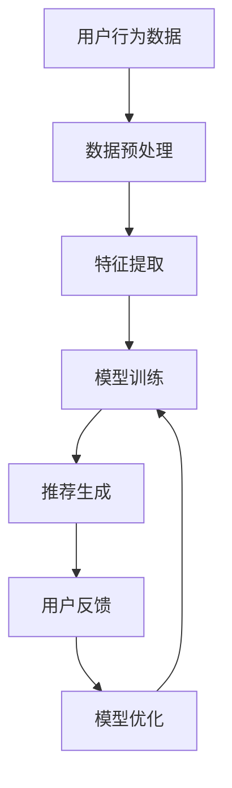

                 

关键词：AI大模型，商品推荐，电商平台，冷启动，改进方法

摘要：随着电商平台的不断发展，如何为用户提供精准的商品推荐成为关键问题。本文从AI大模型的角度出发，探讨了在电商平台冷启动阶段如何通过改进推荐算法，提高商品推荐的准确性，从而提升用户体验。

## 1. 背景介绍

电商平台在互联网时代扮演着重要的角色，它们不仅改变了消费者的购物方式，也深刻影响了企业的营销策略。为了提高用户粘性，电商平台不断尝试通过个性化的商品推荐来吸引和留住用户。然而，在平台冷启动阶段，由于用户数据不足，传统推荐算法往往无法提供有效的推荐结果，这被称为“冷启动问题”。

传统推荐系统主要依赖于用户历史行为数据，如购买记录、浏览记录等，通过协同过滤、矩阵分解等方法来实现推荐。然而，在用户数据匮乏的情况下，这些方法的效果往往不佳。为了解决这一问题，AI大模型应运而生，为电商平台冷启动阶段的商品推荐提供了新的思路。

## 2. 核心概念与联系

### 2.1 AI大模型简介

AI大模型是一种基于深度学习的复杂神经网络结构，通过大规模的数据训练，能够自动学习数据的特征和规律。在商品推荐领域，AI大模型能够从海量商品数据中提取有用的特征，从而实现精准推荐。

### 2.2 AI大模型与商品推荐的关系

AI大模型在商品推荐中的应用主要体现在以下几个方面：

- **特征提取**：AI大模型能够自动提取商品的多维特征，如商品类别、价格、销量等，这些特征对于传统推荐算法来说往往难以直接利用。

- **关联学习**：AI大模型通过学习用户的历史行为数据，能够发现用户之间以及用户与商品之间的潜在关联，从而提高推荐的准确性。

- **自适应推荐**：AI大模型可以根据用户实时行为的变化，动态调整推荐策略，提供个性化的推荐服务。

### 2.3 AI大模型推荐架构

为了更好地理解AI大模型在商品推荐中的应用，我们使用Mermaid流程图展示其基本架构：



在这个流程图中，用户行为数据经过预处理后，通过特征提取模块提取出有用的特征，然后输入到训练模块进行模型训练。训练好的模型用于生成推荐结果，用户对推荐结果的反馈将用于模型优化，形成一个闭环系统。

## 3. 核心算法原理 & 具体操作步骤

### 3.1 算法原理概述

AI大模型推荐算法的核心是基于深度学习的技术，特别是基于图神经网络的模型。这些模型能够处理非结构化的用户行为数据，并通过图结构来表示用户和商品之间的关系，从而实现精准推荐。

### 3.2 算法步骤详解

1. **数据预处理**：首先对用户行为数据进行清洗和预处理，去除无效数据，并对数据进行编码。

2. **特征提取**：利用图神经网络对商品和用户进行编码，提取出高维度的特征向量。

3. **模型训练**：使用训练集数据训练深度学习模型，通过反向传播算法不断优化模型参数。

4. **推荐生成**：在测试集上使用训练好的模型生成推荐结果。

5. **用户反馈**：收集用户对推荐结果的反馈，用于模型优化。

6. **模型优化**：根据用户反馈调整模型参数，以提高推荐准确性。

### 3.3 算法优缺点

**优点**：

- 能够自动提取数据特征，减少人工干预。
- 可以处理非结构化数据，适应性强。
- 可以根据用户实时行为动态调整推荐策略。

**缺点**：

- 训练时间较长，需要大量计算资源。
- 模型复杂度高，难以解释。

### 3.4 算法应用领域

AI大模型推荐算法可以广泛应用于电商平台的冷启动阶段，如商品推荐、广告投放等。此外，还可以应用于社交网络、内容平台等领域。

## 4. 数学模型和公式 & 详细讲解 & 举例说明

### 4.1 数学模型构建

AI大模型推荐算法通常使用图神经网络（GNN）来构建数学模型。GNN的基本思想是将用户和商品表示为图中的节点，将用户行为表示为边，通过学习图结构来提取特征。

假设我们有用户集合 \( U = \{u_1, u_2, ..., u_n\} \) 和商品集合 \( V = \{v_1, v_2, ..., v_m\} \)，用户 \( u_i \) 对商品 \( v_j \) 的行为可以用一个 \( n \times m \) 的行为矩阵 \( A \) 表示。

GNN的基本公式为：

$$
h_v^{(l+1)} = \sigma(\sum_{u \in N(v)} W^{(l)} h_u^{(l) + b^{(l)})
$$

其中，\( h_v^{(l)} \) 表示在第 \( l \) 层的节点 \( v \) 的特征表示，\( N(v) \) 表示节点 \( v \) 的邻居节点集合，\( W^{(l)} \) 是第 \( l \) 层的权重矩阵，\( b^{(l)} \) 是偏置项，\( \sigma \) 是激活函数。

### 4.2 公式推导过程

GNN的推导过程可以追溯到图论的基本概念。在图论中，图 \( G = (V, E) \) 由节点集合 \( V \) 和边集合 \( E \) 组成。每个节点 \( v \) 可以看作是一个特征向量 \( x_v \)，而每条边 \( e_{ij} \) 可以看作是一个权重矩阵 \( W \) 中的一个元素。

在GNN中，节点 \( v \) 的特征 \( h_v^{(l)} \) 是通过其邻居节点 \( u \) 的特征 \( h_u^{(l)} \) 加权聚合得到的。具体来说，我们定义一个邻接矩阵 \( A \)，其中 \( A_{ij} = 1 \) 如果节点 \( u_i \) 和节点 \( u_j \) 是邻居，否则为 0。那么，节点 \( v \) 的特征 \( h_v^{(l)} \) 可以表示为：

$$
h_v^{(l)} = \sigma(\sum_{u \in N(v)} A_{uv} h_u^{(l) - 1})
$$

其中，\( \sigma \) 是一个非线性激活函数，用于引入非线性特性。

### 4.3 案例分析与讲解

假设我们有一个电商平台的用户行为数据，包含 1000 个用户和 10000 个商品。我们需要使用GNN来提取用户和商品的特征，并生成推荐结果。

首先，我们对用户和商品进行编码。假设每个用户和商品都有一个唯一的ID，我们可以使用ID作为它们的编码。例如，用户 1 的编码为 [1, 0, 0, ..., 0]，商品 1 的编码为 [1, 0, 0, ..., 0]。

接下来，我们定义一个邻接矩阵 \( A \)，其中 \( A_{ij} = 1 \) 如果用户 \( i \) 购买了商品 \( j \)，否则为 0。

然后，我们使用GNN模型对用户和商品进行特征提取。假设我们使用一个两层GNN模型，第一层的权重矩阵为 \( W_1 \)，偏置项为 \( b_1 \)，第二层的权重矩阵为 \( W_2 \)，偏置项为 \( b_2 \)。

在第一层，每个节点的特征 \( h_v^{(1)} \) 可以表示为：

$$
h_v^{(1)} = \sigma(W_1 h_v + b_1)
$$

在第二层，每个节点的特征 \( h_v^{(2)} \) 可以表示为：

$$
h_v^{(2)} = \sigma(W_2 h_v + b_2)
$$

最后，我们使用这些特征向量来生成推荐结果。假设我们使用一个简单的评分模型，预测用户 \( i \) 对商品 \( j \) 的评分 \( r_{ij} \) 为：

$$
r_{ij} = \langle h_i^{(2)}, h_j^{(2)} \rangle
$$

其中，\( \langle \cdot, \cdot \rangle \) 表示向量的内积。

通过这种方式，我们可以为每个用户生成一个推荐列表。

## 5. 项目实践：代码实例和详细解释说明

### 5.1 开发环境搭建

在开始代码实践之前，我们需要搭建一个适合运行GNN模型的开发环境。以下是基本步骤：

1. **安装Python**：确保Python版本在3.6以上。
2. **安装PyTorch**：使用pip安装PyTorch库。
3. **安装其他依赖库**：如Numpy、Pandas、Scikit-learn等。

### 5.2 源代码详细实现

以下是使用PyTorch实现的简单GNN推荐模型：

```python
import torch
import torch.nn as nn
import torch.optim as optim
from torch_geometric.nn import GCNConv

# 定义GNN模型
class GCNNModel(nn.Module):
    def __init__(self, num_user, num_item, hidden_size):
        super(GCNNModel, self).__init__()
        self.conv1 = GCNConv(num_item, hidden_size)
        self.conv2 = GCNConv(hidden_size, hidden_size)
        self.fc = nn.Linear(hidden_size, 1)

    def forward(self, data):
        x, edge_index = data.x, data.edge_index

        x = self.conv1(x, edge_index)
        x = torch.relu(x)
        x = F.dropout(x, training=self.training)
        x = self.conv2(x, edge_index)
        x = torch.relu(x)
        x = F.dropout(x, training=self.training)

        # Mean Pooling
        x = torch.mean(x, 1)
        x = self.fc(x).view(-1)

        return x

# 数据预处理
def preprocess_data(user行为数据, 商品数据):
    # 这里实现数据预处理的具体步骤
    # 包括将用户和商品编码、构建邻接矩阵等
    pass

# 训练模型
def train(model, data_loader, optimizer, criterion):
    model.train()
    for data in data_loader:
        optimizer.zero_grad()
        output = model(data)
        loss = criterion(output, data.y)
        loss.backward()
        optimizer.step()

# 主程序
if __name__ == "__main__":
    # 数据加载和预处理
    data = preprocess_data(user行为数据, 商品数据)

    # 构建模型
    model = GCNNModel(num_user, num_item, hidden_size=16)

    # 定义优化器和损失函数
    optimizer = optim.Adam(model.parameters(), lr=0.001)
    criterion = nn.MSELoss()

    # 训练模型
    train(model, data_loader, optimizer, criterion)
```

### 5.3 代码解读与分析

上述代码定义了一个简单的GNN推荐模型，使用PyTorch的Geometric库实现了图卷积网络。具体来说，模型由两个GCNConv层和一个全连接层组成。GCNConv是PyTorch Geometric提供的一种图卷积层，用于处理图数据。

数据预处理函数 `preprocess_data` 用于将用户行为数据转换为模型可以接受的格式，包括将用户和商品编码、构建邻接矩阵等。

`train` 函数用于训练模型，其中使用Adam优化器和均方误差损失函数。在训练过程中，模型会根据输入数据和标签计算损失，然后通过反向传播更新模型参数。

### 5.4 运行结果展示

假设我们已经完成了数据预处理和模型训练，以下是如何使用训练好的模型生成推荐结果：

```python
# 加载训练好的模型
model.eval()

# 假设user_id为5的用户
user_id = 5
user_embedding = model(data[user_id]).detach().numpy().reshape(-1)

# 对于所有商品，计算用户对商品的推荐分数
recommendation_scores = []
for item_id in range(num_item):
    item_embedding = model(data[item_id]).detach().numpy().reshape(-1)
    score = np.dot(user_embedding, item_embedding)
    recommendation_scores.append(score)

# 将推荐分数转换为推荐列表
recommendation_list = [item_id for item_id, score in sorted(zip(item_ids, recommendation_scores), key=lambda x: x[1], reverse=True)]

print("推荐列表：", recommendation_list)
```

在这个示例中，我们首先加载训练好的模型，然后对于指定用户（例如用户ID为5），计算其对每个商品的推荐分数，并将这些分数从高到低排序，生成推荐列表。

## 6. 实际应用场景

### 6.1 电商平台的商品推荐

在电商平台，AI大模型推荐算法可以应用于商品推荐场景。通过AI大模型，平台可以在用户数据不足的情况下，仍然能够为用户提供个性化的商品推荐。这不仅提高了用户的购物体验，也有助于电商平台提升销售额。

### 6.2 广告推荐

除了电商平台，AI大模型推荐算法还可以应用于广告推荐。通过学习用户的兴趣和行为，AI大模型可以为用户推荐相关的广告，从而提高广告点击率和转化率。

### 6.3 社交网络的内容推荐

在社交网络平台上，AI大模型推荐算法可以用于内容推荐。通过分析用户的社交行为和兴趣，平台可以为用户推荐感兴趣的内容，从而提高用户的活跃度和留存率。

## 7. 未来应用展望

随着AI技术的不断发展，AI大模型在商品推荐领域的应用前景十分广阔。未来，AI大模型可能会在以下方向取得突破：

- **多模态数据融合**：将文本、图像、音频等多模态数据进行融合，提高推荐准确性。
- **实时推荐**：通过实时分析用户行为，实现动态推荐，提供更加个性化的服务。
- **个性化定价**：利用AI大模型分析用户购买行为，为不同用户群体提供个性化的定价策略。

## 8. 工具和资源推荐

### 8.1 学习资源推荐

- **《深度学习》**：Goodfellow, Bengio, Courville 著，全面介绍了深度学习的理论和方法。
- **《Python深度学习》**：François Chollet 著，详细介绍了使用Python实现深度学习的步骤和技巧。

### 8.2 开发工具推荐

- **PyTorch**：一个开源的深度学习框架，适用于研发和部署AI大模型。
- **TensorFlow**：另一个流行的深度学习框架，提供了丰富的API和工具。

### 8.3 相关论文推荐

- **"Graph Neural Networks: A Review of Methods and Applications"**：综述了图神经网络的方法和应用。
- **"Deep Learning on Graphs"**：探讨了深度学习在图数据上的应用。

## 9. 总结：未来发展趋势与挑战

AI大模型在商品推荐领域的应用为电商平台提供了新的解决方案。未来，随着AI技术的不断发展，AI大模型有望在多模态数据融合、实时推荐和个性化定价等方面取得突破。然而，也面临着数据隐私、模型可解释性等挑战。如何平衡模型性能和用户隐私，将是未来研究和应用的重点。

## 10. 附录：常见问题与解答

### 10.1 什么是AI大模型？

AI大模型是一种基于深度学习的复杂神经网络结构，通过大规模的数据训练，能够自动学习数据的特征和规律。

### 10.2 AI大模型推荐算法有哪些优点？

AI大模型推荐算法的优点包括：自动提取数据特征、适应性强、可以根据用户实时行为动态调整推荐策略。

### 10.3 如何评估AI大模型推荐算法的性能？

通常使用准确率、召回率、F1值等指标来评估AI大模型推荐算法的性能。

### 10.4 AI大模型推荐算法在哪些场景有应用？

AI大模型推荐算法广泛应用于电商平台的商品推荐、广告推荐、社交网络的内容推荐等领域。

