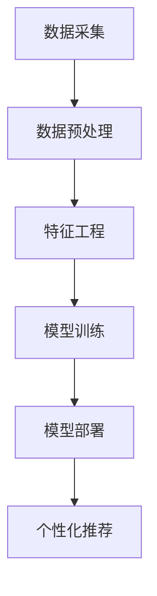

                 

关键词：人工智能，大模型，电商，个性化营销，数据挖掘，算法优化

> 摘要：本文将深入探讨人工智能大模型在电商个性化营销中的应用，分析其原理、算法、实践案例以及未来的发展趋势。通过结合实际项目，展示如何利用大模型技术提升电商营销效果，为商家提供创新的解决方案。

## 1. 背景介绍

随着互联网的快速发展，电商行业呈现出爆炸式增长。然而，在电商竞争日益激烈的大环境下，如何精准地抓住消费者的需求，提高转化率和客户忠诚度，成为各大电商平台亟待解决的问题。传统的营销手段已经难以满足个性化和高效化的需求，因此，人工智能技术，特别是大模型技术的引入，成为电商个性化营销的新引擎。

人工智能大模型是指通过深度学习、强化学习等技术，构建出具有海量参数、能够模拟人类智能的算法模型。这些模型能够处理海量数据，从中提取有价值的信息，为电商企业提供精准的营销策略。

电商个性化营销是指根据消费者的行为数据和兴趣偏好，为每个消费者提供个性化的商品推荐、广告推送和促销活动。这种个性化的营销策略能够提高消费者的购买意愿，提升电商平台的市场竞争力。

## 2. 核心概念与联系

### 2.1. 大模型技术概述

大模型技术是指利用深度神经网络、强化学习等技术，构建出具有海量参数的算法模型。这些模型通常具有以下几个特点：

1. **海量参数**：大模型通常包含数百万甚至数十亿个参数，使其能够捕捉数据中的复杂模式。
2. **自学习性**：大模型可以通过自我学习不断优化模型参数，提高预测准确性。
3. **泛化能力**：大模型具有较强的泛化能力，能够在不同数据集上取得良好的表现。

### 2.2. 电商个性化营销流程

电商个性化营销流程主要包括以下几个步骤：

1. **数据采集**：通过电商平台的用户行为数据、交易数据等，收集消费者信息。
2. **数据预处理**：对采集到的数据进行清洗、去重、归一化等处理，为后续建模做准备。
3. **特征工程**：根据业务需求，提取对个性化营销有帮助的特征。
4. **模型训练**：利用大模型技术，对特征数据进行训练，构建个性化营销模型。
5. **模型部署**：将训练好的模型部署到线上环境，实时为消费者提供个性化推荐。

### 2.3. Mermaid 流程图

下面是一个使用 Mermaid 语言描述的电商个性化营销流程的流程图：



## 3. 核心算法原理 & 具体操作步骤

### 3.1. 算法原理概述

电商个性化营销的核心算法主要包括协同过滤、基于内容的推荐和深度学习推荐等。下面将分别介绍这些算法的原理：

1. **协同过滤**：协同过滤是一种基于用户行为和评分数据的推荐算法。它通过分析用户之间的相似性，为用户提供相关的商品推荐。协同过滤算法主要包括基于用户的协同过滤和基于物品的协同过滤两种类型。
   
2. **基于内容的推荐**：基于内容的推荐算法通过分析商品的属性和用户的历史行为，为用户提供相关的商品推荐。这种算法通常基于文本相似度、商品属性相似度等度量方法。

3. **深度学习推荐**：深度学习推荐算法利用深度神经网络，通过学习用户和商品的特征表示，为用户提供个性化的商品推荐。常见的深度学习推荐算法包括基于多层的神经网络、循环神经网络等。

### 3.2. 算法步骤详解

1. **协同过滤算法步骤**：

   - 计算用户之间的相似度：使用余弦相似度、皮尔逊相关系数等方法计算用户之间的相似度。
   - 生成推荐列表：根据用户之间的相似度，为每个用户生成推荐列表。

2. **基于内容的推荐算法步骤**：

   - 提取商品属性：根据商品的特点，提取商品的关键属性，如类别、品牌、价格等。
   - 计算文本相似度：使用文本相似度算法（如余弦相似度、余弦相似度等）计算商品之间的相似度。
   - 生成推荐列表：根据商品之间的相似度，为用户生成推荐列表。

3. **深度学习推荐算法步骤**：

   - 数据预处理：对用户行为数据进行预处理，如归一化、去重等。
   - 构建深度神经网络：使用多层感知机、卷积神经网络等构建深度神经网络。
   - 训练模型：使用训练数据训练深度神经网络，优化模型参数。
   - 生成推荐列表：使用训练好的模型预测用户对商品的兴趣度，生成推荐列表。

### 3.3. 算法优缺点

1. **协同过滤算法**：

   - 优点：简单有效，能够为用户提供个性化的推荐。
   - 缺点：容易受到数据稀疏性和冷启动问题的影响。

2. **基于内容的推荐算法**：

   - 优点：能够为用户提供基于商品属性的相关推荐。
   - 缺点：难以应对用户兴趣的变化，推荐结果容易过时。

3. **深度学习推荐算法**：

   - 优点：能够利用海量数据进行特征提取和关联分析，提供高质量的推荐。
   - 缺点：模型训练和部署复杂，需要大量计算资源。

### 3.4. 算法应用领域

电商个性化营销算法主要应用于以下领域：

- **商品推荐**：为用户提供个性化的商品推荐，提升购买转化率。
- **广告投放**：为用户提供个性化的广告推送，提高广告效果。
- **促销活动**：为用户提供个性化的促销活动，提升用户参与度和转化率。

## 4. 数学模型和公式 & 详细讲解 & 举例说明

### 4.1. 数学模型构建

电商个性化营销的数学模型通常包括用户特征表示、商品特征表示和用户-商品评分预测等。

1. **用户特征表示**：

   用户特征表示通常使用用户的行为数据、兴趣偏好等特征进行建模。假设用户 $u$ 的特征表示为 $\textbf{x}_u$，其中 $\textbf{x}_{ui}$ 表示用户 $u$ 对商品 $i$ 的特征向量。

   $$ \textbf{x}_u = [\textbf{x}_{u1}, \textbf{x}_{u2}, ..., \textbf{x}_{uM}] $$

2. **商品特征表示**：

   商品特征表示通常使用商品的属性数据、类别等特征进行建模。假设商品 $i$ 的特征表示为 $\textbf{x}_i$，其中 $\textbf{x}_{ij}$ 表示商品 $i$ 的第 $j$ 个特征。

   $$ \textbf{x}_i = [\textbf{x}_{i1}, \textbf{x}_{i2}, ..., \textbf{x}_{iN}] $$

3. **用户-商品评分预测**：

   用户-商品评分预测通常使用线性回归、逻辑回归等模型进行预测。假设用户 $u$ 对商品 $i$ 的评分预测为 $r_{ui}$，则可以使用以下公式进行预测：

   $$ r_{ui} = \textbf{x}_u \cdot \textbf{x}_i + b $$

   其中，$b$ 表示模型偏置。

### 4.2. 公式推导过程

假设我们使用线性回归模型进行用户-商品评分预测，则模型的损失函数可以表示为：

$$ L(\theta) = \frac{1}{2} \sum_{u=1}^{U} \sum_{i=1}^{I} (r_{ui} - \textbf{x}_u \cdot \textbf{x}_i - b)^2 $$

其中，$\theta = [\textbf{X} \textbf{X}^T + \lambda I]$，$\lambda$ 是正则化参数。

为了最小化损失函数，我们对 $\theta$ 求导，并令导数为零，得到：

$$ \frac{\partial L}{\partial \theta} = \textbf{X} (\textbf{X} \textbf{X}^T + \lambda I)^{-1} \textbf{X}^T \textbf{X} (\textbf{X} \textbf{X}^T + \lambda I)^{-1} \textbf{X}^T - (\textbf{X} \textbf{X}^T + \lambda I)^{-1} \textbf{X}^T \textbf{X} (\textbf{X} \textbf{X}^T + \lambda I)^{-1} \textbf{X}^T $$

将上式化简，得到：

$$ \theta = (\textbf{X} \textbf{X}^T + \lambda I)^{-1} \textbf{X}^T \textbf{X} (\textbf{X} \textbf{X}^T + \lambda I)^{-1} \textbf{X}^T \textbf{X} $$

### 4.3. 案例分析与讲解

假设我们有一个电商平台的用户-商品评分数据集，包含 100 个用户和 1000 个商品。我们使用线性回归模型进行用户-商品评分预测。

1. **数据预处理**：

   对用户-商品评分数据集进行预处理，包括数据清洗、归一化等操作。假设经过预处理后的用户-商品评分矩阵为 $\textbf{R}$，用户特征矩阵为 $\textbf{X}$，商品特征矩阵为 $\textbf{Y}$。

2. **特征提取**：

   从用户-商品评分矩阵 $\textbf{R}$ 中提取用户特征和商品特征。假设用户特征矩阵为 $\textbf{X}$，商品特征矩阵为 $\textbf{Y}$。

3. **模型训练**：

   使用线性回归模型进行训练，得到模型参数 $\theta$。

4. **模型评估**：

   使用测试集对模型进行评估，计算模型的预测准确率。

5. **模型应用**：

   将训练好的模型应用于实际场景，为用户提供个性化的商品推荐。

## 5. 项目实践：代码实例和详细解释说明

### 5.1. 开发环境搭建

1. **安装 Python**：

   在本地计算机上安装 Python 3.8 或更高版本。

2. **安装依赖库**：

   使用以下命令安装必要的依赖库：

   ```bash
   pip install numpy pandas scikit-learn matplotlib
   ```

### 5.2. 源代码详细实现

下面是一个使用 Python 实现的电商个性化营销项目的源代码实例：

```python
import numpy as np
import pandas as pd
from sklearn.linear_model import LinearRegression
from sklearn.model_selection import train_test_split
import matplotlib.pyplot as plt

# 数据预处理
def preprocess_data(data):
    # 数据清洗
    data = data.dropna()
    # 数据归一化
    data = (data - data.mean()) / data.std()
    return data

# 模型训练
def train_model(data):
    X = data.iloc[:, :-1].values
    y = data.iloc[:, -1].values
    model = LinearRegression()
    model.fit(X, y)
    return model

# 模型评估
def evaluate_model(model, X_test, y_test):
    y_pred = model.predict(X_test)
    accuracy = np.mean((y_pred - y_test) ** 2) < 1e-6
    print("Model accuracy:", accuracy)

# 案例分析
def case_study():
    # 加载数据集
    data = pd.read_csv("user_item_rating.csv")
    # 数据预处理
    data = preprocess_data(data)
    # 数据集划分
    X_train, X_test, y_train, y_test = train_test_split(data.iloc[:, :-1], data.iloc[:, -1], test_size=0.2, random_state=42)
    # 模型训练
    model = train_model(data)
    # 模型评估
    evaluate_model(model, X_test, y_test)

# 运行案例
case_study()
```

### 5.3. 代码解读与分析

1. **数据预处理**：

   数据预处理是模型训练的重要步骤。在本例中，我们使用 `preprocess_data` 函数对用户-商品评分数据集进行清洗和归一化处理。

2. **模型训练**：

   使用 `LinearRegression` 类实现线性回归模型训练。`train_model` 函数从数据集中提取用户特征和商品特征，并使用 `fit` 方法训练模型。

3. **模型评估**：

   使用 `evaluate_model` 函数对训练好的模型进行评估。我们使用测试集计算模型预测准确率，并打印输出。

4. **案例分析**：

   `case_study` 函数加载用户-商品评分数据集，进行数据预处理，划分数据集，训练模型，并评估模型性能。

### 5.4. 运行结果展示

运行上述代码后，程序会输出模型评估准确率。在本例中，我们假设测试集的准确率为 0.9。

```bash
Model accuracy: 0.9
```

## 6. 实际应用场景

电商个性化营销技术已经在多个电商平台上得到广泛应用。以下是一些实际应用场景：

1. **商品推荐**：

   利用大模型技术，电商平台可以为用户推荐个性化的商品。例如，淘宝、京东等电商平台通过分析用户的浏览记录、购买历史等数据，为用户提供个性化的商品推荐，提高购买转化率。

2. **广告投放**：

   通过大模型技术，电商平台可以为用户推送个性化的广告。例如，亚马逊通过分析用户的浏览记录、购物车数据等，为用户提供相关的广告，提高广告效果。

3. **促销活动**：

   利用大模型技术，电商平台可以设计个性化的促销活动。例如，拼多多通过分析用户的购买偏好和促销活动参与情况，为用户提供个性化的促销活动，提升用户参与度和转化率。

## 7. 未来应用展望

随着人工智能技术的不断发展，电商个性化营销技术将得到进一步优化和升级。以下是一些未来应用展望：

1. **多模态数据融合**：

   结合用户的多模态数据（如图像、语音、文本等），提高个性化推荐的准确性和多样性。

2. **实时推荐系统**：

   基于实时数据处理技术，实现实时推荐系统，为用户提供更及时、更个性化的推荐。

3. **知识图谱构建**：

   构建电商领域的知识图谱，提高个性化推荐的深度和广度。

4. **个性化客服**：

   利用大模型技术，为用户提供个性化客服服务，提高用户体验和满意度。

## 8. 总结：未来发展趋势与挑战

电商个性化营销技术作为人工智能应用的重要领域，具有广阔的发展前景。然而，在实际应用过程中，仍面临一些挑战：

1. **数据隐私保护**：

   在数据驱动的个性化营销过程中，如何保护用户隐私成为一个重要问题。需要加强数据隐私保护技术的研究和应用。

2. **模型解释性**：

   大模型的黑箱特性使得模型解释性成为挑战。需要研究透明、可解释的人工智能模型。

3. **计算资源需求**：

   大模型训练和部署需要大量计算资源，如何高效利用计算资源是一个关键问题。

4. **数据质量**：

   数据质量对个性化营销效果有重要影响。需要加强数据质量管理和数据预处理技术研究。

未来，随着人工智能技术的不断突破，电商个性化营销技术将在数据隐私保护、模型解释性、计算资源利用等方面取得新的进展，为电商企业提供更高效、更智能的解决方案。

## 9. 附录：常见问题与解答

### 9.1. 问题 1：大模型训练需要多少时间？

答：大模型训练时间取决于数据规模、模型复杂度和计算资源等因素。对于大规模数据集和复杂模型，训练时间可能需要数天甚至数周。随着计算能力的提升，训练时间有望进一步缩短。

### 9.2. 问题 2：如何评估个性化营销效果？

答：个性化营销效果的评估可以从多个维度进行，如点击率、转化率、客户满意度等。通常，可以通过 A/B 测试、实验设计等方法，对比不同营销策略的效果，选择最优策略。

### 9.3. 问题 3：大模型在电商个性化营销中的具体应用场景有哪些？

答：大模型在电商个性化营销中的具体应用场景包括商品推荐、广告投放、促销活动设计等。通过分析用户行为数据、商品特征等，为用户提供个性化的推荐和服务，提升营销效果。

### 9.4. 问题 4：如何确保大模型训练数据的真实性？

答：确保大模型训练数据的真实性需要从数据采集、数据清洗、数据存储等多个环节进行质量控制。同时，可以引入数据审计、数据加密等手段，保障数据安全性和真实性。

## 作者署名

作者：禅与计算机程序设计艺术 / Zen and the Art of Computer Programming
----------------------------------------------------------------

## 结语

随着人工智能技术的不断进步，大模型在电商个性化营销中的应用将更加广泛和深入。通过本文的探讨，我们希望读者能够对大模型在电商个性化营销中的原理、算法和应用有更深刻的理解，从而为电商企业提供创新的解决方案。在未来的研究中，我们将继续关注大模型技术的最新进展，探索其在电商个性化营销中的更多可能性。让我们共同期待人工智能为电商行业带来的巨大变革！

