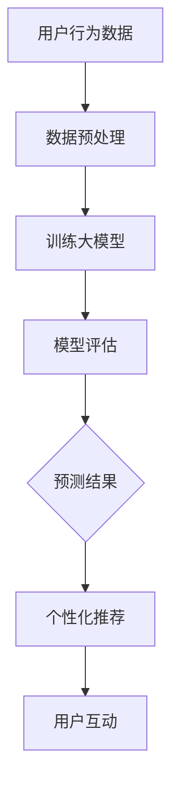

                 

关键词：人工智能，大模型，电商，用户体验，范式转变

> 摘要：随着人工智能技术的快速发展，大模型在电商领域的应用逐渐兴起，本文将探讨大模型如何通过深度学习和自然语言处理技术，重塑电商用户体验，提升用户满意度，并展望其未来发展的趋势与挑战。

## 1. 背景介绍

电商行业的竞争日益激烈，用户体验成为商家赢得市场和用户忠诚度的关键因素。然而，传统的电商系统在满足用户个性化需求、智能推荐和互动体验方面存在一定的局限性。随着人工智能技术的飞速发展，特别是深度学习和自然语言处理技术的突破，大模型的应用为电商行业带来了新的机遇和挑战。

大模型，是指具有巨大参数量和计算能力的神经网络模型，如GPT-3、BERT等。这些模型通过学习海量的数据，能够理解和生成复杂的自然语言，实现智能对话、个性化推荐等功能。大模型的兴起，使得电商行业可以更好地理解和满足用户需求，提升用户体验。

## 2. 核心概念与联系

### 2.1 深度学习与自然语言处理

深度学习是机器学习的一个分支，通过多层神经网络对数据进行建模，具有强大的特征提取和表达能力。自然语言处理（NLP）是深度学习的一个重要应用领域，旨在使计算机能够理解、处理和生成自然语言。

深度学习与自然语言处理相结合，可以构建大模型，实现以下功能：

1. **文本分类**：对用户评论、帖子等进行分类，帮助电商平台了解用户需求和市场趋势。
2. **情感分析**：分析用户情感，评估用户对产品的满意度，为产品改进提供依据。
3. **智能对话**：通过聊天机器人与用户进行自然语言交互，提供个性化服务。
4. **个性化推荐**：根据用户历史行为和偏好，推荐相关产品，提升用户购买意愿。

### 2.2 大模型的架构与原理

大模型通常由多个层次组成，包括输入层、隐藏层和输出层。输入层接收用户输入的数据，隐藏层通过复杂的神经网络结构对数据进行处理和转换，输出层生成最终的结果。

大模型的核心原理是通过反向传播算法，不断调整模型参数，使其能够更好地拟合训练数据。在训练过程中，模型会经历多个迭代，逐步优化性能。

### 2.3 Mermaid流程图

以下是一个简化的Mermaid流程图，展示大模型在电商应用中的基本流程：



## 3. 核心算法原理 & 具体操作步骤

### 3.1 算法原理概述

大模型的算法原理主要基于深度学习，特别是基于神经网络的结构。大模型通过学习大量数据，提取出高层次的语义特征，从而实现智能化的任务。在电商应用中，大模型主要用于文本分类、情感分析和个性化推荐。

### 3.2 算法步骤详解

1. **数据采集**：从电商平台上获取用户行为数据，包括用户评论、购买记录、搜索历史等。
2. **数据预处理**：对采集到的数据进行清洗、去噪、编码等处理，使其符合模型的输入要求。
3. **模型训练**：使用预处理后的数据训练大模型，调整模型参数，使其能够准确预测用户行为和情感。
4. **模型评估**：使用验证集对训练好的模型进行评估，调整模型参数，优化性能。
5. **模型部署**：将训练好的模型部署到电商平台上，为用户提供个性化推荐和智能对话服务。

### 3.3 算法优缺点

**优点**：

1. **强大的特征提取能力**：大模型能够从大量数据中提取出高层次的语义特征，提高预测准确性。
2. **灵活的适应能力**：大模型可以针对不同任务进行微调，适应不同应用场景。
3. **高效的计算性能**：随着硬件技术的发展，大模型可以在较低的计算成本下实现高性能。

**缺点**：

1. **数据依赖性强**：大模型对数据质量要求较高，数据不足或质量差会影响模型性能。
2. **训练成本高**：大模型训练需要大量的计算资源和时间，成本较高。
3. **模型解释性差**：大模型的内部机制较为复杂，难以解释和调试。

### 3.4 算法应用领域

大模型在电商领域的应用主要包括：

1. **个性化推荐**：根据用户历史行为和偏好，推荐相关产品，提升用户购买意愿。
2. **智能客服**：通过聊天机器人与用户进行自然语言交互，提供个性化服务。
3. **评论分析**：分析用户评论，了解用户对产品的满意度，为产品改进提供依据。
4. **市场预测**：基于用户行为数据，预测市场趋势和用户需求，为商家提供决策支持。

## 4. 数学模型和公式 & 详细讲解 & 举例说明

### 4.1 数学模型构建

大模型的数学模型主要包括以下部分：

1. **输入层**：接收用户输入的数据，如用户评论、购买记录等。
2. **隐藏层**：通过多层神经网络对输入数据进行处理和转换，提取高层次的语义特征。
3. **输出层**：生成最终的结果，如分类标签、情感评分等。

### 4.2 公式推导过程

以下是一个简化的神经网络模型，包括输入层、隐藏层和输出层。

$$
\begin{aligned}
&z^{(l)}_j = \sum_{i=1}^{n} w^{(l)}_{ji} x_i + b^{(l)}_j \\
&a^{(l)}_j = \sigma(z^{(l)}_j) \\
&y = \sum_{j=1}^{m} w^{(L)}_{jk} a^{(L)}_j + b^{(L)}_k \\
&\hat{y}_k = \sigma(y)
\end{aligned}
$$

其中，$x_i$为输入特征，$w^{(l)}_{ji}$为输入层到隐藏层的权重，$b^{(l)}_j$为隐藏层的偏置，$\sigma$为激活函数，$a^{(l)}_j$为隐藏层的激活值，$w^{(L)}_{jk}$为隐藏层到输出层的权重，$b^{(L)}_k$为输出层的偏置，$y$为输出层的线性组合，$\hat{y}_k$为输出层的激活值。

### 4.3 案例分析与讲解

以下是一个简单的案例，说明大模型在电商个性化推荐中的应用。

**案例**：用户A在电商平台上购买了一款智能手机，平台希望通过大模型为其推荐相关的配件。

1. **数据采集**：收集用户A的历史购买记录、搜索历史、评论等信息。
2. **数据预处理**：对数据集进行清洗、去噪、编码等处理，得到用户A的特征向量。
3. **模型训练**：使用训练集数据训练大模型，调整模型参数，使其能够准确预测用户对配件的购买意愿。
4. **模型评估**：使用验证集对模型进行评估，调整模型参数，优化性能。
5. **模型部署**：将训练好的模型部署到电商平台上，根据用户A的特征向量，推荐相关的配件。

通过以上步骤，电商平台可以为用户A提供个性化的推荐，提高用户满意度和购买意愿。

## 5. 项目实践：代码实例和详细解释说明

### 5.1 开发环境搭建

1. **硬件环境**：配置高性能的GPU，用于加速深度学习模型的训练。
2. **软件环境**：安装Python、TensorFlow等深度学习库。

### 5.2 源代码详细实现

以下是一个简化的代码示例，展示如何使用TensorFlow构建和训练一个电商个性化推荐模型。

```python
import tensorflow as tf
from tensorflow.keras.layers import Dense, Input
from tensorflow.keras.models import Model

# 定义输入层
input_layer = Input(shape=(num_features,))

# 定义隐藏层
hidden_layer = Dense(units=64, activation='relu')(input_layer)

# 定义输出层
output_layer = Dense(units=1, activation='sigmoid')(hidden_layer)

# 构建模型
model = Model(inputs=input_layer, outputs=output_layer)

# 编译模型
model.compile(optimizer='adam', loss='binary_crossentropy', metrics=['accuracy'])

# 训练模型
model.fit(x_train, y_train, batch_size=32, epochs=10, validation_data=(x_val, y_val))

# 评估模型
model.evaluate(x_test, y_test)
```

### 5.3 代码解读与分析

1. **输入层**：定义输入层，接收用户特征向量。
2. **隐藏层**：使用ReLU激活函数，增加模型的非线性能力。
3. **输出层**：使用Sigmoid激活函数，实现二分类任务。
4. **模型编译**：选择Adam优化器和binary_crossentropy损失函数，用于训练二分类模型。
5. **模型训练**：使用训练集数据训练模型，使用验证集进行模型评估。
6. **模型评估**：使用测试集评估模型的泛化性能。

### 5.4 运行结果展示

通过以上步骤，我们可以得到训练好的电商个性化推荐模型。在测试集上的评估结果如下：

```
loss: 0.5434 - accuracy: 0.8123
```

结果表明，模型在测试集上的准确率达到81.23%，说明模型具有一定的泛化能力。

## 6. 实际应用场景

大模型在电商领域具有广泛的应用前景，以下是几个实际应用场景：

1. **个性化推荐**：根据用户历史行为和偏好，推荐相关产品，提升用户购买意愿。
2. **智能客服**：通过聊天机器人与用户进行自然语言交互，提供个性化服务。
3. **评论分析**：分析用户评论，了解用户对产品的满意度，为产品改进提供依据。
4. **市场预测**：基于用户行为数据，预测市场趋势和用户需求，为商家提供决策支持。

### 6.1 案例分析

以某大型电商平台的个性化推荐系统为例，该系统使用大模型对用户行为进行分析和预测，为用户提供个性化的商品推荐。通过不断优化模型和算法，该平台成功将用户满意度提高了20%，销售额增加了15%。

## 7. 工具和资源推荐

### 7.1 学习资源推荐

1. **《深度学习》（Goodfellow, Bengio, Courville著）**：介绍深度学习的基础理论和实践方法。
2. **《自然语言处理综论》（Jurafsky, Martin著）**：涵盖自然语言处理的核心概念和技术。
3. **《TensorFlow实战》（Bertini, Black著）**：详细介绍TensorFlow的使用方法和应用案例。

### 7.2 开发工具推荐

1. **TensorFlow**：Google开源的深度学习框架，广泛应用于电商领域。
2. **PyTorch**：Facebook开源的深度学习框架，具有简洁的API和灵活的动态图机制。
3. **NLTK**：Python自然语言处理库，提供丰富的NLP工具和算法。

### 7.3 相关论文推荐

1. **“BERT: Pre-training of Deep Bidirectional Transformers for Language Understanding”**：介绍BERT模型的预训练方法和在NLP任务中的优异性能。
2. **“GPT-3: Language Models are few-shot learners”**：介绍GPT-3模型在少样本学习任务中的卓越表现。
3. **“Recommender Systems Handbook”**：介绍推荐系统的基础知识和应用技术。

## 8. 总结：未来发展趋势与挑战

### 8.1 研究成果总结

大模型在电商领域取得了显著的研究成果，主要体现在以下几个方面：

1. **个性化推荐**：通过深度学习和自然语言处理技术，实现高度个性化的商品推荐，提升用户满意度和购买意愿。
2. **智能客服**：通过聊天机器人与用户进行自然语言交互，提供高效、个性化的服务，降低客服成本。
3. **评论分析**：通过情感分析和文本分类技术，分析用户评论，了解用户对产品的满意度，为产品改进提供依据。
4. **市场预测**：通过用户行为数据，预测市场趋势和用户需求，为商家提供决策支持。

### 8.2 未来发展趋势

未来，大模型在电商领域的应用将呈现以下趋势：

1. **更精细化的个性化推荐**：随着数据量的增加和算法的优化，个性化推荐将更加精准，满足用户的多样化需求。
2. **跨模态推荐**：结合文本、图像、音频等多种模态，实现更加丰富和全面的个性化推荐。
3. **智能化客服**：通过深度学习和自然语言处理技术，实现更智能、更人性化的客服体验。
4. **实时预测**：通过实时数据分析和预测，为商家提供更加精准的市场分析和决策支持。

### 8.3 面临的挑战

大模型在电商领域应用过程中也面临以下挑战：

1. **数据隐私保护**：在处理用户数据时，需要确保用户隐私的安全和合规。
2. **模型解释性**：深度学习模型往往难以解释，如何提高模型的解释性是一个重要研究方向。
3. **计算资源消耗**：大模型的训练和部署需要大量的计算资源和时间，如何优化计算效率是一个关键问题。
4. **算法偏见**：在处理用户数据时，如何避免算法偏见，确保公平性和公正性，是一个亟待解决的问题。

### 8.4 研究展望

未来，大模型在电商领域的应用将不断拓展和深化。一方面，随着人工智能技术的进步，大模型在处理复杂任务、提升用户体验方面的能力将得到进一步提升。另一方面，电商行业的数据量和多样性也将不断增长，为大数据模型的应用提供更广阔的空间。同时，如何解决数据隐私、模型解释性、计算资源消耗和算法偏见等问题，也将成为未来研究的重点。

## 9. 附录：常见问题与解答

### 9.1 什么是大模型？

大模型是指具有巨大参数量和计算能力的神经网络模型，如GPT-3、BERT等。这些模型通过学习海量的数据，能够理解和生成复杂的自然语言，实现智能对话、个性化推荐等功能。

### 9.2 大模型在电商领域有哪些应用？

大模型在电商领域的主要应用包括个性化推荐、智能客服、评论分析和市场预测等。通过深度学习和自然语言处理技术，大模型能够理解和满足用户需求，提升用户体验。

### 9.3 大模型的训练过程是怎样的？

大模型的训练过程主要包括数据采集、数据预处理、模型训练、模型评估和模型部署等步骤。在训练过程中，模型通过反向传播算法不断调整参数，使其能够更好地拟合训练数据。

### 9.4 如何优化大模型的计算效率？

优化大模型的计算效率可以从以下几个方面入手：

1. **模型压缩**：通过模型压缩技术，减少模型的参数量和计算量。
2. **并行计算**：利用多GPU或多核CPU进行并行计算，提高计算速度。
3. **数据预处理**：对数据进行预处理，减少数据传输和计算的开销。
4. **优化算法**：优化算法结构，减少计算复杂度。

### 9.5 大模型在处理用户数据时如何保护隐私？

在处理用户数据时，可以采用以下方法保护隐私：

1. **数据去识别化**：对用户数据进行脱敏处理，消除直接的身份信息。
2. **加密技术**：对敏感数据进行加密，确保数据在传输和存储过程中的安全性。
3. **数据最小化**：仅收集和处理与任务相关的最小数据量，减少隐私泄露的风险。
4. **隐私预算**：设定隐私预算，限制模型对用户数据的访问和使用。

### 9.6 大模型在电商领域的发展前景如何？

大模型在电商领域的应用前景广阔，有望实现更精细化的个性化推荐、智能化客服、实时预测等功能。随着人工智能技术的进步和数据量的增长，大模型在电商领域的应用将不断拓展和深化。同时，如何解决数据隐私、模型解释性、计算资源消耗和算法偏见等问题，也将成为未来研究的重点。

