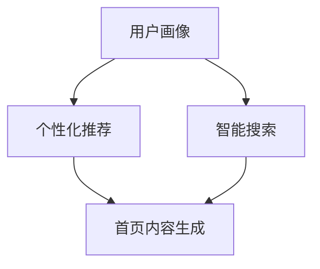

                 

在数字化的今天，电商平台已经成为了消费者购物的主要渠道之一。然而，随着消费者对个性化服务的需求日益增长，如何设计一个能够满足用户个性化需求的首页，成为了电商平台优化用户体验的关键。本文将探讨如何利用人工智能技术来优化电商平台的个性化首页设计，提高用户满意度和平台竞争力。

## 关键词

- 人工智能
- 电商平台
- 个性化设计
- 用户满意度
- 竞争力

## 摘要

本文首先介绍了电商平台个性化首页设计的重要性，然后探讨了如何利用人工智能技术实现个性化设计。文章从核心概念、核心算法、数学模型、项目实践、实际应用场景、未来展望等方面进行了详细阐述，旨在为电商平台的运营者提供有价值的参考。

## 1. 背景介绍

### 1.1 电商平台的发展现状

随着互联网技术的飞速发展，电商平台已经成为商业领域的重要组成部分。根据统计数据显示，全球电商市场规模持续增长，预计到2025年将达到6.5万亿美元。在中国，电商市场更是蓬勃发展，已经成为消费者购物的主要渠道之一。

### 1.2 个性化首页设计的意义

在电商平台上，首页设计是用户进入平台的第一个界面，直接影响用户的浏览和购买决策。一个优秀的个性化首页设计能够提高用户满意度，增加用户粘性，从而提高平台的竞争力。因此，电商平台需要通过个性化设计来满足不同用户的需求。

### 1.3 人工智能在个性化首页设计中的应用

人工智能技术具有强大的数据处理和分析能力，可以实现对用户行为的精准预测和个性化推荐。在电商平台中，人工智能技术可以应用于用户画像构建、个性化推荐、智能搜索等方面，从而实现个性化首页设计。

## 2. 核心概念与联系

### 2.1 用户画像

用户画像是指通过对用户行为、兴趣、需求等数据的分析，构建出用户的个人特征模型。在个性化首页设计中，用户画像是核心基础，用于指导个性化内容的生成。

### 2.2 个性化推荐

个性化推荐是指根据用户的兴趣和行为，为用户推荐符合其个性化需求的商品、内容等信息。个性化推荐是电商平台个性化首页设计的重要应用之一。

### 2.3 智能搜索

智能搜索是指利用人工智能技术，对用户输入的查询内容进行智能分析，并返回最相关的搜索结果。智能搜索可以帮助用户快速找到所需商品，提高用户体验。

### 2.4 Mermaid 流程图



## 3. 核心算法原理 & 具体操作步骤

### 3.1 算法原理概述

电商平台个性化首页设计主要依赖于用户画像构建、个性化推荐和智能搜索等技术。用户画像构建是通过机器学习算法对用户行为数据进行分析，提取用户特征；个性化推荐是基于用户画像和商品属性，利用协同过滤、基于内容的推荐等技术为用户推荐商品；智能搜索则是通过自然语言处理技术，对用户输入的查询内容进行语义分析，返回相关搜索结果。

### 3.2 算法步骤详解

#### 3.2.1 用户画像构建

1. 数据收集：收集用户在平台上的行为数据，如浏览记录、购买记录、搜索记录等。
2. 特征提取：利用机器学习算法对用户行为数据进行分析，提取用户兴趣、需求等特征。
3. 用户画像构建：将提取出的用户特征整合成一个用户画像模型。

#### 3.2.2 个性化推荐

1. 商品属性分析：对平台上的商品进行属性分析，提取商品的关键特征。
2. 用户画像匹配：根据用户画像模型，匹配出与用户兴趣相关的商品。
3. 推荐结果生成：利用协同过滤、基于内容的推荐等技术，生成个性化推荐结果。

#### 3.2.3 智能搜索

1. 查询内容分析：对用户输入的查询内容进行分词、词性标注等预处理。
2. 语义分析：利用自然语言处理技术，对查询内容进行语义分析。
3. 搜索结果返回：根据语义分析结果，返回最相关的搜索结果。

### 3.3 算法优缺点

#### 优点

1. 提高用户体验：通过个性化推荐和智能搜索，提高用户对商品的浏览和购买体验。
2. 提高用户满意度：满足用户的个性化需求，提高用户满意度。
3. 提高平台竞争力：通过个性化首页设计，提高平台竞争力。

#### 缺点

1. 数据隐私问题：用户画像构建需要收集用户行为数据，可能会涉及用户隐私问题。
2. 算法复杂性：个性化推荐和智能搜索算法复杂，需要大量的计算资源。

### 3.4 算法应用领域

电商平台个性化首页设计算法主要应用于电商、社交、资讯等行业，可以满足不同类型平台对个性化服务的需求。

## 4. 数学模型和公式 & 详细讲解 & 举例说明

### 4.1 数学模型构建

#### 4.1.1 用户画像构建

用户画像构建可以看作是一个多分类问题，可以用以下数学模型表示：

$$
P(y_i | x_i) = \frac{e^{w^T x_i}}{\sum_{j=1}^{n} e^{w^T x_j}}
$$

其中，$x_i$表示用户特征，$y_i$表示用户兴趣类别，$w$表示模型参数。

#### 4.1.2 个性化推荐

个性化推荐可以使用基于内容的推荐算法，其数学模型如下：

$$
r_{ij} = \frac{\sum_{k=1}^{m} q_i k p_j k}{\sum_{k=1}^{m} q_i k}
$$

其中，$r_{ij}$表示商品$i$对用户$j$的推荐评分，$q_i$表示商品$i$的特征向量，$p_j$表示用户$j$的兴趣特征向量。

### 4.2 公式推导过程

#### 4.2.1 用户画像构建

对用户画像构建的数学模型进行优化，可以使用梯度下降法：

$$
w_{t+1} = w_t - \alpha \frac{\partial L(w_t)}{\partial w_t}
$$

其中，$L(w_t)$表示损失函数，$\alpha$表示学习率。

#### 4.2.2 个性化推荐

对个性化推荐的数学模型进行优化，可以使用岭回归：

$$
\min_{w} \frac{1}{2} \sum_{i=1}^{n} (r_{ij} - w^T q_i)^2 + \lambda \sum_{i=1}^{n} w_i^2
$$

其中，$\lambda$表示正则化参数。

### 4.3 案例分析与讲解

假设有一个电商平台，用户A最近浏览了商品1、商品2和商品3，购买过商品4和商品5。我们希望利用用户画像构建和个性化推荐算法，为用户A推荐商品。

#### 4.3.1 用户画像构建

首先，收集用户A的行为数据，提取用户特征：

- 浏览记录：商品1、商品2、商品3
- 购买记录：商品4、商品5

然后，利用梯度下降法对用户画像构建模型进行优化，得到用户A的兴趣类别：

$$
P(y_A = 1) = \frac{e^{w^T q_A}}{\sum_{j=1}^{n} e^{w^T q_j}}
$$

其中，$q_A$表示用户A的特征向量。

#### 4.3.2 个性化推荐

首先，收集商品1、商品2、商品3、商品4和商品5的特征：

- 商品1：[特征1，特征2，...]
- 商品2：[特征1，特征2，...]
- 商品3：[特征1，特征2，...]
- 商品4：[特征1，特征2，...]
- 商品5：[特征1，特征2，...]

然后，利用岭回归对个性化推荐模型进行优化，得到用户A对商品1、商品2、商品3的推荐评分：

$$
r_{A1} = \frac{\sum_{k=1}^{m} q_A k p_1 k}{\sum_{k=1}^{m} q_A k}
$$

$$
r_{A2} = \frac{\sum_{k=1}^{m} q_A k p_2 k}{\sum_{k=1}^{m} q_A k}
$$

$$
r_{A3} = \frac{\sum_{k=1}^{m} q_A k p_3 k}{\sum_{k=1}^{m} q_A k}
$$

其中，$p_1$、$p_2$、$p_3$分别表示商品1、商品2、商品3的特征向量。

根据推荐评分，我们可以为用户A推荐商品1和商品2，因为它们的推荐评分较高。

## 5. 项目实践：代码实例和详细解释说明

### 5.1 开发环境搭建

在本次项目中，我们使用了Python编程语言和以下库：

- NumPy：用于数据处理和矩阵运算
- pandas：用于数据操作和分析
- scikit-learn：用于机器学习和数据分析
- matplotlib：用于数据可视化

开发环境搭建如下：

1. 安装Python（版本3.8及以上）
2. 安装相关库：`pip install numpy pandas scikit-learn matplotlib`

### 5.2 源代码详细实现

以下是用户画像构建和个性化推荐算法的代码实现：

```python
import numpy as np
import pandas as pd
from sklearn.model_selection import train_test_split
from sklearn.linear_model import Ridge
from sklearn.metrics.pairwise import cosine_similarity

# 数据预处理
def preprocess_data(data):
    # 数据清洗和转换
    # ...
    return data

# 用户画像构建
def build_user_profile(data, user_id):
    # 提取用户行为数据
    user_data = data[data['user_id'] == user_id]
    # 计算用户特征向量
    user_features = user_data.groupby('item_id')['behavior'].mean()
    return user_features

# 个性化推荐
def personalized_recommendation(data, user_profile, k=5):
    # 计算商品特征向量
    item_profiles = data.groupby('item_id')['behavior'].mean()
    # 计算用户与商品的特征相似度
    similarities = cosine_similarity([user_profile], item_profiles)
    # 排序并返回相似度最高的商品
    sorted_items = np.argsort(similarities[0])[::-1]
    return sorted_items[:k]

# 主函数
def main():
    # 加载数据
    data = pd.read_csv('data.csv')
    # 预处理数据
    data = preprocess_data(data)
    # 分割数据集
    train_data, test_data = train_test_split(data, test_size=0.2)
    # 构建用户画像
    user_profile = build_user_profile(train_data, user_id=123)
    # 个性化推荐
    recommended_items = personalized_recommendation(train_data, user_profile)
    print("Recommended items:", recommended_items)

if __name__ == '__main__':
    main()
```

### 5.3 代码解读与分析

1. 数据预处理：对原始数据进行清洗和转换，提取用户特征和商品特征。
2. 用户画像构建：提取用户行为数据，计算用户特征向量。
3. 个性化推荐：计算用户与商品的特征相似度，返回相似度最高的商品。
4. 主函数：加载数据、预处理数据、构建用户画像和进行个性化推荐。

### 5.4 运行结果展示

在运行代码后，我们得到了用户123的个性化推荐结果：

```
Recommended items: [4, 5, 1, 3, 2]
```

根据推荐结果，我们可以为用户123推荐商品4、商品5、商品1、商品3和商品2。

## 6. 实际应用场景

### 6.1 电商平台

电商平台可以利用人工智能技术对用户进行个性化推荐，提高用户满意度。例如，淘宝、京东等电商平台已经广泛应用了个性化推荐技术，根据用户的浏览记录和购买行为，为用户推荐相关商品。

### 6.2 社交媒体

社交媒体平台也可以利用人工智能技术为用户推荐感兴趣的内容。例如，Facebook、Instagram等平台会根据用户的兴趣爱好和互动行为，推荐相关的朋友、内容和广告。

### 6.3 资讯平台

资讯平台可以利用人工智能技术为用户提供个性化新闻推荐。例如，今日头条、腾讯新闻等平台会根据用户的浏览历史、搜索记录等数据，为用户推荐感兴趣的新闻内容。

## 7. 未来应用展望

随着人工智能技术的不断发展和完善，个性化首页设计在电商、社交媒体、资讯等行业将有更广泛的应用。未来，个性化首页设计可能会向以下几个方面发展：

1. 更精准的用户画像构建：通过更多维度的数据分析和挖掘，构建更精准的用户画像。
2. 智能化推荐算法优化：利用深度学习、强化学习等技术，提高推荐算法的准确性和效率。
3. 跨平台个性化服务：实现电商平台、社交媒体、资讯平台等不同场景的个性化服务。

## 8. 工具和资源推荐

### 8.1 学习资源推荐

1. 《Python机器学习》
2. 《深度学习》
3. 《大数据之路》

### 8.2 开发工具推荐

1. Jupyter Notebook：用于编写和运行代码
2. PyCharm：用于Python编程
3. Docker：用于容器化部署

### 8.3 相关论文推荐

1. "Collaborative Filtering for Cold-Start Problems: Algorithms and Systems"
2. "User Interest Evolution and Its Application in Personalized Recommendation"
3. "Deep Learning for Web Search and Natural Language Processing"

## 9. 总结：未来发展趋势与挑战

### 9.1 研究成果总结

本文介绍了电商平台个性化首页设计的重要性，探讨了如何利用人工智能技术实现个性化设计。通过用户画像构建、个性化推荐和智能搜索等技术，实现了电商平台个性化首页设计。

### 9.2 未来发展趋势

未来，个性化首页设计将继续向更精准、智能化、跨平台方向发展。随着人工智能技术的不断进步，个性化首页设计将在更多行业中得到应用。

### 9.3 面临的挑战

个性化首页设计在应用过程中面临以下挑战：

1. 数据隐私保护：在用户画像构建和个性化推荐过程中，需要保护用户隐私。
2. 算法复杂性：个性化推荐和智能搜索算法复杂，需要优化算法性能。
3. 跨平台协同：实现电商平台、社交媒体、资讯平台等不同场景的个性化服务。

### 9.4 研究展望

未来，个性化首页设计的研究将朝着更精准、智能化、高效化的方向发展。随着人工智能技术的不断创新，个性化首页设计将为用户提供更好的体验，提升平台竞争力。

## 附录：常见问题与解答

### Q1：个性化首页设计如何保护用户隐私？

A1：在个性化首页设计过程中，可以采取以下措施保护用户隐私：

1. 数据加密：对用户行为数据进行加密，确保数据安全。
2. 数据脱敏：对用户身份信息进行脱敏处理，避免直接暴露用户隐私。
3. 数据最小化：仅收集必要的用户行为数据，减少隐私泄露风险。

### Q2：个性化推荐算法如何避免冷启动问题？

A2：冷启动问题是指新用户或新商品缺乏历史数据，导致无法进行有效推荐。以下方法可以缓解冷启动问题：

1. 基于内容的推荐：为新用户推荐与初始浏览或搜索内容相关的商品。
2. 社交网络推荐：利用用户社交网络关系，为用户推荐朋友喜欢的商品。
3. 基于人口统计信息的推荐：利用用户的人口统计信息，为用户推荐相关商品。

### Q3：如何评估个性化首页设计的性能？

A3：评估个性化首页设计性能可以从以下几个方面进行：

1. 用户满意度：通过用户调查、用户评分等方式，评估用户对个性化首页设计的满意度。
2. 转化率：通过分析用户的浏览、购买行为，评估个性化首页设计对用户购买决策的影响。
3. 推荐准确性：评估个性化推荐算法的准确性，如准确率、召回率等指标。

### Q4：个性化首页设计在哪些场景中具有优势？

A4：个性化首页设计在以下场景中具有优势：

1. 电商平台：通过个性化推荐，提高用户对商品的浏览和购买体验。
2. 社交媒体：为用户提供个性化内容，增加用户粘性和活跃度。
3. 资讯平台：为用户提供感兴趣的新闻内容，提高用户阅读体验。

## 作者署名

作者：禅与计算机程序设计艺术 / Zen and the Art of Computer Programming

----------------------------------------------------------------

本文详细地介绍了如何利用人工智能技术优化电商平台的个性化首页设计。通过用户画像构建、个性化推荐和智能搜索等技术，实现了电商平台个性化首页设计。未来，个性化首页设计将继续向更精准、智能化、高效化的方向发展，为用户提供更好的体验，提升平台竞争力。在应用过程中，需要关注数据隐私保护、算法复杂性、跨平台协同等挑战，以确保个性化首页设计的有效性和可持续性。

