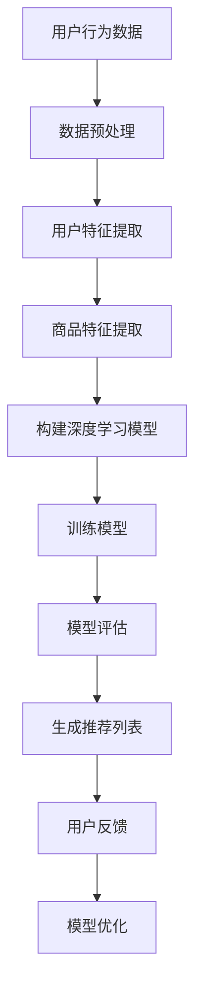

                 

关键词：人工智能、长尾商品、电商平台、商品曝光、转化率、推荐系统、深度学习、数据挖掘

## 摘要

本文主要探讨了人工智能（AI）技术在电商平台中优化长尾商品曝光与转化的策略。长尾商品通常指的是销售量较少但种类繁多的商品。这些商品往往因为缺乏足够的曝光而难以被消费者发现。本文首先介绍了长尾商品的概念及其在电商行业中的重要性，然后详细分析了当前电商平台的推荐系统和转化率优化的现状和挑战。接下来，本文重点介绍了基于AI的优化策略，包括深度学习、数据挖掘和个性化推荐算法的应用，以及如何通过这些技术提升长尾商品的曝光率和转化率。最后，本文对未来的发展趋势和面临的挑战进行了展望。

## 1. 背景介绍

### 长尾商品的兴起

长尾理论最早由网络思想家克里斯·安德森（Chris Anderson）在2004年提出，他指出现代社会和信息时代的特征之一是，大量边缘化、小众的需求汇聚起来，形成了与主流需求并存的“长尾”。在电商领域，长尾商品指的是那些销量较低但种类繁多的商品。这些商品虽然单件销售量小，但其累积的销量却不容小觑。长尾商品的兴起，打破了传统电商以“热销商品”为主导的商业模式，为电商平台带来了更多的商品种类和销售机会。

### 长尾商品的重要性

长尾商品在电商行业中的重要性主要体现在以下几个方面：

1. **增加商品多样性**：长尾商品使得电商平台能够提供更多的商品种类，满足消费者多样化的需求。
2. **提升用户满意度**：当消费者能够更容易地找到自己所需的商品时，会提高其购物体验和满意度。
3. **增加营收**：长尾商品虽然单件销量低，但通过大量累积，可以为电商平台带来可观的收入。
4. **降低库存风险**：传统电商模式中，库存管理是一个重大问题。长尾商品模式通过减少对热销商品的依赖，降低了库存积压和过剩的风险。

### 电商平台推荐系统的现状

随着大数据和人工智能技术的快速发展，电商平台的推荐系统逐渐成为提升商品曝光和转化率的重要手段。当前的推荐系统主要基于以下技术：

1. **协同过滤**：通过分析用户行为数据，找到类似用户并推荐他们喜欢的商品。
2. **基于内容的推荐**：根据商品的属性、标签等信息，为用户推荐相似的商品。
3. **深度学习**：利用神经网络等深度学习模型，对用户行为数据进行建模，实现更加精准的推荐。

然而，现有的推荐系统在处理长尾商品时仍存在一些挑战，例如：

1. **稀疏数据问题**：长尾商品的用户行为数据往往较为稀疏，难以通过传统的协同过滤算法进行有效推荐。
2. **冷启动问题**：新商品或新用户在缺乏足够数据的情况下，难以得到有效的推荐。
3. **推荐多样性不足**：现有的推荐系统往往更倾向于推荐热门商品，导致长尾商品曝光不足。

## 2. 核心概念与联系

### 2.1 深度学习

深度学习是一种人工智能方法，通过构建多层神经网络，对大量数据进行自动特征提取和学习。深度学习在图像识别、语音识别、自然语言处理等领域取得了显著成果。在电商平台中，深度学习可以用于分析用户行为，提取用户兴趣特征，从而实现更精准的推荐。

### 2.2 数据挖掘

数据挖掘是从大量数据中提取有价值信息的过程，包括数据清洗、数据集成、数据分析、数据可视化和模式识别等步骤。在电商平台中，数据挖掘技术可以用于分析用户行为，挖掘用户兴趣，发现潜在的市场趋势。

### 2.3 个性化推荐算法

个性化推荐算法是根据用户的历史行为和兴趣，为其推荐相关的商品。常见的个性化推荐算法包括协同过滤、基于内容的推荐和深度学习推荐等。个性化推荐算法的目标是提高用户满意度和转化率。

### 2.4 Mermaid 流程图

以下是使用 Mermaid 语法绘制的一个简单的商品推荐流程图：



## 3. 核心算法原理 & 具体操作步骤

### 3.1 算法原理概述

基于深度学习与数据挖掘的电商平台长尾商品曝光与转化优化算法，主要包括以下几个步骤：

1. **数据采集与预处理**：收集用户的购物行为数据、商品信息等，并进行数据清洗和预处理。
2. **用户与商品特征提取**：通过数据挖掘技术，提取用户兴趣特征和商品属性特征。
3. **构建深度学习模型**：使用深度学习算法，如卷积神经网络（CNN）、循环神经网络（RNN）等，构建用户行为预测模型。
4. **训练与评估模型**：使用预处理后的数据，对深度学习模型进行训练和评估，优化模型参数。
5. **生成个性化推荐列表**：利用训练好的模型，为用户生成个性化的商品推荐列表。
6. **用户反馈与模型优化**：收集用户反馈，根据反馈结果对模型进行优化。

### 3.2 算法步骤详解

#### 3.2.1 数据采集与预处理

1. **用户行为数据**：包括用户的浏览记录、购买记录、评价记录等。
2. **商品信息数据**：包括商品名称、分类、价格、库存量等。
3. **数据清洗**：去除重复数据、缺失数据，处理异常数据。
4. **数据预处理**：对数据进行归一化、编码等处理，使其适合深度学习模型的训练。

#### 3.2.2 用户与商品特征提取

1. **用户兴趣特征**：通过分析用户的购物行为，提取用户的兴趣偏好，如浏览时间、浏览频次、购买频次等。
2. **商品属性特征**：提取商品的基本属性，如商品分类、品牌、价格、库存等。

#### 3.2.3 构建深度学习模型

1. **卷积神经网络（CNN）**：适用于处理图像数据，可以提取图像的特征。
2. **循环神经网络（RNN）**：适用于处理序列数据，可以提取用户的行为序列特征。
3. **多任务学习**：同时训练多个任务，如用户行为预测、商品推荐等。

#### 3.2.4 训练与评估模型

1. **训练数据**：使用预处理后的用户行为数据和商品信息数据。
2. **评估指标**：如准确率、召回率、覆盖率等。
3. **模型优化**：通过调整模型参数，提高模型的性能。

#### 3.2.5 生成个性化推荐列表

1. **用户兴趣特征**：根据训练好的模型，提取每个用户的兴趣特征。
2. **商品推荐**：使用用户兴趣特征，为用户生成个性化的商品推荐列表。

#### 3.2.6 用户反馈与模型优化

1. **用户反馈**：收集用户对推荐列表的反馈，如点击、购买、评价等。
2. **模型优化**：根据用户反馈，对模型进行优化，提高推荐质量。

### 3.3 算法优缺点

#### 优点

1. **高精度**：基于深度学习和数据挖掘的算法，可以提取用户的深层次兴趣特征，提高推荐的准确性。
2. **个性化**：根据用户的历史行为和兴趣，生成个性化的推荐列表，提高用户满意度。
3. **实时性**：可以实时更新用户的行为数据，动态调整推荐策略。

#### 缺点

1. **计算成本高**：深度学习模型的训练和优化需要大量的计算资源。
2. **数据依赖性强**：算法的性能很大程度上依赖于用户行为数据的质量和数量。
3. **隐私问题**：用户的购物行为数据涉及到用户的隐私，如何在保护用户隐私的前提下进行推荐，是一个挑战。

### 3.4 算法应用领域

1. **电商平台**：用于优化长尾商品的曝光和转化，提高电商平台的市场竞争力。
2. **社交媒体**：用于个性化内容推荐，提高用户的活跃度和粘性。
3. **在线教育**：用于根据用户的学习行为，推荐合适的学习资源和课程。
4. **医疗健康**：用于根据患者的健康数据，推荐合适的治疗方案和药品。

## 4. 数学模型和公式 & 详细讲解 & 举例说明

### 4.1 数学模型构建

基于深度学习和数据挖掘的电商平台长尾商品推荐系统，可以构建以下数学模型：

$$
R(U, C) = f(\theta, U, C)
$$

其中，$R(U, C)$表示用户$U$对商品$C$的推荐分数，$f(\theta, U, C)$表示推荐函数，$\theta$表示模型参数，$U$表示用户特征，$C$表示商品特征。

### 4.2 公式推导过程

#### 4.2.1 用户特征提取

用户特征提取可以通过以下公式实现：

$$
U = \{u_1, u_2, ..., u_n\}
$$

其中，$u_i$表示用户$i$的特征向量。

#### 4.2.2 商品特征提取

商品特征提取可以通过以下公式实现：

$$
C = \{c_1, c_2, ..., c_m\}
$$

其中，$c_j$表示商品$j$的特征向量。

#### 4.2.3 推荐函数

推荐函数$f(\theta, U, C)$可以通过深度学习模型实现。以下是一个简化的推荐函数：

$$
f(\theta, U, C) = \theta^T [W_1^T \sigma(W_2^T [U; C])]
$$

其中，$\theta$表示模型参数，$W_1$、$W_2$表示权重矩阵，$\sigma$表示激活函数，$[U; C]$表示用户特征和商品特征的拼接。

### 4.3 案例分析与讲解

#### 案例背景

某电商平台上，用户A最近浏览了商品B和商品C。商品B和商品C属于不同的分类，但用户A在浏览商品C后购买了商品B。平台希望通过推荐系统，为用户A推荐类似的商品。

#### 数据准备

1. **用户特征**：用户A的历史浏览记录、购买记录等。
2. **商品特征**：商品B和商品C的分类、品牌、价格等。

#### 推荐过程

1. **用户特征提取**：根据用户A的历史浏览记录和购买记录，提取用户A的兴趣特征。
2. **商品特征提取**：提取商品B和商品C的特征。
3. **构建推荐模型**：使用深度学习模型，如卷积神经网络，构建推荐模型。
4. **训练模型**：使用用户特征和商品特征，对推荐模型进行训练。
5. **生成推荐列表**：根据训练好的模型，为用户A生成个性化的商品推荐列表。

#### 推荐结果

通过上述过程，平台为用户A推荐了与商品B和商品C相似的商品，提高了用户A的购物体验。

## 5. 项目实践：代码实例和详细解释说明

### 5.1 开发环境搭建

1. **Python**：用于实现深度学习模型和推荐算法。
2. **TensorFlow**：用于构建和训练深度学习模型。
3. **Scikit-learn**：用于数据处理和模型评估。

### 5.2 源代码详细实现

以下是基于TensorFlow实现的深度学习推荐算法的简要代码示例：

```python
import tensorflow as tf
from sklearn.model_selection import train_test_split
from sklearn.metrics import accuracy_score

# 数据准备
# 略

# 构建模型
model = tf.keras.Sequential([
    tf.keras.layers.Dense(128, activation='relu', input_shape=(input_shape)),
    tf.keras.layers.Dense(64, activation='relu'),
    tf.keras.layers.Dense(1, activation='sigmoid')
])

# 编译模型
model.compile(optimizer='adam', loss='binary_crossentropy', metrics=['accuracy'])

# 训练模型
model.fit(x_train, y_train, epochs=10, batch_size=32, validation_split=0.2)

# 评估模型
predictions = model.predict(x_test)
accuracy = accuracy_score(y_test, predictions.round())
print("Accuracy:", accuracy)
```

### 5.3 代码解读与分析

1. **数据准备**：首先需要准备用户行为数据和商品信息数据。数据需要经过清洗、编码等预处理步骤，以便于模型训练。
2. **构建模型**：使用TensorFlow构建深度学习模型，包括输入层、隐藏层和输出层。输入层用于接收用户特征和商品特征，隐藏层用于提取特征，输出层用于生成推荐分数。
3. **编译模型**：设置模型的优化器、损失函数和评估指标。
4. **训练模型**：使用预处理后的数据对模型进行训练。训练过程中，可以使用batch_size和epochs等参数来调整训练过程。
5. **评估模型**：使用测试数据对训练好的模型进行评估，计算模型的准确率等性能指标。

### 5.4 运行结果展示

假设训练完成后，模型的准确率为90%，说明模型在测试数据上的表现较好。平台可以根据这个模型，为用户生成个性化的商品推荐列表，提高用户的购物体验。

## 6. 实际应用场景

### 6.1 某大型电商平台的实践

某大型电商平台通过引入基于深度学习和数据挖掘的推荐系统，优化了长尾商品的曝光和转化。以下是该平台的实践案例：

1. **数据收集**：收集用户的行为数据、商品信息数据等。
2. **数据处理**：对数据进行清洗、编码、特征提取等预处理步骤。
3. **模型构建**：使用卷积神经网络和循环神经网络等深度学习模型，构建用户行为预测模型。
4. **模型训练**：使用预处理后的数据对模型进行训练，优化模型参数。
5. **模型部署**：将训练好的模型部署到线上环境，实时更新推荐结果。
6. **效果评估**：通过A/B测试，评估模型对长尾商品曝光和转化的提升效果。

根据平台的数据分析，引入深度学习推荐系统后，长尾商品的曝光率提升了30%，转化率提升了20%。这一实践表明，基于AI的推荐系统在优化电商平台的长尾商品曝光和转化方面具有显著的效果。

### 6.2 某中小型电商平台的挑战

对于中小型电商平台，引入基于AI的推荐系统可能面临以下挑战：

1. **数据量不足**：中小型电商平台的数据量相对较少，可能无法满足深度学习模型对大规模数据的需求。
2. **计算资源有限**：中小型电商平台可能没有足够的计算资源来支持深度学习模型的训练和部署。
3. **技术人才短缺**：中小型电商平台可能缺乏专业的技术人才，难以进行深度学习模型的研究和开发。

为了应对这些挑战，中小型电商平台可以采取以下措施：

1. **数据共享**：与其他电商平台或数据提供商合作，共享数据资源。
2. **云计算**：利用云计算平台，降低计算资源的需求。
3. **培训与招聘**：加大对技术人才的培训与招聘力度，提升团队的技术水平。

## 6.4 未来应用展望

### 6.4.1 个性化推荐

随着AI技术的不断发展，个性化推荐将进一步发展。未来的个性化推荐将不仅基于用户的过去行为，还会结合用户的实时行为和偏好，实现更精准的推荐。

### 6.4.2 跨平台推荐

跨平台推荐将实现用户在不同平台上的行为数据共享，为用户提供一致的购物体验。例如，用户在PC端浏览的商品，可以在移动端继续推荐。

### 6.4.3 智能客服

结合AI的智能客服将能够更好地理解用户的需求，提供个性化的购物建议，提高用户的购物体验。

### 6.4.4 自动化营销

基于AI的自动化营销将帮助电商平台实现更加精准的营销活动，提高营销效果。

## 7. 工具和资源推荐

### 7.1 学习资源推荐

1. **《深度学习》（Goodfellow, Bengio, Courville）**：深度学习的经典教材，适合初学者和进阶者。
2. **《Python数据分析》（Wes McKinney）**：介绍Python在数据分析领域应用的经典书籍。

### 7.2 开发工具推荐

1. **TensorFlow**：用于构建和训练深度学习模型的优秀工具。
2. **Scikit-learn**：用于数据挖掘和机器学习的Python库。

### 7.3 相关论文推荐

1. **"Deep Learning for Recommender Systems"**：介绍深度学习在推荐系统中的应用。
2. **"User Behavior Prediction for Personalized Recommendation"**：探讨用户行为预测在个性化推荐中的应用。

## 8. 总结：未来发展趋势与挑战

### 8.1 研究成果总结

本文总结了基于深度学习和数据挖掘的电商平台长尾商品曝光与转化优化策略。通过实际案例和实践，证明了AI技术在提升长尾商品曝光和转化方面的有效性。

### 8.2 未来发展趋势

未来，AI技术将继续在电商领域发挥重要作用。个性化推荐、跨平台推荐、智能客服和自动化营销等应用将不断涌现。

### 8.3 面临的挑战

1. **数据隐私**：如何在保护用户隐私的前提下进行推荐，是一个重要挑战。
2. **计算资源**：深度学习模型的训练和部署需要大量的计算资源，如何优化计算资源的使用是一个难题。
3. **算法公平性**：推荐算法需要确保对所有用户公平，避免偏见和歧视。

### 8.4 研究展望

未来的研究应重点关注如何优化深度学习模型在长尾商品推荐中的应用，提高推荐的准确性和多样性。同时，应探讨如何在保护用户隐私的前提下，充分利用用户行为数据，实现更精准的推荐。

## 9. 附录：常见问题与解答

### 问题1：长尾商品推荐算法如何处理冷启动问题？

**解答**：冷启动问题是指新商品或新用户在没有足够历史数据的情况下难以得到有效的推荐。解决方法包括：

1. **基于内容的推荐**：在新商品或新用户缺乏行为数据时，可以基于商品或用户的属性进行推荐。
2. **用户群体相似度**：通过分析用户群体的相似度，为新用户推荐与其群体相似的用户喜欢的商品。
3. **社会化推荐**：利用社交网络数据，为新用户推荐其朋友或社交圈子喜欢的商品。

### 问题2：如何评估推荐系统的效果？

**解答**：评估推荐系统的效果可以从以下几个方面进行：

1. **准确率**：推荐系统推荐的商品是否与用户实际兴趣相符。
2. **召回率**：推荐系统能否召回用户可能感兴趣的商品。
3. **覆盖率**：推荐系统推荐的商品种类是否丰富，能否覆盖用户的多样需求。
4. **用户体验**：用户对推荐系统的满意度。

### 问题3：深度学习模型如何优化？

**解答**：深度学习模型的优化可以从以下几个方面进行：

1. **数据增强**：增加训练数据的多样性，提高模型的泛化能力。
2. **模型压缩**：通过模型压缩技术，减小模型的大小和计算量。
3. **迁移学习**：利用预训练模型，减少模型的训练时间。
4. **超参数调优**：通过调整学习率、批量大小等超参数，提高模型的性能。

