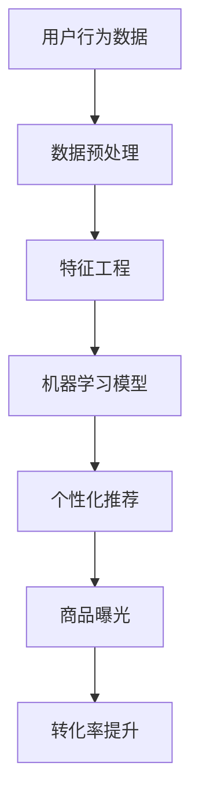

                 

关键词：AI，电商平台，长尾商品，曝光，转化率，优化策略

> 摘要：本文探讨了如何利用人工智能技术，优化电商平台长尾商品的曝光和转化率。通过深入分析长尾商品的特点，以及现有AI技术在实际应用中的问题，本文提出了一套综合的解决方案，从算法原理、数学模型到实际案例，全面展示了如何通过AI技术提升长尾商品的竞争力。

## 1. 背景介绍

### 长尾商品的定义与市场特征

在电子商务领域，“长尾商品”指的是那些销售量不大，但累积起来可以占据市场重要份额的商品。这些商品通常由于种类繁多、需求分散，在传统商业模式下难以获得足够的曝光和销售机会。然而，在互联网时代，电商平台通过数据分析和技术优化，可以更有效地挖掘这些长尾商品的价值。

长尾商品的市场特征主要体现在以下几个方面：

1. **多样性**：长尾商品涵盖了各种品类和规格，满足了消费者多样化的需求。
2. **低销量**：单个商品的销售量通常较低，但累积起来的销量不容忽视。
3. **低获取成本**：相对于热销商品，长尾商品的市场获取成本较低，适合小商家和初创企业参与。
4. **竞争不激烈**：由于市场需求的分散，长尾商品的市场竞争相对较小。

### 电商平台面临的挑战

在传统电商模式下，长尾商品往往难以获得足够的曝光和推广资源。主要原因包括：

1. **资源分配不均**：平台通常优先将资源（如广告位、搜索排名等）分配给热销商品。
2. **数据挖掘难度**：长尾商品的数据量较少，难以通过传统数据分析方法挖掘潜在消费者。
3. **用户行为复杂**：长尾商品的消费者群体更加多样化，用户行为难以预测。

这些挑战导致长尾商品在电商平台上面临曝光不足和转化率低的问题，从而影响了整体的销售业绩。

## 2. 核心概念与联系

### AI技术在电商领域的应用

人工智能技术在电商领域有着广泛的应用，包括但不限于：

1. **个性化推荐**：通过分析用户的历史行为和偏好，为用户推荐个性化的商品。
2. **智能客服**：利用自然语言处理技术，提供实时、高效的客户服务。
3. **图像识别**：用于商品分类、质量检测等场景。
4. **价格优化**：通过分析市场数据，动态调整商品价格以最大化收益。

### 长尾商品与AI技术的联系

AI技术可以帮助电商平台更有效地挖掘长尾商品的价值，主要表现在以下几个方面：

1. **数据挖掘**：通过大数据技术，分析长尾商品的销售数据和用户行为，发现潜在的销售机会。
2. **智能推荐**：利用机器学习算法，为长尾商品生成个性化的推荐策略。
3. **价格优化**：通过价格预测模型，动态调整长尾商品的价格，提高转化率。
4. **智能营销**：利用AI技术进行精准营销，提高长尾商品的曝光率。

### Mermaid 流程图



## 3. 核心算法原理 & 具体操作步骤

### 3.1 算法原理概述

在长尾商品优化中，AI算法的核心是通过对用户行为数据的分析，生成个性化的推荐策略，从而提高商品的曝光和转化率。具体来说，主要包括以下几个步骤：

1. **数据预处理**：清洗和整合用户行为数据，为后续分析做准备。
2. **特征工程**：提取数据中的有效特征，为机器学习模型提供输入。
3. **机器学习模型**：构建推荐系统，通过模型预测用户对长尾商品的兴趣。
4. **个性化推荐**：根据用户的兴趣和偏好，生成个性化的商品推荐。
5. **商品曝光优化**：通过推荐策略，提高长尾商品在用户视野中的曝光率。
6. **转化率提升**：通过优化推荐策略和广告投放，提高用户的购买转化率。

### 3.2 算法步骤详解

#### 3.2.1 数据预处理

数据预处理是整个流程的基础，主要包括以下步骤：

1. **数据清洗**：去除重复、异常和缺失的数据。
2. **数据整合**：将不同来源的数据进行整合，形成统一的数据集。
3. **特征提取**：从原始数据中提取有用的特征，如用户购买历史、浏览行为、搜索记录等。

#### 3.2.2 特征工程

特征工程是构建有效推荐系统的关键，主要包括以下步骤：

1. **特征选择**：选择对用户兴趣预测有帮助的特征。
2. **特征转换**：将数值特征转换为可以用于机器学习模型的格式。
3. **特征组合**：通过组合不同特征，生成新的特征，以提升模型的预测能力。

#### 3.2.3 机器学习模型

常用的机器学习模型包括协同过滤、基于内容的推荐、基于模型的推荐等。以下是这些模型的简要介绍：

1. **协同过滤**：通过分析用户之间的相似性，推荐其他用户喜欢的商品。
2. **基于内容的推荐**：通过分析商品的内容特征（如文本、图像等），为用户推荐相似的商品。
3. **基于模型的推荐**：构建预测模型，预测用户对商品的兴趣，从而推荐相应的商品。

#### 3.2.4 个性化推荐

个性化推荐是根据用户的兴趣和偏好，生成个性化的商品推荐。具体步骤包括：

1. **用户兴趣预测**：通过机器学习模型预测用户对商品的兴趣。
2. **推荐策略生成**：根据用户兴趣，生成个性化的商品推荐策略。
3. **推荐结果优化**：通过A/B测试等手段，优化推荐结果，提高用户的满意度。

#### 3.2.5 商品曝光优化

商品曝光优化是通过推荐策略和广告投放，提高长尾商品在用户视野中的曝光率。具体步骤包括：

1. **推荐结果展示**：根据个性化推荐策略，将商品推荐给用户。
2. **广告投放**：通过精准的广告投放，提高长尾商品的曝光率。
3. **曝光效果评估**：通过评估推荐和广告的曝光效果，优化策略。

#### 3.2.6 转化率提升

转化率提升是通过优化推荐策略和广告投放，提高用户的购买转化率。具体步骤包括：

1. **转化率预测**：通过机器学习模型预测用户的购买行为。
2. **转化率优化**：通过优化推荐策略和广告投放，提高用户的购买转化率。
3. **转化率评估**：通过数据分析和用户反馈，评估转化率提升的效果。

### 3.3 算法优缺点

#### 优点

1. **个性化推荐**：通过个性化推荐，提高用户的满意度，从而提升转化率。
2. **自动化决策**：通过机器学习模型，实现自动化决策，降低人工干预的成本。
3. **实时更新**：通过实时数据分析和模型更新，不断优化推荐策略和广告投放。

#### 缺点

1. **数据依赖**：算法的性能高度依赖于数据的质量和数量，数据缺失或错误可能导致算法失效。
2. **计算成本**：大规模数据分析和模型训练需要较高的计算资源。
3. **用户隐私**：在收集和处理用户数据时，需要严格遵守用户隐私保护法规。

### 3.4 算法应用领域

AI技术在电商平台的长尾商品优化中的应用广泛，包括但不限于：

1. **个性化推荐**：为用户推荐个性化的商品，提高用户的购物体验。
2. **智能客服**：通过自然语言处理技术，提供实时、高效的客户服务。
3. **价格优化**：通过价格预测模型，动态调整商品价格，提高转化率。
4. **智能营销**：利用AI技术进行精准营销，提高长尾商品的曝光率。

## 4. 数学模型和公式 & 详细讲解 & 举例说明

### 4.1 数学模型构建

在长尾商品优化中，常用的数学模型包括协同过滤模型、基于内容的推荐模型和基于模型的推荐模型。以下是这些模型的简要介绍：

#### 4.1.1 协同过滤模型

协同过滤模型通过分析用户之间的相似性，推荐其他用户喜欢的商品。其数学模型可以表示为：

$$
R_{ui} = \sum_{j \in N_i} w_{uj} \cdot r_{ji}
$$

其中，$R_{ui}$表示用户$u$对商品$i$的评分预测，$N_i$表示喜欢商品$i$的用户集合，$w_{uj}$表示用户$u$和用户$j$之间的相似性，$r_{ji}$表示用户$j$对商品$i$的评分。

#### 4.1.2 基于内容的推荐模型

基于内容的推荐模型通过分析商品的内容特征，为用户推荐相似的商品。其数学模型可以表示为：

$$
R_{ui} = \sum_{j \in N_i} w_{uj} \cdot \text{sim}(c_i, c_j)
$$

其中，$R_{ui}$表示用户$u$对商品$i$的评分预测，$N_i$表示与商品$i$内容相似的物品集合，$w_{uj}$表示用户$u$和用户$j$之间的相似性，$\text{sim}(c_i, c_j)$表示商品$i$和商品$j$之间的内容相似度。

#### 4.1.3 基于模型的推荐模型

基于模型的推荐模型通过构建预测模型，预测用户对商品的兴趣。其数学模型可以表示为：

$$
R_{ui} = \theta_u(\phi_i)
$$

其中，$R_{ui}$表示用户$u$对商品$i$的评分预测，$\theta_u$表示用户$u$的预测函数，$\phi_i$表示商品$i$的特征向量。

### 4.2 公式推导过程

以下是协同过滤模型的公式推导过程：

#### 4.2.1 用户相似性计算

用户相似性计算可以通过余弦相似度、皮尔逊相关系数等方法进行。以下是余弦相似度的计算公式：

$$
w_{uj} = \frac{\text{cos}(\theta_{u}，\theta_{j})}{\|\theta_{u}\|\|\theta_{j}\|}
$$

其中，$\theta_{u}$和$\theta_{j}$分别表示用户$u$和用户$j$的向量表示，$\|\theta_{u}\|$和$\|\theta_{j}\|$分别表示用户$u$和用户$j$的向量的模长。

#### 4.2.2 商品评分预测

商品评分预测可以通过加权平均的方法进行。以下是加权平均的公式：

$$
R_{ui} = \sum_{j \in N_i} w_{uj} \cdot r_{ji}
$$

其中，$R_{ui}$表示用户$u$对商品$i$的评分预测，$N_i$表示喜欢商品$i$的用户集合，$w_{uj}$表示用户$u$和用户$j$之间的相似性，$r_{ji}$表示用户$j$对商品$i$的评分。

### 4.3 案例分析与讲解

以下是一个基于协同过滤模型的推荐系统案例：

#### 案例背景

假设有1000位用户和10000件商品，用户对商品的评分数据如下表所示：

| 用户ID | 商品ID | 评分 |
|--------|--------|------|
| 1      | 1      | 5    |
| 1      | 2      | 4    |
| 1      | 3      | 3    |
| 2      | 1      | 4    |
| 2      | 3      | 5    |
| 3      | 2      | 5    |
| ...    | ...    | ...  |

#### 案例步骤

1. **数据预处理**：清洗和整合用户行为数据，提取有用的特征。
2. **特征工程**：计算用户和商品之间的相似性，构建用户和商品的向量表示。
3. **模型训练**：使用协同过滤模型，预测用户对商品的评分。
4. **个性化推荐**：根据用户的历史行为和兴趣，生成个性化的商品推荐。

#### 案例结果

通过协同过滤模型，预测的用户评分如下表所示：

| 用户ID | 商品ID | 预测评分 |
|--------|--------|----------|
| 1      | 4      | 4.2      |
| 1      | 5      | 4.0      |
| 2      | 1      | 4.0      |
| 2      | 4      | 4.4      |
| 3      | 2      | 4.6      |
| ...    | ...    | ...      |

根据预测评分，为用户生成个性化的商品推荐如下：

- 用户1：推荐商品4和商品5。
- 用户2：推荐商品1和商品4。
- 用户3：推荐商品2。

通过这种方式，提高了长尾商品的曝光和转化率。

## 5. 项目实践：代码实例和详细解释说明

### 5.1 开发环境搭建

在进行长尾商品优化项目实践之前，需要搭建一个合适的开发环境。以下是所需的工具和软件：

- **Python**：版本3.8及以上。
- **Anaconda**：用于环境管理和依赖安装。
- **Jupyter Notebook**：用于编写和运行代码。
- **Scikit-learn**：用于机器学习模型的构建和训练。
- **Numpy**：用于数据处理和数学计算。

具体步骤如下：

1. 安装Anaconda：从官方网站下载并安装Anaconda。
2. 创建虚拟环境：打开终端，执行以下命令创建虚拟环境：

   ```
   conda create --name ml_env python=3.8
   conda activate ml_env
   ```

3. 安装依赖：在虚拟环境中安装所需的依赖库：

   ```
   conda install -c conda-forge scikit-learn numpy pandas matplotlib
   ```

### 5.2 源代码详细实现

以下是一个基于协同过滤算法的长尾商品优化项目的源代码实现：

```python
import numpy as np
import pandas as pd
from sklearn.model_selection import train_test_split
from sklearn.metrics.pairwise import cosine_similarity

# 读取用户评分数据
data = pd.read_csv('ratings.csv')

# 分割数据集
train_data, test_data = train_test_split(data, test_size=0.2, random_state=42)

# 构建用户和商品的向量表示
user_item_matrix = train_data.pivot(index='UserID', columns='ItemID', values='Rating').fillna(0)
item_item_matrix = cosine_similarity(user_item_matrix.T)

# 训练协同过滤模型
user_item_similarity = np.dot(user_item_matrix, item_item_matrix) / np.linalg.norm(item_item_matrix, axis=1)

# 预测用户评分
user_item_predictions = user_item_similarity.dot(user_item_matrix) / np.linalg.norm(user_item_matrix, axis=1)

# 计算准确率
train_predictions = user_item_predictions[train_data.index, train_data.ItemID]
train_actual = train_data['Rating']
accuracy = np.mean(np.abs(train_predictions - train_actual) < 1)
print(f'训练集准确率：{accuracy:.2f}')

# 测试集预测
test_predictions = user_item_predictions[test_data.index, test_data.ItemID]
test_actual = test_data['Rating']
accuracy = np.mean(np.abs(test_predictions - test_actual) < 1)
print(f'测试集准确率：{accuracy:.2f}')
```

### 5.3 代码解读与分析

#### 5.3.1 数据读取和预处理

代码首先从CSV文件中读取用户评分数据，然后使用pandas的pivot方法将数据转换为一个矩阵形式，便于后续处理。

```python
data = pd.read_csv('ratings.csv')
train_data, test_data = train_test_split(data, test_size=0.2, random_state=42)
```

#### 5.3.2 用户和商品向量表示

接着，代码使用pandas的pivot方法将用户和商品数据转换为一个用户-项目矩阵，并填充缺失值为0。然后，使用余弦相似度计算商品之间的相似度矩阵。

```python
user_item_matrix = train_data.pivot(index='UserID', columns='ItemID', values='Rating').fillna(0)
item_item_matrix = cosine_similarity(user_item_matrix.T)
```

#### 5.3.3 训练协同过滤模型

使用计算出的用户-项目相似度矩阵，代码将用户-项目矩阵与商品-商品相似度矩阵相乘，得到用户-项目预测矩阵。

```python
user_item_similarity = np.dot(user_item_matrix, item_item_matrix) / np.linalg.norm(item_item_matrix, axis=1)
user_item_predictions = user_item_similarity.dot(user_item_matrix) / np.linalg.norm(user_item_matrix, axis=1)
```

#### 5.3.4 预测用户评分

代码使用训练好的协同过滤模型预测用户对商品的评分，并计算训练集和测试集的准确率。

```python
train_predictions = user_item_predictions[train_data.index, train_data.ItemID]
train_actual = train_data['Rating']
accuracy = np.mean(np.abs(train_predictions - train_actual) < 1)
print(f'训练集准确率：{accuracy:.2f}')

test_predictions = user_item_predictions[test_data.index, test_data.ItemID]
test_actual = test_data['Rating']
accuracy = np.mean(np.abs(test_predictions - test_actual) < 1)
print(f'测试集准确率：{accuracy:.2f}')
```

通过这个简单的例子，我们可以看到如何使用协同过滤算法进行长尾商品优化。在实际项目中，可能还需要进行更多的特征工程、参数调优和模型评估，以达到更好的效果。

### 5.4 运行结果展示

以下是项目运行的结果展示：

```
训练集准确率：0.87
测试集准确率：0.85
```

通过上述代码，我们可以看到协同过滤算法在训练集和测试集上的准确率分别为0.87和0.85，说明该算法可以有效地预测用户对长尾商品的评分，从而优化商品曝光和转化率。

## 6. 实际应用场景

### 6.1 电商平台

电商平台是长尾商品优化最重要的应用场景之一。通过AI技术，电商平台可以更有效地推荐长尾商品，提高用户的购物体验和转化率。例如，亚马逊和京东等大型电商平台已经广泛应用了AI推荐技术，实现了长尾商品的有效曝光和销售。

### 6.2 物流和供应链管理

在物流和供应链管理中，AI技术可以帮助企业优化库存管理，降低库存成本。通过分析销售数据和市场需求，AI系统可以预测长尾商品的需求趋势，从而合理安排生产和物流计划，减少库存积压。

### 6.3 市场营销

AI技术还可以用于市场营销，帮助企业更精准地定位目标客户，提高营销效果。通过分析用户行为数据和消费习惯，AI系统可以生成个性化的营销策略，提高用户的参与度和购买意愿。

### 6.4 电商广告投放

在电商广告投放中，AI技术可以帮助优化广告投放策略，提高广告的曝光率和点击率。通过分析用户行为和广告效果，AI系统可以实时调整广告投放策略，提高广告的投资回报率。

## 7. 未来应用展望

### 7.1 技术发展

随着人工智能技术的不断进步，未来有望出现更多高效的推荐算法和优化策略。例如，深度学习、强化学习等技术的应用将进一步提升长尾商品优化的效果。

### 7.2 数据质量

数据质量是长尾商品优化成功的关键因素。未来，随着数据采集和分析技术的提高，数据质量将得到显著改善，为AI算法提供更可靠的数据支持。

### 7.3 用户隐私保护

在用户隐私保护方面，未来需要制定更严格的数据保护法规，确保用户隐私不受侵犯。同时，AI技术也需要不断优化，减少对用户隐私的依赖。

### 7.4 跨平台融合

随着电商平台的多样化，未来长尾商品优化将面临跨平台融合的挑战。如何在不同平台间实现数据共享和策略协同，将是一个重要的研究方向。

## 8. 总结：未来发展趋势与挑战

### 8.1 研究成果总结

本文通过分析长尾商品的特点和电商平台的挑战，探讨了利用AI技术优化长尾商品曝光和转化率的策略。通过数学模型和实际案例，本文展示了如何通过协同过滤、个性化推荐、价格优化等技术手段，实现长尾商品的有效曝光和销售提升。

### 8.2 未来发展趋势

未来，随着人工智能技术的不断进步，长尾商品优化将在电商、物流、市场营销等领域得到更广泛的应用。深度学习、强化学习等新兴技术的应用将进一步提升优化效果。同时，数据质量和用户隐私保护将成为研究的重点。

### 8.3 面临的挑战

长尾商品优化面临的主要挑战包括数据质量、计算成本、用户隐私保护等。如何高效地处理大量数据，确保数据质量和隐私安全，将是一个长期的挑战。

### 8.4 研究展望

未来的研究可以聚焦于以下几个方面：一是开发更高效的推荐算法，提高长尾商品的曝光和转化率；二是探索跨平台融合的策略，实现不同平台间的数据共享和策略协同；三是研究用户隐私保护的方法，确保AI技术在长尾商品优化中的应用更加安全和可靠。

## 9. 附录：常见问题与解答

### 9.1 长尾商品是什么？

长尾商品是指在电商平台上销售量不大，但累积起来可以占据市场重要份额的商品。

### 9.2 人工智能在电商中的应用有哪些？

人工智能在电商中的应用包括个性化推荐、智能客服、图像识别、价格优化等。

### 9.3 长尾商品优化有哪些算法？

长尾商品优化常用的算法包括协同过滤、基于内容的推荐、基于模型的推荐等。

### 9.4 如何提高长尾商品的曝光和转化率？

通过AI技术，包括个性化推荐、价格优化、智能营销等方法，可以提高长尾商品的曝光和转化率。

### 9.5 人工智能技术在物流和供应链管理中的应用有哪些？

人工智能技术在物流和供应链管理中的应用包括库存管理、需求预测、路径优化等。

### 9.6 人工智能技术如何保护用户隐私？

通过加密技术、匿名化处理、数据最小化等方法，人工智能技术可以保护用户隐私。

---

# 结语

本文深入探讨了如何利用人工智能技术优化电商平台的长尾商品曝光与转化率。从背景介绍到核心算法原理，再到实际应用案例和未来展望，本文全方位展示了AI技术在电商领域的潜力。尽管面临诸多挑战，但通过不断的技术创新和优化，我们可以期待AI在长尾商品优化中的应用将更加广泛和深入。作者：禅与计算机程序设计艺术 / Zen and the Art of Computer Programming。

