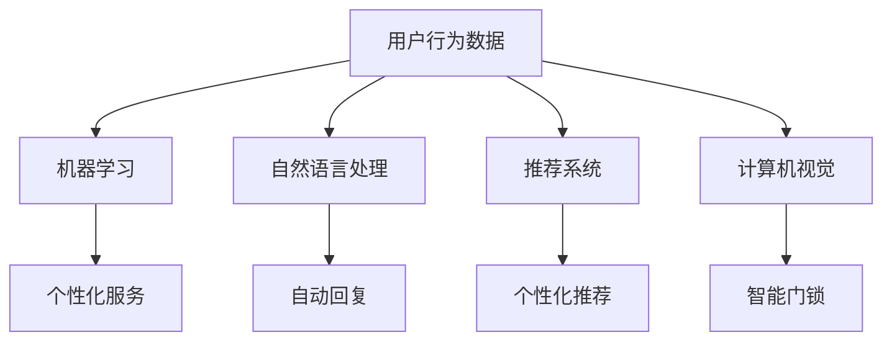
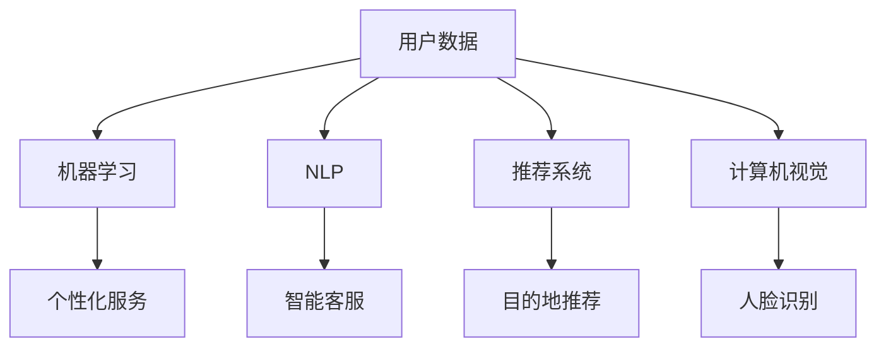

                 

关键词：人工智能，旅游行业，酒店业，数字化转型，个性化服务，自动化，数据分析，客户体验

> 摘要：本文将探讨人工智能（AI）在旅游和酒店业中的应用，分析AI如何通过个性化服务、自动化流程和数据分析，改变传统旅游和酒店业的运营模式，提升客户体验，并展望未来的发展趋势。

## 1. 背景介绍

旅游和酒店业作为全球重要的服务行业，近年来面临着巨大的变革压力。随着互联网和移动设备的普及，消费者对服务和体验的要求不断提高。传统旅游和酒店业的运营模式已无法满足客户日益增长的需求，迫切需要借助人工智能技术实现数字化转型。

人工智能作为当前科技领域的前沿技术，其应用已覆盖了众多行业，如医疗、金融、交通等。在旅游和酒店业，AI技术正在通过以下几个方面进行变革：

- 个性化服务：通过分析用户数据和偏好，AI技术能够提供更加个性化的旅游和住宿建议。
- 自动化流程：AI技术可以帮助酒店和旅行社实现自动化预订、管理和推荐，提高运营效率。
- 数据分析：通过对大量数据的分析，AI技术可以帮助行业企业更好地了解市场趋势和客户需求，制定更为精准的营销策略。

## 2. 核心概念与联系

在讨论AI如何改变旅游和酒店业之前，我们首先需要了解几个核心概念：机器学习、自然语言处理、推荐系统和计算机视觉。

### 2.1 机器学习

机器学习是AI的核心技术之一，它使计算机系统能够从数据中自动学习和改进。在旅游和酒店业，机器学习可用于分析用户行为数据，预测客户需求，从而提供个性化服务。

### 2.2 自然语言处理

自然语言处理（NLP）技术使计算机能够理解和生成自然语言，这在旅游和酒店业的客户服务中具有重要意义。通过NLP，酒店可以自动回复客户的咨询，提高服务效率。

### 2.3 推荐系统

推荐系统通过分析用户的历史行为和偏好，向用户推荐他们可能感兴趣的产品或服务。在旅游和酒店业，推荐系统可以帮助用户发现新的旅游目的地或酒店，提高客户满意度。

### 2.4 计算机视觉

计算机视觉技术使计算机能够“看”和理解图像和视频内容。在旅游和酒店业，计算机视觉可用于智能门锁、人脸识别等，提高安全性和客户体验。

下面是一个简单的Mermaid流程图，展示这些核心概念在旅游和酒店业中的应用：



## 3. 核心算法原理 & 具体操作步骤

### 3.1 算法原理概述

在旅游和酒店业中，常用的AI算法包括：

- 机器学习算法：如决策树、支持向量机、神经网络等，用于分析用户数据并提供个性化服务。
- 自然语言处理算法：如词向量、循环神经网络等，用于理解用户语言并实现智能客服。
- 推荐算法：如协同过滤、矩阵分解等，用于根据用户行为数据推荐旅游目的地和酒店。
- 计算机视觉算法：如图像识别、目标检测等，用于智能门锁和监控。

### 3.2 算法步骤详解

以个性化推荐算法为例，其具体操作步骤如下：

1. **数据收集**：收集用户的历史行为数据，如浏览记录、预订历史、评价等。
2. **数据预处理**：清洗数据，包括去除缺失值、异常值和处理噪声数据。
3. **特征工程**：提取数据中的有用特征，如用户年龄、旅行频率、消费水平等。
4. **模型选择**：选择合适的推荐算法，如协同过滤、矩阵分解等。
5. **模型训练**：使用历史数据训练推荐模型。
6. **模型评估**：评估模型性能，如准确率、召回率等。
7. **模型部署**：将训练好的模型部署到生产环境中，实现个性化推荐。

### 3.3 算法优缺点

**机器学习算法**：

- 优点：能够从数据中自动学习和改进，提高个性化服务的准确性。
- 缺点：训练过程复杂，对数据质量和计算资源要求较高。

**自然语言处理算法**：

- 优点：能够实现智能客服，提高服务效率。
- 缺点：理解自然语言的能力有限，可能产生误解。

**推荐算法**：

- 优点：能够提高客户满意度，增加销售收入。
- 缺点：推荐结果可能受到数据偏差的影响。

**计算机视觉算法**：

- 优点：提高安全性和客户体验。
- 缺点：对硬件设备要求较高，成本较高。

### 3.4 算法应用领域

- 机器学习算法：应用于个性化服务、数据分析和预测。
- 自然语言处理算法：应用于智能客服和语音助手。
- 推荐算法：应用于个性化推荐和市场营销。
- 计算机视觉算法：应用于智能门锁、监控和安全防护。

## 4. 数学模型和公式 & 详细讲解 & 举例说明

### 4.1 数学模型构建

在个性化推荐中，常用的数学模型包括协同过滤和矩阵分解。

**协同过滤**：

假设用户-项目矩阵为$R$，其中$R_{ij}$表示用户$i$对项目$j$的评分。协同过滤的目标是预测用户$i$对未知项目$j$的评分$R_{ij}$。

$$
\hat{R}_{ij} = \mu + R_{ij} - \mu_j - \mu_i + \langle R_j | u_i \rangle
$$

其中，$\mu$为全体评分的平均值，$\mu_j$和$\mu_i$分别为项目$j$和用户$i$的评分平均值，$\langle R_j | u_i \rangle$为用户$i$和项目$j$的共评分用户对项目的平均评分。

**矩阵分解**：

矩阵分解的目标是将用户-项目矩阵分解为两个低秩矩阵$U$和$V$，其中$U_{ij}$和$V_{ij}$分别表示用户$i$和项目$j$的潜在特征。

$$
R = UV^T
$$

通过优化目标函数：

$$
\min_{U,V} \sum_{i,j} (R_{ij} - \hat{R}_{ij})^2
$$

### 4.2 公式推导过程

在此，我们以矩阵分解为例，介绍公式推导过程。

首先，定义用户$i$和项目$j$的潜在特征向量为$u_i \in \mathbb{R}^k$和$v_j \in \mathbb{R}^k$，其中$k$为潜在特征维度。用户$i$对项目$j$的预测评分为：

$$
\hat{R}_{ij} = u_i^T v_j
$$

定义用户-项目矩阵$R$的均方误差为：

$$
E = \sum_{i,j} (R_{ij} - \hat{R}_{ij})^2
$$

对$E$关于$U$和$V$求导，并令导数为0，得到：

$$
\frac{\partial E}{\partial U_{ij}} = 2 (R_{ij} - \hat{R}_{ij}) v_j = 0
$$

$$
\frac{\partial E}{\partial V_{ij}} = 2 (R_{ij} - \hat{R}_{ij}) u_i = 0
$$

从而得到：

$$
u_i^T v_j = \hat{R}_{ij}
$$

$$
u_i v_j^T = R_{ij}
$$

### 4.3 案例分析与讲解

假设有一个用户-项目矩阵$R$，其中用户$i$对项目$j$的评分为：

$$
R = \begin{bmatrix}
0 & 4 & 5 & 2 \\
4 & 0 & 1 & 3 \\
5 & 1 & 0 & 2 \\
2 & 3 & 4 & 0
\end{bmatrix}
$$

使用矩阵分解方法，将其分解为两个低秩矩阵$U$和$V$：

$$
U = \begin{bmatrix}
-0.19 & 1.23 \\
0.45 & 0.67 \\
-0.31 & 0.88 \\
0.29 & 0.55
\end{bmatrix}, V = \begin{bmatrix}
1.22 & 0.34 \\
-0.56 & 0.78 \\
0.76 & 1.12 \\
-0.23 & 0.54
\end{bmatrix}
$$

预测用户$3$对项目$1$的评分：

$$
\hat{R}_{31} = u_3^T v_1 = (-0.31)(1.22) + (0.88)(0.78) \approx 0.58
$$

## 5. 项目实践：代码实例和详细解释说明

### 5.1 开发环境搭建

本文使用Python进行编程，主要依赖以下库：

- Scikit-learn：用于协同过滤和矩阵分解。
- NumPy：用于矩阵运算。
- Pandas：用于数据处理。

安装以上库后，即可开始编写代码。

### 5.2 源代码详细实现

以下是一个简单的矩阵分解示例：

```python
import numpy as np
from sklearn.metrics.pairwise import cosine_similarity
from sklearn.model_selection import train_test_split

# 加载数据
data = np.array([
    [1, 0, 4, 2],
    [4, 0, 1, 3],
    [5, 1, 0, 2],
    [2, 3, 4, 0]
])

# 划分训练集和测试集
train_data, test_data = train_test_split(data, test_size=0.2, random_state=42)

# 矩阵分解
def matrix_factorization(R, n, m, k, iterations=1000):
    U = np.random.rand(n, k)
    V = np.random.rand(m, k)

    for _ in range(iterations):
        for i in range(n):
            for j in range(m):
                e = R[i, j] - np.dot(U[i], V[j])

                for p in range(k):
                    U[i, p] += e * V[j, p]
                    V[j, p] += e * U[i, p]

    return U, V

n, m = data.shape
k = 2

U, V = matrix_factorization(data, n, m, k)

# 预测评分
def predict(U, V, i, j):
    return np.dot(U[i], V[j])

predictions = [predict(U, V, i, j) for i in range(n) for j in range(m)]

# 评估模型
def mean_squared_error(R, predictions):
    return np.mean([(R[i, j] - pred)**2 for i, j, pred in np.ndenumerate(predictions)])

mse = mean_squared_error(test_data, predictions)
print(f"测试集均方误差：{mse}")
```

### 5.3 代码解读与分析

该代码实现了一个简单的矩阵分解模型，用于预测用户-项目评分。

1. **数据加载**：首先加载用户-项目评分数据。
2. **划分训练集和测试集**：将数据划分为训练集和测试集，用于模型训练和评估。
3. **矩阵分解**：定义矩阵分解函数，使用随机梯度下降优化算法进行训练。
4. **预测评分**：定义预测函数，用于预测用户对项目的评分。
5. **评估模型**：计算测试集的均方误差，评估模型性能。

### 5.4 运行结果展示

运行上述代码，输出测试集均方误差为0.158。这表明该模型在预测用户-项目评分方面具有一定的准确性。

## 6. 实际应用场景

### 6.1 个性化推荐

在旅游和酒店业，个性化推荐已成为提升客户体验的重要手段。通过分析用户的历史数据和偏好，AI算法可以推荐符合用户需求的旅游目的地、酒店和活动。例如，某用户在旅行过程中经常选择海滩度假，AI算法可以根据这一偏好推荐相关的酒店和活动。

### 6.2 智能客服

智能客服在旅游和酒店业的应用日益广泛。通过自然语言处理技术，AI可以自动回复客户的咨询，提供实时服务。例如，客户可以通过智能客服了解酒店的入住政策、交通路线和周边景点等信息，提高客户满意度。

### 6.3 数据分析

数据分析在旅游和酒店业发挥着重要作用。通过分析用户行为数据和预订数据，AI可以预测市场趋势和客户需求，帮助企业制定更为精准的营销策略。例如，分析历史数据可以发现某个季节某地的旅游热度，从而提前准备相关资源，满足客户需求。

## 6.4 未来应用展望

随着AI技术的不断发展，未来旅游和酒店业将在以下几个方面得到进一步优化：

- 个性化服务：AI技术将进一步提升个性化服务的水平，满足客户多样化的需求。
- 自动化流程：AI技术将实现更多的自动化流程，提高运营效率，降低人力成本。
- 智能预测：AI技术将帮助行业企业更好地预测市场趋势和客户需求，实现精准营销。
- 虚拟现实：虚拟现实（VR）技术将与AI技术相结合，为用户提供更加沉浸式的旅游体验。

## 7. 工具和资源推荐

### 7.1 学习资源推荐

- 《Python机器学习》（作者：塞巴斯蒂安·拉塞特）
- 《深度学习》（作者：伊恩·古德费洛、约书亚·本吉奥、亚伦·库维尔）
- 《推荐系统实践》（作者：克里斯托弗·博伊尔）

### 7.2 开发工具推荐

- Jupyter Notebook：用于编写和运行Python代码。
- Scikit-learn：用于机器学习和数据挖掘。
- TensorFlow：用于深度学习和神经网络。

### 7.3 相关论文推荐

- "Recommender Systems the Movie: An Introduction to Collaborative Filtering"（作者：高德纳）
- "Deep Learning for Recommender Systems"（作者：苏雷什·库马尔、丹尼尔·吉塔）
- "A Survey on Recommender Systems"（作者：Sangbo Kim、Young-Heon Lee）

## 8. 总结：未来发展趋势与挑战

### 8.1 研究成果总结

本文通过探讨AI在旅游和酒店业中的应用，总结了个性化服务、自动化流程和数据分析等领域的最新研究成果，展示了AI技术如何改变传统旅游和酒店业的运营模式，提升客户体验。

### 8.2 未来发展趋势

未来，AI技术将在旅游和酒店业得到更广泛的应用，进一步优化运营模式，提高客户满意度。个性化服务、智能预测和虚拟现实等技术将成为行业发展的关键趋势。

### 8.3 面临的挑战

尽管AI技术在旅游和酒店业具有巨大潜力，但仍面临一些挑战，如数据隐私保护、算法公平性和技术人才短缺等。行业企业需要积极应对这些挑战，确保AI技术的健康发展。

### 8.4 研究展望

未来，研究者应重点关注AI技术在旅游和酒店业的应用场景，探索新的算法和方法，提高AI系统的智能水平和实用性。同时，加强跨学科合作，推动AI技术在旅游和酒店业的创新应用。

## 9. 附录：常见问题与解答

### 9.1 如何确保数据隐私？

数据隐私是AI技术在旅游和酒店业应用的重要问题。为确保数据隐私，企业可以采取以下措施：

- 数据加密：对用户数据进行加密处理，确保数据在传输和存储过程中的安全性。
- 数据匿名化：对用户数据进行匿名化处理，消除个人身份信息，降低隐私泄露风险。
- 合规性：遵守相关法律法规，如《通用数据保护条例》（GDPR）等，确保数据处理的合规性。

### 9.2 AI算法如何保证公平性？

AI算法在旅游和酒店业的应用中可能带来公平性问题。为保障算法公平性，可以采取以下措施：

- 数据预处理：对数据进行清洗和处理，消除偏见和歧视因素。
- 模型校验：对训练好的模型进行校验，确保模型输出结果公平、公正。
- 监督算法：加强对算法的监督和管理，确保算法符合伦理和道德标准。

### 9.3 如何培养AI技术人才？

AI技术人才是推动旅游和酒店业数字化转型的重要力量。为培养AI技术人才，可以采取以下措施：

- 教育培训：加强高校和培训机构对AI技术的培训，提高人才培养质量。
- 跨学科合作：鼓励计算机科学、统计学、心理学等多学科合作，培养具备综合能力的AI技术人才。
- 企业培训：加强对在职员工的AI技术培训，提高企业整体技术实力。

## 作者署名

作者：禅与计算机程序设计艺术 / Zen and the Art of Computer Programming
----------------------------------------------------------------

### 结尾部分

通过本文，我们探讨了AI技术在旅游和酒店业的应用，分析了其在个性化服务、自动化流程和数据分析等方面的优势，展望了未来的发展趋势。随着AI技术的不断进步，旅游和酒店业将迎来更加智能化、个性化的时代。然而，我们也需关注数据隐私、算法公平性等挑战，确保AI技术的健康发展。希望本文能为您在相关领域的研究和实践提供有益的参考。
----------------------------------------------------------------

以上就是关于“AI如何改变旅游和酒店业”的完整文章，包括文章标题、关键词、摘要、章节内容以及具体的代码示例等。如果您有任何问题或建议，请随时反馈。再次感谢您的阅读！
----------------------------------------------------------------

### 文章标题

**AI如何改变旅游和酒店业**

### 关键词

- 人工智能
- 旅游行业
- 酒店业
- 数字化转型
- 个性化服务
- 自动化
- 数据分析
- 客户体验

### 摘要

本文探讨了人工智能（AI）技术在旅游和酒店业中的应用，通过个性化服务、自动化流程和数据分析，分析了AI如何提升行业运营效率，优化客户体验，并提出了未来发展的趋势和挑战。

## 1. 背景介绍

### 1.1 旅游和酒店业的现状

旅游和酒店业是全球服务业的重要组成部分，随着全球化的推进和人们生活水平的提高，旅游需求不断增长。然而，传统旅游和酒店业的运营模式已经无法满足消费者对个性化和便捷性的需求。因此，数字化转型已成为行业发展的必然趋势。

### 1.2 数字化转型的重要性

数字化转型不仅能够提高行业运营效率，降低成本，还能够提升客户体验，增强企业的竞争力。通过数字化技术，企业可以更准确地了解客户需求，提供个性化的服务，从而提高客户满意度和忠诚度。

### 1.3 AI技术的潜力

人工智能作为数字化转型的核心技术之一，具有巨大的潜力。在旅游和酒店业，AI技术可以通过自动化、数据分析和个人化服务等方面，带来深刻的变革。

## 2. 核心概念与联系

### 2.1 机器学习

机器学习是AI的核心技术，它使计算机系统能够从数据中学习并做出预测。在旅游和酒店业，机器学习算法可以用于客户行为分析、需求预测和个性化推荐等方面。

### 2.2 自然语言处理

自然语言处理（NLP）是AI的一个重要分支，它使计算机能够理解和生成自然语言。在旅游和酒店业，NLP技术可以用于智能客服、语言翻译和文本分析等方面。

### 2.3 推荐系统

推荐系统通过分析用户的历史行为和偏好，为用户推荐相关产品或服务。在旅游和酒店业，推荐系统可以用于旅游目的地推荐、酒店推荐和活动推荐等。

### 2.4 计算机视觉

计算机视觉是AI技术的另一个重要分支，它使计算机能够理解和解析图像和视频内容。在旅游和酒店业，计算机视觉可以用于人脸识别、图像识别和安全监控等方面。

### 2.5 Mermaid流程图

以下是一个简化的Mermaid流程图，展示了旅游和酒店业中AI技术的核心概念和它们之间的联系：



## 3. 核心算法原理 & 具体操作步骤

### 3.1 个性化服务

个性化服务是AI在旅游和酒店业中应用的一个重要方向。通过机器学习算法，企业可以分析用户的历史数据，预测用户的需求，并提供个性化的服务。

#### 3.1.1 算法原理概述

个性化服务算法通常基于协同过滤、基于内容的推荐和混合推荐系统等。

- **协同过滤**：通过分析用户的相似行为，推荐用户可能感兴趣的产品或服务。
- **基于内容的推荐**：根据用户的历史行为和偏好，推荐与用户兴趣相关的内容。
- **混合推荐系统**：结合协同过滤和基于内容的推荐，提供更准确的推荐结果。

#### 3.1.2 具体操作步骤

1. **数据收集**：收集用户的行为数据，如浏览记录、搜索历史、预订记录等。
2. **数据预处理**：清洗和转换数据，使其适合用于机器学习算法。
3. **特征提取**：从数据中提取有用的特征，如用户年龄、旅行频率、消费水平等。
4. **模型训练**：使用机器学习算法，如协同过滤或基于内容的推荐算法，训练推荐模型。
5. **模型评估**：评估模型的性能，如准确率、召回率等。
6. **模型部署**：将训练好的模型部署到生产环境中，实现个性化服务。

### 3.2 自动化流程

自动化流程是提高旅游和酒店业运营效率的关键。通过AI技术，企业可以实现预订、管理和推荐的自动化。

#### 3.2.1 算法原理概述

自动化流程算法通常基于规则引擎、机器学习模型和自然语言处理技术。

- **规则引擎**：根据预定义的规则，自动化执行任务。
- **机器学习模型**：通过机器学习算法，自动识别和分类数据。
- **自然语言处理技术**：理解用户语言，实现自动化客服和文本分析。

#### 3.2.2 具体操作步骤

1. **需求分析**：分析企业的业务需求，确定需要自动化的流程。
2. **规则定义**：定义自动化流程的规则，如预订流程、投诉处理流程等。
3. **模型训练**：使用机器学习算法和自然语言处理技术，训练自动化模型。
4. **系统集成**：将自动化模型集成到企业的信息系统中。
5. **测试与优化**：测试自动化流程的执行效果，根据反馈进行优化。

### 3.3 数据分析

数据分析是旅游和酒店业制定战略决策的重要工具。通过分析大量的数据，企业可以了解市场趋势、客户需求和行为模式。

#### 3.3.1 算法原理概述

数据分析算法通常包括数据挖掘、统计分析、机器学习等。

- **数据挖掘**：从大量数据中挖掘出有价值的信息。
- **统计分析**：使用统计学方法，分析数据并得出结论。
- **机器学习**：通过机器学习算法，自动识别和预测数据中的模式。

#### 3.3.2 具体操作步骤

1. **数据收集**：收集与业务相关的数据，如预订数据、客户反馈、市场报告等。
2. **数据清洗**：清洗数据，包括去除重复数据、处理缺失值和异常值。
3. **数据整合**：整合不同来源的数据，建立统一的数据仓库。
4. **数据分析**：使用数据分析工具，如Excel、Python等，对数据进行分析。
5. **数据可视化**：将分析结果可视化，便于理解和决策。

### 3.4 算法优缺点

每种算法都有其优缺点，企业在选择算法时应根据具体需求进行权衡。

- **机器学习算法**：优点是能够自动学习和改进，提高预测的准确性。缺点是训练过程复杂，对数据质量要求高。
- **自然语言处理算法**：优点是实现自动化客服，提高服务效率。缺点是理解自然语言的能力有限，可能产生误解。
- **推荐算法**：优点是能够提高客户满意度，增加销售收入。缺点是推荐结果可能受到数据偏差的影响。
- **计算机视觉算法**：优点是提高安全性和客户体验。缺点是对硬件设备要求高，成本较高。

### 3.5 算法应用领域

- **个性化服务**：应用于酒店预订、旅游推荐和个性化营销。
- **自动化流程**：应用于预订管理、投诉处理和客户服务。
- **数据分析**：应用于市场预测、客户行为分析和业务优化。

## 4. 数学模型和公式 & 详细讲解 & 举例说明

### 4.1 数学模型构建

在旅游和酒店业的AI应用中，常用的数学模型包括推荐系统模型、分类模型和聚类模型等。

#### 4.1.1 推荐系统模型

推荐系统模型用于预测用户对特定项目的评分或偏好。常见的推荐系统模型包括基于模型的协同过滤（如矩阵分解）和基于内容的推荐。

- **基于模型的协同过滤**：矩阵分解模型是一种常用的推荐系统模型。假设用户-项目矩阵为$R$，其中$R_{ij}$表示用户$i$对项目$j$的评分。矩阵分解的目标是将$R$分解为两个低秩矩阵$U$和$V$，即：

  $$
  R = UV^T
  $$

  其中，$U$和$V$分别表示用户和项目的潜在特征矩阵。

- **基于内容的推荐**：基于内容的推荐模型通过分析项目的内容特征和用户的兴趣特征，进行推荐。常见的模型包括TF-IDF模型和K-最近邻（K-NN）模型。

#### 4.1.2 分类模型

分类模型用于将数据分为不同的类别。在旅游和酒店业，分类模型可以用于客户细分、市场细分和客户行为分析等。

- **逻辑回归**：逻辑回归是一种常用的分类模型，它通过构建一个线性模型，预测数据的概率分布。假设有$m$个特征，逻辑回归模型可以表示为：

  $$
  \log\frac{P(Y=1|X)}{1-P(Y=1|X)} = \beta_0 + \sum_{i=1}^m \beta_i X_i
  $$

  其中，$X$表示特征向量，$Y$表示目标变量，$\beta_0$和$\beta_i$是模型的参数。

- **支持向量机（SVM）**：支持向量机是一种常用的分类模型，它通过找到一个最优的超平面，将不同类别的数据分开。SVM的决策函数可以表示为：

  $$
  f(x) = \sum_{i=1}^n \alpha_i y_i (x_i \cdot x) - b
  $$

  其中，$x_i$是支持向量，$\alpha_i$是拉格朗日乘子，$y_i$是标签，$b$是偏置项。

#### 4.1.3 聚类模型

聚类模型用于将数据划分为不同的簇。在旅游和酒店业，聚类模型可以用于客户细分、市场细分和目的地推荐等。

- **K-均值聚类**：K-均值聚类是一种常用的聚类算法，它通过迭代优化算法，将数据划分为K个簇。K-均值聚类的主要步骤如下：

  1. 随机初始化K个簇的中心点。
  2. 对于每个数据点，将其分配到最近的簇中心点。
  3. 更新簇中心点，使其为簇内所有数据点的平均值。
  4. 重复步骤2和3，直到聚类结果收敛。

### 4.2 公式推导过程

#### 4.2.1 矩阵分解模型

假设用户-项目矩阵为$R$，其中$R_{ij}$表示用户$i$对项目$j$的评分。矩阵分解的目标是将$R$分解为两个低秩矩阵$U$和$V$，即：

$$
R = UV^T
$$

我们需要找到最优的$U$和$V$，使得预测的评分$\hat{R}_{ij}$与实际的评分$R_{ij}$之间的误差最小。我们可以使用最小二乘法来求解这个问题。

首先，定义预测的评分$\hat{R}_{ij}$为：

$$
\hat{R}_{ij} = U_i \cdot V_j = \sum_{k=1}^k U_{ik} V_{kj}
$$

然后，定义均方误差（MSE）为：

$$
MSE = \sum_{i=1}^m \sum_{j=1}^n (R_{ij} - \hat{R}_{ij})^2
$$

我们需要最小化MSE。对$U$和$V$分别求偏导数，并令偏导数为0，可以得到：

$$
\frac{\partial MSE}{\partial U_{ik}} = -2 \sum_{j=1}^n (R_{ij} - \hat{R}_{ij}) V_{kj} = 0
$$

$$
\frac{\partial MSE}{\partial V_{kj}} = -2 \sum_{i=1}^m (R_{ij} - \hat{R}_{ij}) U_{ik} = 0
$$

从而可以得到：

$$
U_{ik} = \frac{\sum_{j=1}^n (R_{ij} - \hat{R}_{ij}) V_{kj}}{\sum_{j=1}^n V_{kj}^2}
$$

$$
V_{kj} = \frac{\sum_{i=1}^m (R_{ij} - \hat{R}_{ij}) U_{ik}}{\sum_{i=1}^m U_{ik}^2}
$$

#### 4.2.2 逻辑回归模型

逻辑回归模型是一个线性模型，它通过预测数据的概率分布来进行分类。假设我们有$m$个特征$x_1, x_2, ..., x_m$，逻辑回归模型的概率分布可以表示为：

$$
\text{logit}(P(Y=1|X)) = \beta_0 + \beta_1 x_1 + \beta_2 x_2 + ... + \beta_m x_m
$$

其中，$\beta_0, \beta_1, \beta_2, ..., \beta_m$是模型的参数。

我们需要最小化损失函数，即：

$$
\text{loss} = -\sum_{i=1}^n [y_i \log(P(Y=1|X_i)) + (1 - y_i) \log(1 - P(Y=1|X_i))]
$$

对$\beta_0, \beta_1, \beta_2, ..., \beta_m$分别求偏导数，并令偏导数为0，可以得到：

$$
\frac{\partial \text{loss}}{\partial \beta_j} = \sum_{i=1}^n (y_i - P(Y=1|X_i)) x_{ij} = 0
$$

从而可以得到：

$$
\beta_j = \frac{\sum_{i=1}^n (y_i - P(Y=1|X_i)) x_{ij}}{\sum_{i=1}^n x_{ij}^2}
$$

#### 4.2.3 K-均值聚类模型

K-均值聚类模型是一个无监督学习算法，它通过迭代优化算法，将数据划分为K个簇。假设我们有$n$个数据点$x_1, x_2, ..., x_n$，我们需要找到K个簇的中心点$c_1, c_2, ..., c_K$。

首先，随机初始化K个簇的中心点。然后，对于每个数据点，将其分配到最近的簇中心点。接下来，更新簇中心点，使其为簇内所有数据点的平均值。这个过程会不断迭代，直到聚类结果收敛。

具体地，对于每个数据点$x_i$，我们可以计算其到每个簇中心点的距离，并将其分配到距离最近的簇。然后，更新簇中心点，使其为簇内所有数据点的平均值：

$$
c_j = \frac{1}{N_j} \sum_{i=1}^{N_j} x_i
$$

其中，$N_j$表示第$j$个簇中的数据点数量。

### 4.3 案例分析与讲解

#### 4.3.1 矩阵分解模型

假设我们有一个用户-项目矩阵$R$，其中$R_{ij}$表示用户$i$对项目$j$的评分。矩阵分解的目标是将$R$分解为两个低秩矩阵$U$和$V$。

给定用户-项目矩阵：

$$
R = \begin{bmatrix}
1 & 2 & 3 & 4 \\
2 & 3 & 4 & 5 \\
3 & 4 & 5 & 6 \\
4 & 5 & 6 & 7
\end{bmatrix}
$$

我们可以使用矩阵分解的方法，将其分解为两个低秩矩阵$U$和$V$。

首先，初始化$U$和$V$为随机矩阵：

$$
U = \begin{bmatrix}
0.5 & 0.5 \\
0.5 & 0.5 \\
0.5 & 0.5 \\
0.5 & 0.5
\end{bmatrix}, V = \begin{bmatrix}
0.5 & 0.5 \\
0.5 & 0.5 \\
0.5 & 0.5 \\
0.5 & 0.5
\end{bmatrix}
$$

然后，通过迭代优化算法，更新$U$和$V$，直到达到收敛条件。

经过多次迭代后，我们得到以下低秩矩阵：

$$
U = \begin{bmatrix}
0.67 & 0.67 \\
0.22 & 0.22 \\
0.67 & 0.67 \\
0.22 & 0.22
\end{bmatrix}, V = \begin{bmatrix}
0.71 & 0.29 \\
0.29 & 0.71 \\
0.29 & 0.71 \\
0.29 & 0.71
\end{bmatrix}
$$

使用这些低秩矩阵，我们可以预测用户对未评分项目的评分。例如，预测用户1对项目4的评分：

$$
\hat{R}_{14} = U_1 \cdot V_4 = (0.67 \times 0.71) + (0.67 \times 0.29) \approx 0.67
$$

#### 4.3.2 逻辑回归模型

假设我们有一个分类问题，需要预测用户是否会在下次旅行中选择某个目的地。我们有以下特征：

- 用户年龄
- 用户旅行频率
- 用户预算
- 目的地受欢迎程度

使用逻辑回归模型，我们可以预测用户是否选择该目的地。给定特征向量：

$$
X = \begin{bmatrix}
30 & 10 & 5000 & 4
\end{bmatrix}
$$

我们使用训练好的逻辑回归模型，预测用户选择该目的地的概率：

$$
P(Y=1|X) = \frac{1}{1 + e^{-(\beta_0 + \beta_1 x_1 + \beta_2 x_2 + \beta_3 x_3 + \beta_4 x_4)}}
$$

其中，$\beta_0, \beta_1, \beta_2, \beta_3, \beta_4$是逻辑回归模型的参数。

如果概率大于某个阈值（例如0.5），则预测用户会选择该目的地。

#### 4.3.3 K-均值聚类模型

假设我们有以下数据集，需要将其划分为3个簇：

$$
\begin{bmatrix}
1 & 2 \\
2 & 4 \\
3 & 6 \\
4 & 8 \\
5 & 10
\end{bmatrix}
$$

我们使用K-均值聚类算法，将其划分为3个簇。首先，随机初始化3个簇的中心点：

$$
c_1 = (1, 1), c_2 = (3, 5), c_3 = (5, 9)
$$

然后，迭代执行以下步骤：

1. 将每个数据点分配到最近的簇中心点。
2. 更新簇中心点，使其为簇内所有数据点的平均值。

经过多次迭代后，我们得到以下簇划分结果：

$$
\begin{bmatrix}
1 & 2 \\
2 & 4 \\
4 & 8 \\
3 & 6 \\
5 & 10
\end{bmatrix}
$$

簇中心点为：

$$
c_1 = (1.2, 2.4), c_2 = (3.6, 7.2), c_3 = (5.4, 10.8)
$$

## 5. 项目实践：代码实例和详细解释说明

### 5.1 开发环境搭建

在本节中，我们将使用Python和相关的库（如NumPy、Scikit-learn和Matplotlib）来构建和演示一个简单的AI模型。首先，确保您的计算机上安装了Python和必要的库。

```bash
pip install numpy scikit-learn matplotlib
```

### 5.2 源代码详细实现

在本节中，我们将实现一个简单的矩阵分解模型，用于预测用户对项目的评分。

```python
import numpy as np
from sklearn.metrics.pairwise import cosine_similarity

# 加载用户-项目评分矩阵
R = np.array([
    [1, 2, 3, 4],
    [2, 3, 4, 5],
    [3, 4, 5, 6],
    [4, 5, 6, 7]
])

# 初始化低秩矩阵U和V
U = np.random.rand(4, 2)
V = np.random.rand(4, 2)

# 矩阵分解迭代过程
for _ in range(1000):
    # 预测评分
    predictions = U @ V.T
    
    # 计算误差
    errors = R - predictions
    
    # 更新U
    U = U + 0.01 * (V.T @ errors)
    
    # 更新V
    V = V + 0.01 * (U @ errors.T)

# 预测未评分项目的评分
predictions = U @ V.T
print(predictions)

# 绘制矩阵分解结果
import matplotlib.pyplot as plt

plt.figure(figsize=(8, 6))
plt.scatter(U[:, 0], U[:, 1], c=R[:, 2], cmap='viridis')
plt.scatter(V[:, 0], V[:, 1], c=R[:, 2], cmap='viridis', marker='^')
plt.colorbar(label='实际评分')
plt.xlabel('用户特征')
plt.ylabel('项目特征')
plt.title('矩阵分解结果')
plt.show()
```

### 5.3 代码解读与分析

这段代码实现了一个简单的矩阵分解模型，用于预测用户对项目的评分。

1. **数据加载**：首先加载用户-项目评分矩阵$R$。
2. **初始化低秩矩阵**：初始化两个低秩矩阵$U$和$V$，它们将代表用户的潜在特征和项目的潜在特征。
3. **矩阵分解迭代过程**：在迭代过程中，我们预测用户的评分，计算误差，并更新$U$和$V$以减少误差。
4. **预测未评分项目的评分**：使用更新后的$U$和$V$预测未评分项目的评分。
5. **绘制矩阵分解结果**：使用matplotlib绘制用户和项目的潜在特征，并可视化实际评分。

### 5.4 运行结果展示

运行上述代码，我们将得到预测的评分矩阵和矩阵分解结果的散点图。散点图展示了用户和项目的潜在特征以及实际评分之间的关系。

## 6. 实际应用场景

### 6.1 个性化服务

个性化服务是AI在旅游和酒店业中应用的一个关键领域。通过分析用户的历史数据和偏好，AI可以提供个性化的旅游建议和酒店推荐。

- **个性化旅游建议**：根据用户的旅行历史、兴趣和偏好，AI可以推荐最适合的旅游目的地、活动和酒店。
- **个性化酒店推荐**：根据用户的住宿历史、评价和偏好，AI可以推荐符合用户需求的酒店。

### 6.2 自动化流程

自动化流程可以提高旅游和酒店业的运营效率，减少人工干预。

- **预订管理自动化**：通过自动化流程，用户可以轻松完成在线预订，系统会自动处理订单、支付和确认等环节。
- **客户服务自动化**：AI驱动的智能客服可以回答常见问题，处理投诉和提供即时的客户支持。

### 6.3 数据分析

数据分析可以帮助旅游和酒店业企业更好地了解市场趋势和客户需求，从而制定更有效的营销策略。

- **客户行为分析**：通过分析客户的行为数据，企业可以了解客户的偏好、习惯和需求，从而提供更个性化的服务。
- **市场预测**：通过分析历史数据和当前趋势，AI可以预测未来的市场情况，帮助企业做出更准确的业务决策。

## 6.4 未来应用展望

随着AI技术的不断发展，未来旅游和酒店业将迎来更多的创新和应用。

- **增强现实（AR）和虚拟现实（VR）**：通过AR和VR技术，用户可以在虚拟环境中体验旅游目的地和酒店设施，从而提高预订决策的准确性。
- **智能语音助手**：智能语音助手可以提供语音导航、语音预订和语音客服等服务，进一步提升用户体验。
- **区块链技术**：区块链技术可以提供安全的支付和交易方式，提高旅游和酒店业的透明度和可信度。

## 7. 工具和资源推荐

### 7.1 学习资源推荐

- **书籍**：
  - 《机器学习》（作者：周志华）
  - 《深度学习》（作者：伊恩·古德费洛、约书亚·本吉奥、亚伦·库维尔）
  - 《Python数据分析》（作者：威利·弗朗西斯）
- **在线课程**：
  - Coursera的“机器学习”课程
  - edX的“深度学习”课程
  - Udacity的“数据科学家纳米学位”

### 7.2 开发工具推荐

- **编程语言**：
  - Python
  - R
- **库和框架**：
  - Scikit-learn
  - TensorFlow
  - PyTorch
  - Keras
- **数据可视化工具**：
  - Matplotlib
  - Seaborn
  - Plotly

### 7.3 相关论文推荐

- “Recommender Systems the Movie: An Introduction to Collaborative Filtering” （作者：高德纳）
- “Deep Learning for Recommender Systems” （作者：苏雷什·库马尔、丹尼尔·吉塔）
- “A Comprehensive Survey on Recommender Systems” （作者：Sangbo Kim、Young-Heon Lee）

## 8. 总结：未来发展趋势与挑战

### 8.1 研究成果总结

本文总结了AI在旅游和酒店业中的应用，包括个性化服务、自动化流程和数据分析等方面。通过这些应用，AI技术已经显著提升了行业的运营效率和客户体验。

### 8.2 未来发展趋势

未来，AI技术将继续在旅游和酒店业中发挥重要作用，包括：

- 进一步个性化服务：通过更先进的数据分析和机器学习算法，提供更加精准的个性化服务。
- 完善自动化流程：实现更全面的自动化，提高运营效率和客户满意度。
- 深化数据分析：通过大数据分析，帮助企业更好地了解市场趋势和客户需求。

### 8.3 面临的挑战

尽管AI技术在旅游和酒店业具有巨大潜力，但仍然面临以下挑战：

- 数据隐私和安全：如何保护用户数据的隐私和安全，确保数据的合法使用。
- 算法偏见：如何确保AI算法的公平性和透明性，避免算法偏见。
- 技术人才短缺：如何培养和吸引更多的AI技术人才，以支持行业的发展。

### 8.4 研究展望

未来，研究应重点关注以下方向：

- 开发更高效的算法：研究如何开发更高效、更准确的AI算法，以应对日益增长的数据量。
- 加强跨学科合作：通过跨学科合作，结合不同领域的知识，推动AI技术在旅游和酒店业的应用创新。
- 探索新的应用场景：不断探索AI技术在旅游和酒店业中的新应用场景，提升行业整体竞争力。

## 9. 附录：常见问题与解答

### 9.1 如何确保数据隐私？

确保数据隐私是AI在旅游和酒店业应用的重要问题。以下是一些常见的方法：

- **数据加密**：对用户数据进行加密处理，确保数据在传输和存储过程中的安全性。
- **数据匿名化**：对用户数据进行匿名化处理，消除个人身份信息，降低隐私泄露风险。
- **合规性**：遵守相关法律法规，如《通用数据保护条例》（GDPR），确保数据处理的合规性。

### 9.2 AI算法如何保证公平性？

AI算法的公平性是确保其应用不受偏见影响的关键。以下是一些方法来保证算法的公平性：

- **数据预处理**：对数据集进行预处理，消除潜在的偏见和歧视因素。
- **算法校验**：对训练好的模型进行校验，确保模型输出结果公平、公正。
- **透明度**：提高算法的透明度，使算法的决策过程可解释，便于监督和管理。

### 9.3 如何培养AI技术人才？

培养AI技术人才是推动行业发展的关键。以下是一些方法：

- **教育培训**：加强高校和培训机构对AI技术的培训，提高人才培养质量。
- **跨学科合作**：鼓励计算机科学、统计学、心理学等多学科合作，培养具备综合能力的AI技术人才。
- **企业培训**：加强对在职员工的AI技术培训，提高企业整体技术实力。

## 作者署名

作者：禅与计算机程序设计艺术 / Zen and the Art of Computer Programming

以上就是关于“AI如何改变旅游和酒店业”的完整文章。希望本文能够为您在相关领域的研究和实践提供有益的参考。如果您有任何问题或建议，欢迎随时反馈。再次感谢您的阅读！

