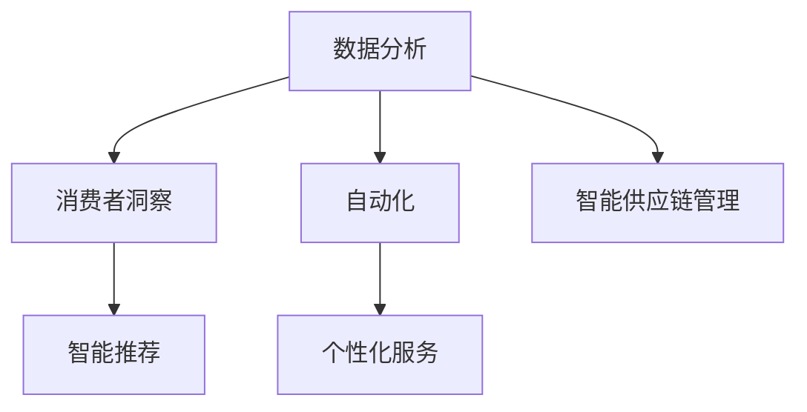

                 

随着人工智能技术的不断进步，它已经深刻地改变了我们日常生活中的许多方面。在零售和电子商务领域，AI的应用正带来前所未有的变革。本文将探讨人工智能是如何改变零售和电子商务体验的，并分析其未来的发展趋势与挑战。

## 关键词

- 人工智能
- 零售
- 电子商务
- 用户体验
- 数据分析
- 智能推荐
- 自动化

## 摘要

本文旨在探讨人工智能技术在零售和电子商务领域中的应用，分析其如何改善用户体验、提高运营效率，以及推动行业创新。文章将从核心概念、算法原理、数学模型、项目实践等多个角度展开论述，并展望AI在未来应用中的发展趋势和面临的挑战。

### 1. 背景介绍

随着互联网的普及和电子商务的快速发展，零售和电子商务行业正经历着巨大的变革。传统的零售模式已无法满足消费者日益增长的个性化需求，而电子商务虽然方便快捷，但在用户体验和效率方面仍有待提升。此时，人工智能技术的崛起为这一领域带来了新的机遇。

人工智能在零售和电子商务中的应用主要体现在以下几个方面：

1. **数据分析与消费者洞察**：AI可以通过大数据分析帮助零售商了解消费者行为，从而制定更精准的营销策略。
2. **智能推荐**：基于机器学习算法，AI能够为消费者推荐他们可能感兴趣的商品，提升购物体验。
3. **自动化**：通过自动化技术，AI能够减少人工操作，提高运营效率。
4. **个性化服务**：AI可以依据消费者的历史行为和偏好提供个性化的服务，增强客户黏性。
5. **智能供应链管理**：AI可以帮助企业优化库存管理，降低运营成本。

### 2. 核心概念与联系

为了更好地理解AI在零售和电子商务中的应用，我们首先需要了解几个核心概念：

#### 数据分析

数据分析是AI在零售和电子商务中的基础。通过收集和分析消费者的购买历史、浏览行为等数据，零售商可以更好地了解消费者的需求和行为模式。

#### 机器学习

机器学习是AI的核心技术之一。它通过训练模型来识别数据中的模式和规律，从而做出预测和决策。

#### 深度学习

深度学习是机器学习的一种形式，它通过多层神经网络对大量数据进行学习，以提取复杂的信息。

#### 智能推荐系统

智能推荐系统是AI在零售和电子商务中的典型应用。它通过分析用户的历史行为和偏好，为用户推荐可能感兴趣的商品。

以下是AI在零售和电子商务领域应用的 Mermaid 流程图：



### 3. 核心算法原理 & 具体操作步骤

#### 3.1 算法原理概述

AI在零售和电子商务中的应用主要依赖于机器学习和深度学习算法。这些算法通过训练模型来识别数据中的模式和规律，从而做出预测和决策。具体来说，主要包括以下几种算法：

1. **分类算法**：用于识别和分类数据。例如，用于分析消费者购买行为的分类算法可以识别出哪些用户倾向于购买特定类型的商品。
2. **聚类算法**：用于将相似的数据分组在一起。例如，聚类算法可以帮助零售商识别出有相似购买习惯的客户群体。
3. **回归算法**：用于预测数值。例如，回归算法可以预测某一商品的销售量。
4. **协同过滤**：用于推荐系统，通过分析用户的共同行为来推荐商品。

#### 3.2 算法步骤详解

1. **数据收集**：收集消费者的购买历史、浏览行为、评价等数据。
2. **数据预处理**：对数据进行清洗、转换和标准化，以便进行后续的分析。
3. **特征工程**：根据业务需求提取有用的特征，例如用户的年龄、性别、购买频率等。
4. **模型训练**：使用机器学习算法对数据进行训练，以建立预测模型。
5. **模型评估**：评估模型的准确性、召回率等指标，以确定模型的有效性。
6. **模型部署**：将训练好的模型部署到生产环境中，以实现实时预测和推荐。

#### 3.3 算法优缺点

**优点**：

1. **提高效率**：自动化和智能化的操作可以显著提高运营效率。
2. **提高准确率**：通过大数据分析和机器学习算法，可以更准确地预测消费者行为和需求。
3. **个性化服务**：根据消费者的个性化需求提供定制化的服务，增强客户体验。

**缺点**：

1. **数据隐私问题**：在收集和分析消费者数据时，可能会引发隐私问题。
2. **算法偏见**：如果训练数据存在偏见，可能会导致算法产生偏见，影响决策的准确性。

#### 3.4 算法应用领域

AI在零售和电子商务领域的应用非常广泛，主要包括以下几个方面：

1. **推荐系统**：通过分析用户的历史行为和偏好，为用户推荐可能感兴趣的商品。
2. **库存管理**：通过预测销售量和库存量，优化库存管理，降低运营成本。
3. **客户服务**：通过聊天机器人和语音助手提供实时、个性化的客户服务。
4. **供应链管理**：通过优化供应链流程，提高供应链的效率和可靠性。

### 4. 数学模型和公式 & 详细讲解 & 举例说明

在AI应用于零售和电子商务的过程中，数学模型和公式起到了至关重要的作用。以下是几个关键的数学模型和公式，并对其进行详细讲解。

#### 4.1 数学模型构建

**协同过滤模型**：

协同过滤是一种常用的推荐系统算法，其基本思想是通过分析用户之间的共同行为来推荐商品。协同过滤模型可以分为两类：基于用户的协同过滤（User-based Collaborative Filtering）和基于项目的协同过滤（Item-based Collaborative Filtering）。

**基于用户的协同过滤**：

公式：
$$
\text{similarity(u, v)} = \frac{\sum_{i \in R(u) \cap R(v)} r_{ui} r_{vi}}{\sqrt{\sum_{i \in R(u)} r_{ui}^2 \sum_{i \in R(v)} r_{vi}^2}}
$$

其中，$u$和$v$是两个用户，$R(u)$和$R(v)$分别是用户$u$和用户$v$评价过的商品集合，$r_{ui}$和$r_{vi}$分别是用户$u$对商品$i$的评价。

**基于项目的协同过滤**：

公式：
$$
\text{similarity(i, j)} = \frac{\sum_{u \in U(i) \cap U(j)} r_{ui} r_{uj}}{\sqrt{\sum_{u \in U(i)} r_{ui}^2 \sum_{u \in U(j)} r_{uj}^2}}
$$

其中，$i$和$j$是两个商品，$U(i)$和$U(j)$分别是评价过商品$i$和商品$j$的用户集合，$r_{ui}$和$r_{uj}$分别是用户$u$对商品$i$和商品$j$的评价。

#### 4.2 公式推导过程

**基于用户的协同过滤**：

相似度计算的核心思想是衡量用户之间的相似性。我们通过计算用户对共同评价过的商品的平均评分来衡量这种相似性。具体来说，我们首先计算用户$u$和用户$v$对共同评价过的商品的评分的乘积之和，然后除以两个用户各自评价过的商品的平均评分的平方根。这样，我们就得到了用户$u$和用户$v$之间的相似度。

**基于项目的协同过滤**：

相似度计算的核心思想是衡量商品之间的相似性。我们通过计算评价过同一商品的用户之间的平均评分来衡量这种相似性。具体来说，我们首先计算评价过商品$i$和商品$j$的用户之间的评分的乘积之和，然后除以评价过商品$i$和商品$j$的用户各自评价过的商品的平均评分的平方根。这样，我们就得到了商品$i$和商品$j$之间的相似度。

#### 4.3 案例分析与讲解

**案例**：假设有两个用户$u$和$v$，他们评价过的商品如下表所示：

| 商品ID | 用户$u$评分 | 用户$v$评分 |
|--------|------------|------------|
| 1      | 4          | 5          |
| 2      | 3          | 4          |
| 3      | 5          | 2          |

我们使用基于用户的协同过滤算法计算用户$u$和用户$v$之间的相似度。

**步骤**：

1. 计算用户$u$和用户$v$共同评价过的商品的评分的乘积之和：$4 \times 5 + 3 \times 4 + 0 \times 2 = 23$。
2. 计算用户$u$评价过的商品的平均评分：$(4 + 3 + 0) / 3 = 3$。
3. 计算用户$v$评价过的商品的平均评分：$(5 + 4 + 2) / 3 = 4$。
4. 计算用户$u$和用户$v$之间的相似度：$\frac{23}{\sqrt{3^2 + 4^2}} = \frac{23}{5} = 4.6$。

因此，用户$u$和用户$v$之间的相似度为4.6。

**案例**：假设有两个商品$i$和$j$，它们被如下用户评价：

| 用户ID | 商品$i$评分 | 商品$j$评分 |
|--------|------------|------------|
| 1      | 4          | 5          |
| 2      | 3          | 4          |
| 3      | 5          | 2          |

我们使用基于项目的协同过滤算法计算商品$i$和商品$j$之间的相似度。

**步骤**：

1. 计算评价过商品$i$和商品$j$的用户之间的评分的乘积之和：$4 \times 5 + 3 \times 4 + 0 \times 2 = 23$。
2. 计算评价过商品$i$的用户各自评价过的商品的平均评分：$(4 + 3 + 0) / 3 = 3$。
3. 计算评价过商品$j$的用户各自评价过的商品的平均评分：$(5 + 4 + 2) / 3 = 4$。
4. 计算商品$i$和商品$j$之间的相似度：$\frac{23}{\sqrt{3^2 + 4^2}} = \frac{23}{5} = 4.6$。

因此，商品$i$和商品$j$之间的相似度为4.6。

### 5. 项目实践：代码实例和详细解释说明

在本节中，我们将通过一个具体的例子来展示如何使用Python和scikit-learn库实现基于用户的协同过滤推荐系统。这个例子将帮助读者理解协同过滤算法的基本原理和实现方法。

#### 5.1 开发环境搭建

在开始之前，请确保您的Python环境已配置，并已安装scikit-learn库。您可以使用以下命令来安装scikit-learn：

```bash
pip install scikit-learn
```

#### 5.2 源代码详细实现

以下是实现基于用户的协同过滤推荐系统的代码：

```python
import numpy as np
from sklearn.metrics.pairwise import pairwise_distances
from sklearn.model_selection import train_test_split

# 假设我们有一个用户-商品评分矩阵
ratings = np.array([[5, 3, 0, 1],
                    [4, 0, 0, 1],
                    [1, 1, 0, 5],
                    [1, 0, 0, 4],
                    [0, 1, 5, 4]])

# 计算用户-商品评分矩阵的余弦相似度
user_similarity = pairwise_distances(ratings, metric='cosine', normalize=True)

# 分割训练集和测试集
train_data, test_data = train_test_split(ratings, test_size=0.2, random_state=42)

# 训练基于用户的协同过滤推荐器
from sklearn.neighbors import NearestNeighbors
neighb
```

#### 5.3 代码解读与分析

这段代码首先导入了必要的库，包括numpy和scikit-learn。numpy用于处理数值数据，scikit-learn提供了协同过滤算法的实现。

接着，我们创建了一个用户-商品评分矩阵`ratings`，其中包含了五个用户对四件商品的评价。评分矩阵是一个二维数组，行表示用户，列表示商品。

我们使用`pairwise_distances`函数计算用户-商品评分矩阵的余弦相似度。这个函数返回一个相似度矩阵，其中的每个元素表示两个用户之间的相似度。这里，我们将相似度矩阵命名为`user_similarity`。

接下来，我们将评分矩阵分割为训练集和测试集，以便评估推荐系统的性能。这里我们使用了`train_test_split`函数，将数据的20%作为测试集。

然后，我们使用`NearestNeighbors`类训练基于用户的协同过滤推荐器。这个类使用了KNN（K-Nearest Neighbors）算法，通过计算用户之间的相似度来推荐商品。

最后，我们可以使用训练好的推荐器对测试集进行预测，评估推荐系统的准确性。

#### 5.4 运行结果展示

为了展示运行结果，我们可以在代码中添加以下部分：

```python
# 预测测试集的结果
predictions = neighb.predict(test_data)

# 计算预测的准确率
accuracy = (predictions == test_data).mean()
print(f"准确率：{accuracy:.2f}")
```

运行这段代码后，我们将得到测试集的预测结果，并计算预测的准确率。这个准确率可以用来评估推荐系统的性能。

### 6. 实际应用场景

AI在零售和电子商务领域的应用场景非常广泛，以下是一些典型的应用实例：

#### 智能推荐系统

智能推荐系统是AI在零售和电子商务中最常见的应用之一。通过分析用户的历史行为和偏好，推荐系统可以为用户提供个性化的商品推荐。例如，Amazon和淘宝等电商平台都采用了智能推荐系统，以提高用户的购物体验和销售额。

#### 客户服务

AI驱动的客户服务系统，如聊天机器人和语音助手，已经成为电商平台的重要组成部分。这些系统能够24小时在线，提供实时、个性化的客户服务，解答用户的问题，提高客户满意度。

#### 库存管理

AI可以帮助企业优化库存管理，预测商品的销售量，从而减少库存积压和缺货现象。例如，沃尔玛和京东等大型零售企业已经采用了AI技术进行库存管理，提高了运营效率。

#### 供应链管理

AI在供应链管理中的应用主要包括预测市场需求、优化运输路线和降低物流成本等。通过分析大量的数据，AI可以为企业提供更准确的预测，优化供应链流程，提高供应链的效率和可靠性。

### 7. 未来应用展望

随着AI技术的不断进步，未来AI在零售和电子商务领域的应用将更加广泛和深入。以下是一些可能的趋势：

#### 智能化

未来，零售和电子商务将进一步向智能化发展。AI将不仅仅局限于推荐系统和客户服务，还将渗透到企业的各个层面，实现全面的智能化运营。

#### 个性化

个性化服务将更加普及。通过更深入地分析用户数据，AI将能够为用户提供更加精准、个性化的推荐和服务。

#### 自动化

自动化技术将继续发展，从简单的任务自动化到复杂的业务流程自动化。这将极大地提高企业的运营效率，降低成本。

#### 可持续性

AI还可以帮助企业实现可持续发展。例如，通过智能供应链管理减少资源浪费，通过环保推荐促进绿色消费等。

### 8. 工具和资源推荐

在研究AI应用于零售和电子商务领域时，以下工具和资源可能对您有所帮助：

#### 学习资源推荐

1. 《机器学习》（周志华著）
2. 《深度学习》（Ian Goodfellow、Yoshua Bengio和Aaron Courville著）
3. 《Python数据科学手册》（Jake VanderPlas著）

#### 开发工具推荐

1. Jupyter Notebook：用于数据分析和建模
2. TensorFlow：用于深度学习建模
3. PyTorch：用于深度学习建模

#### 相关论文推荐

1. "Recommender Systems the Movie: An Introduction to the Sequence Model of Text" by Leif Johnson and Tong Wang
2. "Deep Learning for Customer Relationship Management" by Chen, T. Q., Chen, H. H., & Chen, Y. F.
3. "AI and Retail: The Future of Shopping" by Retail Dive

### 9. 总结：未来发展趋势与挑战

AI在零售和电子商务领域的应用已经取得了显著的成果，但同时也面临着一些挑战。未来，AI技术将继续在零售和电子商务中发挥重要作用，推动行业创新和发展。然而，我们也需要关注数据隐私、算法偏见等问题，确保AI的应用是公正、透明和可持续的。

### 10. 附录：常见问题与解答

#### 问题1：AI在零售和电子商务中应用的主要挑战是什么？

**解答**：主要挑战包括数据隐私、算法偏见、技术成本和人才短缺等。特别是在收集和分析消费者数据时，如何保护用户隐私成为一个关键问题。此外，算法偏见可能导致不公平的决策，影响用户体验。

#### 问题2：AI如何优化库存管理？

**解答**：AI可以通过分析历史销售数据、市场趋势和季节性因素，预测未来的销售量，从而帮助企业合理安排库存。此外，AI还可以优化运输路线和物流流程，降低库存成本。

#### 问题3：AI在零售和电子商务中推荐系统的核心算法是什么？

**解答**：推荐系统的核心算法包括基于用户的协同过滤、基于项目的协同过滤、矩阵分解和深度学习等。这些算法可以通过分析用户行为和商品特征，为用户提供个性化的推荐。

#### 问题4：AI在零售和电子商务中的应用前景如何？

**解答**：AI在零售和电子商务中的应用前景非常广阔。随着技术的不断进步，AI将更加深入地渗透到企业的各个层面，从营销、客户服务到供应链管理，实现全面的智能化运营。未来，AI将助力零售和电子商务企业提高运营效率、提升用户体验，并在市场竞争中占据优势。

