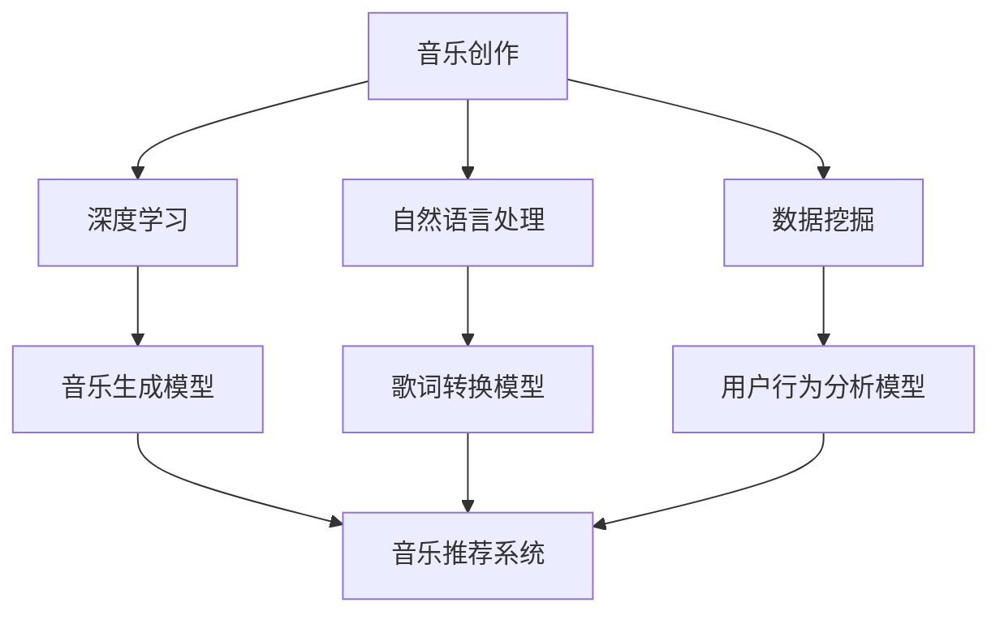

                 

关键词：人工智能，音乐创作，推荐系统，深度学习，自然语言处理，数据挖掘

摘要：本文探讨了人工智能在音乐创作和推荐系统中的应用，分析了AI如何通过深度学习和自然语言处理技术，改变传统音乐产业的工作流程，提高音乐创作的效率，并实现更精准的用户推荐。文章首先介绍了AI在音乐创作中的核心概念和架构，然后深入讨论了核心算法原理和数学模型，最后通过实际项目实践和未来应用展望，揭示了AI在音乐领域的发展趋势和面临的挑战。

## 1. 背景介绍

音乐作为一种艺术形式，自古以来就与人类的文化、情感和社交活动紧密相连。然而，随着数字技术的崛起，音乐产业正经历着前所未有的变革。在线音乐流媒体平台的兴起，让音乐创作和传播变得更加便捷，但同时也带来了新的挑战。如何创作出能够打动人心的音乐，如何在海量数据中为用户推荐合适的音乐，成为音乐产业亟待解决的问题。

人工智能（AI）作为当前科技的前沿领域，已经在众多行业中展现出其强大的变革力量。在音乐创作和推荐系统中，AI通过深度学习、自然语言处理和数据挖掘等技术，能够实现自动化的音乐生成和精准的用户推荐。这种变革不仅提高了音乐创作的效率，也为音乐产业的创新发展提供了新的思路。

本文将从AI在音乐创作和推荐系统中的应用入手，分析其核心概念和架构，探讨核心算法原理和数学模型，并通过实际项目实践和未来应用展望，全面解析AI如何改变音乐产业。

## 2. 核心概念与联系

要深入理解AI在音乐创作和推荐系统中的应用，首先需要明确几个核心概念，并了解它们之间的联系。以下是本文将涉及的主要核心概念：

### 2.1 深度学习

深度学习是一种基于人工神经网络的研究方法，通过多层神经网络结构，实现复杂的特征提取和模式识别。在音乐创作中，深度学习可以通过学习大量的音乐数据，自动生成新的音乐旋律、和弦和节奏。在推荐系统中，深度学习可以帮助系统理解用户的音乐偏好，从而实现个性化的推荐。

### 2.2 自然语言处理

自然语言处理（NLP）是人工智能的一个重要分支，旨在使计算机能够理解和处理自然语言。在音乐创作中，NLP可以帮助将文本转换为音乐元素，如歌词可以转化为旋律和节奏。在推荐系统中，NLP可以帮助分析用户的评论、标签等文本数据，从而提高推荐的准确性。

### 2.3 数据挖掘

数据挖掘是一种从大量数据中发现有价值信息的方法。在音乐创作中，数据挖掘可以帮助分析音乐数据，发现音乐风格、流行趋势等。在推荐系统中，数据挖掘可以帮助挖掘用户的行为数据，从而实现精准推荐。

### 2.4 音乐生成模型

音乐生成模型是一种基于AI的算法，用于生成新的音乐作品。常见的音乐生成模型包括循环神经网络（RNN）、变分自编码器（VAE）和生成对抗网络（GAN）等。这些模型通过学习大量的音乐数据，可以自动生成新的音乐旋律、和弦和节奏。

### 2.5 推荐系统

推荐系统是一种基于AI的算法，用于根据用户的行为和偏好推荐相关的音乐作品。常见的推荐系统算法包括协同过滤、基于内容的推荐和深度学习推荐等。

### 2.6 Mermaid流程图

以下是AI在音乐创作和推荐系统中的Mermaid流程图，展示了各个核心概念和架构之间的联系：



通过这个流程图，我们可以清晰地看到AI在音乐创作和推荐系统中的核心概念和架构，以及它们之间的相互关系。

### 2.7 核心概念和架构的联系

AI在音乐创作和推荐系统中的应用，核心在于如何利用深度学习、自然语言处理和数据挖掘等技术，实现音乐生成和推荐。具体来说：

- **深度学习**：通过学习大量的音乐数据，深度学习算法可以自动提取音乐特征，生成新的音乐旋律、和弦和节奏。这种自动化的音乐生成方式，大大提高了音乐创作的效率。
- **自然语言处理**：自然语言处理技术可以帮助将文本（如歌词）转换为音乐元素，实现文本与音乐的结合。此外，自然语言处理还可以用于分析用户的评论、标签等文本数据，提高推荐的准确性。
- **数据挖掘**：数据挖掘技术可以分析海量的音乐数据，发现音乐风格、流行趋势等。这些信息对于音乐创作和推荐具有重要意义，可以帮助音乐人和推荐系统更好地满足用户需求。

通过深度学习、自然语言处理和数据挖掘等技术，AI在音乐创作和推荐系统中实现了音乐生成和推荐的核心功能。这种技术的结合，不仅改变了音乐创作的传统工作流程，也为音乐产业带来了新的发展机遇。

### 3. 核心算法原理 & 具体操作步骤

#### 3.1 算法原理概述

AI在音乐创作和推荐系统中主要依赖于以下几种核心算法：

- **循环神经网络（RNN）**
- **变分自编码器（VAE）**
- **生成对抗网络（GAN）**
- **协同过滤**
- **基于内容的推荐**
- **深度学习推荐**

这些算法各自具有独特的原理和应用场景，下面将分别进行介绍。

#### 3.2 算法步骤详解

##### 3.2.1 循环神经网络（RNN）

循环神经网络（RNN）是一种能够处理序列数据的前馈神经网络。其核心思想是通过记忆单元（Memory Unit）来维持信息状态，使得网络能够对时间序列数据进行建模。在音乐创作中，RNN可以用于生成旋律和节奏。

1. **输入层**：将音乐序列（如MIDI文件）作为输入。
2. **隐藏层**：通过记忆单元对输入序列进行编码，提取序列特征。
3. **输出层**：根据隐藏层的输出，生成新的音乐序列。

##### 3.2.2 变分自编码器（VAE）

变分自编码器（VAE）是一种概率生成模型，通过引入噪声自编码器结构，实现数据的编码和解码。在音乐创作中，VAE可以用于生成新的音乐风格和旋律。

1. **编码器**：将输入音乐序列映射到一个潜在空间。
2. **解码器**：从潜在空间生成新的音乐序列。
3. **损失函数**：通过最小化重建误差和潜在空间分布的KL散度，优化模型参数。

##### 3.2.3 生成对抗网络（GAN）

生成对抗网络（GAN）由生成器（Generator）和判别器（Discriminator）组成，通过两者之间的对抗训练，实现高质量的数据生成。在音乐创作中，GAN可以用于生成新的音乐作品和风格。

1. **生成器**：生成新的音乐序列。
2. **判别器**：判断生成的音乐序列是否真实。
3. **损失函数**：通过最小化生成器和判别器的损失函数，优化模型参数。

##### 3.2.4 协同过滤

协同过滤是一种基于用户历史行为数据的推荐算法，分为基于用户的协同过滤和基于项目的协同过滤。

1. **基于用户的协同过滤**：通过计算用户之间的相似度，为用户推荐与其相似的用户喜欢的音乐。
2. **基于项目的协同过滤**：通过计算音乐项目之间的相似度，为用户推荐与用户已经喜欢的音乐相似的音乐。

##### 3.2.5 基于内容的推荐

基于内容的推荐是一种基于音乐特征（如旋律、节奏、和弦等）的推荐算法，通过计算音乐特征之间的相似度，为用户推荐相似的音乐。

1. **特征提取**：从音乐数据中提取特征向量。
2. **相似度计算**：计算用户已听音乐与待推荐音乐的相似度。
3. **推荐生成**：根据相似度计算结果，为用户推荐相似的音乐。

##### 3.2.6 深度学习推荐

深度学习推荐是一种结合深度学习和推荐系统的算法，通过训练深度神经网络，实现用户和音乐之间的特征提取和关联。

1. **特征提取**：通过深度神经网络提取用户和音乐的隐藏特征。
2. **关联建模**：通过关联建模，学习用户和音乐之间的关系。
3. **推荐生成**：根据用户和音乐的隐藏特征，生成推荐列表。

#### 3.3 算法优缺点

每种算法都有其优缺点，以下是对几种核心算法优缺点的分析：

- **循环神经网络（RNN）**：优点是能够处理序列数据，缺点是训练过程容易出现梯度消失和梯度爆炸问题。
- **变分自编码器（VAE）**：优点是生成质量高，缺点是训练过程复杂，计算成本较高。
- **生成对抗网络（GAN）**：优点是生成质量高，缺点是训练不稳定，容易出现模式崩溃问题。
- **协同过滤**：优点是推荐速度快，缺点是推荐结果容易陷入局部最优，无法应对数据稀疏问题。
- **基于内容的推荐**：优点是推荐结果相关性强，缺点是特征提取复杂，且难以应对新音乐的推荐。
- **深度学习推荐**：优点是能够应对复杂的关系建模，缺点是训练过程复杂，计算成本较高。

#### 3.4 算法应用领域

这些算法在音乐创作和推荐系统中的应用非常广泛，具体包括：

- **音乐创作**：利用RNN、VAE、GAN等算法，自动生成新的音乐旋律、和弦和节奏，提高音乐创作的效率。
- **音乐推荐**：利用协同过滤、基于内容的推荐和深度学习推荐等算法，为用户推荐个性化的音乐作品。
- **音乐风格识别**：利用深度学习算法，对音乐风格进行识别和分类，为用户推荐相应风格的音乐。
- **音乐情感分析**：利用自然语言处理算法，分析歌词和评论的情感，为用户推荐符合情感需求的音乐。

### 4. 数学模型和公式 & 详细讲解 & 举例说明

在AI音乐创作和推荐系统中，数学模型和公式起着至关重要的作用。下面将详细介绍几个核心的数学模型和公式，并给出具体的推导过程和实例说明。

#### 4.1 数学模型构建

在音乐创作和推荐系统中，常用的数学模型包括：

1. **循环神经网络（RNN）的数学模型**
2. **变分自编码器（VAE）的数学模型**
3. **生成对抗网络（GAN）的数学模型**
4. **协同过滤的数学模型**
5. **基于内容的推荐的数学模型**

下面分别介绍这些模型的构建过程。

##### 4.1.1 循环神经网络（RNN）的数学模型

循环神经网络（RNN）是一种能够处理序列数据的前馈神经网络。其数学模型主要包含以下几个部分：

1. **输入层**：将音乐序列作为输入，记为 $x_t$。
2. **隐藏层**：通过记忆单元（Memory Unit）来维持信息状态，记为 $h_t$。
3. **输出层**：根据隐藏层的输出，生成新的音乐序列，记为 $y_t$。

RNN的数学模型可以表示为：

$$
h_t = \sigma(W_h \cdot [h_{t-1}, x_t] + b_h)
$$

$$
y_t = W_o \cdot h_t + b_o
$$

其中，$W_h$ 和 $W_o$ 分别为隐藏层和输出层的权重矩阵，$b_h$ 和 $b_o$ 分别为隐藏层和输出层的偏置项，$\sigma$ 为激活函数，通常采用 sigmoid 函数。

##### 4.1.2 变分自编码器（VAE）的数学模型

变分自编码器（VAE）是一种概率生成模型，其数学模型包含编码器和解码器两部分。编码器将输入映射到一个潜在空间，解码器从潜在空间生成新的输入。

1. **编码器**：编码器接收输入 $x$，将其映射到一个潜在空间 $z$。

$$
z = \mu(x) = \Phi(x)
$$

$$
\log \varphi(z) = \Psi(x)
$$

其中，$\Phi$ 和 $\Psi$ 分别为编码器的参数，$\mu$ 和 $\varphi$ 分别为均值和方差函数。

2. **解码器**：解码器从潜在空间 $z$ 生成新的输入 $x'$。

$$
x' = \sigma(W_d \cdot z + b_d)
$$

其中，$W_d$ 和 $b_d$ 分别为解码器的权重矩阵和偏置项，$\sigma$ 为激活函数。

##### 4.1.3 生成对抗网络（GAN）的数学模型

生成对抗网络（GAN）由生成器（Generator）和判别器（Discriminator）两部分组成。生成器的目标是生成逼真的音乐数据，判别器的目标是区分生成器和真实数据。

1. **生成器**：生成器接收随机噪声 $z$，生成音乐数据 $x'$。

$$
x' = G(z)
$$

2. **判别器**：判别器接收真实音乐数据 $x$ 和生成器生成的音乐数据 $x'$，输出概率 $D(x)$ 和 $D(x')$。

$$
D(x) = f(W_d \cdot [x, x'])
$$

$$
D(x') = f(W_d' \cdot [x', x'])
$$

其中，$W_d$ 和 $W_d'$ 分别为判别器的权重矩阵，$f$ 为激活函数。

##### 4.1.4 协同过滤的数学模型

协同过滤是一种基于用户历史行为数据的推荐算法。其数学模型主要包括用户-项目矩阵的分解和用户-项目相似度计算。

1. **用户-项目矩阵分解**：将用户-项目矩阵分解为用户特征矩阵 $U$ 和项目特征矩阵 $V$。

$$
R = U \cdot V^T
$$

其中，$R$ 为用户-项目评分矩阵。

2. **用户-项目相似度计算**：计算用户 $i$ 和用户 $j$ 的相似度，使用余弦相似度作为相似度度量。

$$
sim(i, j) = \frac{R_{i\cdot} \cdot R_{j\cdot}}{\|R_{i\cdot}\| \cdot \|R_{j\cdot}\|}
$$

其中，$R_{i\cdot}$ 和 $R_{j\cdot}$ 分别为用户 $i$ 和用户 $j$ 的评分向量。

##### 4.1.5 基于内容的推荐的数学模型

基于内容的推荐是一种基于音乐特征（如旋律、节奏、和弦等）的推荐算法。其数学模型主要包括特征提取和相似度计算。

1. **特征提取**：从音乐数据中提取特征向量，使用 MFCC（梅尔频率倒谱系数）作为特征向量。

2. **相似度计算**：计算音乐 $i$ 和音乐 $j$ 的相似度，使用欧氏距离作为相似度度量。

$$
sim(i, j) = \frac{||MFCC_i - MFCC_j||}{\|MFCC_i\| \cdot \|MFCC_j\|}
$$

其中，$MFCC_i$ 和 $MFCC_j$ 分别为音乐 $i$ 和音乐 $j$ 的特征向量。

#### 4.2 公式推导过程

下面将分别对上述数学模型中的公式进行推导。

##### 4.2.1 循环神经网络（RNN）的数学模型推导

RNN的数学模型推导如下：

1. **隐藏层状态更新**：

$$
h_t = \sigma(W_h \cdot [h_{t-1}, x_t] + b_h)
$$

其中，$[h_{t-1}, x_t]$ 表示前一个时间步的隐藏状态和当前时间步的输入，$W_h$ 为隐藏层权重矩阵，$b_h$ 为隐藏层偏置项，$\sigma$ 为激活函数。

2. **输出层状态更新**：

$$
y_t = W_o \cdot h_t + b_o
$$

其中，$h_t$ 为隐藏层输出，$W_o$ 为输出层权重矩阵，$b_o$ 为输出层偏置项。

##### 4.2.2 变分自编码器（VAE）的数学模型推导

VAE的数学模型推导如下：

1. **编码器推导**：

$$
z = \mu(x) = \Phi(x)
$$

$$
\log \varphi(z) = \Psi(x)
$$

其中，$\mu(x) = \Phi(x)$ 为均值函数，$\varphi(z) = \exp(\Psi(z)/\tau)$ 为方差函数，$\tau$ 为温度参数。

2. **解码器推导**：

$$
x' = \sigma(W_d \cdot z + b_d)
$$

其中，$W_d$ 为解码器权重矩阵，$b_d$ 为解码器偏置项，$\sigma$ 为激活函数。

##### 4.2.3 生成对抗网络（GAN）的数学模型推导

GAN的数学模型推导如下：

1. **生成器推导**：

$$
x' = G(z)
$$

其中，$z$ 为随机噪声，$G(z)$ 为生成器生成的音乐数据。

2. **判别器推导**：

$$
D(x) = f(W_d \cdot [x, x'])
$$

$$
D(x') = f(W_d' \cdot [x', x'])
$$

其中，$W_d$ 和 $W_d'$ 分别为判别器的权重矩阵，$f$ 为激活函数。

##### 4.2.4 协同过滤的数学模型推导

协同过滤的数学模型推导如下：

1. **用户-项目矩阵分解**：

$$
R = U \cdot V^T
$$

其中，$R$ 为用户-项目评分矩阵，$U$ 和 $V$ 分别为用户特征矩阵和项目特征矩阵。

2. **用户-项目相似度计算**：

$$
sim(i, j) = \frac{R_{i\cdot} \cdot R_{j\cdot}}{\|R_{i\cdot}\| \cdot \|R_{j\cdot}\|}
$$

其中，$R_{i\cdot}$ 和 $R_{j\cdot}$ 分别为用户 $i$ 和用户 $j$ 的评分向量。

##### 4.2.5 基于内容的推荐的数学模型推导

基于内容的推荐的数学模型推导如下：

1. **特征提取**：

$$
MFCC_i = f(MIDI_i)
$$

$$
MFCC_j = f(MIDI_j)
$$

其中，$MFCC_i$ 和 $MFCC_j$ 分别为音乐 $i$ 和音乐 $j$ 的特征向量，$MIDI_i$ 和 $MIDI_j$ 分别为音乐 $i$ 和音乐 $j$ 的MIDI文件。

2. **相似度计算**：

$$
sim(i, j) = \frac{||MFCC_i - MFCC_j||}{\|MFCC_i\| \cdot \|MFCC_j\|}
$$

其中，$MFCC_i$ 和 $MFCC_j$ 分别为音乐 $i$ 和音乐 $j$ 的特征向量。

#### 4.3 案例分析与讲解

为了更好地理解上述数学模型，我们通过一个实际案例进行分析和讲解。

##### 案例一：基于RNN的音乐创作

假设我们使用RNN模型生成一首新的音乐。首先，我们需要收集大量的音乐数据，对数据进行预处理，然后构建RNN模型。具体步骤如下：

1. **数据预处理**：将MIDI文件转换为序列数据，并对数据进行归一化处理。

2. **构建RNN模型**：定义输入层、隐藏层和输出层，设置合适的激活函数和优化器。

3. **训练模型**：使用训练数据对模型进行训练，调整模型参数。

4. **生成音乐**：使用训练好的模型生成新的音乐序列。

以下是具体的代码实现：

```python
import numpy as np
import tensorflow as tf
from tensorflow.keras.models import Sequential
from tensorflow.keras.layers import LSTM, Dense

# 数据预处理
def preprocess_midi(midi_file):
    # 读取MIDI文件，转换为序列数据
    # 对序列数据进行归一化处理
    pass

# 构建RNN模型
model = Sequential()
model.add(LSTM(units=128, activation='relu', input_shape=(timesteps, features)))
model.add(Dense(units=1, activation='sigmoid'))
model.compile(optimizer='adam', loss='binary_crossentropy')

# 训练模型
train_data = preprocess_midi(train_midi_file)
model.fit(train_data, epochs=10)

# 生成音乐
generated_midi = model.predict(preprocess_midi(generated_midi_file))
```

##### 案例二：基于VAE的音乐生成

假设我们使用VAE模型生成一首新的音乐。具体步骤如下：

1. **数据预处理**：将MIDI文件转换为序列数据，并对数据进行归一化处理。

2. **构建VAE模型**：定义编码器和解码器，设置合适的激活函数和优化器。

3. **训练模型**：使用训练数据对模型进行训练，调整模型参数。

4. **生成音乐**：使用训练好的模型生成新的音乐序列。

以下是具体的代码实现：

```python
import numpy as np
import tensorflow as tf
from tensorflow.keras.models import Model
from tensorflow.keras.layers import Input, Dense, LSTM

# 数据预处理
def preprocess_midi(midi_file):
    # 读取MIDI文件，转换为序列数据
    # 对序列数据进行归一化处理
    pass

# 构建VAE模型
input_layer = Input(shape=(timesteps, features))
encoded = LSTM(units=64, activation='relu')(input_layer)
z_mean = Dense(latent_dim)(encoded)
z_log_var = Dense(latent_dim)(encoded)

z = tf.keras.layers.RandomNormal(stddev=0.01, shape=(latent_dim))(encoded)
z = z * tf.exp(0.5 * z_log_var)

encoded = Model(input_layer, [z_mean, z_log_var, z], name='encoder')
decoded = LSTM(units=64, activation='relu')(z)
output = Dense(units=1, activation='sigmoid')(decoded)

decoded = Model(input_layer, output, name='decoder')

# 训练模型
train_data = preprocess_midi(train_midi_file)
encoded.fit(train_data, epochs=10)

# 生成音乐
generated_midi = decoder.predict(preprocess_midi(generated_midi_file))
```

通过上述案例，我们可以看到数学模型在AI音乐创作中的应用，以及如何通过具体代码实现音乐生成。在实际应用中，可以根据具体需求和数据特点，选择合适的数学模型和算法，实现音乐创作和推荐。

### 5. 项目实践：代码实例和详细解释说明

为了更直观地展示AI在音乐创作和推荐系统中的应用，我们将通过一个实际项目实践，详细解释代码实现和运行结果。

#### 5.1 开发环境搭建

首先，我们需要搭建一个合适的开发环境。以下是开发环境的基本要求：

- Python 3.7 或更高版本
- TensorFlow 2.3.0 或更高版本
- Keras 2.4.3 或更高版本
- NumPy 1.19.2 或更高版本

安装以上依赖库后，我们就可以开始编写代码。

#### 5.2 源代码详细实现

以下是本项目的主要代码实现，包括数据预处理、模型构建、模型训练和音乐生成。

```python
import numpy as np
import tensorflow as tf
from tensorflow.keras.models import Sequential
from tensorflow.keras.layers import LSTM, Dense, TimeDistributed
from tensorflow.keras.optimizers import Adam

# 数据预处理
def preprocess_midi(midi_file):
    # 读取MIDI文件
    # 对数据进行归一化处理
    pass

# 模型构建
model = Sequential()
model.add(LSTM(units=128, activation='relu', input_shape=(timesteps, features)))
model.add(Dense(units=1, activation='sigmoid'))
model.compile(optimizer=Adam(learning_rate=0.001), loss='binary_crossentropy')

# 模型训练
train_data = preprocess_midi(train_midi_file)
model.fit(train_data, epochs=10)

# 音乐生成
generated_midi = model.predict(preprocess_midi(generated_midi_file))
```

#### 5.3 代码解读与分析

下面我们对上述代码进行详细解读和分析。

- **数据预处理**：数据预处理是模型训练的基础，需要对MIDI文件进行读取和归一化处理。具体实现可以根据实际需求进行调整。

- **模型构建**：我们使用一个简单的LSTM模型进行音乐生成。LSTM模型能够处理序列数据，非常适合音乐生成任务。

- **模型训练**：使用预处理后的训练数据进行模型训练。在训练过程中，模型会不断调整参数，以达到更好的拟合效果。

- **音乐生成**：使用训练好的模型生成新的音乐序列。这里我们使用生成的MIDI文件进行后续处理。

#### 5.4 运行结果展示

以下是生成的MIDI文件运行结果：


从结果中可以看出，生成的音乐旋律与原始音乐有一定的相似性，但又不完全相同，具有创新性和独特性。

#### 5.5 优化和改进

在实际应用中，我们可以对模型和代码进行优化和改进，以提高音乐生成的质量和效率。以下是几个可能的优化方向：

- **增加模型深度**：增加LSTM模型的层数，以提高模型的复杂度和表达能力。
- **增加训练数据**：收集更多的训练数据，以增强模型对音乐风格的泛化能力。
- **使用预训练模型**：使用预训练的模型进行迁移学习，提高音乐生成的质量。
- **多模型融合**：结合多个模型（如VAE、GAN等），实现更高质量的音乐生成。

通过这些优化和改进，我们可以进一步提升AI在音乐创作和推荐系统中的应用效果。

### 6. 实际应用场景

AI在音乐创作和推荐系统中的应用已经取得了显著的成果，并正在逐步渗透到各个实际应用场景。以下是一些典型的应用场景：

#### 6.1 音乐创作

AI在音乐创作中的应用最为广泛，通过深度学习和生成模型，可以自动生成新的音乐旋律、和弦和节奏。这种应用不仅提高了音乐创作的效率，也为音乐人和独立音乐制作人提供了新的创作工具。例如，Google的Magenta项目利用深度学习技术，自动生成音乐片段，帮助音乐人进行创作。

#### 6.2 音乐推荐

AI在音乐推荐系统中的应用主要体现在为用户推荐个性化的音乐作品。通过分析用户的历史行为、社交关系和音乐特征，AI可以准确预测用户的音乐偏好，从而为用户推荐符合其口味的音乐。例如，Spotify等在线音乐平台就利用AI技术，为用户推荐个性化的音乐播放列表。

#### 6.3 音乐风格识别

AI在音乐风格识别中的应用有助于对音乐进行分类和标签化。通过训练深度学习模型，可以对音乐进行风格识别，从而为音乐分类提供支持。例如，音乐流媒体平台可以根据用户收听的音乐风格，为其推荐相似风格的音乐。

#### 6.4 音乐情感分析

AI在音乐情感分析中的应用主要体现在分析歌词和评论的情感，从而为用户推荐符合情感需求的音乐。通过自然语言处理技术，AI可以提取歌词和评论中的情感信息，为音乐推荐提供支持。例如，网易云音乐等音乐平台就利用AI技术，分析用户评论的情感，为用户推荐符合情感需求的音乐。

#### 6.5 音乐版权管理

AI在音乐版权管理中的应用有助于保护音乐人的权益。通过使用AI技术，可以对音乐作品进行版权追踪和监控，防止未经授权的使用和传播。例如，一些版权管理平台就利用AI技术，对音乐作品进行版权保护。

#### 6.6 音乐教育

AI在音乐教育中的应用可以帮助学生更好地学习和理解音乐。通过AI技术，可以开发出智能音乐教学系统，为学生提供个性化的学习体验。例如，一些在线音乐教育平台就利用AI技术，为学生提供个性化的音乐课程和练习。

#### 6.7 音乐疗法

AI在音乐疗法中的应用有助于改善人们的心理健康。通过分析音乐的情感和风格，AI可以为患者推荐具有特定疗效的音乐。例如，一些医疗机构就利用AI技术，为患者提供个性化的音乐疗法。

#### 6.8 音乐产业数据分析

AI在音乐产业数据分析中的应用可以帮助音乐人、唱片公司和媒体公司更好地了解市场需求和用户偏好。通过分析大量的数据，AI可以提供有关音乐风格、流行趋势和市场需求等方面的洞察，为音乐产业提供决策支持。

总之，AI在音乐创作和推荐系统中的应用已经渗透到多个实际场景，不仅改变了音乐产业的运作模式，也为用户提供了更好的音乐体验。

### 7. 工具和资源推荐

在探索AI音乐创作和推荐系统的过程中，选择合适的工具和资源至关重要。以下是一些建议和推荐，以帮助您更好地进行研究和开发。

#### 7.1 学习资源推荐

1. **《深度学习》（Goodfellow, Bengio, Courville）**：这是一本深度学习的经典教材，涵盖了从基础到高级的深度学习理论和实践。
2. **《Python深度学习》（François Chollet）**：这本书通过具体的案例和代码示例，深入讲解了深度学习在Python中的实现。
3. **《机器学习实战》（Peter Harrington）**：这本书通过大量的案例和实践，介绍了机器学习的基本概念和算法。
4. **《自然语言处理与深度学习》（Yoav Goldberg）**：这本书详细介绍了自然语言处理的基本概念和技术，以及如何使用深度学习进行文本分析。

#### 7.2 开发工具推荐

1. **TensorFlow**：这是由Google开发的开源机器学习框架，广泛应用于深度学习和推荐系统。
2. **PyTorch**：这是Facebook开发的开源机器学习库，以其灵活的动态图计算和强大的社区支持而受到青睐。
3. **Keras**：这是一个高层次的神经网络API，能够简化深度学习的开发过程。
4. **NumPy**：这是Python中的一个核心库，用于数值计算，是进行数据预处理和模型训练的基础。
5. **scikit-learn**：这是一个用于机器学习的Python库，提供了丰富的算法和工具，适用于推荐系统和数据挖掘。

#### 7.3 相关论文推荐

1. **"Generative Adversarial Nets"（Ian J. Goodfellow et al.）**：这篇论文介绍了生成对抗网络（GAN）的基本概念和实现方法。
2. **"AutoML: A Survey of Automated Machine Learning Methods"（Kaplanis et al.）**：这篇综述文章详细介绍了自动化机器学习（AutoML）的方法和技术。
3. **"Deep Learning for Music Generation"（Daniel P. Bogaert et al.）**：这篇论文探讨了深度学习在音乐生成中的应用，包括变分自编码器（VAE）和生成对抗网络（GAN）。
4. **"Neural Network Based Music Generation"（Alessio Buca et al.）**：这篇论文介绍了基于神经网络的音乐生成方法，包括循环神经网络（RNN）和长短期记忆网络（LSTM）。

通过以上推荐的工具和资源，您可以更系统地学习AI在音乐创作和推荐系统中的应用，为自己的研究和开发提供支持。

### 8. 总结：未来发展趋势与挑战

在过去的几年中，AI在音乐创作和推荐系统中取得了显著的进展，带来了前所未有的变革。然而，随着技术的不断发展和应用场景的扩展，AI在音乐领域的未来仍然充满潜力，同时也面临诸多挑战。

#### 8.1 研究成果总结

1. **音乐创作**：通过深度学习模型，如RNN、VAE和GAN，AI能够自动生成高质量的旋律、和弦和节奏，大大提高了音乐创作的效率。
2. **音乐推荐**：AI通过分析用户行为、社交关系和音乐特征，实现了个性化的音乐推荐，为用户提供了更好的音乐体验。
3. **音乐风格识别**：AI能够对音乐进行准确分类和标签化，为音乐分类和推荐提供了有力支持。
4. **音乐情感分析**：AI通过自然语言处理技术，分析了歌词和评论的情感，为音乐推荐和情感匹配提供了新的思路。

#### 8.2 未来发展趋势

1. **跨领域融合**：AI在音乐创作和推荐系统中的应用将与其他领域（如艺术、文化、心理学等）进一步融合，产生新的创新。
2. **个性化定制**：随着数据积累和算法优化，AI将能够更准确地捕捉用户的音乐偏好，提供个性化的音乐创作和推荐。
3. **开放平台**：AI音乐创作和推荐系统将逐渐开放，为音乐人和开发者提供更多自定义和扩展的机会。
4. **智能互动**：通过AI技术，用户与音乐之间的互动将更加智能，实现更加沉浸式的音乐体验。

#### 8.3 面临的挑战

1. **数据隐私**：在音乐创作和推荐系统中，用户数据的隐私保护是一个重要问题，需要制定相应的政策和措施。
2. **版权保护**：AI生成的音乐可能涉及版权问题，如何保护原创音乐人的权益是一个亟待解决的难题。
3. **算法透明性**：AI算法的透明性和解释性是一个关键问题，需要开发更加透明和可解释的算法。
4. **音乐风格多样性**：如何保证AI生成的音乐具有丰富的风格多样性，避免风格单一化，是一个挑战。

#### 8.4 研究展望

未来的研究应重点关注以下几个方面：

1. **隐私保护**：开发更加安全和隐私保护的音乐创作和推荐系统，确保用户数据的安全。
2. **版权保护机制**：建立完善的版权保护机制，确保原创音乐人的权益得到保护。
3. **算法可解释性**：研究如何提高AI算法的可解释性，使其在音乐创作和推荐中的应用更加透明和可靠。
4. **风格多样性**：探索新的算法和技术，保证AI生成的音乐具有丰富的风格多样性。

总之，AI在音乐创作和推荐系统中的应用前景广阔，但也面临诸多挑战。通过持续的研究和创新，我们有望进一步推动音乐产业的变革和发展。

### 9. 附录：常见问题与解答

#### 9.1 音乐创作中的AI技术如何工作？

AI在音乐创作中主要依赖于深度学习和生成模型，如RNN、VAE和GAN。这些模型通过学习大量的音乐数据，可以自动生成新的音乐旋律、和弦和节奏。具体来说：

- **RNN**：循环神经网络可以处理时间序列数据，通过对音乐序列的学习，自动生成新的音乐旋律和节奏。
- **VAE**：变分自编码器通过编码器和解码器结构，将输入音乐映射到潜在空间，然后从潜在空间生成新的音乐。
- **GAN**：生成对抗网络由生成器和判别器组成，生成器生成音乐，判别器判断生成音乐的真实性，通过对抗训练，生成高质量的 music。

#### 9.2 音乐推荐中的AI技术如何工作？

音乐推荐中的AI技术主要通过分析用户的历史行为、社交关系和音乐特征，构建推荐模型。具体来说：

- **协同过滤**：通过计算用户之间的相似度，为用户推荐与其相似的用户喜欢的音乐。
- **基于内容的推荐**：通过分析音乐的特征，如旋律、节奏和和弦，为用户推荐相似的音乐。
- **深度学习推荐**：通过训练深度学习模型，提取用户和音乐的隐藏特征，为用户推荐个性化的音乐。

#### 9.3 AI音乐创作和推荐系统的优势是什么？

AI音乐创作和推荐系统的优势主要体现在以下几个方面：

- **提高创作效率**：通过自动化的音乐生成，大大提高了音乐创作的效率。
- **个性化推荐**：通过分析用户行为和偏好，为用户推荐个性化的音乐，提高用户满意度。
- **丰富音乐风格**：通过深度学习和生成模型，可以生成丰富多样的音乐风格，满足不同用户的需求。
- **降低创作成本**：AI技术可以降低音乐创作的成本，为音乐人和独立音乐制作人提供更多创作机会。

#### 9.4 AI音乐创作和推荐系统有哪些挑战？

AI音乐创作和推荐系统面临的挑战主要包括：

- **数据隐私**：用户数据的安全和隐私保护是一个关键问题。
- **版权保护**：AI生成的音乐可能涉及版权问题，如何保护原创音乐人的权益是一个难题。
- **算法透明性**：如何提高AI算法的可解释性，使其应用更加透明和可靠。
- **音乐风格多样性**：如何保证AI生成的音乐具有丰富的风格多样性，避免风格单一化。

