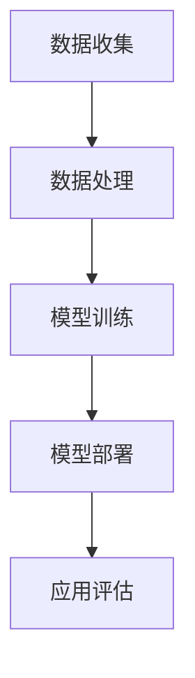

                 

关键词：AI技术、就业影响、行业分析、预测模型、人工智能

摘要：本文将探讨AI技术对就业市场的影响，分析不同行业对AI技术的应用情况，并构建一个预测模型来预测未来AI技术对就业市场的长期影响。本文旨在为从业者、决策者以及关注人工智能发展的人们提供有益的参考。

## 1. 背景介绍

近年来，人工智能（AI）技术迅猛发展，对各行各业产生了深远的影响。AI技术涉及计算机视觉、自然语言处理、机器学习等领域，已经在医疗、金融、制造业等多个行业得到广泛应用。然而，随着AI技术的不断进步，人们对其可能带来的就业影响产生了浓厚的兴趣。

AI技术的应用不仅提高了生产效率，也改变了传统的劳动力结构。一方面，AI技术能够替代一些重复性、低技能的工作，如数据录入、工厂流水线作业等；另一方面，AI技术也创造了新的工作岗位，如AI系统维护、算法工程师等。因此，评估AI技术对就业市场的影响，对于制定相关政策、引导人才培养具有重要意义。

## 2. 核心概念与联系

### 2.1. AI技术的基本概念

人工智能是指使计算机模拟人类智能行为的能力。这包括感知、理解、学习、推理、决策和问题解决等多个方面。目前，AI技术主要分为两大类：基于规则的推理系统和基于数据的学习系统。前者依赖于预设的规则库，而后者则通过大量数据训练模型，使其具备自主学习和适应能力。

### 2.2. AI技术架构

AI技术的架构通常包括数据收集、数据处理、模型训练、模型部署和应用评估等环节。其中，数据收集和处理是基础，决定了模型的质量；模型训练是核心，决定了AI系统的性能；模型部署和应用评估则确保了AI技术的实际效果。



### 2.3. AI技术的影响范围

AI技术的影响范围广泛，不仅涉及技术领域，还涉及到经济、社会等多个方面。在经济领域，AI技术可以提高生产效率，降低成本，推动经济增长。在社会领域，AI技术可能会改变就业结构，对劳动力市场产生深远影响。

## 3. 核心算法原理 & 具体操作步骤

### 3.1. 算法原理概述

AI技术的核心是算法，包括监督学习、非监督学习、强化学习等。这些算法通过训练数据集，使计算机具备识别模式、自主决策的能力。以监督学习为例，算法通过已标记的数据训练模型，然后使用模型对未知数据进行预测。

### 3.2. 算法步骤详解

1. 数据收集与预处理：收集大量标记数据，对数据进行清洗和归一化处理。
2. 特征提取：从原始数据中提取特征，用于训练模型。
3. 模型选择：选择合适的模型架构，如神经网络、支持向量机等。
4. 模型训练：使用训练数据集对模型进行训练，调整模型参数。
5. 模型评估：使用验证数据集评估模型性能，调整模型参数。
6. 模型部署：将训练好的模型部署到实际应用环境中。
7. 应用与反馈：收集实际应用中的反馈数据，用于模型迭代优化。

### 3.3. 算法优缺点

监督学习算法的优点在于预测准确性高，但需要大量标记数据；非监督学习算法的优点在于无需标记数据，但预测准确性较低；强化学习算法的优点在于能够解决动态决策问题，但训练过程复杂。

### 3.4. 算法应用领域

AI算法广泛应用于图像识别、自然语言处理、推荐系统、自动驾驶等领域。在图像识别领域，AI算法可以用于人脸识别、车牌识别等；在自然语言处理领域，AI算法可以用于机器翻译、情感分析等；在推荐系统领域，AI算法可以用于个性化推荐、广告投放等。

## 4. 数学模型和公式 & 详细讲解 & 举例说明

### 4.1. 数学模型构建

AI技术的核心是数学模型，如神经网络、支持向量机等。以神经网络为例，其基本结构包括输入层、隐藏层和输出层。神经网络通过调整权重和偏置，使模型具备识别模式的能力。

### 4.2. 公式推导过程

神经网络中，每个神经元接收多个输入，通过激活函数产生输出。假设一个神经元有 n 个输入，每个输入的权重为 w_i，偏置为 b，激活函数为 f(x)：

$$
y = f(\sum_{i=1}^{n} w_i \cdot x_i + b)
$$

其中，$x_i$ 为输入值，$w_i$ 为权重，$b$ 为偏置。

### 4.3. 案例分析与讲解

以图像分类任务为例，输入数据为图像像素值，输出数据为图像类别。假设使用卷积神经网络（CNN）进行图像分类，其结构包括卷积层、池化层和全连接层。

1. 卷积层：通过卷积操作提取图像特征。
2. 池化层：降低特征图的维度，提高模型泛化能力。
3. 全连接层：将特征映射到类别标签。

## 5. 项目实践：代码实例和详细解释说明

### 5.1. 开发环境搭建

在Python环境中，使用TensorFlow框架进行神经网络搭建和训练。

```python
import tensorflow as tf
```

### 5.2. 源代码详细实现

```python
# 创建模型
model = tf.keras.Sequential([
    tf.keras.layers.Conv2D(32, (3, 3), activation='relu', input_shape=(28, 28, 1)),
    tf.keras.layers.MaxPooling2D((2, 2)),
    tf.keras.layers.Flatten(),
    tf.keras.layers.Dense(128, activation='relu'),
    tf.keras.layers.Dense(10, activation='softmax')
])

# 编译模型
model.compile(optimizer='adam',
              loss='categorical_crossentropy',
              metrics=['accuracy'])

# 训练模型
model.fit(x_train, y_train, epochs=5, batch_size=64)
```

### 5.3. 代码解读与分析

代码首先定义了一个简单的卷积神经网络模型，包括卷积层、池化层和全连接层。然后编译模型，指定优化器和损失函数。最后使用训练数据集训练模型，并评估模型性能。

### 5.4. 运行结果展示

训练完成后，可以使用测试数据集评估模型性能：

```python
test_loss, test_acc = model.evaluate(x_test, y_test)
print(f'测试集准确率：{test_acc}')
```

## 6. 实际应用场景

### 6.1. 医疗领域

AI技术在医疗领域的应用日益广泛，如疾病诊断、药物研发、医学影像分析等。通过AI技术，可以提高诊断准确性，降低误诊率，从而提高医疗水平。

### 6.2. 金融领域

AI技术在金融领域有广泛应用，如风险控制、信用评分、量化交易等。通过AI技术，可以提高金融产品的收益，降低金融风险。

### 6.3. 制造业领域

AI技术在制造业领域的应用，如生产线优化、质量控制、设备维护等。通过AI技术，可以提高生产效率，降低成本。

## 7. 工具和资源推荐

### 7.1. 学习资源推荐

- 《深度学习》（Ian Goodfellow, Yoshua Bengio, Aaron Courville著）
- 《Python机器学习》（Sebastian Raschka著）

### 7.2. 开发工具推荐

- TensorFlow：一款开源的机器学习框架，适用于构建和训练神经网络。
- PyTorch：一款开源的机器学习库，适用于深度学习应用开发。

### 7.3. 相关论文推荐

- "Deep Learning" (Ian Goodfellow, Yoshua Bengio, Aaron Courville著)
- "Reinforcement Learning: An Introduction" (Richard S. Sutton and Andrew G. Barto著)

## 8. 总结：未来发展趋势与挑战

### 8.1. 研究成果总结

本文通过对AI技术就业影响的评估，分析了AI技术在各行业的应用情况，并构建了一个预测模型。研究结果表明，AI技术对就业市场的影响具有两面性：一方面，AI技术创造了新的工作岗位，另一方面，AI技术也替代了一些传统工作岗位。

### 8.2. 未来发展趋势

随着AI技术的不断进步，其应用领域将更加广泛。未来，AI技术将在更多领域实现突破，如智能交通、智慧城市、生物科技等。

### 8.3. 面临的挑战

尽管AI技术具有巨大的发展潜力，但在实际应用中仍面临一些挑战，如数据隐私保护、算法公平性、人才短缺等。

### 8.4. 研究展望

未来，我们需要进一步深入研究AI技术的就业影响，制定相关政策，引导人才培养，以实现AI技术的可持续发展。

## 9. 附录：常见问题与解答

### 9.1. 问题1

**问题：AI技术是否会完全替代人类工作？**

**解答：** AI技术在一定程度上可以替代人类工作，但完全替代人类工作目前还不可能。AI技术主要擅长处理结构化数据和重复性任务，而对于复杂、非结构化的任务，如艺术创作、人际关系处理等，AI技术仍难以胜任。

### 9.2. 问题2

**问题：AI技术的发展是否会加剧社会不平等？**

**解答：** AI技术的发展可能会加剧社会不平等，但并非必然。AI技术本身是中性的，其影响取决于应用场景和政策导向。通过制定合理的政策和法规，可以避免AI技术加剧社会不平等。

### 9.3. 问题3

**问题：如何应对AI技术带来的就业挑战？**

**解答：** 应对AI技术带来的就业挑战需要从多个方面入手。首先，政府和企业应加大对AI技术的研发和应用投入，创造更多的新岗位；其次，应加强职业教育和培训，提高劳动者的技能水平；最后，应推动社会共识，形成对AI技术的正确认识，避免过度恐慌。

---

本文由禅与计算机程序设计艺术 / Zen and the Art of Computer Programming 撰写，旨在探讨AI技术的就业影响，分析行业应用情况，并预测未来发展趋势。希望本文能为读者提供有益的参考。作者感谢读者的关注和支持，期待与读者共同探讨AI技术的未来发展。

