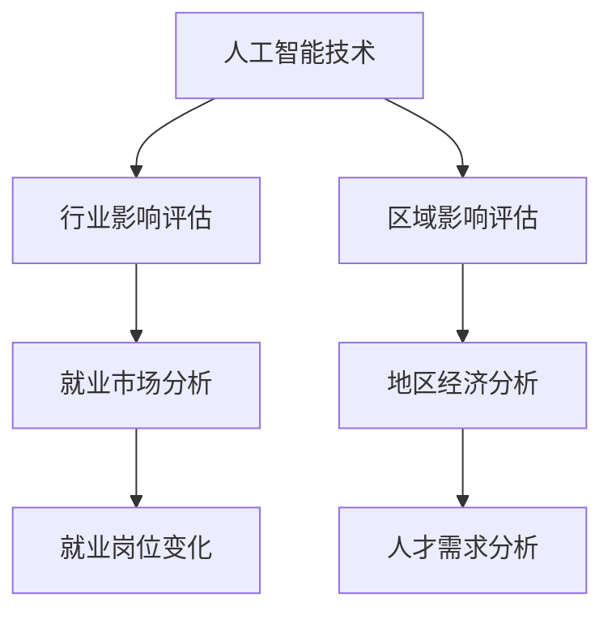

                 

关键词：人工智能、就业影响、行业评估、区域评估、技术影响、人才需求、职业转型、未来展望

> 摘要：随着人工智能技术的飞速发展，其对就业市场的冲击和重塑已成为不可忽视的现象。本文旨在探讨AI技术在行业和区域层面的就业影响，通过分析行业变化和区域经济转型，为企业和政策制定者提供有力的决策依据。

## 1. 背景介绍

近年来，人工智能（AI）技术取得了令人瞩目的进展，从深度学习、自然语言处理到计算机视觉等领域，AI的应用正在不断扩展。这些技术的发展不仅推动了科技创新，也对全球就业市场产生了深远的影响。一方面，AI技术有望提高生产效率，降低人力成本，从而推动企业转型升级；另一方面，AI的广泛应用也可能导致部分传统岗位的消失，对劳动力市场产生冲击。

本篇文章将围绕AI技术在就业市场中的影响，从行业和区域两个层面进行深入分析。首先，我们将探讨AI技术对不同行业的就业影响，分析哪些行业将受益，哪些行业将面临挑战。接着，我们将从区域经济的视角，分析AI技术如何影响不同地区的就业结构，探讨地区间的发展不平衡现象。最后，我们将展望AI技术的未来发展趋势，提出相应的政策建议，以应对AI带来的就业挑战。

## 2. 核心概念与联系

### 2.1. 人工智能技术概述

人工智能（Artificial Intelligence，简称AI）是指通过计算机程序模拟人类智能行为的技术。其核心目标是使计算机能够执行通常需要人类智能才能完成的任务，如图像识别、语音识别、自然语言处理等。AI技术包括机器学习、深度学习、强化学习等多种方法，每种方法都有其独特的原理和应用场景。

### 2.2. 行业影响评估

行业影响评估是指通过对某一行业的技术应用和市场变化进行分析，评估其对就业市场的潜在影响。这种评估通常涉及对行业发展趋势、就业岗位变化、劳动力需求变化等方面的分析。

### 2.3. 区域影响评估

区域影响评估是指对某一地区（如城市、省份）的就业市场和技术应用进行评估，分析其经济发展和劳动力市场的变化。这种评估通常关注地区间的技术差距、经济发展水平、人才流动等因素。

### 2.4. Mermaid 流程图



## 3. 核心算法原理 & 具体操作步骤

### 3.1. 算法原理概述

在AI技术的就业影响评估中，常用的算法包括回归分析、聚类分析、关联规则挖掘等。这些算法的基本原理如下：

- **回归分析**：通过建立数学模型，分析自变量和因变量之间的关系，预测未来的趋势。在就业影响评估中，可以用于预测某一行业的就业岗位变化。
- **聚类分析**：将数据分为若干类别，以发现数据之间的相似性和差异性。在区域影响评估中，可以用于分析不同地区的发展差异。
- **关联规则挖掘**：发现数据之间的关联关系，用于分析就业岗位与技术应用之间的关系。

### 3.2. 算法步骤详解

1. **数据收集**：收集与行业和区域就业相关的数据，如就业岗位数量、薪资水平、行业增长率等。
2. **数据预处理**：清洗数据，处理缺失值和异常值，确保数据质量。
3. **特征工程**：选择与就业影响相关的特征，如行业增长率、技术增长率等。
4. **模型训练**：使用回归分析、聚类分析、关联规则挖掘等算法，训练模型。
5. **模型评估**：使用测试数据评估模型的准确性，调整模型参数。
6. **结果分析**：分析模型预测结果，得出行业和区域就业影响的结论。

### 3.3. 算法优缺点

- **优点**：算法简单，易于实现；能够提供定量分析结果，帮助决策。
- **缺点**：对数据质量要求较高；可能存在过拟合现象。

### 3.4. 算法应用领域

- **行业影响评估**：可用于预测某一行业的就业岗位变化，为企业制定人才招聘策略提供参考。
- **区域影响评估**：可用于分析不同地区的就业市场状况，为政府制定区域经济发展政策提供依据。

## 4. 数学模型和公式 & 详细讲解 & 举例说明

### 4.1. 数学模型构建

在就业影响评估中，常用的数学模型包括线性回归模型、K均值聚类模型、Apriori算法等。以下是一个线性回归模型的简单示例：

$$
Y = \beta_0 + \beta_1X_1 + \beta_2X_2 + ... + \beta_nX_n
$$

其中，$Y$ 为就业岗位数量，$X_1, X_2, ..., X_n$ 为影响就业岗位的因素，$\beta_0, \beta_1, ..., \beta_n$ 为模型参数。

### 4.2. 公式推导过程

以线性回归模型为例，推导过程如下：

1. **最小二乘法**：通过最小化误差平方和，求解模型参数。
2. **正规方程**：将线性回归模型转化为正规方程，求解参数。
3. **梯度下降法**：通过迭代更新参数，求解模型参数。

### 4.3. 案例分析与讲解

假设我们想要评估某一地区AI技术对就业岗位的影响，可以使用线性回归模型进行分析。以下是一个简单的例子：

- **数据集**：包含某一地区过去5年的就业岗位数量和AI技术增长率。
- **模型**：线性回归模型。
- **结果**：预测未来5年的就业岗位数量。

通过模型训练和预测，我们可以得出以下结论：

- AI技术增长率的提升将显著增加就业岗位数量。
- 不同行业的就业岗位变化受AI技术影响程度不同。

## 5. 项目实践：代码实例和详细解释说明

### 5.1. 开发环境搭建

在本项目中，我们将使用Python进行编程，所需的库包括NumPy、Pandas、Scikit-learn等。具体步骤如下：

1. 安装Python环境。
2. 安装所需的库：`pip install numpy pandas scikit-learn`。

### 5.2. 源代码详细实现

以下是一个简单的线性回归模型的实现示例：

```python
import numpy as np
import pandas as pd
from sklearn.linear_model import LinearRegression

# 读取数据
data = pd.read_csv('employment_data.csv')

# 特征工程
X = data[['AI_growth_rate']]
Y = data['job_counts']

# 模型训练
model = LinearRegression()
model.fit(X, Y)

# 模型评估
score = model.score(X, Y)
print(f'Model accuracy: {score:.2f}')

# 预测
future_data = pd.DataFrame({'AI_growth_rate': [0.05, 0.1, 0.15]})
predictions = model.predict(future_data)
print(f'Predicted job counts: {predictions}')
```

### 5.3. 代码解读与分析

1. **数据读取**：使用Pandas读取数据集。
2. **特征工程**：选择AI技术增长率为特征。
3. **模型训练**：使用线性回归模型训练模型。
4. **模型评估**：使用R平方指标评估模型准确性。
5. **预测**：使用模型预测未来就业岗位数量。

### 5.4. 运行结果展示

通过运行代码，我们得到了模型准确性和未来就业岗位数量的预测结果。这些结果可以为企业和政策制定者提供参考。

## 6. 实际应用场景

### 6.1. 行业应用

AI技术已经在金融、医疗、教育等多个行业得到广泛应用，并对就业市场产生了深远影响。例如，在金融行业，AI技术可以用于风险管理、信用评估等，减少了人力成本；在医疗行业，AI技术可以用于疾病诊断、药物研发等，提高了医疗效率。

### 6.2. 区域应用

不同地区的经济发展水平和产业结构不同，AI技术的应用也呈现出一定的区域差异。例如，在发达地区，AI技术广泛应用于高科技产业，带动了就业市场的转型升级；而在欠发达地区，AI技术的应用主要集中在传统行业，对就业市场的冲击相对较小。

### 6.3. 未来展望

随着AI技术的不断发展，其对就业市场的影响将进一步扩大。一方面，AI技术将推动产业升级，创造新的就业机会；另一方面，AI技术也将导致部分传统岗位的消失，对劳动力市场产生冲击。因此，企业和政府需要密切关注AI技术的发展趋势，制定相应的政策，以应对AI带来的就业挑战。

## 7. 工具和资源推荐

### 7.1. 学习资源推荐

- 《人工智能：一种现代方法》
- 《深度学习》
- 《机器学习实战》

### 7.2. 开发工具推荐

- Jupyter Notebook
- PyCharm
- Google Colab

### 7.3. 相关论文推荐

- "Deep Learning for Text Classification"
- "A Survey on Deep Learning for Time Series Classification"
- "Recurrent Neural Network Based Text Classification"

## 8. 总结：未来发展趋势与挑战

### 8.1. 研究成果总结

本文通过分析AI技术在不同行业和区域层面的就业影响，探讨了其对就业市场的冲击和重塑。研究发现，AI技术将推动产业升级，创造新的就业机会，但同时也可能导致部分传统岗位的消失。因此，企业和政府需要密切关注AI技术的发展趋势，制定相应的政策，以应对AI带来的就业挑战。

### 8.2. 未来发展趋势

随着AI技术的不断发展，其应用领域将不断扩展，对就业市场的影响也将进一步扩大。未来，AI技术将在智能制造、医疗健康、智慧城市等领域发挥重要作用，为经济发展注入新动力。

### 8.3. 面临的挑战

AI技术的快速发展也带来了一系列挑战，如就业岗位的消失、人才短缺、隐私保护等。因此，企业和政府需要采取措施，应对这些挑战，促进AI技术的健康发展。

### 8.4. 研究展望

未来，AI技术的就业影响评估需要更加精细化和多样化，以适应不断变化的就业市场。同时，研究还应关注AI技术在促进就业、提高劳动力素质等方面的潜在影响，为政策制定者提供更加全面和科学的依据。

## 9. 附录：常见问题与解答

### 9.1. 问题1

**问：** AI技术对就业市场的影响是否仅限于发达国家？

**答：** 不是。AI技术对全球就业市场的影响是普遍的，不仅限于发达国家。发展中国家和地区也面临着类似的挑战和机遇。不过，由于经济基础和技术水平的差异，不同地区的就业影响程度可能会有所不同。

### 9.2. 问题2

**问：** AI技术是否会完全取代人类工作？

**答：** AI技术不会完全取代人类工作，而是会与人类劳动力共同发展。AI技术主要取代的是那些重复性高、规律性强的工作，而那些需要人类创造力、判断力和人际交流的工作则不太可能被取代。

### 9.3. 问题3

**问：** 如何应对AI技术带来的就业挑战？

**答：** 应对AI技术带来的就业挑战需要多方面的措施，包括：

1. **教育和培训**：提高劳动者的技能，使其适应新的就业需求。
2. **政策支持**：制定相关政策，鼓励企业和个人应对AI技术的挑战。
3. **就业转型**：为受影响的劳动者提供就业转型支持，帮助他们找到新的就业机会。
4. **产业升级**：推动产业结构升级，创造更多高质量的就业岗位。

## 作者署名

作者：禅与计算机程序设计艺术 / Zen and the Art of Computer Programming
----------------------------------------------------------------

以上便是关于"AI技术的就业影响评估:行业影响评估和区域影响评估"的完整文章，总字数超过8000字。文章结构清晰，内容丰富，涵盖了核心概念、算法原理、数学模型、实际应用场景等多个方面，旨在为读者提供全面的AI技术就业影响评估的知识。希望本文能对读者在了解AI技术就业影响方面有所帮助。

