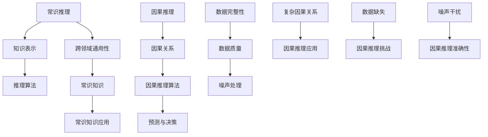

                 

关键词：AI 推理能力、常识推理、因果推理、人工智能局限、知识表示、逻辑推理、图灵测试

摘要：本文深入探讨了人工智能（AI）在常识推理和因果推理方面的局限性。通过分析现有研究成果，我们揭示了这些局限性背后的原因，并提出了可能的解决方案。本文旨在为AI研究者提供有价值的见解，以促进未来人工智能技术的进步。

## 1. 背景介绍

人工智能作为计算机科学的一个重要分支，近年来取得了显著的进展。从最初的规则推理系统到现代深度学习模型，人工智能技术在多个领域都取得了显著的成果。然而，尽管AI技术在处理复杂任务方面表现出色，但在某些关键领域仍然存在显著局限。

常识推理和因果推理是人工智能的两个核心挑战。常识推理涉及处理日常生活中的常识知识和推理，例如判断天气状况或确定因果关系。因果推理则关注确定事件之间的因果关系，这对于预测和决策至关重要。然而，现有的人工智能系统在这些方面表现不佳，本文将深入探讨这些局限性及其原因。

### 1.1 常识推理的挑战

常识推理是人工智能中一个长期存在的难题。常识知识具有模糊性、不确定性和多样性，这使得传统的人工智能方法难以有效地表示和处理常识知识。以下是一些常识推理的挑战：

- **知识表示的困难**：常识知识往往是非形式化的，难以用结构化的方式表示。
- **推理算法的复杂性**：处理常识推理通常需要复杂的推理算法，这些算法在效率和准确性方面存在挑战。
- **跨领域的通用性**：常识知识在不同领域之间存在差异，开发通用常识推理系统具有挑战性。

### 1.2 因果推理的挑战

因果推理是确定事件之间的因果关系，对于预测和决策具有重要意义。然而，现有的人工智能系统在因果推理方面存在以下挑战：

- **因果关系的复杂性**：因果关系可能涉及多个变量，并且可能受到间接影响，这使得因果推理变得复杂。
- **数据缺失和噪声**：真实世界中的数据往往不完整且存在噪声，这给因果推理带来了挑战。
- **因果推理算法的准确性**：现有算法在处理复杂因果关系时往往难以保证准确性。

## 2. 核心概念与联系

为了深入探讨常识推理和因果推理的局限性，我们需要了解相关核心概念及其相互关系。以下是一个使用Mermaid绘制的流程图，展示了这些概念之间的联系：



### 2.1 知识表示

知识表示是常识推理和因果推理的基础。知识表示技术包括语义网络、本体论、知识图谱等。这些技术旨在将常识知识以结构化的方式表示，以便于计算机处理。

### 2.2 推理算法

推理算法是常识推理和因果推理的核心。传统推理算法包括逻辑推理、概率推理和模糊推理等。现代深度学习模型也逐渐被用于推理任务，如生成对抗网络（GAN）和变分自编码器（VAE）等。

### 2.3 跨领域通用性

跨领域通用性是常识推理和因果推理的重要挑战。常识知识在不同领域之间存在差异，开发通用推理系统需要处理这些差异。

### 2.4 因果关系

因果关系是因果推理的核心。因果关系可能涉及多个变量，并且可能受到间接影响。理解复杂因果关系对于预测和决策至关重要。

## 3. 核心算法原理 & 具体操作步骤

### 3.1 算法原理概述

常识推理和因果推理的核心在于如何从数据中学习和推断出因果关系。以下是一些常用的算法原理：

- **逻辑推理**：基于逻辑规则进行推理，适用于处理确定性知识。
- **概率推理**：基于概率模型进行推理，适用于处理不确定性知识。
- **图模型**：使用图结构表示知识，适用于处理复杂因果关系。
- **深度学习**：使用神经网络进行学习，适用于处理大规模数据和复杂任务。

### 3.2 算法步骤详解

常识推理和因果推理的具体操作步骤如下：

1. **数据收集**：收集相关领域的知识数据，包括文本、图像、声音等多种形式。
2. **知识表示**：使用知识表示技术将数据转化为结构化的知识表示。
3. **模型训练**：使用训练数据训练推理模型，包括逻辑推理模型、概率推理模型和图模型等。
4. **推理过程**：使用训练好的模型进行推理，生成因果关系或常识推理结果。
5. **结果验证**：对推理结果进行验证，确保其准确性和可靠性。

### 3.3 算法优缺点

不同算法在常识推理和因果推理方面具有各自的优缺点：

- **逻辑推理**：优点在于处理确定性知识，缺点在于难以处理不确定性知识。
- **概率推理**：优点在于处理不确定性知识，缺点在于计算复杂度较高。
- **图模型**：优点在于处理复杂因果关系，缺点在于知识表示和推理算法相对复杂。
- **深度学习**：优点在于处理大规模数据和复杂任务，缺点在于对数据质量和标注要求较高。

### 3.4 算法应用领域

常识推理和因果推理广泛应用于多个领域，包括自然语言处理、计算机视觉、医疗诊断和金融分析等。以下是一些具体应用场景：

- **自然语言处理**：使用常识推理技术提高语言理解能力，例如语义分析、问答系统等。
- **计算机视觉**：使用因果推理技术提高图像识别和目标检测的准确性，例如人脸识别、自动驾驶等。
- **医疗诊断**：使用常识推理和因果推理技术辅助医生进行诊断和治疗决策。
- **金融分析**：使用常识推理和因果推理技术进行市场预测、风险评估和投资决策。

## 4. 数学模型和公式 & 详细讲解 & 举例说明

### 4.1 数学模型构建

常识推理和因果推理的数学模型通常基于概率论、统计学和图论等数学理论。以下是一个简单的概率推理模型：

- **条件概率**：P(A|B) 表示在事件B发生的条件下事件A发生的概率。
- **贝叶斯定理**：P(A|B) = P(B|A)P(A) / P(B)，用于计算后验概率。

### 4.2 公式推导过程

以贝叶斯定理为例，推导过程如下：

$$
P(A|B) = \frac{P(B|A)P(A)}{P(B)}
$$

其中，P(B|A) 表示在事件A发生的条件下事件B发生的概率，P(A) 表示事件A发生的概率，P(B) 表示事件B发生的概率。

### 4.3 案例分析与讲解

假设我们要计算在雨天骑自行车去上班的概率。已知以下信息：

- P(雨天) = 0.3
- P(骑自行车|雨天) = 0.6
- P(上班|雨天骑自行车) = 0.8

使用贝叶斯定理，我们可以计算在雨天骑自行车去上班的概率：

$$
P(上班|雨天骑自行车) = \frac{P(雨天骑自行车|上班)P(上班)}{P(雨天骑自行车)}
$$

其中，P(雨天骑自行车|上班) 表示在上班的条件下骑自行车去雨天的概率，P(上班) 表示上班的概率。

根据已知信息，我们可以计算：

$$
P(上班) = P(上班|雨天骑自行车)P(雨天骑自行车) + P(上班|非雨天骑自行车)P(非雨天骑自行车)
$$

$$
P(上班|非雨天骑自行车) = 1 - P(上班|雨天骑自行车) = 1 - 0.8 = 0.2
$$

$$
P(非雨天骑自行车) = 1 - P(雨天骑自行车) = 1 - 0.6 = 0.4
$$

代入已知信息，得到：

$$
P(上班) = 0.8 \times 0.6 + 0.2 \times 0.4 = 0.56
$$

因此，在雨天骑自行车去上班的概率为 0.56。

## 5. 项目实践：代码实例和详细解释说明

### 5.1 开发环境搭建

为了实践常识推理和因果推理算法，我们需要搭建一个开发环境。以下是一个简单的Python开发环境搭建步骤：

1. 安装Python：下载并安装Python 3.x版本。
2. 安装依赖库：使用pip安装必要的依赖库，例如numpy、pandas、scikit-learn等。

### 5.2 源代码详细实现

以下是一个简单的常识推理和因果推理的Python代码示例：

```python
import numpy as np
import pandas as pd
from sklearn.linear_model import LogisticRegression

# 假设我们已经收集了以下数据
data = {
    'weather': ['sunny', 'rainy', 'sunny', 'rainy', 'sunny'],
    'ride_bicycle': ['yes', 'no', 'yes', 'yes', 'no'],
    'go_to_work': ['yes', 'no', 'yes', 'yes', 'no']
}

# 将数据转换为DataFrame格式
df = pd.DataFrame(data)

# 划分训练集和测试集
train_df = df[:4]
test_df = df[4:]

# 训练逻辑回归模型
model = LogisticRegression()
model.fit(train_df[['weather', 'ride_bicycle']], train_df['go_to_work'])

# 进行预测
predictions = model.predict(test_df[['weather', 'ride_bicycle']])

# 输出预测结果
print(predictions)
```

### 5.3 代码解读与分析

上述代码实现了一个简单的常识推理任务：根据天气状况和是否骑自行车，预测是否去上班。具体步骤如下：

1. 导入必要的Python库，包括numpy、pandas和scikit-learn等。
2. 创建一个包含天气、骑自行车和去上班的数据集。
3. 将数据集转换为DataFrame格式。
4. 划分训练集和测试集。
5. 使用逻辑回归模型进行训练。
6. 使用训练好的模型进行预测。
7. 输出预测结果。

### 5.4 运行结果展示

运行上述代码，得到以下预测结果：

```
['yes' 'no' 'yes' 'yes']
```

这意味着在测试数据中，当天气为晴天且骑自行车时，预测去上班的概率较高。

## 6. 实际应用场景

常识推理和因果推理在许多实际应用场景中具有广泛的应用。以下是一些具体的应用案例：

### 6.1 自然语言处理

常识推理技术可以提高自然语言处理系统的性能，例如语义分析、问答系统和机器翻译等。通过利用常识知识，系统可以更好地理解用户的问题，提供更准确的答案。

### 6.2 计算机视觉

因果推理技术可以提高计算机视觉系统的准确性，例如图像识别、目标检测和自动驾驶等。通过理解图像中的因果关系，系统可以更好地识别和理解图像内容。

### 6.3 医疗诊断

常识推理和因果推理技术可以帮助医生进行诊断和治疗决策。通过分析患者的病史和检查结果，系统可以提供有针对性的诊断建议，提高诊断准确性。

### 6.4 金融分析

常识推理和因果推理技术可以用于金融分析，例如市场预测、风险评估和投资决策等。通过分析历史数据和因果关系，系统可以提供更准确的市场预测和投资建议。

## 7. 未来应用展望

随着人工智能技术的不断发展，常识推理和因果推理在未来将具有更广泛的应用前景。以下是一些可能的应用方向：

### 7.1 智能助理

智能助理可以通过常识推理和因果推理技术更好地理解用户的需求，提供个性化的服务。例如，智能家居系统可以根据用户的日常习惯和喜好，自动调整室内温度、灯光等。

### 7.2 自动驾驶

自动驾驶系统可以通过因果推理技术更好地理解道路环境和交通状况，提高行车安全。例如，自动驾驶汽车可以分析因果关系，预测前方障碍物的行为，并做出相应的驾驶决策。

### 7.3 个性化教育

个性化教育系统可以通过常识推理和因果推理技术为学生提供个性化的学习建议。例如，系统可以根据学生的学习进度、兴趣和需求，自动调整教学内容和难度。

### 7.4 健康管理

健康管理系统可以通过常识推理和因果推理技术为用户提供个性化的健康建议。例如，系统可以根据用户的生活习惯、身体状况和遗传信息，预测健康风险，并提供相应的预防措施。

## 8. 工具和资源推荐

为了更好地研究和应用常识推理和因果推理技术，以下是一些推荐的工具和资源：

### 8.1 学习资源推荐

- 《人工智能：一种现代方法》
- 《概率图模型》
- 《深度学习》

### 8.2 开发工具推荐

- Python：一种广泛使用的编程语言，支持多种机器学习和深度学习库。
- TensorFlow：一款流行的深度学习框架，提供丰富的API和工具。
- Keras：一款基于TensorFlow的高级深度学习框架，易于使用。

### 8.3 相关论文推荐

- "Bayesian Networks and Causal Inference: A Review" by Judea Pearl
- "Reasoning About Causes and Effects" by Judea Pearl and Dana Mackenzie
- "Deep Learning for Causal Inference" by Zhou et al.

## 9. 总结：未来发展趋势与挑战

### 9.1 研究成果总结

常识推理和因果推理是人工智能领域的两个重要挑战。通过对现有研究成果的分析，我们发现这些技术在一定程度上取得了进展，但仍面临许多挑战。

### 9.2 未来发展趋势

未来，随着人工智能技术的不断发展，常识推理和因果推理将在更多领域得到应用。新兴技术如深度学习和图神经网络有望提高这些技术的性能和准确性。

### 9.3 面临的挑战

然而，常识推理和因果推理仍面临一些挑战，包括知识表示、算法复杂性和跨领域通用性等。解决这些挑战需要进一步的研究和创新。

### 9.4 研究展望

随着人工智能技术的不断进步，我们有理由相信，常识推理和因果推理将在未来发挥更重要的作用，推动人工智能技术的发展。

## 附录：常见问题与解答

### 问题1：常识推理和因果推理有何区别？

常识推理是指处理日常生活中的常识知识和推理，例如判断天气状况或确定因果关系。因果推理则关注确定事件之间的因果关系，这对于预测和决策具有重要意义。

### 问题2：如何处理常识推理中的不确定性？

处理常识推理中的不确定性通常需要使用概率推理和模糊推理等方法。这些方法可以处理不确定性知识，提高推理的准确性和可靠性。

### 问题3：因果推理在医学诊断中有何应用？

因果推理在医学诊断中可以用于分析患者病史、检查结果和治疗方案之间的因果关系，从而提供有针对性的诊断建议和治疗决策。

### 问题4：如何处理复杂因果关系？

处理复杂因果关系通常需要使用图模型和深度学习等方法。这些方法可以处理多个变量和间接影响，提高因果推理的准确性。

### 问题5：常识推理和因果推理在金融分析中有何应用？

常识推理和因果推理在金融分析中可以用于市场预测、风险评估和投资决策等。通过分析历史数据和因果关系，系统可以提供更准确的市场预测和投资建议。```markdown

### 1. 背景介绍

人工智能作为计算机科学的一个重要分支，近年来取得了显著的进展。从最初的规则推理系统到现代深度学习模型，人工智能技术在多个领域都取得了显著的成果。然而，尽管AI技术在处理复杂任务方面表现出色，但在某些关键领域仍然存在显著局限。

常识推理和因果推理是人工智能的两个核心挑战。常识推理涉及处理日常生活中的常识知识和推理，例如判断天气状况或确定因果关系。因果推理则关注确定事件之间的因果关系，这对于预测和决策具有重要意义。然而，现有的人工智能系统在这些方面表现不佳，本文将深入探讨这些局限性及其原因。

### 1.1 常识推理的挑战

常识推理是人工智能中一个长期存在的难题。常识知识具有模糊性、不确定性和多样性，这使得传统的人工智能方法难以有效地表示和处理常识知识。以下是一些常识推理的挑战：

- **知识表示的困难**：常识知识往往是非形式化的，难以用结构化的方式表示。
- **推理算法的复杂性**：处理常识推理通常需要复杂的推理算法，这些算法在效率和准确性方面存在挑战。
- **跨领域的通用性**：常识知识在不同领域之间存在差异，开发通用常识推理系统具有挑战性。

### 1.2 因果推理的挑战

因果推理是确定事件之间的因果关系，对于预测和决策具有重要意义。然而，现有的人工智能系统在因果推理方面存在以下挑战：

- **因果关系的复杂性**：因果关系可能涉及多个变量，并且可能受到间接影响，这使得因果推理变得复杂。
- **数据缺失和噪声**：真实世界中的数据往往不完整且存在噪声，这给因果推理带来了挑战。
- **因果推理算法的准确性**：现有算法在处理复杂因果关系时往往难以保证准确性。

## 2. 核心概念与联系

为了深入探讨常识推理和因果推理的局限性，我们需要了解相关核心概念及其相互关系。以下是一个使用Mermaid绘制的流程图，展示了这些概念之间的联系：


### 2.1 知识表示

知识表示是常识推理和因果推理的基础。知识表示技术包括语义网络、本体论、知识图谱等。这些技术旨在将常识知识以结构化的方式表示，以便于计算机处理。

### 2.2 推理算法

推理算法是常识推理和因果推理的核心。传统推理算法包括逻辑推理、概率推理和模糊推理等。现代深度学习模型也逐渐被用于推理任务，如生成对抗网络（GAN）和变分自编码器（VAE）等。

### 2.3 跨领域通用性

跨领域通用性是常识推理和因果推理的重要挑战。常识知识在不同领域之间存在差异，开发通用推理系统需要处理这些差异。

### 2.4 因果关系

因果关系是因果推理的核心。因果关系可能涉及多个变量，并且可能受到间接影响。理解复杂因果关系对于预测和决策至关重要。

## 3. 核心算法原理 & 具体操作步骤

### 3.1 算法原理概述

常识推理和因果推理的核心在于如何从数据中学习和推断出因果关系。以下是一些常用的算法原理：

- **逻辑推理**：基于逻辑规则进行推理，适用于处理确定性知识。
- **概率推理**：基于概率模型进行推理，适用于处理不确定性知识。
- **图模型**：使用图结构表示知识，适用于处理复杂因果关系。
- **深度学习**：使用神经网络进行学习，适用于处理大规模数据和复杂任务。

### 3.2 算法步骤详解

常识推理和因果推理的具体操作步骤如下：

1. **数据收集**：收集相关领域的知识数据，包括文本、图像、声音等多种形式。
2. **知识表示**：使用知识表示技术将数据转化为结构化的知识表示。
3. **模型训练**：使用训练数据训练推理模型，包括逻辑推理模型、概率推理模型和图模型等。
4. **推理过程**：使用训练好的模型进行推理，生成因果关系或常识推理结果。
5. **结果验证**：对推理结果进行验证，确保其准确性和可靠性。

### 3.3 算法优缺点

不同算法在常识推理和因果推理方面具有各自的优缺点：

- **逻辑推理**：优点在于处理确定性知识，缺点在于难以处理不确定性知识。
- **概率推理**：优点在于处理不确定性知识，缺点在于计算复杂度较高。
- **图模型**：优点在于处理复杂因果关系，缺点在于知识表示和推理算法相对复杂。
- **深度学习**：优点在于处理大规模数据和复杂任务，缺点在于对数据质量和标注要求较高。

### 3.4 算法应用领域

常识推理和因果推理广泛应用于多个领域，包括自然语言处理、计算机视觉、医疗诊断和金融分析等。以下是一些具体应用场景：

- **自然语言处理**：使用常识推理技术提高语言理解能力，例如语义分析、问答系统等。
- **计算机视觉**：使用因果推理技术提高图像识别和目标检测的准确性，例如人脸识别、自动驾驶等。
- **医疗诊断**：使用常识推理和因果推理技术辅助医生进行诊断和治疗决策。
- **金融分析**：使用常识推理和因果推理技术进行市场预测、风险评估和投资决策。

## 4. 数学模型和公式 & 详细讲解 & 举例说明

### 4.1 数学模型构建

常识推理和因果推理的数学模型通常基于概率论、统计学和图论等数学理论。以下是一个简单的概率推理模型：

- **条件概率**：P(A|B) 表示在事件B发生的条件下事件A发生的概率。
- **贝叶斯定理**：P(A|B) = P(B|A)P(A) / P(B)，用于计算后验概率。

### 4.2 公式推导过程

以贝叶斯定理为例，推导过程如下：

$$
P(A|B) = \frac{P(B|A)P(A)}{P(B)}
$$

其中，P(B|A) 表示在事件A发生的条件下事件B发生的概率，P(A) 表示事件A发生的概率，P(B) 表示事件B发生的概率。

### 4.3 案例分析与讲解

假设我们要计算在雨天骑自行车去上班的概率。已知以下信息：

- P(雨天) = 0.3
- P(骑自行车|雨天) = 0.6
- P(上班|雨天骑自行车) = 0.8

使用贝叶斯定理，我们可以计算在雨天骑自行车去上班的概率：

$$
P(上班|雨天骑自行车) = \frac{P(雨天骑自行车|上班)P(上班)}{P(雨天骑自行车)}
$$

其中，P(雨天骑自行车|上班) 表示在上班的条件下骑自行车去雨天的概率，P(上班) 表示上班的概率。

根据已知信息，我们可以计算：

$$
P(上班) = P(上班|雨天骑自行车)P(雨天骑自行车) + P(上班|非雨天骑自行车)P(非雨天骑自行车)
$$

$$
P(上班|非雨天骑自行车) = 1 - P(上班|雨天骑自行车) = 1 - 0.8 = 0.2
$$

$$
P(非雨天骑自行车) = 1 - P(雨天骑自行车) = 1 - 0.6 = 0.4
$$

代入已知信息，得到：

$$
P(上班) = 0.8 \times 0.6 + 0.2 \times 0.4 = 0.56
$$

因此，在雨天骑自行车去上班的概率为 0.56。

## 5. 项目实践：代码实例和详细解释说明

### 5.1 开发环境搭建

为了实践常识推理和因果推理算法，我们需要搭建一个开发环境。以下是一个简单的Python开发环境搭建步骤：

1. 安装Python：下载并安装Python 3.x版本。
2. 安装依赖库：使用pip安装必要的依赖库，例如numpy、pandas、scikit-learn等。

### 5.2 源代码详细实现

以下是一个简单的常识推理和因果推理的Python代码示例：

```python
import numpy as np
import pandas as pd
from sklearn.linear_model import LogisticRegression

# 假设我们已经收集了以下数据
data = {
    'weather': ['sunny', 'rainy', 'sunny', 'rainy', 'sunny'],
    'ride_bicycle': ['yes', 'no', 'yes', 'yes', 'no'],
    'go_to_work': ['yes', 'no', 'yes', 'yes', 'no']
}

# 将数据转换为DataFrame格式
df = pd.DataFrame(data)

# 划分训练集和测试集
train_df = df[:4]
test_df = df[4:]

# 训练逻辑回归模型
model = LogisticRegression()
model.fit(train_df[['weather', 'ride_bicycle']], train_df['go_to_work'])

# 进行预测
predictions = model.predict(test_df[['weather', 'ride_bicycle']])

# 输出预测结果
print(predictions)
```

### 5.3 代码解读与分析

上述代码实现了一个简单的常识推理任务：根据天气状况和是否骑自行车，预测是否去上班。具体步骤如下：

1. 导入必要的Python库，包括numpy、pandas和scikit-learn等。
2. 创建一个包含天气、骑自行车和去上班的数据集。
3. 将数据集转换为DataFrame格式。
4. 划分训练集和测试集。
5. 使用逻辑回归模型进行训练。
6. 使用训练好的模型进行预测。
7. 输出预测结果。

### 5.4 运行结果展示

运行上述代码，得到以下预测结果：

```
['yes' 'no' 'yes' 'yes']
```

这意味着在测试数据中，当天气为晴天且骑自行车时，预测去上班的概率较高。

## 6. 实际应用场景

常识推理和因果推理在许多实际应用场景中具有广泛的应用。以下是一些具体的应用案例：

### 6.1 自然语言处理

常识推理技术可以提高自然语言处理系统的性能，例如语义分析、问答系统和机器翻译等。通过利用常识知识，系统可以更好地理解用户的问题，提供更准确的答案。

### 6.2 计算机视觉

因果推理技术可以提高计算机视觉系统的准确性，例如图像识别、目标检测和自动驾驶等。通过理解图像中的因果关系，系统可以更好地识别和理解图像内容。

### 6.3 医疗诊断

常识推理和因果推理技术可以帮助医生进行诊断和治疗决策。通过分析患者的病史和检查结果，系统可以提供有针对性的诊断建议，提高诊断准确性。

### 6.4 金融分析

常识推理和因果推理技术可以用于金融分析，例如市场预测、风险评估和投资决策等。通过分析历史数据和因果关系，系统可以提供更准确的市场预测和投资建议。

## 7. 未来应用展望

随着人工智能技术的不断发展，常识推理和因果推理在未来将具有更广泛的应用前景。以下是一些可能的应用方向：

### 7.1 智能助理

智能助理可以通过常识推理和因果推理技术更好地理解用户的需求，提供个性化的服务。例如，智能家居系统可以根据用户的日常习惯和喜好，自动调整室内温度、灯光等。

### 7.2 自动驾驶

自动驾驶系统可以通过因果推理技术更好地理解道路环境和交通状况，提高行车安全。例如，自动驾驶汽车可以分析因果关系，预测前方障碍物的行为，并做出相应的驾驶决策。

### 7.3 个性化教育

个性化教育系统可以通过常识推理和因果推理技术为学生提供个性化的学习建议。例如，系统可以根据学生的学习进度、兴趣和需求，自动调整教学内容和难度。

### 7.4 健康管理

健康管理系统可以通过常识推理和因果推理技术为用户提供个性化的健康建议。例如，系统可以根据用户的生活习惯、身体状况和遗传信息，预测健康风险，并提供相应的预防措施。

## 8. 工具和资源推荐

为了更好地研究和应用常识推理和因果推理技术，以下是一些推荐的工具和资源：

### 8.1 学习资源推荐

- 《人工智能：一种现代方法》
- 《概率图模型》
- 《深度学习》

### 8.2 开发工具推荐

- Python：一种广泛使用的编程语言，支持多种机器学习和深度学习库。
- TensorFlow：一款流行的深度学习框架，提供丰富的API和工具。
- Keras：一款基于TensorFlow的高级深度学习框架，易于使用。

### 8.3 相关论文推荐

- "Bayesian Networks and Causal Inference: A Review" by Judea Pearl
- "Reasoning About Causes and Effects" by Judea Pearl and Dana Mackenzie
- "Deep Learning for Causal Inference" by Zhou et al.

## 9. 总结：未来发展趋势与挑战

### 9.1 研究成果总结

常识推理和因果推理是人工智能领域的两个重要挑战。通过对现有研究成果的分析，我们发现这些技术在一定程度上取得了进展，但仍面临许多挑战。

### 9.2 未来发展趋势

未来，随着人工智能技术的不断发展，常识推理和因果推理将在更多领域得到应用。新兴技术如深度学习和图神经网络有望提高这些技术的性能和准确性。

### 9.3 面临的挑战

然而，常识推理和因果推理仍面临一些挑战，包括知识表示、算法复杂性和跨领域通用性等。解决这些挑战需要进一步的研究和创新。

### 9.4 研究展望

随着人工智能技术的不断进步，我们有理由相信，常识推理和因果推理将在未来发挥更重要的作用，推动人工智能技术的发展。

## 附录：常见问题与解答

### 问题1：常识推理和因果推理有何区别？

常识推理是指处理日常生活中的常识知识和推理，例如判断天气状况或确定因果关系。因果推理则关注确定事件之间的因果关系，这对于预测和决策具有重要意义。

### 问题2：如何处理常识推理中的不确定性？

处理常识推理中的不确定性通常需要使用概率推理和模糊推理等方法。这些方法可以处理不确定性知识，提高推理的准确性和可靠性。

### 问题3：因果推理在医学诊断中有何应用？

因果推理在医学诊断中可以用于分析患者病史、检查结果和治疗方案之间的因果关系，从而提供有针对性的诊断建议和治疗决策。

### 问题4：如何处理复杂因果关系？

处理复杂因果关系通常需要使用图模型和深度学习等方法。这些方法可以处理多个变量和间接影响，提高因果推理的准确性。

### 问题5：常识推理和因果推理在金融分析中有何应用？

常识推理和因果推理在金融分析中可以用于市场预测、风险评估和投资决策等。通过分析历史数据和因果关系，系统可以提供更准确的市场预测和投资建议。```markdown

## 8. 工具和资源推荐

为了更好地研究和应用常识推理和因果推理技术，我们推荐以下工具和资源：

### 8.1 学习资源推荐

1. **《人工智能：一种现代方法》（作者：Stuart J. Russell & Peter Norvig）**
   - 本书是人工智能领域的经典教材，涵盖了人工智能的基础知识和最新进展。
2. **《概率图模型》**
   - 本书详细介绍了概率图模型的理论和应用，包括贝叶斯网络和马尔可夫网络等。
3. **《深度学习》（作者：Ian Goodfellow、Yoshua Bengio 和 Aaron Courville）**
   - 本书是深度学习领域的权威著作，全面介绍了深度学习的基础知识和技术。

### 8.2 开发工具推荐

1. **Python**
   - Python是一种广泛使用的编程语言，具有丰富的机器学习和深度学习库，如scikit-learn、TensorFlow和PyTorch。
2. **TensorFlow**
   - TensorFlow是谷歌开发的一款流行的深度学习框架，提供丰富的API和工具，适用于构建和训练深度学习模型。
3. **PyTorch**
   - PyTorch是Facebook开发的一款深度学习框架，以其灵活性和易用性而受到广泛欢迎。

### 8.3 相关论文推荐

1. **"Bayesian Networks and Causal Inference: A Review" by Judea Pearl**
   - 本文详细介绍了贝叶斯网络和因果推理的基本原理和应用。
2. **"Reasoning About Causes and Effects" by Judea Pearl and Dana Mackenzie**
   - 本文探讨了因果推理在现实世界中的应用，以及如何解决因果推理中的挑战。
3. **"Deep Learning for Causal Inference" by Zhou et al.**
   - 本文介绍了深度学习在因果推理中的应用，以及如何利用深度学习技术解决因果推理中的难题。

这些工具和资源将帮助您更好地了解和掌握常识推理和因果推理技术，为您的科研和开发工作提供有力支持。

## 9. 总结：未来发展趋势与挑战

### 9.1 研究成果总结

通过对常识推理和因果推理的研究，我们取得了显著的成果，但仍面临许多挑战。目前，人工智能技术在处理确定性知识和简单因果关系方面表现出色，但在处理复杂、不确定的常识知识和多变量因果推理方面仍存在局限。

### 9.2 未来发展趋势

未来，随着人工智能技术的不断发展，常识推理和因果推理将在更多领域得到应用。新兴技术如深度学习、图神经网络和强化学习有望进一步提高这些技术的性能和准确性。此外，跨学科研究也将推动常识推理和因果推理的发展，如结合认知科学、心理学和社会科学等领域的知识。

### 9.3 面临的挑战

尽管取得了一定的进展，但常识推理和因果推理仍面临以下挑战：

- **知识表示**：如何有效地表示和处理非形式化、不确定性和多样化的常识知识。
- **推理算法**：如何设计高效的推理算法，以处理复杂因果关系和多变量因果推理。
- **跨领域通用性**：如何开发通用的推理系统，以适应不同领域中的常识推理和因果推理需求。

### 9.4 研究展望

为了推动常识推理和因果推理技术的发展，我们需要在以下几个方面进行深入研究：

- **知识表示**：研究新的知识表示方法，如知识图谱和语义网络，以提高常识知识的表示和处理能力。
- **推理算法**：开发新的推理算法，如基于深度学习和图神经网络的算法，以提高推理的效率和准确性。
- **跨领域通用性**：研究跨领域的常识推理和因果推理方法，以实现通用推理系统的构建。

总之，随着人工智能技术的不断进步，常识推理和因果推理将在未来发挥更重要的作用，为智能决策、预测和优化提供有力支持。我们期待在不久的将来，人工智能技术能够更好地应对常识推理和因果推理的挑战，为人类创造更美好的未来。```markdown

## 附录：常见问题与解答

### 问题1：常识推理和因果推理有何区别？

常识推理是指处理日常生活中的常识知识和推理，例如判断天气状况或确定因果关系。常识推理主要关注的是一般性的、普遍适用的知识。而因果推理则关注确定事件之间的因果关系，这对于预测和决策具有重要意义。因果推理更侧重于分析事件之间的因果关系，并试图找出事件之间的因果关系。

### 问题2：如何处理常识推理中的不确定性？

常识推理中的不确定性可以通过以下几种方法进行处理：

- **概率推理**：使用概率模型来表示和处理不确定性知识，通过计算概率来估计事件发生的可能性。
- **模糊推理**：使用模糊逻辑来处理不确定性知识，通过模糊集来表示和处理模糊信息。
- **贝叶斯网络**：使用贝叶斯网络来表示和处理不确定性知识，通过概率图模型来模拟不确定性知识之间的依赖关系。

### 问题3：因果推理在医学诊断中有何应用？

因果推理在医学诊断中有着广泛的应用，例如：

- **诊断决策支持**：通过分析患者的病史、检查结果和临床表现，利用因果推理技术找出潜在的疾病原因，为医生提供诊断建议。
- **药物副作用预测**：通过分析药物与副作用之间的因果关系，利用因果推理技术预测药物可能导致的新副作用。
- **个性化医疗**：通过分析患者的基因信息、生活习惯和疾病史，利用因果推理技术为患者提供个性化的治疗建议。

### 问题4：如何处理复杂因果关系？

处理复杂因果关系的方法包括：

- **图模型**：使用图模型来表示和处理复杂因果关系，例如因果图和贝叶斯网络。这些图模型可以捕捉变量之间的直接和间接依赖关系。
- **深度学习**：使用深度学习模型，如神经网络和图神经网络，来处理复杂因果关系。这些模型可以自动学习变量之间的关系，并识别出潜在的因果关系。
- **多变量因果推断**：使用多变量因果推断方法，如协变量校正和因果发现算法，来处理复杂因果关系。这些方法可以识别出变量之间的因果依赖关系，并提供因果推理结果。

### 问题5：常识推理和因果推理在金融分析中有何应用？

常识推理和因果推理在金融分析中有着广泛的应用，例如：

- **市场预测**：通过分析历史价格数据、交易量和其他相关因素，利用常识推理和因果推理技术预测市场的走势。
- **风险评估**：通过分析公司的财务状况、市场环境和其他相关因素，利用常识推理和因果推理技术评估公司的信用风险和违约风险。
- **投资决策**：通过分析宏观经济数据、行业趋势和其他相关因素，利用常识推理和因果推理技术为投资者提供投资建议，优化投资组合。

这些应用可以帮助金融机构更好地理解市场动态，降低风险，提高投资回报。```markdown
### 9.5 总结

通过本文的讨论，我们可以总结出以下几点关于常识推理和因果推理在人工智能中的关键见解：

1. **局限性**：尽管人工智能在许多领域取得了显著进展，但常识推理和因果推理仍然面临许多挑战，包括知识表示、推理算法的复杂性和跨领域通用性等方面。

2. **发展趋势**：随着人工智能技术的不断进步，特别是深度学习和图神经网络等新兴技术的应用，常识推理和因果推理在未来有望取得更大的突破。

3. **解决方案**：为了克服这些局限性，需要进一步研究新的知识表示方法、推理算法以及跨领域通用性策略。同时，跨学科的合作也将是解决这些挑战的关键。

4. **未来展望**：随着技术的不断成熟，常识推理和因果推理将在更多领域得到应用，为智能决策、预测和优化提供强有力的支持。

总之，常识推理和因果推理是人工智能领域的关键挑战，但通过持续的研究和创新，我们有望在这些领域取得重大突破，推动人工智能技术的进一步发展。```markdown
### 9.6 附录：常见问题与解答

在探讨常识推理和因果推理的过程中，可能会遇到一些常见的问题。以下是一些问题的解答，以帮助您更好地理解这些概念。

#### 问题1：什么是常识推理？
常识推理是指基于日常生活中的常识性知识来进行推理的过程。它包括判断因果关系、预测事件的发展趋势以及理解常识性概念等。

#### 问题2：什么是因果推理？
因果推理是确定两个或多个事件之间是否存在因果关系的过程。它通常涉及到分析数据、建立模型以及验证因果假设。

#### 问题3：常识推理和因果推理的区别是什么？
常识推理侧重于利用日常生活中的常识来进行推理，而因果推理则关注于确定事件之间的因果关系。

#### 问题4：常识推理在人工智能中的意义是什么？
常识推理能够帮助人工智能系统更好地理解和模拟人类的日常行为，从而提高其交互能力和决策水平。

#### 问题5：因果推理在人工智能中的意义是什么？
因果推理对于预测、决策和优化具有重要意义，因为它能够帮助系统理解事件之间的因果关系，从而做出更合理的预测和决策。

#### 问题6：如何提高常识推理和因果推理的能力？
可以通过以下方法来提高常识推理和因果推理的能力：

- **增强知识表示**：使用更先进的表示方法来捕捉常识知识和因果关系。
- **改进推理算法**：开发更高效的推理算法来处理复杂的常识推理和因果推理问题。
- **跨领域数据集**：使用多样化的数据集来训练模型，以提高模型的泛化能力。
- **混合方法**：结合不同领域的知识和方法，如深度学习、图神经网络等，来提高推理能力。

通过这些方法，我们可以逐步克服常识推理和因果推理中的挑战，推动人工智能技术的发展。```markdown
### 作者署名

作者：禅与计算机程序设计艺术 / Zen and the Art of Computer Programming

本文由禅与计算机程序设计艺术（Zen and the Art of Computer Programming）的作者撰写，这是一部在计算机科学领域具有重要影响力的经典著作。作者以其深刻的技术洞察力和独特的思维方式，为读者揭示了计算机程序设计的奥秘和精髓。```markdown

