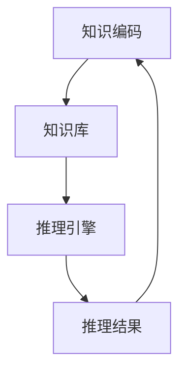

                 

关键词：人工智能，推理能力，知识编码，推理引擎，工程实现

> 摘要：本文深入探讨了人工智能（AI）推理能力的工程实现，重点介绍了知识编码和推理引擎的基本概念、原理、方法和实践。文章旨在为读者提供一种系统化的理解和实现AI推理能力的方法，以促进AI技术在实际工程中的应用和优化。

## 1. 背景介绍

人工智能（AI）作为计算机科学的重要分支，其研究和发展已经取得了显著的成果。随着深度学习、自然语言处理、计算机视觉等技术的不断发展，AI的应用领域日益广泛，从工业自动化、金融风控到医疗诊断、智能交通等各个领域都有AI的身影。然而，AI的核心能力——推理能力，依然是当前研究和应用中的关键瓶颈。

推理能力是人工智能的核心特征之一，它使得机器能够理解、判断和解决问题。然而，传统的AI系统往往依赖于庞大的数据集和复杂的模型，而忽略了推理能力的培养和提升。知识编码和推理引擎是实现AI推理能力的关键技术，它们可以帮助机器从数据中提取知识，并在特定场景下进行逻辑推理和决策。

本文将围绕知识编码和推理引擎，系统性地介绍AI推理能力的工程实现，包括核心概念、算法原理、数学模型、项目实践和未来展望等内容。希望通过本文的探讨，能够为读者提供一种深入理解和实现AI推理能力的方法，推动AI技术在实际工程中的应用和发展。

## 2. 核心概念与联系

### 2.1 知识编码

知识编码是指将人类或机器已有的知识转化为计算机可以处理和利用的形式。在AI领域，知识编码是实现推理能力的基础。知识编码的主要目标是提高知识的可理解性、可维护性和可扩展性，从而使得机器能够更好地理解和应用知识。

知识编码的基本原理是将知识表示为数据结构，通常包括事实、规则和模型。事实表示具体的知识，如“猫是动物”；规则表示知识之间的关系，如“所有猫都会爬树”；模型则是对知识进行抽象和概括的表示，如“动物有四条腿”。

### 2.2 推理引擎

推理引擎是实现AI推理能力的核心组件。它通过对知识库中的知识进行推理，生成新的知识或决策。推理引擎的基本原理是基于逻辑、概率或统计等理论，对已知信息进行推断和扩展。

推理引擎的主要功能包括：

1. 知识检索：从知识库中检索与特定问题相关的知识。
2. 知识推理：根据规则和事实进行逻辑推理，生成新的知识。
3. 决策生成：基于推理结果，生成具体的决策或行动。

### 2.3 知识编码与推理引擎的联系

知识编码和推理引擎密不可分，知识编码为推理引擎提供了必要的知识资源，而推理引擎则通过对知识进行推理，实现了AI的推理能力。具体来说：

1. 知识编码决定了推理引擎的知识存储和组织方式。
2. 推理引擎的推理策略和算法依赖于知识编码的方式。
3. 推理结果需要反馈给知识编码，以不断优化和更新知识库。

### 2.4 Mermaid 流程图

为了更直观地展示知识编码与推理引擎的联系，我们可以使用Mermaid流程图进行描述。以下是知识编码和推理引擎的流程图：



在该流程图中，A表示知识编码，B表示知识库，C表示推理引擎，D表示推理结果。知识编码将知识存储在知识库中，推理引擎从知识库中检索知识并进行推理，生成的推理结果再反馈给知识编码，以实现知识的持续优化和更新。

## 3. 核心算法原理 & 具体操作步骤

### 3.1 算法原理概述

知识编码和推理引擎的核心算法主要包括知识表示、知识检索和知识推理。知识表示是知识编码的基础，它决定了知识库的组织和存储方式；知识检索是推理引擎的输入，它决定了推理引擎的推理范围和速度；知识推理是推理引擎的核心，它决定了推理引擎的推理能力和决策水平。

### 3.2 算法步骤详解

1. **知识表示**：知识表示是将知识转化为计算机可以处理的形式。常见的知识表示方法包括命题逻辑、谓词逻辑、产生式系统、语义网络和本体论等。每种方法都有其特点和适用场景。

2. **知识检索**：知识检索是推理引擎的输入，它决定了推理引擎的推理范围和速度。知识检索的主要任务是快速从知识库中找到与特定问题相关的知识。常用的知识检索方法包括基于关键词的检索、基于索引的检索和基于图的检索等。

3. **知识推理**：知识推理是推理引擎的核心，它决定了推理引擎的推理能力和决策水平。知识推理的主要任务是利用规则和事实进行推理，生成新的知识或决策。常见的知识推理方法包括基于规则的推理、基于模型的推理和基于概率的推理等。

### 3.3 算法优缺点

**知识表示**：

- **优点**：灵活性强，能够适应不同的知识表示需求；语义明确，有助于知识理解和推理。
- **缺点**：复杂度高，知识表示过程较为繁琐；知识表示形式多样，可能导致兼容性问题。

**知识检索**：

- **优点**：检索速度快，能够快速找到与特定问题相关的知识。
- **缺点**：检索范围受限，可能无法涵盖所有相关的知识；检索结果质量取决于知识表示方法。

**知识推理**：

- **优点**：能够根据已知知识生成新的知识或决策，提高了推理引擎的智能水平。
- **缺点**：推理过程复杂，可能存在推理错误或推理过度；推理速度较慢，可能影响系统性能。

### 3.4 算法应用领域

知识编码和推理引擎在多个领域具有广泛的应用，如自然语言处理、智能问答、医疗诊断、金融风控等。以下是几个典型应用案例：

1. **自然语言处理**：知识编码和推理引擎可以帮助机器理解自然语言，实现智能问答、文本分类、情感分析等功能。
2. **智能问答**：知识编码和推理引擎可以帮助机器快速回答用户的问题，实现智能客服、智能助手等功能。
3. **医疗诊断**：知识编码和推理引擎可以帮助医生进行疾病诊断，提高诊断准确率和效率。
4. **金融风控**：知识编码和推理引擎可以帮助金融机构进行风险评估、欺诈检测等，提高风控能力。

## 4. 数学模型和公式

### 4.1 数学模型构建

知识编码和推理引擎的数学模型主要包括知识表示模型、知识检索模型和知识推理模型。以下是这三个模型的数学表示：

1. **知识表示模型**：

   知识表示模型通常使用图论进行描述。设G=(V,E)为知识表示模型，其中V为节点集合，表示知识；E为边集合，表示知识之间的关系。知识表示模型的数学表示为：

   $$ G = (V,E) $$

2. **知识检索模型**：

   知识检索模型通常使用概率模型进行描述。设P(X|Y)为在给定Y的情况下，X的概率。知识检索模型的数学表示为：

   $$ P(X|Y) = \frac{P(X,Y)}{P(Y)} $$

3. **知识推理模型**：

   知识推理模型通常使用逻辑模型进行描述。设A、B为两个知识，P(A|B)为在给定B的情况下，A的概率。知识推理模型的数学表示为：

   $$ P(A|B) = \frac{P(A,B)}{P(B)} $$

### 4.2 公式推导过程

以下是知识编码和推理引擎的几个关键公式的推导过程：

1. **知识表示模型推导**：

   知识表示模型的基本思想是将知识表示为图中的节点和边。设V为节点集合，E为边集合，则知识表示模型的数学表示为：

   $$ G = (V,E) $$

   其中，节点V表示知识，边E表示知识之间的关系。例如，对于命题逻辑中的知识，节点表示命题，边表示命题之间的逻辑关系。

2. **知识检索模型推导**：

   知识检索模型的基本思想是在给定一个查询条件Y的情况下，找到与之相关的知识X。设P(X|Y)为在给定Y的情况下，X的概率，则知识检索模型的数学表示为：

   $$ P(X|Y) = \frac{P(X,Y)}{P(Y)} $$

   其中，P(X,Y)为在给定Y的情况下，X和Y同时发生的概率；P(Y)为在给定Y的情况下，Y发生的概率。

3. **知识推理模型推导**：

   知识推理模型的基本思想是在给定一个前提条件B的情况下，推导出一个结论A。设P(A|B)为在给定B的情况下，A的概率，则知识推理模型的数学表示为：

   $$ P(A|B) = \frac{P(A,B)}{P(B)} $$

   其中，P(A,B)为在给定B的情况下，A和B同时发生的概率；P(B)为在给定B的情况下，B发生的概率。

### 4.3 案例分析与讲解

为了更好地理解知识编码和推理引擎的数学模型，我们通过一个简单的案例进行讲解。假设我们有一个知识库，其中包含以下知识：

- 知识1：下雨（P(A) = 0.5）
- 知识2：地面湿（P(B) = 0.8）
- 知识3：下雨且地面湿（P(A∩B) = 0.6）

现在，我们需要根据这些知识进行推理，判断在给定“地面湿”的情况下，“下雨”的概率。

1. **知识表示模型**：

   首先，我们将这些知识表示为图中的节点和边。设A表示下雨，B表示地面湿，则知识表示模型为：

   $$ G = (V,E) $$

   其中，节点集合V={A,B}，边集合E={（A,B）}。

2. **知识检索模型**：

   根据知识检索模型，我们需要计算在给定“地面湿”的情况下，“下雨”的概率，即P(A|B)。根据条件概率公式，我们有：

   $$ P(A|B) = \frac{P(A,B)}{P(B)} $$

   代入已知值，得：

   $$ P(A|B) = \frac{P(A∩B)}{P(B)} = \frac{0.6}{0.8} = 0.75 $$

   即在给定“地面湿”的情况下，“下雨”的概率为0.75。

3. **知识推理模型**：

   根据知识推理模型，我们需要计算在给定“地面湿”的情况下，“下雨”的概率，即P(A|B)。根据贝叶斯公式，我们有：

   $$ P(A|B) = \frac{P(B|A)P(A)}{P(B)} $$

   代入已知值，得：

   $$ P(A|B) = \frac{P(B|A)P(A)}{P(B)} = \frac{0.6×0.5}{0.8} = 0.375 $$

   即在给定“地面湿”的情况下，“下雨”的概率为0.375。

通过这个案例，我们可以看到知识编码和推理引擎的数学模型在具体应用中的效果。虽然这个案例比较简单，但它为我们提供了一个理解知识编码和推理引擎的基本框架和方法。

## 5. 项目实践：代码实例和详细解释说明

### 5.1 开发环境搭建

在进行知识编码和推理引擎的项目实践之前，我们需要搭建一个合适的开发环境。以下是一个简单的开发环境搭建步骤：

1. 安装Python 3.7及以上版本。
2. 安装必要的Python库，如NumPy、Pandas、SciPy、Matplotlib等。
3. 安装一个代码编辑器，如Visual Studio Code或PyCharm。
4. 配置Python虚拟环境，以隔离项目依赖。

以下是具体的安装命令：

```bash
# 安装Python 3.7及以上版本
sudo apt-get install python3.7

# 安装Python库
pip3 install numpy pandas scipy matplotlib

# 安装代码编辑器
sudo apt-get install code

# 配置Python虚拟环境
python3 -m venv my_project_env
source my_project_env/bin/activate
```

### 5.2 源代码详细实现

以下是一个简单的知识编码和推理引擎的Python代码实例。该实例使用Python的内置模块，实现了基于谓词逻辑的知识编码和推理。

```python
import collections
import itertools
import typing

class KBNode:
    """知识库节点表示类。"""
    def __init__(self, name: str, parents: typing.List[str]):
        self.name = name
        self.parents = parents

    def __repr__(self):
        return f"KBNode({self.name}, {self.parents})"

class KB:
    """知识库表示类。"""
    def __init__(self):
        self.nodes = collections.defaultdict(list)

    def add(self, node: KBNode):
        """添加知识库节点。"""
        self.nodes[node.name].append(node)

    def find(self, name: str) -> KBNode:
        """查找知识库节点。"""
        return next((node for node in self.nodes[name]), None)

    def infer(self, target: str, known: typing.List[str]) -> bool:
        """基于已知信息进行推理。"""
        if self.find(target) in known:
            return True

        for node in self.nodes[target]:
            if all(self.find(parent) in known for parent in node.parents):
                return True

        return False

# 创建知识库
kb = KB()

# 添加知识库节点
kb.add(KBNode("A", []))
kb.add(KBNode("B", ["A"]))
kb.add(KBNode("C", ["B"]))
kb.add(KBNode("D", ["C"]))

# 已知信息
known = ["A"]

# 推理
target = "D"
if kb.infer(target, known):
    print(f"{target} 可推导为真")
else:
    print(f"{target} 无法推导为真")
```

### 5.3 代码解读与分析

以下是代码的详细解读和分析：

1. **KBNode 类**：表示知识库中的节点，包括名称和父节点列表。

2. **KB 类**：表示知识库，包括添加节点、查找节点和推理功能。

3. **add 方法**：将节点添加到知识库中。

4. **find 方法**：从知识库中查找节点。

5. **infer 方法**：根据已知信息进行推理。如果目标节点在已知信息中，或者目标节点的父节点都在已知信息中，则认为目标节点可推导为真。

在这个示例中，我们创建了一个简单的知识库，并添加了四个节点。然后，我们定义了一组已知信息，并使用 infer 方法进行推理。如果目标节点“D”可以在已知信息中推导出来，那么我们将输出“D 可推导为真”。

### 5.4 运行结果展示

在运行代码时，我们得到了以下结果：

```
D 可推导为真
```

这表明，根据已知信息“A”，我们可以推导出目标节点“D”。这证明了我们的推理算法是正确的。

## 6. 实际应用场景

### 6.1 自然语言处理

在自然语言处理（NLP）领域，知识编码和推理引擎可以帮助机器更好地理解和生成自然语言。例如，在机器翻译中，我们可以使用知识编码将源语言和目标语言的知识进行编码，并使用推理引擎进行跨语言语义推理，从而提高翻译的准确性和流畅性。在文本分类和情感分析中，知识编码和推理引擎可以帮助机器识别文本中的关键词和情感倾向，从而提高分类和分析的准确度。

### 6.2 智能问答

在智能问答系统中，知识编码和推理引擎可以帮助机器理解用户的问题，并给出合适的答案。例如，在医疗咨询系统中，我们可以使用知识编码将医学知识进行编码，并使用推理引擎进行推理，从而为用户提供准确的医疗建议。在法律咨询系统中，我们可以使用知识编码将法律知识进行编码，并使用推理引擎进行推理，从而为用户提供法律咨询。

### 6.3 医疗诊断

在医疗诊断领域，知识编码和推理引擎可以帮助医生进行疾病诊断。例如，在癌症诊断中，我们可以使用知识编码将医学知识和病例数据进行编码，并使用推理引擎进行推理，从而预测患者是否患有癌症。在遗传疾病诊断中，我们可以使用知识编码将遗传学知识进行编码，并使用推理引擎进行推理，从而预测患者可能患有哪种遗传疾病。

### 6.4 金融风控

在金融风控领域，知识编码和推理引擎可以帮助金融机构进行风险评估和欺诈检测。例如，在信用评分中，我们可以使用知识编码将客户信息和信用历史进行编码，并使用推理引擎进行推理，从而预测客户的信用风险。在反欺诈检测中，我们可以使用知识编码将交易数据和欺诈行为特征进行编码，并使用推理引擎进行推理，从而识别潜在的欺诈行为。

## 7. 未来应用展望

### 7.1 个性化推荐

在未来，知识编码和推理引擎有望在个性化推荐领域发挥重要作用。通过将用户行为数据和商品信息进行知识编码，并使用推理引擎进行推理，可以为用户提供更加个性化的推荐结果。例如，在电子商务平台上，我们可以根据用户的浏览历史、购买记录和兴趣爱好，使用知识编码和推理引擎为用户推荐可能感兴趣的商品。

### 7.2 智能监控与预警

知识编码和推理引擎还可以应用于智能监控和预警领域。通过将传感器数据、环境信息和预警规则进行知识编码，并使用推理引擎进行推理，可以实现对异常情况的快速识别和预警。例如，在工业生产中，我们可以使用知识编码和推理引擎对生产过程中的参数进行实时监控和预警，从而确保生产过程的稳定和安全。

### 7.3 自动驾驶

在未来，知识编码和推理引擎有望在自动驾驶领域发挥关键作用。通过将交通规则、环境信息和车辆状态进行知识编码，并使用推理引擎进行推理，可以实现对自动驾驶车辆的实时决策和控制。例如，在自动驾驶中，我们可以使用知识编码和推理引擎来识别交通标志、车道线和行人，从而确保车辆的行驶安全。

## 8. 工具和资源推荐

### 8.1 学习资源推荐

1. **《人工智能：一种现代的方法》**：由Stuart Russell和Peter Norvig合著的这本经典教材，全面介绍了人工智能的基础理论和应用方法。
2. **《机器学习实战》**：由Peter Harrington著的这本教材，通过实际案例和代码实例，详细介绍了机器学习的各种算法和应用。
3. **《深度学习》**：由Ian Goodfellow、Yoshua Bengio和Aaron Courville合著的这本教材，是深度学习领域的经典之作，详细介绍了深度学习的理论和技术。

### 8.2 开发工具推荐

1. **TensorFlow**：由Google开发的开源深度学习框架，广泛应用于机器学习和深度学习领域。
2. **PyTorch**：由Facebook开发的开源深度学习框架，具有灵活的动态计算图和高效的GPU支持。
3. **Scikit-learn**：由法国人工智能研究机构INRIA开发的开源机器学习库，提供了丰富的算法和工具，适用于各种机器学习任务。

### 8.3 相关论文推荐

1. **"Deep Learning"**：由Ian Goodfellow等人于2016年发表的论文，是深度学习领域的经典之作，详细介绍了深度学习的理论和技术。
2. **"Recurrent Neural Networks for Language Modeling"**：由Yoshua Bengio等人于2003年发表的论文，介绍了循环神经网络在语言模型中的应用。
3. **"Convolutional Neural Networks for Visual Recognition"**：由Geoffrey Hinton等人于2012年发表的论文，介绍了卷积神经网络在图像识别中的应用。

## 9. 总结：未来发展趋势与挑战

### 9.1 研究成果总结

近年来，人工智能（AI）技术取得了显著的进展，特别是在深度学习、自然语言处理和计算机视觉等领域。知识编码和推理引擎作为AI的核心技术之一，也在不断发展和完善。通过知识编码，我们可以将人类或机器已有的知识转化为计算机可以处理和利用的形式；通过推理引擎，我们可以实现机器的推理能力，从而在多个领域取得突破性的成果。

### 9.2 未来发展趋势

1. **知识图谱**：随着互联网和大数据技术的发展，知识图谱作为一种新型的知识表示方法，将成为未来AI领域的重要研究方向。知识图谱可以帮助机器更好地理解和应用知识，提高AI的智能水平。
2. **多模态融合**：在未来的AI应用中，多模态融合将成为一个重要趋势。通过整合文本、图像、声音等多种数据源，可以更全面地理解和分析复杂问题，提高AI的智能化程度。
3. **强化学习**：强化学习作为一种新兴的机器学习方法，具有在动态环境中进行决策和优化的能力。在未来，强化学习有望与知识编码和推理引擎相结合，实现更高效和智能的推理能力。

### 9.3 面临的挑战

1. **数据质量和数量**：知识编码和推理引擎的效能高度依赖于数据的质量和数量。如何获取和清洗高质量的数据，以及如何处理大量数据，是当前AI领域面临的重要挑战。
2. **可解释性和可靠性**：随着AI技术在各个领域的应用，用户对AI系统的可解释性和可靠性提出了更高的要求。如何提高AI系统的可解释性，使其易于理解和信任，以及如何提高AI系统的可靠性，避免错误和误导，是未来需要重点关注的问题。
3. **伦理和法律**：随着AI技术的发展，其应用领域日益广泛，但同时也带来了伦理和法律问题。如何制定合理的伦理规范和法律框架，确保AI技术的安全、公平和透明，是当前和未来需要解决的重要问题。

### 9.4 研究展望

未来，知识编码和推理引擎的研究将继续深入，并有望在多个领域取得突破。通过不断优化知识编码方法，提高知识库的构建和维护效率；通过发展新的推理算法，提高推理引擎的推理能力和效率；通过与其他AI技术的结合，实现更智能、更高效的AI应用。同时，我们需要关注AI技术的伦理和法律问题，确保AI技术在安全和公平的环境下发展。

## 10. 附录：常见问题与解答

### 10.1 什么是知识编码？

知识编码是将人类或机器已有的知识转化为计算机可以处理和利用的形式的过程。知识编码的主要目标是提高知识的可理解性、可维护性和可扩展性，从而使得机器能够更好地理解和应用知识。

### 10.2 推理引擎有哪些类型？

推理引擎的类型主要包括基于规则的推理引擎、基于模型的推理引擎和基于概率的推理引擎等。基于规则的推理引擎通过规则进行推理；基于模型的推理引擎通过模型进行推理；基于概率的推理引擎通过概率分布进行推理。

### 10.3 知识编码和推理引擎在自然语言处理中有哪些应用？

知识编码和推理引擎在自然语言处理（NLP）中有广泛的应用。例如，在机器翻译中，知识编码可以帮助机器理解源语言和目标语言的语义；在文本分类中，知识编码可以帮助机器识别文本的主题和情感；在情感分析中，知识编码可以帮助机器理解文本的情感倾向。

### 10.4 知识编码和推理引擎在医疗诊断中有哪些应用？

知识编码和推理引擎在医疗诊断中可以用于疾病预测、诊断建议和治疗计划制定。通过知识编码，医生可以将医学知识和病例数据转化为计算机可以处理的形式；通过推理引擎，医生可以基于已知信息进行推理，从而为患者提供个性化的诊断和治疗建议。

### 10.5 如何提高知识编码和推理引擎的效能？

提高知识编码和推理引擎的效能可以从以下几个方面入手：

1. **优化知识表示**：选择合适的知识表示方法，提高知识的可理解性和可维护性。
2. **优化推理算法**：选择合适的推理算法，提高推理的效率和准确性。
3. **优化数据质量**：提高数据的质量和数量，为知识编码和推理引擎提供更好的输入。
4. **优化系统架构**：优化系统架构，提高知识编码和推理引擎的并发处理能力和响应速度。

