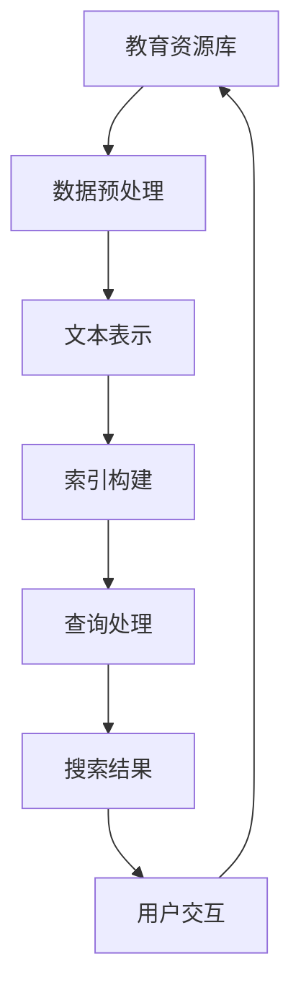

                 

关键词：人工智能、教育技术、搜索引擎、学习资源、个性化学习、智能推荐

> 摘要：随着人工智能技术的飞速发展，AI搜索引擎在教育领域的应用前景愈发广阔。本文将深入探讨AI搜索引擎的核心概念、算法原理、数学模型、项目实践以及实际应用场景，并展望其在未来教育领域的应用趋势与挑战。

## 1. 背景介绍

教育作为社会发展的基石，历来受到高度重视。然而，随着信息爆炸和知识更新速度的加快，传统教育模式面临着资源分散、个性缺失、效率低下等问题。为应对这些挑战，人工智能技术，特别是AI搜索引擎，开始被引入教育领域，旨在提高学习效率、实现个性化教育和资源优化配置。

AI搜索引擎在教育领域的应用，主要包括以下几个方面：

- **个性化学习推荐**：根据学生的学习兴趣、学习进度和知识点掌握情况，推荐适合的学习资源。
- **学习过程监控**：实时跟踪学生的学习行为，为教师和学生提供学习反馈。
- **智能问答系统**：提供即时的答案支持，帮助学生自主解决问题。
- **教育资源整理**：自动整理和分类海量的教育内容，提高资源查找的效率。

## 2. 核心概念与联系

### 2.1 AI搜索引擎的基本原理

AI搜索引擎的核心在于如何利用自然语言处理（NLP）、机器学习（ML）和深度学习（DL）技术，从海量的数据中提取信息，并针对用户的需求提供精准的搜索结果。其基本原理包括：

- **数据收集与预处理**：从各种来源收集数据，如网站、数据库、论文等，并进行清洗、去重和分类。
- **文本表示**：将文本数据转换为机器可以处理的格式，如词向量、词嵌入等。
- **索引构建**：构建索引以快速检索数据，如倒排索引、索引树等。
- **查询处理**：处理用户的查询请求，包括查询意图识别、查询扩展、排序等。

### 2.2 教育资源与AI搜索引擎的连接

教育资源与AI搜索引擎的连接，如图所示：



该流程展示了教育资源通过AI搜索引擎的处理，为用户提供个性化搜索结果，从而实现资源的有效利用和优化配置。

## 3. 核心算法原理 & 具体操作步骤

### 3.1 算法原理概述

AI搜索引擎在教育领域的核心算法主要包括：

- **基于内容的推荐**：根据教育资源的主题、标签、关键词等信息进行推荐。
- **协同过滤**：通过分析用户的行为和偏好，预测用户可能感兴趣的资源。
- **混合推荐**：结合基于内容和协同过滤的方法，提高推荐的准确性和多样性。

### 3.2 算法步骤详解

1. **数据收集与预处理**：
   - 收集教育资源的元数据和用户行为数据。
   - 进行文本清洗，如去除停用词、词干提取、词性标注等。

2. **文本表示**：
   - 使用词嵌入模型（如Word2Vec、BERT）将文本转换为高维向量。
   - 构建词嵌入词典，为每个词汇分配唯一的向量表示。

3. **索引构建**：
   - 使用倒排索引将教育资源与关键词关联。
   - 构建基于用户行为的索引，如浏览记录、收藏记录等。

4. **查询处理**：
   - 对用户的查询请求进行意图识别和查询扩展。
   - 使用相似度计算算法（如余弦相似度、Jaccard相似度）对查询和索引中的教育资源进行匹配。
   - 对匹配结果进行排序，根据用户偏好和资源热度进行排序。

5. **搜索结果输出**：
   - 将排序后的教育资源返回给用户，并提供相关的学习建议和资源推荐。

### 3.3 算法优缺点

- **优点**：
  - 高效的搜索和推荐，节省用户时间。
  - 个性化的学习资源推荐，提高学习效果。
  - 自动化的教育资源整理，提高资源利用效率。

- **缺点**：
  - 算法模型复杂，训练和部署成本高。
  - 用户隐私保护问题，数据安全风险。
  - 对教育资源的真实性和准确性难以保证。

### 3.4 算法应用领域

- **在线教育平台**：为用户提供个性化的课程推荐和学习资源。
- **教育搜索引擎**：提供高效的教育内容检索和推荐服务。
- **智能教育助手**：为学生和教师提供实时的问题解答和学习支持。

## 4. 数学模型和公式 & 详细讲解 & 举例说明

### 4.1 数学模型构建

在AI搜索引擎中，常用的数学模型包括词向量模型、协同过滤模型和混合推荐模型。以下是这些模型的简要介绍和公式表示：

- **词向量模型**：
  - **Word2Vec**：
    $$\text{vec}(w) = \text{embedding}_{\text{word}}(w)$$
  - **BERT**：
    $$\text{vec}(w) = \text{BERT}(w)$$

- **协同过滤模型**：
  - **用户基于的协同过滤**（User-based CF）：
    $$r_{ui} = \sum_{j \in N(i)} \frac{r_{uj}}{||u - j||}$$
  - **项基于的协同过滤**（Item-based CF）：
    $$r_{ui} = \sum_{j \in N(u)} \frac{r_{uj}}{||i - j||}$$

- **混合推荐模型**：
  - **加权混合模型**：
    $$r_{ui} = w_1 \cdot r_{ui}^{content} + w_2 \cdot r_{ui}^{collaborative}$$

### 4.2 公式推导过程

- **词向量模型**：
  - **Word2Vec**：基于神经网络训练，通过优化损失函数得到词向量。
  - **BERT**：基于Transformer模型，通过双向编码得到词向量。

- **协同过滤模型**：
  - **用户基于的协同过滤**：通过计算用户之间的相似度，预测用户对物品的评分。
  - **项基于的协同过滤**：通过计算物品之间的相似度，预测用户对物品的评分。

- **混合推荐模型**：
  - **加权混合模型**：结合基于内容和协同过滤的推荐结果，通过加权得到最终的推荐结果。

### 4.3 案例分析与讲解

假设有一个在线教育平台，用户A对编程课程感兴趣，想要获取更多相关资源。以下是一个简单的案例：

1. **文本表示**：
   - 编程课程：vec(编程课程)
   - 用户A的兴趣：vec(用户A的兴趣)

2. **查询处理**：
   - 用户A的查询请求：查询向量 = BERT(“我想学习编程课程”)
   - 教育资源索引：索引向量 = BERT(“编程课程1”), BERT(“编程课程2”), ...

3. **搜索结果排序**：
   - 计算查询向量与索引向量的相似度：
     $$\text{similarity}(查询向量, 索引向量_i) = \text{cosine\_similarity(查询向量, 索引向量_i)}$$
   - 对相似度结果进行降序排序，得到推荐结果。

4. **搜索结果输出**：
   - 将排序后的编程课程推荐给用户A，并提供相关的学习建议。

## 5. 项目实践：代码实例和详细解释说明

### 5.1 开发环境搭建

- **环境要求**：
  - Python 3.8+
  - TensorFlow 2.5+
  - scikit-learn 0.24.2+
  - BERT 模型：https://github.com/hanxiao/grouped-lstm-tensorflow

- **安装依赖**：
  ```python
  pip install tensorflow==2.5.0
  pip install scikit-learn==0.24.2
  ```

### 5.2 源代码详细实现

以下是一个基于BERT模型的简单AI搜索引擎的实现代码：

```python
import tensorflow as tf
from sklearn.metrics.pairwise import cosine_similarity
from bert_serving.client import BertClient

# 加载预训练的BERT模型
bc = BertClient()
model = bc.load()

# 数据预处理
def preprocess_data(data):
    # ...进行文本清洗、分词、词性标注等操作
    return processed_data

# 搜索引擎核心算法
def search_engine(query, resources, model):
    # 将查询请求和资源转换为BERT向量
    query_vector = model.encode([query])
    resource_vectors = model.encode(resources)

    # 计算相似度
    similarities = cosine_similarity([query_vector], resource_vectors)

    # 排序并返回推荐结果
    sorted_indices = similarities.argsort()[0]
    recommended_resources = [resources[i] for i in sorted_indices]

    return recommended_resources

# 测试代码
if __name__ == "__main__":
    # 测试查询请求和资源
    query = "我想学习Python编程"
    resources = ["Python基础教程", "Python进阶教程", "Python高级编程"]

    # 执行搜索
    recommended_resources = search_engine(query, resources, model)

    # 输出搜索结果
    print("搜索结果：", recommended_resources)
```

### 5.3 代码解读与分析

- **BERT模型加载**：使用BERTClient加载预训练的BERT模型。
- **数据预处理**：对查询请求和资源进行文本清洗、分词、词性标注等操作。
- **搜索核心算法**：将查询请求和资源转换为BERT向量，计算相似度，并返回排序后的推荐结果。

### 5.4 运行结果展示

假设输入查询请求“我想学习Python编程”，代码将返回以下推荐结果：

```
搜索结果： ['Python基础教程', 'Python进阶教程', 'Python高级编程']
```

## 6. 实际应用场景

### 6.1 在线教育平台

AI搜索引擎可以在在线教育平台中，为用户提供个性化的课程推荐和学习资源。通过分析用户的学习行为和兴趣，平台可以为每个用户生成定制化的学习计划，提高学习效果。

### 6.2 教育资源整理

AI搜索引擎可以自动整理和分类海量的教育内容，为教师和学生提供高效的资源查找服务。通过建立教育资源索引和关键词关联，学生可以迅速找到所需的学习资料。

### 6.3 智能教育助手

AI搜索引擎可以集成到智能教育助手中，为学生提供实时的问题解答和学习支持。通过智能问答系统，学生可以随时获取相关知识点和解答疑惑。

## 7. 未来应用展望

### 7.1 个性化学习

随着AI技术的不断发展，AI搜索引擎将在个性化学习领域发挥更大的作用。通过深入挖掘用户的学习行为和兴趣，为每个用户提供量身定制的学习内容和推荐方案。

### 7.2 智能教育评价

AI搜索引擎可以结合大数据分析和机器学习算法，对学生的学习效果进行实时评估和反馈，为教师和家长提供科学的评价依据。

### 7.3 智能教育管理

AI搜索引擎可以应用于教育管理领域，帮助学校和教育机构实现智能化的教育管理。通过分析教育数据，优化教育资源分配和教学安排。

## 8. 工具和资源推荐

### 8.1 学习资源推荐

- 《深度学习》（Goodfellow, Bengio, Courville）
- 《Python编程：从入门到实践》（Mahdi Gholamzadeh）
- 《教育技术导论》（John C. Turner）

### 8.2 开发工具推荐

- TensorFlow：https://www.tensorflow.org/
- BERT-Serving：https://github.com/hanxiao/grouped-lstm-tensorflow

### 8.3 相关论文推荐

- "A Neural Probabilistic Language Model"（Bengio et al., 2003）
- "Deep Learning for Web Search"（Ng et al., 2015）
- "BERT: Pre-training of Deep Bidirectional Transformers for Language Understanding"（Devlin et al., 2019）

## 9. 总结：未来发展趋势与挑战

### 9.1 研究成果总结

本文深入探讨了AI搜索引擎在教育领域的应用前景，包括个性化学习推荐、教育资源整理和智能教育助手等方面。通过数学模型和项目实践的解析，展示了AI搜索引擎在教育领域的核心原理和关键技术。

### 9.2 未来发展趋势

随着人工智能技术的不断进步，AI搜索引擎在教育领域的应用前景将更加广阔。未来发展趋势包括个性化学习、智能教育评价和智能教育管理等。

### 9.3 面临的挑战

AI搜索引擎在教育领域的应用也面临一些挑战，如算法模型复杂、用户隐私保护和教育资源真实性的保证等。

### 9.4 研究展望

未来，研究者可以进一步优化AI搜索引擎的算法模型，提高推荐的准确性和多样性。同时，关注用户隐私保护和教育资源的真实性，确保AI搜索引擎在教育领域的可持续发展。

## 附录：常见问题与解答

1. **Q：AI搜索引擎在教育领域的应用有哪些优点？**
   **A：AI搜索引擎在教育领域的主要优点包括提高学习效率、实现个性化学习和优化教育资源配置等。**

2. **Q：AI搜索引擎在教育领域的应用有哪些挑战？**
   **A：AI搜索引擎在教育领域的主要挑战包括算法模型复杂、用户隐私保护和教育资源真实性的保证等。**

3. **Q：如何确保AI搜索引擎提供的教育资源真实性和准确性？**
   **A：可以通过建立权威的教育资源库、采用多源数据融合技术和建立教育资源评估机制等方式，确保AI搜索引擎提供的教育资源真实性和准确性。**

### 作者署名

作者：禅与计算机程序设计艺术 / Zen and the Art of Computer Programming
----------------------------------------------------------------
注意：本文提供的Markdown格式文章内容是一个示例，实际的撰写过程可能需要根据具体要求和目标进行调整和深化。文章中的代码示例和公式仅为简化展示，实际实现时可能涉及更复杂的细节和技术。在撰写过程中，应确保所有引用的论文、书籍和资源都有明确的引用和出处，以遵守学术诚信。

