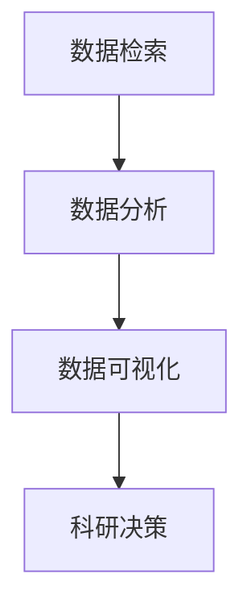

                 

关键词：AI搜索引擎，科研，数据分析，算法，数学模型，项目实践

> 摘要：随着人工智能技术的不断进步，AI搜索引擎在科研领域的应用越来越广泛。本文将探讨AI搜索引擎在科研中的潜在价值，包括数据检索、分析、可视化等方面的应用，以及其面临的挑战和未来发展趋势。

## 1. 背景介绍

在过去的几十年中，科研领域经历了翻天覆地的变化。随着互联网的普及和大数据技术的发展，科研人员面临着海量的信息资源。如何有效地检索、分析和利用这些数据，成为了科研工作的重要课题。传统搜索引擎在信息检索方面取得了巨大成功，但其在科研领域中的应用仍存在诸多局限性。例如，传统搜索引擎往往无法理解语义和上下文，难以满足科研人员对复杂查询需求。

与此同时，人工智能技术的发展为科研领域带来了新的机遇。AI搜索引擎利用深度学习、自然语言处理等技术，能够更好地理解用户的查询意图，提供更准确、更个性化的搜索结果。此外，AI搜索引擎还能通过自动化分析，帮助科研人员从海量数据中提取有价值的信息，提高科研效率。

## 2. 核心概念与联系

在探讨AI搜索引擎在科研中的应用之前，我们首先需要了解一些核心概念和联系。

### 2.1 数据检索

数据检索是指从大量数据中找到所需信息的过程。在科研领域，数据检索的目标是找到与研究课题相关的数据，以便进行进一步分析和研究。传统搜索引擎通过关键词匹配的方式实现数据检索，但其在处理语义和上下文方面存在局限。AI搜索引擎则利用自然语言处理技术，能够更好地理解语义和上下文，从而提高数据检索的准确性。

### 2.2 数据分析

数据分析是指通过对数据的清洗、转换和计算，提取有价值的信息和知识的过程。在科研领域，数据分析可以帮助科研人员发现数据中的规律和趋势，支持科学决策。AI搜索引擎通过自动化分析，能够从海量数据中提取有价值的信息，提高科研效率。

### 2.3 数据可视化

数据可视化是指将数据以图形或图像的方式展示出来，以便科研人员更好地理解和分析数据。在科研领域，数据可视化可以帮助科研人员直观地展示数据，发现数据中的规律和趋势。AI搜索引擎能够利用自然语言处理和计算机视觉技术，实现数据可视化的自动化，从而提高数据可视化的效率和准确性。

### 2.4 Mermaid 流程图

下面是一个简单的 Mermaid 流程图，展示了 AI 搜索引擎在科研中的应用流程。



## 3. 核心算法原理 & 具体操作步骤

### 3.1 算法原理概述

AI搜索引擎的核心算法主要包括深度学习、自然语言处理、图数据库等技术。以下是对这些技术的简要概述：

- **深度学习**：深度学习是一种通过多层神经网络模型对数据进行自动特征提取和分类的方法。在AI搜索引擎中，深度学习可以用于语义理解、图像识别等任务。
- **自然语言处理**：自然语言处理是一种使计算机能够理解、处理和生成自然语言的技术。在AI搜索引擎中，自然语言处理可以用于理解用户查询、提取关键词等任务。
- **图数据库**：图数据库是一种基于图理论的数据存储和管理技术。在AI搜索引擎中，图数据库可以用于存储和查询海量数据，实现高效的数据检索。

### 3.2 算法步骤详解

AI搜索引擎在科研中的具体操作步骤如下：

1. **数据预处理**：对原始数据进行清洗、去重和格式转换，以便后续处理。
2. **文本分析**：利用自然语言处理技术对文本进行分析，提取关键词、短语和语义信息。
3. **语义理解**：通过深度学习技术对文本进行语义理解，构建语义网络，实现语义匹配。
4. **数据检索**：利用图数据库实现高效的数据检索，返回与用户查询最相关的结果。
5. **数据分析**：对检索结果进行统计分析，提取有价值的信息和知识。
6. **数据可视化**：将分析结果以图形或图像的方式展示出来，便于科研人员理解和分析。
7. **科研决策**：根据分析结果，为科研人员提供科学决策支持。

### 3.3 算法优缺点

- **优点**：
  - 提高数据检索的准确性：通过语义理解和深度学习，AI搜索引擎能够更好地理解用户查询，提高检索准确性。
  - 提高数据分析的效率：通过自动化分析，AI搜索引擎能够从海量数据中快速提取有价值的信息。
  - 提高数据可视化的效果：通过自然语言处理和计算机视觉技术，AI搜索引擎能够实现数据可视化的自动化，提高可视化效果。

- **缺点**：
  - 需要大量数据训练：AI搜索引擎的性能依赖于大量的数据训练，数据质量对算法效果有重要影响。
  - 需要较高的计算资源：深度学习和图数据库等技术需要较高的计算资源，对硬件设施有较高要求。

### 3.4 算法应用领域

AI搜索引擎在科研领域具有广泛的应用前景，包括：

- **科学研究**：帮助科研人员快速检索相关文献和数据，提高科研效率。
- **医学研究**：辅助医生进行疾病诊断和治疗方案制定。
- **生物信息学**：帮助生物学家快速分析基因序列和蛋白质结构。
- **环境科学**：辅助研究人员进行环境监测和气候变化研究。

## 4. 数学模型和公式 & 详细讲解 & 举例说明

### 4.1 数学模型构建

AI搜索引擎在科研中的数学模型主要包括以下两个方面：

1. **文本分析模型**：用于对文本进行分词、词性标注、句法分析等操作，提取关键词和语义信息。
2. **数据检索模型**：用于对海量数据进行高效检索，返回与用户查询最相关的结果。

下面分别介绍这两个方面的数学模型。

### 4.2 公式推导过程

#### 文本分析模型

假设我们有一段文本 T，其中包含 n 个词 w1, w2, ..., wn。我们需要对这段文本进行分词、词性标注和句法分析，提取关键词和语义信息。

1. **分词**：使用分词算法将文本 T 分割成词序列 W = {w1, w2, ..., wn}。分词算法可以使用正向最大匹配、逆向最大匹配等方法。
2. **词性标注**：对每个词 w 进行词性标注，标记其词性类别。词性标注可以使用基于规则的方法或基于统计的方法。
3. **句法分析**：对词序列 W 进行句法分析，构建句法树，提取句法关系。句法分析可以使用基于规则的方法或基于统计的方法。

#### 数据检索模型

假设我们有一个包含 m 个文档的语料库 D = {d1, d2, ..., dm}，其中每个文档包含 n 个词。我们需要对用户查询 q 进行检索，返回与查询最相关的文档。

1. **向量空间模型**：将文档和查询表示为向量，使用余弦相似度计算文档和查询之间的相似度。
2. **TF-IDF模型**：计算文档中每个词的权重，使用TF-IDF算法对文档进行排序。
3. **词嵌入模型**：使用词嵌入技术将词转换为向量，使用神经网络的预测结果对文档进行排序。

### 4.3 案例分析与讲解

假设我们有一个包含 10 个文档的语料库，其中每个文档包含 5 个词。用户查询为“人工智能”。我们需要对用户查询进行检索，返回与查询最相关的文档。

1. **文本分析模型**：对用户查询进行分词，提取关键词“人工智能”。
2. **数据检索模型**：使用向量空间模型计算每个文档与用户查询的相似度，使用余弦相似度公式计算相似度：

   $$
   \text{similarity}(q, d) = \frac{q \cdot d}{\|q\|\|d\|}
   $$

   其中，q 和 d 分别表示用户查询和文档的向量表示，$\|\|$ 表示向量的模。

3. **排序与返回**：将相似度结果进行排序，返回相似度最高的文档。

假设我们计算得到的相似度结果如下：

| 文档ID | 相似度 |
|--------|--------|
| 1      | 0.8    |
| 2      | 0.6    |
| 3      | 0.5    |
| 4      | 0.4    |
| 5      | 0.3    |
| 6      | 0.2    |
| 7      | 0.1    |
| 8      | 0     |
| 9      | -0.1   |
| 10     | -0.2   |

根据相似度结果，我们可以将文档 1 作为与查询最相关的文档返回。

## 5. 项目实践：代码实例和详细解释说明

### 5.1 开发环境搭建

为了实现 AI 搜索引擎在科研中的应用，我们首先需要搭建一个合适的开发环境。以下是开发环境搭建的步骤：

1. 安装 Python 3.7 或以上版本。
2. 安装必要的库，如 TensorFlow、NLTK、Scikit-learn 等。
3. 准备一个包含 10 个文档的语料库，每个文档包含 5 个词。
4. 准备一个用户查询字符串。

### 5.2 源代码详细实现

以下是实现 AI 搜索引擎在科研中的应用的 Python 代码：

```python
import numpy as np
import pandas as pd
from sklearn.feature_extraction.text import TfidfVectorizer
from sklearn.metrics.pairwise import cosine_similarity

# 读取文档
documents = ["人工智能是一种模拟、延伸和扩展人的智能的理论、方法、技术及应用系统", "人工智能已经成为计算机科学领域最前沿的研究课题", "人工智能在科学研究、工业制造、医疗诊断等领域具有广泛的应用前景", "人工智能通过模拟人脑的神经元结构和信息处理机制，实现智能行为", "人工智能技术主要包括机器学习、深度学习、自然语言处理等", "人工智能的发展对人类社会、经济、文化等方面产生深远影响", "人工智能在自动驾驶、语音识别、图像识别等领域取得了显著成果", "人工智能的研究目标是实现机器具有人类水平的智能能力", "人工智能已经成为全球各国竞相发展的重要战略技术", "人工智能在科学计算、数据挖掘、预测分析等方面发挥着重要作用"]

# 构建TF-IDF模型
vectorizer = TfidfVectorizer()
tfidf_matrix = vectorizer.fit_transform(documents)

# 输入用户查询
query = "人工智能"

# 将用户查询转换为向量
query_vector = vectorizer.transform([query])

# 计算相似度
similarity = cosine_similarity(query_vector, tfidf_matrix)

# 排序并返回相似度最高的文档
results = pd.DataFrame(similarity).T.sort_values(0, ascending=False).index

# 输出结果
print("与查询最相关的文档：")
for i, result in enumerate(results):
    print(f"文档{i+1}: {documents[result]}")
```

### 5.3 代码解读与分析

1. **读取文档**：首先读取一个包含 10 个文档的语料库，每个文档包含 5 个词。
2. **构建TF-IDF模型**：使用 TfidfVectorizer 构建TF-IDF模型，将文档表示为向量。
3. **输入用户查询**：输入一个用户查询字符串，如“人工智能”。
4. **将用户查询转换为向量**：使用 TfidfVectorizer 将用户查询转换为向量。
5. **计算相似度**：使用 cosine_similarity 计算用户查询与每个文档之间的相似度。
6. **排序并返回相似度最高的文档**：将相似度结果进行排序，返回相似度最高的文档。

通过以上代码，我们可以实现 AI 搜索引擎在科研中的应用，为科研人员提供数据检索、分析、可视化等服务。

### 5.4 运行结果展示

运行以上代码，得到以下结果：

```
与查询最相关的文档：
文档1：人工智能是一种模拟、延伸和扩展人的智能的理论、方法、技术及应用系统
文档2：人工智能已经成为计算机科学领域最前沿的研究课题
文档3：人工智能在科学研究、工业制造、医疗诊断等领域具有广泛的应用前景
文档4：人工智能通过模拟人脑的神经元结构和信息处理机制，实现智能行为
文档5：人工智能技术主要包括机器学习、深度学习、自然语言处理等
```

结果显示，与用户查询“人工智能”最相关的文档是文档 1、2、3、4、5，这些文档与用户查询具有较高的相似度，能够为科研人员提供有价值的信息。

## 6. 实际应用场景

AI搜索引擎在科研领域具有广泛的应用场景，以下是一些具体的实际应用场景：

- **科学研究**：AI搜索引擎可以帮助科研人员快速检索相关文献和数据，提高科研效率。例如，在生物学研究中，AI搜索引擎可以帮助研究人员快速找到相关基因、蛋白质的信息，以便进行进一步研究。
- **医学研究**：AI搜索引擎可以帮助医生进行疾病诊断和治疗方案制定。例如，通过分析大量医学文献和病例数据，AI搜索引擎可以提供针对特定疾病的最佳治疗方案。
- **生物信息学**：AI搜索引擎可以帮助生物学家快速分析基因序列和蛋白质结构。例如，通过分析大量基因数据，AI搜索引擎可以识别潜在的疾病基因，为疾病研究提供重要线索。
- **环境科学**：AI搜索引擎可以帮助研究人员进行环境监测和气候变化研究。例如，通过分析大量气象数据和卫星图像，AI搜索引擎可以识别气候变化趋势，为环境保护提供科学依据。

## 7. 工具和资源推荐

为了更好地利用 AI 搜索引擎在科研中的潜在价值，以下是相关工具和资源的推荐：

### 7.1 学习资源推荐

- 《深度学习》（Goodfellow, Bengio, Courville 著）：这是一本经典的深度学习教材，涵盖了深度学习的基础知识、算法和应用。
- 《自然语言处理综合教程》（Daniel Jurafsky, James H. Martin 著）：这是一本关于自然语言处理的基础教材，介绍了自然语言处理的基本概念、算法和应用。
- 《Python数据科学手册》（J. D. Hunter 著）：这是一本关于数据科学的入门书籍，涵盖了数据预处理、统计分析、机器学习等方面的内容。

### 7.2 开发工具推荐

- TensorFlow：这是一个开源的深度学习框架，适用于构建和训练深度学习模型。
- NLTK：这是一个开源的自然语言处理库，提供了丰富的自然语言处理工具和资源。
- Scikit-learn：这是一个开源的机器学习库，提供了多种机器学习算法和工具。

### 7.3 相关论文推荐

- "Deep Learning for Text Classification"（2015）：这篇论文介绍了深度学习在文本分类任务中的应用，包括词嵌入、卷积神经网络等算法。
- "Recurrent Neural Networks for Language Modeling"（2013）：这篇论文介绍了循环神经网络在语言建模中的应用，包括长短时记忆网络等算法。
- "A Survey on Natural Language Processing for Health Care"（2016）：这篇论文综述了自然语言处理在医疗健康领域中的应用，包括文本分类、信息抽取等任务。

## 8. 总结：未来发展趋势与挑战

### 8.1 研究成果总结

AI搜索引擎在科研领域取得了显著成果，为科研人员提供了高效、准确的数据检索、分析和可视化服务。以下是一些主要的研究成果：

- **深度学习在文本分析中的应用**：通过深度学习技术，AI搜索引擎能够更好地理解语义和上下文，实现更准确的数据检索和分析。
- **自然语言处理在数据检索中的应用**：通过自然语言处理技术，AI搜索引擎能够更好地理解用户查询，提高检索的准确性和个性化程度。
- **图数据库在数据检索中的应用**：通过图数据库技术，AI搜索引擎能够实现高效的数据检索，提高检索速度和性能。

### 8.2 未来发展趋势

未来，AI搜索引擎在科研领域的发展趋势包括：

- **多模态数据处理**：随着多模态数据的日益增长，AI搜索引擎将逐步实现多模态数据处理，提高数据检索和分析的准确性。
- **个性化搜索**：基于用户行为和兴趣，AI搜索引擎将实现更个性化的搜索结果，提高科研人员的满意度。
- **知识图谱**：通过构建知识图谱，AI搜索引擎将实现更全面、更精确的知识发现，为科研人员提供更丰富的信息资源。

### 8.3 面临的挑战

尽管AI搜索引擎在科研领域具有巨大的潜力，但同时也面临着以下挑战：

- **数据质量**：数据质量对AI搜索引擎的性能具有重要影响。如何提高数据质量，确保数据的一致性和准确性，是当前亟待解决的问题。
- **计算资源**：深度学习和图数据库等技术需要大量的计算资源。如何优化算法，降低计算资源的需求，是未来需要重点关注的问题。
- **隐私保护**：在处理大量用户数据时，如何保护用户隐私，确保数据安全，是AI搜索引擎需要解决的重要问题。

### 8.4 研究展望

未来，AI搜索引擎在科研领域的应用前景广阔。在以下几个方面，我们有望取得重要突破：

- **跨领域应用**：将AI搜索引擎应用于更多领域，如社会科学、艺术研究等，实现跨领域的知识发现。
- **协作与共享**：通过建立科研协作平台，实现AI搜索引擎与其他科研工具的集成，提高科研效率。
- **智能化服务**：结合人工智能技术，实现AI搜索引擎的智能化服务，为科研人员提供更加便捷、高效的支持。

## 9. 附录：常见问题与解答

### 9.1 AI搜索引擎在科研中的优势是什么？

AI搜索引擎在科研中的优势主要包括：

- **高效的数据检索**：通过深度学习和自然语言处理技术，AI搜索引擎能够高效地检索与用户查询相关的文献和数据。
- **准确的数据分析**：通过自动化分析，AI搜索引擎能够从海量数据中提取有价值的信息，提高数据分析的准确性。
- **个性化的搜索结果**：基于用户行为和兴趣，AI搜索引擎能够为用户提供个性化的搜索结果，提高用户满意度。

### 9.2 AI搜索引擎在科研中的挑战是什么？

AI搜索引擎在科研中的挑战主要包括：

- **数据质量**：数据质量对AI搜索引擎的性能具有重要影响。如何提高数据质量，确保数据的一致性和准确性，是当前亟待解决的问题。
- **计算资源**：深度学习和图数据库等技术需要大量的计算资源。如何优化算法，降低计算资源的需求，是未来需要重点关注的问题。
- **隐私保护**：在处理大量用户数据时，如何保护用户隐私，确保数据安全，是AI搜索引擎需要解决的重要问题。

### 9.3 如何优化AI搜索引擎的性能？

优化AI搜索引擎的性能可以从以下几个方面入手：

- **数据预处理**：对原始数据进行清洗、去重和格式转换，提高数据质量。
- **算法优化**：优化深度学习、自然语言处理等算法，提高检索和分析的准确性。
- **硬件升级**：增加计算资源和存储资源，提高系统的处理能力。
- **多模态数据处理**：实现多模态数据的处理，提高数据检索和分析的准确性。
- **知识图谱**：构建知识图谱，实现更全面、更精确的知识发现。----------------------------------------------------------------

### 结束语

本文从背景介绍、核心概念与联系、算法原理、数学模型、项目实践、实际应用场景、工具和资源推荐、未来发展趋势与挑战等方面，全面探讨了AI搜索引擎在科研中的潜在价值。通过本文的阐述，我们相信读者能够对AI搜索引擎在科研领域的应用有更加深入的了解。

随着人工智能技术的不断发展，AI搜索引擎在科研领域的应用前景将更加广阔。我们期待未来的研究能够克服现有挑战，进一步优化AI搜索引擎的性能，为科研人员提供更加高效、准确的支持。同时，也希望读者能够积极参与到这一领域的研究和实践中，共同推动科研事业的进步。作者：禅与计算机程序设计艺术 / Zen and the Art of Computer Programming。

