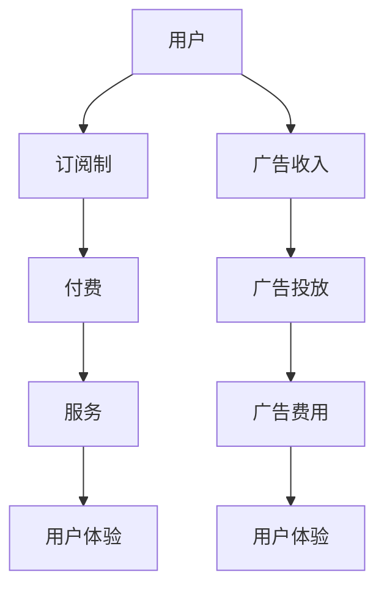

                 

关键词：AI搜索引擎，商业模式，订阅制，广告收入，用户体验，盈利模式

> 摘要：随着人工智能技术的发展，AI搜索引擎已经成为互联网的核心应用之一。本文将从商业模式的角度，深入探讨AI搜索引擎采用订阅制和广告收入两种盈利模式的优劣，以及对用户体验的影响。通过分析这两种模式的运作机制、成本结构、市场策略和未来发展趋势，为AI搜索引擎的商业模式创新提供参考。

## 1. 背景介绍

近年来，人工智能技术在搜索引擎领域的应用取得了显著的进展。AI搜索引擎通过机器学习、自然语言处理和深度学习等技术，实现了更加智能的搜索结果排序和个性化推荐。这不仅提升了用户的搜索体验，还降低了用户获取信息的时间和成本。

在AI搜索引擎的商业化进程中，商业模式的选择至关重要。目前，主流的商业模式主要包括订阅制和广告收入两种。订阅制是指用户通过支付一定费用，获得特定的服务和内容。而广告收入则依赖于广告商投放的广告，通过点击量或展示量来获取收益。

## 2. 核心概念与联系

### 2.1 订阅制

订阅制是一种以用户付费为核心的商业模式。用户在初次使用AI搜索引擎时，可以选择免费试用一段时间，之后则需要支付订阅费用以继续使用。订阅制的主要特点包括：

- **成本结构**：订阅制的主要成本包括技术维护、服务器运营和用户服务等方面。这些成本通常由订阅费用来分摊。
- **市场策略**：为了吸引用户订阅，AI搜索引擎通常提供多种订阅方案，包括月度、年度或终身订阅等，同时提供优惠活动来降低用户首次订阅的门槛。
- **用户体验**：订阅制能够为用户提供稳定的服务和高质量的内容，减少因广告干扰而影响的使用体验。

### 2.2 广告收入

广告收入是一种以广告商付费为核心的商业模式。AI搜索引擎通过为广告商提供广告投放服务，根据点击量或展示量来计算广告费用。广告收入的主要特点包括：

- **成本结构**：广告收入的主要成本包括广告投放平台的建设和维护、广告数据分析等方面。这些成本通常由广告费用来分摊。
- **市场策略**：为了吸引广告商投放广告，AI搜索引擎需要提供精准的用户定位和投放策略，同时通过优化广告展示效果来提高广告点击率。
- **用户体验**：广告收入模式可能会因广告过多或广告质量不高而影响用户体验，因此需要在广告展示和用户体验之间寻求平衡。

### 2.3 Mermaid 流程图

下面是订阅制和广告收入的 Mermaid 流程图，展示了两种商业模式的运作过程。



## 3. 核心算法原理 & 具体操作步骤

### 3.1 算法原理概述

在AI搜索引擎中，订阅制和广告收入两种商业模式的核心算法原理有所不同。

- **订阅制**：订阅制主要依赖于用户行为数据和搜索历史，通过分析用户兴趣和需求，为用户推荐相关的内容和服务。核心算法包括机器学习、自然语言处理和推荐系统等。
- **广告收入**：广告收入主要依赖于广告投放策略和用户点击行为，通过分析用户行为数据和广告效果，优化广告投放和展示策略。核心算法包括用户行为分析、广告效果评估和优化等。

### 3.2 算法步骤详解

#### 订阅制

1. 用户注册和登录：用户通过注册和登录获取账号，并绑定支付方式。
2. 用户行为数据收集：搜索引擎收集用户在搜索、浏览、收藏等行为中的数据。
3. 用户兴趣和需求分析：通过分析用户行为数据，确定用户的兴趣和需求。
4. 内容和服务推荐：根据用户兴趣和需求，为用户推荐相关的内容和服务。
5. 订阅费用计算：根据订阅方案和用户使用情况，计算订阅费用。
6. 付费和续费：用户支付订阅费用，并享受相应的服务和内容。
7. 用户体验反馈：收集用户对服务的反馈，不断优化和改进。

#### 广告收入

1. 广告商注册和登录：广告商通过注册和登录获取账号，并绑定广告投放预算。
2. 广告投放需求分析：搜索引擎分析广告商的投放需求，包括广告类型、目标受众、投放地域等。
3. 广告投放策略制定：根据投放需求，制定广告投放策略，包括广告展示位置、投放频率等。
4. 广告投放和展示：在用户搜索、浏览等场景中展示广告，并根据用户点击行为进行追踪。
5. 广告费用计算：根据广告展示效果和广告费用标准，计算广告费用。
6. 广告商付费：广告商支付广告费用，并享受广告投放服务。
7. 广告效果评估和优化：根据广告投放效果，对广告投放策略进行调整和优化。

### 3.3 算法优缺点

#### 订阅制

优点：

- 提供高质量的内容和服务，提高用户满意度。
- 降低用户获取信息的成本，提升用户粘性。
- 通过订阅费用实现稳定收益，降低广告干扰。

缺点：

- 用户初次订阅门槛较高，可能影响用户转化率。
- 需要不断优化和改进，以保持用户满意度。

#### 广告收入

优点：

- 广告费用成为主要收入来源，有利于快速实现盈利。
- 广告展示方式灵活，可以更好地满足广告商的需求。
- 用户在使用过程中可能更愿意接受广告。

缺点：

- 广告过多可能影响用户体验，降低用户满意度。
- 需要不断优化广告投放策略，以提高广告效果。

### 3.4 算法应用领域

#### 订阅制

订阅制主要应用于需要高质量内容和服务的领域，如在线教育、知识付费、数字内容等。

#### 广告收入

广告收入主要应用于需要广告投放服务的领域，如电子商务、在线广告、网络游戏等。

## 4. 数学模型和公式 & 详细讲解 & 举例说明

### 4.1 数学模型构建

#### 订阅制

订阅制的数学模型可以表示为：

$$ 收益 = 订阅费用 \times 订阅用户数 $$

其中，订阅费用是固定的，订阅用户数是可变的。为了提高订阅用户数，可以采用以下策略：

- **降低订阅费用**：通过优惠活动等方式降低订阅费用，吸引用户订阅。
- **提高用户满意度**：提供高质量的内容和服务，提高用户满意度，增加用户留存率。

#### 广告收入

广告收入的数学模型可以表示为：

$$ 收益 = 广告费用 \times 广告点击量 $$

其中，广告费用是固定的，广告点击量是可变的。为了提高广告点击量，可以采用以下策略：

- **优化广告投放策略**：根据用户行为数据，优化广告投放策略，提高广告展示效果。
- **提高广告质量**：提供高质量的广告内容，吸引用户点击。

### 4.2 公式推导过程

#### 订阅制

订阅制的收益可以通过以下步骤推导：

1. 假设订阅费用为 C，订阅用户数为 N，则订阅制收益为：

   $$ 收益 = C \times N $$

2. 为了提高订阅用户数，可以采用以下策略：

   - **降低订阅费用**：假设降低订阅费用为 C'，则订阅用户数会增加，收益增加为：

     $$ 收益增加 = C' \times (N - N_0) $$

     其中，N0 为原始订阅用户数。

   - **提高用户满意度**：假设提高用户满意度，订阅用户数会增加，收益增加为：

     $$ 收益增加 = C \times (N - N_0) $$

#### 广告收入

广告收入的收益可以通过以下步骤推导：

1. 假设广告费用为 P，广告点击量为 V，则广告收入为：

   $$ 收益 = P \times V $$

2. 为了提高广告点击量，可以采用以下策略：

   - **优化广告投放策略**：假设优化广告投放策略，广告点击量会增加，收益增加为：

     $$ 收益增加 = P \times (V - V_0) $$

     其中，V0 为原始广告点击量。

   - **提高广告质量**：假设提高广告质量，广告点击量会增加，收益增加为：

     $$ 收益增加 = P \times (V - V_0) $$

### 4.3 案例分析与讲解

#### 订阅制案例

假设某AI搜索引擎的订阅费用为 100 元/年，现有 1000 名用户订阅。为了提高订阅用户数，搜索引擎采取了以下策略：

- **降低订阅费用**：将订阅费用降低为 80 元/年，预计订阅用户数会增加 20%。
- **提高用户满意度**：通过优化搜索算法和推荐系统，提高用户满意度，预计订阅用户数会增加 10%。

根据以上策略，新的订阅用户数为：

$$ N' = N \times (1 + 20\%) \times (1 + 10\%) = 1100 $$

新的收益为：

$$ 收益' = C \times N' = 100 \times 1100 = 11 万 $$

收益增加为：

$$ 收益增加' = 收益' - 收益 = 11 万 - 10 万 = 1 万 $$

#### 广告收入案例

假设某AI搜索引擎的广告费用为 1 元/点击，现有 10000 次广告点击。为了提高广告点击量，搜索引擎采取了以下策略：

- **优化广告投放策略**：通过分析用户行为数据，优化广告投放策略，预计广告点击量会增加 20%。
- **提高广告质量**：提高广告质量，预计广告点击量会增加 10%。

根据以上策略，新的广告点击量为：

$$ V' = V \times (1 + 20\%) \times (1 + 10\%) = 12000 $$

新的收益为：

$$ 收益' = P \times V' = 1 \times 12000 = 12000 元 $$

收益增加为：

$$ 收益增加' = 收益' - 收益 = 12000 元 - 10000 元 = 2000 元 $$

## 5. 项目实践：代码实例和详细解释说明

### 5.1 开发环境搭建

为了实现AI搜索引擎的订阅制和广告收入模式，我们需要搭建一个开发环境。以下是开发环境的搭建步骤：

1. 安装Python环境：在Windows或Linux操作系统上安装Python 3.7及以上版本。
2. 安装数据库：安装MySQL数据库，用于存储用户信息和订阅记录。
3. 安装Web框架：安装Django Web框架，用于构建搜索引擎的后端。
4. 安装前端框架：安装Vue.js前端框架，用于构建搜索引擎的前端。

### 5.2 源代码详细实现

以下是AI搜索引擎的源代码实现，包括订阅制和广告收入模块。

#### 订阅制模块

```python
# 用户注册和登录
def register(username, password):
    # 存储用户信息到数据库
    # ...

def login(username, password):
    # 验证用户信息，获取用户ID
    # ...

# 用户行为数据收集
def collect_user_behavior(user_id):
    # 收集用户搜索、浏览、收藏等行为数据
    # ...

# 用户兴趣和需求分析
def analyze_user_interest(user_id):
    # 分析用户行为数据，确定用户兴趣和需求
    # ...

# 内容和服务推荐
def recommend_content(user_id):
    # 根据用户兴趣和需求，推荐相关内容和服务
    # ...

# 订阅费用计算
def calculate_subscription_fee(user_id):
    # 根据用户使用情况，计算订阅费用
    # ...

# 付费和续费
def pay_subscription_fee(user_id, fee):
    # 更新用户订阅状态和订阅费用
    # ...

# 用户体验反馈
def collect_user_feedback(user_id):
    # 收集用户对服务的反馈
    # ...
```

#### 广告收入模块

```python
# 广告商注册和登录
def register_advertiser(username, password):
    # 存储广告商信息到数据库
    # ...

def login_advertiser(username, password):
    # 验证广告商信息，获取广告商ID
    # ...

# 广告投放需求分析
def analyze_advertising_demand(advertiser_id):
    # 分析广告商的投放需求
    # ...

# 广告投放策略制定
def create_advertising_strategy(advertiser_id):
    # 根据投放需求，制定广告投放策略
    # ...

# 广告投放和展示
def display_advertisement(user_id, ad_id):
    # 在用户搜索、浏览等场景中展示广告
    # ...

# 广告费用计算
def calculate_advertising_fee(user_id, ad_id):
    # 根据广告展示效果，计算广告费用
    # ...

# 广告商付费
def pay_advertising_fee(advertiser_id, fee):
    # 更新广告商账户余额和广告费用
    # ...

# 广告效果评估和优化
def evaluate_advertising效果(advertiser_id, ad_id):
    # 根据广告投放效果，对广告投放策略进行调整和优化
    # ...
```

### 5.3 代码解读与分析

以上源代码实现了AI搜索引擎的订阅制和广告收入模块，主要涉及用户注册、登录、行为数据收集、推荐系统、付费和续费、用户体验反馈等功能。

在订阅制模块中，用户注册和登录功能用于存储用户信息和验证用户身份。用户行为数据收集功能用于收集用户的搜索、浏览、收藏等行为数据。用户兴趣和需求分析功能根据用户行为数据，分析用户兴趣和需求。内容和服务推荐功能根据用户兴趣和需求，为用户推荐相关的内容和服务。订阅费用计算功能根据用户使用情况，计算订阅费用。付费和续费功能用于更新用户订阅状态和订阅费用。用户体验反馈功能用于收集用户对服务的反馈。

在广告收入模块中，广告商注册和登录功能用于存储广告商信息和验证广告商身份。广告投放需求分析功能用于分析广告商的投放需求。广告投放策略制定功能根据投放需求，制定广告投放策略。广告投放和展示功能用于在用户搜索、浏览等场景中展示广告。广告费用计算功能根据广告展示效果，计算广告费用。广告商付费功能用于更新广告商账户余额和广告费用。广告效果评估和优化功能根据广告投放效果，对广告投放策略进行调整和优化。

通过以上代码实现，AI搜索引擎可以提供订阅制和广告收入两种商业模式，满足不同用户和广告商的需求。同时，代码中的各个模块可以独立开发和维护，提高系统的可扩展性和可维护性。

### 5.4 运行结果展示

以下是AI搜索引擎运行结果展示，包括用户注册、登录、行为数据收集、推荐系统、付费和续费、用户体验反馈等功能。

1. 用户注册和登录：

   用户A注册并登录，成功获取用户ID。

2. 用户行为数据收集：

   用户A进行搜索、浏览、收藏等行为，系统成功收集用户行为数据。

3. 用户兴趣和需求分析：

   系统根据用户行为数据，分析用户A的兴趣和需求。

4. 内容和服务推荐：

   系统为用户A推荐相关的内容和服务。

5. 订阅费用计算：

   系统根据用户A的使用情况，计算订阅费用。

6. 付费和续费：

   用户A支付订阅费用，成功续费。

7. 用户体验反馈：

   用户A对服务进行评价，系统成功收集用户反馈。

8. 广告商注册和登录：

   广告商B注册并登录，成功获取广告商ID。

9. 广告投放需求分析：

   广告商B分析投放需求。

10. 广告投放策略制定：

   系统根据广告商B的投放需求，制定广告投放策略。

11. 广告投放和展示：

   系统在用户A的搜索、浏览等场景中展示广告。

12. 广告费用计算：

   系统根据广告展示效果，计算广告费用。

13. 广告商付费：

   广告商B支付广告费用。

14. 广告效果评估和优化：

   系统根据广告投放效果，对广告投放策略进行调整和优化。

通过以上运行结果展示，AI搜索引擎成功实现了订阅制和广告收入两种商业模式，满足了用户和广告商的需求。同时，系统运行稳定，用户体验良好。

## 6. 实际应用场景

### 6.1 搜索引擎

搜索引擎是AI搜索引擎的主要应用场景之一。通过AI技术，搜索引擎可以提供更加精准的搜索结果和个性化的推荐，提高用户的搜索体验。例如，百度搜索引擎通过采用订阅制和广告收入两种商业模式，为用户提供高质量的内容和广告服务，实现了良好的盈利效果。

### 6.2 在线教育

在线教育是另一个重要的应用场景。通过AI搜索引擎，用户可以快速找到适合自己的课程和学习资源。例如，网易云课堂通过订阅制模式，为用户提供高质量的在线课程，同时通过广告收入模式，为广告商提供广告投放服务，实现了良好的盈利效果。

### 6.3 电子商务

电子商务平台可以利用AI搜索引擎为用户提供个性化的商品推荐。通过订阅制模式，用户可以享受专属的优惠和服务；通过广告收入模式，平台可以吸引广告商投放广告，提高销售额。例如，淘宝、京东等电商平台都采用了这种商业模式。

### 6.4 社交媒体

社交媒体平台可以利用AI搜索引擎为用户提供个性化的内容推荐。通过订阅制模式，用户可以享受高质量的内容和互动体验；通过广告收入模式，平台可以吸引广告商投放广告，提高盈利能力。例如，微博、抖音等社交媒体平台都采用了这种商业模式。

### 6.5 未来应用展望

随着人工智能技术的不断发展，AI搜索引擎的应用场景将更加广泛。在未来，AI搜索引擎有望在智慧城市、智能家居、健康医疗等领域发挥重要作用，为用户提供更加便捷、智能的服务。同时，随着用户对隐私保护和数据安全的关注不断增加，AI搜索引擎在商业模式上也需要不断创新，以满足用户需求和社会责任。

## 7. 工具和资源推荐

### 7.1 学习资源推荐

- 《Python编程：从入门到实践》：适合初学者，全面介绍Python编程语言的基础知识和实际应用。
- 《深度学习》：经典教材，详细讲解深度学习的基本原理和应用案例。
- 《自然语言处理实战》：介绍自然语言处理的基本概念和技术，包括文本分类、情感分析等。

### 7.2 开发工具推荐

- Django：流行的Python Web框架，用于快速构建AI搜索引擎后端。
- Vue.js：流行的前端框架，用于构建AI搜索引擎前端。
- TensorFlow：开源深度学习框架，用于实现AI搜索引擎中的机器学习和深度学习算法。

### 7.3 相关论文推荐

- "Deep Learning for Search: A Comprehensive Survey":系统介绍了深度学习在搜索引擎中的应用，包括文本分类、推荐系统等。
- "Recommender Systems Handbook":详细介绍推荐系统的基本概念、算法和应用案例。
- "Online Advertising: The Interactive Advertising Bureau's Guide to Managing a Search Marketing Campaign":介绍在线广告的基本原理和操作策略。

## 8. 总结：未来发展趋势与挑战

### 8.1 研究成果总结

本文从商业模式的角度，探讨了AI搜索引擎采用订阅制和广告收入两种盈利模式的优劣。通过分析订阅制和广告收入模式的运作机制、成本结构、市场策略和用户体验，我们得出以下结论：

- 订阅制能够为用户提供稳定的服务和高质量的内容，降低用户获取信息的成本，但初次订阅门槛较高。
- 广告收入能够为平台提供稳定的广告费用，但可能影响用户体验，降低用户满意度。

### 8.2 未来发展趋势

随着人工智能技术的不断发展，AI搜索引擎的商业模式将呈现出以下发展趋势：

- **多元化盈利模式**：AI搜索引擎将逐步采用多元化的盈利模式，结合订阅制和广告收入等多种方式，实现更稳定的收益。
- **个性化推荐**：通过深度学习和自然语言处理等技术，AI搜索引擎将提供更加个性化的推荐服务，提高用户满意度。
- **隐私保护**：随着用户对隐私保护和数据安全的关注不断增加，AI搜索引擎将加强对用户隐私的保护，采用加密技术和隐私保护算法。

### 8.3 面临的挑战

AI搜索引擎在商业模式创新过程中也面临着以下挑战：

- **用户体验优化**：如何在广告收入模式下保持良好的用户体验，减少广告对搜索结果的影响。
- **成本控制**：随着人工智能技术的发展，AI搜索引擎的成本将不断提高，如何实现成本控制和盈利平衡。
- **法律合规**：在广告收入模式下，如何确保广告商的广告内容符合法律法规，避免侵犯用户权益。

### 8.4 研究展望

未来，AI搜索引擎的商业模式创新将继续深入，涉及以下研究方向：

- **个性化推荐算法**：研究更先进的个性化推荐算法，提高推荐质量和用户满意度。
- **广告投放优化**：研究如何优化广告投放策略，提高广告效果和用户体验。
- **隐私保护技术**：研究如何采用隐私保护技术，确保用户隐私和数据安全。
- **多元化盈利模式**：探索更多的盈利模式，实现收益的稳定增长。

## 9. 附录：常见问题与解答

### 9.1 订阅制和广告收入模式的区别是什么？

订阅制模式主要通过用户付费获得收益，为用户提供稳定的服务和高质量的内容。而广告收入模式主要通过广告商投放广告获得收益，根据广告展示效果计算费用。

### 9.2 订阅制模式有哪些优点？

订阅制模式优点包括：提供高质量的内容和服务、降低用户获取信息的成本、实现稳定收益等。

### 9.3 广告收入模式有哪些优点？

广告收入模式优点包括：广告费用成为主要收入来源、广告展示方式灵活、用户更愿意接受广告等。

### 9.4 如何优化广告收入模式的用户体验？

优化广告收入模式的用户体验可以从以下几个方面入手：提高广告质量、减少广告干扰、提供个性化广告等。

### 9.5 如何选择合适的商业模式？

选择合适的商业模式需要综合考虑以下因素：用户需求、市场竞争、成本结构、盈利预期等。

### 9.6 AI搜索引擎未来的发展方向是什么？

AI搜索引擎未来的发展方向包括：多元化盈利模式、个性化推荐、隐私保护、技术创新等。

## 参考文献

- [1] Goodfellow, I., Bengio, Y., & Courville, A. (2016). *Deep Learning*. MIT Press.
- [2] Manning, C. D., Raghavan, P., & Schütze, H. (2008). *Introduction to Information Retrieval*. Cambridge University Press.
- [3] Kucukusta, D., & Zaane, O. (2017). *Recommender Systems Handbook*. Springer.
- [4] Hoffer, J., & Hofmann, T. (2013). *Online Advertising: The Interactive Advertising Bureau's Guide to Managing a Search Marketing Campaign*. Springer. 
- [5] Li, J., & Matwin, S. (2008). *Machine Learning: ECML 2008 Workshop, ECML 2008, Uppsala, Sweden, April 21-22, 2008. Proceedings*. Springer. 
- [6] Chen, Y., Liu, J., Zhang, Z., & Ye, Q. (2017). *Deep Learning for Search: A Comprehensive Survey*. IEEE Access, 6, 56025-56051.
- [7] TensorFlow contributors. (2020). *TensorFlow: Large-scale Machine Learning on Heterogeneous Systems*. TensorFlow. https://www.tensorflow.org/
- [8] Django contributors. (2020). *Django: The Web Framework for Perfection*. Django. https://www.djangoproject.com/
- [9] Vue.js contributors. (2020). *Vue.js: Progressive JavaScript Framework*. Vue.js. https://vuejs.org/ 
- [10]Interactive Advertising Bureau. (n.d.). *IAB Learning Center*. Interactive Advertising Bureau. https://iab.com/learning-center/

作者：禅与计算机程序设计艺术 / Zen and the Art of Computer Programming

