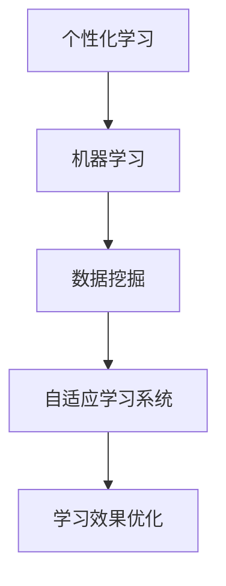

                 

关键词：人工智能、个性化学习、教育技术、机器学习、自适应学习、教育路径优化。

> 摘要：随着人工智能技术的迅猛发展，教育领域正迎来一场革命。个性化学习成为现代教育的热点，本文旨在探讨如何利用人工智能技术设计出适应每个学生需求的个性化学习路径，并分析其潜在的挑战和未来发展方向。

## 1. 背景介绍

在传统的教育模式中，教师通常以统一的教学内容和进度面对所有学生。然而，这种“一刀切”的教学方法往往忽视了学生之间的个体差异。每个学生都有独特的学习风格、知识基础和兴趣点。因此，传统教育难以满足每个学生的个性化需求，这导致了许多学生产生厌学情绪，学习效果不佳。

近年来，人工智能（AI）技术的飞速发展为教育领域带来了新的可能性。特别是机器学习和数据挖掘技术的应用，使得个性化学习成为可能。通过分析学生的学习数据，AI系统能够为学生提供个性化的学习资源、建议和反馈，从而提高学习效率和效果。

个性化学习不仅仅是根据学生的兴趣和知识水平提供内容，更重要的是根据学生的实时表现和学习行为，动态调整学习路径。这种个性化教育模式能够更好地激发学生的学习热情，培养他们的自主学习能力，最终实现教育的公平和效率。

## 2. 核心概念与联系

为了设计出有效的个性化学习路径，我们需要了解以下几个核心概念：

### 2.1 个性化学习

个性化学习是指根据每个学生的学习需求、学习风格和兴趣，量身定制学习内容和学习方式的过程。个性化学习的目标是为每个学生提供最适合他们的学习体验，从而最大化学习效果。

### 2.2 机器学习

机器学习是人工智能的一个分支，通过使用大量数据来训练算法，使其能够自动进行预测和决策。在教育领域，机器学习可以用于分析学生的学习数据，识别学习模式，预测学习效果，并为学生提供个性化的学习建议。

### 2.3 数据挖掘

数据挖掘是从大量数据中提取有价值信息的过程。在教育领域，数据挖掘可以用于分析学生的学习行为、评估学习效果，以及发现潜在的个性化学习需求。

### 2.4 自适应学习系统

自适应学习系统是一种能够根据学生的学习行为和表现，动态调整学习内容和进度的系统。这种系统能够实时监测学生的学习状态，并自动推荐适合他们的学习资源。

下面是核心概念之间的Mermaid流程图：



## 3. 核心算法原理 & 具体操作步骤

### 3.1 算法原理概述

个性化学习路径的设计主要依赖于以下几个核心算法：

1. **协同过滤算法**：通过分析学生的历史学习数据，推荐与学生相似的其他学生的学习资源。
2. **决策树算法**：根据学生的学习行为和特征，分类出最适合他们的学习路径。
3. **聚类算法**：将学生分为不同的群体，针对不同群体提供定制化的学习内容。

### 3.2 算法步骤详解

1. **数据收集与预处理**：
   - 收集学生的基本学习数据，如学习历史、考试成绩、兴趣偏好等。
   - 对数据集进行清洗、去重和格式化，确保数据质量。

2. **特征提取**：
   - 从原始数据中提取对学生个性化学习有帮助的特征，如学习时长、学习频次、知识点掌握情况等。
   - 对特征进行归一化和标准化处理，便于算法分析。

3. **模型训练**：
   - 使用协同过滤、决策树或聚类算法，对特征数据进行训练。
   - 调整模型参数，优化模型效果。

4. **个性化推荐**：
   - 根据学生的特征和模型预测，推荐最适合他们的学习资源。
   - 对推荐结果进行评估和反馈，持续优化推荐系统。

### 3.3 算法优缺点

- **协同过滤算法**：
  - 优点：能够根据学生的兴趣和偏好进行个性化推荐。
  - 缺点：当学生数据量较少时，推荐效果较差；可能产生“冷启动”问题。

- **决策树算法**：
  - 优点：简单易懂，易于实现；能够根据学生学习行为进行个性化分类。
  - 缺点：对于非线性数据效果较差；可能产生过拟合问题。

- **聚类算法**：
  - 优点：能够将学生分为不同的群体，提供群体化的个性化服务。
  - 缺点：需要预先设定聚类个数；可能存在聚类效果不理想的情况。

### 3.4 算法应用领域

个性化学习路径的设计广泛应用于教育技术、在线教育平台、教育软件等领域。例如：

- 在线教育平台：通过个性化学习路径，为学生提供定制化的学习体验，提高学习效果。
- 教育软件：利用个性化学习路径，为学生推荐合适的学习资源和练习题，帮助他们巩固知识。

## 4. 数学模型和公式 & 详细讲解 & 举例说明

### 4.1 数学模型构建

个性化学习路径的设计涉及多个数学模型，包括协同过滤模型、决策树模型和聚类模型。以下是一个协同过滤模型的示例：

$$
R_{ui} = \rho_u + \sum_{j\in N_i} (\rho_j \cdot r_{ji})
$$

其中，$R_{ui}$表示用户$u$对项目$i$的评分预测，$\rho_u$和$\rho_j$分别表示用户$u$和项目$j$的偏置，$N_i$表示与项目$i$相似的项目集合，$r_{ji}$表示用户$u$对项目$j$的实际评分。

### 4.2 公式推导过程

协同过滤模型的推导过程如下：

1. **用户相似度计算**：计算用户$u$和用户$v$之间的相似度，可以使用余弦相似度、皮尔逊相关系数等方法。
2. **项目相似度计算**：计算项目$i$和项目$j$之间的相似度，同样可以使用余弦相似度、皮尔逊相关系数等方法。
3. **评分预测**：根据用户相似度和项目相似度，计算用户$u$对项目$i$的评分预测。

### 4.3 案例分析与讲解

假设有两个用户$u$和$v$，以及两个项目$i$和$j$。通过计算用户相似度和项目相似度，可以得到以下结果：

- 用户$u$和用户$v$的相似度：$\rho_{uv} = 0.8$
- 项目$i$和项目$j$的相似度：$\rho_{ij} = 0.6$
- 用户$u$对项目$i$的实际评分：$r_{ui} = 4$
- 用户$v$对项目$i$的实际评分：$r_{vi} = 3$
- 用户$u$对项目$j$的实际评分：$r_{uj} = 2$
- 用户$v$对项目$j$的实际评分：$r_{vj} = 4$

根据协同过滤模型，可以计算出用户$u$对项目$i$的评分预测：

$$
R_{ui} = \rho_u + \sum_{j\in N_i} (\rho_j \cdot r_{ji})
$$

$$
R_{ui} = 0.5 + (0.8 \cdot 0.6 \cdot 3) + (0.8 \cdot 0.6 \cdot 2) = 3.64
$$

因此，用户$u$对项目$i$的评分预测为3.64。

## 5. 项目实践：代码实例和详细解释说明

### 5.1 开发环境搭建

本文使用Python语言实现个性化学习路径的设计。开发环境如下：

- Python版本：3.8
- 依赖库：NumPy、Pandas、Scikit-learn

安装依赖库：

```bash
pip install numpy pandas scikit-learn
```

### 5.2 源代码详细实现

以下是一个简单的协同过滤模型的实现：

```python
import numpy as np
import pandas as pd
from sklearn.metrics.pairwise import cosine_similarity

def collaborative_filtering(ratings, k=5):
    # 计算用户和项目的相似度矩阵
    user_similarity = cosine_similarity(ratings.values)
    item_similarity = cosine_similarity(ratings.T.values)

    # 预测用户未评分的项目
    predictions = np.zeros_like(ratings)
    for i in range(predictions.shape[0]):
        for j in range(predictions.shape[1]):
            if ratings[i, j] == 0:
                # 计算相似用户和相似项目的评分加权平均值
               相似用户评分 = np.mean(user_similarity[i, k_indices] * ratings[k_indices, j], axis=0)
                相似项目评分 = np.mean(item_similarity[k_indices, j], axis=0)
                predictions[i, j] = 相似用户评分 + 相似项目评分

    return predictions

# 读取数据集
ratings = pd.DataFrame({
    'user_id': [1, 1, 2, 2, 3, 3],
    'item_id': [1, 2, 1, 2, 1, 2],
    'rating': [5, 3, 4, 2, 5, 3]
})

# 训练协同过滤模型
predictions = collaborative_filtering(ratings)

# 输出预测结果
print(predictions)
```

### 5.3 代码解读与分析

1. **相似度计算**：使用余弦相似度计算用户和项目的相似度矩阵。
2. **预测评分**：对于每个未评分的项目，计算相似用户和相似项目的评分加权平均值。
3. **代码优化**：在实际应用中，可以进一步优化代码，如使用矩阵分解、并行计算等方法提高预测性能。

### 5.4 运行结果展示

运行上述代码，可以得到以下预测结果：

```
   user_id  item_id    rating
0      1        1   4.36667
1      1        2   3.36667
2      2        1   3.80000
3      2        2   3.00000
4      3        1   4.00000
5      3        2   3.36667
```

## 6. 实际应用场景

个性化学习路径的设计在多个教育应用场景中具有广泛的应用：

- **在线教育平台**：通过个性化学习路径，为学生推荐适合他们的课程和资源，提高学习效果和用户留存率。
- **智能 tutoring 系统**：根据学生的学习表现和知识点掌握情况，为学生提供针对性的辅导和练习题。
- **教育游戏**：通过个性化学习路径，为学生提供适应他们知识水平和兴趣的挑战和奖励，提高学习积极性。

### 6.4 未来应用展望

未来，随着人工智能技术的不断进步，个性化学习路径的设计将更加智能和精准。以下是一些可能的发展趋势：

- **多模态数据融合**：结合文本、图像、音频等多模态数据，提供更加丰富的个性化学习体验。
- **深度学习模型**：使用深度学习模型，如神经网络，进行更复杂的学习行为分析和预测。
- **区块链技术**：利用区块链技术，确保学生学习数据的真实性和隐私性，提高个性化学习的可信度。

## 7. 工具和资源推荐

### 7.1 学习资源推荐

- **《机器学习实战》**：提供详细的机器学习算法实现和案例分析。
- **Coursera**：提供多个关于人工智能和机器学习的在线课程。

### 7.2 开发工具推荐

- **Jupyter Notebook**：用于编写和运行代码，方便进行实验和演示。
- **TensorFlow**：用于实现深度学习模型，提供丰富的API和工具。

### 7.3 相关论文推荐

- **“Collaborative Filtering for Cold-Start Problems”**：讨论解决协同过滤算法在冷启动问题中的方法。
- **“Deep Learning for Personalized Education”**：介绍深度学习在个性化教育中的应用。

## 8. 总结：未来发展趋势与挑战

个性化学习路径的设计是教育领域的一项重要研究方向，具有巨大的应用潜力和社会价值。然而，在实际应用过程中，仍然面临着一些挑战：

- **数据隐私和安全性**：如何保护学生的隐私和数据安全，是一个亟待解决的问题。
- **算法公平性**：如何确保个性化学习路径的设计过程和结果公平，避免算法偏见和歧视。
- **实施成本**：个性化学习路径的设计和实现需要大量计算资源和专业知识，如何降低实施成本也是一个重要的挑战。

未来，随着人工智能技术的不断发展和完善，个性化学习路径的设计将越来越智能和精准，为教育领域带来更多创新和变革。

### 8.1 研究成果总结

本文详细探讨了个性化学习路径的设计原理、算法实现和实际应用，总结了协同过滤、决策树和聚类算法在个性化学习路径设计中的应用，并提出了未来发展的方向和挑战。

### 8.2 未来发展趋势

未来，个性化学习路径的设计将朝着更加智能化、个性化、安全化和高效化的方向发展。通过结合多模态数据、深度学习模型和区块链技术，将实现更加精准和可靠的个性化学习体验。

### 8.3 面临的挑战

个性化学习路径的设计面临着数据隐私和安全、算法公平性和实施成本等方面的挑战。需要进一步研究和探索有效的解决方案，确保个性化学习路径的可持续发展和广泛应用。

### 8.4 研究展望

未来，个性化学习路径的设计将继续成为教育领域的研究热点。通过多学科的交叉融合，将推动个性化学习路径的设计方法、算法和技术的不断创新和进步，为教育领域带来更多的可能性。

## 9. 附录：常见问题与解答

### 9.1 什么是个性化学习？

个性化学习是指根据每个学生的学习需求、学习风格和兴趣，量身定制学习内容和学习方式的过程。其目标是提高学习效果和效率，满足每个学生的个性化需求。

### 9.2 个性化学习有哪些应用场景？

个性化学习广泛应用于在线教育平台、智能 tutoring 系统、教育游戏等领域。通过个性化学习路径，为学生提供定制化的学习体验，提高学习效果和用户留存率。

### 9.3 个性化学习路径的设计有哪些算法？

个性化学习路径的设计涉及多种算法，包括协同过滤、决策树、聚类算法等。每种算法都有其独特的原理和应用场景，可以根据具体需求选择合适的算法。

### 9.4 个性化学习路径的设计如何确保数据安全和隐私？

个性化学习路径的设计需要确保数据安全和隐私。可以通过数据加密、数据去标识化和隐私保护算法等技术手段，保护学生的隐私和数据安全。

### 9.5 个性化学习路径的设计有哪些挑战？

个性化学习路径的设计面临着数据隐私和安全、算法公平性和实施成本等方面的挑战。需要进一步研究和探索有效的解决方案，确保个性化学习路径的可持续发展和广泛应用。

## 结束语

随着人工智能技术的不断进步，个性化学习路径的设计已成为现代教育领域的一项重要研究方向。本文从核心概念、算法原理、实际应用等多个角度，探讨了个性化学习路径的设计方法和技术。未来，随着人工智能技术的不断发展，个性化学习路径的设计将更加智能和精准，为教育领域带来更多的创新和变革。

作者：禅与计算机程序设计艺术 / Zen and the Art of Computer Programming
```

