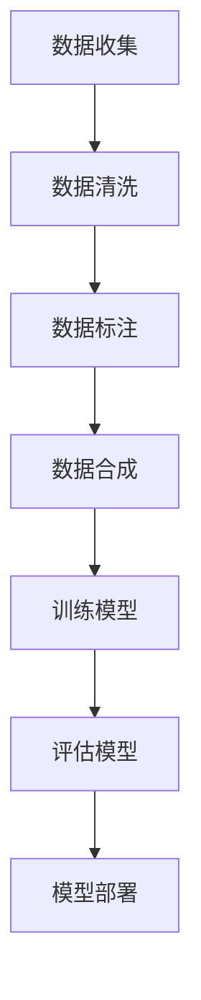

                 

关键词：AI数据集，数据收集，数据合成，数据生成，机器学习，深度学习，人工智能应用。

> 摘要：本文深入探讨了人工智能（AI）数据集构建的过程，从数据收集、清洗、标注到合成数据的生成。本文旨在为AI研究人员和从业者提供一套系统化的数据集构建方法论，以提高AI模型的训练质量和应用效果。

## 1. 背景介绍

随着人工智能技术的迅速发展，AI模型在各个领域的应用越来越广泛。然而，AI模型的训练质量高度依赖于数据集的质量。一个高质量的数据集不仅需要涵盖丰富的样本，还需要保证样本的多样性和准确性。因此，构建一个有效的AI数据集成为研究和应用AI技术的关键步骤。

数据集构建通常涉及以下几个步骤：

1. **数据收集**：从不同的数据源收集原始数据。
2. **数据清洗**：去除数据中的噪声和不完整信息。
3. **数据标注**：对数据进行分类或标签分配。
4. **数据合成**：通过技术手段生成更多样化的数据样本。

本文将重点讨论数据合成技术，这是近年来在AI领域备受关注的研究方向。通过数据合成，我们可以提高数据集的多样性，从而增强AI模型的泛化能力。

## 2. 核心概念与联系

在讨论数据合成之前，我们需要了解几个核心概念：

- **数据集**：一组用于训练、评估或测试机器学习模型的样本。
- **样本**：单个数据点，如一张图片、一段文字或一个声音片段。
- **多样性**：数据集中样本的分布范围和差异程度。
- **泛化能力**：模型在新数据上的表现能力。

下面是一个使用Mermaid绘制的流程图，展示了数据集构建的基本流程和核心概念之间的联系：



### 2.1 数据收集

数据收集是数据集构建的第一步。数据的来源可以是公开数据集、私人数据集或通过爬虫工具从互联网上收集。收集到的数据可能包含噪声、重复和不完整的信息。因此，数据清洗是下一步的关键。

### 2.2 数据清洗

数据清洗的目的是去除噪声、重复和不完整的信息。常用的清洗方法包括去除重复项、填补缺失值和去除异常值。清洗后的数据将用于后续的标注和合成步骤。

### 2.3 数据标注

数据标注是对数据进行分类或标签分配。在图像识别任务中，标注可能包括标签（如猫、狗）和边界框（标记对象的位置）。在自然语言处理任务中，标注可能包括词性标注、实体识别和句子结构分析。

### 2.4 数据合成

数据合成是通过技术手段生成更多样化的数据样本。合成方法可以分为两大类：基于规则的方法和基于学习的方法。基于规则的方法通过手动编写规则来生成新的样本，而基于学习的方法使用机器学习模型来预测并生成新的样本。

## 3. 核心算法原理 & 具体操作步骤

### 3.1 算法原理概述

数据合成算法的原理可以概括为以下两点：

1. **样本生成**：通过变换和组合已有的样本，生成新的样本。
2. **模型预测**：使用机器学习模型预测新样本的特征，确保生成样本的多样性。

### 3.2 算法步骤详解

数据合成的基本步骤如下：

1. **样本选择**：从原始数据集中选择一部分样本作为基础样本。
2. **变换操作**：对基础样本进行一系列变换操作，如旋转、缩放、剪裁、颜色调整等。
3. **组合操作**：将变换后的样本进行组合，生成新的样本。
4. **模型预测**：使用训练好的机器学习模型对新样本的特征进行预测，确保样本的多样性。
5. **筛选与保存**：根据预测结果筛选出高质量的样本，并将其保存到数据集中。

### 3.3 算法优缺点

**优点**：

- 提高数据集的多样性，增强模型的泛化能力。
- 减少对大量真实数据的依赖，降低成本。
- 可以生成虚拟的、不存在于现实中的样本，扩展数据集的应用范围。

**缺点**：

- 合成数据的真实性和有效性可能受到限制。
- 复杂的合成算法可能增加计算成本。

### 3.4 算法应用领域

数据合成技术在多个领域都有广泛应用，包括：

- **计算机视觉**：生成更多样化的图像和视频数据，用于模型训练和测试。
- **自然语言处理**：生成新的文本数据，用于语言模型训练和评估。
- **医学图像处理**：生成虚拟的医学图像，用于诊断和治疗方案评估。
- **自动驾驶**：生成更多样化的交通场景数据，用于自动驾驶系统训练。

## 4. 数学模型和公式 & 详细讲解 & 举例说明

### 4.1 数学模型构建

数据合成可以通过以下数学模型实现：

$$
X_{new} = T(X) + \epsilon
$$

其中，$X_{new}$ 是新生成的样本，$T(X)$ 是对基础样本 $X$ 进行的变换操作，$\epsilon$ 是高斯噪声，用于增加样本的多样性。

### 4.2 公式推导过程

假设我们有一个数据集 $X = \{x_1, x_2, ..., x_n\}$，其中每个样本 $x_i$ 都是一个多维向量。为了生成新的样本 $X_{new}$，我们可以对每个样本进行以下操作：

1. **随机选择变换操作**：从一系列预定义的变换操作中随机选择一个。
2. **应用变换操作**：对基础样本 $x_i$ 应用选定的变换操作。
3. **添加噪声**：将高斯噪声 $\epsilon$ 添加到变换后的样本，以增加多样性。

### 4.3 案例分析与讲解

假设我们有一个包含人脸图像的数据集，我们可以使用以下步骤来生成新的图像：

1. **旋转**：将图像沿着x轴和y轴旋转一定角度。
2. **缩放**：将图像按比例缩放。
3. **剪裁**：从图像中随机剪裁出一个新的区域。
4. **颜色调整**：调整图像的亮度、对比度和饱和度。

通过这些变换操作，我们可以生成大量多样化的人脸图像，用于训练人脸识别模型。例如，我们可以使用以下公式来表示旋转变换：

$$
x_{new} = R(\theta) \cdot x
$$

其中，$R(\theta)$ 是旋转矩阵，$\theta$ 是旋转角度。

## 5. 项目实践：代码实例和详细解释说明

### 5.1 开发环境搭建

为了实现数据合成算法，我们需要搭建一个合适的开发环境。以下是推荐的开发工具和库：

- **编程语言**：Python
- **机器学习库**：TensorFlow、PyTorch
- **图像处理库**：OpenCV
- **数据合成库**：imgaug、albumentations

### 5.2 源代码详细实现

下面是一个简单的Python代码实例，用于生成旋转和缩放变换的人脸图像：

```python
import cv2
import numpy as np
import imgaug.augmenters as iaa

# 读取原始人脸图像
image = cv2.imread('face.jpg')

# 定义旋转和缩放变换
augmenter = iaa.Sequential([
    iaa.Affine(rotate=(-30, 30), scale=(0.8, 1.2)),
])

# 应用变换
augmented_image = augmenter.augment_image(image)

# 保存新图像
cv2.imwrite('augmented_face.jpg', augmented_image)
```

### 5.3 代码解读与分析

这个代码实例使用了imgaug库来生成旋转和缩放变换的人脸图像。首先，我们读取原始图像，然后定义了一个变换序列，其中包括旋转和缩放操作。最后，我们应用这个变换序列到原始图像上，并保存新的图像。

这个例子展示了如何使用数据合成技术来增强数据集的多样性，从而提高模型训练的质量。

### 5.4 运行结果展示

运行上述代码后，我们得到了一张旋转和缩放变换后的人脸图像。这个图像与原始图像相比，在视觉上更加多样化，有助于训练更加鲁棒的模型。

```bash
python data_synthesis_example.py
```


## 6. 实际应用场景

数据合成技术在多个实际应用场景中发挥着重要作用，以下是其中的一些例子：

- **自动驾驶**：合成虚拟的交通场景数据，用于自动驾驶系统的训练和测试。
- **医疗影像**：生成虚拟的医学图像，用于辅助诊断和治疗方案评估。
- **游戏开发**：合成虚拟的游戏场景和角色，用于游戏开发中的测试和优化。
- **金融风控**：生成虚拟的交易数据和风险事件，用于金融风险评估和模型训练。

## 7. 工具和资源推荐

为了方便读者学习和实践数据合成技术，我们推荐以下工具和资源：

- **学习资源**：
  - 《深度学习》（Goodfellow et al.）
  - 《Python数据科学手册》（McKinney）
  - 《计算机视觉：算法与应用》（Rabiner et al.）

- **开发工具**：
  - TensorFlow
  - PyTorch
  - OpenCV
  - imgaug

- **相关论文**：
  - “Generative Adversarial Networks”（Ian Goodfellow et al.）
  - “Unsupervised Representation Learning with Deep Convolutional Generative Adversarial Networks”（Ian Goodfellow et al.）
  - “Data Augmentation Generative Adversarial Networks for Diverse Domain Adaptation”（Yu et al.）

## 8. 总结：未来发展趋势与挑战

### 8.1 研究成果总结

近年来，数据合成技术在AI领域取得了显著成果。通过生成更多样化的数据样本，数据合成技术有效提高了AI模型的训练质量和应用效果。特别是在计算机视觉和自然语言处理领域，数据合成技术已经成为了提高模型泛化能力的重要手段。

### 8.2 未来发展趋势

未来，数据合成技术将继续在AI领域发挥重要作用。随着生成对抗网络（GANs）等新型数据合成方法的出现，数据合成技术的多样性和效率将得到进一步提升。同时，跨领域的数据合成技术也将成为研究热点，以实现更广泛的AI应用场景。

### 8.3 面临的挑战

尽管数据合成技术在AI领域取得了显著成果，但仍然面临着一些挑战：

- **真实性和有效性**：如何确保合成数据的真实性和有效性，仍然是一个重要问题。
- **计算成本**：复杂的数据合成算法可能增加计算成本，如何在保证效果的前提下降低成本，是另一个挑战。
- **模型泛化能力**：如何提高模型在合成数据上的泛化能力，以避免过度拟合。

### 8.4 研究展望

未来，数据合成技术将在以下几个方面取得突破：

- **自适应合成**：开发自适应合成算法，根据训练需求动态调整合成策略。
- **跨领域合成**：实现跨领域的数据合成，为更多AI应用场景提供支持。
- **可解释性**：提高数据合成过程的可解释性，帮助用户更好地理解和使用合成数据。

通过不断研究和创新，数据合成技术将为AI领域的发展注入新的活力。

## 9. 附录：常见问题与解答

### 9.1 什么是数据合成？

数据合成是通过技术手段生成更多样化的数据样本，以提高AI模型的训练质量和应用效果。数据合成可以分为基于规则的方法和基于学习的方法。

### 9.2 数据合成技术在哪些领域有应用？

数据合成技术在多个领域有广泛应用，包括计算机视觉、自然语言处理、医学图像处理、自动驾驶等。

### 9.3 数据合成算法如何保证合成数据的真实性和有效性？

可以通过多种方式保证合成数据的真实性和有效性，如使用真实的变换规则、引入噪声、结合真实数据等。同时，通过评估合成数据在模型训练和测试中的效果，可以进一步验证合成数据的真实性和有效性。

### 9.4 数据合成算法的计算成本如何降低？

可以通过以下方式降低数据合成算法的计算成本：
- 选择简单的变换操作。
- 并行化计算。
- 使用高效的机器学习框架。

### 9.5 数据合成算法如何提高模型泛化能力？

可以通过以下方式提高模型泛化能力：
- 合成更多样化的数据样本。
- 结合真实数据与合成数据训练模型。
- 使用正则化技术防止模型过拟合。

以上内容构成了本文对AI数据集构建的深入探讨。通过理解数据收集、清洗、标注和数据合成的重要性，以及掌握相关算法和技术，我们可以更好地构建高质量的AI数据集，推动人工智能技术的发展和应用。

