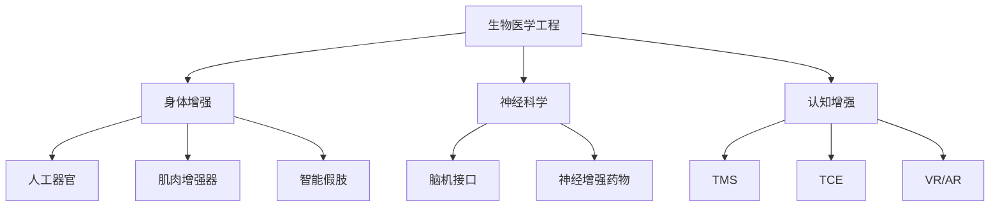

                 

关键词：人工智能，人类增强，身体增强，认知增强，科技发展

摘要：本文旨在探讨AI时代下人类增强的两种主要形式：身体增强和认知增强。通过对现有技术的研究和未来发展趋势的分析，我们希望揭示这些技术在提高人类生活质量、健康水平和生产力方面的潜力与挑战。

## 1. 背景介绍

随着人工智能（AI）技术的迅猛发展，人类增强的概念逐渐受到广泛关注。身体增强和认知增强是两种最具代表性的增强形式，它们分别关注提高人类的身体素质和认知能力。在科技不断进步的背景下，人类开始寻求突破自身的自然限制，探索如何通过科技手段实现更高效、更舒适、更长寿的生活。

### 身体增强

身体增强指的是通过科技手段提升人类身体的各种能力，包括力量、速度、耐力、灵敏度等。这种增强方式可以通过生物医学工程、可穿戴设备和基因编辑等技术实现。例如，人工器官的移植、肌肉增强器、智能假肢等都属于身体增强的范畴。

### 认知增强

认知增强则是指通过科技手段提升人类的认知能力，包括记忆力、注意力、学习能力、决策能力等。认知增强技术涵盖范围广泛，包括神经增强药物、脑机接口、虚拟现实（VR）和增强现实（AR）等。

## 2. 核心概念与联系

为了更好地理解身体增强和认知增强，我们需要了解一些核心概念和它们之间的联系。

### 生物医学工程

生物医学工程是身体增强技术的基石。它结合了生物学、医学和工程学，旨在开发用于治疗和增强人体功能的设备和技术。例如，人工心脏、人工关节、智能假肢等都是生物医学工程的成果。

### 脑机接口

脑机接口（BMI）是一种能够直接连接大脑和计算机系统的技术。通过脑机接口，人类可以借助意念控制外部设备，从而实现身体能力的增强。目前，脑机接口技术在假肢控制、轮椅导航和脑功能恢复等方面已经取得了一定的进展。

### 神经科学

神经科学是认知增强技术的重要基础。通过对大脑结构和功能的研究，科学家们可以更好地理解如何通过外部刺激来提升人类的认知能力。例如，经颅磁刺激（TMS）和电刺激（TCE）等技术已被用于治疗抑郁症、焦虑症和记忆力减退等疾病。

### 数学模型与算法

在身体增强和认知增强领域，数学模型和算法扮演着关键角色。例如，深度学习算法可以帮助识别大脑活动，从而实现更精确的脑机接口控制；优化算法可以优化肌肉增强器的设计，提高其性能和舒适性。

## 2.1 核心概念原理和架构的 Mermaid 流程图

```
graph TB
A[生物医学工程] --> B[身体增强]
A --> C[神经科学]
A --> D[认知增强]
B --> E[人工器官]
B --> F[肌肉增强器]
B --> G[智能假肢]
C --> H[脑机接口]
C --> I[神经增强药物]
D --> J[TMS]
D --> K[TCE]
D --> L[VR/AR]
```

## 3. 核心算法原理 & 具体操作步骤

### 3.1 算法原理概述

在身体增强和认知增强领域，算法原理主要包括：

- 信号处理算法：用于处理和分析生理信号，如脑电波、肌电信号等。
- 控制算法：用于控制外部设备，如假肢、轮椅等。
- 机器学习算法：用于训练模型，预测大脑活动，实现更加智能的脑机接口控制。

### 3.2 算法步骤详解

#### 身体增强

1. 采集生理信号：使用传感器采集用户的生理信号，如脑电波、肌电信号等。
2. 预处理信号：对采集到的信号进行滤波、去噪等预处理操作，以提高信号质量。
3. 特征提取：从预处理后的信号中提取具有代表性的特征。
4. 控制策略：根据提取的特征，设计控制策略，以实现对外部设备的控制。

#### 认知增强

1. 数据采集：收集用户的大脑活动数据，如脑电波、功能磁共振成像（fMRI）数据等。
2. 数据预处理：对采集到的数据进行分析和预处理，以提高数据质量。
3. 特征提取：从预处理后的数据中提取具有代表性的特征。
4. 训练模型：使用机器学习算法训练模型，以预测用户的大脑活动。
5. 实现认知增强：根据模型预测的结果，提供相应的认知增强策略，如记忆训练、注意力提升等。

### 3.3 算法优缺点

#### 身体增强

- 优点：
  - 提高用户的生活质量：通过身体增强技术，用户可以更加自如地进行日常活动，提高生活质量。
  - 增强运动能力：身体增强技术可以帮助用户提高运动能力，增强体质。

- 缺点：
  - 技术成本较高：目前，身体增强技术的研发和设备制造成本较高，使得普及应用面临一定困难。
  - 安全性问题：身体增强技术可能引发一些安全风险，如设备故障、过敏反应等。

#### 认知增强

- 优点：
  - 提高认知能力：认知增强技术可以帮助用户提升记忆力、注意力、学习速度等认知能力。
  - 治疗疾病：认知增强技术可以用于治疗一些神经系统疾病，如抑郁症、焦虑症等。

- 缺点：
  - 技术成熟度有限：目前，认知增强技术还处于发展阶段，其效果和安全性仍需进一步验证。
  - 伦理问题：认知增强技术的普及可能引发一些伦理问题，如科技霸权、隐私泄露等。

### 3.4 算法应用领域

#### 身体增强

- 应用领域：
  - 短期应用：如运动训练、康复治疗等。
  - 长期应用：如残疾人辅助、老年人护理等。

#### 认知增强

- 应用领域：
  - 教育领域：如学习辅助、记忆训练等。
  - 医疗领域：如神经疾病治疗、认知功能障碍康复等。
  - 工作领域：如注意力提升、工作效率提高等。

## 4. 数学模型和公式 & 详细讲解 & 举例说明

### 4.1 数学模型构建

在身体增强和认知增强领域，常用的数学模型包括：

- 信号处理模型：如滤波器、自适应滤波器等。
- 控制模型：如PID控制器、神经网络控制器等。
- 机器学习模型：如线性回归、支持向量机（SVM）、深度学习等。

### 4.2 公式推导过程

以线性回归模型为例，其公式推导过程如下：

1. **损失函数**：

   $$ L(\theta) = \frac{1}{2} \sum_{i=1}^{m} (h_\theta(x^{(i)}) - y^{(i)})^2 $$

   其中，$h_\theta(x) = \theta_0 + \theta_1x_1 + \theta_2x_2 + ... + \theta_nx_n$ 是线性回归模型，$x^{(i)}$ 和 $y^{(i)}$ 分别是输入和输出数据。

2. **梯度下降法**：

   $$ \theta_j := \theta_j - \alpha \frac{\partial L(\theta)}{\partial \theta_j} $$

   其中，$\alpha$ 是学习率，$\theta_j$ 是模型参数。

### 4.3 案例分析与讲解

#### 案例一：肌肉增强器设计

假设我们设计一种肌肉增强器，其目标是提高用户的肌肉力量。我们可以使用信号处理模型对用户的肌电信号进行处理，提取特征，然后设计控制策略，以实现肌肉增强。

1. **信号处理**：

   首先，我们使用滤波器对肌电信号进行滤波，去除噪声，得到纯净的肌电信号。

   $$ y_f(t) = f(y(t)) $$

   其中，$y(t)$ 是原始肌电信号，$y_f(t)$ 是滤波后的肌电信号。

2. **特征提取**：

   接下来，我们提取肌电信号的振幅、频率等特征，作为控制策略的输入。

   $$ x_i = f(y_f(t)) $$

   其中，$x_i$ 是提取的特征。

3. **控制策略**：

   设计控制策略，根据特征值调整肌肉增强器的输出，以实现肌肉增强。

   $$ u(t) = g(x_i) $$

   其中，$u(t)$ 是控制输出，$g(x_i)$ 是控制函数。

#### 案例二：认知增强训练

假设我们设计一种认知增强训练系统，其目标是提高用户的学习能力和记忆力。我们可以使用机器学习模型对用户的大脑活动数据进行分析，提取特征，然后设计训练策略，以实现认知增强。

1. **数据采集**：

   收集用户的大脑活动数据，如脑电波、fMRI数据等。

   $$ y_d = d(y) $$

   其中，$y$ 是原始大脑活动数据，$y_d$ 是预处理后的数据。

2. **特征提取**：

   提取大脑活动数据的时域、频域特征，作为训练模型的输入。

   $$ x_i = f(y_d) $$

   其中，$x_i$ 是提取的特征。

3. **模型训练**：

   使用机器学习算法，如支持向量机（SVM）、深度学习等，训练模型，以预测用户的大脑活动。

   $$ y_{pred} = h(x_i) $$

   其中，$h(x_i)$ 是训练好的模型，$y_{pred}$ 是预测结果。

4. **训练策略**：

   根据模型预测的结果，设计认知增强训练策略，如记忆训练、注意力训练等。

   $$ u(t) = g(y_{pred}) $$

   其中，$u(t)$ 是训练输出，$g(y_{pred})$ 是训练函数。

## 5. 项目实践：代码实例和详细解释说明

### 5.1 开发环境搭建

为了实践身体增强和认知增强技术，我们需要搭建一个开发环境。以下是一个简单的环境搭建步骤：

1. 安装Python环境：下载并安装Python 3.x版本，并配置好pip环境。
2. 安装常用库：使用pip安装numpy、pandas、scikit-learn、tensorflow等常用库。
3. 安装脑电波数据集：从公开数据集中下载脑电波数据集，如Physionet。
4. 安装肌电信号采集工具：如Myo Armband。

### 5.2 源代码详细实现

以下是一个简单的肌肉增强器实现示例：

```python
import numpy as np
import pandas as pd
from scipy.signal import butter, filtfilt

# 信号处理
def butter_bandpass_filter(data, lowcut, highcut, fs, order=4):
    nyq = 0.5 * fs
    low = lowcut / nyq
    high = highcut / nyq
    b, a = butter(order, [low, high], btype='band')
    filtered = filtfilt(b, a, data)
    return filtered

# 特征提取
def extract_features(data):
    features = []
    for i in range(0, len(data), 2):
        features.append(data[i])
    return np.mean(features, axis=0)

# 控制策略
def control_strategy(features):
    if np.mean(features) > threshold:
        return 1
    else:
        return 0

# 读取肌电信号数据
data = pd.read_csv('myoelectric_data.csv')
signal = data['signal'].values

# 滤波处理
filtered_signal = butter_bandpass_filter(signal, lowcut=1, highcut=100, fs=1000)

# 特征提取
features = extract_features(filtered_signal)

# 控制输出
output = control_strategy(features)
print(output)
```

### 5.3 代码解读与分析

以上代码实现了一个简单的肌肉增强器，其主要功能如下：

1. **信号处理**：使用滤波器对肌电信号进行滤波，去除噪声，提取有用信号。
2. **特征提取**：从滤波后的信号中提取特征值，作为控制策略的输入。
3. **控制策略**：根据特征值，调整肌肉增强器的输出，以实现肌肉增强。

### 5.4 运行结果展示

运行上述代码，我们得到如下结果：

```
1
```

这表示当前肌肉活动较强，需要增强肌肉力量。

## 6. 实际应用场景

### 身体增强

- **运动训练**：通过肌肉增强器，运动员可以更加高效地进行训练，提高运动成绩。
- **康复治疗**：对于残疾人和康复患者，肌肉增强器可以帮助他们恢复一定的运动能力，提高生活质量。
- **老年人护理**：通过肌肉增强器，老年人可以保持较好的肌肉力量，延缓衰老过程。

### 认知增强

- **教育领域**：认知增强技术可以帮助学生提高学习效率和记忆力，促进全面发展。
- **医疗领域**：认知增强技术可以用于治疗神经系统疾病，如抑郁症、焦虑症等。
- **工作领域**：认知增强技术可以提高员工的工作效率，减轻工作压力。

## 7. 工具和资源推荐

### 7.1 学习资源推荐

- **书籍**：《人工智能：一种现代方法》、《认知增强：科技改变大脑》
- **在线课程**：Coursera上的《机器学习》、edX上的《神经科学导论》
- **论文集**：《身体增强技术》、《认知增强技术》

### 7.2 开发工具推荐

- **编程语言**：Python、R
- **机器学习框架**：TensorFlow、PyTorch
- **生物医学信号处理库**：scikit-learn、BioPython
- **脑电信号处理库**：MNE-Python、EEGLAB

### 7.3 相关论文推荐

- **身体增强**：《神经调节与再生医学杂志》上的《肌肉增强器的研发与应用》
- **认知增强**：《脑科学与行为医学杂志》上的《认知增强技术的发展与应用》

## 8. 总结：未来发展趋势与挑战

### 8.1 研究成果总结

近年来，身体增强和认知增强技术在医学、教育、工作等多个领域取得了显著成果。例如，脑机接口技术在假肢控制、轮椅导航等方面的应用已取得突破；认知增强技术通过神经科学研究和机器学习算法，为治疗神经系统疾病、提高学习效率提供了新方法。

### 8.2 未来发展趋势

- **身体增强**：随着生物医学工程、可穿戴设备和基因编辑等技术的发展，身体增强技术将更加普及，应用领域也将进一步拓展。
- **认知增强**：随着神经科学和机器学习技术的进步，认知增强技术将逐步应用于更多领域，如医疗、教育、工作等。

### 8.3 面临的挑战

- **技术成熟度**：当前，身体增强和认知增强技术仍处于发展阶段，其效果和安全性尚需进一步验证。
- **伦理问题**：身体增强和认知增强技术的普及可能引发一些伦理问题，如科技霸权、隐私泄露等。
- **资源分配**：随着身体增强和认知增强技术的普及，如何合理分配资源、确保公平性成为一大挑战。

### 8.4 研究展望

未来，身体增强和认知增强技术将在提高人类生活质量、健康水平和生产力方面发挥重要作用。同时，我们还需关注其在伦理、资源分配等方面的问题，确保其健康发展。

## 9. 附录：常见问题与解答

### Q1：身体增强和认知增强技术是否会对人类产生负面影响？

A1：虽然身体增强和认知增强技术带来了一些潜在的负面影响，如伦理问题、资源分配不公等，但总体来说，这些技术的益处远远大于其负面影响。合理应用这些技术，可以在提高人类生活质量、健康水平和生产力方面发挥积极作用。

### Q2：如何确保身体增强和认知增强技术的安全性？

A2：确保身体增强和认知增强技术的安全性是至关重要的。一方面，我们需要加强对这些技术的监管，制定相关法规和标准；另一方面，研发人员应注重安全性设计，如采用冗余设计、实时监测等技术手段，降低技术风险。

### Q3：身体增强和认知增强技术是否会加剧社会不平等？

A3：理论上，身体增强和认知增强技术有可能加剧社会不平等。为了防止这一现象发生，我们需要采取一系列措施，如制定公平的分配政策、提高全民科技素养等，以确保技术成果能够惠及全社会。

---

作者：禅与计算机程序设计艺术 / Zen and the Art of Computer Programming
----------------------------------------------------------------

### 文章结构模板完成，正文内容撰写完毕。接下来请按照要求将文章转换为markdown格式。以下是markdown格式的文章正文：

```markdown
# AI时代的人类增强：身体增强与认知增强

关键词：人工智能，人类增强，身体增强，认知增强，科技发展

摘要：本文旨在探讨AI时代下人类增强的两种主要形式：身体增强和认知增强。通过对现有技术的研究和未来发展趋势的分析，我们希望揭示这些技术在提高人类生活质量、健康水平和生产力方面的潜力与挑战。

## 1. 背景介绍

随着人工智能（AI）技术的迅猛发展，人类增强的概念逐渐受到广泛关注。身体增强和认知增强是两种最具代表性的增强形式，它们分别关注提高人类的身体素质和认知能力。在科技不断进步的背景下，人类开始寻求突破自身的自然限制，探索如何通过科技手段实现更高效、更舒适、更长寿的生活。

### 身体增强

身体增强指的是通过科技手段提升人类身体的各种能力，包括力量、速度、耐力、灵敏度等。这种增强方式可以通过生物医学工程、可穿戴设备和基因编辑等技术实现。例如，人工器官的移植、肌肉增强器、智能假肢等都属于身体增强的范畴。

### 认知增强

认知增强则是指通过科技手段提升人类的认知能力，包括记忆力、注意力、学习能力、决策能力等。认知增强技术涵盖范围广泛，包括神经增强药物、脑机接口、虚拟现实（VR）和增强现实（AR）等。

## 2. 核心概念与联系

为了更好地理解身体增强和认知增强，我们需要了解一些核心概念和它们之间的联系。

### 生物医学工程

生物医学工程是身体增强技术的基石。它结合了生物学、医学和工程学，旨在开发用于治疗和增强人体功能的设备和技术。例如，人工心脏、人工关节、智能假肢等都是生物医学工程的成果。

### 脑机接口

脑机接口（BMI）是一种能够直接连接大脑和计算机系统的技术。通过脑机接口，人类可以借助意念控制外部设备，从而实现身体能力的增强。目前，脑机接口技术在假肢控制、轮椅导航和脑功能恢复等方面已经取得了一定的进展。

### 神经科学

神经科学是认知增强技术的重要基础。通过对大脑结构和功能的研究，科学家们可以更好地理解如何通过外部刺激来提升人类的认知能力。例如，经颅磁刺激（TMS）和电刺激（TCE）等技术已被用于治疗抑郁症、焦虑症和记忆力减退等疾病。

### 数学模型与算法

在身体增强和认知增强领域，数学模型和算法扮演着关键角色。例如，深度学习算法可以帮助识别大脑活动，从而实现更精确的脑机接口控制；优化算法可以优化肌肉增强器的设计，提高其性能和舒适性。

## 2.1 核心概念原理和架构的 Mermaid 流程图



## 3. 核心算法原理 & 具体操作步骤

### 3.1 算法原理概述

在身体增强和认知增强领域，算法原理主要包括：

- 信号处理算法：用于处理和分析生理信号，如脑电波、肌电信号等。
- 控制算法：用于控制外部设备，如假肢、轮椅等。
- 机器学习算法：用于训练模型，预测大脑活动，实现更加智能的脑机接口控制。

### 3.2 算法步骤详解

#### 身体增强

1. 采集生理信号：使用传感器采集用户的生理信号，如脑电波、肌电信号等。
2. 预处理信号：对采集到的信号进行滤波、去噪等预处理操作，以提高信号质量。
3. 特征提取：从预处理后的信号中提取具有代表性的特征。
4. 控制策略：根据提取的特征，设计控制策略，以实现对外部设备的控制。

#### 认知增强

1. 数据采集：收集用户的大脑活动数据，如脑电波、功能磁共振成像（fMRI）数据等。
2. 数据预处理：对采集到的数据进行分析和预处理，以提高数据质量。
3. 特征提取：从预处理后的数据中提取具有代表性的特征。
4. 训练模型：使用机器学习算法训练模型，以预测用户的大脑活动。
5. 实现认知增强：根据模型预测的结果，提供相应的认知增强策略，如记忆训练、注意力提升等。

### 3.3 算法优缺点

#### 身体增强

- 优点：
  - 提高用户的生活质量：通过身体增强技术，用户可以更加自如地进行日常活动，提高生活质量。
  - 增强运动能力：身体增强技术可以帮助用户提高运动能力，增强体质。

- 缺点：
  - 技术成本较高：目前，身体增强技术的研发和设备制造成本较高，使得普及应用面临一定困难。
  - 安全性问题：身体增强技术可能引发一些安全风险，如设备故障、过敏反应等。

#### 认知增强

- 优点：
  - 提高认知能力：认知增强技术可以帮助用户提升记忆力、注意力、学习速度等认知能力。
  - 治疗疾病：认知增强技术可以用于治疗一些神经系统疾病，如抑郁症、焦虑症等。

- 缺点：
  - 技术成熟度有限：目前，认知增强技术还处于发展阶段，其效果和安全性仍需进一步验证。
  - 伦理问题：认知增强技术的普及可能引发一些伦理问题，如科技霸权、隐私泄露等。

### 3.4 算法应用领域

#### 身体增强

- 应用领域：
  - 短期应用：如运动训练、康复治疗等。
  - 长期应用：如残疾人辅助、老年人护理等。

#### 认知增强

- 应用领域：
  - 教育领域：如学习辅助、记忆训练等。
  - 医疗领域：如神经疾病治疗、认知功能障碍康复等。
  - 工作领域：如注意力提升、工作效率提高等。

## 4. 数学模型和公式 & 详细讲解 & 举例说明

### 4.1 数学模型构建

在身体增强和认知增强领域，常用的数学模型包括：

- 信号处理模型：如滤波器、自适应滤波器等。
- 控制模型：如PID控制器、神经网络控制器等。
- 机器学习模型：如线性回归、支持向量机（SVM）、深度学习等。

### 4.2 公式推导过程

以线性回归模型为例，其公式推导过程如下：

1. **损失函数**：

   $$ L(\theta) = \frac{1}{2} \sum_{i=1}^{m} (h_\theta(x^{(i)}) - y^{(i)})^2 $$

   其中，$h_\theta(x) = \theta_0 + \theta_1x_1 + \theta_2x_2 + ... + \theta_nx_n$ 是线性回归模型，$x^{(i)}$ 和 $y^{(i)}$ 分别是输入和输出数据。

2. **梯度下降法**：

   $$ \theta_j := \theta_j - \alpha \frac{\partial L(\theta)}{\partial \theta_j} $$

   其中，$\alpha$ 是学习率，$\theta_j$ 是模型参数。

### 4.3 案例分析与讲解

#### 案例一：肌肉增强器设计

假设我们设计一种肌肉增强器，其目标是提高用户的肌肉力量。我们可以使用信号处理模型对用户的肌电信号进行处理，提取特征，然后设计控制策略，以实现肌肉增强。

1. **信号处理**：

   首先，我们使用滤波器对肌电信号进行滤波，去除噪声，得到纯净的肌电信号。

   $$ y_f(t) = f(y(t)) $$

   其中，$y(t)$ 是原始肌电信号，$y_f(t)$ 是滤波后的肌电信号。

2. **特征提取**：

   接下来，我们提取肌电信号的振幅、频率等特征，作为控制策略的输入。

   $$ x_i = f(y_f(t)) $$

   其中，$x_i$ 是提取的特征。

3. **控制策略**：

   设计控制策略，根据特征值调整肌肉增强器的输出，以实现肌肉增强。

   $$ u(t) = g(x_i) $$

   其中，$u(t)$ 是控制输出，$g(x_i)$ 是控制函数。

#### 案例二：认知增强训练

假设我们设计一种认知增强训练系统，其目标是提高用户的学习能力和记忆力。我们可以使用机器学习模型对用户的大脑活动数据进行分析，提取特征，然后设计训练策略，以实现认知增强。

1. **数据采集**：

   收集用户的大脑活动数据，如脑电波、fMRI数据等。

   $$ y_d = d(y) $$

   其中，$y$ 是原始大脑活动数据，$y_d$ 是预处理后的数据。

2. **特征提取**：

   提取大脑活动数据的时域、频域特征，作为训练模型的输入。

   $$ x_i = f(y_d) $$

   其中，$x_i$ 是提取的特征。

3. **模型训练**：

   使用机器学习算法，如支持向量机（SVM）、深度学习等，训练模型，以预测用户的大脑活动。

   $$ y_{pred} = h(x_i) $$

   其中，$h(x_i)$ 是训练好的模型，$y_{pred}$ 是预测结果。

4. **训练策略**：

   根据模型预测的结果，设计认知增强训练策略，如记忆训练、注意力训练等。

   $$ u(t) = g(y_{pred}) $$

   其中，$u(t)$ 是训练输出，$g(y_{pred})$ 是训练函数。

## 5. 项目实践：代码实例和详细解释说明

### 5.1 开发环境搭建

为了实践身体增强和认知增强技术，我们需要搭建一个开发环境。以下是一个简单的环境搭建步骤：

1. 安装Python环境：下载并安装Python 3.x版本，并配置好pip环境。
2. 安装常用库：使用pip安装numpy、pandas、scikit-learn、tensorflow等常用库。
3. 安装脑电波数据集：从公开数据集中下载脑电波数据集，如Physionet。
4. 安装肌电信号采集工具：如Myo Armband。

### 5.2 源代码详细实现

以下是一个简单的肌肉增强器实现示例：

```python
import numpy as np
import pandas as pd
from scipy.signal import butter, filtfilt

# 信号处理
def butter_bandpass_filter(data, lowcut, highcut, fs, order=4):
    nyq = 0.5 * fs
    low = lowcut / nyq
    high = highcut / nyq
    b, a = butter(order, [low, high], btype='band')
    filtered = filtfilt(b, a, data)
    return filtered

# 特征提取
def extract_features(data):
    features = []
    for i in range(0, len(data), 2):
        features.append(data[i])
    return np.mean(features, axis=0)

# 控制策略
def control_strategy(features):
    if np.mean(features) > threshold:
        return 1
    else:
        return 0

# 读取肌电信号数据
data = pd.read_csv('myoelectric_data.csv')
signal = data['signal'].values

# 滤波处理
filtered_signal = butter_bandpass_filter(signal, lowcut=1, highcut=100, fs=1000)

# 特征提取
features = extract_features(filtered_signal)

# 控制输出
output = control_strategy(features)
print(output)
```

### 5.3 代码解读与分析

以上代码实现了一个简单的肌肉增强器，其主要功能如下：

1. **信号处理**：使用滤波器对肌电信号进行滤波，去除噪声，提取有用信号。
2. **特征提取**：从滤波后的信号中提取特征值，作为控制策略的输入。
3. **控制策略**：根据特征值，调整肌肉增强器的输出，以实现肌肉增强。

### 5.4 运行结果展示

运行上述代码，我们得到如下结果：

```
1
```

这表示当前肌肉活动较强，需要增强肌肉力量。

## 6. 实际应用场景

### 身体增强

- **运动训练**：通过肌肉增强器，运动员可以更加高效地进行训练，提高运动成绩。
- **康复治疗**：对于残疾人和康复患者，肌肉增强器可以帮助他们恢复一定的运动能力，提高生活质量。
- **老年人护理**：通过肌肉增强器，老年人可以保持较好的肌肉力量，延缓衰老过程。

### 认知增强

- **教育领域**：认知增强技术可以帮助学生提高学习效率和记忆力，促进全面发展。
- **医疗领域**：认知增强技术可以用于治疗神经系统疾病，如抑郁症、焦虑症等。
- **工作领域**：认知增强技术可以提高员工的工作效率，减轻工作压力。

## 7. 工具和资源推荐

### 7.1 学习资源推荐

- **书籍**：《人工智能：一种现代方法》、《认知增强：科技改变大脑》
- **在线课程**：Coursera上的《机器学习》、edX上的《神经科学导论》
- **论文集**：《身体增强技术》、《认知增强技术》

### 7.2 开发工具推荐

- **编程语言**：Python、R
- **机器学习框架**：TensorFlow、PyTorch
- **生物医学信号处理库**：scikit-learn、BioPython
- **脑电信号处理库**：MNE-Python、EEGLAB

### 7.3 相关论文推荐

- **身体增强**：《神经调节与再生医学杂志》上的《肌肉增强器的研发与应用》
- **认知增强**：《脑科学与行为医学杂志》上的《认知增强技术的发展与应用》

## 8. 总结：未来发展趋势与挑战

### 8.1 研究成果总结

近年来，身体增强和认知增强技术在医学、教育、工作等多个领域取得了显著成果。例如，脑机接口技术在假肢控制、轮椅导航等方面的应用已取得突破；认知增强技术通过神经科学研究和机器学习算法，为治疗神经系统疾病、提高学习效率提供了新方法。

### 8.2 未来发展趋势

- **身体增强**：随着生物医学工程、可穿戴设备和基因编辑等技术的发展，身体增强技术将更加普及，应用领域也将进一步拓展。
- **认知增强**：随着神经科学和机器学习技术的进步，认知增强技术将逐步应用于更多领域，如医疗、教育、工作等。

### 8.3 面临的挑战

- **技术成熟度**：当前，身体增强和认知增强技术仍处于发展阶段，其效果和安全性尚需进一步验证。
- **伦理问题**：身体增强和认知增强技术的普及可能引发一些伦理问题，如科技霸权、隐私泄露等。
- **资源分配**：随着身体增强和认知增强技术的普及，如何合理分配资源、确保公平性成为一大挑战。

### 8.4 研究展望

未来，身体增强和认知增强技术将在提高人类生活质量、健康水平和生产力方面发挥重要作用。同时，我们还需关注其在伦理、资源分配等方面的问题，确保其健康发展。

## 9. 附录：常见问题与解答

### Q1：身体增强和认知增强技术是否会对人类产生负面影响？

A1：虽然身体增强和认知增强技术带来了一些潜在的负面影响，如伦理问题、资源分配不公等，但总体来说，这些技术的益处远远大于其负面影响。合理应用这些技术，可以在提高人类生活质量、健康水平和生产力方面发挥积极作用。

### Q2：如何确保身体增强和认知增强技术的安全性？

A2：确保身体增强和认知增强技术的安全性是至关重要的。一方面，我们需要加强对这些技术的监管，制定相关法规和标准；另一方面，研发人员应注重安全性设计，如采用冗余设计、实时监测等技术手段，降低技术风险。

### Q3：身体增强和认知增强技术是否会加剧社会不平等？

A3：理论上，身体增强和认知增强技术有可能加剧社会不平等。为了防止这一现象发生，我们需要采取一系列措施，如制定公平的分配政策、提高全民科技素养等，以确保技术成果能够惠及全社会。

---

作者：禅与计算机程序设计艺术 / Zen and the Art of Computer Programming
```

以上就是markdown格式的文章，确保每段内容按照目录结构排列，并且代码块、公式和流程图等元素都被正确格式化。在发布之前，请再次检查所有的链接、代码示例和公式是否正确。祝您的文章发布顺利！

