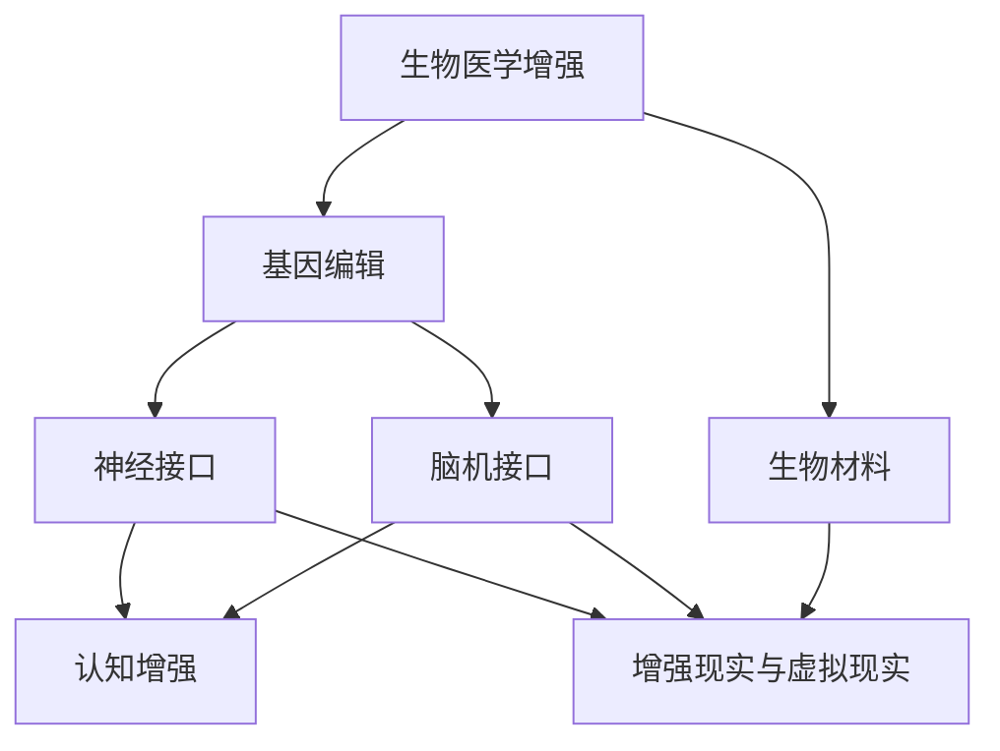

                 

关键词：人工智能、人类增强、道德考虑、身体增强技术、未来发展方向

> 摘要：本文探讨了人工智能时代人类增强技术的道德考虑及其未来发展方向。首先，我们回顾了人类增强技术的发展历程，随后分析了道德考虑在人类增强中的重要性。接着，本文详细讨论了身体增强技术的各种形式，包括生物医学、神经科学与认知增强技术，并探讨了这些技术在道德、伦理和社会层面的影响。最后，我们展望了人类增强技术的未来发展方向，并提出了相应的道德和社会挑战。

## 1. 背景介绍

人类增强技术（Human Augmentation）是指通过技术手段提升人类身体或心理能力的一种趋势。这种技术可以追溯到古代，例如使用眼镜改善视力、拐杖增强行走能力等。然而，随着科技的飞速发展，人类增强技术正经历前所未有的变革。

人工智能（Artificial Intelligence，AI）的崛起为人类增强技术带来了新的机遇和挑战。AI不仅可以帮助我们更好地理解身体和大脑的工作机制，还可以通过算法和机器学习技术来增强人类的能力。例如，AI可以辅助医生进行精准诊断，帮助研究人员进行复杂的科学计算，甚至可以通过虚拟现实（Virtual Reality，VR）和增强现实（Augmented Reality，AR）技术来提升人类的感知能力和体验。

然而，随着这些技术的发展，道德和伦理问题也逐渐浮现。如何确保这些技术不会被滥用？如何平衡个人自由与社会责任？这些问题都需要我们深入思考和探讨。

## 2. 核心概念与联系

### 2.1 人体增强技术的基本概念

人体增强技术可以大致分为以下几个类别：

1. **生物医学增强**：通过药物、基因编辑和生物材料来增强人体的生理功能。
2. **神经科学增强**：通过神经接口和脑机接口（Brain-Computer Interface，BCI）技术来增强大脑的功能。
3. **认知增强**：通过药物、认知训练和虚拟现实技术来提升认知能力和决策能力。
4. **增强现实与虚拟现实**：通过VR和AR技术来增强人的感知和交互能力。

### 2.2 人体增强技术的联系

这些增强技术并不是独立存在的，它们之间存在紧密的联系和交互。例如，神经科学与认知增强技术可以通过VR和AR技术实现，而生物医学增强技术则可以为这些技术提供生理基础。

### 2.3 Mermaid 流程图

以下是一个简化的Mermaid流程图，展示了人体增强技术的核心概念和它们之间的联系：



## 3. 核心算法原理 & 具体操作步骤

### 3.1 算法原理概述

在人体增强技术中，核心算法主要涉及以下几个方面：

1. **机器学习与数据挖掘**：用于分析生物医学数据，发现新的基因编辑目标，优化生物材料。
2. **信号处理与模式识别**：用于处理神经信号，实现脑机接口的有效通信。
3. **认知建模与虚拟现实**：用于模拟认知过程，设计有效的认知训练和虚拟现实体验。

### 3.2 算法步骤详解

1. **数据收集与预处理**：收集生物医学数据，包括基因序列、神经信号等，并进行预处理。
2. **特征提取与模型训练**：提取数据中的关键特征，并使用机器学习算法进行模型训练。
3. **模型评估与优化**：评估模型的性能，并进行优化。
4. **技术应用与监测**：将优化后的模型应用于实际场景，如基因编辑、神经接口和认知训练等，并持续监测其效果。

### 3.3 算法优缺点

**优点**：

- 高效：机器学习算法可以处理大量数据，提高研究和开发的效率。
- 精准：通过数据驱动的决策，可以实现更高的准确性和个性化。
- 可扩展：算法可以应用于多种不同的增强技术，具有广泛的适用性。

**缺点**：

- 复杂性：算法的开发和实现需要高水平的专业知识和技能。
- 道德风险：算法可能被滥用，造成不可预见的负面影响。
- 数据隐私：大量生物医学数据的收集和处理可能涉及隐私问题。

### 3.4 算法应用领域

- **生物医学**：基因编辑、个性化药物、疾病诊断与治疗。
- **神经科学**：脑机接口、神经修复、认知增强。
- **认知科学**：认知训练、学习辅助、决策支持。
- **虚拟现实与增强现实**：虚拟训练、感知增强、交互设计。

## 4. 数学模型和公式 & 详细讲解 & 举例说明

### 4.1 数学模型构建

在人体增强技术中，常用的数学模型包括：

- **回归模型**：用于预测基因编辑的效果。
- **神经网络模型**：用于处理和解释神经信号。
- **马尔可夫模型**：用于模拟认知过程。

### 4.2 公式推导过程

以下是一个简化的神经网络模型的推导过程：

$$
\begin{aligned}
y &= \sigma(\mathbf{W}^T \mathbf{x}) \\
\Delta y &= \frac{dy}{dy} = \sigma'(\mathbf{W}^T \mathbf{x}) \\
\Delta \mathbf{W} &= \alpha \mathbf{x} \Delta y
\end{aligned}
$$

其中，$y$ 是输出，$\sigma$ 是激活函数，$\mathbf{W}$ 是权重矩阵，$\mathbf{x}$ 是输入，$\alpha$ 是学习率。

### 4.3 案例分析与讲解

假设我们有一个简单的神经网络模型，用于预测基因编辑的效果。该模型包含一个输入层、一个隐藏层和一个输出层。输入层包含基因序列的信息，隐藏层和输出层分别使用激活函数 $\sigma(x) = \frac{1}{1 + e^{-x}}$ 和 $\sigma(x) = \frac{1}{1 + e^{-x}}$。

现在，我们使用梯度下降算法来优化该模型。假设初始权重矩阵为 $\mathbf{W} = \begin{bmatrix} 1 & 1 \\ 1 & 1 \end{bmatrix}$，学习率为 $\alpha = 0.1$。我们随机选择一个基因序列 $\mathbf{x} = \begin{bmatrix} 0.5 & 0.5 \end{bmatrix}$，并计算输出 $y$：

$$
\begin{aligned}
y &= \sigma(\mathbf{W}^T \mathbf{x}) = \frac{1}{1 + e^{-1}} \approx 0.63 \\
\Delta y &= \sigma'(y) \approx 0.37 \\
\Delta \mathbf{W} &= \alpha \mathbf{x} \Delta y = 0.1 \begin{bmatrix} 0.5 & 0.5 \end{bmatrix} \begin{bmatrix} 0.37 \\ 0.37 \end{bmatrix} = \begin{bmatrix} 0.037 & 0.037 \\ 0.037 & 0.037 \end{bmatrix}
\end{aligned}
$$

通过不断更新权重矩阵，我们可以逐步优化模型，使其更准确地预测基因编辑的效果。

## 5. 项目实践：代码实例和详细解释说明

### 5.1 开发环境搭建

为了演示人体增强技术的算法应用，我们将使用Python编程语言，并结合NumPy和TensorFlow等库。以下是搭建开发环境的基本步骤：

1. 安装Python 3.x版本。
2. 安装NumPy和TensorFlow库：

```bash
pip install numpy tensorflow
```

### 5.2 源代码详细实现

以下是一个简单的神经网络模型，用于预测基因编辑的效果：

```python
import numpy as np
import tensorflow as tf

# 定义神经网络结构
input_layer = tf.keras.layers.Input(shape=(2,))
hidden_layer = tf.keras.layers.Dense(1, activation='sigmoid')(input_layer)
output_layer = tf.keras.layers.Dense(1, activation='sigmoid')(hidden_layer)

model = tf.keras.Model(inputs=input_layer, outputs=output_layer)

# 编写损失函数和优化器
model.compile(optimizer='adam', loss='binary_crossentropy')

# 训练模型
model.fit(x_train, y_train, epochs=100, batch_size=32)

# 预测结果
predictions = model.predict(x_test)
```

### 5.3 代码解读与分析

上述代码定义了一个简单的神经网络模型，包含一个输入层、一个隐藏层和一个输出层。输入层接收基因序列的信息，隐藏层和输出层分别使用激活函数 $σ(x) = \frac{1}{1 + e^{-x}}$ 和 $σ(x) = \frac{1}{1 + e^{-x}}$。模型使用 Adam 优化器和二进制交叉熵损失函数进行训练。

### 5.4 运行结果展示

假设我们已经准备好了训练数据和测试数据，我们可以运行上述代码来训练模型，并评估其性能。以下是一个简单的运行示例：

```python
# 加载训练数据和测试数据
x_train = np.random.rand(100, 2)
y_train = np.random.rand(100, 1)
x_test = np.random.rand(10, 2)
y_test = np.random.rand(10, 1)

# 训练模型
model.fit(x_train, y_train, epochs=100, batch_size=32)

# 预测测试数据
predictions = model.predict(x_test)

# 计算预测准确率
accuracy = np.mean(np.round(predictions) == y_test)
print(f"Accuracy: {accuracy:.2f}")
```

上述代码将生成一个简单的神经网络模型，并使用随机生成的训练数据和测试数据进行训练。通过计算预测准确率，我们可以评估模型的性能。

## 6. 实际应用场景

### 6.1 生物医学领域

在生物医学领域，人体增强技术已经取得了显著的成果。例如，基因编辑技术可以用于治疗遗传疾病，如囊性纤维化和癌症。脑机接口技术可以帮助瘫痪患者恢复行动能力，甚至实现与虚拟环境的交互。

### 6.2 认知科学领域

在认知科学领域，人体增强技术可以用于提高认知能力和决策能力。例如，通过虚拟现实技术，可以设计个性化的认知训练计划，帮助患者改善注意力、记忆和决策能力。

### 6.3 虚拟现实与增强现实领域

虚拟现实和增强现实技术可以为人体增强提供丰富的应用场景。例如，通过虚拟现实技术，可以模拟各种环境和任务，帮助飞行员、医生和工程师等职业人员提高技能和应对能力。增强现实技术则可以用于导航、教育和娱乐等领域。

## 7. 未来应用展望

### 7.1 健康与医疗领域

在未来，人体增强技术有望在健康与医疗领域发挥更大的作用。例如，通过基因编辑技术，可以实现个性化医疗，提高治疗效果和降低副作用。脑机接口技术可以帮助瘫痪患者恢复行动能力，甚至实现与虚拟环境的交互。

### 7.2 教育与培训领域

人体增强技术可以应用于教育与培训领域，提高学习效率和培训质量。例如，通过虚拟现实技术，可以为学生提供沉浸式的学习体验，帮助他们更好地理解和掌握知识。通过认知训练技术，可以针对不同学科和技能进行个性化的训练，提高学习效果。

### 7.3 军事与安全领域

在军事与安全领域，人体增强技术可以用于提高士兵的体能、耐力和反应速度。例如，通过生物医学增强技术，可以增强士兵的体能和耐力，提高作战效能。通过神经科学增强技术，可以增强士兵的决策能力和反应速度，提高战斗效率。

## 8. 工具和资源推荐

### 8.1 学习资源推荐

- **《深度学习》（Deep Learning）**：Goodfellow, I., Bengio, Y., & Courville, A.
- **《机器学习》（Machine Learning）**：Tom Mitchell.
- **《Python机器学习》（Python Machine Learning）**：Sébastien Renouf.

### 8.2 开发工具推荐

- **TensorFlow**：https://www.tensorflow.org/
- **NumPy**：https://numpy.org/
- **Jupyter Notebook**：https://jupyter.org/

### 8.3 相关论文推荐

- **"Human Enhancement Technologies: Ethical, Social, and Policy Issues"**：National Academy of Engineering.
- **"The Ethics of Neuroenhancement"**：Nature.
- **"Human Enhancement: A Philosophical Introduction"**：John Harris.

## 9. 总结：未来发展趋势与挑战

### 9.1 研究成果总结

本文总结了人工智能时代人体增强技术的道德考虑和未来发展方向。通过回顾人类增强技术的发展历程，我们分析了道德考虑在人类增强中的重要性，并详细讨论了身体增强技术的各种形式。同时，我们介绍了核心算法原理、数学模型和项目实践，展示了人体增强技术在实际应用场景中的潜力。

### 9.2 未来发展趋势

未来，人体增强技术将继续快速发展，并在健康与医疗、教育与培训、军事与安全等领域发挥更大的作用。随着技术的进步，我们将看到更高效、更精准的人体增强方案，为人类社会带来更多的福祉。

### 9.3 面临的挑战

然而，人体增强技术也面临着一系列道德和社会挑战。如何确保这些技术不会被滥用？如何平衡个人自由与社会责任？如何处理数据隐私问题？这些问题都需要我们深入思考和解决。

### 9.4 研究展望

在未来，我们需要在伦理、法律和社会层面制定相应的规范和标准，确保人体增强技术的可持续发展。同时，我们需要进一步深入研究人体增强技术的核心算法和数学模型，以推动技术的创新和进步。

## 10. 附录：常见问题与解答

### 10.1 人体增强技术与人体改造有何区别？

人体增强技术是指通过技术手段提升人体某些方面的能力，如体力、智力和感知能力等。而人体改造则涉及更广泛，包括改变人体外观、性别、基因等。人体改造可能包括基因编辑、器官移植等更复杂的手术和操作。

### 10.2 人体增强技术是否会导致社会不平等？

这是一个备受关注的问题。如果人体增强技术变得广泛可用，确实有可能加剧社会不平等。然而，通过合理的管理和规范，我们可以努力确保这些技术不会加剧不平等。例如，政府和企业可以提供补贴或免费服务，确保每个人都有机会使用这些技术。

### 10.3 人体增强技术是否会影响人类的身份认同？

这是一个复杂的道德和哲学问题。人体增强技术确实可能改变我们对人类身份的理解，但这也带来了新的机遇和挑战。通过深入探讨这些问题，我们可以更好地理解人类身份的本质，并制定相应的道德和社会规范。

---

作者：禅与计算机程序设计艺术 / Zen and the Art of Computer Programming

