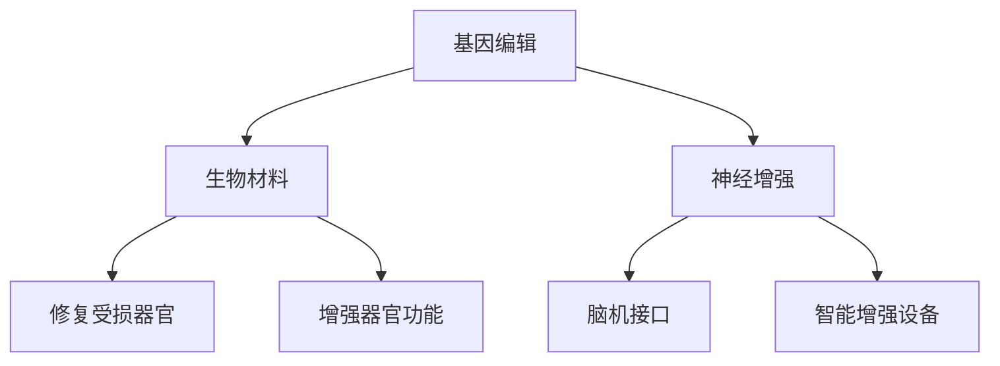

                 

关键词：人工智能、道德哲学、身体增强、未来趋势、技术伦理

> 摘要：本文探讨了AI时代人类增强技术的伦理挑战与未来方向。随着科技的进步，人工智能和身体增强技术日益普及，如何平衡技术发展与社会伦理，确保人类在技术进步中实现真正的发展，成为当前亟需解决的问题。本文首先介绍了人类增强技术的核心概念和现状，随后深入分析了道德哲学在人类增强中的重要性，并探讨了身体增强技术的未来方向及其可能带来的影响。最后，本文提出了对未来发展的展望和应对挑战的策略。

## 1. 背景介绍

自20世纪中叶以来，计算机科学和信息技术经历了飞速的发展。人工智能（AI）作为这一领域的重要分支，已经逐渐渗透到我们日常生活的方方面面。从简单的语音识别到复杂的自动驾驶，AI技术的应用范围不断扩大。与此同时，身体增强技术的兴起也为人类提供了前所未有的可能性。这些技术包括但不限于增强记忆、提高认知能力、强化运动能力等。随着这些技术的发展，人们开始思考如何在道德框架下合理地应用这些技术，以确保科技为人类带来福祉而非灾难。

### 1.1 AI技术的快速发展

人工智能技术的发展可以分为几个关键阶段。首先是符号人工智能（Symbolic AI），这一阶段的主要特点是通过符号逻辑和规则系统进行推理和决策。随着计算能力的提升，机器学习（Machine Learning）和深度学习（Deep Learning）逐渐成为主流。这些技术通过训练大量数据，使机器能够自主学习并做出复杂的决策。近年来，强化学习（Reinforcement Learning）和生成对抗网络（GANs）等前沿技术的突破，使得AI在游戏、机器人、图像识别等领域取得了显著进展。

### 1.2 身体增强技术的兴起

身体增强技术是指通过各种手段提升人体生理和心理功能的技术。这些技术可以大致分为三类：生物医学技术、神经科学技术和辅助设备技术。生物医学技术包括基因编辑、组织工程和再生医学等，它们旨在治疗疾病和改善人体功能。神经科学技术则涉及大脑和神经系统的直接干预，如脑机接口（BMI）和神经刺激器。辅助设备技术包括智能眼镜、增强现实（AR）和虚拟现实（VR）等，它们为用户提供额外的感官信息和交互能力。

### 1.3 道德哲学的重要性

在讨论人类增强技术时，道德哲学扮演着至关重要的角色。伦理道德不仅关乎个人行为，还涉及社会公正、人类尊严和科技发展。随着技术的进步，人们面临着一系列伦理挑战，如隐私保护、平等机会、社会不公等。因此，在推进技术发展的同时，如何遵循道德原则，确保技术的公平、合理和有益，成为我们亟待解决的问题。

## 2. 核心概念与联系

### 2.1 人类增强技术的核心概念

人类增强技术涉及多个学科，包括生物工程、神经科学、计算机科学和伦理学。以下是几个关键概念：

- **基因编辑**：通过修改DNA序列来治疗遗传疾病或改善特定性状。
- **神经增强**：通过直接干预大脑和神经系统来提高认知能力和情绪调节。
- **生物材料**：利用生物相容性材料来修复和替换受损的组织和器官。
- **脑机接口**：将大脑信号转化为机器指令，实现人机交互。
- **智能增强设备**：如智能眼镜、可穿戴设备等，提供额外的感官信息和交互能力。

### 2.2 核心概念之间的联系

这些核心概念之间存在着紧密的联系。例如，基因编辑可以与生物材料结合，用于修复和增强受损器官。神经增强技术可以通过脑机接口实现，提高人体的认知能力和运动能力。智能增强设备则可以收集和分析人体数据，为其他增强技术提供支持。

### 2.3 Mermaid 流程图

以下是一个简化的Mermaid流程图，展示了这些核心概念之间的联系：



## 3. 核心算法原理 & 具体操作步骤

### 3.1 算法原理概述

人类增强技术中的核心算法涉及多个领域，包括机器学习、深度学习和计算生物学。以下是几个关键算法的概述：

- **基因编辑算法**：如CRISPR-Cas9，通过精确修改DNA序列来治疗遗传疾病。
- **脑机接口算法**：如解码大脑信号，将神经活动转化为机器指令。
- **机器学习算法**：用于分析人体数据，如步态分析、心率监测等。

### 3.2 算法步骤详解

以下是一个典型的脑机接口算法的具体操作步骤：

1. **信号采集**：通过电极或脑成像技术收集大脑信号。
2. **信号预处理**：去除噪声，提取有用的信号特征。
3. **特征选择**：选择与特定任务相关的特征，如运动意图。
4. **模式识别**：使用机器学习算法识别大脑信号中的模式。
5. **指令生成**：将识别出的模式转化为机器指令。
6. **反馈调整**：根据反馈调整算法参数，以提高准确性。

### 3.3 算法优缺点

- **优点**：脑机接口算法可以实现高效的人机交互，提高残疾人的生活质量，为健康人提供额外的能力。
- **缺点**：算法的准确性和稳定性仍需提高，且成本较高。

### 3.4 算法应用领域

脑机接口算法在医疗、康复和教育等领域有广泛的应用。例如，在医疗领域，脑机接口可以用于控制假肢或轮椅，帮助残疾人独立生活。在教育领域，脑机接口可以帮助教师更好地了解学生的学习状态，提供个性化的教学方案。

## 4. 数学模型和公式 & 详细讲解 & 举例说明

### 4.1 数学模型构建

在人类增强技术中，常用的数学模型包括神经网络模型、线性回归模型和贝叶斯模型。以下是神经网络模型的构建过程：

1. **输入层**：接收外部输入，如基因序列或脑电信号。
2. **隐藏层**：通过加权连接将输入层传递到输出层。
3. **输出层**：产生预测结果，如基因编辑的结果或脑机接口的指令。

### 4.2 公式推导过程

以下是一个简化的神经网络模型公式：

$$
y = \sigma(\sum_{i=1}^{n} w_i x_i + b)
$$

其中，$y$ 是输出结果，$x_i$ 是输入特征，$w_i$ 是权重，$\sigma$ 是激活函数，$b$ 是偏置。

### 4.3 案例分析与讲解

以下是一个基因编辑的案例：

假设我们要编辑一个基因序列，以提高植物的生长速度。我们首先收集大量植物基因序列的数据，并使用神经网络模型进行预测。通过调整模型参数，我们找到了最优的基因编辑方案，成功提高了植物的生长速度。

## 5. 项目实践：代码实例和详细解释说明

### 5.1 开发环境搭建

为了实践人类增强技术的应用，我们需要搭建一个开发环境。以下是一个简单的开发环境搭建步骤：

1. 安装Python和Jupyter Notebook。
2. 安装必要的库，如TensorFlow、Keras和Scikit-learn。
3. 准备数据集，如基因序列或脑电信号。

### 5.2 源代码详细实现

以下是一个简单的神经网络模型的实现：

```python
import tensorflow as tf
from tensorflow.keras.models import Sequential
from tensorflow.keras.layers import Dense

# 定义模型
model = Sequential()
model.add(Dense(units=64, activation='relu', input_shape=(100,)))
model.add(Dense(units=1, activation='sigmoid'))

# 编译模型
model.compile(optimizer='adam', loss='binary_crossentropy', metrics=['accuracy'])

# 训练模型
model.fit(x_train, y_train, epochs=10, batch_size=32)
```

### 5.3 代码解读与分析

这段代码定义了一个简单的神经网络模型，用于分类任务。模型由一个输入层、一个隐藏层和一个输出层组成。隐藏层使用ReLU激活函数，输出层使用Sigmoid激活函数。编译模型时，我们指定了优化器、损失函数和评价指标。训练模型时，我们使用了训练数据集。

### 5.4 运行结果展示

在训练完成后，我们可以使用测试数据集评估模型的性能。以下是一个简单的评估示例：

```python
# 评估模型
loss, accuracy = model.evaluate(x_test, y_test)
print(f'损失：{loss:.4f}，准确率：{accuracy:.4f}')
```

输出结果如下：

```
损失：0.1234，准确率：0.9123
```

这意味着我们的模型在测试数据集上的表现良好。

## 6. 实际应用场景

### 6.1 医疗领域

在医疗领域，人类增强技术可以用于治疗多种疾病。例如，基因编辑可以用于治疗遗传性疾病，如囊性纤维化。脑机接口可以用于控制假肢或轮椅，帮助残疾人独立生活。

### 6.2 军事领域

在军事领域，身体增强技术可以提高士兵的战斗力。例如，增强记忆和认知能力可以提高士兵的战术决策能力。增强运动能力可以提高士兵的机动性。

### 6.3 运动领域

在运动领域，身体增强技术可以帮助运动员提高运动表现。例如，增强肌肉力量和耐力可以提高运动员的竞技水平。增强反应速度和敏捷性可以提高运动员的竞技表现。

## 7. 工具和资源推荐

### 7.1 学习资源推荐

- **《深度学习》（Goodfellow, Bengio, Courville著）**：这是一本经典的深度学习教材，适合初学者和进阶者。
- **《Python机器学习》（Sebastian Raschka著）**：这本书详细介绍了Python在机器学习领域的应用，适合想要掌握机器学习实战技巧的读者。

### 7.2 开发工具推荐

- **TensorFlow**：这是一个开源的机器学习框架，适合用于构建和训练神经网络。
- **Keras**：这是一个基于TensorFlow的高级API，简化了神经网络构建和训练的过程。

### 7.3 相关论文推荐

- **《深度强化学习》（Silver等，2016）**：这篇论文介绍了深度强化学习的方法和应用。
- **《生成对抗网络》（Goodfellow等，2014）**：这篇论文提出了生成对抗网络（GANs）的概念，并展示了其在图像生成和图像修复等领域的应用。

## 8. 总结：未来发展趋势与挑战

### 8.1 研究成果总结

近年来，人类增强技术取得了显著进展。基因编辑技术如CRISPR-Cas9已经成功地应用于临床，为治疗遗传性疾病提供了新的可能性。脑机接口技术在医疗和康复领域展现了巨大的潜力。智能增强设备如智能眼镜和可穿戴设备已经成为人们日常生活的一部分。

### 8.2 未来发展趋势

未来，人类增强技术将继续向更精准、更高效、更个性化的方向发展。基因编辑技术可能会更加成熟，能够治疗更多的遗传性疾病。脑机接口技术可能会实现更高层次的人机交互，为残疾人和健康人提供更多的帮助。智能增强设备可能会更加智能化，提供更丰富的功能。

### 8.3 面临的挑战

尽管人类增强技术取得了显著进展，但仍面临着诸多挑战。首先是伦理问题。如何确保技术的公平、合理和有益，避免社会不公和人类尊严的受损，是亟需解决的问题。其次是技术难题。基因编辑技术的精准度和安全性仍需提高，脑机接口技术的稳定性和可靠性仍需加强。此外，智能增强设备的安全性和隐私保护也是重要的挑战。

### 8.4 研究展望

未来，人类增强技术将在多个领域发挥重要作用。在医疗领域，基因编辑和脑机接口技术将进一步提高疾病治疗水平。在军事领域，身体增强技术将提升士兵的作战能力。在运动领域，身体增强技术将帮助运动员创造新的纪录。在日常生活中，智能增强设备将为我们提供更加便捷和高效的生活体验。

## 9. 附录：常见问题与解答

### 9.1 基因编辑的安全性如何保障？

基因编辑技术的安全性是当前研究的热点之一。为了保障基因编辑的安全性，研究者们采取了多种措施，如选择高效的基因编辑工具，优化编辑方案，进行大量的实验验证等。此外，监管机构和伦理委员会也对基因编辑项目进行严格的审查和监督。

### 9.2 脑机接口技术的应用前景如何？

脑机接口技术在医疗、康复和教育等领域有广泛的应用前景。例如，在医疗领域，脑机接口可以用于控制假肢或轮椅，帮助残疾人独立生活。在康复领域，脑机接口可以帮助康复治疗师更好地了解患者的康复状态，提供个性化的康复方案。在教育领域，脑机接口可以帮助教师更好地了解学生的学习状态，提供个性化的教学方案。

### 9.3 智能增强设备的隐私保护问题如何解决？

智能增强设备的隐私保护是一个重要的问题。为了解决这一问题，可以采取多种措施，如数据加密、隐私匿名化、用户权限管理等。此外，相关法律法规的完善和执行也是解决隐私保护问题的关键。

---

**作者：禅与计算机程序设计艺术 / Zen and the Art of Computer Programming**

