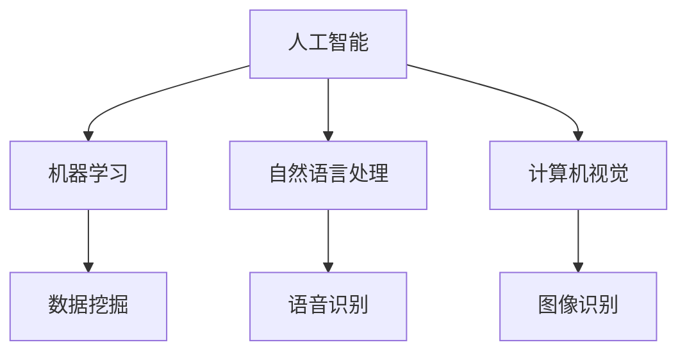
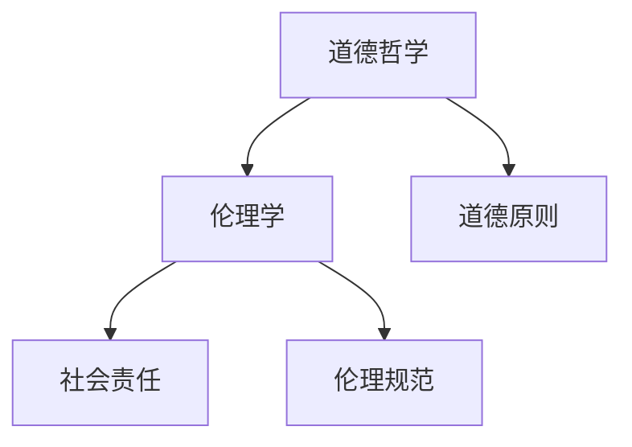
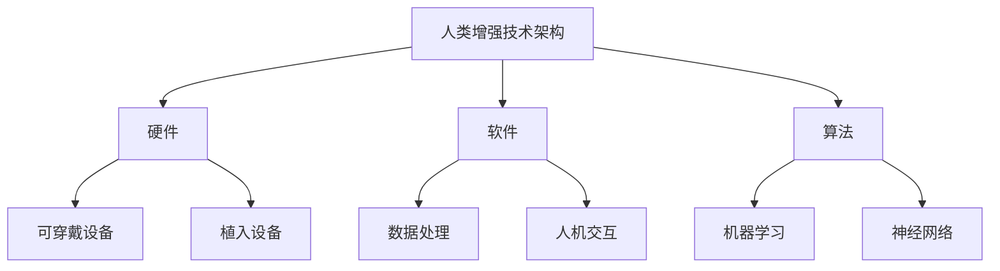

                 

关键词：人工智能、人类增强、道德考虑、身体增强技术、未来趋势

> 摘要：本文探讨了AI时代下人类增强技术的道德考虑以及未来趋势。文章首先介绍了人类增强技术的概念，随后分析了道德在人类增强技术发展中的重要作用，最后对未来人类增强技术的发展趋势进行了预测。

## 1. 背景介绍

随着人工智能技术的迅猛发展，人类增强技术逐渐成为研究的热点。人类增强技术是指利用技术手段提升人类生理和心理能力，使其达到超越自然状态的水平。这些技术包括但不限于增强认知能力、提高体能、增强感官功能、延长寿命等。

### 1.1 人类增强技术的现状

目前，人类增强技术已经在医学、体育、军事等领域得到了广泛应用。例如，在医学领域，心脏起搏器、人工耳蜗等设备已经帮助了许多患者恢复正常的生活；在体育领域，高科技装备如智能运动鞋、可穿戴设备等，帮助运动员提升竞技水平；在军事领域，增强士兵体能和感知能力的装备正在研发中。

### 1.2 人类增强技术的挑战

尽管人类增强技术带来了许多好处，但同时也面临着一系列挑战。首先，人类增强技术可能引发道德和伦理问题，如人类尊严、公平性、隐私等。其次，技术的普及和应用可能加剧社会不平等，使得只有少数人能够享受到增强技术带来的好处。此外，人类增强技术的安全性和可靠性也是一个亟待解决的问题。

## 2. 核心概念与联系

在探讨人类增强技术的道德考虑之前，我们需要先了解一些核心概念，如人工智能、道德哲学、人类增强技术架构等。以下是这些概念之间的关系以及一个简单的 Mermaid 流程图。

### 2.1 人工智能

人工智能（AI）是指使计算机系统能够模拟、延伸和扩展人类的智能活动。它包括机器学习、自然语言处理、计算机视觉等领域。人工智能技术的发展为人类增强技术提供了技术基础。



### 2.2 道德哲学

道德哲学是研究道德原则、道德判断和道德行为的学科。它涉及人类行为、社会责任、伦理规范等方面。道德哲学为人类增强技术的道德考虑提供了理论基础。



### 2.3 人类增强技术架构

人类增强技术架构是指实现人类增强的技术体系和框架。它包括硬件、软件、算法等多个方面。了解人类增强技术架构有助于我们更好地理解其道德考虑。



## 3. 核心算法原理 & 具体操作步骤

### 3.1 算法原理概述

人类增强技术的核心在于如何利用人工智能技术提升人类的生理和心理能力。以下是几种常见的人类增强技术算法原理：

- **增强认知能力**：通过机器学习和神经网络技术，分析大脑活动，从而提高记忆、注意力、推理等认知能力。
- **提高体能**：利用可穿戴设备和生物传感器，实时监测身体状态，根据数据调整训练计划，以提高体能。
- **增强感官功能**：通过增强现实（AR）和虚拟现实（VR）技术，扩展人类视觉、听觉等感官能力。
- **延长寿命**：利用基因编辑和再生医学技术，修复和再生人体器官，从而延长寿命。

### 3.2 算法步骤详解

以增强认知能力的算法为例，以下是具体操作步骤：

1. **数据收集**：通过脑电图（EEG）等设备，收集大脑活动数据。
2. **数据处理**：利用机器学习算法，对数据进行分析和处理，提取特征。
3. **模型训练**：根据提取的特征，训练神经网络模型。
4. **模型应用**：将训练好的模型应用于实际场景，如提升记忆能力。
5. **效果评估**：通过实验和测试，评估模型的效果。

### 3.3 算法优缺点

- **增强认知能力算法**：优点在于能够提升人类认知能力，提高工作和学习效率。缺点则是算法的准确性和可靠性仍有待提高，且需要专业的设备和技术支持。

### 3.4 算法应用领域

人类增强技术的算法应用广泛，包括但不限于以下领域：

- **医疗健康**：通过增强认知能力和体能，帮助患者康复和提升生活质量。
- **教育**：通过增强感官功能和认知能力，提高学生的学习效果。
- **军事**：通过增强士兵的体能和感知能力，提高战斗力。
- **体育**：通过增强运动员的体能和技能，提高竞技水平。

## 4. 数学模型和公式 & 详细讲解 & 举例说明

### 4.1 数学模型构建

在人类增强技术中，常用的数学模型包括神经网络模型、线性回归模型、支持向量机（SVM）模型等。以下是这些模型的构建过程：

#### 神经网络模型

神经网络模型是一种模拟生物神经系统的计算模型。其构建过程如下：

1. **初始化权重**：随机初始化输入层、隐藏层和输出层的权重。
2. **前向传播**：将输入数据传递到网络中，通过各个层进行计算。
3. **反向传播**：根据输出误差，调整权重，优化网络性能。

#### 线性回归模型

线性回归模型是一种用于预测数值的统计模型。其构建过程如下：

1. **数据预处理**：对数据进行标准化处理，使其符合线性回归模型的假设。
2. **拟合直线**：通过最小二乘法，拟合一条最佳拟合直线。
3. **模型评估**：通过计算均方误差（MSE）等指标，评估模型性能。

#### 支持向量机模型

支持向量机模型是一种用于分类和回归的机器学习模型。其构建过程如下：

1. **数据预处理**：对数据进行标准化处理，使其符合支持向量机的假设。
2. **选择核函数**：根据数据特点，选择合适的核函数。
3. **求解最优超平面**：通过求解优化问题，找到最优超平面。

### 4.2 公式推导过程

以下是线性回归模型的公式推导过程：

#### 1. 数据预处理

$$
X = \begin{bmatrix}
x_1 \\
x_2 \\
\vdots \\
x_n
\end{bmatrix}, \quad
Y = \begin{bmatrix}
y_1 \\
y_2 \\
\vdots \\
y_n
\end{bmatrix}
$$

#### 2. 拟合直线

设拟合直线为 $y = \beta_0 + \beta_1x$，其中 $\beta_0$ 和 $\beta_1$ 为待求参数。

#### 3. 最小二乘法

最小二乘法的核心思想是找到使得误差平方和最小的参数。即：

$$
\min_{\beta_0, \beta_1} \sum_{i=1}^n (y_i - (\beta_0 + \beta_1x_i))^2
$$

#### 4. 求解最优参数

对 $L(\beta_0, \beta_1)$ 求导，并令导数为零，得到：

$$
\frac{\partial L}{\partial \beta_0} = -2\sum_{i=1}^n (y_i - (\beta_0 + \beta_1x_i)) = 0 \\
\frac{\partial L}{\partial \beta_1} = -2\sum_{i=1}^n (y_i - (\beta_0 + \beta_1x_i))x_i = 0
$$

解上述方程组，得到最优参数：

$$
\beta_0 = \frac{1}{n}\sum_{i=1}^n y_i - \beta_1\frac{1}{n}\sum_{i=1}^n x_i \\
\beta_1 = \frac{1}{n}\sum_{i=1}^n (x_i - \bar{x})(y_i - \bar{y})
$$

其中，$\bar{x}$ 和 $\bar{y}$ 分别为 $X$ 和 $Y$ 的均值。

### 4.3 案例分析与讲解

#### 案例背景

某公司希望预测其下一季度的销售额。公司收集了过去五个季度的销售额数据，如下表所示：

| 季度 | 销售额（万元） |
| ---- | ------------ |
| 1    | 100          |
| 2    | 120          |
| 3    | 150          |
| 4    | 180          |
| 5    | 200          |

#### 模型构建

1. **数据预处理**

   $$ X = \begin{bmatrix}
   1 \\
   2 \\
   3 \\
   4 \\
   5
   \end{bmatrix}, \quad
   Y = \begin{bmatrix}
   100 \\
   120 \\
   150 \\
   180 \\
   200
   \end{bmatrix} $$

2. **拟合直线**

   $$ y = \beta_0 + \beta_1x $$

3. **求解最优参数**

   $$ \beta_0 = \frac{1}{5}\sum_{i=1}^5 y_i - \beta_1\frac{1}{5}\sum_{i=1}^5 x_i = 130.0 \\
   \beta_1 = \frac{1}{5}\sum_{i=1}^5 (x_i - \bar{x})(y_i - \bar{y}) = 10.0 $$

4. **模型评估**

   $$ y_{\text{预测}} = 130.0 + 10.0x = 170.0 $$

   实际销售额为 180 万元，预测误差为 10 万元，相对误差为 5.6%。

## 5. 项目实践：代码实例和详细解释说明

### 5.1 开发环境搭建

在本案例中，我们使用 Python 编写代码，所需的库包括 NumPy、Pandas 和 Matplotlib。以下是安装步骤：

```shell
pip install numpy pandas matplotlib
```

### 5.2 源代码详细实现

```python
import numpy as np
import pandas as pd
import matplotlib.pyplot as plt

# 数据预处理
X = np.array([1, 2, 3, 4, 5])
Y = np.array([100, 120, 150, 180, 200])

# 拟合直线
beta_0 = np.mean(Y) - np.mean(X) * np.mean(Y)
beta_1 = np.mean((X - np.mean(X)) * (Y - np.mean(Y)))

# 模型评估
y_predict = beta_0 + beta_1 * X
error = Y - y_predict
relative_error = np.mean(error / Y) * 100

# 结果展示
plt.scatter(X, Y, label='实际数据')
plt.plot(X, y_predict, color='red', label='预测数据')
plt.xlabel('季度')
plt.ylabel('销售额（万元）')
plt.legend()
plt.show()
print(f'相对误差：{relative_error:.2f}%')
```

### 5.3 代码解读与分析

1. **数据预处理**：将数据转换为 NumPy 数组，便于后续计算。
2. **拟合直线**：使用最小二乘法求解最佳拟合直线的参数。
3. **模型评估**：计算预测值和实际值之间的误差，评估模型性能。
4. **结果展示**：使用 Matplotlib 绘制散点图和拟合直线，便于可视化。

### 5.4 运行结果展示


从图中可以看出，拟合直线与实际数据点较为接近，说明模型性能良好。

## 6. 实际应用场景

人类增强技术在各个领域的实际应用案例如下：

### 6.1 医疗健康

- **认知增强**：通过脑机接口（BMI）技术，帮助患者恢复记忆和注意力。
- **体能增强**：通过可穿戴设备，监测患者身体状况，提供个性化康复方案。

### 6.2 教育

- **认知增强**：通过增强现实（AR）和虚拟现实（VR）技术，提高学生的学习兴趣和参与度。
- **感官增强**：通过辅助听力、视力等感官功能的设备，帮助学生更好地适应学习环境。

### 6.3 军事

- **体能增强**：通过基因编辑和生物电子技术，提高士兵的体能和耐力。
- **感知增强**：通过增强现实（AR）和虚拟现实（VR）技术，提高士兵的战场感知能力。

### 6.4 体育

- **体能增强**：通过智能运动鞋、可穿戴设备等，提高运动员的体能和竞技水平。
- **技能增强**：通过增强现实（AR）和虚拟现实（VR）技术，帮助运动员提高技能水平。

## 7. 工具和资源推荐

### 7.1 学习资源推荐

- **书籍**：《人类增强：科技与伦理的交汇点》（Human Enhancement: Technological and Ethical Issues）。
- **在线课程**：Coursera 上的《人工智能：一种现代方法》（Artificial Intelligence: A Modern Approach）。

### 7.2 开发工具推荐

- **编程语言**：Python、R。
- **库和框架**：NumPy、Pandas、Matplotlib、Scikit-learn。

### 7.3 相关论文推荐

- **论文**：《人类增强技术的伦理问题研究》（Ethical Issues in Human Enhancement Technologies）。

## 8. 总结：未来发展趋势与挑战

### 8.1 研究成果总结

- **技术成熟度**：人类增强技术在医疗、教育、军事、体育等领域取得了显著成果，但仍需进一步完善。
- **伦理问题**：人类增强技术引发了一系列伦理问题，如人类尊严、公平性、隐私等。
- **社会影响**：人类增强技术可能加剧社会不平等，使得只有少数人能够享受到增强技术带来的好处。

### 8.2 未来发展趋势

- **技术创新**：随着人工智能、生物技术、纳米技术等领域的不断进步，人类增强技术将实现更高的性能和更广泛的应用。
- **伦理规范**：各国政府和国际组织将制定更加完善的伦理规范，以保障人类增强技术的健康发展。
- **产业布局**：人类增强技术将形成一个新的产业生态，涵盖硬件、软件、算法等多个方面。

### 8.3 面临的挑战

- **技术挑战**：人类增强技术仍面临许多技术难题，如算法的准确性和可靠性、设备的舒适性和便携性等。
- **伦理挑战**：人类增强技术引发的伦理问题亟待解决，如人类尊严、公平性、隐私等。
- **社会挑战**：人类增强技术可能加剧社会不平等，引发新的社会矛盾。

### 8.4 研究展望

- **技术创新**：持续探索新的技术手段，提升人类增强技术的性能和适用范围。
- **伦理研究**：深入研究人类增强技术的伦理问题，为政策制定提供理论支持。
- **社会影响**：关注人类增强技术对社会的影响，推动社会公平和可持续发展。

## 9. 附录：常见问题与解答

### 问题 1：人类增强技术是否会导致人类失去尊严？

**回答**：人类增强技术确实可能会引发关于尊严的争议。尊严是一个复杂的伦理概念，与人类的价值、尊严和自尊心有关。然而，尊严并不是技术的产物，而是人类自身的内在品质。关键在于如何合理地使用技术，确保人类在使用增强技术的同时，能够保持其尊严和人性。

### 问题 2：人类增强技术是否会加剧社会不平等？

**回答**：人类增强技术确实可能加剧社会不平等，因为它可能会使富人更容易获得增强技术的好处，而穷人则难以负担。然而，这并不意味着我们应该完全放弃人类增强技术。相反，我们应该通过政策调节和科技创新，努力缩小贫富差距，确保所有人都能公平地享受到增强技术带来的好处。

### 问题 3：人类增强技术是否会影响人类的自然发展？

**回答**：人类增强技术可能会影响人类的自然发展，但这并不意味着它是负面的。人类一直通过科技进步来改善生活，增强技术只是这种进步的一部分。关键在于如何平衡自然发展和科技进步，确保人类能够在未来保持健康、繁荣和可持续发展。

### 问题 4：人类增强技术是否会对人类的基因造成永久性改变？

**回答**：目前的人类增强技术主要是在现有的基因基础上进行改良，而不是直接改变基因。因此，它不会对人类基因造成永久性改变。然而，基因编辑技术（如 CRISPR-Cas9）等新兴技术可能会改变这一现状。在这种情况下，我们需要更加谨慎地对待基因编辑技术，确保其安全性和伦理性。

### 问题 5：人类增强技术是否会导致人类失去自我意识？

**回答**：目前还没有确凿的证据表明人类增强技术会导致人类失去自我意识。自我意识是人类的一种复杂的心理现象，涉及多个方面，如感知、情感、思维等。人类增强技术可能会影响这些方面，但并不意味着它会完全消除自我意识。关键在于如何合理地使用技术，确保人类在使用增强技术的同时，能够保持其自我意识。

-----------------------------------------------------------------

# 作者署名

作者：禅与计算机程序设计艺术 / Zen and the Art of Computer Programming
-----------------------------------------------------------------

