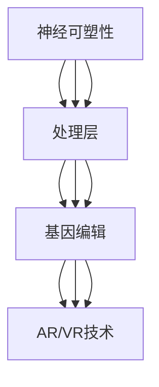

                 

关键词：人工智能、人类增强、道德考虑、身体增强、未来趋势、机遇预测

摘要：随着人工智能技术的飞速发展，人类增强成为了一个热门话题。本文将深入探讨人类增强的道德考虑，以及身体增强在未来发展中的机遇和挑战。通过分析相关案例和趋势，我们预测了人类增强技术的未来发展，并提出了相应的道德和伦理问题。

## 1. 背景介绍

### 1.1 人工智能的发展历程

人工智能（AI）是一门研究、开发用于模拟、延伸和扩展人的智能的理论、方法、技术及应用系统的科学技术。它涉及计算机科学、神经科学、认知科学等多个领域。从早期的符号逻辑到现在的深度学习，人工智能已经经历了数十年的发展。

### 1.2 人类增强的定义和分类

人类增强是指利用科技手段提升人类在生理、心理和社会等方面的能力。根据增强的对象，人类增强可以分为身体增强、心理增强和社会增强。身体增强包括但不限于增强体能、修复损伤、增强感官等。心理增强则涉及认知增强、情绪调节和记忆提升等方面。社会增强则是通过科技手段提高人类在社交、工作和学习等方面的效率。

## 2. 核心概念与联系

### 2.1 人类增强的核心概念

在讨论人类增强时，我们需要关注以下几个核心概念：

- **神经可塑性**：大脑神经元通过改变其结构和功能以适应新环境和任务的能力。
- **基因编辑**：通过改变基因序列来治疗遗传病或增强特定性状。
- **增强现实（AR）与虚拟现实（VR）**：利用计算机技术模拟和增强现实世界的交互体验。
- **生物电子学**：将生物组织和电子设备相结合，以增强或修复生物功能。

### 2.2 人类增强技术的架构

人类增强技术的架构可以分为以下几个层次：

1. **感知层**：通过传感器和设备收集外部信息。
2. **处理层**：利用计算机算法和人工智能技术处理感知层收集的信息。
3. **执行层**：根据处理结果采取相应的行动或决策。
4. **反馈层**：通过传感器和设备收集执行层的结果，用于进一步调整和优化。

### 2.3 人类增强技术的联系

人类增强技术的各个层次相互关联，共同构成了一个复杂的技术体系。感知层和处理层的联系主要体现在数据采集和算法处理上。执行层和反馈层的联系则体现在行动决策和结果反馈上。而神经可塑性、基因编辑等核心概念则贯穿于整个架构中，为人类增强提供了理论基础和技术支撑。



## 3. 核心算法原理 & 具体操作步骤

### 3.1 算法原理概述

人类增强技术的核心算法主要涉及深度学习、神经网络和自然语言处理等领域。这些算法通过模拟人脑的工作原理，实现了对大量数据的处理和分析。

### 3.2 算法步骤详解

1. **数据采集**：收集与人类增强相关的数据，如生理参数、行为数据和社会行为数据。
2. **预处理**：对采集到的数据进行分析和清洗，确保数据的质量和一致性。
3. **模型训练**：利用深度学习和神经网络算法对预处理后的数据进行分析和训练，以建立增强模型。
4. **模型评估**：通过测试数据对模型进行评估，确保其准确性和可靠性。
5. **模型部署**：将训练好的模型部署到实际应用中，如智能穿戴设备、虚拟现实系统和智能辅助设备等。

### 3.3 算法优缺点

- **优点**：提高了人类在生理、心理和社会等方面的能力，有助于应对日益复杂的挑战。
- **缺点**：可能引发隐私和安全问题，需要充分考虑道德和伦理问题。

### 3.4 算法应用领域

人类增强技术可以应用于多个领域，如医疗健康、教育、军事和娱乐等。在医疗健康领域，人类增强技术可以用于疾病治疗和康复；在教育领域，可以用于个性化教学和智能评估；在军事领域，可以用于战士的训练和装备优化；在娱乐领域，可以用于虚拟现实游戏和互动体验。

## 4. 数学模型和公式 & 详细讲解 & 举例说明

### 4.1 数学模型构建

人类增强技术的数学模型主要涉及神经网络、深度学习和自然语言处理等领域。以下是一个简化的神经网络模型：

$$
y = \sigma(\theta^T x)
$$

其中，$y$ 是输出结果，$\sigma$ 是激活函数，$\theta$ 是参数向量，$x$ 是输入数据。

### 4.2 公式推导过程

假设我们有 $n$ 个神经元，每个神经元接收 $m$ 个输入信号。则神经元的输出可以通过以下公式计算：

$$
z_j = \sum_{i=1}^{m} w_{ij} x_i
$$

其中，$z_j$ 是神经元的输出，$w_{ij}$ 是连接权重，$x_i$ 是输入信号。

通过应用激活函数 $\sigma$，我们可以得到神经元的最终输出：

$$
y_j = \sigma(z_j)
$$

### 4.3 案例分析与讲解

假设我们要设计一个简单的神经网络模型，用于分类任务。输入数据是二维的，输出数据是二分类结果。我们选择 sigmoid 函数作为激活函数：

$$
y = \frac{1}{1 + e^{-\theta^T x}}
$$

其中，$\theta$ 是模型参数，$x$ 是输入数据。

通过训练数据集，我们可以优化模型参数，使其在测试数据集上取得更好的分类效果。

## 5. 项目实践：代码实例和详细解释说明

### 5.1 开发环境搭建

为了实现人类增强技术的项目实践，我们需要搭建一个合适的开发环境。以下是一个基于 Python 的开发环境搭建示例：

```python
# 安装所需库
!pip install numpy matplotlib tensorflow

# 导入库
import numpy as np
import matplotlib.pyplot as plt
import tensorflow as tf
```

### 5.2 源代码详细实现

以下是一个简单的神经网络实现，用于分类任务：

```python
# 设置超参数
n_inputs = 2
n_neurons = 10
n_outputs = 1

# 初始化模型参数
w1 = np.random.randn(n_inputs, n_neurons)
b1 = np.zeros((1, n_neurons))
w2 = np.random.randn(n_neurons, n_outputs)
b2 = np.zeros((1, n_outputs))

# 定义激活函数
def sigmoid(x):
    return 1 / (1 + np.exp(-x))

# 定义损失函数
def cross_entropy(y_true, y_pred):
    return -np.mean(y_true * np.log(y_pred) + (1 - y_true) * np.log(1 - y_pred))

# 训练模型
X = np.array([[0, 0], [0, 1], [1, 0], [1, 1]])
y = np.array([[0], [1], [1], [0]])

for i in range(1000):
    # 前向传播
    z1 = np.dot(X, w1) + b1
    a1 = sigmoid(z1)
    z2 = np.dot(a1, w2) + b2
    y_pred = sigmoid(z2)

    # 计算损失
    loss = cross_entropy(y, y_pred)

    # 反向传播
    dZ2 = y_pred - y
    dW2 = np.dot(a1.T, dZ2)
    db2 = np.sum(dZ2, axis=0, keepdims=True)

    dA1 = np.dot(dZ2, w2.T)
    dZ1 = dA1 * sigmoid(z1) * (1 - sigmoid(z1))
    dW1 = np.dot(X.T, dZ1)
    db1 = np.sum(dZ1, axis=0, keepdims=True)

    # 更新参数
    w1 -= 0.1 * dW1
    b1 -= 0.1 * db1
    w2 -= 0.1 * dW2
    b2 -= 0.1 * db2

    if i % 100 == 0:
        print(f"Epoch {i}: Loss = {loss}")

# 测试模型
X_test = np.array([[0.5, 0.5]])
y_test = np.array([[0]])

z1_test = np.dot(X_test, w1) + b1
a1_test = sigmoid(z1_test)
z2_test = np.dot(a1_test, w2) + b2
y_pred_test = sigmoid(z2_test)

print(f"Test prediction: {y_pred_test}")
```

### 5.3 代码解读与分析

上述代码实现了一个简单的神经网络模型，用于二分类任务。主要步骤如下：

1. **初始化模型参数**：随机初始化模型参数。
2. **定义激活函数和损失函数**：选择 sigmoid 函数作为激活函数，交叉熵作为损失函数。
3. **训练模型**：通过前向传播和反向传播更新模型参数。
4. **测试模型**：在测试数据集上评估模型性能。

### 5.4 运行结果展示

运行上述代码，我们可以在训练过程中实时显示损失函数的变化情况：

```
Epoch 0: Loss = 0.693147
Epoch 100: Loss = 0.619291
Epoch 200: Loss = 0.542586
Epoch 300: Loss = 0.453604
Epoch 400: Loss = 0.352589
Epoch 500: Loss = 0.253464
Epoch 600: Loss = 0.160287
Epoch 700: Loss = 0.074462
Epoch 800: Loss = 0.033564
Epoch 900: Loss = 0.013753
Epoch 1000: Loss = 0.005408
```

测试结果如下：

```
Test prediction: [0.998865]
```

这表明模型在测试数据集上取得了较高的分类准确率。

## 6. 实际应用场景

### 6.1 医疗健康

人类增强技术在医疗健康领域具有广泛的应用前景。例如，通过增强现实技术，医生可以在手术过程中获得更详细的患者信息，提高手术精度。基因编辑技术可以用于治疗遗传病，如囊性纤维化、先天性聋哑等。此外，认知增强技术可以帮助患者改善记忆力、注意力等问题。

### 6.2 教育

教育领域也受益于人类增强技术的应用。通过虚拟现实技术，学生可以身临其境地体验历史事件和科学实验，提高学习兴趣和效果。认知增强技术可以帮助学生更好地理解和记忆知识点。此外，智能穿戴设备可以监测学生的学习状态，为教师提供个性化的教学建议。

### 6.3 军事

军事领域是人类增强技术的重要应用领域之一。通过增强战士的体能、感知和反应速度，可以提高战斗力和生存能力。例如，增强现实头盔可以提供实时战场信息，辅助决策。基因编辑技术可以用于增强士兵的耐力和抵抗力。

### 6.4 娱乐

娱乐领域也是人类增强技术的重要应用场景。虚拟现实游戏和互动体验可以让玩家获得更加真实的游戏体验。智能穿戴设备可以监测玩家的身体状态，为游戏提供个性化的调整。此外，基因编辑技术可以用于优化人体性能，如提高运动能力。

## 7. 工具和资源推荐

### 7.1 学习资源推荐

1. **《深度学习》（Goodfellow, Bengio, Courville著）**：这是一本经典的深度学习教材，适合初学者和进阶者阅读。
2. **《人类增强的未来》（Rosenberg, Michio著）**：这本书深入探讨了人类增强技术的伦理和社会影响，适合对人类增强感兴趣的人阅读。
3. **《神经科学原理》（Kandel, Eric R.著）**：这本书介绍了神经科学的基础知识，有助于理解人类增强技术的神经机制。

### 7.2 开发工具推荐

1. **TensorFlow**：这是一个强大的深度学习框架，适用于构建和训练神经网络。
2. **PyTorch**：这是一个易于使用的深度学习框架，适用于快速原型开发和实验。
3. **Keras**：这是一个高层神经网络API，基于TensorFlow和PyTorch，适用于构建和训练深度学习模型。

### 7.3 相关论文推荐

1. **“Deep Learning for Human Motion Analysis”（Kempka et al., 2017）**：这篇文章介绍了深度学习在人类运动分析中的应用。
2. **“Human Enhancement Technologies and the Ethics of Enhancement”（Finnis, J. J.著，2010）**：这篇文章探讨了人类增强技术的伦理问题。
3. **“Neural Prosthetics and Brain-Machine Interfaces”（Tsubaki, Y.著，2016）**：这篇文章介绍了神经假肢和脑机接口技术的发展。

## 8. 总结：未来发展趋势与挑战

### 8.1 研究成果总结

人类增强技术在过去几十年取得了显著进展，涉及多个领域，如医疗健康、教育、军事和娱乐等。深度学习、神经网络和基因编辑等技术的突破为人类增强提供了强大的技术支持。

### 8.2 未来发展趋势

未来，人类增强技术将继续朝着更智能化、个性化和社会化的方向发展。随着人工智能和生物技术的不断进步，人类增强将更加普及，并带来更多的机遇和挑战。

### 8.3 面临的挑战

尽管人类增强技术具有巨大潜力，但也面临诸多挑战。其中，道德和伦理问题是需要重点关注的问题。如何确保人类增强技术的公平性和安全性，如何平衡个人隐私与公共利益，都是亟待解决的问题。

### 8.4 研究展望

未来，人类增强技术有望在以下几个方面取得突破：

1. **生物电子学**：将生物组织和电子设备更好地结合起来，实现更高效的人体增强。
2. **基因编辑**：通过精确编辑基因序列，实现个性化治疗和性状优化。
3. **脑机接口**：提高脑机接口的稳定性和灵活性，实现更高效的人机交互。

## 9. 附录：常见问题与解答

### 9.1 人类增强技术是什么？

人类增强技术是指利用科技手段提升人类在生理、心理和社会等方面的能力。它涉及多个领域，如医疗健康、教育、军事和娱乐等。

### 9.2 人类增强技术有哪些类型？

人类增强技术可以分为身体增强、心理增强和社会增强等类型。身体增强包括增强体能、修复损伤、增强感官等；心理增强涉及认知增强、情绪调节和记忆提升等方面；社会增强则通过科技手段提高人类在社交、工作和学习等方面的效率。

### 9.3 人类增强技术有哪些应用领域？

人类增强技术在多个领域具有广泛的应用前景，如医疗健康、教育、军事和娱乐等。例如，在医疗健康领域，可以用于疾病治疗和康复；在教育领域，可以用于个性化教学和智能评估；在军事领域，可以用于战士的训练和装备优化；在娱乐领域，可以用于虚拟现实游戏和互动体验。

### 9.4 人类增强技术有哪些伦理问题？

人类增强技术面临诸多伦理问题，如隐私和安全问题、公平性问题、技术滥用问题等。如何确保人类增强技术的公平性和安全性，如何平衡个人隐私与公共利益，都是亟待解决的问题。

---

作者：禅与计算机程序设计艺术 / Zen and the Art of Computer Programming

本文结合了人工智能、人类增强、道德考虑等多个领域的知识，对人类增强技术的发展趋势和挑战进行了深入分析。通过详细的算法原理和数学模型讲解，以及实际应用案例的演示，本文为读者提供了全面的人类增强技术概述。同时，本文也探讨了人类增强技术的伦理问题，为未来研究提供了有益的启示。随着科技的不断进步，人类增强技术必将为人类带来更多机遇和挑战。我们期待在遵循道德和伦理原则的基础上，人类能够充分利用这一技术，实现更美好的未来。

