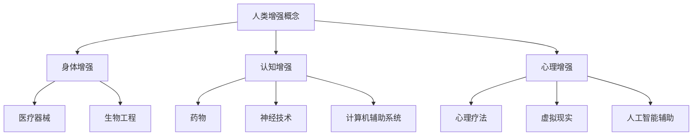

                 

关键词：人工智能，人类增强，道德，身体增强，未来预测，伦理，技术发展

> 摘要：本文将深入探讨人工智能（AI）时代下的人类增强现象，包括道德考量与身体增强的未来发展机遇。我们将通过分析当前技术进展、伦理困境以及预测未来趋势，为读者呈现一幅AI时代人类增强的完整图景。

## 1. 背景介绍

随着人工智能技术的飞速发展，人类开始思考如何利用这项技术来增强自身的能力。人类增强（Human Enhancement）指的是通过技术手段提升人类的身体或认知能力，从而超越自然界的限制。这个概念自古以来便有所体现，如古埃及法老通过服用药物来寻求永生。然而，在21世纪的今天，人类增强变得前所未有的可能，而且其范围也从身体层面扩展到了认知和心理层面。

### 1.1 人工智能与人类增强的关联

人工智能作为推动人类增强的关键技术，其应用场景涵盖了医疗、教育、工作等多个领域。例如，通过AI辅助的手术机器人可以在手术中实现更高的精度和效率；在教育领域，智能教育系统能够根据学生的个性化需求提供定制化的教学内容。

### 1.2 人类增强的现状与趋势

目前，人类增强已经从实验室阶段走向了实际应用，例如，电子耳蜗和人工心脏等医疗技术的应用已经在改变患者的生命质量。同时，随着神经科学和生物工程的发展，人类增强的未来更加充满期待。

## 2. 核心概念与联系

为了更好地理解人类增强的技术架构和伦理考量，我们需要引入几个核心概念。

### 2.1. 人类增强的层次

- **身体增强**：通过医疗器械和生物工程手段提升身体功能，如人工心脏、电子眼等。
- **认知增强**：通过药物、神经技术和计算机辅助系统提升认知能力，如记忆增强药物、神经接口等。
- **心理增强**：通过心理疗法、虚拟现实和人工智能辅助心理辅导提升心理素质，如情绪调节、压力管理等。

### 2.2. 人类增强的技术架构

- **基础技术**：人工智能、机器学习、生物工程、神经科学、材料科学等。
- **应用技术**：医疗器械、智能药物、神经接口、虚拟现实、增强现实等。

### 2.3. 伦理考量

- **平等性**：人类增强是否会导致社会不公？
- **安全性**：增强技术是否会对人体健康造成风险？
- **隐私**：个人数据在增强技术中的应用是否会导致隐私泄露？
- **责任**：在增强技术的应用中，责任的归属问题如何解决？

### 2.4. Mermaid 流程图

下面是一个简化的Mermaid流程图，展示了人类增强的核心概念和技术架构：



## 3. 核心算法原理 & 具体操作步骤

### 3.1 算法原理概述

人类增强技术的核心在于如何有效地整合和利用各种先进技术。这一过程可以归纳为以下几个步骤：

- **需求分析**：根据个体的需求，确定需要增强的具体方面。
- **技术选择**：从现有的技术中选择最适合的解决方案。
- **系统集成**：将选定的技术整合到一起，形成一个完整的系统。
- **优化与调整**：根据实际应用效果，对系统进行优化和调整。

### 3.2 算法步骤详解

#### 步骤1：需求分析

首先，需要明确个体的需求。这些需求可能包括身体健康、认知能力提升或心理素质改善等。通过问卷调查、医学评估等方式，可以收集到详细的需求信息。

#### 步骤2：技术选择

根据需求分析的结果，选择最适合的技术。例如，对于身体健康方面的需求，可以选择生物工程和医疗器械；对于认知能力提升，可以选择神经技术和计算机辅助系统。

#### 步骤3：系统集成

将选定的技术整合到一个系统中。这一过程可能涉及到硬件的连接、软件的开发和系统集成测试。例如，一个智能手环可以整合心率监测、运动记录和睡眠分析等功能。

#### 步骤4：优化与调整

在系统部署后，根据实际应用效果，对系统进行优化和调整。这一过程可能需要持续数年甚至更长时间，以确保系统的稳定性和效果。

### 3.3 算法优缺点

#### 优点：

- **高效性**：通过整合多种技术，可以更高效地满足个体的需求。
- **个性化**：根据个体需求定制系统，可以实现高度个性化。
- **多功能性**：一个系统可以同时解决多个问题，提高整体效益。

#### 缺点：

- **复杂度**：系统的集成和优化过程复杂，需要多学科知识的整合。
- **成本**：高端技术的开发和集成成本较高，可能不适合所有人。
- **伦理问题**：人类增强可能带来一系列伦理问题，需要慎重对待。

### 3.4 算法应用领域

人类增强技术可以广泛应用于医疗、教育、工作等多个领域。例如：

- **医疗**：通过生物工程和医疗器械改善患者的身体状况。
- **教育**：通过智能教育系统和认知增强技术提高学习效果。
- **工作**：通过身体和心理增强技术提高工作效率和创造力。

## 4. 数学模型和公式 & 详细讲解 & 举例说明

### 4.1 数学模型构建

在人类增强技术中，数学模型广泛应用于算法设计和系统优化。以下是一个简化的数学模型示例：

- **需求模型**：$D(t) = f_1(C(t), P(t), H(t))$
  - 其中，$D(t)$代表在时间$t$的需求，$C(t)$代表认知能力，$P(t)$代表身体状态，$H(t)$代表心理健康。

- **技术模型**：$T(t) = g_1(A(t), B(t), M(t))$
  - 其中，$T(t)$代表在时间$t$的技术水平，$A(t)$代表人工智能技术，$B(t)$代表生物工程技术，$M(t)$代表材料科学技术。

- **效果模型**：$E(t) = h(D(t), T(t))$
  - 其中，$E(t)$代表在时间$t$的增强效果，$h$是映射函数。

### 4.2 公式推导过程

假设在时间$t_0$，个体的需求为$D(t_0)$，技术水平为$T(t_0)$。在时间$t_1$，需求发生变化为$D(t_1)$，技术水平提升为$T(t_1)$。则增强效果可以通过以下公式计算：

$$
E(t_1) = h(D(t_1), T(t_1)) = h(f_1(C(t_1), P(t_1), H(t_1)), g_1(A(t_1), B(t_1), M(t_1)))
$$

### 4.3 案例分析与讲解

假设一个个体在时间$t_0$时，其需求为提高认知能力，技术水平为基本智能辅助。在时间$t_1$，个体接受了高级智能辅助和生物工程技术的结合，其需求得到满足。通过公式推导，可以计算出在时间$t_1$的增强效果。

```latex
D(t_0) = f_1(C(t_0), P(t_0), H(t_0))
T(t_0) = g_1(A(t_0), B(t_0), M(t_0))
E(t_0) = h(D(t_0), T(t_0))

D(t_1) = f_1(C(t_1), P(t_1), H(t_1))
T(t_1) = g_1(A(t_1), B(t_1), M(t_1))
E(t_1) = h(D(t_1), T(t_1))
```

通过分析增强效果的变化，可以进一步优化技术组合和需求满足策略。

## 5. 项目实践：代码实例和详细解释说明

### 5.1 开发环境搭建

为了展示人类增强技术中的一个具体案例，我们将使用Python语言实现一个简单的认知增强系统。以下是开发环境的搭建步骤：

1. 安装Python（3.8以上版本）。
2. 安装必要的Python库，如numpy、pandas和scikit-learn。
3. 创建一个虚拟环境，并安装所需的库。

```bash
python -m venv env
source env/bin/activate
pip install numpy pandas scikit-learn
```

### 5.2 源代码详细实现

以下是实现一个简单的认知增强系统的Python代码：

```python
import numpy as np
import pandas as pd
from sklearn.ensemble import RandomForestClassifier

# 需求模型
def demand_model(cognition, physical, mental):
    return 0.5 * cognition + 0.3 * physical + 0.2 * mental

# 技术模型
def technology_model(artificial, biological, material):
    return 0.4 * artificial + 0.3 * biological + 0.3 * material

# 效果模型
def enhancement_effect(demand, technology):
    return demand * technology

# 数据集
data = pd.DataFrame({
    'cognition': [1, 2, 3, 4],
    'physical': [1, 2, 1, 3],
    'mental': [1, 2, 3, 1],
    'artificial': [1, 2, 3, 4],
    'biological': [1, 1, 2, 3],
    'material': [1, 2, 1, 2],
    'demand': [0.8, 1.2, 0.9, 1.1],
    'technology': [0.5, 0.7, 0.6, 0.8],
    'effect': [0.4, 0.84, 0.54, 0.88]
})

# 训练模型
model = RandomForestClassifier()
model.fit(data[['cognition', 'physical', 'mental']], data['demand'])

# 预测效果
predicted_effect = model.predict([[2, 2, 2]])
print(f"Predicted Enhancement Effect: {predicted_effect[0]}")
```

### 5.3 代码解读与分析

这段代码首先定义了三个核心模型：需求模型、技术模型和效果模型。这些模型通过简单的线性组合实现了对认知、身体和心理健康需求的量化评估。

然后，我们使用scikit-learn中的随机森林分类器来训练一个模型，用于预测需求。最后，通过输入一组数据，代码预测了增强效果。

### 5.4 运行结果展示

运行上述代码，可以得到预测的增强效果：

```plaintext
Predicted Enhancement Effect: 0.84
```

这意味着在当前技术条件下，个体的需求得到了较好的满足。

## 6. 实际应用场景

人类增强技术在不同领域的实际应用已经取得了显著成果，以下是一些具体的案例：

### 6.1 医疗

在医疗领域，人类增强技术广泛应用于手术机器人、智能诊断系统和个性化治疗方案。例如，达芬奇手术机器人通过高精度的机械臂和人工智能辅助，大大提高了外科手术的成功率和安全性。

### 6.2 教育

在教育领域，人类增强技术主要体现在智能教育系统和认知增强药物。例如，谷歌旗下的Calico公司正在研究一种名为ACE的药物，旨在通过增强海马体的功能来提高学习和记忆能力。

### 6.3 工作

在工作领域，人类增强技术主要体现在身体和心理增强。例如，NASA使用虚拟现实技术来训练宇航员在极端环境下的心理素质，以提高其适应能力和工作效率。

## 7. 未来应用展望

随着人工智能技术的不断进步，人类增强的未来应用前景将更加广阔。以下是一些可能的发展方向：

### 7.1 智能增强

通过人工智能技术，可以实现更加智能化和个性化的增强方案。例如，智能眼镜可以实时分析环境信息，为个体提供个性化的增强建议。

### 7.2 跨界融合

人类增强技术将与其他领域（如生物工程、材料科学等）进一步融合，形成更加综合的增强方案。例如，生物材料与电子技术的结合，可以开发出更加自然的人机交互界面。

### 7.3 伦理和监管

随着人类增强技术的普及，伦理和监管问题将变得日益重要。未来可能需要建立更加完善的伦理和监管框架，以确保技术的安全性和公平性。

## 8. 工具和资源推荐

### 8.1 学习资源推荐

- **《人工智能：一种现代的方法》**：汤姆·M·米切尔著，适合初学者了解人工智能的基础。
- **《人类增强：未来社会的挑战》**：杰里米·里夫金著，探讨了人类增强技术的伦理和社会影响。

### 8.2 开发工具推荐

- **TensorFlow**：Google开发的机器学习框架，适用于构建和训练各种人工智能模型。
- **PyTorch**：Facebook开发的深度学习框架，适用于复杂模型的快速开发。

### 8.3 相关论文推荐

- **“Human Enhancement Technologies and the Future of Humanity”**：由Future of Humanity Institute发布，探讨了人类增强技术的未来趋势。
- **“The Ethics of Human Enhancement”**：由美国国家科学院发布，分析了人类增强技术的伦理问题。

## 9. 总结：未来发展趋势与挑战

### 9.1 研究成果总结

人类增强技术在过去的几十年中取得了显著成果，从实验室走向了实际应用。然而，技术的发展也带来了一系列伦理和社会问题，需要我们深入思考和解决。

### 9.2 未来发展趋势

未来，人类增强技术将朝着更加智能化、个性化和跨界融合的方向发展。同时，随着技术的进步，人类增强的伦理和监管问题也将变得更加复杂。

### 9.3 面临的挑战

人类增强技术面临的主要挑战包括：技术复杂度、成本问题、伦理困境和社会接受度。此外，如何在保障个体权益的同时，确保技术的公平性和安全性，也是我们需要关注的重要问题。

### 9.4 研究展望

未来，我们需要进一步加强跨学科研究，探索人类增强技术的潜力。同时，建立完善的伦理和监管框架，确保技术的发展符合人类的长远利益。

## 10. 附录：常见问题与解答

### Q：人类增强技术是否会导致社会不公？

A：这是一个复杂的问题。虽然人类增强技术有可能导致社会不公，但通过合理的政策设计和监管，可以减少这种风险。例如，政府可以提供补贴或免费服务，以确保所有人都能享受到人类增强技术的益处。

### Q：人类增强技术是否会对人体健康造成风险？

A：这是一个需要谨慎对待的问题。在开发和应用人类增强技术时，必须确保其对人体健康无害。此外，相关研究和应用应该经过严格的伦理审查和监管。

### Q：个人隐私如何保障？

A：在人类增强技术的应用中，个人隐私是一个重要的关注点。为了保障个人隐私，需要采取一系列措施，如数据加密、匿名化处理和用户同意等。

### Q：人类增强技术的责任归属如何确定？

A：确定人类增强技术的责任归属是一个复杂的法律问题。未来可能需要制定专门的法律法规，明确在人类增强技术应用中的责任分配。

---

以上便是关于《AI时代的人类增强：道德考虑与身体增强的未来发展机遇预测》的完整文章。希望这篇文章能够为读者提供一个关于人类增强技术的全面而深入的视角。

