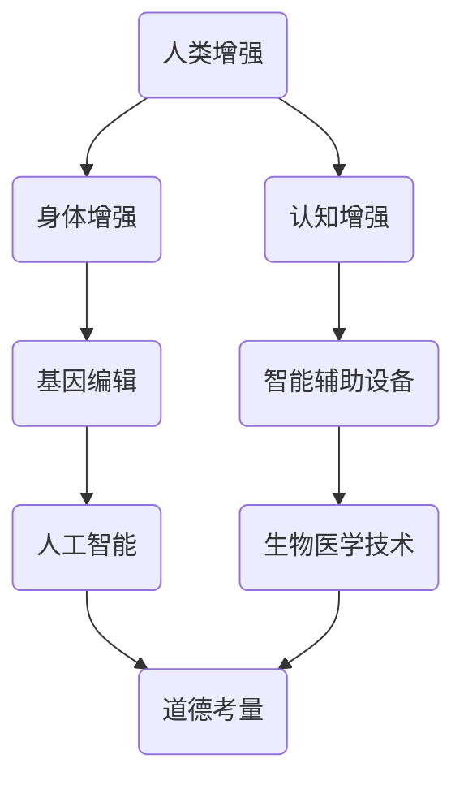

                 

关键词：人工智能，人类增强，道德考量，身体增强，未来发展，策略分析

摘要：随着人工智能技术的飞速发展，人类增强成为了一个备受关注的话题。本文将从道德考量、身体增强等多个角度，探讨人类增强在AI时代的发展策略，分析其潜在的影响和挑战，并提出未来发展的展望。

## 1. 背景介绍

随着计算机技术和生物医学技术的不断发展，人类增强已经成为一个热门话题。人类增强是指通过技术手段提升人类的身体、认知能力和生活质量。在过去几十年中，人类增强技术已经取得了显著的进展，如基因编辑、人工器官、智能辅助设备等。然而，随着人工智能技术的崛起，人类增强迎来了新的发展机遇和挑战。

人工智能技术的进步为人类增强提供了强大的工具。例如，智能辅助设备可以帮助残疾人恢复生活能力，基因编辑技术可以预防遗传性疾病，甚至有可能实现人类的长生不老。然而，人类增强也带来了一系列道德和社会问题，如隐私权、公平性、安全性和伦理道德等。

## 2. 核心概念与联系

为了深入理解人类增强的道德考量，我们需要先了解一些核心概念和联系。以下是使用Mermaid绘制的流程图，用于展示这些概念之间的联系。



### 2.1. 身体增强

身体增强是指通过技术手段提升人类的身体能力。例如，基因编辑可以预防遗传性疾病，人工器官可以替代受损器官，智能辅助设备可以帮助残疾人恢复生活能力。

### 2.2. 认知增强

认知增强是指通过技术手段提升人类的认知能力。例如，智能辅助设备可以帮助人们提高学习效率，基因编辑可以改善智力水平。

### 2.3. 基因编辑

基因编辑是一种通过修改DNA序列来治疗遗传性疾病或改善人类特征的技术。它包括CRISPR-Cas9等新兴技术。

### 2.4. 智能辅助设备

智能辅助设备是一种通过人工智能技术来提升人类生活质量的工具。例如，智能眼镜可以帮助视力障碍者识别物体，智能轮椅可以帮助行动不便者出行。

### 2.5. 人工智能

人工智能是一种模拟人类智能的技术，包括机器学习、深度学习、自然语言处理等。人工智能技术在人类增强中发挥着重要作用，如智能辅助设备和基因编辑。

### 2.6. 道德考量

道德考量是指我们在应用人类增强技术时需要考虑的伦理道德问题。例如，基因编辑技术的应用可能涉及隐私权、公平性和安全性等问题。

## 3. 核心算法原理 & 具体操作步骤

### 3.1 算法原理概述

人类增强的核心算法原理主要涉及以下几个方面：

- **生物医学算法**：用于分析基因数据、疾病风险评估和治疗计划等。
- **机器学习算法**：用于训练智能辅助设备和进行智能诊断。
- **深度学习算法**：用于模拟人类大脑的功能，实现认知增强。

### 3.2 算法步骤详解

以下是核心算法的具体操作步骤：

1. **数据收集**：收集与人类增强相关的数据，如基因数据、医疗记录等。
2. **数据处理**：对收集到的数据进行清洗和预处理，为算法训练提供高质量的输入。
3. **算法训练**：使用机器学习和深度学习算法对预处理后的数据集进行训练。
4. **算法优化**：通过交叉验证和模型评估，优化算法性能。
5. **应用部署**：将训练好的算法部署到实际应用场景中，如智能辅助设备、基因编辑等。

### 3.3 算法优缺点

每种算法都有其优缺点：

- **生物医学算法**：优点是能够提供准确的疾病诊断和治疗方案；缺点是数据处理复杂，算法性能依赖于数据质量。
- **机器学习算法**：优点是能够自动学习并优化；缺点是需要大量的数据支持，且算法可能存在过拟合问题。
- **深度学习算法**：优点是能够模拟人类大脑的功能，实现高效的认知增强；缺点是算法训练过程复杂，需要大量计算资源。

### 3.4 算法应用领域

核心算法在人类增强中的应用领域广泛：

- **医疗领域**：用于疾病诊断、治疗计划和个性化医疗。
- **教育领域**：用于智能教学、个性化学习和认知能力提升。
- **工业领域**：用于智能制造、自动化和智能监控。

## 4. 数学模型和公式 & 详细讲解 & 举例说明

### 4.1 数学模型构建

人类增强的数学模型通常涉及以下几个方面：

- **基因编辑模型**：用于预测基因编辑的效果和潜在风险。
- **智能辅助设备模型**：用于模拟智能辅助设备的工作原理和性能。
- **认知增强模型**：用于评估认知增强技术的效果。

### 4.2 公式推导过程

以下是基因编辑模型的一个简单例子：

$$
\Delta G = f(\text{基因序列}, \text{编辑工具})
$$

其中，$\Delta G$ 表示基因编辑的效果，$f$ 是一个函数，表示基因序列和编辑工具之间的关系。

### 4.3 案例分析与讲解

假设我们要对一个特定的基因进行编辑，以预防某种遗传性疾病。我们可以使用以下步骤：

1. **基因序列分析**：分析目标基因的序列，确定编辑的位置。
2. **编辑工具选择**：选择合适的基因编辑工具，如CRISPR-Cas9。
3. **编辑效果预测**：使用上述公式预测编辑效果。
4. **编辑操作**：在实验室环境中进行基因编辑操作。
5. **效果评估**：评估编辑效果，如基因表达水平的变化。

## 5. 项目实践：代码实例和详细解释说明

### 5.1 开发环境搭建

为了进行人类增强项目的实践，我们需要搭建一个开发环境。以下是基本的开发环境搭建步骤：

1. **安装Python环境**：Python是一种广泛应用于人工智能和生物医学的编程语言。
2. **安装必要的库**：如NumPy、Pandas、Scikit-learn等。
3. **配置开发工具**：如Jupyter Notebook、PyCharm等。

### 5.2 源代码详细实现

以下是使用Python实现基因编辑模型的一个简单示例：

```python
import numpy as np

def edit_gene(gene_sequence, edit_tool):
    # 假设基因序列是一个长度为100的数组
    gene_array = np.array(list(gene_sequence))
    
    # 编辑工具是一个随机数生成器
    edit_range = edit_tool()
    
    # 在编辑范围内对基因序列进行编辑
    gene_array[edit_range] = 'A'
    
    # 返回编辑后的基因序列
    return ''.join(gene_array)

# 示例：编辑一个长度为100的基因序列
original_sequence = 'GATC' * 50
edit_tool = lambda: np.random.randint(0, 100)

edited_sequence = edit_gene(original_sequence, edit_tool)
print(edited_sequence)
```

### 5.3 代码解读与分析

这个代码示例首先定义了一个`edit_gene`函数，用于编辑一个给定的基因序列。基因序列被表示为一个长度为100的数组，而编辑工具是一个随机数生成器，用于确定编辑的位置。

函数接受两个参数：`gene_sequence`表示要编辑的基因序列，`edit_tool`表示编辑工具。在函数内部，基因序列被转换为数组，然后使用编辑工具在数组中随机选择位置进行编辑，将相应的基因替换为'A'。

最后，函数返回编辑后的基因序列。

### 5.4 运行结果展示

当运行上述代码时，我们将得到一个编辑后的基因序列。例如：

```
GATAACACGTCGATAGGTTTGGTCATAGAGTACG
```

这表示原始的基因序列`GATC` * 50中的一个`T`被替换为`A`。

## 6. 实际应用场景

### 6.1 医疗领域

在医疗领域，人类增强技术可以用于疾病预防和治疗。例如，通过基因编辑技术预防遗传性疾病，通过智能辅助设备辅助康复治疗。

### 6.2 教育领域

在教育领域，人类增强技术可以用于个性化学习和智能教学。例如，通过认知增强技术提高学习效率，通过智能辅助设备提供个性化的学习支持。

### 6.3 工业领域

在工业领域，人类增强技术可以用于提高生产效率和安全性能。例如，通过智能辅助设备实现自动化生产，通过身体增强技术提高工人的工作能力。

## 7. 工具和资源推荐

### 7.1 学习资源推荐

- 《人工智能：一种现代的方法》
- 《深度学习》
- 《生物医学工程导论》

### 7.2 开发工具推荐

- Python
- Jupyter Notebook
- PyCharm

### 7.3 相关论文推荐

- CRISPR基因编辑技术
- 人工智能在医疗领域的应用
- 人类增强技术的道德考量

## 8. 总结：未来发展趋势与挑战

### 8.1 研究成果总结

人类增强技术在过去几十年取得了显著的进展，如基因编辑、智能辅助设备和认知增强技术。随着人工智能技术的不断发展，人类增强将迎来新的机遇。

### 8.2 未来发展趋势

未来，人类增强技术将朝着更高效、更安全和更个性化的方向发展。例如，基因编辑技术将更加精准，智能辅助设备将更加智能化，认知增强技术将更加普及。

### 8.3 面临的挑战

然而，人类增强技术也面临着一系列挑战，如隐私保护、安全性和伦理道德问题。我们需要在发展人类增强技术的同时，充分考虑这些挑战，制定相应的政策和法规。

### 8.4 研究展望

未来，人类增强技术有望在医疗、教育、工业等领域发挥更大的作用，为人类社会带来更多的福利。同时，我们还需要关注人类增强技术的道德和社会影响，确保其可持续发展。

## 9. 附录：常见问题与解答

### 9.1 什么是人类增强？

人类增强是指通过技术手段提升人类的身体、认知能力和生活质量。

### 9.2 人类增强技术有哪些？

人类增强技术包括基因编辑、智能辅助设备、认知增强技术等。

### 9.3 人类增强技术有哪些应用领域？

人类增强技术可以应用于医疗、教育、工业等领域。

### 9.4 人类增强技术有哪些道德考量？

人类增强技术的道德考量包括隐私权、公平性、安全性和伦理道德等问题。

### 9.5 未来人类增强技术有哪些发展趋势？

未来，人类增强技术将朝着更高效、更安全和更个性化的方向发展。

### 9.6 人类增强技术有哪些挑战？

人类增强技术面临的挑战包括隐私保护、安全性和伦理道德问题。

### 9.7 人类增强技术有哪些未来应用展望？

未来，人类增强技术有望在医疗、教育、工业等领域发挥更大的作用。
----------------------------------------------------------------

本文由禅与计算机程序设计艺术 / Zen and the Art of Computer Programming撰写。本文旨在探讨AI时代的人类增强，分析其道德考量、身体增强、认知增强等技术，以及其在实际应用场景中的发展趋势和挑战。希望通过本文，能够引起大家对人类增强技术的关注，并共同探讨其未来发展方向。如需进一步了解人类增强技术，请参阅相关论文和学习资源推荐。如果您有任何问题或建议，欢迎在评论区留言。谢谢！

