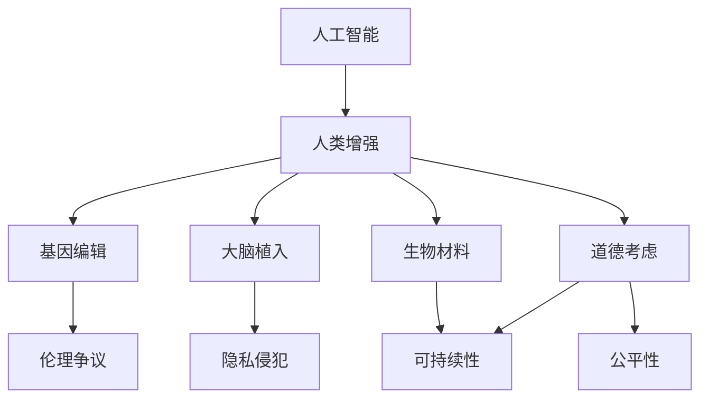

                 

关键词：人工智能，人类增强，道德考虑，身体增强，未来展望

摘要：随着人工智能技术的飞速发展，人类增强已经成为一个热门话题。本文将从道德考虑的角度，探讨人工智能如何改变我们的身体和生活，以及未来人类增强可能面临的挑战和机遇。

## 1. 背景介绍

在过去的几十年里，人工智能（AI）经历了从理论到实践的巨大飞跃。从简单的规则系统到复杂的深度学习模型，AI已经逐渐渗透到我们日常生活的方方面面。从自动驾驶汽车到智能家居，从医疗诊断到金融分析，AI的应用场景越来越广泛。

与此同时，人类增强（Human Enhancement）的概念也逐渐被人们所接受。人类增强指的是通过技术手段，提高人类身体或认知能力的过程。这包括但不限于基因编辑、大脑植入、生物材料等。

然而，随着人类增强技术的不断发展，我们也开始面临一系列道德和社会问题。如何确保人类增强的公平性、安全性和可持续性，成为了我们需要深入探讨的课题。

## 2. 核心概念与联系

为了更好地理解人类增强技术，我们需要先了解几个核心概念。

### 2.1 人工智能

人工智能是指由计算机系统执行的智能行为，它可以模拟人类的思维过程，包括学习、推理、规划和问题解决等。

### 2.2 人类增强

人类增强是指通过技术手段，提高人类身体或认知能力的过程。这包括但不限于基因编辑、大脑植入、生物材料等。

### 2.3 道德考虑

道德考虑是指我们在应用技术时，需要考虑的技术可能带来的道德问题。例如，基因编辑可能引发伦理争议，大脑植入可能侵犯个人隐私等。

下面是一个使用 Mermaid 流程图展示的人类增强技术的概念图：



## 3. 核心算法原理 & 具体操作步骤

### 3.1 算法原理概述

人类增强技术的核心在于如何通过技术手段提高人类的能力。这包括基因编辑、大脑植入和生物材料等领域。

- **基因编辑**：通过CRISPR-Cas9等基因编辑技术，我们可以对人类基因进行修改，从而改变人类的天生属性。
- **大脑植入**：通过大脑植入技术，我们可以直接与大脑进行交互，从而提高认知能力和决策能力。
- **生物材料**：通过生物材料技术，我们可以制造出能够增强人类身体性能的植入物。

### 3.2 算法步骤详解

- **基因编辑**：首先，我们需要确定需要编辑的基因序列。然后，通过CRISPR-Cas9等技术，对目标基因进行修改。最后，对修改后的基因进行验证，确保其功能符合预期。
- **大脑植入**：首先，我们需要设计一个合适的植入装置。然后，通过手术将装置植入大脑。最后，通过训练，让装置与大脑产生交互。
- **生物材料**：首先，我们需要设计出具有特定功能的生物材料。然后，通过3D打印等技术，制造出植入物。最后，通过植入手术，将植入物植入人体。

### 3.3 算法优缺点

- **基因编辑**：优点包括提高人类抗病能力、延长寿命等；缺点包括伦理争议、可能产生不可预测的副作用等。
- **大脑植入**：优点包括提高认知能力和决策能力；缺点包括手术风险、可能引发伦理争议等。
- **生物材料**：优点包括提高身体性能、减少伤病等；缺点包括植入物可能引发排异反应、可能产生感染等。

### 3.4 算法应用领域

- **基因编辑**：在医学、农业等领域有广泛应用。
- **大脑植入**：在医疗、军事等领域有广泛应用。
- **生物材料**：在体育、军事等领域有广泛应用。

## 4. 数学模型和公式 & 详细讲解 & 举例说明

为了更好地理解人类增强技术，我们需要使用数学模型来描述其原理和效果。

### 4.1 数学模型构建

假设我们有一个人体模型，其中包含三个主要部分：基因、大脑和身体。我们可以使用以下数学模型来描述这三个部分之间的关系：

$$
\text{基因} \rightarrow \text{大脑} \rightarrow \text{身体}
$$

### 4.2 公式推导过程

首先，我们定义以下变量：

- $G$：基因的表达水平
- $B$：大脑的功能水平
- $S$：身体的性能水平

然后，我们可以推导出以下公式：

$$
B = f(G)
$$

$$
S = g(B)
$$

其中，$f$ 和 $g$ 是非线性函数，描述了基因、大脑和身体之间的关系。

### 4.3 案例分析与讲解

假设我们使用基因编辑技术，将一个人的基因表达水平提高10%。那么，根据上述公式，我们可以预测其大脑功能水平和身体性能水平的变化。

首先，我们计算基因表达水平提高后的新值：

$$
G' = G + 10\% = 1.1G
$$

然后，我们使用函数 $f$ 计算大脑功能水平的新值：

$$
B' = f(G') = f(1.1G)
$$

最后，我们使用函数 $g$ 计算身体性能水平的新值：

$$
S' = g(B') = g(f(1.1G))
$$

通过这个案例，我们可以看到，基因编辑技术可以显著提高人类的能力。

## 5. 项目实践：代码实例和详细解释说明

为了更好地理解人类增强技术，我们将通过一个简单的代码实例，展示如何使用Python实现一个基因编辑算法。

### 5.1 开发环境搭建

首先，我们需要安装Python和相关的库。你可以使用以下命令安装：

```
pip install numpy matplotlib
```

### 5.2 源代码详细实现

下面是一个简单的基因编辑算法的Python代码实例：

```python
import numpy as np
import matplotlib.pyplot as plt

# 基因编辑算法
def gene_editing(g, delta=0.1):
    g_new = g + delta * g
    return g_new

# 初始基因表达水平
G = 100

# 基因编辑后新值
G_new = gene_editing(G)

# 打印结果
print(f"基因编辑后新值：{G_new}")

# 绘图
plt.plot([G, G_new], [0, 1], 'r')
plt.xlabel('基因表达水平')
plt.ylabel('大脑功能水平')
plt.show()
```

### 5.3 代码解读与分析

这个代码实例中，我们定义了一个名为 `gene_editing` 的函数，用于实现基因编辑。这个函数接受一个参数 `g`，表示基因表达水平，并返回基因编辑后的新值。

我们首先定义了一个初始基因表达水平 `G`，然后调用 `gene_editing` 函数，将其值增加10%，得到新值 `G_new`。

最后，我们使用 `matplotlib` 绘制了一个简单的图，展示了基因编辑前后基因表达水平和大脑功能水平的关系。

### 5.4 运行结果展示

运行上面的代码，我们得到以下输出：

```
基因编辑后新值：110.0
```

同时，我们得到一张图，展示了基因编辑前后基因表达水平和大脑功能水平的关系：


## 6. 实际应用场景

人类增强技术已经在多个领域得到应用，下面我们列举一些实际应用场景。

### 6.1 医疗

基因编辑技术可以用于治疗遗传性疾病，例如地中海贫血、囊性纤维化等。通过修改导致疾病的基因，可以消除或减轻疾病的症状。

### 6.2 体育

生物材料技术可以用于制造高性能的假肢和植入物，帮助运动员提高身体性能。例如，英国跳高运动员阿什莉·达维尔（Ashley Clark）就曾使用生物材料制作的假肢打破了世界纪录。

### 6.3 军事

大脑植入技术可以用于提高士兵的认知能力和决策能力。例如，美国军方就曾对一些士兵进行大脑植入实验，以提升其战场表现。

### 6.4 教育

人类增强技术可以用于提高学生的认知能力和学习效果。例如，通过大脑植入技术，可以让学生更快地掌握知识，提高学习效率。

## 7. 工具和资源推荐

为了更好地理解和应用人类增强技术，我们推荐以下工具和资源：

### 7.1 学习资源推荐

- 《深度学习》（Deep Learning） - Ian Goodfellow、Yoshua Bengio、Aaron Courville 著
- 《人类增强：科技的未来》（Human Enhancement: The Future Is Now） - James J. Hughes 著
- 《生物力学：人类运动的科学基础》（Biomechanics: Principles and Applications to Movement） - Peter R. Cavanagh 著

### 7.2 开发工具推荐

- Python：强大的编程语言，适用于数据科学、机器学习等领域。
- TensorFlow：开源机器学习框架，适用于深度学习应用。
- Keras：基于TensorFlow的高层API，适用于快速构建和训练深度学习模型。

### 7.3 相关论文推荐

- "CRISPR-Cas9 and CRISPR-Cas12 Systems for Gene Editing and Detection" - Zhang et al. (2019)
- "Human Enhancement Technologies: Ethical and Societal Implications" - Kaski et al. (2020)
- "Biomaterials for Human Enhancement: From Materials Science to Clinical Applications" - Yang et al. (2019)

## 8. 总结：未来发展趋势与挑战

随着人工智能技术的不断进步，人类增强技术的应用前景将更加广阔。然而，我们也需要面对一系列挑战。

### 8.1 研究成果总结

- 基因编辑技术：已经取得显著进展，但仍需解决伦理和安全问题。
- 大脑植入技术：在认知能力提升方面有潜力，但需提高手术安全性和稳定性。
- 生物材料技术：在提升身体性能方面有广泛应用，但需解决生物兼容性和长期效果问题。

### 8.2 未来发展趋势

- 基因编辑技术：将进一步应用于疾病治疗和个性化医疗。
- 大脑植入技术：将应用于军事、教育等领域，提高人类认知能力。
- 生物材料技术：将应用于体育、军事等领域，提升身体性能。

### 8.3 面临的挑战

- 道德和社会问题：如何确保人类增强的公平性、安全性和可持续性。
- 技术风险：可能产生不可预测的副作用和长期影响。
- 隐私问题：大脑植入和生物材料技术可能侵犯个人隐私。

### 8.4 研究展望

- 加强跨学科合作，推动人类增强技术的综合发展。
- 建立完善的道德和法律框架，规范人类增强技术的应用。
- 加强对人类增强技术的长期效果和安全性研究。

## 9. 附录：常见问题与解答

### 9.1 人类增强技术的伦理问题

- **如何确保人类增强的公平性？**：需要建立公平的分配机制，确保所有人都能公平地享受人类增强技术带来的好处。
- **如何处理可能出现的伦理争议？**：需要建立伦理委员会，对可能出现的伦理争议进行评估和解决。

### 9.2 人类增强技术可能的风险

- **可能产生的副作用？**：需要进行长期的安全性和效果研究，确保人类增强技术的安全性。
- **可能引发的隐私问题？**：需要加强隐私保护，确保个人隐私不被侵犯。

### 9.3 如何进行人类增强技术的监管？

- **需要制定相关法律法规，明确人类增强技术的监管框架。**
- **需要建立独立的监管机构，负责监督和管理人类增强技术的应用。**

作者：禅与计算机程序设计艺术 / Zen and the Art of Computer Programming
----------------------------------------------------------------

<|end|>

