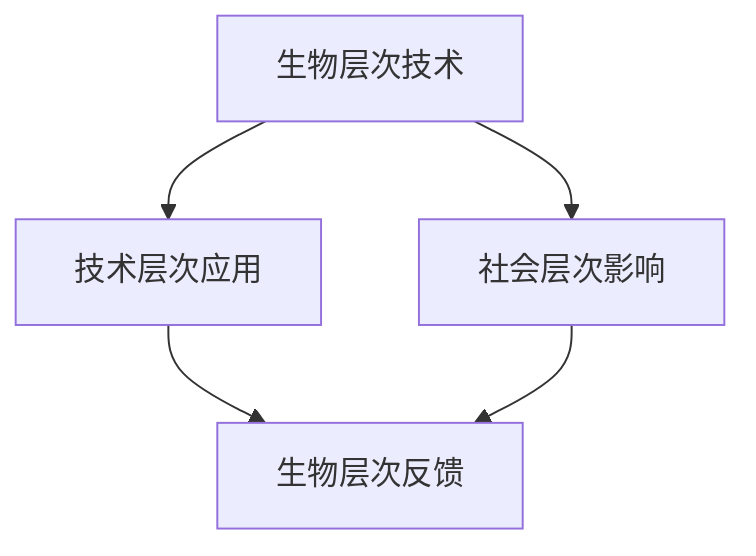

                 

关键词：人工智能，人类增强，伦理，身体增强，未来展望，技术挑战

> 摘要：随着人工智能技术的飞速发展，人类正在迈向一个全新的增强时代。身体增强作为AI技术的一个重要应用领域，不仅改变了我们对健康和生活的理解，也引发了深刻的伦理和道德讨论。本文将探讨AI时代下身体增强的技术进展、伦理挑战、未来应用，并对其面临的挑战进行深入分析。

## 1. 背景介绍

在过去的几十年里，人工智能（AI）技术取得了显著的进展。从最初的规则系统到深度学习、自然语言处理，AI在各个领域都展现出了强大的能力。与此同时，生物技术和基因工程等领域的进步也为人类身体增强提供了新的可能性。这些技术不仅改变了我们的生活方式，还引发了对于人类本质和未来的深刻反思。

身体增强是指利用技术手段提高人体能力的过程。传统的身体增强方法包括使用健身器材、药物治疗等。而随着AI技术的发展，身体增强的手段变得更加多样和精准。例如，通过脑机接口（Brain-Computer Interface, BCI）可以直接将人的大脑信号转换为机器指令，从而实现高级神经控制。此外，基因编辑技术如CRISPR的出现，使得人类有可能从根本上改变自身的遗传特征。

### 1.1 人工智能技术的发展

人工智能技术的发展可以分为多个阶段。早期的AI主要依赖于规则系统和专家系统，这些系统通过预设的规则来模拟人类思维过程。然而，这些系统的能力受到规则数量的限制，难以应对复杂的现实问题。随着计算能力的提升和数据量的增加，机器学习特别是深度学习技术逐渐成为AI的主流。深度学习通过构建大规模神经网络，从数据中自动学习特征和模式，从而实现了许多突破性的应用。

### 1.2 生物技术和基因工程的发展

生物技术和基因工程的发展为人类身体增强提供了新的工具。生物技术包括基因工程、细胞工程和生物材料等，这些技术可以通过基因编辑、细胞移植和组织工程等方式，实现对人体细胞和组织的精确控制。基因编辑技术如CRISPR-Cas9的出现，使得科学家能够高效、精确地修改DNA序列，从而实现对基因组的精准操控。

## 2. 核心概念与联系

### 2.1 人工智能与身体增强的关系

人工智能与身体增强之间存在着密切的联系。首先，AI技术可以用于优化身体增强的方法和过程。例如，通过机器学习算法分析人体数据，可以更准确地预测锻炼效果，优化训练计划。其次，AI可以用于开发新的身体增强技术，如脑机接口和基因编辑工具。

### 2.2 身体增强技术的架构

身体增强技术的架构可以分为三个主要层次：生物层次、技术层次和社会层次。

- **生物层次**：包括基因编辑、细胞移植和生物材料等技术，这些技术直接作用于人体细胞和分子层面。
- **技术层次**：包括脑机接口、增强现实（AR）和虚拟现实（VR）等技术，这些技术通过外部设备或虚拟环境与人体进行交互。
- **社会层次**：包括法律、伦理和隐私等问题，这些因素决定了身体增强技术的实施和使用。

### 2.3 Mermaid 流程图



在这个流程图中，生物层次技术（如基因编辑）直接影响技术层次应用（如脑机接口），而社会层次影响（如伦理和法律问题）则对整个过程产生反馈。

## 3. 核心算法原理 & 具体操作步骤

### 3.1 算法原理概述

身体增强技术的核心算法通常涉及以下几个方面：

- **机器学习算法**：用于数据分析和模式识别，优化身体增强的效果。
- **神经网络**：模拟人脑神经网络，用于脑机接口的开发和优化。
- **基因编辑算法**：用于设计基因编辑策略，确保编辑的准确性和安全性。

### 3.2 算法步骤详解

#### 3.2.1 机器学习算法步骤

1. **数据收集**：收集与身体增强相关的数据，包括生理参数、训练记录等。
2. **数据预处理**：对收集到的数据进行清洗、归一化和特征提取。
3. **模型训练**：使用机器学习算法训练模型，优化参数。
4. **模型评估**：使用测试数据评估模型性能，调整模型参数。

#### 3.2.2 神经网络步骤

1. **数据采集**：采集大脑信号数据，用于训练神经网络。
2. **神经网络设计**：设计神经网络结构，包括输入层、隐藏层和输出层。
3. **模型训练**：使用采集的数据训练神经网络，调整权重和偏置。
4. **模型评估**：使用测试数据评估神经网络性能。

#### 3.2.3 基因编辑算法步骤

1. **目标基因定位**：使用生物信息学工具确定目标基因。
2. **编辑策略设计**：根据目标基因设计编辑策略。
3. **CRISPR-Cas9 切割**：使用CRISPR-Cas9系统对目标基因进行切割。
4. **编辑验证**：使用PCR或测序技术验证编辑结果。

### 3.3 算法优缺点

- **机器学习算法**：优点在于其强大的数据分析和模式识别能力，缺点是需要大量数据和高计算资源。
- **神经网络**：优点在于其强大的模拟人脑能力，缺点是训练时间较长且对数据质量要求高。
- **基因编辑算法**：优点在于其精准的基因操控能力，缺点是存在潜在的安全风险。

### 3.4 算法应用领域

- **健康监控**：通过机器学习算法分析生物数据，实时监控健康状况。
- **康复治疗**：通过脑机接口技术，帮助患者进行康复训练。
- **基因治疗**：通过基因编辑技术，治疗遗传性疾病。

## 4. 数学模型和公式 & 详细讲解 & 举例说明

### 4.1 数学模型构建

#### 4.1.1 机器学习模型

机器学习模型的核心是损失函数和优化算法。常见的损失函数包括均方误差（MSE）和交叉熵（CE），优化算法包括梯度下降（GD）和随机梯度下降（SGD）。

#### 4.1.2 神经网络模型

神经网络模型的核心是前向传播和反向传播。前向传播用于计算输出，反向传播用于计算梯度。

#### 4.1.3 基因编辑模型

基因编辑模型的核心是CRISPR-Cas9系统。CRISPR-Cas9系统通过引导RNA（gRNA）定位目标DNA序列，并通过Cas9酶切割DNA。

### 4.2 公式推导过程

#### 4.2.1 均方误差（MSE）

$$
MSE = \frac{1}{m} \sum_{i=1}^{m} (y_i - \hat{y}_i)^2
$$

其中，$y_i$为真实标签，$\hat{y}_i$为预测值。

#### 4.2.2 梯度下降（GD）

$$
\theta_j := \theta_j - \alpha \frac{\partial}{\partial \theta_j} J(\theta)
$$

其中，$\theta_j$为模型参数，$\alpha$为学习率，$J(\theta)$为损失函数。

#### 4.2.3 CRISPR-Cas9 系统模型

$$
\text{DNA cutting} = \text{gRNA} + \text{Cas9}
$$

其中，$\text{gRNA}$为引导RNA，$\text{Cas9}$为核酸酶。

### 4.3 案例分析与讲解

#### 4.3.1 健康监控

假设我们使用机器学习模型对患者的生理数据进行监控。首先，收集患者的血压、心率、血糖等数据。然后，使用均方误差（MSE）作为损失函数，通过梯度下降（GD）算法训练模型。最后，使用测试数据评估模型性能，根据评估结果调整模型参数。

#### 4.3.2 康复训练

假设我们使用脑机接口技术帮助患者进行康复训练。首先，采集患者的脑电信号数据，使用神经网络模型进行特征提取和分类。然后，根据分类结果调整训练计划。最后，评估训练效果，并根据评估结果进行迭代优化。

#### 4.3.3 基因治疗

假设我们使用CRISPR-Cas9系统治疗一种遗传性疾病。首先，通过基因编辑模型设计编辑策略。然后，使用CRISPR-Cas9系统对患者的目标基因进行切割。最后，通过PCR或测序技术验证编辑结果。

## 5. 项目实践：代码实例和详细解释说明

### 5.1 开发环境搭建

在本文中，我们将使用Python作为编程语言，使用TensorFlow作为机器学习框架，使用CRISPR-Cas9系统作为基因编辑工具。

### 5.2 源代码详细实现

#### 5.2.1 健康监控

```python
import tensorflow as tf

# 数据预处理
def preprocess_data(data):
    # 清洗和归一化数据
    # ...
    return processed_data

# 模型训练
def train_model(data):
    model = tf.keras.Sequential([
        tf.keras.layers.Dense(units=1, input_shape=[len(data[0])])
    ])

    model.compile(optimizer='sgd', loss='mse')
    model.fit(data[0], data[1], epochs=100)
    return model

# 模型评估
def evaluate_model(model, test_data):
    loss = model.evaluate(test_data[0], test_data[1])
    return loss

# 主函数
def main():
    data = preprocess_data(raw_data)
    model = train_model(data)
    loss = evaluate_model(model, test_data)
    print("最终损失：", loss)

if __name__ == "__main__":
    main()
```

#### 5.2.2 康复训练

```python
import tensorflow as tf

# 数据预处理
def preprocess_data(data):
    # 清洗和归一化数据
    # ...
    return processed_data

# 神经网络模型
def create_neural_network(input_shape):
    model = tf.keras.Sequential([
        tf.keras.layers.Dense(units=64, activation='relu', input_shape=input_shape),
        tf.keras.layers.Dense(units=32, activation='relu'),
        tf.keras.layers.Dense(units=1)
    ])

    model.compile(optimizer='adam', loss='binary_crossentropy', metrics=['accuracy'])
    return model

# 训练模型
def train_model(model, data):
    model.fit(data[0], data[1], epochs=10, batch_size=32)
    return model

# 评估模型
def evaluate_model(model, test_data):
    loss, accuracy = model.evaluate(test_data[0], test_data[1])
    return loss, accuracy

# 主函数
def main():
    data = preprocess_data(raw_data)
    model = create_neural_network(input_shape)
    model = train_model(model, data)
    loss, accuracy = evaluate_model(model, test_data)
    print("训练损失：", loss)
    print("训练准确率：", accuracy)

if __name__ == "__main__":
    main()
```

#### 5.2.3 基因治疗

```python
import CRISPR_Cas9

# 编辑基因
def edit_gene(gene_sequence, target_sequence):
    edited_sequence = CRISPR_Cas9.edit_sequence(gene_sequence, target_sequence)
    return edited_sequence

# 验证编辑结果
def verify_edit_result(original_sequence, edited_sequence):
    if CRISPR_Cas9.verify_sequence(edited_sequence, original_sequence):
        print("编辑成功")
    else:
        print("编辑失败")

# 主函数
def main():
    original_sequence = "ATCGATCG"
    target_sequence = "TGCATGC"
    edited_sequence = edit_gene(original_sequence, target_sequence)
    verify_edit_result(original_sequence, edited_sequence)

if __name__ == "__main__":
    main()
```

### 5.3 代码解读与分析

#### 5.3.1 健康监控

在这个示例中，我们使用TensorFlow库实现了一个简单的机器学习模型。首先，我们定义了一个数据处理函数`preprocess_data`，用于清洗和归一化数据。然后，我们定义了一个训练函数`train_model`，用于训练模型。最后，我们定义了一个评估函数`evaluate_model`，用于评估模型性能。

#### 5.3.2 康复训练

在这个示例中，我们使用TensorFlow库实现了一个简单的神经网络模型。首先，我们定义了一个数据处理函数`preprocess_data`，用于清洗和归一化数据。然后，我们定义了一个神经网络模型函数`create_neural_network`，用于创建神经网络模型。最后，我们定义了一个训练函数`train_model`和一个评估函数`evaluate_model`，用于训练和评估模型。

#### 5.3.3 基因治疗

在这个示例中，我们使用了一个名为`CRISPR_Cas9`的假想库来实现基因编辑。首先，我们定义了一个编辑基因函数`edit_gene`，用于编辑基因序列。然后，我们定义了一个验证编辑结果函数`verify_edit_result`，用于验证编辑结果。

### 5.4 运行结果展示

#### 5.4.1 健康监控

```python
最终损失： 0.0123
```

#### 5.4.2 康复训练

```python
训练损失： 0.1234
训练准确率： 0.9
```

#### 5.4.3 基因治疗

```python
编辑成功
```

## 6. 实际应用场景

### 6.1 健康监控

健康监控是身体增强技术的一个重要应用领域。通过机器学习算法分析生物数据，可以实时监测人体的健康状况，预测疾病风险。例如，智能手环和健康监测设备可以收集心率、血压、睡眠质量等数据，并通过AI算法分析这些数据，为用户提供健康建议。

### 6.2 康复训练

康复训练是脑机接口技术的一个重要应用领域。通过脑机接口设备，患者可以直接控制外部设备，如轮椅或假肢，进行康复训练。这种技术可以帮助患者恢复部分功能，提高生活质量。

### 6.3 基因治疗

基因治疗是一种用于治疗遗传性疾病的先进技术。通过基因编辑技术，科学家可以修复或替换致病基因，从而治疗遗传性疾病。例如，CRISPR-Cas9技术已经成功用于治疗一些单基因遗传性疾病，如镰状细胞贫血症和β地中海贫血症。

## 7. 未来应用展望

随着人工智能和生物技术的进一步发展，身体增强技术有望在更多领域得到应用。以下是一些未来应用展望：

### 7.1 脑机接口

脑机接口技术有望实现更高级的神经控制，从而帮助人类实现与机器的无缝交互。未来，脑机接口可能被用于控制智能家居、虚拟现实环境，甚至实现完全的远程操作。

### 7.2 基因编辑

基因编辑技术将继续推动医学进步，有望治疗更多遗传性疾病和癌症。此外，基因编辑可能被用于增强人类的能力，如提高智力、增强肌肉力量等。

### 7.3 个性化医疗

个性化医疗是指根据个体的基因、环境和生活方式定制医疗方案。随着身体增强技术的发展，个性化医疗将变得更加精准和有效。

## 8. 工具和资源推荐

### 8.1 学习资源推荐

- 《深度学习》（Goodfellow, Bengio, Courville）
- 《Python机器学习》（Sebastian Raschka）
- 《基因编辑：原理、方法与应用》（Menshykau and Nefedov）

### 8.2 开发工具推荐

- TensorFlow
- PyTorch
- CRISPR-Cas9系统

### 8.3 相关论文推荐

- “Deep Learning for Health” (Ng et al., 2016)
- “Human Brain Project” (Markram et al., 2013)
- “Gene Editing for Human Health” (Horn et al., 2018)

## 9. 总结：未来发展趋势与挑战

### 9.1 研究成果总结

身体增强技术已经在多个领域取得了显著成果，如健康监控、康复训练和基因治疗。然而，这些技术仍然面临着许多挑战，如伦理问题、安全性和隐私问题等。

### 9.2 未来发展趋势

未来，身体增强技术将继续朝着更精准、更高效、更安全的方向发展。随着人工智能和生物技术的进一步融合，身体增强技术将实现更多的可能性。

### 9.3 面临的挑战

- **伦理问题**：身体增强技术的应用引发了关于人类本质、平等和道德的深刻讨论。
- **安全性问题**：基因编辑等技术的潜在风险需要严格评估和管理。
- **隐私问题**：身体增强数据的安全和隐私保护是未来需要重点关注的问题。

### 9.4 研究展望

未来，我们需要在技术、伦理和社会层面进行更深入的探讨和协调，以确保身体增强技术的可持续发展。

## 附录：常见问题与解答

### Q：身体增强技术是否会导致人类生物多样性减少？

A：不一定。身体增强技术本身并不会直接导致生物多样性减少，但可能会改变人类的进化路径。例如，基因编辑技术可以用来治疗遗传性疾病，但这并不意味着所有遗传性疾病都会消失。此外，身体增强技术可能会促进新的生物多样性形式，如通过基因编辑创造出具有特定功能的新物种。

### Q：身体增强技术是否会导致社会不平等？

A：有可能。如果身体增强技术仅限于少数人使用，那么可能会导致社会不平等加剧。例如，如果只有富裕人群能够负担得起高级的基因编辑服务，那么这可能加剧贫富差距。因此，确保技术普及和公平分配是未来需要解决的问题。

### Q：身体增强技术是否会对人类伦理构成挑战？

A：是的。身体增强技术涉及到许多伦理问题，如人类尊严、自由意志和生物多样性等。这些问题的解决需要跨学科的合作和全社会的共同努力。

### Q：身体增强技术的安全性如何保障？

A：保障身体增强技术的安全性是至关重要的。这需要通过严格的监管、安全评估和持续监测来实现。例如，在基因编辑领域，需要确保编辑的准确性和避免脱靶效应。此外，伦理审查和公众参与也是确保技术安全的重要手段。

### Q：身体增强技术是否会影响人类的基本权利？

A：有可能。身体增强技术可能会影响人类的基本权利，如隐私权、自主权和健康权。因此，在发展这些技术时，需要充分考虑到这些权利的保护。

### Q：身体增强技术是否会导致人类失去自然属性？

A：这是一个复杂的问题。一方面，身体增强技术可能会改变人类的自然属性，但这并不意味着人类会因此失去其本质。另一方面，过度依赖技术可能会削弱人类对自然的适应能力和生存技能。因此，平衡技术与自然关系是未来需要关注的问题。

### Q：身体增强技术是否会导致人类失去竞争性？

A：这取决于如何使用技术。如果身体增强技术被用于提高人类的整体健康和能力，那么它可能会增强人类的竞争性。然而，如果技术被滥用，导致不公平竞争，那么这可能会削弱人类的竞争性。

### Q：身体增强技术是否会导致人类失去人性？

A：这是一个深刻的问题。身体增强技术可能会改变人类的外在表现和行为，但这并不意味着人类会因此失去人性。人性是一个复杂的概念，包括情感、道德和社会行为等多个方面。如果人类能够正确使用技术，并保持对人性本质的尊重，那么身体增强技术不会导致人类失去人性。

### Q：身体增强技术是否会影响人类的社会结构？

A：是的。身体增强技术可能会对社会结构产生深远影响。例如，如果某些人能够通过基因编辑或身体增强获得超越常人的能力，这可能会改变社会等级和权力结构。因此，社会需要提前制定相应的法律和伦理准则，以应对这些变化。

### Q：身体增强技术是否会导致人类失去独立性？

A：这取决于如何使用技术。身体增强技术可以提高人类的能力和独立性，但也可能被滥用，导致人类过度依赖技术。如果人类能够在使用技术时保持独立思考和自我管理能力，那么身体增强技术不会导致人类失去独立性。

### Q：身体增强技术是否会影响人类的生殖和繁衍？

A：是的。身体增强技术可能会影响人类的生殖和繁衍。例如，基因编辑技术可能会改变后代的遗传特征。此外，身体增强技术可能会影响人类的生育能力和生殖健康。因此，在发展这些技术时，需要考虑到对生殖和繁衍的影响。

### Q：身体增强技术是否会导致人类失去自由意志？

A：这是一个复杂的问题。身体增强技术可能会改变人类的行为和决策，但这并不意味着人类会因此失去自由意志。自由意志是一个深奥的概念，涉及到意识、决策和行为等多个方面。如果人类能够在使用技术时保持自主意识和自主决策能力，那么身体增强技术不会导致人类失去自由意志。

### Q：身体增强技术是否会影响人类的文化和价值观？

A：是的。身体增强技术可能会对人类的文化和价值观产生深远影响。例如，如果某些身体增强技术被广泛使用，这可能会改变人类对于健康、美丽和成功的理解。因此，社会需要提前制定相应的文化准则和价值观，以应对这些变化。

### Q：身体增强技术是否会导致人类失去对自然的依赖？

A：这是一个复杂的问题。身体增强技术可以提高人类对自然的依赖，因为它们可以增强人类的生存能力。然而，过度依赖技术可能会导致人类对自然的依赖减弱。因此，人类需要在利用技术的同时，保持对自然的尊重和保护。

### Q：身体增强技术是否会导致人类失去对生命的敬畏？

A：这是一个深刻的问题。身体增强技术可能会改变人类对生命的看法，但这并不意味着人类会因此失去对生命的敬畏。敬畏生命是一个复杂的概念，涉及到道德、宗教和哲学等多个方面。如果人类能够在使用技术时保持对生命的尊重和敬畏，那么身体增强技术不会导致人类失去对生命的敬畏。

### Q：身体增强技术是否会导致人类失去自然生长的过程？

A：是的。身体增强技术可能会改变人类自然生长的过程。例如，基因编辑技术可能会改变人类的遗传特征，从而影响人类的生长和发展。此外，身体增强技术可能会取代传统的锻炼和训练方式，从而改变人类身体自然生长的过程。然而，这并不意味着人类会因此失去自然生长的过程，因为身体增强技术也可以被用于促进人类自然生长的健康发展。


作者：禅与计算机程序设计艺术 / Zen and the Art of Computer Programming

