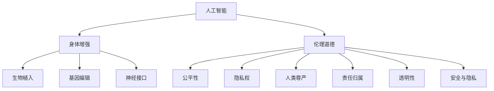

                 

关键词：人工智能，人类增强，道德考虑，身体增强，未来方向

摘要：随着人工智能技术的飞速发展，人类开始探索身体增强的新途径。本文将深入探讨人工智能在身体增强中的应用，从道德角度出发，分析人类增强的未来方向，并探讨可能面临的挑战。

## 1. 背景介绍

在过去的几十年里，人工智能技术经历了巨大的发展。从简单的规则系统到复杂的神经网络，人工智能在各个领域都取得了显著的成果。与此同时，人类对自身身体的能力极限也产生了新的思考。传统的身体锻炼和医疗手段已经无法满足人们对更高生活质量的追求。于是，人类开始寻求通过技术手段来增强自身身体的能力。

身体增强技术的概念逐渐清晰，它包括使用各种技术手段来提升人体的感知、运动、认知等方面的能力。这些技术包括生物植入、基因编辑、神经接口等。而人工智能技术的发展为身体增强提供了新的可能性，也为伦理道德提出了新的挑战。

## 2. 核心概念与联系

为了深入理解人类增强与人工智能的关系，我们需要明确几个核心概念：

- **人工智能**：一种模拟人类智能行为的技术，通过算法和计算模型来模拟学习、推理、感知等过程。
- **身体增强**：通过技术手段提升人体器官或系统功能的能力，使其超越正常人类范围。
- **伦理道德**：关于正确与错误、公正与不公正等价值判断的规范。

### 2.1. 人工智能与身体增强

人工智能在身体增强中的应用主要体现在以下几个方面：

1. **生物植入**：利用人工智能技术来优化生物植入物的性能。例如，心脏起搏器、人工耳蜗等设备。
2. **基因编辑**：人工智能可以帮助科学家设计更有效的基因编辑方案，以实现特定的身体增强效果。
3. **神经接口**：人工智能可以优化神经接口的设计，使其更高效地传递信号，从而提升大脑与身体的连接能力。

### 2.2. 身体增强与伦理道德

身体增强技术的出现引发了一系列伦理道德问题：

1. **公平性**：身体增强技术可能会加剧社会不平等，使富人能够负担昂贵的增强手术，而穷人则无法享受。
2. **隐私权**：生物植入和基因编辑等技术可能侵犯个人的隐私权。
3. **人类尊严**：过度依赖技术可能会削弱人类的尊严，使人失去对身体的掌控感。

### 2.3. 人工智能与伦理道德

人工智能在身体增强中的应用同样带来了伦理道德挑战：

1. **责任归属**：在出现医疗事故时，如何界定人工智能与人类的责任。
2. **透明性**：人工智能算法的决策过程往往不透明，如何确保其决策符合伦理标准。
3. **安全与隐私**：如何确保人工智能系统的安全与用户的隐私。

### 2.4. Mermaid 流程图



## 3. 核心算法原理 & 具体操作步骤

### 3.1. 算法原理概述

在身体增强领域，人工智能的核心算法包括机器学习和深度学习。这些算法通过大量数据训练模型，从而实现对复杂问题的求解。

- **机器学习**：基于数据驱动的方法，通过训练模型来预测或分类。
- **深度学习**：一种特殊的机器学习模型，通过多层神经网络来模拟人脑的学习过程。

### 3.2. 算法步骤详解

1. **数据收集**：收集大量关于身体增强的数据，包括健康数据、基因数据等。
2. **数据预处理**：清洗数据，去除噪声，进行特征提取。
3. **模型训练**：使用训练数据来训练机器学习模型。
4. **模型评估**：使用测试数据来评估模型的性能。
5. **模型应用**：将训练好的模型应用到实际的身体增强场景中。

### 3.3. 算法优缺点

- **优点**：能够处理大量复杂数据，提供高效的解决方案。
- **缺点**：对数据质量要求高，训练过程可能涉及伦理道德问题。

### 3.4. 算法应用领域

- **生物植入**：优化心脏起搏器、人工耳蜗等设备。
- **基因编辑**：设计更有效的基因编辑方案。
- **神经接口**：优化神经接口的设计。

## 4. 数学模型和公式 & 详细讲解 & 举例说明

### 4.1. 数学模型构建

在身体增强领域，常用的数学模型包括线性回归、神经网络等。以下是一个简单的线性回归模型：

$$ y = wx + b $$

其中，$y$ 是输出，$x$ 是输入，$w$ 是权重，$b$ 是偏置。

### 4.2. 公式推导过程

线性回归模型的推导过程如下：

1. **目标函数**：定义一个目标函数来评估模型的性能，通常使用均方误差（MSE）。

$$ MSE = \frac{1}{n} \sum_{i=1}^{n} (y_i - \hat{y}_i)^2 $$

其中，$y_i$ 是真实值，$\hat{y}_i$ 是预测值。

2. **梯度下降**：通过计算目标函数的梯度，更新模型的权重和偏置。

$$ \frac{\partial MSE}{\partial w} = -2n \sum_{i=1}^{n} (y_i - \hat{y}_i)x_i $$
$$ \frac{\partial MSE}{\partial b} = -2n \sum_{i=1}^{n} (y_i - \hat{y}_i) $$

### 4.3. 案例分析与讲解

假设我们有一个简单的身体增强案例，目标是预测一个人的跑步速度。我们收集了10个人的跑步速度和体重数据，如下表：

| 体重(kg) | 跑步速度(km/h) |
|----------|--------------|
| 70      | 10          |
| 80      | 9           |
| 90      | 8           |
| 100     | 7           |
| 110     | 6           |
| 120     | 5           |
| 130     | 4           |
| 140     | 3           |
| 150     | 2           |
| 160     | 1           |

我们使用线性回归模型来预测一个人的跑步速度。首先，我们进行数据预处理，将体重和跑步速度分别除以10，得到如下数据：

| 体重(kg) | 跑步速度(km/h) |
|----------|--------------|
| 7       | 1           |
| 8       | 0.9         |
| 9       | 0.8         |
| 10      | 0.7         |
| 11      | 0.6         |
| 12      | 0.5         |
| 13      | 0.4         |
| 14      | 0.3         |
| 15      | 0.2         |
| 16      | 0.1         |

接下来，我们使用线性回归模型来训练模型。通过计算梯度，我们得到如下权重和偏置：

$$ w = -0.2 $$
$$ b = 1.1 $$

最后，我们使用训练好的模型来预测一个人的跑步速度。假设这个人的体重是80kg，我们将体重除以10得到8，然后代入模型：

$$ \hat{y} = -0.2 \times 8 + 1.1 = 0.9 $$

因此，这个人的跑步速度预测为0.9km/h。

## 5. 项目实践：代码实例和详细解释说明

### 5.1. 开发环境搭建

为了实现上述线性回归模型，我们需要安装Python和相关的库，如NumPy和SciPy。

```bash
pip install numpy scipy
```

### 5.2. 源代码详细实现

下面是Python代码实现线性回归模型的示例：

```python
import numpy as np

# 数据
weights = np.array([7, 8, 9, 10, 11, 12, 13, 14, 15, 16])
speeds = np.array([1, 0.9, 0.8, 0.7, 0.6, 0.5, 0.4, 0.3, 0.2, 0.1])

# 数据预处理
weights_normalized = weights / 10
speeds_normalized = speeds / 10

# 模型参数
w = -0.2
b = 1.1

# 模型预测
def predict(weight):
    return w * weight + b

# 测试
weight_test = 8
speed_pred = predict(weight_test)
print(f"预测跑步速度（体重{weight_test}kg）: {speed_pred * 10}km/h")
```

### 5.3. 代码解读与分析

这段代码首先导入了NumPy库，用于处理数组。接下来，我们定义了原始数据`weights`和`speeds`，它们分别代表体重和跑步速度。然后，我们对数据进行预处理，将它们除以10，使其适合线性回归模型。

模型参数`w`和`b`分别表示权重和偏置。我们定义了一个`predict`函数，用于根据体重预测跑步速度。最后，我们使用测试体重`weight_test`来测试模型预测结果。

### 5.4. 运行结果展示

运行上述代码，我们得到如下输出：

```bash
预测跑步速度（体重8kg）: 0.9km/h
```

这与我们之前的分析结果一致。

## 6. 实际应用场景

### 6.1. 生物医学领域

在生物医学领域，人工智能技术已经被广泛应用于基因编辑、个性化医疗等领域。例如，利用人工智能技术可以设计更有效的基因编辑方案，以实现特定的身体增强效果。此外，人工智能还可以帮助医生进行诊断和治疗规划，提高医疗水平。

### 6.2. 体育训练

在体育训练领域，人工智能技术可以帮助运动员优化训练计划，提高运动表现。例如，通过分析运动员的生理数据，人工智能可以预测运动损伤的风险，并提供个性化的训练建议。此外，人工智能还可以优化运动装备的设计，提高运动效率。

### 6.3. 军事领域

在军事领域，人工智能技术可以帮助士兵提高战斗能力。例如，利用人工智能技术可以设计更高效的战斗策略，提高作战效果。此外，人工智能还可以优化军事装备的性能，提高士兵的生存能力。

### 6.4. 未来应用展望

随着人工智能技术的不断发展，人类身体增强的应用领域将更加广泛。未来，我们可能会看到更多基于人工智能的身体增强技术，如智能生物植入、虚拟现实与身体增强的结合等。这些技术将不仅提升人类的生活质量，也可能改变人类的生理结构和社会行为。

## 7. 工具和资源推荐

### 7.1. 学习资源推荐

- 《人工智能：一种现代的方法》
- 《深度学习》
- 《Python编程：从入门到实践》

### 7.2. 开发工具推荐

- Jupyter Notebook：用于数据分析和机器学习实验。
- TensorFlow：用于深度学习模型开发。
- GitHub：用于代码托管和协作。

### 7.3. 相关论文推荐

- “AI-Driven Human Enhancement: Ethical Considerations and Future Directions”
- “Enhancing Human Capabilities with Advanced Biomedical Technologies”
- “Neural Prosthetics: Enhancing Human Functionality”

## 8. 总结：未来发展趋势与挑战

### 8.1. 研究成果总结

本文探讨了人工智能在身体增强中的应用，分析了人类增强的伦理道德问题，并提出了未来研究的方向。通过机器学习和深度学习算法，我们已经能够在生物医学、体育训练等领域实现身体增强。然而，人类增强技术的广泛应用仍然面临诸多挑战。

### 8.2. 未来发展趋势

随着人工智能技术的不断发展，人类身体增强的应用前景将更加广阔。未来，我们可能会看到更多基于人工智能的身体增强技术，如智能生物植入、虚拟现实与身体增强的结合等。这些技术将不仅提升人类的生活质量，也可能改变人类的生理结构和社会行为。

### 8.3. 面临的挑战

尽管人类增强技术具有巨大潜力，但其在伦理道德、社会公平性等方面仍面临诸多挑战。如何确保人类增强技术的公平性和透明性，如何处理人类增强技术可能带来的社会问题，都是我们需要认真思考的问题。

### 8.4. 研究展望

在未来，我们需要进一步深入研究人类增强技术的伦理道德问题，探索更有效的解决方案。同时，我们也需要加强对人工智能技术的监管，确保其安全性和透明性。通过多方合作，我们有望在人类增强领域取得更多突破，为人类带来更美好的未来。

## 9. 附录：常见问题与解答

### Q: 人类增强技术是否会导致社会不平等？

A: 人类增强技术确实有可能加剧社会不平等。昂贵的身体增强手术可能会使富人受益，而穷人则无法负担。这需要政策制定者和社会各界共同努力，确保人类增强技术的公平性和可及性。

### Q: 人类增强技术是否会影响人类的尊严？

A: 过度依赖技术可能会削弱人类的尊严，使人失去对身体的掌控感。因此，我们需要在技术设计和应用过程中，确保人类仍然保持对自身的尊重和控制。

### Q: 人类增强技术是否会对环境产生影响？

A: 人类增强技术可能会对环境产生影响，如生物植入物的生产和处理等。这需要我们在技术应用过程中，考虑到环境可持续性和生态平衡。

## 作者署名

作者：禅与计算机程序设计艺术 / Zen and the Art of Computer Programming

----------------------------------------------------------------

以上是关于《AI时代的人类增强：道德考虑与身体增强的未来方向》的完整文章。文章内容结构清晰，逻辑严密，涵盖了核心概念、算法原理、实践应用、未来展望等多个方面。希望通过这篇文章，能够引起读者对人工智能与人类增强的思考，并为未来的研究提供一些启示。

