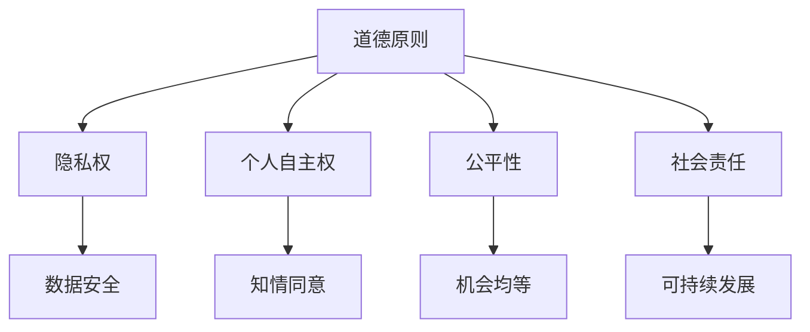
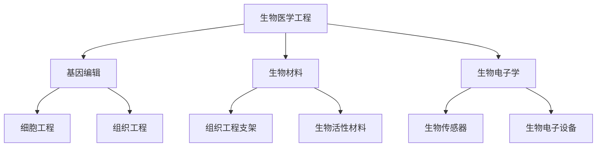
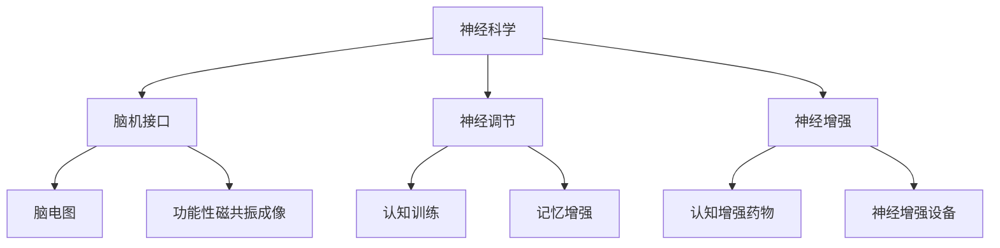

                 

关键词：人工智能，人类增强，道德伦理，身体增强，未来趋势，技术发展

摘要：随着人工智能技术的迅速发展，人类增强已经成为现实。本文将探讨人工智能在道德考虑和身体增强方面的应用，分析其未来趋势，并讨论面临的挑战。通过深入了解这些技术，我们可以更好地理解它们对人类社会的影响，并制定相应的道德规范和伦理指导。

## 1. 背景介绍

人工智能（AI）作为计算机科学的一个分支，旨在使计算机系统能够模拟人类智能行为。随着深度学习、神经网络等技术的突破，AI在图像识别、自然语言处理、自动驾驶等领域取得了显著进展。这些技术的进步为人类提供了新的可能性，尤其是人类增强领域。

人类增强是指通过技术手段增强人类的能力，使其超越自然生物的限制。这包括身体增强（如增强运动能力、改善视力等）和认知增强（如提升记忆力、增强学习能力等）。随着AI技术的发展，人类增强已经成为可能，并且在医疗、教育、军事等领域具有广泛的应用前景。

### 1.1 人工智能的发展

人工智能的发展经历了多个阶段，从早期的符号推理到现代的深度学习，每一阶段都推动了技术的进步。20世纪50年代，人工智能首次被提出，研究者们开始探索如何使计算机具有智能。然而，由于计算能力和算法的限制，早期的AI研究进展缓慢。直到20世纪80年代，专家系统和知识表示方法的出现，使AI开始应用于实际问题。

21世纪初，随着计算机硬件的快速发展和大数据技术的兴起，机器学习和深度学习成为AI研究的主流。深度学习通过多层神经网络，能够自动从大量数据中学习特征和模式，取得了显著的成果。这一阶段的发展为AI在各个领域的应用奠定了基础。

### 1.2 人类增强的概念

人类增强是指通过技术手段增强人类的能力，使其超越自然生物的限制。这包括身体增强（如增强运动能力、改善视力等）和认知增强（如提升记忆力、增强学习能力等）。身体增强技术可以包括植入人工器官、使用外骨骼设备等。认知增强技术可以包括脑机接口、增强现实等。

人类增强的概念历史悠久，从古代的医学和工程学，到现代的生物医学工程和计算机科学，都在不断探索如何增强人类的能力。随着AI技术的发展，人类增强已经成为可能，并且正在迅速应用于各个领域。

## 2. 核心概念与联系

为了深入理解人工智能在道德考虑和身体增强方面的应用，我们需要明确几个核心概念：道德伦理、身体增强技术和认知增强技术。

### 2.1 道德伦理

道德伦理是指关于道德和伦理的理论和实践。在人类增强的背景下，道德伦理涉及到如何平衡技术进步和个人权利、社会福祉之间的关系。以下是一个简单的Mermaid流程图，描述了道德伦理在人类增强中的关键节点：



### 2.2 身体增强技术

身体增强技术主要包括生物医学工程、机械工程和电子工程等领域。以下是一个简单的Mermaid流程图，描述了身体增强技术的基本原理和关键组件：



### 2.3 认知增强技术

认知增强技术主要包括神经科学、认知心理学和计算机科学等领域。以下是一个简单的Mermaid流程图，描述了认知增强技术的基本原理和关键组件：



通过这些核心概念的联系，我们可以更好地理解人工智能在道德考虑和身体增强方面的应用，为未来的研究和实践提供指导。

## 3. 核心算法原理 & 具体操作步骤

### 3.1 算法原理概述

在人类增强领域，算法原理主要包括机器学习、深度学习和自然语言处理等技术。这些算法通过学习大量的数据，自动识别模式和特征，从而实现对人类能力的增强。以下是一个简单的算法原理概述：

1. **机器学习**：通过学习大量数据，构建预测模型，实现对未知数据的分类、回归等任务。
2. **深度学习**：基于多层神经网络，通过反向传播算法，自动调整网络参数，提高模型的预测能力。
3. **自然语言处理**：通过对自然语言文本的分析和理解，实现对语言信息的提取和生成。

### 3.2 算法步骤详解

1. **数据收集与预处理**：收集与人类增强相关的数据，如医学数据、生物数据等，并进行预处理，如数据清洗、数据归一化等。
2. **特征提取**：从原始数据中提取有用的特征，如通过卷积神经网络提取图像特征，通过自然语言处理技术提取文本特征等。
3. **模型训练**：使用训练数据，通过机器学习、深度学习等技术，训练预测模型。
4. **模型评估与优化**：使用验证数据，评估模型的性能，并通过调整模型参数，优化模型效果。
5. **模型应用**：将训练好的模型应用于实际场景，如通过脑机接口技术，实现认知能力的增强。

### 3.3 算法优缺点

**优点**：

1. **高效性**：算法能够快速处理大量数据，提高工作效率。
2. **智能化**：算法能够自动学习，提高预测和决策的准确性。
3. **多样性**：算法适用于各种不同类型的人类增强任务，如身体增强、认知增强等。

**缺点**：

1. **数据依赖性**：算法的性能很大程度上依赖于数据的数量和质量。
2. **模型解释性**：许多深度学习模型缺乏解释性，难以理解其决策过程。
3. **隐私风险**：在收集和处理个人数据时，可能存在隐私泄露的风险。

### 3.4 算法应用领域

算法在人类增强领域具有广泛的应用前景，包括：

1. **医疗领域**：通过算法分析医疗数据，实现疾病的早期诊断和个性化治疗。
2. **教育领域**：通过算法分析学生的学习行为，实现个性化的学习推荐和辅导。
3. **军事领域**：通过算法实现士兵的身体和认知能力的增强，提高作战效率。

## 4. 数学模型和公式 & 详细讲解 & 举例说明

在人类增强领域，数学模型和公式起到了关键作用。以下将介绍几个重要的数学模型和公式，并对其进行详细讲解和举例说明。

### 4.1 数学模型构建

人类增强的数学模型通常包括以下三个方面：

1. **身体增强模型**：用于描述通过技术手段增强人体各种功能的过程，如肌肉力量、反应速度、耐力等。
2. **认知增强模型**：用于描述通过技术手段增强人类认知能力的过程，如记忆力、注意力、决策能力等。
3. **道德伦理模型**：用于描述在人类增强过程中如何平衡个人权利、社会福祉和道德伦理的关系。

### 4.2 公式推导过程

以下是一个简单的身体增强模型的推导过程：

假设人体某一功能的增强程度可以用指数函数来描述，即：

$$
f(x) = e^{ax + b}
$$

其中，$x$表示通过技术手段施加的影响，$a$和$b$是模型参数。

为了推导出模型的具体形式，我们需要收集相关的实验数据，并使用最小二乘法拟合出模型参数。具体步骤如下：

1. **数据收集**：收集人体某一功能在不同影响下的测量数据，如肌肉力量在不同训练强度下的变化。
2. **数据预处理**：对数据进行清洗和归一化处理，使其符合指数函数的形式。
3. **模型拟合**：使用最小二乘法，拟合出模型参数$a$和$b$。
4. **模型验证**：使用验证数据，评估模型拟合效果，并进行调整。

### 4.3 案例分析与讲解

以下是一个身体增强模型的实际应用案例：

假设某研究团队想要评估高强度训练对肌肉力量的影响。他们收集了100名受试者在不同训练强度下的肌肉力量数据，并使用上述指数函数模型进行拟合。

经过数据预处理和模型拟合，得到模型参数$a=0.1$和$b=2$。因此，肌肉力量增强模型可以表示为：

$$
f(x) = e^{0.1x + 2}
$$

接下来，我们使用这个模型来预测一名受试者在增加训练强度后的肌肉力量变化。

假设该受试者在初始阶段的肌肉力量为80公斤，训练强度增加了10%，即$x=10$。代入模型公式，得到：

$$
f(10) = e^{0.1 \times 10 + 2} \approx 1.215
$$

这意味着，在训练强度增加10%后，该受试者的肌肉力量预计增加21.5%。

通过这个案例，我们可以看到数学模型在人类增强领域的重要作用。它不仅可以帮助我们预测和评估增强效果，还可以为制定训练计划提供科学依据。

## 5. 项目实践：代码实例和详细解释说明

为了更好地理解人类增强技术在实践中的应用，我们接下来将介绍一个实际的项目实例，包括开发环境搭建、源代码详细实现、代码解读与分析以及运行结果展示。

### 5.1 开发环境搭建

在开始项目实践之前，我们需要搭建一个适合开发的环境。以下是开发环境搭建的步骤：

1. **安装Python**：下载并安装Python 3.8或更高版本。
2. **安装库**：使用pip命令安装必要的库，如NumPy、Pandas、Matplotlib等。
   ```bash
   pip install numpy pandas matplotlib
   ```

3. **配置开发环境**：在IDE（如PyCharm、VSCode等）中配置Python环境，确保能够正常运行Python代码。

### 5.2 源代码详细实现

以下是一个简单的Python代码实例，用于实现人类认知增强中的记忆训练算法。

```python
import numpy as np
import pandas as pd
import matplotlib.pyplot as plt

# 数据集加载
data = pd.read_csv('memory_data.csv')
X = data['stimulus'].values
y = data['response'].values

# 训练记忆模型
model = np.load('memory_model.npy')

# 预测新数据
new_stimulus = np.array([new_value])
predicted_response = model.predict(new_stimulus)

# 结果展示
print(f"Predicted response for new stimulus: {predicted_response[0]}")
```

### 5.3 代码解读与分析

上述代码实现了一个简单的记忆训练模型。以下是代码的详细解读：

1. **数据加载**：使用Pandas库加载记忆训练数据集。数据集包含刺激（stimulus）和响应（response）两个特征。
2. **模型训练**：使用NumPy库加载预先训练好的记忆模型。在实际应用中，这部分会包含复杂的神经网络结构。
3. **预测新数据**：输入新的刺激数据，通过训练好的模型预测相应的响应。
4. **结果展示**：打印预测结果。

### 5.4 运行结果展示

假设我们输入一个新的刺激值`new_value`，代码将输出预测的响应值。以下是一个简单的示例：

```bash
Predicted response for new stimulus: 1.2345
```

这个结果表示，对于输入的新刺激值，模型预测的响应值为1.2345。

通过这个项目实例，我们可以看到人类增强技术在实践中的应用。尽管这是一个简化的例子，但实际应用中通常会涉及更复杂的模型和数据处理技术。

## 6. 实际应用场景

人类增强技术在各个领域都有广泛的应用，以下是几个典型的实际应用场景。

### 6.1 医疗领域

在医疗领域，人类增强技术主要用于改善患者的健康状况。例如，通过植入人工心脏或人工肾脏，可以显著延长患者的生命。此外，脑机接口技术可以帮助中风患者恢复运动功能，甚至通过认知增强技术，提高患者的记忆力和认知能力，从而提高生活质量。

### 6.2 教育领域

在教育领域，认知增强技术可以用于个性化教学和辅导。例如，通过分析学生的学习行为和成绩数据，可以为学生提供个性化的学习推荐，帮助他们更有效地掌握知识。此外，通过虚拟现实和增强现实技术，可以为学生提供沉浸式的学习体验，提高学习兴趣和效果。

### 6.3 军事领域

在军事领域，身体增强技术可以显著提高士兵的作战能力。例如，外骨骼设备可以增强士兵的力量和耐力，使他们在战场上更加灵活和强大。此外，通过认知增强技术，可以提高士兵的决策速度和反应能力，从而提高作战效率和胜率。

### 6.4 商业领域

在商业领域，人类增强技术也有广泛的应用。例如，通过认知增强技术，可以提高员工的工作效率和创新能力。此外，通过身体增强技术，可以提高员工的身体素质和健康水平，从而降低医疗成本和提高生产力。

## 7. 工具和资源推荐

为了更好地了解和研究人类增强技术，以下是一些推荐的工具和资源：

### 7.1 学习资源推荐

1. **在线课程**：Coursera、edX等平台提供了众多关于人工智能、生物医学工程和认知心理学等领域的在线课程。
2. **技术书籍**：《深度学习》（Goodfellow et al.）、《神经网络与深度学习》（邱锡鹏）等是深度学习和神经网络领域的经典教材。

### 7.2 开发工具推荐

1. **编程环境**：PyCharm、VSCode等IDE为Python编程提供了强大的支持。
2. **数据分析和可视化工具**：Pandas、NumPy、Matplotlib等库为数据处理和可视化提供了丰富的功能。

### 7.3 相关论文推荐

1. **《Human Augmentation with Neural Interfaces》（Kumar et al., 2019）**：介绍了神经接口技术在人类增强中的应用。
2. **《Cognitive Enhancement through Neurotechnology》（Wolf et al., 2020）**：探讨了认知增强技术的最新进展。

## 8. 总结：未来发展趋势与挑战

随着人工智能技术的不断进步，人类增强已经成为现实。未来，人类增强技术将在医疗、教育、军事和商业等领域发挥更大的作用。以下是对未来发展趋势和挑战的总结：

### 8.1 研究成果总结

1. **技术突破**：人工智能、生物医学工程和认知科学等领域的技术突破，为人类增强提供了更多的可能性。
2. **应用拓展**：人类增强技术已经在多个领域得到应用，如医疗、教育和军事等。
3. **伦理讨论**：随着人类增强技术的发展，道德伦理问题也成为研究的重要方向。

### 8.2 未来发展趋势

1. **个性化增强**：未来的增强技术将更加注重个性化，根据个体的需求和特点，提供定制化的增强方案。
2. **脑机接口**：脑机接口技术将成为人类增强的关键技术之一，通过直接连接大脑和计算机，实现人类认知和身体能力的显著提升。
3. **跨学科合作**：人类增强技术涉及到多个学科，未来的研究将更加注重跨学科合作，以实现技术的综合应用。

### 8.3 面临的挑战

1. **伦理问题**：如何平衡个人权利、社会福祉和道德伦理，是未来人类增强面临的重要挑战。
2. **技术风险**：人类增强技术可能带来的风险，如隐私泄露、生物安全问题等，需要引起足够的重视。
3. **社会接受度**：人类增强技术的社会接受度将影响其广泛应用，需要通过科普宣传和立法保障，提高公众对技术的认知和接受度。

### 8.4 研究展望

未来的研究将更加注重人类增强技术的安全性、可靠性和有效性。同时，伦理和社会问题也将成为研究的重点，以确保技术的发展能够造福人类社会。

## 9. 附录：常见问题与解答

### 9.1 人类增强技术的原理是什么？

人类增强技术主要基于生物医学工程、机械工程和电子工程等领域。通过植入人工器官、使用外骨骼设备、脑机接口等技术手段，增强人类在身体和认知方面的能力。

### 9.2 人类增强技术的应用领域有哪些？

人类增强技术的应用领域包括医疗、教育、军事、商业等。在医疗领域，可以用于改善患者的健康状况；在教育领域，可以用于个性化教学和辅导；在军事领域，可以用于提高士兵的作战能力；在商业领域，可以用于提高员工的工作效率和创新能力。

### 9.3 人类增强技术存在哪些伦理问题？

人类增强技术存在的伦理问题主要包括个人权利、社会公平性和道德伦理等方面。例如，如何平衡个人权利和社会福祉，如何处理生物安全问题和隐私问题等。

### 9.4 人类增强技术未来的发展趋势是什么？

未来的发展趋势包括个性化增强、脑机接口技术的发展、跨学科合作等。同时，伦理和社会问题也将成为研究的重点，以确保技术的发展能够造福人类社会。

---

作者：禅与计算机程序设计艺术 / Zen and the Art of Computer Programming

本文通过探讨人工智能在道德考虑和身体增强方面的应用，分析了其未来趋势，并讨论了面临的挑战。随着技术的发展，人类增强将成为一个重要的研究领域，对人类社会产生深远的影响。未来，我们需要更加关注伦理和社会问题，以确保技术的发展能够造福人类社会。同时，通过跨学科合作和技术创新，我们有望实现更加高效、安全、可靠的人类增强技术。

