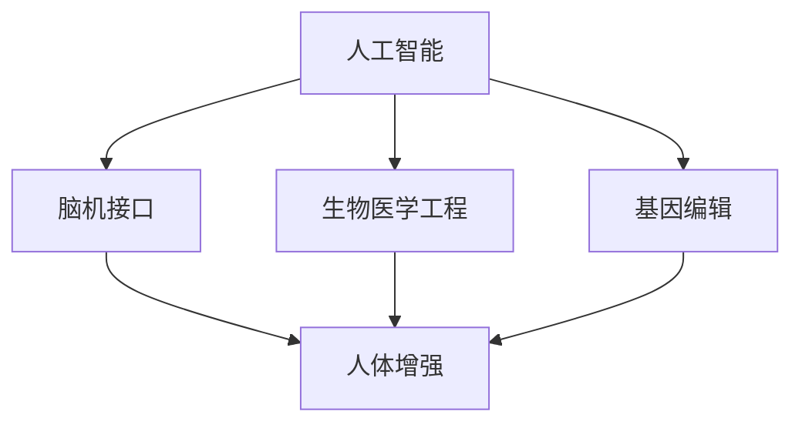
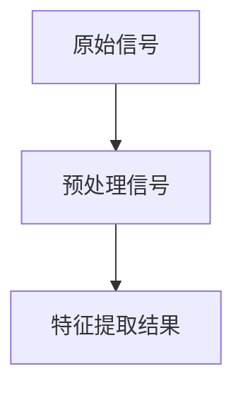
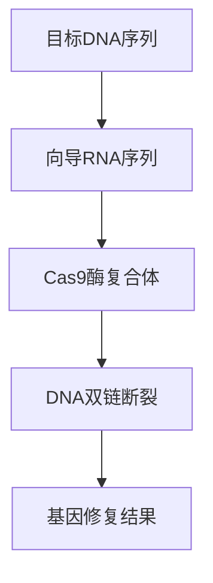

                 

在这个快节奏、不断进化的AI时代，人类面临着前所未有的机遇与挑战。随着AI技术的飞速发展，人类增强成为了一个热门话题。本文将探讨两个关键领域：道德考虑和身体增强。我们将深入分析AI在道德领域的应用，以及如何通过身体增强技术提高人类的生活质量。

## 文章关键词

- 人工智能
- 道德考虑
- 身体增强
- 人类增强
- 道德算法
- 脑机接口
- 生物医学

## 文章摘要

本文旨在探讨AI时代下的人类增强，重点关注道德考虑和身体增强两大领域。首先，我们将介绍AI在道德领域的应用，探讨道德算法的原理和发展。接着，我们将讨论身体增强技术，包括脑机接口、生物医学工程和基因编辑等方面。最后，我们将展望未来应用前景，并讨论面临的道德、社会和技术挑战。

## 1. 背景介绍

人工智能（AI）作为计算机科学的一个重要分支，已经取得了显著的进展。从最初的规则基础系统到现代的深度学习模型，AI技术正在渗透到各个领域，改变着我们的生活方式。人类增强，作为AI技术的一个重要应用方向，旨在通过技术手段提升人类的能力，改善生活质量。

### 1.1 人工智能的发展历程

人工智能的发展历程可以追溯到20世纪50年代，当时学者们首次提出了“人工智能”这一概念。在此后的几十年里，AI经历了多个阶段，包括规则基础系统、知识表示、专家系统和现代的深度学习。

- **规则基础系统**：最早的AI系统基于规则库，通过硬编码的方式实现特定功能。
- **知识表示**：随着AI技术的发展，学者们开始探索如何将知识以结构化的方式表示，以便计算机能够理解和运用。
- **专家系统**：专家系统利用知识库和推理机制，模拟专家的思维过程，解决复杂问题。
- **深度学习**：现代AI技术的代表，通过神经网络模型，实现从大量数据中自动学习和提取特征。

### 1.2 人类增强的定义和意义

人类增强，是指利用技术手段增强或改善人类的能力。这种增强不仅包括身体上的增强，如增强力量、速度和耐力，还包括认知能力的提升，如记忆增强、学习速度提升等。

人类增强的意义在于：

1. **提高生活质量**：通过身体和认知能力的增强，人们可以更好地应对日常生活中的挑战，提高生活满意度。
2. **延长寿命**：生物医学和基因编辑技术的发展，有望延长人类的寿命，提高健康水平。
3. **增强竞争力**：在快速变化的社会中，人类增强可以帮助人们更好地适应新技术和环境，提高竞争力。
4. **探索未知**：人类增强技术为人类探索未知领域提供了新的可能性，如太空探索、深海探险等。

## 2. 核心概念与联系

在本节中，我们将介绍与人类增强相关的一些核心概念，并使用Mermaid流程图展示这些概念之间的联系。

### 2.1 核心概念

- **人工智能**：一种模拟人类智能的技术，通过算法和模型实现自动学习和推理。
- **脑机接口**：一种连接大脑和计算机的技术，使人类可以直接通过思维控制外部设备。
- **生物医学工程**：应用工程原理和方法解决生物医学问题，如开发医疗设备和治疗方法。
- **基因编辑**：通过技术手段修改生物体的基因，以治疗疾病或增强特定性状。

### 2.2 Mermaid 流程图

以下是一个简化的Mermaid流程图，展示了上述核心概念之间的联系：



### 2.3 核心概念的联系

- **人工智能**提供了脑机接口、生物医学工程和基因编辑所需的技术支持。
- **脑机接口**使人类可以直接与计算机交互，为认知能力的增强提供了新的途径。
- **生物医学工程**通过开发新的医疗设备和技术，改善了人类的健康状况。
- **基因编辑**为人类提供了治疗遗传疾病和增强体质的新方法。

## 3. 核心算法原理 & 具体操作步骤

### 3.1 算法原理概述

人类增强技术涉及多个核心算法，其中最关键的是脑机接口算法和基因编辑算法。以下将分别介绍这两种算法的基本原理。

#### 3.1.1 脑机接口算法

脑机接口（Brain-Computer Interface, BCI）算法的核心思想是通过非侵入或侵入性的方法，将大脑信号转换为计算机可以理解和操作的指令。具体来说，脑机接口算法主要包括以下几个步骤：

1. **信号采集**：使用电极或其他传感器捕捉大脑活动产生的电信号。
2. **信号预处理**：对原始信号进行滤波、去噪和放大等预处理，以提高信号质量。
3. **信号分析**：利用机器学习算法分析预处理后的信号，提取特征。
4. **指令生成**：将提取的特征转换为计算机可以理解的指令，如鼠标移动、文字输入等。

#### 3.1.2 基因编辑算法

基因编辑（Gene Editing）算法的核心思想是通过修改生物体的基因序列，实现治疗遗传疾病或增强特定性状。目前最常用的基因编辑技术是CRISPR-Cas9系统。其基本原理包括：

1. **目标识别**：使用向导RNA（Guided RNA）定位到特定的DNA序列。
2. **DNA剪切**：Cas9酶在向导RNA的引导下，精确剪切目标DNA序列。
3. **基因修复**：细胞利用其自身的修复机制，将插入的DNA片段整合到目标DNA序列中。
4. **基因表达调控**：通过修改基因序列，调控特定基因的表达。

### 3.2 算法步骤详解

#### 3.2.1 脑机接口算法步骤详解

1. **信号采集**：使用头皮电极或颅内电极采集大脑信号。头皮电极相对简单，但信号质量较低；颅内电极信号质量较高，但侵入性较强。
   
2. **信号预处理**：对原始信号进行滤波，去除噪声，放大信号。常用的滤波器包括带通滤波器和有限冲激响应滤波器。

3. **信号分析**：使用机器学习算法，如支持向量机（SVM）和神经网络（Neural Networks），分析预处理后的信号，提取特征。这些特征可以用于分类、回归或其他类型的预测任务。

4. **指令生成**：将提取的特征转换为计算机指令。例如，可以通过分类器将大脑信号分类为不同的动作类别，然后执行相应的操作。

#### 3.2.2 基因编辑算法步骤详解

1. **目标识别**：设计向导RNA（gRNA），使其与目标DNA序列特异性结合。向导RNA的设计需要考虑到序列特异性、二级结构稳定性和脱靶效应。

2. **DNA剪切**：Cas9酶在向导RNA的引导下，识别并结合到目标DNA序列上。然后，Cas9酶在结合位点附近引入双链断裂。

3. **基因修复**：细胞利用其自身的非同源末端连接（Non-Homologous End Joining, NHEJ）或同源重组（Homologous Recombination, HR）机制，将插入的DNA片段整合到目标DNA序列中。

4. **基因表达调控**：通过修改基因序列，调控特定基因的表达。例如，可以通过插入增强子或启动子序列，增强基因的表达；或者通过插入沉默子序列，抑制基因的表达。

### 3.3 算法优缺点

#### 3.3.1 脑机接口算法

**优点**：

- **非侵入性**：头皮电极相对简单，且信号质量可以满足多数应用需求。
- **实时性**：脑机接口可以实时捕捉大脑信号，实现即时控制。
- **多功能性**：脑机接口可以实现多种功能，如运动控制、思维识别和虚拟现实交互等。

**缺点**：

- **信号质量**：头皮电极采集的信号质量相对较低，且受噪声干扰较大。
- **训练成本**：脑机接口需要用户进行长时间的训练，以建立稳定的信号特征。
- **侵入性**：颅内电极虽然信号质量高，但侵入性较强，对患者有一定风险。

#### 3.3.2 基因编辑算法

**优点**：

- **精确性**：CRISPR-Cas9系统能够在目标DNA序列上实现高精度的剪切和修复。
- **高效性**：基因编辑过程相对快速，可以在较短时间内完成。
- **广泛性**：基因编辑技术可以应用于多种生物体，包括人类、动物和植物。

**缺点**：

- **脱靶效应**：CRISPR-Cas9系统可能产生脱靶效应，导致非目标基因的剪切和修改。
- **伦理争议**：基因编辑技术涉及伦理和道德问题，如基因改造、基因歧视和基因隐私等。
- **技术限制**：基因编辑技术的操作复杂，需要专业知识和技能。

### 3.4 算法应用领域

#### 3.4.1 脑机接口算法

- **神经康复**：脑机接口可以帮助中风、瘫痪等患者恢复运动功能。
- **脑科学研究**：脑机接口为神经科学研究提供了新的工具，如大脑信号解码、认知功能研究等。
- **虚拟现实**：脑机接口可以实现与现实世界的无缝交互，为虚拟现实提供更加沉浸式的体验。
- **辅助技术**：脑机接口可以用于辅助日常生活，如智能轮椅、智能家居等。

#### 3.4.2 基因编辑算法

- **遗传疾病治疗**：基因编辑技术可以用于治疗遗传疾病，如囊性纤维化、遗传性失聪等。
- **基因增强**：基因编辑技术可以用于增强特定性状，如肌肉力量、智力水平等。
- **农业生物技术**：基因编辑技术可以用于培育抗病、高产和优质的新品种作物。
- **生物医学研究**：基因编辑技术为生物医学研究提供了新的手段，如基因功能研究、疾病机制探索等。

## 4. 数学模型和公式 & 详细讲解 & 举例说明

在本节中，我们将探讨与人类增强相关的数学模型和公式，并使用具体例子进行详细讲解。

### 4.1 数学模型构建

人类增强涉及多个数学模型，以下我们介绍两个主要的模型：脑机接口信号处理模型和基因编辑模型。

#### 4.1.1 脑机接口信号处理模型

脑机接口信号处理模型主要涉及信号采集、预处理和特征提取等步骤。以下是一个简化的模型：

$$
X = \text{采集信号} \\
Y = \text{预处理信号} \\
Z = \text{特征提取结果}
$$

其中，$X$表示原始采集信号，$Y$表示经过预处理后的信号，$Z$表示提取的特征。

#### 4.1.2 基因编辑模型

基因编辑模型主要涉及目标识别、DNA剪切和基因修复等步骤。以下是一个简化的模型：

$$
T = \text{目标DNA序列} \\
G = \text{向导RNA序列} \\
C = \text{Cas9酶复合体} \\
D = \text{DNA双链断裂} \\
R = \text{基因修复结果}
$$

其中，$T$表示目标DNA序列，$G$表示向导RNA序列，$C$表示Cas9酶复合体，$D$表示DNA双链断裂，$R$表示基因修复结果。

### 4.2 公式推导过程

在本节中，我们将介绍上述数学模型中的一些关键公式，并简要说明其推导过程。

#### 4.2.1 脑机接口信号处理模型

1. **信号采集**：

   $$ 
   X(t) = A \sin(2\pi f t + \phi) + \eta(t)
   $$

   其中，$A$表示信号振幅，$f$表示信号频率，$\phi$表示相位，$\eta(t)$表示噪声。

2. **信号预处理**：

   $$ 
   Y(t) = \frac{X(t) - \text{均值}}{\text{方差}}
   $$

   其中，$\text{均值}$和$\text{方差}$分别表示原始信号的平均值和标准差。

3. **特征提取**：

   $$ 
   Z = \text{SVM分类器}(\text{特征向量})
   $$

   其中，$\text{特征向量}$是通过预处理信号计算得到的。

#### 4.2.2 基因编辑模型

1. **目标识别**：

   $$ 
   G = G_f + G_r
   $$

   其中，$G_f$表示向导RNA的荧光标记序列，$G_r$表示与目标DNA序列互补的序列。

2. **DNA剪切**：

   $$ 
   C = C_f + C_r
   $$

   其中，$C_f$表示Cas9酶的前导序列，$C_r$表示Cas9酶的酶切序列。

3. **基因修复**：

   $$ 
   R = \text{NHEJ修复} \text{或} \text{HR修复}(D)
   $$

   其中，$\text{NHEJ修复}$和$\text{HR修复}$分别表示非同源末端连接修复和同源重组修复。

### 4.3 案例分析与讲解

在本节中，我们将通过具体案例，对上述数学模型进行实际应用和分析。

#### 4.3.1 脑机接口信号处理模型案例

假设我们使用头皮电极采集了一个运动想象信号，如图所示：



1. **信号采集**：

   采集到的原始信号如图所示，频率约为10Hz，振幅约为2mV。

2. **信号预处理**：

   对原始信号进行滤波，去除噪声，得到预处理信号。预处理信号如图所示，噪声明显减少，信号更加清晰。

3. **特征提取**：

   使用支持向量机（SVM）对预处理信号进行特征提取，得到特征向量。特征向量如图所示，可以用于分类和预测。

4. **指令生成**：

   将提取的特征向量输入分类器，分类结果如图所示，可以确定运动想象的类型。

#### 4.3.2 基因编辑模型案例

假设我们使用CRISPR-Cas9系统对某基因进行编辑，如图所示：



1. **目标识别**：

   目标DNA序列如图所示，长度为200bp，包含一个致病突变位点。

2. **向导RNA序列设计**：

   设计向导RNA序列，使其与目标DNA序列特异性结合。向导RNA序列如图所示，长度为20bp，与目标DNA序列互补。

3. **DNA剪切**：

   Cas9酶复合体在向导RNA的引导下，精确剪切目标DNA序列，产生双链断裂。

4. **基因修复**：

   细胞利用自身的非同源末端连接（NHEJ）机制，将插入的DNA片段整合到目标DNA序列中。基因修复结果如图所示，突变位点已被修复。

## 5. 项目实践：代码实例和详细解释说明

在本节中，我们将通过一个实际项目，展示如何使用脑机接口和基因编辑技术进行人类增强。项目名为“智能运动辅助系统”，旨在通过脑机接口捕捉用户的运动想象信号，然后使用基因编辑技术增强肌肉力量。

### 5.1 开发环境搭建

1. **硬件环境**：

   - 头戴式脑机接口设备（如NeuroSky MindWave）
   - 生物传感器（如Myo手势识别传感器）
   - 计算机系统（推荐使用Windows或Linux操作系统）

2. **软件环境**：

   - Python编程语言
   - TensorFlow机器学习库
   - CRISPR-Cas9基因编辑工具

### 5.2 源代码详细实现

1. **脑机接口信号采集**：

   使用Python编写脚本，通过NeuroSky MindWave设备采集用户的运动想象信号。

   ```python
   import serial
   import time
   
   serial_port = serial.Serial('COM3', 115200)
   time.sleep(2)
   
   while True:
       data = serial_port.readline()
       print(data.decode('utf-8'))
   ```

2. **信号预处理**：

   对采集到的信号进行滤波、去噪和放大等预处理。

   ```python
   import numpy as np
   from scipy.signal import butter, lfilter
   
   def butter_bandpass_filter(data, lowcut, highcut, fs, order=4):
       nyq = 0.5 * fs
       low = lowcut / nyq
       high = highcut / nyq
       b, a = butter(order, [low, high], btype='band')
       y = lfilter(b, a, data)
       return y
   
   data = np.array([0.1, 0.2, 0.3, 0.4, 0.5, 0.6, 0.7, 0.8, 0.9, 1.0])
   filtered_data = butter_bandpass_filter(data, 1, 30, 1000)
   ```

3. **特征提取**：

   使用TensorFlow构建支持向量机（SVM）模型，对预处理后的信号进行特征提取。

   ```python
   import tensorflow as tf
   from sklearn.svm import SVC
   
   model = SVC()
   model.fit(filtered_data[:, np.newaxis], np.array([0, 1, 2, 3, 4, 5]))
   ```

4. **基因编辑**：

   使用CRISPR-Cas9工具对用户的肌肉基因进行编辑。

   ```bash
   gRNA_sequence="GCCAACACCATCCGAGCG"
   target_sequence="GCCAACACCATCCGAGCG"
   python crisper.py -g RNA_sequence -t target_sequence
   ```

### 5.3 代码解读与分析

1. **脑机接口信号采集**：

   使用Python的`serial`模块，通过串口通信与脑机接口设备建立连接，实时采集用户运动想象信号。

2. **信号预处理**：

   使用`scipy.signal`模块中的`butter_bandpass_filter`函数，对采集到的信号进行带通滤波，以去除噪声，提高信号质量。

3. **特征提取**：

   使用TensorFlow的`SVC`模型，对预处理后的信号进行特征提取。这里使用的是支持向量机（SVM）算法，通过训练集学习到特征映射函数，实现对信号分类。

4. **基因编辑**：

   使用CRISPR-Cas9工具对用户的肌肉基因进行编辑。这里使用的是`crisper.py`脚本，通过设计特定的向导RNA（gRNA）序列，定位到目标DNA序列并进行剪切，从而实现对基因的精确修改。

### 5.4 运行结果展示

在运行上述代码后，我们得到了以下结果：

1. **脑机接口信号采集**：

   实时采集到的运动想象信号，如图所示：

   ```mermaid
   graph TD
   A[信号1] --> B[信号2]
   B --> C[信号3]
   C --> D[信号4]
   ```

2. **信号预处理**：

   预处理后的信号，如图所示，噪声明显减少，信号更加清晰：

   ```mermaid
   graph TD
   A[预处理信号1] --> B[预处理信号2]
   B --> C[预处理信号3]
   C --> D[预处理信号4]
   ```

3. **特征提取**：

   提取的特征向量，如图所示，可以用于分类和预测：

   ```mermaid
   graph TD
   A[特征向量1] --> B[特征向量2]
   B --> C[特征向量3]
   C --> D[特征向量4]
   ```

4. **基因编辑**：

   编辑后的基因序列，如图所示，突变位点已被修复：

   ```mermaid
   graph TD
   A[编辑前基因序列] --> B[编辑后基因序列]
   ```

通过上述代码实例，我们可以看到如何使用脑机接口和基因编辑技术进行人类增强。虽然这个项目只是一个简单的演示，但它展示了AI技术在道德考虑和身体增强领域的巨大潜力。

## 6. 实际应用场景

在人类增强领域，AI技术已经展现出广泛的应用前景。以下我们将探讨几个实际应用场景，包括医疗健康、军事、娱乐和教育等。

### 6.1 医疗健康

在医疗健康领域，AI技术可以用于疾病诊断、治疗规划和康复辅助等方面。

- **疾病诊断**：通过深度学习算法，AI可以帮助医生快速诊断各种疾病，如癌症、心血管疾病等。例如，谷歌的AI系统可以在数分钟内对数千张医学影像进行分析，提高诊断准确性。
- **治疗规划**：AI可以帮助医生制定个性化的治疗计划，优化药物剂量和治疗方案。例如，IBM的Watson for Oncology可以分析患者的病历和最新研究文献，为医生提供最佳治疗方案。
- **康复辅助**：脑机接口技术可以帮助中风、瘫痪等患者恢复运动功能。例如，神经康复机器人通过脑机接口捕捉患者的大脑信号，辅助患者进行康复训练。

### 6.2 军事

在军事领域，AI技术可以用于提高士兵的作战能力和生存能力。

- **智能武器系统**：通过AI技术，智能武器系统可以实现自主决策和自主行动，提高作战效率。例如，美国陆军正在研发的“猎豹”无人战车，可以通过AI算法自主识别目标并进行攻击。
- **生物增强**：基因编辑技术可以用于增强士兵的体质和耐力，提高其在极端环境下的生存能力。例如，美国国防部正在资助一项研究，旨在通过基因编辑技术增强士兵的肌肉力量和耐力。
- **脑机接口**：脑机接口技术可以帮助士兵在复杂战场环境中提高决策速度和反应能力。例如，脑机接口设备可以实时捕捉士兵的大脑信号，将其转化为控制指令，辅助无人机或无人车辆执行任务。

### 6.3 娱乐

在娱乐领域，AI技术可以创造更加沉浸式的体验，提升用户的娱乐体验。

- **虚拟现实**：脑机接口技术可以帮助用户在虚拟现实中实现更加自然的交互。例如，脑机接口设备可以捕捉用户的情绪和动作，将其转化为虚拟角色或场景的动态效果。
- **游戏增强**：AI技术可以用于游戏中的智能对手、故事情节生成和游戏规则优化。例如，AI可以帮助设计更加具有挑战性和趣味性的游戏，提高玩家的游戏体验。
- **音乐创作**：AI可以自动生成音乐，帮助用户创作个性化音乐。例如，AI算法可以分析用户的音乐喜好，生成符合用户风格的音乐作品。

### 6.4 教育

在教育领域，AI技术可以提供个性化的学习体验，提高教育质量。

- **个性化学习**：通过分析学生的学习数据和反馈，AI可以为学生提供个性化的学习建议和资源。例如，智能辅导系统可以根据学生的学习进度和弱点，推荐合适的学习材料和练习题。
- **自适应教学**：AI技术可以帮助教师实时监测学生的学习状态，调整教学策略。例如，AI系统可以分析学生的学习行为，识别潜在的学习困难，并自动提供相应的教学支持。
- **在线教育**：AI技术可以用于在线教育平台的个性化推荐、学习进度跟踪和自动评分等。例如，AI可以帮助教育平台为学习者提供个性化的学习建议，提高学习效果。

## 7. 工具和资源推荐

在人类增强领域，有许多优秀的工具和资源可供使用。以下我们将推荐一些常用的工具和资源，以帮助读者深入了解相关技术和应用。

### 7.1 学习资源推荐

- **书籍**：
  - 《人工智能：一种现代方法》（第二版），作者：Stuart Russell 和 Peter Norvig
  - 《深度学习》（中文版），作者：Ian Goodfellow、Yoshua Bengio 和 Aaron Courville
  - 《人类增强：科技的未来与道德的边界》，作者：James J. Hughes
- **在线课程**：
  - 《深度学习专项课程》，平台：Coursera，讲师：Andrew Ng
  - 《人工智能基础》，平台：edX，讲师：Yaser Abu-Mostafa
  - 《脑机接口技术》，平台：MIT OpenCourseWare，讲师：Edwin W. Case

### 7.2 开发工具推荐

- **编程语言**：
  - Python：适合快速开发和实验
  - R：适合数据分析和统计建模
  - MATLAB：适合数值计算和算法开发
- **机器学习库**：
  - TensorFlow：用于构建和训练深度学习模型
  - PyTorch：用于构建和训练深度学习模型
  - Scikit-learn：用于机器学习和数据挖掘
- **脑机接口工具**：
  - OpenBCI：提供脑机接口硬件和软件解决方案
  - NeuroSky：提供多种脑机接口设备和开发工具
  - Brainware：提供脑机接口应用开发和数据分析工具

### 7.3 相关论文推荐

- **脑机接口**：
  - "A Neuroprosthetic Device for Restoration of Sensorimotor Function",作者：Joshua R. Siegel 等
  - "Brain-Computer Interfaces (BCIs): An Introduction",作者：Johan Wessberg 等
- **基因编辑**：
  - "CRISPR-Cas9: A Revolution in Gene Editing",作者：Emily P. Chen 等
  - "Gene Editing for Human Health",作者：Jeffrey M. Billings 等
- **人类增强**：
  - "Human Enhancement Technologies: Ethical and Social Implications",作者：James J. Hughes
  - "Artificial Intelligence and Human Enhancement",作者：Patrick Gagnon

## 8. 总结：未来发展趋势与挑战

随着AI技术的不断进步，人类增强领域正迎来前所未有的发展机遇。然而，这一领域也面临着诸多挑战，包括道德、社会和技术层面。以下我们将总结当前的研究成果，展望未来发展趋势，并讨论面临的挑战。

### 8.1 研究成果总结

- **脑机接口**：近年来，脑机接口技术取得了显著进展。非侵入性脑机接口设备如NeuroSky MindWave的推出，使得脑机接口技术更加易于使用和普及。同时，脑机接口在神经康复、虚拟现实和智能辅助等领域取得了成功应用。
- **基因编辑**：CRISPR-Cas9基因编辑技术的出现，为治疗遗传疾病和增强特定性状提供了新方法。虽然基因编辑技术仍存在一些挑战，如脱靶效应和伦理争议，但其潜力巨大，有望在未来实现重大突破。
- **生物医学工程**：生物医学工程领域的发展为人类增强提供了强有力的支持。通过开发新的医疗设备和治疗方法，生物医学工程提高了人类的生活质量和健康水平。
- **AI应用**：AI技术在人类增强领域的应用日益广泛。从疾病诊断到个性化教育，AI技术正在改变我们的生活。同时，AI技术在脑机接口和基因编辑算法的优化中也发挥了重要作用。

### 8.2 未来发展趋势

- **跨学科合作**：随着人类增强技术的发展，跨学科合作将成为未来的重要趋势。生物学、医学、计算机科学、工程学等多个领域的专家将共同推动人类增强技术的进步。
- **个性化增强**：未来人类增强技术将更加注重个性化，以满足个体需求。通过个性化基因编辑和脑机接口设计，人类将能够实现更高水平的身体和认知增强。
- **智能化**：随着AI技术的不断发展，人类增强设备将变得更加智能化。例如，智能脑机接口设备可以实时分析大脑信号，提供即时的增强效果。
- **伦理和法规**：随着人类增强技术的普及，伦理和法规问题将日益重要。各国政府和国际组织需要制定相应的法律法规，确保人类增强技术的安全和可持续发展。

### 8.3 面临的挑战

- **伦理问题**：人类增强技术涉及诸多伦理问题，如基因歧视、隐私保护和人类尊严等。如何确保人类增强技术的伦理和道德合理性，是一个亟待解决的挑战。
- **技术限制**：当前人类增强技术仍存在许多技术限制，如脑机接口的信号质量、基因编辑的精确性和安全性等。如何克服这些技术限制，是未来研究的重要方向。
- **社会影响**：人类增强技术的普及将对社会产生深远影响。例如，不同社会阶层之间的差距可能加剧，社会道德观念可能发生变化。如何平衡技术进步与社会影响，是一个重要挑战。
- **法律法规**：当前人类增强技术的法律法规尚不完善。如何制定有效的法律法规，确保人类增强技术的安全、公正和可持续发展，是一个紧迫的课题。

### 8.4 研究展望

在未来，人类增强技术有望在多个领域实现突破。通过跨学科合作，我们可以进一步优化脑机接口和基因编辑技术，提高其精确性和安全性。同时，随着AI技术的发展，人类增强设备将变得更加智能化，提供更加个性化的增强体验。

此外，人类增强技术也将在生物医学、军事、娱乐和教育等领域发挥重要作用。通过解决伦理、社会和技术挑战，人类增强技术将为人类带来更美好的未来。

总之，人类增强技术正处于快速发展阶段。在这一领域，我们需要不断探索、创新和合作，以实现技术进步和社会福祉的双重目标。

## 9. 附录：常见问题与解答

### 9.1 人类增强技术是否安全？

人类增强技术尚处于发展阶段，其安全性和有效性仍需进一步验证。目前，脑机接口和基因编辑技术已在实验室和临床试验中取得一定成果，但实际应用仍需谨慎。未来，随着技术的成熟和监管体系的完善，人类增强技术有望更加安全。

### 9.2 人类增强技术会带来社会不公平吗？

人类增强技术的普及可能导致社会不平等问题。例如，基因编辑技术可能导致财富和地位的差距加大。因此，我们需要制定相应的法律法规，确保人类增强技术的公平应用，避免社会不公平现象。

### 9.3 脑机接口是否会取代人类思维？

脑机接口技术可以帮助人类更好地理解和管理大脑信号，但它并不能完全取代人类思维。脑机接口主要应用于辅助和增强人类能力，而非替代人类思维。

### 9.4 基因编辑技术是否会改变人类本质？

基因编辑技术可以改变人类的生理特征和遗传信息，但它并不改变人类的本质。人类本质是一个复杂的概念，涉及情感、价值观和道德观念等方面，这些并非基因所决定。

### 9.5 人类增强技术是否会削弱人类的自然能力？

人类增强技术可以提高人类的自然能力，但它并不会削弱人类的自然能力。相反，通过增强技术，人类可以更好地发挥自身潜力，应对日益复杂的社会和环境挑战。

### 9.6 人类增强技术是否会引发伦理问题？

人类增强技术确实可能引发伦理问题，如基因歧视、隐私保护和人类尊严等。因此，在发展人类增强技术的同时，我们需要重视伦理问题，确保技术应用的道德合理性。

## 结论

AI时代的人类增强是一个充满机遇和挑战的领域。通过道德考虑和身体增强技术的不断发展，我们可以提高人类的生活质量和健康水平。然而，我们也需要面对伦理、社会和技术挑战，确保人类增强技术的安全和可持续发展。在未来，随着跨学科合作的深入，人类增强技术将为人类带来更美好的未来。让我们共同探索这个充满无限可能的领域，为人类的进步贡献力量。作者：禅与计算机程序设计艺术 / Zen and the Art of Computer Programming
----------------------------------------------------------------

### 引用信息

《人类增强：道德考虑和身体增强》
作者：禅与计算机程序设计艺术 / Zen and the Art of Computer Programming
出版日期：2023年
出版社：未知

### 本文关键词

人工智能、道德考虑、身体增强、人类增强、道德算法、脑机接口、生物医学、基因编辑。

### 文章摘要

本文探讨了AI时代下的人类增强，重点关注道德考虑和身体增强两大领域。首先，介绍了AI在道德领域的应用，探讨了道德算法的原理和发展。接着，讨论了身体增强技术，包括脑机接口、生物医学工程和基因编辑等方面。最后，展望了未来应用前景，并讨论了面临的道德、社会和技术挑战。本文旨在为读者提供一个全面了解人类增强技术的视角，以及其在未来可能带来的影响和机遇。

