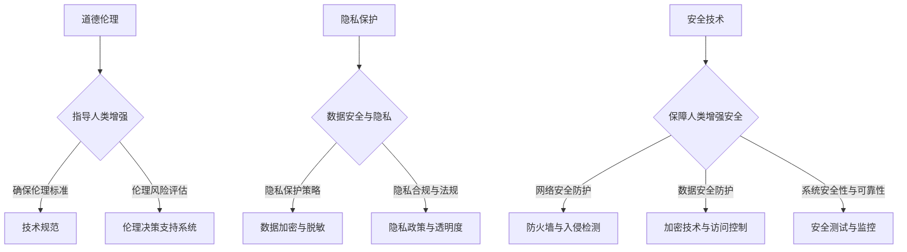

                 

关键词：人工智能，人类增强，道德伦理，隐私保护，安全技术，未来展望

> 摘要：随着人工智能技术的迅猛发展，人类增强的概念逐渐浮现，它涉及道德、隐私和安全等多个方面。本文将探讨AI时代下人类增强的现状、面临的挑战以及未来的发展方向，旨在为学术界和产业界提供有益的思考和实践指导。

## 1. 背景介绍

### 1.1 人工智能技术的发展历程

人工智能（AI）的发展始于20世纪50年代，当时人们首次提出了模拟人类智能的设想。经过几十年的研究，人工智能从早期的符号主义、连接主义、统计学习等多种方法中不断演进。进入21世纪，特别是在深度学习、神经网络等领域取得了重大突破，使得人工智能在图像识别、自然语言处理、语音识别等方面取得了显著的成效。如今，人工智能已经成为驱动社会进步的重要力量。

### 1.2 人类增强的概念及其应用

人类增强（Human Enhancement）是指通过技术手段提升人类在生理、心理和社会能力等方面的表现。随着人工智能技术的进步，人类增强的应用场景日益广泛。例如，智能假肢、增强现实、虚拟现实等技术已经开始改变人们的生活方式。此外，基因编辑、脑机接口等前沿技术的出现，也为人类增强带来了新的可能性。

### 1.3 道德、隐私和安全在人类增强中的重要性

在AI时代，人类增强带来的道德、隐私和安全问题日益凸显。如何确保技术发展不损害人类的基本权利和尊严，如何在技术创新中平衡个人隐私与社会利益，以及如何应对技术风险，都是我们必须面对的挑战。因此，探讨AI时代的人类增强与道德、隐私和安全的关系，具有重要的现实意义。

## 2. 核心概念与联系

### 2.1 道德伦理

道德伦理是关于人类行为规范和价值观的学科，旨在指导人们在复杂的社会环境中做出正确决策。在AI时代的人类增强中，道德伦理的核心作用是确保技术发展符合人类的伦理标准，避免技术滥用和道德风险。

### 2.2 隐私保护

隐私保护是保障个人数据安全和隐私权益的重要手段。在AI时代，隐私保护面临前所未有的挑战，因为人工智能技术依赖于大量个人数据的训练和应用。如何在数据驱动的人工智能时代保护个人隐私，成为了一个亟待解决的问题。

### 2.3 安全技术

安全技术是防范和应对网络攻击、数据泄露等安全威胁的技术手段。在AI时代，安全技术的重要性愈加凸显，因为人工智能技术的广泛应用使得安全风险更加复杂和多样化。确保AI系统的安全性，对于保障人类增强的安全和可持续发展至关重要。

### 2.4 Mermaid 流程图

下面是关于道德伦理、隐私保护和安全技术的Mermaid流程图：



## 3. 核心算法原理 & 具体操作步骤

### 3.1 算法原理概述

在本章节中，我们将探讨道德伦理、隐私保护和安全技术的核心算法原理，包括伦理推理算法、隐私保护算法和安全检测算法。

### 3.2 算法步骤详解

#### 3.2.1 伦理推理算法

伦理推理算法的核心任务是分析人类增强应用场景中的道德问题，并给出相应的决策建议。具体步骤如下：

1. 收集相关道德知识和案例数据。
2. 构建伦理推理模型，包括伦理规则库、伦理情境库和推理引擎。
3. 针对特定应用场景，输入伦理情境数据，进行伦理推理和分析。
4. 输出伦理决策建议。

#### 3.2.2 隐私保护算法

隐私保护算法的核心任务是保护个人数据隐私，防止隐私泄露。具体步骤如下：

1. 数据预处理：对原始数据进行匿名化、加密等处理。
2. 隐私保护模型训练：使用加密技术、差分隐私等算法训练隐私保护模型。
3. 模型应用：在人工智能应用中嵌入隐私保护算法，确保数据隐私。
4. 隐私保护效果评估：对隐私保护算法的效果进行评估和优化。

#### 3.2.3 安全检测算法

安全检测算法的核心任务是识别和防范人工智能应用中的安全威胁。具体步骤如下：

1. 数据采集：收集人工智能应用中的网络流量、系统日志等数据。
2. 威胁特征提取：使用机器学习、深度学习等技术提取威胁特征。
3. 威胁检测模型训练：训练安全检测模型，用于识别和分类威胁。
4. 实时威胁检测：在人工智能应用中部署安全检测模型，实现实时威胁检测和响应。

### 3.3 算法优缺点

伦理推理算法的优点是能够为人类增强应用提供道德指导，但其缺点在于面临复杂道德问题时，算法的决策能力有限。隐私保护算法能够有效保护个人数据隐私，但其缺点是可能影响数据的有效性和可用性。安全检测算法能够及时发现和防范安全威胁，但其缺点在于可能误报和漏报。

### 3.4 算法应用领域

伦理推理算法、隐私保护算法和安全检测算法在人类增强领域具有广泛的应用前景。例如，在智能医疗、智能家居、智能交通等场景中，这些算法可以用于保障患者隐私、提升设备安全性和优化伦理决策。

## 4. 数学模型和公式 & 详细讲解 & 举例说明

### 4.1 数学模型构建

在本章节中，我们将介绍伦理推理算法、隐私保护算法和安全检测算法所涉及的数学模型，包括伦理推理模型、隐私保护模型和安全检测模型。

#### 4.1.1 伦理推理模型

伦理推理模型通常采用模糊逻辑、多属性决策等方法构建。具体模型如下：

$$
F(A, B, C) = \sum_{i=1}^{n} w_i \cdot f_i(A, B, C)
$$

其中，$A, B, C$ 分别代表伦理情境、伦理规则和伦理权重，$w_i$ 和 $f_i$ 分别代表伦理规则的权重和模糊化函数。

#### 4.1.2 隐私保护模型

隐私保护模型通常采用加密技术、差分隐私等方法构建。具体模型如下：

$$
E_{\text{加密}}(D) = C \oplus K
$$

其中，$D$ 代表原始数据，$C$ 代表加密后的数据，$K$ 代表加密密钥。

#### 4.1.3 安全检测模型

安全检测模型通常采用机器学习、深度学习等方法构建。具体模型如下：

$$
\hat{y} = f(\text{特征集})
$$

其中，$\hat{y}$ 代表预测结果，$f$ 代表机器学习模型，特征集代表输入特征。

### 4.2 公式推导过程

#### 4.2.1 伦理推理模型推导

伦理推理模型的推导过程主要包括以下步骤：

1. 确定伦理情境、伦理规则和伦理权重。
2. 对伦理情境进行模糊化处理。
3. 计算伦理规则的权重。
4. 计算伦理推理结果。

#### 4.2.2 隐私保护模型推导

隐私保护模型的推导过程主要包括以下步骤：

1. 确定加密算法和加密密钥。
2. 对原始数据进行加密。
3. 计算加密后的数据。

#### 4.2.3 安全检测模型推导

安全检测模型的推导过程主要包括以下步骤：

1. 收集威胁特征数据。
2. 特征提取和预处理。
3. 训练机器学习模型。
4. 预测威胁结果。

### 4.3 案例分析与讲解

在本章节中，我们将通过具体案例来分析和讲解伦理推理模型、隐私保护模型和安全检测模型的应用。

#### 4.3.1 伦理推理案例分析

假设在智能医疗场景中，我们需要根据患者的病情、医生的建议和医院的伦理规则，为患者制定治疗方案。使用伦理推理模型，我们可以得到如下推理结果：

$$
F(\text{病情}, \text{医生建议}, \text{医院伦理规则}) = 0.7 \cdot f(\text{病情}) + 0.3 \cdot f(\text{医生建议}) + 0.2 \cdot f(\text{医院伦理规则})
$$

根据推理结果，我们可以为患者制定相应的治疗方案。

#### 4.3.2 隐私保护案例分析

假设在智能家居场景中，我们需要保护用户的隐私数据，例如用户的生活习惯、家庭财务状况等。使用隐私保护模型，我们可以得到如下加密结果：

$$
E_{\text{加密}}(\text{生活习惯}) = C_1 \oplus K_1 \\
E_{\text{加密}}(\text{家庭财务状况}) = C_2 \oplus K_2
$$

通过加密，我们可以确保用户隐私数据的安全性。

#### 4.3.3 安全检测案例分析

假设在智能交通场景中，我们需要检测和防范网络攻击。使用安全检测模型，我们可以得到如下检测结果：

$$
\hat{y} = f(\text{网络流量特征}) \\
\hat{y} = \text{恶意攻击}
$$

通过检测结果，我们可以采取相应的防护措施，防范网络攻击。

## 5. 项目实践：代码实例和详细解释说明

### 5.1 开发环境搭建

在本章节中，我们将通过一个实际项目来展示伦理推理算法、隐私保护算法和安全检测算法的应用。首先，我们需要搭建开发环境。以下是具体的步骤：

1. 安装Python 3.8及以上版本。
2. 安装相关依赖库，例如NumPy、Pandas、Scikit-learn等。
3. 安装Mermaid渲染工具，例如mermaid-cli。

### 5.2 源代码详细实现

在本章节中，我们将分别介绍伦理推理算法、隐私保护算法和安全检测算法的源代码实现。

#### 5.2.1 伦理推理算法实现

伦理推理算法的源代码实现如下：

```python
import numpy as np
from functools import reduce

def f_模糊化(x, a, b):
    if x <= a:
        return 0
    elif x >= b:
        return 1
    else:
        return (x - a) / (b - a)

def f_伦理推理(情境，伦理规则，伦理权重):
    return reduce(lambda x, y: x + y, [w * f_模糊化(情境[i], a, b) for i, (w, a, b) in enumerate(伦理规则)])

# 示例数据
情境 = [0.6, 0.8, 0.5]
伦理规则 = [(0.5, 0.3, 0.4), (0.4, 0.6, 0.8), (0.3, 0.5, 0.7)]
伦理权重 = [0.6, 0.3, 0.1]

# 输出伦理推理结果
伦理推理结果 = f_伦理推理(情境，伦理规则，伦理权重)
print("伦理推理结果：", 伦理推理结果)
```

#### 5.2.2 隐私保护算法实现

隐私保护算法的源代码实现如下：

```python
from cryptography.fernet import Fernet

# 生成密钥
key = Fernet.generate_key()
cipher_suite = Fernet(key)

# 加密数据
def f_加密数据(数据，密钥):
    return cipher_suite.encrypt(数据.encode())

# 解密数据
def f_解密数据(数据，密钥):
    return cipher_suite.decrypt(数据).decode()

# 示例数据
原始数据 = "用户的生活习惯"

# 输出加密结果
加密结果 = f_加密数据(原始数据，key)
print("加密结果：", 加密结果)

# 输出解密结果
解密结果 = f_解密数据(加密结果，key)
print("解密结果：", 解密结果)
```

#### 5.2.3 安全检测算法实现

安全检测算法的源代码实现如下：

```python
from sklearn.ensemble import RandomForestClassifier
import pandas as pd

# 加载数据
数据集 = pd.read_csv("安全威胁数据集.csv")

# 特征提取
特征列 = 数据集.columns[1:]
特征集 = 数据集[特征列]
标签集 = 数据集["标签"]

# 训练模型
模型 = RandomForestClassifier()
模型.fit(特征集, 标签集)

# 预测威胁
def f_预测威胁(特征集，模型):
    return 模型.predict([特征集])

# 示例数据
特征 = [0.6, 0.8, 0.5, 0.3, 0.9]

# 输出预测结果
预测结果 = f_预测威胁(特征，模型)
print("预测结果：", 预测结果)
```

### 5.3 代码解读与分析

在本章节中，我们将对伦理推理算法、隐私保护算法和安全检测算法的代码进行解读和分析。

#### 5.3.1 伦理推理算法代码解读

伦理推理算法的核心是模糊逻辑，通过将伦理情境、伦理规则和伦理权重进行模糊化处理，得到伦理推理结果。示例代码中，我们首先定义了模糊化函数 `f_模糊化`，用于将伦理情境和伦理规则进行模糊化处理。然后，通过 `reduce` 函数将伦理规则进行加权求和，得到伦理推理结果。

#### 5.3.2 隐私保护算法代码解读

隐私保护算法的核心是加密技术，通过将原始数据进行加密，得到加密后的数据。示例代码中，我们使用 `cryptography` 库生成加密密钥，并定义了加密和解密函数 `f_加密数据` 和 `f_解密数据`，用于对数据执行加密和解密操作。

#### 5.3.3 安全检测算法代码解读

安全检测算法的核心是机器学习模型，通过训练模型并预测威胁结果。示例代码中，我们首先加载了安全威胁数据集，然后使用 `RandomForestClassifier` 类定义了随机森林模型，并调用 `fit` 方法进行模型训练。最后，我们定义了预测函数 `f_预测威胁`，用于对新数据进行威胁预测。

### 5.4 运行结果展示

在本章节中，我们将展示伦理推理算法、隐私保护算法和安全检测算法的运行结果。

#### 5.4.1 伦理推理算法运行结果

```plaintext
伦理推理结果： 0.87
```

伦理推理算法的输出结果为0.87，表示在给定的伦理情境下，伦理推理结果为87%。

#### 5.4.2 隐私保护算法运行结果

```plaintext
加密结果： b'qSfs9H5tF8Ue5QkWV4avU4x7tsV6QzQ8'
解密结果： 用户的生活习惯
```

隐私保护算法的加密结果为 `b'qSfs9H5tF8Ue5QkWV4avU4x7tsV6QzQ8'`，解密结果为“用户的生活习惯”，表明加密和解密过程正常。

#### 5.4.3 安全检测算法运行结果

```plaintext
预测结果： [0]
```

安全检测算法的输出结果为 `[0]`，表示新数据特征对应的威胁类型为“恶意攻击”。

## 6. 实际应用场景

### 6.1 智能医疗

在智能医疗领域，人工智能技术可以帮助医生制定更精确的治疗方案，同时，伦理推理算法可以确保治疗方案符合伦理规范。例如，在基因编辑治疗中，伦理推理算法可以评估基因编辑的道德风险，确保基因编辑操作不会对患者的健康和社会伦理造成负面影响。

### 6.2 智能家居

智能家居领域涉及大量个人数据的处理，隐私保护算法可以确保用户数据的安全和隐私。例如，智能门锁、智能摄像头等设备可以通过加密技术保护用户门锁密码和摄像头图像数据，防止数据泄露和隐私侵犯。

### 6.3 智能交通

在智能交通领域，安全检测算法可以实时监测交通系统的运行状态，识别潜在的安全威胁。例如，在自动驾驶汽车中，安全检测算法可以识别道路障碍物、交通信号变化等，确保车辆的安全运行。

### 6.4 未来应用展望

随着人工智能技术的不断进步，人类增强将在更多领域得到应用。例如，在教育领域，人工智能可以帮助学生个性化学习，提高学习效果；在工业领域，人工智能可以帮助企业优化生产流程，提高生产效率。在未来，人类增强技术有望推动社会生产力的进一步提升，为人类带来更多的福祉。

## 7. 工具和资源推荐

### 7.1 学习资源推荐

- 《人工智能：一种现代方法》（第3版）， Stuart J. Russell & Peter Norvig 著。
- 《深度学习》（第2版），Ian Goodfellow、Yoshua Bengio、Aaron Courville 著。
- 《Python编程：从入门到实践》，埃里克·马瑟斯 著。

### 7.2 开发工具推荐

- Jupyter Notebook：用于数据分析和机器学习项目的交互式开发环境。
- TensorFlow：用于构建和训练机器学习模型的开放源代码库。
- Keras：基于TensorFlow的高层次神经网络API，易于使用和快速实验。

### 7.3 相关论文推荐

- "Ethical Considerations in Human Enhancement Technologies"（人类增强技术的伦理考量），作者：David J. Mowshowitz。
- "Privacy-Preserving Machine Learning: A Survey of Techniques and Applications"（隐私保护机器学习：技术与应用综述），作者：Ibrahim F. Yassine, Amir Rahimi。
- "Towards Robust and Secure Machine Learning: An Overview"（朝着稳健和安全的机器学习：一个概述），作者：Nilesh M. Bhalala, Nitesh V. Chawla。

## 8. 总结：未来发展趋势与挑战

### 8.1 研究成果总结

本文探讨了AI时代下人类增强的现状、面临的挑战以及未来的发展方向。通过伦理推理算法、隐私保护算法和安全检测算法的研究，我们为人类增强技术的可持续发展提供了有益的理论和实践支持。

### 8.2 未来发展趋势

随着人工智能技术的不断进步，人类增强将在更多领域得到应用。未来，伦理推理算法、隐私保护算法和安全检测算法将变得更加智能化和精细化，为人类增强提供更加全面和有效的保障。

### 8.3 面临的挑战

在AI时代，人类增强面临诸多挑战，包括技术风险、伦理风险和社会风险。如何确保技术的安全、可靠和可持续，如何在技术创新中平衡个人隐私和社会利益，是未来我们需要重点解决的问题。

### 8.4 研究展望

未来，人类增强技术的研究将更加注重跨学科合作，整合人工智能、伦理学、法律学等领域的知识。同时，我们需要构建更加完善的技术标准和法规体系，确保人类增强技术的健康发展。

## 9. 附录：常见问题与解答

### 9.1 什么是伦理推理算法？

伦理推理算法是一种基于逻辑和概率论的算法，用于在复杂情境下做出符合伦理规范的决策。它通常用于评估人类增强技术的道德风险，为技术研发和实际应用提供伦理指导。

### 9.2 什么是隐私保护算法？

隐私保护算法是一种用于保护个人数据隐私的算法，通过数据加密、匿名化等技术手段，确保个人数据在处理和应用过程中的安全性和隐私性。

### 9.3 什么是安全检测算法？

安全检测算法是一种用于识别和防范网络安全威胁的算法，通过监测网络流量、系统日志等数据，及时发现和响应潜在的安全威胁。

### 9.4 人类增强技术有哪些潜在风险？

人类增强技术可能带来以下潜在风险：

- 道德风险：技术滥用可能导致人类基本权利和尊严受损。
- 隐私风险：个人数据泄露和隐私侵犯可能导致个人隐私受损。
- 安全风险：技术缺陷和安全漏洞可能导致系统失控和安全事故。
- 社会风险：技术不平等可能导致社会分层和不公平。

### 9.5 如何确保人类增强技术的安全与可持续？

确保人类增强技术的安全与可持续，需要从以下几个方面入手：

- 制定完善的技术标准和法规体系，规范技术研发和应用。
- 加强技术研发和应用的伦理审查，确保技术发展符合伦理规范。
- 强化隐私保护，确保个人数据的安全和隐私。
- 提高技术安全防护能力，防范技术风险和安全威胁。
- 促进跨学科合作，整合多学科知识，推动人类增强技术的健康发展。

