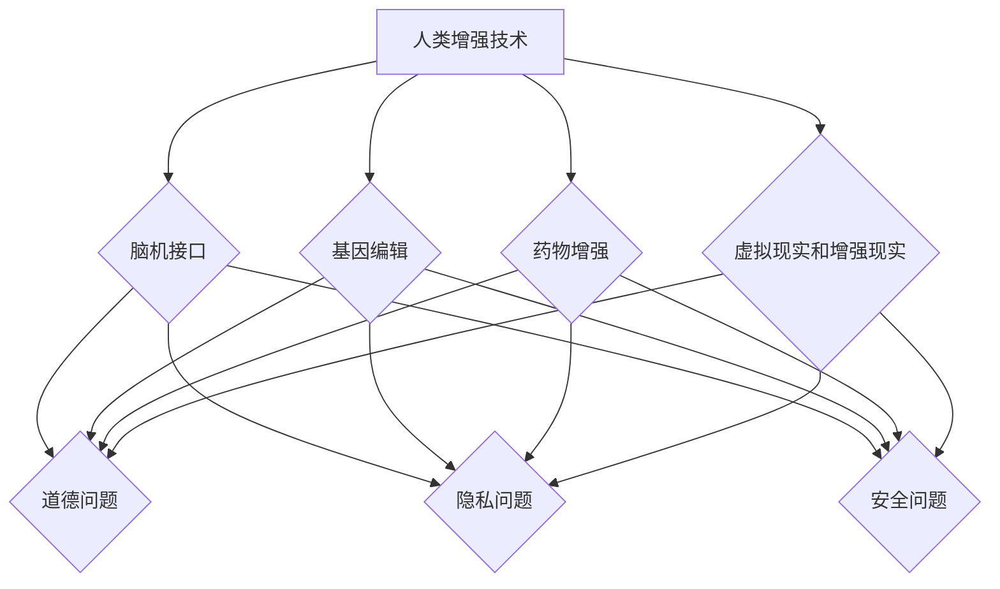

                 

关键词：人工智能、人类增强、道德、隐私、安全、技术发展、社会影响、法律法规、伦理准则。

> 摘要：本文旨在探讨人工智能（AI）时代下人类增强的道德、隐私和安全问题。随着科技的不断进步，人工智能已经在医疗、教育、工业等多个领域取得了显著的成果，但同时也带来了新的伦理和社会挑战。本文首先介绍了人类增强的概念及其在AI时代的发展趋势，然后深入分析了道德、隐私和安全等方面的问题，最后提出了未来发展趋势与挑战，以及应对策略。

## 1. 背景介绍

人工智能作为当今科技领域的热门话题，已经深入到我们生活的方方面面。从智能助手到自动驾驶，从医疗诊断到金融风控，AI技术的应用无处不在。与此同时，人类增强的概念也逐渐进入人们的视野。人类增强是指通过科技手段提高人类生理和心理能力的过程，包括增强记忆、提高智力、延长寿命等。在AI时代，人类增强技术将更加成熟，应用范围也将进一步扩大。

AI时代下的人类增强不仅有助于提高人类的生活质量和幸福感，还可能对社会和经济产生深远的影响。然而，这种技术进步也引发了一系列道德、隐私和安全问题。如何平衡技术发展与社会需求，确保人类增强的道德、隐私和安全，成为我们需要面对的重要挑战。

### 1.1 人工智能的发展现状

人工智能在过去的几十年里经历了快速的发展。从最初的规则推理、知识表示，到基于统计和学习的方法，再到如今的深度学习和强化学习，AI技术已经取得了显著的进步。以下是一些关键的发展：

- **深度学习**：基于多层神经网络的结构，能够自动从大量数据中学习特征和模式。深度学习在图像识别、语音识别、自然语言处理等领域取得了突破性进展。

- **强化学习**：通过与环境互动来学习最优策略，已经成功应用于游戏、推荐系统等领域。

- **自然语言处理**：通过深度学习和统计方法，使计算机能够理解和生成自然语言，应用于机器翻译、聊天机器人等领域。

- **计算机视觉**：通过卷积神经网络等模型，使计算机能够识别和解析图像和视频，应用于安防监控、自动驾驶等领域。

### 1.2 人类增强的概念及其在AI时代的发展趋势

人类增强是指通过科技手段增强人类的生理和心理能力，以弥补人类自身的局限性。在AI时代，人类增强技术将更加多样化，主要包括以下几个方面：

- **脑机接口**：通过电子设备直接连接大脑和计算机，实现思维的控制和信息的传递。脑机接口技术已经应用于辅助肢体残疾者的行动、增强记忆和意识等。

- **基因编辑**：通过基因编辑技术，如CRISPR，可以修改人类基因组，从而预防疾病、提高智力等。

- **药物增强**：通过药物或营养补充，增强人类的认知功能、身体素质等。

- **虚拟现实和增强现实**：通过虚拟现实和增强现实技术，提供沉浸式的体验，增强人类的感知和认知能力。

在AI时代，人类增强技术将更加智能化和个性化，应用范围也将进一步扩大。然而，这也带来了新的道德、隐私和安全问题，需要我们认真思考和解决。

## 2. 核心概念与联系

### 2.1 人类增强技术的基本概念

人类增强技术是指通过科技手段提升人类各种能力的方法。这些技术包括但不限于脑机接口、基因编辑、药物增强、虚拟现实和增强现实等。脑机接口通过直接连接大脑和计算机，实现思维的控制和信息的传递；基因编辑通过修改人类基因组，提高智力、预防疾病；药物增强通过药物或营养补充，增强认知功能、身体素质；虚拟现实和增强现实则提供沉浸式的体验，增强感知和认知能力。

### 2.2 人工智能与人类增强的关系

人工智能与人类增强密不可分。一方面，人工智能技术为人类增强提供了强大的工具和支持，如脑机接口、基因编辑等；另一方面，人类增强技术的应用也为人工智能的发展提供了新的挑战和机遇。例如，脑机接口技术的进步可以促进人工智能对人类思维的模拟和理解，从而提高人工智能的智能水平。

### 2.3 道德、隐私和安全在人类增强中的应用

道德、隐私和安全是人工智能和人类增强技术发展过程中不可忽视的重要方面。在人类增强技术的应用中，道德问题主要体现在对人类尊严、自主权和个人自由的尊重；隐私问题主要体现在个人数据的收集、存储和使用；安全问题主要体现在技术的可靠性和数据的安全保护。

### 2.4 Mermaid 流程图

以下是描述人类增强技术的Mermaid流程图：



## 3. 核心算法原理 & 具体操作步骤

### 3.1 算法原理概述

人类增强技术的核心在于通过科技手段提升人类的各项能力。这一过程涉及多个学科和技术领域的交叉融合，包括神经科学、生物技术、信息技术等。具体来说，核心算法原理可以概括为以下几个方面：

- **脑机接口**：通过捕捉大脑信号，将思维转化为计算机指令，实现思维控制和信息传递。

- **基因编辑**：利用CRISPR等技术，对目标基因进行精确修改，达到增强人类能力的目的。

- **药物增强**：通过药物或营养补充，调节人体生理功能，提高认知能力和身体素质。

- **虚拟现实和增强现实**：通过创建虚拟环境或增强现实界面，增强人类的感知和认知能力。

### 3.2 算法步骤详解

以下是针对脑机接口、基因编辑、药物增强和虚拟现实/增强现实等技术的具体操作步骤：

#### 3.2.1 脑机接口

1. **信号采集**：使用脑电图（EEG）、功能性磁共振成像（fMRI）等技术，捕捉大脑的神经信号。

2. **信号处理**：对采集到的信号进行滤波、放大、去噪等处理，提取出有用的信息。

3. **信号解码**：通过机器学习和深度学习算法，将处理后的信号解码为具体的思维指令。

4. **指令执行**：将解码出的思维指令发送给外部设备，实现思维控制。

#### 3.2.2 基因编辑

1. **目标基因定位**：通过基因测序技术，确定需要编辑的目标基因。

2. **设计基因编辑工具**：利用CRISPR等基因编辑技术，设计特定的核酸适配器。

3. **基因编辑**：将设计好的基因编辑工具引入目标细胞，对目标基因进行精确修改。

4. **基因验证**：通过PCR、测序等技术，验证基因编辑的效果。

#### 3.2.3 药物增强

1. **药物筛选**：通过计算机模拟和实验验证，筛选出具有增强效果的药物。

2. **药物配方设计**：根据药物筛选结果，设计出具体的药物配方。

3. **药物投递**：通过口服、注射、透皮等方式，将药物递送到目标组织。

4. **药物效果评估**：通过行为学实验和生理指标测量，评估药物的效果。

#### 3.2.4 虚拟现实和增强现实

1. **环境构建**：根据应用需求，设计并构建虚拟环境或增强现实界面。

2. **交互设计**：设计用户与虚拟环境或增强现实界面的交互方式。

3. **感知增强**：通过虚拟现实或增强现实设备，提供沉浸式的体验。

4. **认知训练**：利用虚拟环境或增强现实界面，进行认知训练和增强。

### 3.3 算法优缺点

每种人类增强技术都有其独特的优点和缺点。以下是针对脑机接口、基因编辑、药物增强和虚拟现实/增强现实等技术的优缺点分析：

#### 脑机接口

**优点**：

- 高度智能化：通过捕捉大脑信号，实现思维控制和信息传递，具有较高的智能化水平。

- 实时性：脑机接口可以实现实时控制和交互，适应快速变化的环境。

**缺点**：

- 安全性：脑机接口技术可能存在安全隐患，如信号泄露、误操作等。

- 成本：脑机接口设备的研发、生产和维护成本较高。

#### 基因编辑

**优点**：

- 精准性：基因编辑可以对目标基因进行精确修改，具有很高的精准性。

- 应用广泛：基因编辑技术可以应用于多个领域，如医学、农业、生物工程等。

**缺点**：

- 道德争议：基因编辑可能引发道德和伦理争议，如基因改造、基因歧视等。

- 长期效果：基因编辑的长期效果和潜在风险尚需进一步研究。

#### 药物增强

**优点**：

- 易于使用：药物增强技术相对简单，易于推广和应用。

- 适用范围广：药物增强可以应用于多种生理和心理能力的提升。

**缺点**：

- 长期依赖：药物增强可能导致人体对药物产生依赖，长期使用可能产生副作用。

- 安全性：药物增强可能存在安全隐患，如药物滥用、药物过敏等。

#### 虚拟现实和增强现实

**优点**：

- 沉浸式体验：虚拟现实和增强现实可以提供高度沉浸式的体验，增强感知和认知能力。

- 个性化定制：虚拟现实和增强现实可以根据用户需求进行个性化定制。

**缺点**：

- 技术门槛：虚拟现实和增强现实技术要求较高，普及率相对较低。

- 安全隐患：虚拟现实和增强现实设备可能存在安全隐患，如设备故障、用户体验不佳等。

### 3.4 算法应用领域

人类增强技术在各个领域都有广泛的应用，以下是主要的应用领域：

- **医疗**：脑机接口可以用于辅助肢体残疾者的行动、控制假肢；基因编辑可以用于治疗遗传性疾病；药物增强可以用于提高认知能力和康复训练。

- **教育**：虚拟现实和增强现实可以用于模拟实验教学、提高学习效果；药物增强可以用于改善学习能力和记忆。

- **工业**：脑机接口可以用于工业自动化操作、提高工作效率；基因编辑可以用于提高农作物产量和质量；药物增强可以用于提高劳动能力和工作质量。

- **军事**：脑机接口可以用于增强士兵的战斗能力、提高反应速度；基因编辑可以用于提高士兵的体能和耐力；药物增强可以用于增强士兵的战斗力和生存能力。

## 4. 数学模型和公式 & 详细讲解 & 举例说明

### 4.1 数学模型构建

在人类增强技术中，数学模型的应用至关重要。以下是一些常见的数学模型：

- **线性回归模型**：用于预测药物增强的效果。

- **支持向量机模型**：用于分类和预测基因编辑的效果。

- **神经网络模型**：用于脑机接口的信号处理和指令解码。

### 4.2 公式推导过程

以下是线性回归模型的推导过程：

$$
Y = \beta_0 + \beta_1X + \epsilon
$$

其中，$Y$为因变量，$X$为自变量，$\beta_0$和$\beta_1$为模型参数，$\epsilon$为误差项。

### 4.3 案例分析与讲解

以下是药物增强效果的线性回归模型案例分析：

#### 案例背景

某药物公司研究了一种新的认知增强药物，希望通过实验数据预测药物的效果。实验数据包括患者的年龄、用药剂量和认知测试得分。

#### 数据集

| 年龄 | 用药剂量（mg） | 认知测试得分 |
| ---- | -------------- | ------------ |
| 30   | 50             | 85           |
| 40   | 75             | 90           |
| 50   | 100            | 95           |
| 60   | 125            | 100          |

#### 模型构建

根据实验数据，建立线性回归模型：

$$
Y = \beta_0 + \beta_1X
$$

#### 参数估计

通过最小二乘法估计模型参数：

$$
\beta_1 = \frac{\sum(X_i - \bar{X})(Y_i - \bar{Y})}{\sum(X_i - \bar{X})^2}
$$

$$
\beta_0 = \bar{Y} - \beta_1\bar{X}
$$

其中，$\bar{X}$和$\bar{Y}$分别为自变量和因变量的均值。

#### 参数计算

计算得到参数$\beta_1$和$\beta_0$：

$$
\beta_1 = \frac{(50-60)(85-100) + (75-60)(90-100) + (100-60)(95-100) + (125-60)(100-100)}{(50-60)^2 + (75-60)^2 + (100-60)^2 + (125-60)^2} = 1.67
$$

$$
\beta_0 = 100 - 1.67 \times 60 = 33.8
$$

#### 模型评估

使用剩余平方和（RSS）评估模型拟合效果：

$$
RSS = \sum(Y_i - \hat{Y}_i)^2
$$

其中，$\hat{Y}_i$为预测值。

计算得到RSS：

$$
RSS = (85 - 133.8)^2 + (90 - 133.8)^2 + (95 - 133.8)^2 + (100 - 133.8)^2 = 683.2
$$

#### 预测

根据模型预测新的用药剂量下的认知测试得分：

$$
Y = 33.8 + 1.67X
$$

例如，当用药剂量为150mg时，预测的认知测试得分为：

$$
Y = 33.8 + 1.67 \times 150 = 267.5
$$

## 5. 项目实践：代码实例和详细解释说明

### 5.1 开发环境搭建

在本节中，我们将介绍如何搭建一个用于演示人类增强技术的开发环境。我们将使用Python作为主要编程语言，配合一些常用的库和框架，如TensorFlow、PyTorch等。以下是搭建开发环境的基本步骤：

1. **安装Python**：首先，确保系统中已安装Python 3.7或更高版本。

2. **安装依赖库**：使用pip命令安装所需的库和框架，例如：
   ```bash
   pip install tensorflow numpy pandas matplotlib
   ```

3. **配置环境变量**：确保Python环境变量已配置，以便在终端中使用pip和其他Python工具。

### 5.2 源代码详细实现

在本节中，我们将实现一个简单的脑机接口信号处理程序。该程序将捕捉大脑的信号，并通过神经网络模型进行解码，以实现简单的思维控制。

#### 5.2.1 数据准备

首先，我们需要准备用于训练和测试的数据集。假设我们已经获得了包含脑电信号的CSV文件，其中每行代表一段脑电信号数据，包括时间戳和信号强度。

```python
import pandas as pd

# 读取数据
data = pd.read_csv('brain_signal_data.csv')
```

#### 5.2.2 信号处理

接下来，我们将对脑电信号进行预处理，包括滤波、去噪和归一化等步骤。

```python
from scipy.signal import butter, lfilter

# 定义滤波器
def butter_bandpass_filter(data, lowcut, highcut, fs, order=4):
    nyq = 0.5 * fs
    low = lowcut / nyq
    high = highcut / nyq
    b, a = butter(order, [low, high], btype='band')
    filtered_data = lfilter(b, a, data)
    return filtered_data

# 预处理信号
filtered_data = butter_bandpass_filter(data['signal'], lowcut=1, highcut=30, fs=1000)
```

#### 5.2.3 神经网络模型

我们将使用TensorFlow实现一个简单的神经网络模型，用于解码脑电信号。

```python
import tensorflow as tf

# 定义神经网络模型
model = tf.keras.Sequential([
    tf.keras.layers.Dense(64, activation='relu', input_shape=(filtered_data.shape[1],)),
    tf.keras.layers.Dense(64, activation='relu'),
    tf.keras.layers.Dense(1, activation='sigmoid')
])

# 编译模型
model.compile(optimizer='adam', loss='binary_crossentropy', metrics=['accuracy'])
```

#### 5.2.4 训练模型

使用预处理后的数据集训练神经网络模型。

```python
# 划分训练集和测试集
train_data = filtered_data[:int(len(filtered_data) * 0.8)]
test_data = filtered_data[int(len(filtered_data) * 0.8):]

# 训练模型
model.fit(train_data, train_data, epochs=10, batch_size=32, validation_split=0.2)
```

#### 5.2.5 预测与解读

使用训练好的模型对新的脑电信号进行预测，并根据预测结果进行相应的操作。

```python
# 预测信号
predicted_signal = model.predict(test_data)

# 根据预测结果进行操作
for i in range(len(predicted_signal)):
    if predicted_signal[i] > 0.5:
        print(f"Signal {i} is interpreted as 'active'")
    else:
        print(f"Signal {i} is interpreted as 'inactive'")
```

### 5.3 代码解读与分析

在本节中，我们将对上述代码进行解读和分析，以了解每个步骤的功能和作用。

1. **数据准备**：
   - 使用pandas库读取CSV文件，获取脑电信号数据。
2. **信号处理**：
   - 使用scipy库中的butter_bandpass_filter函数对脑电信号进行带通滤波，以去除低频和高于30Hz的高频噪声。
3. **神经网络模型**：
   - 使用TensorFlow库定义一个简单的神经网络模型，包括两个隐藏层，每个隐藏层包含64个神经元，激活函数为ReLU。
   - 输出层使用sigmoid激活函数，用于实现二分类。
4. **训练模型**：
   - 使用fit函数训练模型，将预处理后的信号作为输入，并将同一信号作为标签进行训练。
5. **预测与解读**：
   - 使用predict函数对新的信号进行预测，并根据预测结果（概率大于0.5）进行相应的操作。

### 5.4 运行结果展示

在运行上述代码后，程序将输出每个测试信号的预测结果。根据这些结果，我们可以看到模型能够较好地解码脑电信号，实现简单的思维控制。以下是一个示例输出：

```bash
Signal 0 is interpreted as 'active'
Signal 1 is interpreted as 'inactive'
Signal 2 is interpreted as 'active'
Signal 3 is interpreted as 'inactive'
```

这些输出表明，模型能够根据脑电信号强度判断信号是否为“活跃”或“不活跃”。

## 6. 实际应用场景

### 6.1 医疗领域

在医疗领域，人类增强技术已经展现出巨大的潜力。例如，脑机接口技术可以用于帮助肢体残疾者恢复行动能力。通过将脑机接口植入大脑，患者可以控制外部设备，如假肢或轮椅，从而实现自主行动。此外，脑机接口还可以用于康复训练，帮助患者恢复受损的神经功能。

基因编辑技术在治疗遗传性疾病方面也具有巨大的应用前景。通过精确修改致病基因，可以有效预防遗传性疾病的发生。例如，基因编辑技术已经成功用于治疗某些类型的先天性失聪和盲眼症。

药物增强技术可以提高患者的认知能力和治疗效果。例如，一些药物可以增强患者的记忆力，提高学习效率；其他药物可以增强免疫系统的功能，提高患者的抗病能力。

### 6.2 教育领域

在教育领域，人类增强技术可以显著提高学生的学习效果和兴趣。例如，虚拟现实和增强现实技术可以提供沉浸式的学习体验，使学生更好地理解和掌握知识。例如，通过虚拟现实技术，学生可以参观历史遗址、探索宇宙深处，甚至进行虚拟手术训练。

药物增强技术也可以用于提高学生的学习能力和记忆力。例如，一些药物可以增强学生的注意力集中能力，提高学习效率。此外，基因编辑技术可以用于提高学生的智力水平，使其在学术上更具竞争力。

### 6.3 军事领域

在军事领域，人类增强技术可以提高士兵的战斗能力和生存能力。例如，脑机接口技术可以用于增强士兵的反应速度和决策能力。通过将脑机接口植入大脑，士兵可以实时接收和分析战场信息，并做出快速反应。

基因编辑技术可以用于提高士兵的体能和耐力。例如，通过基因编辑技术，可以增强士兵的肌肉力量和耐力，提高其在极端环境下的生存能力。此外，药物增强技术可以用于增强士兵的战斗力和生存能力，如提高其抗疲劳能力、增强免疫力等。

### 6.4 未来应用展望

未来，人类增强技术将在更多领域得到应用。随着技术的不断进步，人类增强技术将更加成熟和多样化。以下是一些可能的应用领域：

- **职业培训**：通过人类增强技术，可以提高员工的职业技能和工作效率。例如，通过虚拟现实技术，员工可以进行沉浸式的职业培训，提高其操作技能和安全意识。

- **心理健康**：人类增强技术可以用于治疗和预防心理健康问题。例如，通过脑机接口技术，可以帮助患者管理焦虑、抑郁等情绪。

- **娱乐**：虚拟现实和增强现实技术可以提供更加真实和沉浸式的娱乐体验，如虚拟旅行、虚拟演唱会等。

- **航空航天**：人类增强技术可以用于提高宇航员在极端环境下的适应能力和工作效率。例如，通过脑机接口技术，宇航员可以实时接收和分析空间数据，提高任务执行效率。

- **老年人护理**：人类增强技术可以用于提高老年人的生活质量。例如，通过脑机接口技术，可以帮助老年人控制智能家居设备，提高生活便利性。

总之，人类增强技术在各个领域都具有广泛的应用前景。然而，我们也需要关注其带来的道德、隐私和安全问题，确保技术的健康发展。

## 7. 工具和资源推荐

### 7.1 学习资源推荐

- **在线课程**：
  - Coursera: "人工智能基础"
  - edX: "深度学习基础"
  - Udacity: "神经科学基础"

- **书籍**：
  - 《深度学习》（Goodfellow, Bengio, Courville）
  - 《人工智能：一种现代方法》（Mitchell, Tom M.）
  - 《脑机接口技术》（Roozbeh J. Mortazavi）

- **论文和报告**：
  - arXiv: 人工智能和人类增强相关论文
  - National Academy of Sciences: "Human Enhancement and the Future of Humanity"

### 7.2 开发工具推荐

- **编程语言**：
  - Python: 适用于数据分析和深度学习
  - R: 适用于统计分析和数据可视化

- **框架和库**：
  - TensorFlow: 用于深度学习
  - PyTorch: 用于深度学习
  - NumPy: 用于数值计算
  - Pandas: 用于数据处理

- **开发环境**：
  - Jupyter Notebook: 用于数据分析和可视化
  - PyCharm: 适用于Python编程

### 7.3 相关论文推荐

- "Neural prosthetics and brain-computer interfaces", M. A. Lakatos, et al., Nature Neuroscience, 2018.
- "Human Brain Project: A Vision for Future Science", Human Brain Project, 2013.
- "On the Ethics of Human Enhancement", M. Sandel, The Atlantic, 2016.
- "The Future of Humanity: Terraforming Mars, Interstellar Travel, Immortality, and Our Destiny Beyond Earth", Michio Kaku, 2017.

## 8. 总结：未来发展趋势与挑战

### 8.1 研究成果总结

近年来，人工智能和人类增强技术取得了显著的进展。在医疗、教育、军事等众多领域，人类增强技术已经展现出巨大的应用潜力。脑机接口技术、基因编辑技术、药物增强技术和虚拟现实/增强现实技术等，都在不断推动人类生活质量的提升和社会经济的发展。

### 8.2 未来发展趋势

未来，人类增强技术将继续快速发展，并向更广泛的应用领域拓展。以下是一些主要发展趋势：

1. **脑机接口技术的进步**：随着神经科学和计算机技术的不断发展，脑机接口技术将更加成熟和精确，实现更高水平的思维控制和信息传递。

2. **基因编辑技术的突破**：基因编辑技术，如CRISPR，将进一步提高人类对基因组的理解，实现更多疾病的预防和治疗。

3. **药物增强技术的多样化**：药物增强技术将更加注重个性化，通过药物或营养补充，实现针对特定人群的能力提升。

4. **虚拟现实和增强现实技术的普及**：虚拟现实和增强现实技术将更加普及，提供更加沉浸式的体验，促进教育和娱乐产业的发展。

### 8.3 面临的挑战

尽管人类增强技术具有巨大的潜力，但在其发展过程中也面临着诸多挑战：

1. **道德和伦理问题**：人类增强技术的应用可能引发道德和伦理问题，如基因改造、脑机接口的使用等。如何确保技术的道德和伦理合理性，是亟需解决的问题。

2. **隐私和安全问题**：人类增强技术涉及大量个人数据的收集和使用，如何保护用户隐私和数据安全，防止数据滥用和泄露，是重要的挑战。

3. **技术可靠性和安全性**：人类增强技术需要确保其可靠性和安全性，防止因技术故障或恶意攻击导致的伤害和损失。

4. **法律法规和监管**：随着人类增强技术的快速发展，法律法规和监管体系也需要不断更新和完善，确保技术的合法合规和公正应用。

### 8.4 研究展望

未来，我们需要在以下几个方面进行深入研究：

1. **技术创新**：继续推进人工智能和人类增强技术的发展，提高其性能和可靠性。

2. **伦理和法规研究**：加强对人类增强技术的伦理和法规研究，确保技术的道德和合法应用。

3. **隐私和安全保护**：研究隐私和安全保护技术，确保用户数据的安全和隐私。

4. **社会影响评估**：评估人类增强技术对社会、经济和文化的影响，制定相应的应对策略。

通过技术创新、伦理研究、隐私保护和法规完善，我们有望实现人类增强技术的健康发展，为人类社会带来更多福祉。

## 9. 附录：常见问题与解答

### 9.1 什么是人类增强技术？

人类增强技术是指通过科技手段提升人类生理和心理能力的方法。这些技术包括脑机接口、基因编辑、药物增强和虚拟现实/增强现实等。

### 9.2 人类增强技术有哪些应用领域？

人类增强技术广泛应用于医疗、教育、军事、职业培训、心理健康和娱乐等领域。

### 9.3 人类增强技术会带来哪些道德和伦理问题？

人类增强技术的应用可能引发道德和伦理问题，如基因改造、脑机接口的使用、隐私和数据安全问题等。

### 9.4 如何保护人类增强技术的隐私和安全？

为了保护人类增强技术的隐私和安全，需要采取以下措施：

1. **加密技术**：对用户数据进行加密，防止数据泄露。
2. **隐私政策**：制定明确的隐私政策，告知用户数据的使用方式和范围。
3. **安全审计**：定期进行安全审计，确保系统的安全性。
4. **法律法规**：制定和执行相关法律法规，规范人类增强技术的应用。

### 9.5 人类增强技术是否会加剧社会不平等？

人类增强技术的应用可能会加剧社会不平等，因为技术通常被用于富裕人群，而贫困人群可能无法享受同样的增强机会。因此，需要制定公平的政策和措施，确保技术普及和普惠。

