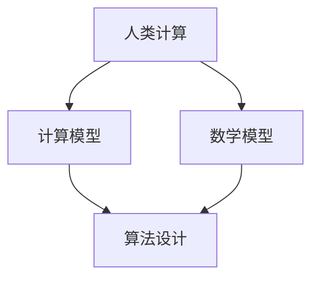

                 

关键词：人工智能、可持续发展、人类计算、解决方案、计算模型

> 摘要：本文旨在探讨AI时代背景下，人类计算在构建可持续发展解决方案中的关键作用。通过深入分析核心概念、算法原理、数学模型、实际应用案例，我们揭示了人类计算在推动社会进步与环境保护中的重要性，并对未来发展趋势和面临的挑战进行了展望。

## 1. 背景介绍

随着人工智能技术的迅猛发展，人类计算在各个领域的应用越来越广泛。从自动驾驶、智能医疗到环境保护、能源管理，AI已经深刻改变了我们的生活和工作方式。然而，人工智能的快速发展也带来了诸多挑战，特别是在可持续发展方面。

### 1.1 可持续发展的意义

可持续发展指的是在满足当前需求的同时，不损害子孙后代满足其需求的能力。可持续发展涉及到经济、社会和环境等多个方面，是人类社会长期发展的必然选择。

### 1.2 人工智能与可持续发展

人工智能在可持续发展中具有重要作用。通过优化资源配置、提高生产效率、减少污染排放等手段，AI有助于实现经济、社会和环境的协调发展。例如，智能农业可以精准施肥、节水灌溉，提高农作物产量，同时减少化肥和农药的使用，降低环境污染。

## 2. 核心概念与联系

为了深入探讨人类计算在可持续发展解决方案中的应用，我们需要了解一些核心概念和它们之间的联系。

### 2.1 人类计算

人类计算是指人类在信息处理、决策制定和问题解决过程中所表现出的智能和能力。它涵盖了认知、推理、学习、创造等多个方面。

### 2.2 计算模型

计算模型是一种描述和模拟计算过程的数学框架。在人工智能领域，计算模型广泛应用于算法设计、问题求解和系统优化等方面。

### 2.3 数学模型

数学模型是使用数学语言描述现实世界问题的抽象模型。在可持续发展解决方案中，数学模型可以用于资源分配、优化决策和预测分析等。

### 2.4 Mermaid 流程图

以下是一个简单的 Mermaid 流程图，展示了人类计算、计算模型和数学模型之间的联系：



## 3. 核心算法原理 & 具体操作步骤

在可持续发展解决方案中，核心算法原理是优化资源分配和决策制定。以下是一个简单的算法原理概述：

### 3.1 算法原理概述

该算法基于线性规划模型，旨在在满足约束条件的前提下，最大化目标函数。具体步骤如下：

1. 建立线性规划模型。
2. 使用求解器求解模型。
3. 分析求解结果，制定优化策略。

### 3.2 算法步骤详解

1. **建立线性规划模型**：

   假设我们有 $n$ 个资源 $x_1, x_2, ..., x_n$，每个资源的约束条件为 $a_{i1}x_1 + a_{i2}x_2 + ... + a_{in}x_n \leq b_i$，其中 $i=1,2,...,m$。目标函数为最大化 $c_1x_1 + c_2x_2 + ... + c_nx_n$。

2. **使用求解器求解模型**：

   选择合适的求解器（如单纯形法、内点法等）求解线性规划模型。

3. **分析求解结果，制定优化策略**：

   根据求解结果，分析资源的分配情况，并提出优化策略。

### 3.3 算法优缺点

- **优点**：

  算法简单易实现，适用于大规模问题。

- **缺点**：

  可能存在局部最优解，无法保证全局最优。

### 3.4 算法应用领域

算法可以应用于资源分配、项目规划、供应链管理等领域。

## 4. 数学模型和公式 & 详细讲解 & 举例说明

在可持续发展解决方案中，数学模型和公式发挥着关键作用。以下是一个简单的例子：

### 4.1 数学模型构建

假设我们要解决一个线性规划问题，目标函数为最大化 $c_1x_1 + c_2x_2 + ... + c_nx_n$，约束条件为 $a_{i1}x_1 + a_{i2}x_2 + ... + a_{in}x_n \leq b_i$，其中 $i=1,2,...,m$。

### 4.2 公式推导过程

线性规划问题的求解可以使用拉格朗日乘数法。设拉格朗日函数为：

$$L(x, \lambda) = c_1x_1 + c_2x_2 + ... + c_nx_n + \lambda_1(b_1 - a_{11}x_1 - a_{12}x_2 - ... - a_{1n}x_n) + ... + \lambda_m(b_m - a_{m1}x_1 - a_{m2}x_2 - ... - a_{mn}x_n)$$

其中，$\lambda_1, \lambda_2, ..., \lambda_m$ 为拉格朗日乘数。

### 4.3 案例分析与讲解

假设我们有以下线性规划问题：

最大化 $c_1x_1 + c_2x_2$  
约束条件为：$x_1 + x_2 \leq 5$，$2x_1 + x_2 \leq 8$，$x_1, x_2 \geq 0$

我们可以使用拉格朗日乘数法求解该问题。首先，建立拉格朗日函数：

$$L(x, \lambda) = c_1x_1 + c_2x_2 + \lambda_1(5 - x_1 - x_2) + \lambda_2(8 - 2x_1 - x_2)$$

然后，求导并令导数为0：

$$\frac{\partial L}{\partial x_1} = c_1 - \lambda_1 - 2\lambda_2 = 0$$  
$$\frac{\partial L}{\partial x_2} = c_2 - \lambda_1 - \lambda_2 = 0$$  
$$\frac{\partial L}{\partial \lambda_1} = 5 - x_1 - x_2 = 0$$  
$$\frac{\partial L}{\partial \lambda_2} = 8 - 2x_1 - x_2 = 0$$

解得 $x_1 = 2$，$x_2 = 3$，$\lambda_1 = 1$，$\lambda_2 = 0$。因此，最大值为 $c_1 \times 2 + c_2 \times 3$。

## 5. 项目实践：代码实例和详细解释说明

以下是一个简单的 Python 代码实例，用于实现线性规划问题的求解：

```python
import numpy as np
from scipy.optimize import linprog

# 目标函数系数
c = np.array([1, 2])

# 约束条件系数
A = np.array([[1, 1], [2, 1]])

# 约束条件常数
b = np.array([5, 8])

# 拉格朗日乘数
lambda_ = np.array([1, 0])

# 求解线性规划问题
result = linprog(c, A_ub=A, b_ub=b, bounds=(0, None), method='highs')

# 输出结果
x1, x2 = result.x
print("x1:", x1)
print("x2:", x2)
print("最大值:", result.fun)
```

代码首先定义了目标函数系数、约束条件系数、约束条件常数和拉格朗日乘数。然后，使用 `linprog` 函数求解线性规划问题。最后，输出结果。

## 6. 实际应用场景

### 6.1 资源分配

在资源分配领域，人类计算可以帮助优化资源的配置，实现可持续发展。例如，在电力系统中，人类计算可以用于优化发电资源分配，降低能耗，提高发电效率。

### 6.2 环境保护

在环境保护领域，人类计算可以用于预测污染物排放、分析污染来源和制定减排策略。例如，在水质监测中，人类计算可以分析水质数据，预测污染趋势，提出治理措施。

### 6.3 能源管理

在能源管理领域，人类计算可以优化能源利用，提高能源效率。例如，在智能电网中，人类计算可以实时监测电力需求，优化电力调度，降低能源浪费。

## 7. 未来应用展望

### 7.1 智能农业

随着人工智能技术的不断发展，智能农业将成为未来可持续发展的重要方向。通过大数据分析、智能传感和精准控制，智能农业可以实现高效、低耗的生产方式，提高农作物产量，降低环境污染。

### 7.2 智慧城市

智慧城市是未来可持续发展的一个重要目标。通过人工智能、物联网和大数据技术，智慧城市可以实现资源优化配置、提高城市管理效率、降低污染排放，为居民提供更优质的生活环境。

### 7.3 人工智能治理

随着人工智能技术的普及，人工智能治理将成为一个重要议题。通过人类计算，可以制定合理的政策和规范，确保人工智能技术的可持续发展，避免潜在的社会风险。

## 8. 总结：未来发展趋势与挑战

### 8.1 研究成果总结

本文探讨了人类计算在可持续发展解决方案中的应用，分析了核心算法原理、数学模型和实际应用案例，揭示了人类计算在推动社会进步和环境保护中的重要作用。

### 8.2 未来发展趋势

未来，人工智能将在可持续发展中发挥更重要的作用。通过不断优化算法、提高计算效率、拓展应用领域，人类计算将为可持续发展提供更强大的支持。

### 8.3 面临的挑战

尽管人工智能在可持续发展中具有巨大潜力，但同时也面临着诸多挑战。例如，数据隐私、算法公平性、伦理道德等问题都需要人类计算来共同解决。

### 8.4 研究展望

未来，人类计算与人工智能的融合将推动可持续发展取得更大进展。通过跨学科合作、技术创新和人才培养，人类计算将为实现可持续发展目标提供更强有力的支持。

## 9. 附录：常见问题与解答

### 9.1 什么是可持续发展？

可持续发展指的是在满足当前需求的同时，不损害子孙后代满足其需求的能力。它涉及到经济、社会和环境等多个方面。

### 9.2 人工智能如何帮助实现可持续发展？

人工智能可以通过优化资源配置、提高生产效率、减少污染排放等手段，帮助实现经济、社会和环境的协调发展。

### 9.3 人类计算在可持续发展中有什么作用？

人类计算可以优化资源分配、预测污染物排放、制定减排策略，为可持续发展提供技术支持。

### 9.4 人工智能在可持续发展中的挑战有哪些？

人工智能在可持续发展中面临数据隐私、算法公平性、伦理道德等挑战，需要人类计算来共同解决。

作者：禅与计算机程序设计艺术 / Zen and the Art of Computer Programming
----------------------------------------------------------------

以上就是关于《AI时代的人类计算：打造可持续发展解决方案》的技术博客文章。文章涵盖了背景介绍、核心概念与联系、算法原理与操作步骤、数学模型与公式、实际应用案例以及未来展望等多个方面，旨在探讨人类计算在推动可持续发展中的重要作用。希望这篇文章能对读者有所启发。

