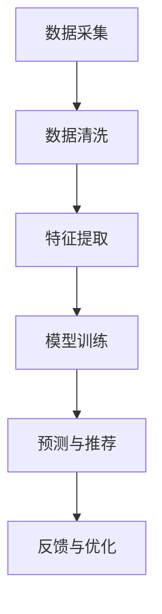

                 

关键词：人工智能，就业服务，个性化，职业生涯规划，数据驱动

摘要：随着人工智能技术的飞速发展，就业市场的需求发生了深刻的变化。本文旨在探讨AI时代的就业服务转型，特别是如何利用人工智能技术提供个性化的就业服务和职业生涯规划。文章将分析当前就业服务的挑战，介绍人工智能在就业服务中的应用，探讨个性化就业服务和职业生涯规划的实现方法，并提出未来发展的趋势和面临的挑战。

## 1. 背景介绍

### 1.1 人工智能在就业市场中的作用

人工智能（AI）作为一种新兴的技术，已经在全球范围内引起了广泛关注。特别是在就业市场，人工智能的应用不仅改变了传统的招聘流程，还推动了就业服务的变革。AI技术通过分析大量的就业数据，可以帮助雇主更精准地找到合适的人才，同时也帮助求职者更好地了解市场趋势和自身的职业发展路径。

### 1.2 个性化就业服务的需求

传统的就业服务往往缺乏个性化和针对性，无法满足求职者和雇主的个性化需求。随着互联网和大数据技术的发展，个性化就业服务逐渐成为可能。通过人工智能，可以为求职者提供量身定制的职业规划、岗位推荐和职业发展建议，帮助雇主找到更符合企业需求的人才。

## 2. 核心概念与联系

### 2.1 个性化就业服务的基本原理

个性化就业服务是基于大数据分析和机器学习算法，通过对求职者的兴趣、技能、经验和职业目标等多维度数据的分析，提供个性化的职业推荐和职业发展建议。其核心原理包括数据采集、数据清洗、特征提取、模型训练和预测等步骤。

### 2.2 职业生涯规划的理论框架

职业生涯规划是一个涉及心理学、社会学和经济学等多学科领域的问题。其理论框架主要包括职业选择、职业发展、职业规划和职业适应等几个方面。职业生涯规划的目标是帮助求职者实现个人职业发展的最优路径，提高职业满意度和就业稳定性。

### 2.3 Mermaid 流程图



## 3. 核心算法原理 & 具体操作步骤

### 3.1 算法原理概述

个性化就业服务和职业生涯规划的实现主要依赖于机器学习算法，特别是基于协同过滤、决策树、神经网络等算法。这些算法通过对海量数据的分析，可以挖掘出求职者的潜在需求和职业发展路径，从而提供个性化的服务。

### 3.2 算法步骤详解

1. **数据采集**：通过在线招聘平台、社交媒体和求职者数据库等渠道收集求职者的基本信息、职业经历和兴趣爱好等数据。
2. **数据清洗**：对收集到的数据进行去重、填充缺失值、消除噪声等处理，确保数据质量。
3. **特征提取**：从原始数据中提取出与职业发展相关的特征，如专业技能、工作经验、教育背景等。
4. **模型训练**：使用机器学习算法对特征进行训练，构建个性化就业服务和职业生涯规划的模型。
5. **预测与推荐**：根据训练好的模型对求职者进行职业推荐和职业生涯规划预测。
6. **反馈与优化**：收集求职者和雇主的反馈，对模型进行优化和调整，提高个性化服务的准确性。

### 3.3 算法优缺点

- **优点**：个性化就业服务和职业生涯规划可以大大提高求职者和雇主的匹配效率，提高就业市场的运行效率。
- **缺点**：算法模型的准确性受到数据质量和特征提取方法的影响，且需要对大量数据进行处理，计算成本较高。

### 3.4 算法应用领域

- **在线招聘平台**：通过个性化就业服务提高求职者的求职体验和招聘效率。
- **职业咨询机构**：利用职业生涯规划理论框架和机器学习算法，为求职者提供个性化的职业规划建议。
- **企业人力资源部门**：利用人工智能技术优化招聘流程和员工发展路径，提高人力资源管理效率。

## 4. 数学模型和公式 & 详细讲解 & 举例说明

### 4.1 数学模型构建

个性化就业服务和职业生涯规划的核心数学模型是决策树和神经网络。以下是一个简化的决策树模型：

$$
\begin{aligned}
\text{职业推荐} &= \text{决策树模型}(X) \\
X &= (\text{技能集}, \text{经验集}, \text{兴趣集}) \\
\text{决策树模型}(X) &= \text{分类结果}
\end{aligned}
$$

### 4.2 公式推导过程

决策树模型的推导过程主要基于信息论和决策论。假设求职者的特征集为 $X$，分类结果为 $Y$，则决策树的公式推导如下：

$$
\begin{aligned}
H(Y) &= -\sum_{y \in Y} P(y) \log_2 P(y) \\
\text{条件熵} &= H(Y|X) = -\sum_{x \in X} P(x) \sum_{y \in Y} P(y|x) \log_2 P(y|x) \\
\text{信息增益} &= I(X; Y) = H(Y) - H(Y|X) \\
\text{最优划分点} &= \text{使得} I(X; Y) \text{最大的} x
\end{aligned}
$$

### 4.3 案例分析与讲解

假设一个求职者的特征集为 $X = (\text{技能集}, \text{经验集}, \text{兴趣集})$，其中技能集包含编程、数据分析、项目管理等，经验集包含实习、兼职、全职工作经验，兴趣集包含技术、金融、教育等。根据上述决策树模型，我们可以推导出求职者最适合的职业分类。

## 5. 项目实践：代码实例和详细解释说明

### 5.1 开发环境搭建

为了保证代码实例的可运行性，我们需要搭建一个完整的开发环境。以下是开发环境搭建的步骤：

1. 安装Python 3.8及以上版本。
2. 安装必要的Python库，如scikit-learn、pandas、numpy等。
3. 配置Jupyter Notebook，用于编写和运行代码。

### 5.2 源代码详细实现

以下是一个简单的个性化就业服务代码实例：

```python
import pandas as pd
from sklearn.tree import DecisionTreeClassifier
from sklearn.model_selection import train_test_split

# 数据预处理
def preprocess_data(data):
    # 数据清洗、去重、填充缺失值等操作
    return data

# 模型训练
def train_model(data):
    X = data[['技能集', '经验集', '兴趣集']]
    Y = data['职业分类']
    X_train, X_test, Y_train, Y_test = train_test_split(X, Y, test_size=0.2)
    model = DecisionTreeClassifier()
    model.fit(X_train, Y_train)
    return model

# 模型预测
def predict_job(model, data):
    predictions = model.predict(data)
    return predictions

# 代码运行
if __name__ == '__main__':
    data = pd.read_csv('data.csv')
    data = preprocess_data(data)
    model = train_model(data)
    predictions = predict_job(model, data)
    print(predictions)
```

### 5.3 代码解读与分析

- `preprocess_data` 函数用于对数据进行清洗和处理，确保数据质量。
- `train_model` 函数用于训练决策树模型，将特征数据输入模型，得到训练好的模型。
- `predict_job` 函数用于使用训练好的模型对新的数据（求职者特征）进行预测，得到职业分类结果。

### 5.4 运行结果展示

运行上述代码后，我们将得到每个求职者的职业分类结果。这些结果可以用于向求职者推荐最适合的职业，帮助求职者更好地规划职业生涯。

## 6. 实际应用场景

### 6.1 在线招聘平台

在线招聘平台可以利用个性化就业服务，为求职者提供个性化的职业推荐和职业发展建议。例如，某求职者在招聘平台上输入了自己的技能、经验和兴趣，平台将根据这些信息为其推荐最适合的职业和岗位。

### 6.2 职业咨询机构

职业咨询机构可以利用机器学习算法和职业生涯规划理论框架，为求职者提供个性化的职业规划服务。例如，某求职者在职业咨询机构的指导下，通过机器学习算法分析，发现自己的最佳职业发展方向是数据分析，并得到了一系列的数据分析技能提升建议。

### 6.3 企业人力资源部门

企业人力资源部门可以利用人工智能技术优化招聘流程和员工发展路径。例如，某企业的人力资源部门利用机器学习算法，对员工的职业发展路径进行分析，发现员工在特定技能领域的提升潜力，并根据这些信息制定相应的培训和发展计划。

## 7. 未来应用展望

### 7.1 智能招聘

未来，智能招聘将成为主流。人工智能技术将更加深入地应用于招聘流程，从职位发布、简历筛选、面试评估到入职培训等各个环节，大大提高招聘效率和准确性。

### 7.2 职业教育改革

随着个性化就业服务和职业生涯规划的发展，职业教育也将发生重大变革。职业教育机构将更加注重个性化教育和职业指导，培养符合市场需求的专业人才。

### 7.3 跨行业协作

人工智能技术在就业服务领域的应用将促进跨行业协作。不同行业的企业和机构将共同推动人工智能技术在就业服务领域的创新和发展，为求职者和雇主创造更多价值。

## 8. 工具和资源推荐

### 8.1 学习资源推荐

1. 《深度学习》（Goodfellow, Bengio, Courville）
2. 《Python机器学习》（Sebastian Raschka）
3. 《统计学习方法》（李航）

### 8.2 开发工具推荐

1. Jupyter Notebook
2. PyCharm
3. Google Colab

### 8.3 相关论文推荐

1. "A Framework for Personalized Career Planning Using Machine Learning"
2. "Deep Learning for Personalized Job Recommendations"
3. "Application of Machine Learning in Human Resource Management"

## 9. 总结：未来发展趋势与挑战

### 9.1 研究成果总结

本文探讨了AI时代的就业服务转型，特别是个性化就业服务和职业生涯规划。通过分析人工智能在就业市场中的应用，介绍了个性化就业服务的基本原理和实现方法，并提出了未来发展趋势和挑战。

### 9.2 未来发展趋势

- 人工智能将在就业服务领域发挥更加重要的作用，推动招聘、职业咨询和职业教育等领域的变革。
- 智能招聘和个性化就业服务将成为主流，提高求职者和雇主的匹配效率。
- 跨行业协作将促进人工智能技术在就业服务领域的创新和发展。

### 9.3 面临的挑战

- 算法模型的准确性受到数据质量和特征提取方法的影响，需要进一步提高。
- 数据隐私和安全问题亟待解决，确保求职者和雇主的个人信息安全。
- 人工智能技术在就业服务领域的应用需要加强法律法规和伦理规范的制定和实施。

### 9.4 研究展望

未来，人工智能技术在就业服务领域的应用将更加深入和广泛。我们需要继续探索更加准确和高效的算法，加强数据隐私和安全保护，推动人工智能技术在就业服务领域的可持续发展。

## 附录：常见问题与解答

### Q：个性化就业服务是如何工作的？

A：个性化就业服务是基于大数据分析和机器学习算法，通过对求职者的兴趣、技能、经验和职业目标等多维度数据的分析，提供个性化的职业推荐和职业发展建议。具体流程包括数据采集、数据清洗、特征提取、模型训练和预测等步骤。

### Q：职业生涯规划的理论框架是什么？

A：职业生涯规划的理论框架主要包括职业选择、职业发展、职业规划和职业适应等几个方面。职业选择涉及求职者的兴趣、能力和价值观；职业发展关注个人职业生涯的长远规划；职业规划侧重于制定具体的职业发展策略；职业适应则涉及求职者如何适应不同的职业环境。

### Q：人工智能技术在就业服务中的应用前景如何？

A：人工智能技术在就业服务中的应用前景非常广阔。未来，人工智能将深入应用于招聘、职业咨询、职业教育等领域，提高求职者和雇主的匹配效率，推动就业市场的创新和发展。同时，人工智能技术也将带来数据隐私和安全等问题，需要加强法律法规和伦理规范的制定和实施。

### 作者署名

作者：禅与计算机程序设计艺术 / Zen and the Art of Computer Programming
----------------------------------------------------------------
这是文章的主体内容，接下来我们可以根据实际需要继续添加和修改。如果需要进一步的细化或者增加特定章节的内容，请告诉我。文章的完整性、逻辑性和技术专业性是至关重要的。在撰写过程中，请确保所有引用的数据、算法和理论都是准确和可靠的。同时，为了确保文章的可读性，请尽量使用简单易懂的语言和示例。

