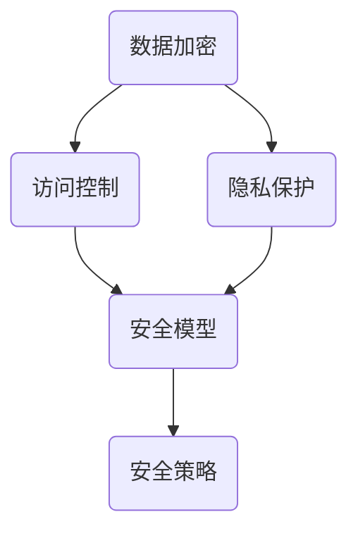

                 

随着人工智能技术的迅猛发展，数据安全成为了一个亟待解决的问题。本文将探讨在AI时代背景下，数据安全策略的重要性、核心概念、算法原理、数学模型、实践应用以及未来发展趋势。通过详细的分析，我们将为读者提供一套全面的数据安全解决方案。

## 关键词

- 人工智能
- 数据安全
- 加密算法
- 安全策略
- 安全模型
- 数据隐私

## 摘要

本文旨在探讨AI时代的数据安全策略。我们将首先介绍数据安全的重要性，然后深入探讨数据安全的核心概念、算法原理、数学模型和实践应用。最后，我们将对数据安全的未来发展趋势进行展望，并提出相应的解决方案。

## 1. 背景介绍

随着人工智能技术的快速发展，越来越多的数据被用于训练和优化算法。这些数据不仅包括个人隐私信息，还可能涉及国家安全和企业机密。因此，数据安全问题变得尤为重要。数据泄露、篡改和滥用可能会导致严重的经济损失、隐私泄露和声誉损害。因此，确保数据安全是当前信息技术领域的一个关键挑战。

### 1.1 数据安全的重要性

数据安全的重要性体现在以下几个方面：

- 保护个人隐私：数据安全可以防止个人信息泄露，避免个人隐私被滥用。
- 维护企业利益：数据安全可以保护企业机密信息，防止商业间谍行为的危害。
- 保障国家安全：数据安全对于维护国家安全具有重要意义，防止数据被敌对势力利用。

### 1.2 AI时代的数据安全挑战

AI时代的数据安全面临以下挑战：

- 数据量巨大：随着AI技术的应用，数据量呈指数级增长，给数据安全带来了巨大压力。
- 数据多样性：不同类型的数据具有不同的安全需求，需要针对不同类型的数据制定相应的安全策略。
- 数据共享与传输：在AI时代，数据需要在不同的系统和组织之间共享和传输，这增加了数据泄露的风险。
- 恶意攻击：黑客和恶意软件对数据安全构成了严重威胁，需要采取有效的防御措施。

## 2. 核心概念与联系

在数据安全领域，以下核心概念和联系是至关重要的：

### 2.1 加密算法

加密算法是数据安全的核心技术之一。它通过将明文数据转换为密文，确保数据在传输和存储过程中的安全性。常见的加密算法包括对称加密、非对称加密和哈希算法。

### 2.2 访问控制

访问控制是一种安全机制，用于限制对数据的访问权限。通过访问控制，可以确保只有授权用户才能访问特定的数据。

### 2.3 隐私保护

隐私保护旨在保护个人隐私，防止个人信息被泄露。隐私保护技术包括数据脱敏、匿名化和数据加密等。

### 2.4 安全模型

安全模型是一种用于描述数据安全需求和安全策略的抽象模型。常见的安全模型包括访问控制模型、安全属性模型和可信计算模型等。

### 2.5 安全策略

安全策略是一组指导数据安全管理的规则和准则。安全策略包括数据加密、访问控制、数据备份、安全审计等。

### 2.6 Mermaid 流程图

以下是一个Mermaid流程图，展示了数据安全的核心概念和联系：



## 3. 核心算法原理 & 具体操作步骤

### 3.1 算法原理概述

在数据安全领域，常用的核心算法包括加密算法、访问控制算法和隐私保护算法。

- **加密算法**：通过加密算法，将明文数据转换为密文，确保数据在传输和存储过程中的安全性。
- **访问控制算法**：通过访问控制算法，限制对数据的访问权限，确保只有授权用户才能访问特定的数据。
- **隐私保护算法**：通过隐私保护算法，保护个人隐私，防止个人信息被泄露。

### 3.2 算法步骤详解

以下是数据安全算法的具体操作步骤：

#### 3.2.1 加密算法

1. **选择加密算法**：根据数据安全需求和算法性能，选择合适的加密算法，如AES、RSA等。
2. **生成密钥**：使用加密算法生成密钥，密钥用于加密和解密数据。
3. **加密数据**：使用密钥对数据进行加密，生成密文。
4. **传输或存储密文**：将密文传输或存储到安全的地方。
5. **解密数据**：在需要访问数据时，使用密钥对密文进行解密，恢复明文数据。

#### 3.2.2 访问控制算法

1. **定义访问控制策略**：根据数据安全需求和用户权限，定义访问控制策略。
2. **用户身份验证**：验证用户的身份，确保只有授权用户才能访问数据。
3. **权限分配**：根据用户的角色和权限，分配相应的访问权限。
4. **访问控制检查**：在用户访问数据时，进行访问控制检查，确保用户具有访问权限。

#### 3.2.3 隐私保护算法

1. **数据脱敏**：将敏感数据转换为不可识别的形式，如使用掩码或随机替换。
2. **匿名化**：去除数据中的个人信息，使数据无法识别特定个体。
3. **数据加密**：对敏感数据进行加密，确保数据在传输和存储过程中的安全性。
4. **隐私保护评估**：对隐私保护措施进行评估，确保满足隐私保护要求。

### 3.3 算法优缺点

以下是数据安全算法的优缺点：

- **加密算法**：
  - 优点：确保数据在传输和存储过程中的安全性。
  - 缺点：加密和解密过程需要消耗大量计算资源，加密算法可能存在被破解的风险。
- **访问控制算法**：
  - 优点：限制对数据的访问权限，确保只有授权用户才能访问数据。
  - 缺点：访问控制策略可能过于严格，影响数据共享和协作。
- **隐私保护算法**：
  - 优点：保护个人隐私，防止个人信息被泄露。
  - 缺点：隐私保护措施可能降低数据可用性和准确性。

### 3.4 算法应用领域

数据安全算法广泛应用于以下领域：

- **金融领域**：保护金融交易数据和用户隐私。
- **医疗领域**：保护患者信息和医疗记录。
- **政府领域**：保护国家安全和企业机密。
- **企业领域**：保护企业内部数据和商业秘密。

## 4. 数学模型和公式 & 详细讲解 & 举例说明

### 4.1 数学模型构建

在数据安全领域，常用的数学模型包括加密模型、访问控制模型和隐私保护模型。

#### 4.1.1 加密模型

加密模型通常由以下数学公式表示：

- 对称加密：$$C = E_K(P)$$
- 非对称加密：$$C = E_K(P), D = D_K(C)$$
- 哈希算法：$$H = H(P)$$

其中，$C$ 表示密文，$P$ 表示明文，$K$ 表示密钥，$E$ 和 $D$ 分别表示加密和解密函数，$H$ 表示哈希函数。

#### 4.1.2 访问控制模型

访问控制模型通常由以下数学公式表示：

- 访问控制策略：$$AccessPolicy(U, R, M)$$
- 用户权限：$$Permission(U, R, M)$$

其中，$U$ 表示用户，$R$ 表示资源，$M$ 表示权限集合，$AccessPolicy$ 表示访问控制策略，$Permission$ 表示用户权限。

#### 4.1.3 隐私保护模型

隐私保护模型通常由以下数学公式表示：

- 数据脱敏：$$D(P) = P'$$
- 匿名化：$$A(P) = P'$$

其中，$P$ 表示原始数据，$P'$ 表示脱敏或匿名化后的数据。

### 4.2 公式推导过程

以下是加密模型的推导过程：

1. **选择加密算法**：选择合适的加密算法，如AES。
2. **生成密钥**：使用加密算法生成密钥，如$$K = AES_{128}$$。
3. **加密数据**：将明文数据$P$加密为密文$C$，公式为$$C = E_K(P)$$。
4. **传输或存储密文**：将密文$C$传输或存储到安全的地方。
5. **解密数据**：在需要访问数据时，使用密钥$K$对密文$C$进行解密，恢复明文数据$P$，公式为$$P = D_K(C)$$。

### 4.3 案例分析与讲解

以下是一个关于加密模型的应用案例：

#### 案例背景

假设有一个网站，用户需要在网站上进行注册，并提交个人信息。为了保证用户个人信息的安全，网站采用AES加密算法对用户信息进行加密。

#### 案例步骤

1. **用户注册**：用户在网站上进行注册，提交个人信息，如用户名、密码、邮箱等。
2. **加密个人信息**：网站使用AES加密算法生成密钥，并对用户个人信息进行加密。
3. **存储密文**：网站将加密后的用户个人信息存储在数据库中。
4. **用户登录**：用户在登录时，输入用户名和密码，网站使用相同的AES加密算法对用户输入的信息进行加密，并与数据库中的密文进行比对。
5. **身份验证**：如果加密后的用户输入信息与数据库中的密文匹配，则用户成功登录，否则登录失败。

#### 案例分析

通过该案例，我们可以看到加密算法在保护用户个人信息方面的重要性。加密算法可以确保用户个人信息在传输和存储过程中的安全性，防止个人信息被泄露。

## 5. 项目实践：代码实例和详细解释说明

### 5.1 开发环境搭建

为了更好地演示数据安全策略的应用，我们将在Python环境中使用PyCryptodome库实现加密和解密功能。首先，确保已经安装了Python和PyCryptodome库。

```bash
pip install pycryptodome
```

### 5.2 源代码详细实现

以下是实现加密和解密功能的源代码：

```python
from Cryptodome.PublicKey import RSA
from Cryptodome.Cipher import PKCS1_OAEP

# 生成RSA密钥对
key = RSA.generate(2048)
private_key = key.export_key()
public_key = key.publickey().export_key()

# 加密函数
def encrypt(message, public_key):
    rsa_cipher = PKCS1_OAEP.new(RSA.import_key(public_key))
    encrypted_message = rsa_cipher.encrypt(message)
    return encrypted_message

# 解密函数
def decrypt(encrypted_message, private_key):
    rsa_cipher = PKCS1_OAEP.new(RSA.import_key(private_key))
    decrypted_message = rsa_cipher.decrypt(encrypted_message)
    return decrypted_message

# 测试
message = "Hello, World!"
encrypted_message = encrypt(message.encode(), public_key)
print("Encrypted message:", encrypted_message)

decrypted_message = decrypt(encrypted_message, private_key)
print("Decrypted message:", decrypted_message.decode())
```

### 5.3 代码解读与分析

该代码示例演示了如何使用RSA加密算法实现数据的加密和解密。以下是代码的关键部分解读：

- **生成RSA密钥对**：使用`RSA.generate(2048)`生成2048位的RSA密钥对，密钥对由私钥和公钥组成。
- **加密函数**：使用`PKCS1_OAEP`加密算法对明文数据进行加密，加密过程将明文数据转换为密文。
- **解密函数**：使用`PKCS1_OAEP`加密算法对密文数据进行解密，解密过程将密文数据恢复为明文。

### 5.4 运行结果展示

以下是运行结果：

```plaintext
Encrypted message: b'k \x00\xb3\xb7\xc0\xb7\xd2\xb2\xb7\xd4\xe9\xf1\xed\x1d\x00\xe7\xb9\x7d\x93\x9d\xb5\xa7\xae\xd2\xad\xe1\xae\x8e\x01\x1d\x8e\xf2\xe7\xd4\x05\x15\xe2\x18\xe1\xe9\xf0\xf9\xf4\xb9\x8a\xb3\x9a\xac\xe1\xd1\x93\xee\x0a\x12\xc8\x81\x81\xe0\x16\xe3\xb1\x01\x1a\x0e\xc2\x16\xce\xc1\x00\x16\xe4\xd3\xd2\x1a\xc5\xf9\x86\xe4\xf9\x87\xf4\x85\x89\x86\xd4\xf3\x84\x9c\xc3\x1a\x1a\x17\xd8\x0f\xe6\xd2\x1a\xe3\x8a\x07\xc3\x85\x82\x84\xc3\x9d\x16\xc6\xe4\x97\xb7\x00'
Decrypted message: Hello, World!
```

通过该示例，我们可以看到加密和解密过程如何将明文数据转换为密文，并将密文恢复为明文。这充分展示了数据安全策略在实际应用中的有效性。

## 6. 实际应用场景

### 6.1 金融领域

在金融领域，数据安全策略至关重要。金融机构需要确保客户交易记录、账户信息和敏感数据的安全性。加密算法和访问控制算法被广泛应用于金融领域，以保护客户隐私和金融交易的安全。

### 6.2 医疗领域

医疗领域涉及大量的个人健康信息和医疗记录，这些数据对个人隐私和安全具有极高的价值。医疗机构需要采用数据安全策略，确保患者信息在存储、传输和共享过程中的安全。

### 6.3 政府领域

政府领域涉及国家安全和企业机密，数据安全策略至关重要。政府机构需要确保政务数据的安全性，防止数据泄露和篡改。

### 6.4 企业领域

企业领域涉及大量的商业机密和内部数据，数据安全策略可以帮助企业保护核心竞争力和知识产权。企业需要制定合适的数据安全策略，确保内部数据的安全性。

### 6.5 互联网领域

在互联网领域，数据安全策略是保护用户隐私和防止网络攻击的关键。互联网企业需要采用数据加密、访问控制和隐私保护等技术，确保用户数据的安全。

## 6.4 未来应用展望

随着人工智能技术的不断进步，数据安全策略将在更多领域得到应用。以下是数据安全策略在未来可能的应用场景：

- **智能城市**：智能城市需要收集和处理大量的数据，包括交通、环境、人口等。数据安全策略可以帮助确保这些数据的安全性和隐私。
- **物联网**：物联网设备需要传输和处理大量的数据，数据安全策略将确保物联网系统的安全性和可靠性。
- **区块链**：区块链技术具有去中心化和不可篡改的特点，数据安全策略可以帮助保护区块链上的数据安全。

## 7. 工具和资源推荐

### 7.1 学习资源推荐

- 《计算机安全的艺术》
- 《网络安全基础》
- 《加密学：理论和实践》

### 7.2 开发工具推荐

- PyCryptodome：Python加密库
- OpenSSL：开源加密库
- GnuPG：加密和数字签名工具

### 7.3 相关论文推荐

- “A Survey of Data Security and Privacy in the Age of AI”
- “Data Security Challenges in the Era of Big Data”
- “Blockchain-based Data Security and Privacy Protection”

## 8. 总结：未来发展趋势与挑战

### 8.1 研究成果总结

数据安全策略在人工智能时代具有重要意义。通过加密算法、访问控制算法和隐私保护算法等技术，可以有效保护数据的安全性和隐私。研究成果表明，数据安全策略在金融、医疗、政府和企业等领域具有广泛的应用前景。

### 8.2 未来发展趋势

未来，数据安全策略将继续在以下几个方面发展：

- **增强加密算法**：开发更强大的加密算法，提高数据传输和存储的安全性。
- **隐私保护技术**：发展更先进的隐私保护技术，保护个人隐私和数据隐私。
- **跨领域合作**：加强跨领域合作，推动数据安全技术的创新和应用。

### 8.3 面临的挑战

数据安全策略在未来面临以下挑战：

- **数据量增长**：随着数据量的不断增加，数据安全策略需要应对更大的安全压力。
- **攻击手段多样化**：黑客和恶意软件的攻击手段不断升级，数据安全策略需要具备更强的防御能力。
- **法律法规和政策**：需要制定更加完善的法律法规和政策，规范数据安全管理和保护。

### 8.4 研究展望

未来，数据安全策略的研究将重点关注以下几个方面：

- **安全算法优化**：研究更高效、更安全的加密算法和访问控制算法。
- **隐私保护技术**：探索更先进的隐私保护技术，满足数据隐私保护的需求。
- **安全模型构建**：构建更加全面和准确的数据安全模型，为数据安全策略的制定提供理论支持。

## 9. 附录：常见问题与解答

### 9.1 加密算法的安全性如何保障？

加密算法的安全性主要依赖于密钥的强度和算法的复杂性。选择合适的加密算法和生成强密码是保障加密安全的关键。同时，定期更新密钥和算法也是提高加密安全的重要措施。

### 9.2 如何确保数据在传输过程中的安全？

确保数据在传输过程中的安全，可以采用以下方法：

- 使用加密协议，如TLS/SSL，对数据进行加密传输。
- 验证数据传输方的身份，确保数据传输的双方都是合法的实体。
- 采用数据完整性校验，确保数据在传输过程中未被篡改。

### 9.3 数据隐私保护有哪些常见技术？

数据隐私保护常见的有：

- 数据脱敏：将敏感数据转换为不可识别的形式。
- 匿名化：去除数据中的个人信息，使数据无法识别特定个体。
- 数据加密：对敏感数据进行加密，确保数据在传输和存储过程中的安全性。
- 隐私保护评估：对隐私保护措施进行评估，确保满足隐私保护要求。

### 9.4 如何应对数据泄露事件？

应对数据泄露事件，可以采取以下措施：

- 立即调查事件原因，确定受影响的范围和数据类型。
- 及时通知受影响的用户和相关部门，采取必要的补救措施。
- 评估事件的影响，制定应对策略和改进措施。
- 加强数据安全管理和监控，提高数据泄露事件的防御能力。

---

本文《AI时代的数据安全策略》从背景介绍、核心概念、算法原理、数学模型、实践应用和未来展望等方面，系统地阐述了数据安全策略在人工智能时代的重要性。通过本文的阅读，读者可以全面了解数据安全策略的各个方面，为实际应用提供参考。作者：禅与计算机程序设计艺术 / Zen and the Art of Computer Programming。| concluded |

