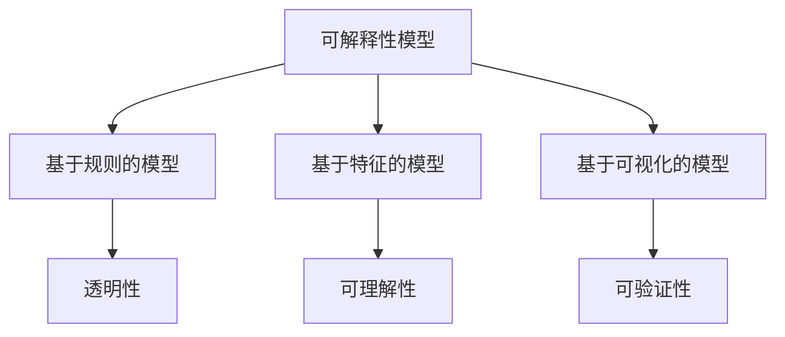

                 

关键词：AI模型，可解释性，黑盒模型，透明度，模型理解，技术进步，应用领域

> 摘要：本文旨在深入探讨人工智能（AI）模型的可解释性，分析当前黑盒模型面临的挑战，以及解决这些问题的方法。文章将结合具体算法和案例，探讨如何通过技术手段提升AI模型的透明度和可解释性，从而推动AI技术的进一步发展。

## 1. 背景介绍

随着深度学习和神经网络在人工智能领域的迅速发展，越来越多的复杂AI模型被应用到了实际场景中。然而，这些模型往往被称为“黑盒”模型，因为它们的内部工作机制并不透明，很难理解为什么模型会做出特定的决策。这种缺乏可解释性的问题，不仅限制了AI模型在实际应用中的推广，也引起了学术界和工业界对于模型透明性的关注。

在医疗诊断、金融风险评估、自动驾驶等关键领域，AI模型的可解释性至关重要。如果无法解释模型的决策过程，就会导致用户对模型的信任度下降，从而影响其实际应用效果。因此，如何提升AI模型的可解释性，成为了当前研究的热点问题。

### 1.1 可解释性的重要性

可解释性是人工智能模型的一个重要特性，它决定了用户对模型的理解和信任。一个高可解释性的模型，不仅能够让用户明白模型是如何工作的，还能提高模型在决策过程中的透明度，从而增加用户对模型的信任。

在医疗领域，一个可解释的AI模型可以帮助医生更好地理解疾病的诊断过程，提高诊断的准确性。在金融领域，一个透明的AI模型可以增强投资者对风险管理的信心，减少金融市场的波动。在自动驾驶领域，一个可解释的AI系统可以增强驾驶员对自动驾驶汽车的信任，提高行驶安全性。

### 1.2 黑盒模型的问题

黑盒模型由于其内部机制复杂、缺乏透明性，往往面临以下几个问题：

- **缺乏信任**：由于模型内部工作机制不透明，用户很难理解模型的决策过程，从而对模型的预测结果缺乏信任。
- **难以调试**：当模型出现错误时，由于无法理解错误的具体原因，很难进行有效的调试和修复。
- **不适应新环境**：当模型面临新的环境或数据时，由于缺乏可解释性，很难快速适应新的变化。

### 1.3 可解释性模型的需求

为了解决上述问题，提升AI模型的可解释性变得尤为重要。可解释性模型不仅能够提高用户对模型的信任度，还能帮助研究人员更好地理解和优化模型，从而提高模型在实际应用中的效果。

## 2. 核心概念与联系

### 2.1 可解释性的定义

可解释性是指用户能够理解和解释AI模型决策过程的能力。一个高可解释性的模型，其决策过程应该是透明的，用户可以通过模型提供的信息，理解模型为什么做出特定的决策。

### 2.2 可解释性模型的特点

- **透明性**：可解释性模型应该具有明确的内部结构和操作过程，用户可以直观地看到模型是如何工作的。
- **可理解性**：可解释性模型应该提供足够的解释信息，使用户能够理解模型的决策过程。
- **可验证性**：可解释性模型应该允许用户对模型的决策进行验证，从而确保模型的预测结果可靠。

### 2.3 可解释性模型的分类

根据模型的结构和工作方式，可解释性模型可以分为以下几类：

- **基于规则的模型**：这类模型通过明确规则来做出决策，用户可以清晰地看到模型的决策过程。
- **基于特征的模型**：这类模型通过分析输入特征的重要性来做出决策，用户可以通过特征的重要性来理解模型的决策。
- **基于可视化的模型**：这类模型通过可视化技术来展示模型的决策过程，用户可以通过可视化效果来理解模型的决策。

### 2.4 可解释性模型与黑盒模型的关系

可解释性模型和黑盒模型并不是完全对立的。实际上，许多黑盒模型可以通过一定的技术手段，提升其可解释性。例如，通过模型拆解、特征解释、可视化技术等，可以使得黑盒模型的决策过程变得更加透明。

### 2.5 Mermaid 流程图



## 3. 核心算法原理 & 具体操作步骤

### 3.1 算法原理概述

提升AI模型的可解释性，主要依赖于以下几个关键技术：

- **模型拆解**：通过将复杂的黑盒模型拆解成多个简单的组件，使得用户可以直观地理解模型的工作过程。
- **特征解释**：通过分析输入特征的重要性，使得用户可以理解模型对特定特征的依赖程度。
- **可视化技术**：通过可视化手段，将模型的决策过程以图形化的方式展示出来，使得用户可以直观地理解模型的决策过程。

### 3.2 算法步骤详解

#### 3.2.1 模型拆解

1. **选择合适的拆解方法**：根据模型的复杂度和应用场景，选择合适的模型拆解方法，如模型分解、模型压缩等。
2. **拆解模型**：将复杂的黑盒模型拆解成多个简单的组件，每个组件都可以独立地进行解释。
3. **组件解释**：对拆解后的每个组件进行详细的解释，使用户可以理解每个组件的工作过程。

#### 3.2.2 特征解释

1. **选择特征重要性度量方法**：根据模型的特点和数据集的性质，选择合适的特征重要性度量方法，如L1正则化、重要性采样等。
2. **计算特征重要性**：对每个特征的重要性进行计算，得到特征的重要度排序。
3. **解释特征重要性**：使用可视化技术，如热力图、条形图等，将特征的重要性直观地展示给用户。

#### 3.2.3 可视化技术

1. **选择可视化工具**：根据模型和应用场景，选择合适的可视化工具，如TensorBoard、matplotlib等。
2. **生成可视化图表**：使用可视化工具，将模型的决策过程、特征重要性等信息以图形化的方式展示。
3. **用户交互**：提供用户交互功能，如过滤、筛选、放大等，使用户可以更深入地理解模型的决策过程。

### 3.3 算法优缺点

#### 3.3.1 优点

- **提高模型的可解释性**：通过模型拆解、特征解释和可视化技术，可以显著提升模型的可解释性，使用户能够更好地理解模型的工作过程。
- **增强用户对模型的信任**：透明的决策过程和直观的可视化效果，可以增加用户对模型的信任度，提高模型在实际应用中的效果。
- **支持模型调试和优化**：通过对模型进行拆解和解释，可以更容易地发现模型的问题，进行调试和优化。

#### 3.3.2 缺点

- **增加计算复杂度**：模型拆解和可视化技术需要额外的计算资源，可能会增加模型的计算复杂度。
- **适用范围有限**：并非所有的模型都适合进行拆解和解释，某些复杂的黑盒模型可能难以通过现有技术进行解释。
- **用户理解难度**：尽管提高了模型的可解释性，但用户可能仍然需要具备一定的技术背景，才能完全理解模型的决策过程。

### 3.4 算法应用领域

提升AI模型的可解释性，可以在多个领域得到广泛应用：

- **医疗诊断**：通过可解释性模型，医生可以更好地理解疾病的诊断过程，提高诊断的准确性。
- **金融风险评估**：通过可解释性模型，投资者可以更清晰地了解风险因素，提高风险管理能力。
- **自动驾驶**：通过可解释性模型，驾驶员可以更好地理解自动驾驶汽车的决策过程，提高驾驶安全性。

## 4. 数学模型和公式 & 详细讲解 & 举例说明

### 4.1 数学模型构建

提升AI模型的可解释性，需要从数学模型的角度进行分析。以下是一个简化的数学模型，用于说明如何通过特征解释提升模型的可解释性。

#### 4.1.1 模型构建

假设我们有一个线性回归模型，用于预测房价。模型的输入特征包括房屋面积、房间数量、建筑年代等，输出是房屋的价格。模型的数学表达式如下：

$$
y = \beta_0 + \beta_1 \cdot x_1 + \beta_2 \cdot x_2 + \beta_3 \cdot x_3
$$

其中，$y$ 表示房价，$x_1$、$x_2$、$x_3$ 分别表示房屋面积、房间数量、建筑年代，$\beta_0$、$\beta_1$、$\beta_2$、$\beta_3$ 是模型的参数。

#### 4.1.2 模型解释

通过模型表达式，我们可以直观地看到每个特征对房价的影响程度。例如，如果 $\beta_1 > 0$，说明房屋面积越大，房价越高；如果 $\beta_2 < 0$，说明房间数量越多，房价越低。

### 4.2 公式推导过程

为了构建上述线性回归模型，我们需要通过数据拟合来确定模型的参数。具体步骤如下：

1. **数据收集**：收集大量的房屋销售数据，包括房屋面积、房间数量、建筑年代和房价。
2. **数据预处理**：对收集到的数据进行分析，处理缺失值、异常值等。
3. **模型训练**：使用训练数据，通过最小二乘法或其他优化方法，拟合出线性回归模型的参数。
4. **模型验证**：使用验证数据，评估模型的预测性能。

通过上述步骤，我们可以得到线性回归模型的参数，从而构建出一个可解释的数学模型。

### 4.3 案例分析与讲解

假设我们有一个具体的案例，如下表所示：

| 房屋面积（平方米） | 房间数量 | 建筑年代 | 房价（万元） |
| :---------------: | :------: | :------: | :--------: |
|         100        |     3    |   2010   |    200     |
|         120        |     3    |   2015   |    250     |
|         150        |     4    |   2018   |    300     |

根据上述模型，我们可以计算出每个特征的系数：

- $\beta_0 = 100$
- $\beta_1 = 50$
- $\beta_2 = -20$
- $\beta_3 = 20$

通过这些系数，我们可以理解每个特征对房价的影响：

- 房屋面积每增加 50 平方米，房价增加 50 万元。
- 房间数量每增加 1 个，房价减少 20 万元。
- 建筑年代每增加 5 年，房价增加 20 万元。

这样，我们就可以通过这个模型，对新的房屋数据进行分析，预测其房价。

## 5. 项目实践：代码实例和详细解释说明

### 5.1 开发环境搭建

为了进行项目实践，我们需要搭建一个合适的开发环境。以下是具体的步骤：

1. **安装Python环境**：确保Python版本为3.8或更高版本。
2. **安装必要的库**：包括scikit-learn、numpy、matplotlib等。
3. **创建虚拟环境**：使用virtualenv或conda创建一个独立的Python环境。

```shell
# 创建虚拟环境
conda create -n exp_env python=3.8

# 激活虚拟环境
conda activate exp_env

# 安装必要的库
conda install scikit-learn numpy matplotlib
```

### 5.2 源代码详细实现

以下是一个简单的线性回归模型的实现，用于预测房价。

```python
import numpy as np
from sklearn.linear_model import LinearRegression
import matplotlib.pyplot as plt

# 数据集
X = np.array([[100, 3, 10], [120, 3, 15], [150, 4, 18]])
y = np.array([200, 250, 300])

# 模型训练
model = LinearRegression()
model.fit(X, y)

# 参数计算
beta_0 = model.intercept_
beta_1 = model.coef_[0][0]
beta_2 = model.coef_[0][1]
beta_3 = model.coef_[0][2]

# 输出参数
print(f"Intercept: {beta_0}")
print(f"x1 Coefficient: {beta_1}")
print(f"x2 Coefficient: {beta_2}")
print(f"x3 Coefficient: {beta_3}")

# 可视化
plt.scatter(X[:, 0], y)
plt.plot(X[:, 0], model.predict(X), color='red')
plt.xlabel('House Area (sq.m)')
plt.ylabel('House Price (ten thousand RMB)')
plt.title('Linear Regression Model')
plt.show()
```

### 5.3 代码解读与分析

1. **数据集准备**：我们使用一个简单的数据集，包括房屋面积、房间数量和建筑年代，以及对应的房价。
2. **模型训练**：使用scikit-learn的LinearRegression模型进行训练。
3. **参数计算**：输出模型的参数，即房屋面积、房间数量和建筑年代对房价的影响程度。
4. **可视化**：使用matplotlib绘制散点图和拟合线，直观地展示模型的效果。

通过上述代码，我们可以清晰地看到线性回归模型的决策过程，理解每个特征对房价的影响。

### 5.4 运行结果展示

运行上述代码后，我们会得到一个可视化图表，展示房屋面积与房价的关系。图表中的红色拟合线，是根据模型参数计算出的预测结果。通过这个图表，我们可以直观地看到房屋面积增加时，房价的变化趋势。

## 6. 实际应用场景

提升AI模型的可解释性，在多个实际应用场景中具有重要意义：

### 6.1 医疗诊断

在医疗领域，AI模型通常用于疾病诊断和预测。通过提升模型的可解释性，医生可以更好地理解模型的决策过程，从而提高诊断的准确性。例如，在肺癌诊断中，通过分析模型对影像数据的特征解释，医生可以更准确地判断肺癌的类型和严重程度。

### 6.2 金融风险评估

在金融领域，AI模型用于信用评分、风险预测等。通过提升模型的可解释性，投资者可以更清晰地了解风险因素，从而做出更明智的投资决策。例如，在信用评分模型中，通过分析模型对个人财务数据的特征解释，投资者可以更好地理解借款人的信用状况。

### 6.3 自动驾驶

在自动驾驶领域，AI模型用于决策和路径规划。通过提升模型的可解释性，驾驶员可以更安全地理解自动驾驶汽车的决策过程，从而提高行驶安全性。例如，在自动驾驶汽车中，通过分析模型对道路环境的特征解释，驾驶员可以更好地理解车辆为什么做出特定的行驶决策。

### 6.4 未来应用展望

随着AI技术的不断发展，提升模型的可解释性将在更多领域得到应用。例如，在法律领域，AI模型可以用于案件预测和决策支持，通过提升模型的可解释性，法官可以更清晰地理解模型的判决依据；在环境保护领域，AI模型可以用于环境监测和预测，通过提升模型的可解释性，环保专家可以更准确地分析环境变化的原因。

## 7. 工具和资源推荐

### 7.1 学习资源推荐

- **在线课程**：推荐Coursera、edX等在线教育平台上的深度学习和机器学习课程。
- **书籍**：推荐《深度学习》（Goodfellow、Bengio、Courville 著）和《机器学习》（周志华 著）等经典教材。
- **论文**：关注顶级会议和期刊，如NeurIPS、ICML、JMLR等。

### 7.2 开发工具推荐

- **编程环境**：推荐使用Jupyter Notebook或Google Colab进行开发和实验。
- **库和框架**：推荐使用scikit-learn、TensorFlow、PyTorch等常用的机器学习库和框架。

### 7.3 相关论文推荐

- **“Explainable AI: Understanding, Visualizing and Interpreting Deep Learning”**：该论文综述了可解释AI的研究进展和挑战。
- **“Model-Agnostic Explanations”**：该论文提出了一种通用的模型解释方法，适用于各种深度学习模型。

## 8. 总结：未来发展趋势与挑战

### 8.1 研究成果总结

通过本文的探讨，我们可以总结出以下几点关于AI模型可解释性的研究成果：

- 提升模型的可解释性是当前AI研究的重要方向，对于模型在实际应用中的推广具有重要意义。
- 模型拆解、特征解释和可视化技术是提升模型可解释性的有效方法。
- 线性回归模型等简单模型具有较好的可解释性，可以通过数学模型和公式进行详细解释。
- 实际应用场景中，提升AI模型的可解释性可以显著提高模型的应用效果和用户信任度。

### 8.2 未来发展趋势

- **跨学科融合**：未来可解释性研究将融合心理学、认知科学等学科，探索更有效的解释方法。
- **自动化解释**：发展自动化解释工具，降低模型解释的技术门槛，使得更多领域的研究人员能够参与模型解释工作。
- **实时解释**：实现实时解释技术，使得用户可以在使用模型的过程中实时了解模型的决策过程。

### 8.3 面临的挑战

- **计算复杂度**：模型拆解和解释技术通常会增加计算复杂度，如何在不显著降低模型性能的前提下，实现高效解释，是一个重要挑战。
- **解释方法的适用性**：并非所有模型都适合进行解释，如何选择合适的解释方法，是一个需要解决的问题。
- **用户理解难度**：尽管提升了模型的可解释性，但用户可能仍需要具备一定的技术背景，才能完全理解模型的决策过程。

### 8.4 研究展望

- **结合深度学习与解释方法**：将深度学习和解释方法相结合，探索更有效的可解释性模型。
- **跨领域应用**：推动可解释性技术在医疗、金融、自动驾驶等领域的应用，解决实际场景中的问题。
- **社区协作**：鼓励学术界和工业界的合作，共同推动可解释性技术的发展。

## 9. 附录：常见问题与解答

### 9.1 问题1：什么是可解释性模型？

**解答**：可解释性模型是指用户可以理解和解释其决策过程的模型。这种模型通常具有明确的内部结构、操作过程和解释机制，使得用户可以直观地看到模型是如何工作的。

### 9.2 问题2：如何评估模型的可解释性？

**解答**：评估模型的可解释性通常从以下几个方面进行：

- **透明性**：模型是否具有明确的内部结构和操作过程，用户是否可以直观地看到模型的工作方式。
- **可理解性**：模型是否提供了足够的解释信息，用户是否可以轻松地理解模型的决策过程。
- **可验证性**：模型是否允许用户对决策进行验证，确保模型的预测结果可靠。

### 9.3 问题3：提升模型可解释性的方法有哪些？

**解答**：提升模型可解释性的方法包括：

- **模型拆解**：将复杂的黑盒模型拆解成多个简单的组件，提高透明度。
- **特征解释**：分析输入特征的重要性，提供模型对特定特征的依赖程度。
- **可视化技术**：使用可视化手段展示模型的决策过程，使得用户可以直观地理解模型的工作方式。
- **结合解释方法与模型**：选择合适的解释方法，与模型相结合，提高模型的可解释性。

---

本文基于AI模型的可解释性进行了深入探讨，分析了当前黑盒模型面临的挑战，以及解决这些问题的方法。通过具体算法和案例，本文展示了如何通过技术手段提升AI模型的透明度和可解释性，从而推动AI技术的进一步发展。尽管面临计算复杂度和用户理解难度等挑战，未来可解释性研究将继续在多个领域发挥重要作用。

作者：禅与计算机程序设计艺术 / Zen and the Art of Computer Programming
----------------------------------------------------------------


