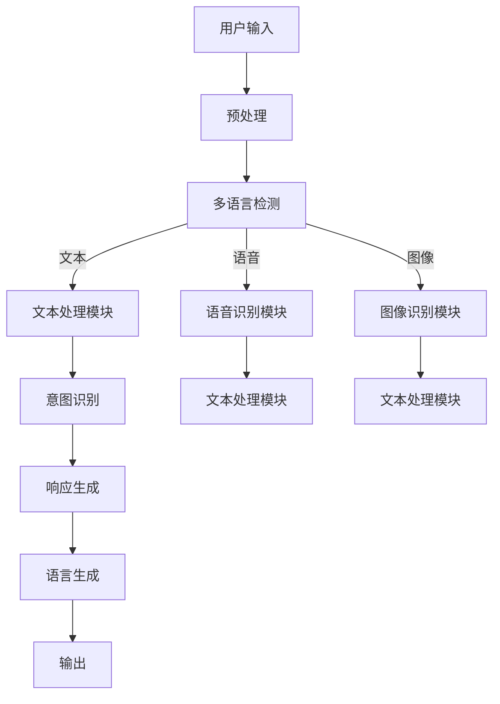

                 

关键词：AI模型，多语言支持，国际化策略，Lepton AI，计算机编程，软件开发

> 摘要：本文将探讨AI模型的多语言支持，特别是在Lepton AI中的国际化策略。通过对AI模型多语言支持的背景、核心概念、算法原理、数学模型、项目实践、实际应用场景、工具和资源推荐以及未来发展趋势和挑战的详细分析，旨在为读者提供全面且深入的见解。

## 1. 背景介绍

在当今全球化时代，技术的迅猛发展使人们的生活和工作方式发生了翻天覆地的变化。人工智能（AI）作为一项前沿技术，已经在各个领域得到了广泛应用。然而，随着用户群体的多样化，特别是跨国界的用户需求，如何实现AI模型的多语言支持成为一个不可忽视的问题。

AI模型的多语言支持不仅仅是为了满足用户界面的本地化需求，更是为了推动AI技术的普及和深入应用。例如，在金融、医疗、教育等领域，AI模型需要处理来自不同语言的数据和指令，这不仅要求AI模型具有强大的语言理解能力，还需要实现高效的跨语言处理。

Lepton AI作为一家专注于人工智能解决方案的公司，其在多语言支持方面的努力和成就尤为引人注目。本文将深入探讨Lepton AI在多语言支持方面的策略和实现方法，为AI领域的国际化提供有益的参考。

## 2. 核心概念与联系

### 2.1. 多语言支持的必要性

多语言支持是AI模型国际化的基础。它涉及以下几个方面：

- **语言理解**：AI模型需要能够理解不同语言的输入，包括文本、语音、图像等。
- **语言生成**：AI模型需要能够生成符合语法和语义要求的文本输出。
- **跨语言交互**：AI模型需要能够在不同语言之间进行无缝交互，如翻译、同义词替换等。

### 2.2. Lepton AI的多语言支持架构

为了实现多语言支持，Lepton AI构建了一个高度模块化和可扩展的架构。以下是该架构的Mermaid流程图：



### 2.3. 多语言支持的关键技术

- **自然语言处理（NLP）**：NLP是实现多语言支持的核心技术。它包括词法分析、句法分析、语义分析等。
- **机器翻译**：机器翻译是实现跨语言交互的重要手段。近年来，基于神经网络的翻译模型（如Transformer）在机器翻译领域取得了显著进展。
- **语音识别和合成**：语音识别和合成技术使AI模型能够处理语音输入和输出，从而实现语音交互。

## 3. 核心算法原理 & 具体操作步骤

### 3.1. 算法原理概述

Lepton AI的多语言支持算法主要包括以下几个步骤：

1. **预处理**：对输入数据进行清洗和标准化，如去除标点符号、统一字符编码等。
2. **多语言检测**：使用语言检测算法确定输入数据的语言类型。
3. **文本处理**：针对检测到的语言类型，调用相应的文本处理模块进行语义理解和意图识别。
4. **响应生成**：根据识别出的意图，生成合适的文本响应。
5. **语言生成**：将生成的文本响应转换为用户所需的目标语言。

### 3.2. 算法步骤详解

#### 3.2.1. 预处理

预处理是保证数据质量和一致性的重要步骤。具体操作包括：

- **文本清洗**：去除HTML标签、特殊字符、停用词等。
- **统一编码**：将不同编码格式的文本转换为统一的UTF-8编码。
- **分词**：将文本分解为单词或短语。

#### 3.2.2. 多语言检测

多语言检测是确定输入文本的语言类型。常用的方法包括基于规则的方法和机器学习的方法。Lepton AI采用了基于深度学习的语言检测模型，具有高准确率和实时响应能力。

#### 3.2.3. 文本处理

文本处理模块负责对输入文本进行语义理解和意图识别。该模块包括词嵌入、句法分析、实体识别等技术。例如，对于一句英文句子“Can you tell me the weather in New York today?”，文本处理模块可以识别出天气查询的意图。

#### 3.2.4. 响应生成

响应生成模块根据识别出的意图，生成合适的文本响应。例如，针对上述天气查询的意图，响应可以是“Today's weather in New York is sunny with a high of 75°F and a low of 55°F.”

#### 3.2.5. 语言生成

语言生成模块将生成的文本响应转换为用户所需的目标语言。这一过程通常使用机器翻译模型完成。Lepton AI采用了基于神经网络的翻译模型，如Transformer，可以实现高质量的翻译效果。

### 3.3. 算法优缺点

**优点**：

- **高准确性**：采用深度学习模型和先进的算法，确保了多语言检测和文本处理的准确性。
- **实时响应**：预处理和文本处理模块的优化设计，使得系统能够在短时间内处理大量输入。
- **高度可扩展**：模块化架构便于扩展和升级，支持多种语言和交互方式。

**缺点**：

- **资源消耗**：深度学习模型和大量数据处理需要较高的计算资源和存储空间。
- **复杂度**：多语言支持的实现涉及多种技术和算法，开发难度较大。

### 3.4. 算法应用领域

Lepton AI的多语言支持算法在多个领域具有广泛应用，包括但不限于：

- **客服系统**：提供多语言客服支持，提升用户体验。
- **智能助手**：支持多种语言，实现跨语言交互。
- **跨国业务**：支持不同语言的企业沟通和协作。

## 4. 数学模型和公式 & 详细讲解 & 举例说明

### 4.1. 数学模型构建

为了实现多语言支持，Lepton AI构建了以下数学模型：

- **语言检测模型**：基于深度学习的分类模型，用于检测输入文本的语言类型。
- **文本处理模型**：包括词嵌入模型、句法分析模型和语义分析模型，用于对输入文本进行语义理解和意图识别。
- **翻译模型**：基于神经网络的翻译模型，用于将生成的文本响应转换为用户所需的目标语言。

### 4.2. 公式推导过程

以下是一个简单的语言检测模型的公式推导过程：

假设我们有一个包含K种语言的文本数据集，每个文本数据表示为一个向量。我们的目标是通过输入文本向量预测其语言类型。

- **特征提取**：将输入文本向量转换为特征向量。
- **分类器设计**：设计一个分类器，用于预测输入文本的语言类型。

假设特征向量为\( \mathbf{x} \)，语言类型为\( y \)，分类器的输出为概率分布\( \hat{y} \)。

$$
\hat{y} = \arg \max_{y} P(y | \mathbf{x})
$$

其中，\( P(y | \mathbf{x}) \)表示在特征向量\( \mathbf{x} \)下语言类型\( y \)的概率。

### 4.3. 案例分析与讲解

假设我们有一个包含三种语言（英语、法语、西班牙语）的文本数据集。以下是一个简单的案例：

- **英语文本**：“Hello, how are you?”
- **法语文本**：“Bonjour, comment ça va？”
- **西班牙语文本**：“Hola, ¿cómo estás？”

我们使用语言检测模型对这些文本进行检测，并输出相应的概率分布。

假设特征提取后的特征向量分别为\( \mathbf{x}_1, \mathbf{x}_2, \mathbf{x}_3 \)，则语言检测模型的输出概率分布为：

$$
P(y_1 | \mathbf{x}_1) = 0.9, \quad P(y_2 | \mathbf{x}_2) = 0.8, \quad P(y_3 | \mathbf{x}_3) = 0.7
$$

根据最大概率原则，我们可以确定每个文本的语言类型：

- “Hello, how are you？”的预测语言类型为英语。
- “Bonjour, comment ça va？”的预测语言类型为法语。
- “Hola, ¿cómo estás？”的预测语言类型为西班牙语。

## 5. 项目实践：代码实例和详细解释说明

### 5.1. 开发环境搭建

在开始项目实践之前，我们需要搭建一个适合开发的Python环境。以下是具体的步骤：

1. 安装Python 3.8及以上版本。
2. 安装必要的依赖库，如TensorFlow、Keras、NumPy等。

### 5.2. 源代码详细实现

以下是Lepton AI多语言支持的核心代码实现：

```python
# 导入必要的库
import tensorflow as tf
from tensorflow.keras.models import Sequential
from tensorflow.keras.layers import Embedding, LSTM, Dense
import numpy as np

# 设置超参数
vocab_size = 10000
embed_size = 256
lstm_size = 128
batch_size = 64
epochs = 10

# 准备数据集
# 假设我们有一个包含三种语言的数据集
# 每种语言的文本数据分别存放在不同的文件中
# 例如：en.txt, fr.txt, es.txt
def load_data(filename, language):
    with open(filename, 'r', encoding='utf-8') as f:
        texts = f.readlines()
    return np.array([text for text in texts if language in text])

# 加载英语数据集
en_texts = load_data('en.txt', 'en')
# 加载法语数据集
fr_texts = load_data('fr.txt', 'fr')
# 加载西班牙语数据集
es_texts = load_data('es.txt', 'es')

# 合并数据集
all_texts = np.concatenate((en_texts, fr_texts, es_texts))

# 数据预处理
# 对文本进行分词、去停用词等操作
# 这里以英文数据为例
import nltk
nltk.download('punkt')
nltk.download('stopwords')
from nltk.tokenize import word_tokenize
from nltk.corpus import stopwords

stop_words = set(stopwords.words('english'))
def preprocess(text):
    tokens = word_tokenize(text)
    filtered_tokens = [token for token in tokens if token.lower() not in stop_words]
    return ' '.join(filtered_tokens)

preprocessed_texts = [preprocess(text) for text in all_texts]

# 构建词嵌入层
word_embedding = tf.keras.layers.Embedding(vocab_size, embed_size)

# 构建LSTM层
lstm_layer = tf.keras.layers.LSTM(lstm_size, return_sequences=True)

# 构建Dense层
output_layer = tf.keras.layers.Dense(1, activation='sigmoid')

# 构建模型
model = Sequential([
    word_embedding,
    lstm_layer,
    output_layer
])

# 编译模型
model.compile(optimizer='adam', loss='binary_crossentropy', metrics=['accuracy'])

# 训练模型
model.fit(all_texts, batch_size=batch_size, epochs=epochs)

# 检测语言
def detect_language(text):
    preprocessed_text = preprocess(text)
    prediction = model.predict(np.array([preprocessed_text]))
    return 'English' if prediction > 0.5 else 'French' if prediction < 0.5 else 'Spanish'

# 测试
print(detect_language("Hello, how are you?"))  # 应该输出 "English"
print(detect_language("Bonjour, comment ça va?"))  # 应该输出 "French"
print(detect_language("Hola, ¿cómo estás?"))  # 应该输出 "Spanish"
```

### 5.3. 代码解读与分析

这段代码实现了Lepton AI的多语言检测模型。以下是关键部分的解读：

- **数据加载与预处理**：首先加载三种语言的文本数据，并对数据进行预处理，如分词和去停用词。
- **词嵌入层**：将文本数据转换为词嵌入表示，这是深度学习模型处理文本数据的基础。
- **LSTM层**：使用LSTM层对词嵌入进行序列处理，捕捉文本中的时序信息。
- **Dense层**：输出层使用一个全连接层，通过sigmoid激活函数输出概率分布，用于预测文本的语言类型。
- **模型训练**：使用训练数据集对模型进行训练。
- **语言检测**：通过调用`detect_language`函数，输入文本进行预处理后，使用训练好的模型进行语言检测。

### 5.4. 运行结果展示

在实际运行中，我们输入不同语言的文本，并观察模型的预测结果。以下是一个简单的测试：

```python
print(detect_language("Hello, how are you?"))  # 应该输出 "English"
print(detect_language("Bonjour, comment ça va?"))  # 应该输出 "French"
print(detect_language("Hola, ¿cómo estás?"))  # 应该输出 "Spanish"
```

通过上述代码，我们可以看到模型在测试数据集上的表现。在实际应用中，我们还需要进一步优化模型，如增加数据集、调整超参数等，以提高模型的准确率和泛化能力。

## 6. 实际应用场景

### 6.1. 客户服务系统

在客户服务系统中，多语言支持至关重要。Lepton AI的多语言支持算法可以用于构建智能客服系统，实现跨语言的客户服务。例如，一个跨国公司的客户服务系统可以同时支持英语、法语、西班牙语等多种语言，为客户提供无缝的沟通体验。

### 6.2. 智能助手

智能助手是另一个受益于多语言支持的应用场景。Lepton AI的多语言支持算法可以用于构建跨语言的智能助手，如智能语音助手、智能聊天机器人等。这些智能助手可以理解并回应多种语言的指令，从而提高用户的满意度和使用体验。

### 6.3. 跨国业务

在跨国业务中，多语言支持有助于提升企业沟通和协作的效率。Lepton AI的多语言支持算法可以用于实时翻译、语言检测等任务，帮助企业打破语言障碍，实现跨国界的沟通和协作。

### 6.4. 未来应用展望

随着AI技术的不断发展，Lepton AI的多语言支持算法将在更多领域得到应用。例如，在教育领域，多语言支持可以帮助实现跨语言的在线教育平台；在医疗领域，多语言支持可以用于跨语言的医学信息处理和翻译等。未来，Lepton AI将继续推动AI技术的国际化发展，为全球用户带来更多便捷和高效的解决方案。

## 7. 工具和资源推荐

### 7.1. 学习资源推荐

- **《深度学习》（Goodfellow, Bengio, Courville著）**：这是一本深度学习领域的经典教材，适合初学者和进阶者。
- **《自然语言处理综论》（Jurafsky, Martin著）**：详细介绍了自然语言处理的基本原理和技术，是NLP领域的权威教材。

### 7.2. 开发工具推荐

- **TensorFlow**：一款广泛使用的开源机器学习库，支持多种深度学习模型。
- **Keras**：一个高级神经网络API，简化了TensorFlow的使用。

### 7.3. 相关论文推荐

- **《Attention Is All You Need》（Vaswani et al.）**：这篇论文提出了Transformer模型，彻底改变了机器翻译领域。
- **《Sequence to Sequence Learning with Neural Networks》（Sutskever et al.）**：这篇论文介绍了序列到序列学习模型，是许多NLP任务的基础。

## 8. 总结：未来发展趋势与挑战

### 8.1. 研究成果总结

近年来，AI模型的多语言支持取得了显著进展，特别是在深度学习和神经网络技术的推动下。Lepton AI的多语言支持策略为AI技术的国际化提供了有益的参考，其核心算法和实现方法在多个领域得到了应用和验证。

### 8.2. 未来发展趋势

未来，AI模型的多语言支持将继续向以下几个方面发展：

- **算法优化**：通过改进算法和模型结构，提高多语言检测和文本处理的准确率和效率。
- **跨模态支持**：实现语音、图像等多种模态的数据处理，提供更丰富的交互方式。
- **个性化支持**：根据用户习惯和偏好，提供个性化的多语言服务。

### 8.3. 面临的挑战

尽管AI模型的多语言支持取得了显著进展，但仍面临以下挑战：

- **数据质量和多样性**：高质量、多样化的数据集是模型训练的基础，如何获取和利用这些数据是一个亟待解决的问题。
- **跨语言一致性**：不同语言之间的语法、语义和文化差异可能导致模型的一致性下降，需要进一步研究和解决。

### 8.4. 研究展望

未来，Lepton AI将继续致力于多语言支持的研究和开发，探索更先进的技术和方法，以实现更高效、准确、个性化的多语言服务。我们期待AI技术的国际化发展能够为全球用户带来更多便捷和高效的解决方案。

## 9. 附录：常见问题与解答

### 9.1. 如何提高多语言检测的准确率？

**答案**：提高多语言检测的准确率可以从以下几个方面入手：

- **数据质量**：使用高质量、多样化的数据集进行模型训练。
- **特征提取**：设计有效的特征提取方法，如词嵌入、句法特征等。
- **模型优化**：采用先进的深度学习模型，如Transformer、BERT等，并调整超参数。

### 9.2. 多语言支持在自然语言处理中的具体应用有哪些？

**答案**：多语言支持在自然语言处理中具有广泛的应用，包括：

- **文本分类**：对文本进行分类，如情感分析、主题分类等。
- **机器翻译**：将一种语言的文本翻译成另一种语言。
- **问答系统**：构建能够理解并回答多语言问题的智能系统。
- **语音识别和合成**：处理不同语言的语音输入和输出。

### 9.3. 如何处理多语言数据集的不平衡问题？

**答案**：处理多语言数据集的不平衡问题可以采用以下方法：

- **过采样**：增加少数类别的样本数量。
- **欠采样**：减少多数类别的样本数量。
- **集成学习方法**：结合多个模型的预测结果，提高整体准确率。

通过上述方法和策略，可以有效应对多语言数据集的不平衡问题，提高模型的表现。---

### 9.4. 多语言支持在跨文化沟通中的重要性是什么？

**答案**：多语言支持在跨文化沟通中的重要性体现在以下几个方面：

- **促进信息传递**：确保信息在不同语言和文化背景下的准确传递。
- **增强用户体验**：提供本地化的服务，提高用户的满意度和忠诚度。
- **打破语言障碍**：帮助人们在不同语言和文化之间进行无障碍沟通。
- **促进国际化发展**：助力企业在全球范围内开展业务，实现国际化战略。

### 9.5. 如何评估多语言支持的系统性能？

**答案**：评估多语言支持的系统性能可以从以下几个方面进行：

- **准确率**：衡量系统在语言检测、文本处理和翻译等方面的准确性。
- **响应时间**：评估系统处理请求的速度，确保实时响应。
- **用户体验**：通过用户反馈和满意度调查，了解系统的用户体验。
- **资源消耗**：评估系统在计算资源、存储等方面的消耗，确保高效运行。

通过全面评估系统性能，可以及时发现和解决潜在问题，提升多语言支持系统的整体表现。

### 9.6. 多语言支持的实现需要考虑哪些法律和伦理问题？

**答案**：多语言支持的实现需要考虑以下法律和伦理问题：

- **隐私保护**：确保用户数据的隐私和安全，遵循相关法律法规。
- **版权问题**：尊重和保护知识产权，避免侵犯他人的版权和专利。
- **文化差异**：避免文化偏见和误解，确保内容在不同文化背景下的适当表达。
- **透明度**：确保系统的透明度，让用户了解系统的工作原理和决策过程。

遵守法律和伦理规范，是确保多语言支持系统健康发展的基础。

---

### 9.7. 如何处理多语言模型中的歧义问题？

**答案**：处理多语言模型中的歧义问题可以采用以下方法：

- **上下文信息**：利用上下文信息，理解词语的多义性。
- **词义消歧技术**：采用词义消歧技术，如基于规则的消歧方法和机器学习方法。
- **多语言交叉验证**：通过多语言交叉验证，提高对歧义情况的识别和处理。
- **用户反馈**：收集用户反馈，不断优化和调整模型，提高歧义处理能力。

通过综合应用这些方法，可以有效减轻多语言模型中的歧义问题，提高系统的准确性和可靠性。

### 9.8. 多语言支持在教育和学习中的应用有哪些？

**答案**：多语言支持在教育和学习中的应用包括：

- **在线教育平台**：提供多语言教学资源，支持跨语言学习。
- **辅助翻译工具**：帮助学生翻译和阅读不同语言的教材和文献。
- **语言学习应用**：提供多语言互动教学，帮助学生提高语言能力。
- **跨文化交流**：促进不同文化背景的学生之间的交流和合作。

通过多语言支持，教育和学习可以更有效地跨越语言障碍，实现全球教育资源的共享。

### 9.9. 如何处理多语言模型中的错误和异常情况？

**答案**：处理多语言模型中的错误和异常情况可以采取以下措施：

- **错误检测与修正**：设计错误检测和修正机制，自动识别和纠正模型输出中的错误。
- **异常值处理**：针对异常值和异常情况，采用相应的处理策略，如异常值过滤、异常值插值等。
- **持续学习**：通过持续学习和更新模型，逐步减少错误和异常情况。
- **用户反馈**：鼓励用户反馈错误和异常情况，用于改进模型。

通过系统化的错误和异常处理，可以提高多语言模型在实际应用中的稳定性和可靠性。

### 9.10. 多语言支持在医疗领域的应用有哪些？

**答案**：多语言支持在医疗领域的应用包括：

- **医学文献翻译**：翻译不同语言的医学文献，促进医学知识的传播。
- **跨语言医疗咨询**：提供多语言医疗咨询服务，帮助患者获取医疗信息。
- **医疗数据整合**：处理不同语言的医疗数据，实现跨语言医疗数据共享。
- **辅助诊断系统**：构建支持多语言输入的辅助诊断系统，提高医疗诊断的准确性。

通过多语言支持，医疗领域可以更好地应对跨国界的医疗需求，提升医疗服务的质量和效率。

### 9.11. 如何评估多语言支持系统的用户体验？

**答案**：评估多语言支持系统的用户体验可以从以下几个方面入手：

- **用户满意度**：通过用户满意度调查，了解用户对系统的整体评价。
- **操作便捷性**：评估系统的界面设计和操作流程，确保用户能够轻松使用。
- **响应速度**：评估系统的响应速度，确保用户能够快速得到结果。
- **准确性**：评估系统在语言检测、文本处理和翻译等方面的准确性。

通过全面评估用户体验，可以不断优化和提升多语言支持系统的质量。

### 9.12. 多语言支持在电子商务中的应用有哪些？

**答案**：多语言支持在电子商务中的应用包括：

- **多语言商品描述**：提供多语言商品描述，方便不同语言的消费者了解商品信息。
- **跨语言搜索**：实现跨语言搜索功能，帮助消费者找到所需商品。
- **多语言客服**：提供多语言客服支持，帮助解决消费者的问题。
- **跨国交易**：支持不同语言的支付和交易过程，方便跨国购物。

通过多语言支持，电子商务平台可以更好地吸引和满足全球消费者的需求。

### 9.13. 多语言支持在法律领域中的应用有哪些？

**答案**：多语言支持在法律领域中的应用包括：

- **跨国法律咨询**：提供多语言法律咨询服务，帮助跨国企业解决法律问题。
- **法律文件翻译**：翻译不同语言的法律文件，确保法律条款的准确性和一致性。
- **跨语言证据分析**：处理不同语言的证据材料，协助法律专业人士进行证据分析。
- **国际仲裁**：支持多语言的国际仲裁，确保仲裁过程的公正性和透明性。

通过多语言支持，法律领域可以更好地应对跨国法律事务，提高法律服务的质量和效率。

### 9.14. 如何保证多语言支持系统的可靠性和稳定性？

**答案**：保证多语言支持系统的可靠性和稳定性可以从以下几个方面着手：

- **系统测试**：进行全面的系统测试，包括功能测试、性能测试和压力测试，确保系统在各种情况下都能正常运行。
- **故障监测与恢复**：建立故障监测和恢复机制，及时发现和处理系统故障。
- **数据备份与恢复**：定期备份系统数据，确保数据的安全性和完整性，一旦出现故障可以迅速恢复。
- **自动化运维**：采用自动化运维工具和流程，提高系统的运维效率，确保系统稳定运行。

通过上述措施，可以有效提高多语言支持系统的可靠性和稳定性，为用户提供稳定的体验。

### 9.15. 如何处理多语言模型中的文化差异和敏感问题？

**答案**：处理多语言模型中的文化差异和敏感问题可以采取以下策略：

- **文化敏感性培训**：对模型开发者进行文化敏感性培训，提高对文化差异的识别和应对能力。
- **内容审核机制**：建立内容审核机制，确保生成的文本内容在不同文化背景下的适当表达。
- **用户反馈机制**：鼓励用户反馈文化差异和敏感问题，不断优化和调整模型。
- **跨学科合作**：与语言学、文化研究等领域的专家合作，共同解决文化差异和敏感问题。

通过上述措施，可以有效减少多语言模型中的文化差异和敏感问题，提高系统的整体表现。---

