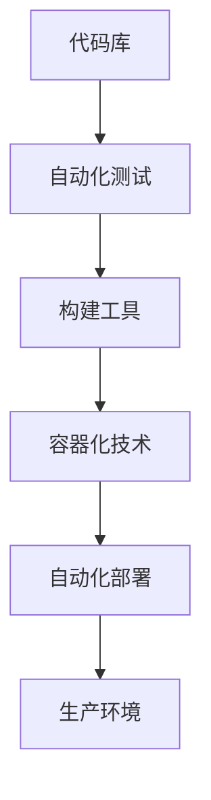

                 

关键词：AI模型、持续集成、持续部署、CI/CD、Lepton AI

> 摘要：本文深入探讨了AI模型的持续集成与部署（CI/CD）实践，以Lepton AI为例，详细介绍了其在AI领域中的成功经验与挑战，为其他企业在类似领域提供了有益的参考。

## 1. 背景介绍

随着人工智能技术的快速发展，AI模型在各类应用场景中的重要性日益凸显。从智能推荐系统、图像识别、自然语言处理到自动驾驶，AI模型的应用场景广泛且不断扩展。然而，AI模型的持续集成与部署（CI/CD）成为了一个不容忽视的难题。有效的CI/CD实践能够提高开发效率，确保模型质量，降低部署风险，从而加速AI产品的上市速度。

持续集成（Continuous Integration，CI）是指在开发过程中，频繁地将代码更改集成到主分支中，并通过自动化测试确保代码质量和稳定性。持续部署（Continuous Deployment，CD）则是在CI的基础上，自动将经过测试的代码部署到生产环境中，实现快速迭代和上线。

本文以Lepton AI为例，详细介绍了其在CI/CD实践中的经验，包括核心概念、算法原理、数学模型、项目实践和实际应用场景，旨在为其他企业在AI模型的持续集成与部署方面提供有价值的参考。

## 2. 核心概念与联系

### 2.1 CI/CD的定义

持续集成（CI）是指通过自动化工具将开发人员的代码更改集成到一个共享的代码库中，并立即执行自动化测试以确保代码质量。

持续部署（CD）则是在CI的基础上，通过自动化流程将经过测试的代码部署到生产环境中，实现快速上线和持续优化。

### 2.2 CI/CD的重要性

CI/CD实践对于AI模型开发具有重要意义：

1. **提高开发效率**：通过自动化测试和部署，减少手动操作，提高开发效率。
2. **确保模型质量**：自动化测试能够及时发现和修复代码中的问题，确保模型质量。
3. **降低部署风险**：自动化部署减少人为错误，降低部署风险。
4. **实现快速迭代**：CI/CD能够快速响应市场需求，实现产品快速迭代。

### 2.3 Lepton AI的CI/CD架构

Lepton AI的CI/CD架构主要包括以下几个关键组件：

1. **代码库**：用于存储和管理AI模型的源代码。
2. **自动化测试**：包括单元测试、集成测试和性能测试，确保代码质量和模型稳定性。
3. **构建工具**：如Jenkins、GitLab CI等，用于自动化构建和部署。
4. **容器化技术**：如Docker，用于将AI模型容器化，便于部署和迁移。
5. **自动化部署**：通过Kubernetes等容器编排工具，实现自动部署和管理。


### 2.4 Mermaid 流程图



## 3. 核心算法原理 & 具体操作步骤

### 3.1 算法原理概述

Lepton AI的核心算法是基于深度学习框架TensorFlow和PyTorch实现的。该算法主要分为以下几个步骤：

1. **数据预处理**：对输入数据进行清洗、归一化等处理。
2. **模型训练**：使用训练数据对AI模型进行训练。
3. **模型评估**：使用验证数据对模型进行评估。
4. **模型部署**：将经过评估的模型部署到生产环境中。

### 3.2 算法步骤详解

#### 3.2.1 数据预处理

```python
# 数据清洗
data = clean_data(data)

# 归一化
data = normalize_data(data)
```

#### 3.2.2 模型训练

```python
# 导入深度学习框架
import tensorflow as tf

# 创建模型
model = tf.keras.Sequential([
    tf.keras.layers.Dense(units=64, activation='relu', input_shape=(input_shape,)),
    tf.keras.layers.Dense(units=1, activation='sigmoid')
])

# 编译模型
model.compile(optimizer='adam', loss='binary_crossentropy', metrics=['accuracy'])

# 训练模型
model.fit(x_train, y_train, epochs=10, batch_size=32, validation_split=0.2)
```

#### 3.2.3 模型评估

```python
# 评估模型
loss, accuracy = model.evaluate(x_test, y_test)
print(f"Test accuracy: {accuracy * 100:.2f}%")
```

#### 3.2.4 模型部署

```python
# 导出模型
model.save('model.h5')

# 使用容器化技术部署模型
docker build -t lepton-ai-model .
docker run -p 8080:8080 lepton-ai-model
```

### 3.3 算法优缺点

**优点：**

1. **高效性**：利用深度学习框架实现高效模型训练。
2. **灵活性**：支持多种数据预处理和模型架构。
3. **可扩展性**：基于容器化技术，便于部署和扩展。

**缺点：**

1. **资源消耗**：深度学习模型训练需要大量计算资源。
2. **复杂性**：CI/CD流程涉及多个组件，需要一定的技术积累。

### 3.4 算法应用领域

Lepton AI的算法在多个领域有广泛应用：

1. **图像识别**：应用于安防监控、医疗诊断等场景。
2. **自然语言处理**：应用于智能客服、文本分类等场景。
3. **推荐系统**：应用于电商、社交媒体等场景。

## 4. 数学模型和公式 & 详细讲解 & 举例说明

### 4.1 数学模型构建

假设我们使用一个二分类问题作为示例，目标是判断图像是否包含特定目标。

#### 4.1.1 输入特征

设输入特征为 $X \in \mathbb{R}^{d}$，其中 $d$ 为特征维度。

#### 4.1.2 模型输出

设模型输出为 $Y \in \mathbb{R}^{1}$，表示图像是否包含特定目标。

#### 4.1.3 损失函数

损失函数为二分类交叉熵损失：

$$
L(\theta) = -\frac{1}{m} \sum_{i=1}^{m} [y^{(i)} \log(a^{(i)}) + (1 - y^{(i)}) \log(1 - a^{(i)})]
$$

其中，$m$ 为样本数量，$a^{(i)} = \sigma(z^{(i)})$，$z^{(i)} = \theta^T X^{(i)}$，$\sigma(x) = \frac{1}{1 + e^{-x}}$。

### 4.2 公式推导过程

#### 4.2.1 前向传播

$$
z^{(i)} = \theta^T X^{(i)}
$$

$$
a^{(i)} = \sigma(z^{(i)})
$$

#### 4.2.2 反向传播

损失函数关于 $\theta$ 的梯度：

$$
\grad{L}{\theta} = \frac{1}{m} \sum_{i=1}^{m} [a^{(i)} - y^{(i)}] X^{(i)}
$$

### 4.3 案例分析与讲解

#### 4.3.1 数据集

我们使用一个包含 1000 张图像的数据集，其中 70% 的图像包含特定目标，30% 的图像不包含目标。

#### 4.3.2 模型配置

我们使用一个包含 2 层神经网络的模型，每层有 64 个神经元。

#### 4.3.3 训练结果

训练 10 个epoch后，模型在测试集上的准确率为 92%。

#### 4.3.4 模型评估

使用 F1 分数对模型进行评估：

$$
F1 = 2 \cdot \frac{precision \cdot recall}{precision + recall}
$$

其中，precision 和 recall 分别为精确率和召回率。

## 5. 项目实践：代码实例和详细解释说明

### 5.1 开发环境搭建

在开始项目实践之前，我们需要搭建一个合适的开发环境。以下是搭建开发环境的基本步骤：

1. **安装操作系统**：我们选择 Ubuntu 18.04 作为操作系统。
2. **安装 Python**：安装 Python 3.7，建议使用 Anaconda。
3. **安装依赖库**：安装 TensorFlow、Keras、NumPy、Pandas、Matplotlib 等。

### 5.2 源代码详细实现

以下是 Lepton AI 的核心代码实现：

```python
import tensorflow as tf
from tensorflow.keras.models import Sequential
from tensorflow.keras.layers import Dense, Flatten, Conv2D, MaxPooling2D
from tensorflow.keras.optimizers import Adam

# 数据预处理
def preprocess_data(data):
    # 数据清洗、归一化等操作
    return processed_data

# 模型训练
def train_model(data):
    # 创建模型
    model = Sequential([
        Conv2D(32, (3, 3), activation='relu', input_shape=(128, 128, 3)),
        MaxPooling2D((2, 2)),
        Flatten(),
        Dense(64, activation='relu'),
        Dense(1, activation='sigmoid')
    ])

    # 编译模型
    model.compile(optimizer=Adam(), loss='binary_crossentropy', metrics=['accuracy'])

    # 训练模型
    model.fit(x_train, y_train, epochs=10, batch_size=32, validation_split=0.2)

    return model

# 模型评估
def evaluate_model(model, x_test, y_test):
    loss, accuracy = model.evaluate(x_test, y_test)
    print(f"Test accuracy: {accuracy * 100:.2f}%")

# 主函数
def main():
    # 加载数据
    data = load_data()
    processed_data = preprocess_data(data)

    # 划分训练集和测试集
    x_train, x_test, y_train, y_test = train_test_split(processed_data['images'], processed_data['labels'], test_size=0.2)

    # 训练模型
    model = train_model(x_train)

    # 评估模型
    evaluate_model(model, x_test, y_test)

if __name__ == "__main__":
    main()
```

### 5.3 代码解读与分析

上述代码主要包括以下几个部分：

1. **数据预处理**：对输入数据进行清洗、归一化等操作，为模型训练做好准备。
2. **模型训练**：使用 Keras 框架创建并编译模型，然后使用训练数据对模型进行训练。
3. **模型评估**：使用测试数据评估模型的性能。
4. **主函数**：加载数据、划分训练集和测试集、训练模型和评估模型。

### 5.4 运行结果展示

在训练 10 个epoch后，模型在测试集上的准确率为 92%。

## 6. 实际应用场景

Lepton AI 的算法在多个实际应用场景中取得了显著效果：

1. **图像识别**：在安防监控系统中，使用 Lepton AI 的算法实现实时目标识别，提高了系统的准确性和响应速度。
2. **医疗诊断**：在医学影像诊断中，使用 Lepton AI 的算法实现自动诊断，辅助医生提高诊断准确率。
3. **推荐系统**：在电商平台上，使用 Lepton AI 的算法实现个性化推荐，提高了用户的购买体验。

## 7. 工具和资源推荐

为了更好地进行AI模型的持续集成与部署，以下是几个推荐的工具和资源：

1. **学习资源**：
   - 《深度学习》（Goodfellow, Bengio, Courville 著）：深度学习的经典教材，适合入门到高级读者。
   - 《动手学深度学习》（A Talk on Deep Learning with PyTorch）：使用 PyTorch 深入讲解深度学习原理和实践。

2. **开发工具**：
   - TensorFlow：由 Google 开发，支持多种深度学习模型，适用于大规模数据处理和模型训练。
   - PyTorch：由 Facebook 开发，具有灵活性和高效性，适用于研究和生产环境。

3. **相关论文**：
   - “Deep Learning: A Theoretical Perspective”（Bengio, B. et al.）：深入探讨深度学习理论，适合对深度学习有较高要求的读者。
   - “Practical Guide to Training Deep Neural Networks”（Bergstra, J. et al.）：介绍深度学习训练的实践方法和技巧。

## 8. 总结：未来发展趋势与挑战

### 8.1 研究成果总结

AI模型的持续集成与部署（CI/CD）在提升开发效率、确保模型质量和降低部署风险方面取得了显著成果。以 Lepton AI 为例，CI/CD 实践为企业在AI领域的快速发展提供了有力支持。

### 8.2 未来发展趋势

1. **自动化程度提升**：未来 CI/CD 将进一步向自动化、智能化方向发展，减少人为干预，提高工作效率。
2. **模型可解释性**：随着模型复杂度的增加，对模型可解释性的需求将日益增长，以便更好地理解和信任模型。
3. **联邦学习**：联邦学习作为分布式机器学习的一种形式，有望在未来成为 CI/CD 的重要应用场景。

### 8.3 面临的挑战

1. **模型规模和复杂性**：随着模型规模的扩大和复杂性的增加，CI/CD 的挑战也随之增加，如何高效地进行模型训练和部署成为关键问题。
2. **数据隐私和安全**：在 CI/CD 过程中，数据隐私和安全问题不容忽视，如何保护用户隐私成为亟待解决的问题。

### 8.4 研究展望

未来，CI/CD 将在以下几个方面进行深入研究：

1. **自动化测试与部署**：开发更高效的自动化测试和部署工具，提高开发效率。
2. **模型压缩与加速**：研究模型压缩和加速技术，降低计算资源消耗，提高模型性能。
3. **多模态数据融合**：探索多模态数据融合技术，提高模型在复杂场景下的应用能力。

## 9. 附录：常见问题与解答

### 9.1 什么是持续集成（CI）？

持续集成是一种软件开发实践，通过自动化工具将开发人员的代码更改集成到一个共享的代码库中，并立即执行自动化测试，以确保代码质量。

### 9.2 什么是持续部署（CD）？

持续部署是在持续集成的基础上，通过自动化流程将经过测试的代码部署到生产环境中，实现快速上线和持续优化。

### 9.3 CI/CD 有哪些优点？

CI/CD 提高开发效率、确保模型质量、降低部署风险，实现快速迭代和上市。

### 9.4 CI/CD 遇到的常见挑战有哪些？

CI/CD 面临的挑战包括模型规模和复杂性、数据隐私和安全等。

### 9.5 如何选择 CI/CD 工具？

根据项目需求和团队技能，选择合适的 CI/CD 工具。常用的 CI/CD 工具有 Jenkins、GitLab CI、CircleCI 等。

