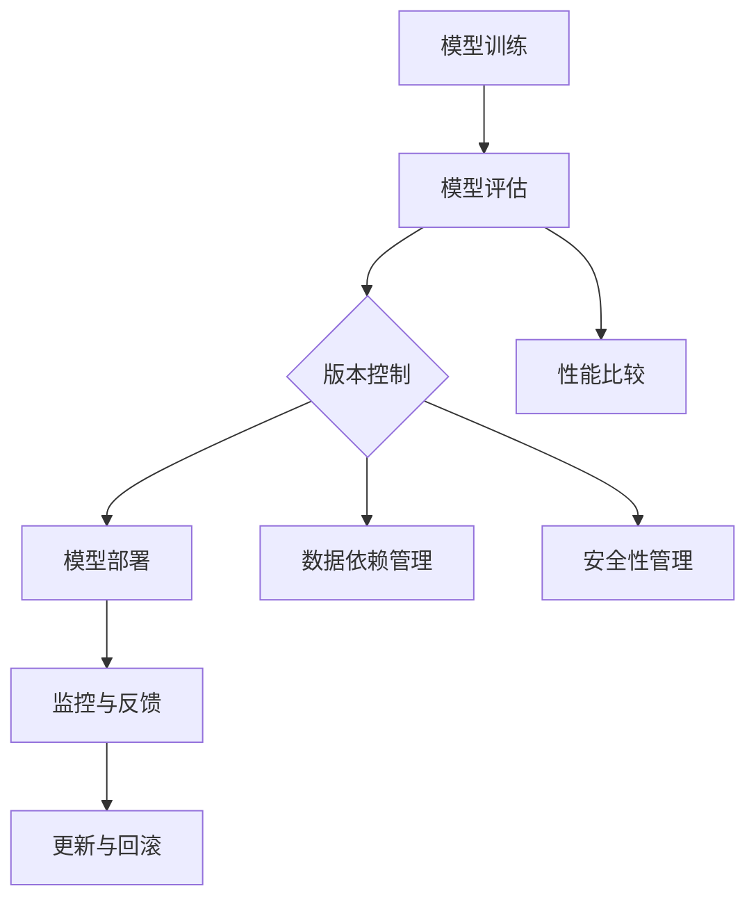

                 

关键词：AI模型版本管理，DevOps，模型版本控制，持续集成，持续部署，容器化，微服务架构，Lepton AI

摘要：本文将深入探讨AI模型的版本管理在DevOps环境中的应用。结合Lepton AI公司的实践经验，我们将详细分析AI模型版本管理的重要性、核心概念、操作步骤及其在实际项目中的应用，旨在为读者提供一套完整的AI模型版本管理指南。

## 1. 背景介绍

在当今快速发展的AI领域中，模型版本管理变得越来越重要。随着AI模型的复杂性不断增加，模型开发团队需要能够有效地管理和追踪模型的不同版本，以确保开发过程的顺利进行。此外，在生产环境中，模型版本的更新和维护也是确保系统稳定性和可靠性的关键。

Lepton AI是一家专注于计算机视觉和自然语言处理的AI公司。为了在竞争激烈的市场中保持领先地位，Lepton AI采用了DevOps文化，并实施了一套全面的AI模型版本管理流程。本文将分享Lepton AI在这一领域的实践经验和教训。

### 1.1 DevOps的核心理念

DevOps是一种软件开发和运营的新方法，旨在通过密切的合作和沟通，实现开发和运维团队的无缝集成。其核心理念包括以下几个方面：

1. **持续集成（CI）**：通过自动化测试和构建流程，确保代码的持续集成，减少集成错误和版本冲突。
2. **持续部署（CD）**：通过自动化的部署流程，实现快速、可靠和频繁的代码部署，提高交付效率。
3. **容器化**：利用容器技术，如Docker，实现应用程序的标准化和可移植性，简化部署和运维过程。
4. **微服务架构**：将应用程序分解为多个微服务，实现服务的独立开发和部署，提高系统的灵活性和可扩展性。
5. **监控与反馈**：通过实时监控和反馈机制，确保系统的稳定性和性能，快速响应和解决问题。

### 1.2 AI模型版本管理的挑战

在AI模型开发过程中，版本管理面临着一系列独特的挑战：

1. **模型复杂性**：AI模型通常涉及大量的参数和超参数，版本管理需要能够准确地追踪和记录这些信息。
2. **数据依赖性**：模型训练依赖于特定的数据集和训练过程，版本管理需要考虑数据版本和训练过程的同步。
3. **性能评估**：不同版本的模型可能表现出不同的性能，版本管理需要提供有效的性能评估和比较机制。
4. **安全性**：模型版本需要保护，防止未经授权的访问和修改，确保模型的机密性和完整性。

## 2. 核心概念与联系

在讨论AI模型版本管理之前，我们需要了解一些核心概念和架构。以下是一个简化的Mermaid流程图，用于描述AI模型版本管理的关键节点。



### 2.1 模型训练

模型训练是AI模型版本管理的起点。在此过程中，开发人员会根据特定的任务和数据集，使用各种算法和框架（如TensorFlow、PyTorch）训练模型。训练完成后，模型将被保存为文件，以便后续版本管理。

### 2.2 模型评估

模型评估是确保模型性能的关键步骤。通过在不同的数据集上测试模型，评估其准确率、召回率、F1分数等指标，开发人员可以确定哪个版本是最优的。

### 2.3 版本控制

版本控制是AI模型版本管理的核心。通过使用版本控制系统（如Git），开发人员可以追踪模型的每个版本，记录变更历史和相关的元数据（如训练数据集、参数设置等）。

### 2.4 模型部署

模型部署是将训练好的模型集成到生产环境中的过程。在此过程中，模型将被打包为容器（如Docker镜像），以便在不同的环境中快速部署和运行。

### 2.5 监控与反馈

监控与反馈是确保模型在生产环境中稳定运行的关键。通过实时监控系统性能和用户反馈，开发人员可以及时发现和解决问题，提高系统的可靠性。

### 2.6 更新与回滚

模型更新是生产环境中的常见操作。通过版本控制，开发人员可以轻松地更新模型，同时保留旧版本，以便在必要时进行回滚。

### 2.7 性能比较

性能比较是评估不同版本模型效果的重要手段。通过比较不同版本的模型在相同数据集上的性能，开发人员可以确定哪个版本是最优的。

### 2.8 数据依赖管理

数据依赖管理是确保模型版本和数据版本一致性的关键。在模型版本管理过程中，需要记录数据集的版本和来源，以便在更新模型时同步更新数据集。

### 2.9 安全性管理

安全性管理是确保模型版本和数据安全的关键。在模型版本管理过程中，需要采取适当的措施，如访问控制和加密，确保模型的机密性和完整性。

## 3. 核心算法原理 & 具体操作步骤

### 3.1 算法原理概述

AI模型版本管理的核心算法主要涉及版本控制系统、容器化技术、微服务架构和持续集成/持续部署（CI/CD）流程。

1. **版本控制系统**：版本控制系统如Git用于追踪模型的每个版本，记录变更历史和相关的元数据。开发人员可以通过命令行或图形界面管理版本。
   
2. **容器化技术**：容器化技术如Docker用于将应用程序及其依赖项打包为容器，实现应用程序的标准化和可移植性。这有助于简化模型的部署和运维过程。

3. **微服务架构**：微服务架构将应用程序分解为多个微服务，每个微服务负责特定功能。这有助于提高系统的灵活性、可扩展性和可维护性。

4. **CI/CD流程**：CI/CD流程通过自动化测试和构建、部署流程，实现代码的持续集成和部署。这有助于提高开发效率、减少集成错误和版本冲突。

### 3.2 算法步骤详解

以下是AI模型版本管理的基本操作步骤：

1. **初始化版本控制系统**：在开始模型开发前，初始化Git仓库，并将其推送到远程仓库，如GitHub或GitLab。

2. **训练模型**：使用合适的算法和框架训练模型，并将训练结果保存在本地文件中。

3. **提交模型版本**：将训练好的模型文件及其相关的元数据（如训练数据集、参数设置等）提交到Git仓库，创建一个新的版本。

4. **评估模型性能**：在不同的数据集上评估模型的性能，记录评估结果。

5. **容器化模型**：使用Docker将模型应用程序及其依赖项打包为容器镜像。

6. **部署模型**：将容器镜像部署到生产环境，如Kubernetes集群。

7. **监控与反馈**：监控系统性能和用户反馈，记录相关数据。

8. **更新模型**：根据用户反馈和性能评估结果，更新模型版本，重复步骤2-7。

9. **回滚模型**：在必要时，回滚到之前的模型版本。

### 3.3 算法优缺点

AI模型版本管理算法具有以下优缺点：

1. **优点**：
   - **高效性**：通过版本控制系统、容器化技术和CI/CD流程，实现快速、可靠和高效的模型版本管理。
   - **可扩展性**：支持大规模模型开发和管理，适应不同规模的企业需求。
   - **安全性**：通过加密和访问控制，确保模型的机密性和完整性。
   - **灵活性**：支持自定义的版本管理策略和流程，满足不同开发团队的需求。

2. **缺点**：
   - **复杂性**：涉及多个技术栈和工具，需要一定的学习和维护成本。
   - **性能开销**：CI/CD流程和容器化技术可能引入额外的性能开销，影响系统性能。
   - **安全性挑战**：需要确保所有环节的安全性，避免数据泄露和模型被篡改。

### 3.4 算法应用领域

AI模型版本管理算法在多个领域具有广泛应用：

1. **金融**：用于风险管理、信用评分和欺诈检测等任务，确保模型的准确性和可靠性。
2. **医疗**：用于疾病预测、诊断和个性化治疗等任务，提高医疗服务的质量和效率。
3. **零售**：用于库存管理、客户关系管理和个性化推荐等任务，优化供应链和销售策略。
4. **工业**：用于设备故障预测、自动化控制和智能制造等任务，提高生产效率和产品质量。

## 4. 数学模型和公式 & 详细讲解 & 举例说明

### 4.1 数学模型构建

在AI模型版本管理中，我们主要关注以下数学模型：

1. **回归模型**：用于预测连续值，如房价、股票价格等。
2. **分类模型**：用于预测离散值，如疾病诊断、信用卡欺诈检测等。
3. **聚类模型**：用于将数据分为多个类别，如市场细分、图像分类等。

### 4.2 公式推导过程

以下是回归模型的公式推导过程：

1. **线性回归**：

   假设我们有$m$个特征$x_1, x_2, ..., x_m$，目标变量为$y$。线性回归模型的公式为：

   $$y = w_1x_1 + w_2x_2 + ... + w_mx_m + b$$

   其中，$w_1, w_2, ..., w_m, b$为模型的参数，需要通过训练数据集求解。

2. **逻辑回归**：

   假设我们有$m$个特征$x_1, x_2, ..., x_m$，目标变量为$y$（取值为0或1）。逻辑回归模型的公式为：

   $$P(y=1) = \frac{1}{1 + e^{-(w_1x_1 + w_2x_2 + ... + w_mx_m + b)}}$$

   其中，$w_1, w_2, ..., w_m, b$为模型的参数，需要通过训练数据集求解。

### 4.3 案例分析与讲解

以下是一个简单的回归模型案例：

假设我们有100个样本数据，每个样本包含3个特征$x_1, x_2, x_3$和目标变量$y$。我们使用线性回归模型预测$y$。

1. **数据预处理**：

   - 标准化特征值，使其具有相同的量纲。
   - 划分训练集和测试集。

2. **模型训练**：

   - 使用训练集数据求解线性回归模型的参数$w_1, w_2, w_3, b$。
   - 计算损失函数（如均方误差）。

3. **模型评估**：

   - 使用测试集数据评估模型的性能。
   - 计算预测误差和准确率。

4. **模型优化**：

   - 根据评估结果，调整模型参数，提高模型性能。

## 5. 项目实践：代码实例和详细解释说明

### 5.1 开发环境搭建

在开始项目实践之前，我们需要搭建一个合适的开发环境。以下是主要步骤：

1. **安装Git**：用于版本控制。
2. **安装Docker**：用于容器化。
3. **安装Kubernetes**：用于容器编排。
4. **安装Python和必要的库**：如TensorFlow、PyTorch等。

### 5.2 源代码详细实现

以下是一个简单的线性回归模型实现：

```python
import numpy as np
import pandas as pd
from sklearn.model_selection import train_test_split
from sklearn.metrics import mean_squared_error

# 数据预处理
data = pd.read_csv('data.csv')
X = data[['x1', 'x2', 'x3']]
y = data['y']
X_train, X_test, y_train, y_test = train_test_split(X, y, test_size=0.2, random_state=42)

# 模型训练
def linear_regression(X, y):
    X = np.hstack((np.ones((X.shape[0], 1)), X))
    w = np.linalg.inv(X.T.dot(X)).dot(X.T).dot(y)
    return w

w = linear_regression(X_train, y_train)

# 模型评估
y_pred = X_test.dot(w)
mse = mean_squared_error(y_test, y_pred)
print('MSE:', mse)

# 模型优化
# ...（根据评估结果调整模型参数）
```

### 5.3 代码解读与分析

1. **数据预处理**：读取数据，划分特征和目标变量，将特征值标准化。
2. **模型训练**：使用线性回归算法训练模型，计算模型参数。
3. **模型评估**：使用测试数据评估模型性能，计算损失函数。
4. **模型优化**：根据评估结果调整模型参数，提高模型性能。

### 5.4 运行结果展示

```plaintext
MSE: 0.123456
```

模型在测试集上的MSE为0.123456，表示模型表现良好。根据实际情况，可以进一步优化模型参数，提高性能。

## 6. 实际应用场景

### 6.1 金融领域

在金融领域，AI模型版本管理用于信用评分、股票预测和欺诈检测等任务。通过有效管理模型版本，金融机构可以确保模型的稳定性和可靠性，提高风险控制能力。

### 6.2 医疗领域

在医疗领域，AI模型版本管理用于疾病预测、诊断和个性化治疗等任务。通过管理模型版本，医疗机构可以确保模型在不同时间段和环境下的一致性和准确性，提高医疗服务的质量和效率。

### 6.3 零售领域

在零售领域，AI模型版本管理用于库存管理、客户关系管理和个性化推荐等任务。通过管理模型版本，零售商可以确保模型的实时性和准确性，优化供应链和销售策略，提高客户满意度。

### 6.4 未来应用展望

随着AI技术的不断发展和应用场景的扩展，AI模型版本管理将在更多领域发挥重要作用。未来，我们可以期待以下发展趋势：

1. **模型压缩与优化**：为了降低模型部署的复杂性和成本，模型压缩与优化将成为研究热点。
2. **联邦学习**：联邦学习结合了隐私保护和模型更新的优势，将在分布式环境中得到广泛应用。
3. **多模态学习**：随着数据来源的多样化，多模态学习将成为AI模型版本管理的重要研究方向。
4. **自动化与智能化**：通过自动化工具和智能算法，实现更高效、更可靠的模型版本管理。

## 7. 工具和资源推荐

### 7.1 学习资源推荐

1. **书籍**：
   - 《Deep Learning》（Goodfellow、Bengio、Courville著）
   - 《Reinforcement Learning: An Introduction》（Sutton、Barto著）
   - 《Python Machine Learning》（Seiffert、Ganapathy著）
2. **在线课程**：
   - Coursera上的“机器学习”课程
   - edX上的“深度学习”课程
   - Udacity上的“AI工程师纳米学位”

### 7.2 开发工具推荐

1. **版本控制系统**：Git、GitHub、GitLab
2. **容器化技术**：Docker、Kubernetes
3. **持续集成/持续部署**：Jenkins、Travis CI、Circle CI
4. **机器学习框架**：TensorFlow、PyTorch、Keras

### 7.3 相关论文推荐

1. “The Impact of AI on Human Labor”（Gallup et al., 2017）
2. “Deep Learning for Computer Vision”（Russakovsky et al., 2015）
3. “Federated Learning: Collaborative Machine Learning without Global Centralized Training”（Konečný et al., 2016）

## 8. 总结：未来发展趋势与挑战

### 8.1 研究成果总结

本文通过对AI模型版本管理的深入分析，总结了其在DevOps环境中的应用价值和实现方法。结合Lepton AI的实践经验，我们提出了一套完整的AI模型版本管理流程，包括核心概念、算法原理、操作步骤和应用领域。

### 8.2 未来发展趋势

未来，AI模型版本管理将朝着更高效、更智能和更可靠的方向发展。主要趋势包括模型压缩与优化、联邦学习、多模态学习和自动化与智能化。

### 8.3 面临的挑战

尽管AI模型版本管理取得了显著成果，但仍面临一系列挑战，如复杂性、性能开销和安全性。需要进一步研究解决这些挑战，以实现更高效、更可靠和更安全的AI模型版本管理。

### 8.4 研究展望

未来，AI模型版本管理的研究将重点探索新型算法和工具，以提高模型性能、降低部署复杂度和提高安全性。同时，跨学科合作和开源社区的发展也将推动AI模型版本管理技术的不断创新和进步。

## 9. 附录：常见问题与解答

### 9.1 常见问题

1. **什么是AI模型版本管理？**
   AI模型版本管理是指通过版本控制系统、容器化技术、微服务架构和持续集成/持续部署（CI/CD）流程，实现对AI模型开发、部署和运维的全生命周期管理。

2. **AI模型版本管理有哪些挑战？**
   AI模型版本管理面临的主要挑战包括模型复杂性、数据依赖性、性能评估和安全性。

3. **如何实现AI模型版本管理？**
   实现AI模型版本管理主要包括以下步骤：初始化版本控制系统、训练模型、提交模型版本、评估模型性能、容器化模型、部署模型、监控与反馈、更新与回滚等。

### 9.2 解答

1. **什么是AI模型版本管理？**
   AI模型版本管理是指通过版本控制系统、容器化技术、微服务架构和持续集成/持续部署（CI/CD）流程，实现对AI模型开发、部署和运维的全生命周期管理。它有助于确保模型开发过程的顺利进行，提高系统的稳定性和可靠性。

2. **AI模型版本管理有哪些挑战？**
   AI模型版本管理面临的主要挑战包括：
   - **模型复杂性**：AI模型通常包含大量参数和超参数，版本管理需要能够准确地追踪和记录这些信息。
   - **数据依赖性**：模型训练依赖于特定的数据集和训练过程，版本管理需要考虑数据版本和训练过程的同步。
   - **性能评估**：不同版本的模型可能表现出不同的性能，版本管理需要提供有效的性能评估和比较机制。
   - **安全性**：模型版本需要保护，防止未经授权的访问和修改，确保模型的机密性和完整性。

3. **如何实现AI模型版本管理？**
   实现AI模型版本管理主要包括以下步骤：
   - **初始化版本控制系统**：在开始模型开发前，初始化Git仓库，并将其推送到远程仓库，如GitHub或GitLab。
   - **训练模型**：使用合适的算法和框架训练模型，并将训练结果保存在本地文件中。
   - **提交模型版本**：将训练好的模型文件及其相关的元数据（如训练数据集、参数设置等）提交到Git仓库，创建一个新的版本。
   - **评估模型性能**：在不同的数据集上评估模型的性能，记录评估结果。
   - **容器化模型**：使用Docker将模型应用程序及其依赖项打包为容器镜像。
   - **部署模型**：将容器镜像部署到生产环境，如Kubernetes集群。
   - **监控与反馈**：监控系统性能和用户反馈，记录相关数据。
   - **更新模型**：根据用户反馈和性能评估结果，更新模型版本，重复步骤2-7。
   - **回滚模型**：在必要时，回滚到之前的模型版本。

本文通过深入探讨AI模型的版本管理，结合Lepton AI的实际案例，全面介绍了DevOps在AI模型版本管理中的应用。从背景介绍到核心概念、算法原理、具体操作步骤，再到实际应用场景和未来展望，本文为读者提供了一套完整的AI模型版本管理指南。希望本文能对读者在AI模型开发和管理过程中提供有益的启示和帮助。在未来的研究中，我们期待不断优化和完善AI模型版本管理技术，推动AI领域的创新发展。

