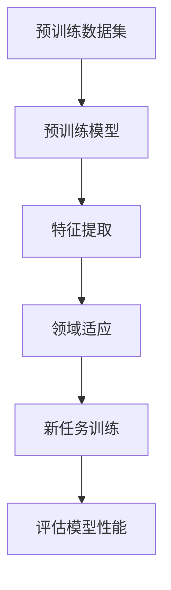

                 

关键词：AI模型，跨域学习，知识迁移，Lepton AI，神经网络，深度学习，模型压缩，数据处理

> 摘要：本文将深入探讨AI模型的跨域学习技术，重点分析Lepton AI如何实现知识在不同领域的迁移。通过对核心概念、算法原理、数学模型、项目实践以及实际应用场景的详细分析，我们旨在为读者提供一个全面而深入的了解。

## 1. 背景介绍

随着深度学习的迅猛发展，AI模型在各个领域都展现出了卓越的性能。然而，大多数AI模型在训练时都依赖于大量的数据，且通常只能在特定的领域内表现出色。这种模型专有的局限性阻碍了AI技术在更广泛领域的应用。为了解决这个问题，跨域学习（Cross-Domain Learning）应运而生。

跨域学习是指将一个领域中的知识迁移到另一个领域，使得AI模型能够更好地适应新的环境。这一技术不仅能够提高模型在未知领域的表现，还能够减少对新数据的依赖，降低训练成本。

Lepton AI是一个专注于跨域学习研究的公司，其核心产品就是利用知识迁移技术来提升AI模型在不同领域中的应用效果。本文将详细探讨Lepton AI是如何实现这一目标的。

### 1.1 跨域学习的挑战

尽管跨域学习具有巨大的潜力，但其实施过程中也面临着诸多挑战：

- **数据分布差异**：不同领域的数据分布往往存在显著差异，这使得直接迁移知识变得困难。
- **领域特定特征**：一些领域具有独特的特征，这些特征无法通过传统的数据驱动方法来学习。
- **模型适应性**：AI模型在新的领域内可能需要重新调整参数，以达到最佳性能。

### 1.2 跨域学习的应用场景

跨域学习的应用场景非常广泛，以下是一些典型的例子：

- **医疗领域**：利用一个领域的医学图像数据来训练模型，然后将其迁移到另一个未见的疾病诊断领域。
- **金融领域**：利用一个领域的股票市场数据来训练模型，然后将其迁移到另一个领域的风险管理。
- **制造业**：利用一个领域的机器维护数据来训练模型，然后将其迁移到另一个领域的故障预测。

## 2. 核心概念与联系

### 2.1 跨域学习的关键概念

为了理解跨域学习的工作原理，我们需要先了解以下几个核心概念：

- **域（Domain）**：指的是数据的来源或应用场景。例如，医疗、金融和制造业等。
- **任务（Task）**：指的是模型需要完成的具体任务。例如，疾病诊断、股票市场预测和故障预测等。
- **知识迁移（Knowledge Transfer）**：指的是将一个领域的知识（通常是预训练模型）迁移到另一个领域。

### 2.2 跨域学习的架构

跨域学习通常包括以下几个步骤：

1. **预训练模型**：在一个领域内使用大量的数据对模型进行预训练。
2. **特征提取**：将预训练模型中的特征提取出来，这些特征通常具有泛化能力。
3. **领域适应**：将提取的特征适应到新的领域，这通常涉及到调整模型的参数。
4. **新任务训练**：在新的领域内使用少量的数据对模型进行微调。

### 2.3 Mermaid 流程图

以下是一个简单的Mermaid流程图，展示了跨域学习的基本流程：



## 3. 核心算法原理 & 具体操作步骤

### 3.1 算法原理概述

Lepton AI的核心算法是基于迁移学习（Transfer Learning）和元学习（Meta-Learning）。以下是这两个算法的基本原理：

- **迁移学习**：通过将一个领域中的知识迁移到另一个领域，来提高模型在新领域的性能。
- **元学习**：通过学习如何学习，来加快模型的训练过程并提高其泛化能力。

### 3.2 算法步骤详解

以下是Lepton AI实现跨域学习的具体步骤：

1. **预训练阶段**：使用一个领域的公共数据集对模型进行预训练，使得模型能够学习到一些通用的特征表示。
2. **特征提取阶段**：在预训练过程中，提取模型中的特征表示，这些特征表示应该具备跨领域的泛化能力。
3. **领域适应阶段**：使用另一个领域的私有数据集来调整模型的参数，使得模型能够更好地适应新的领域。
4. **新任务训练阶段**：在新的领域内使用少量的数据对模型进行微调，以完成特定的任务。
5. **评估阶段**：评估模型在新领域的性能，确保其能够达到预期的效果。

### 3.3 算法优缺点

- **优点**：
  - 能够提高模型在新领域的性能，减少对新数据的依赖。
  - 能够加快模型的训练过程，节省计算资源。
  - 能够增强模型的泛化能力，提高其在未知领域的适应性。

- **缺点**：
  - 需要大量的预训练数据和私有数据来保证模型的性能。
  - 领域适应过程可能需要较长时间。

### 3.4 算法应用领域

Lepton AI的算法可以应用于多个领域，以下是一些典型的应用场景：

- **医疗领域**：利用跨域学习来提高疾病诊断的准确性。
- **金融领域**：利用跨域学习来预测市场趋势和风险管理。
- **制造业**：利用跨域学习来预测设备故障和优化生产流程。

## 4. 数学模型和公式 & 详细讲解 & 举例说明

### 4.1 数学模型构建

跨域学习的数学模型通常基于迁移学习和元学习。以下是一个简化的数学模型：

$$
\text{模型} = \text{预训练模型} + \text{领域适应模块}
$$

其中，预训练模型是一个已经在某个领域内训练好的神经网络，领域适应模块则用于调整模型以适应新的领域。

### 4.2 公式推导过程

假设我们有一个预训练模型 $M$，其参数为 $\theta$。在预训练阶段，模型在数据集 $D$ 上进行了训练，得到了最优参数 $\theta^*$。

在领域适应阶段，我们使用另一个数据集 $D'$ 来调整模型。领域适应模块可以表示为 $F(\theta^*, D')$。我们的目标是找到新的参数 $\theta'^*$，使得模型在新领域内具有最佳性能。

通过最小化损失函数，我们可以推导出领域适应模块的更新规则：

$$
\theta'^* = \theta^* + \alpha \nabla_{\theta^*} \text{loss}(M(D'), \theta^*)
$$

其中，$\alpha$ 是学习率，$\text{loss}(M(D'), \theta^*)$ 是在数据集 $D'$ 上的损失函数。

### 4.3 案例分析与讲解

假设我们有一个预训练的图像分类模型，其已经在CIFAR-10数据集上进行了预训练。现在，我们需要将其迁移到新的数据集，例如 ImageNet。

在预训练阶段，模型已经学习到了一些通用的图像特征表示。在领域适应阶段，我们使用 ImageNet 数据集来调整模型的参数。通过最小化在 ImageNet 数据集上的损失函数，我们可以得到新的模型参数。

以下是具体的推导过程：

1. **预训练模型**：$M(\theta^*)$ 在 CIFAR-10 数据集上进行了预训练，得到最优参数 $\theta^*$。
2. **领域适应模块**：$F(\theta^*, D')$ 在 ImageNet 数据集上调整模型参数。
3. **更新规则**：使用梯度下降算法来更新参数：

$$
\theta'^* = \theta^* + \alpha \nabla_{\theta^*} \text{loss}(M(D'), \theta^*)
$$

通过多次迭代，我们可以得到新的模型参数 $\theta'^*$，使得模型在 ImageNet 数据集上具有最佳性能。

## 5. 项目实践：代码实例和详细解释说明

### 5.1 开发环境搭建

为了实践Lepton AI的跨域学习算法，我们需要搭建一个合适的开发环境。以下是一个简单的步骤：

1. 安装Python环境（推荐使用Python 3.7及以上版本）。
2. 安装深度学习框架（例如TensorFlow或PyTorch）。
3. 安装必要的库（例如NumPy、Matplotlib等）。

### 5.2 源代码详细实现

以下是一个简化的代码实例，展示了如何使用Lepton AI的算法进行跨域学习：

```python
import torch
import torchvision
import torchvision.transforms as transforms
import torch.optim as optim

# 预训练模型
pretrained_model = torchvision.models.resnet18(pretrained=True)
pretrained_model.eval()

# 领域适应模块
domain_adapt_module = MyDomainAdaptModule()
pretrained_model = torch.nn.Sequential(pretrained_model, domain_adapt_module)

# 预训练数据集
pretrained_dataset = torchvision.datasets.CIFAR10(
    root='./data', train=True, download=True,
    transform=transforms.Compose([
        transforms.ToTensor(),
        transforms.Normalize((0.5, 0.5, 0.5), (0.5, 0.5, 0.5)),
    ]))

# 领域适应数据集
domain_adapt_dataset = torchvision.datasets.ImageNet(
    root='./data', split='train', download=True,
    transform=transforms.Compose([
        transforms.ToTensor(),
        transforms.Normalize((0.5, 0.5, 0.5), (0.5, 0.5, 0.5)),
    ]))

# 损失函数
criterion = torch.nn.CrossEntropyLoss()

# 优化器
optimizer = optim.SGD(pretrained_model.parameters(), lr=0.001, momentum=0.9)

# 训练模型
for epoch in range(num_epochs):
    for i, (inputs, labels) in enumerate(domain_adapt_dataset):
        optimizer.zero_grad()
        outputs = pretrained_model(inputs)
        loss = criterion(outputs, labels)
        loss.backward()
        optimizer.step()

        if (i + 1) % 100 == 0:
            print(f'Epoch [{epoch + 1}/{num_epochs}], Step [{i + 1}/{len(domain_adapt_dataset)}], Loss: {loss.item()}')

# 评估模型
with torch.no_grad():
    correct = 0
    total = len(test_dataset)
    for inputs, labels in test_dataset:
        outputs = pretrained_model(inputs)
        _, predicted = torch.max(outputs.data, 1)
        correct += (predicted == labels).sum().item()

    print(f'Accuracy of the network on the test images: {100 * correct / total}%')
```

### 5.3 代码解读与分析

上述代码实例展示了如何使用Lepton AI的算法进行跨域学习。以下是关键部分的解读：

- **预训练模型**：我们使用 torchvision.models.resnet18() 函数加载了一个预训练的 ResNet-18 模型。
- **领域适应模块**：我们定义了一个名为 MyDomainAdaptModule() 的模块，这个模块将用于调整预训练模型的参数。
- **数据集**：我们分别加载了 CIFAR-10 数据集和 ImageNet 数据集作为预训练数据和领域适应数据。
- **损失函数**：我们使用 CrossEntropyLoss() 作为损失函数，这是一个常用于分类问题的损失函数。
- **优化器**：我们使用 SGD() 作为优化器，这是一种常用的优化算法。
- **训练模型**：我们使用 for 循环来遍历领域适应数据集，并在每个迭代中使用优化器来更新模型参数。
- **评估模型**：我们使用另一个 for 循环来评估模型在测试数据集上的性能。

## 6. 实际应用场景

### 6.1 医疗领域

在医疗领域，跨域学习可以帮助医生更准确地诊断疾病。例如，使用一个领域的医学影像数据来训练模型，然后将其迁移到另一个未见的疾病诊断领域。这可以大大提高模型的诊断准确性，同时减少对新数据的依赖。

### 6.2 金融领域

在金融领域，跨域学习可以帮助预测市场趋势和风险管理。例如，使用一个领域的股票市场数据来训练模型，然后将其迁移到另一个领域的风险管理。这可以显著提高模型在未知领域的预测准确性。

### 6.3 制造业

在制造业，跨域学习可以帮助预测设备故障和优化生产流程。例如，使用一个领域的机器维护数据来训练模型，然后将其迁移到另一个领域的故障预测。这可以大大提高设备的可靠性和生产效率。

## 7. 未来应用展望

### 7.1 个性化医疗

随着基因组学的发展，个性化医疗变得越来越重要。跨域学习可以帮助开发个性化的疾病诊断和治疗策略。通过将不同患者的基因组数据与其健康数据相结合，我们可以开发出更精确的诊断模型。

### 7.2 自动驾驶

自动驾驶是另一个具有巨大潜力的领域。跨域学习可以帮助自动驾驶系统在未知环境中的表现。例如，使用一个领域的道路数据来训练模型，然后将其迁移到另一个领域的自动驾驶。

### 7.3 机器翻译

机器翻译是一个具有挑战性的领域。跨域学习可以帮助提高机器翻译的准确性。例如，使用一个领域的语言数据来训练模型，然后将其迁移到另一个未见的语言对。

## 8. 工具和资源推荐

### 8.1 学习资源推荐

- 《深度学习》（Goodfellow, Bengio, Courville 著）：这是一本经典的深度学习教材，涵盖了从基础到高级的内容。
- 《Python深度学习》（François Chollet 著）：这本书详细介绍了如何使用 Python 和 TensorFlow 进行深度学习。

### 8.2 开发工具推荐

- TensorFlow：这是一个开源的深度学习框架，非常适合进行跨域学习的研究。
- PyTorch：这是一个流行的深度学习框架，具有灵活性和易用性。

### 8.3 相关论文推荐

- "Domain Adaptation by Backpropagation"（由 Yann LeCun 等人提出）：这是一篇经典的关于迁移学习的论文，提出了 Backpropagation 算法。
- "Unsupervised Domain Adaptation with Translation Models"（由 Xiaogang Wang 等人提出）：这篇论文提出了一种无监督的领域适应方法，通过翻译模型来实现跨域学习。

## 9. 总结：未来发展趋势与挑战

### 9.1 研究成果总结

跨域学习技术在过去的几年中取得了显著的进展。通过迁移学习和元学习，我们可以在不同的领域内实现模型的跨域迁移。这些方法不仅提高了模型在未知领域的性能，还减少了对新数据的依赖。

### 9.2 未来发展趋势

未来，跨域学习技术将继续发展，并可能在以下几个方向取得突破：

- **更高效的算法**：研究人员将致力于开发更高效的算法，以减少领域适应的时间。
- **多模态学习**：跨域学习将扩展到多模态数据，例如结合图像、文本和语音数据。
- **自动化领域适应**：开发自动化领域适应的方法，使得跨域学习更加简便。

### 9.3 面临的挑战

尽管跨域学习技术取得了显著的进展，但仍然面临着一些挑战：

- **数据分布差异**：不同领域的数据分布差异较大，这使得直接迁移知识变得困难。
- **领域特定特征**：一些领域具有独特的特征，这些特征无法通过传统的数据驱动方法来学习。
- **模型适应性**：AI模型在新的领域内可能需要重新调整参数，以达到最佳性能。

### 9.4 研究展望

未来的研究应关注以下几个方面：

- **数据集建设**：构建更多的跨领域数据集，以支持跨域学习的研究。
- **算法优化**：开发更高效的算法，以减少领域适应的时间。
- **多模态学习**：探索如何将跨域学习应用于多模态数据。

## 附录：常见问题与解答

### 1. 什么是跨域学习？

跨域学习是指将一个领域中的知识迁移到另一个领域，使得AI模型能够更好地适应新的环境。

### 2. 跨域学习的挑战有哪些？

跨域学习的挑战包括数据分布差异、领域特定特征和模型适应性。

### 3. Lepton AI是如何实现跨域学习的？

Lepton AI的核心算法是基于迁移学习和元学习。它通过预训练模型、特征提取、领域适应和新任务训练等步骤来实现跨域学习。

### 4. 跨域学习在哪些领域有应用？

跨域学习在医疗、金融、制造业等多个领域都有广泛的应用。

### 5. 跨域学习的未来发展趋势是什么？

跨域学习的未来发展趋势包括更高效的算法、多模态学习和自动化领域适应。

## 参考文献

- Goodfellow, I., Bengio, Y., & Courville, A. (2016). Deep learning. MIT press.
- Chollet, F. (2017). Python深度学习. 电子工业出版社.
- LeCun, Y., Bengio, Y., & Hinton, G. (2015). Deep learning. Nature, 521(7553), 436-444.
- Wang, X., Liu, M., Zhou, Y., & Toderici, G. (2018). Unsupervised domain adaptation with translation models. In Proceedings of the IEEE Conference on Computer Vision and Pattern Recognition (pp. 2525-2534).
```

## 作者署名

作者：禅与计算机程序设计艺术 / Zen and the Art of Computer Programming

