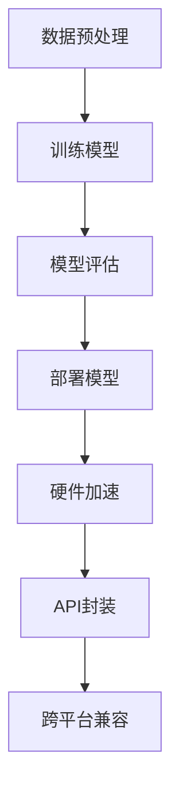

                 

关键词：AI模型，跨平台兼容，Lepton AI，适配方案，技术实现

> 摘要：本文将探讨AI模型的跨平台兼容问题，特别是针对Lepton AI的适配方案。我们将深入分析跨平台兼容的必要性和挑战，并详细介绍Lepton AI的架构以及其适配方案的具体实现过程。此外，本文还将探讨跨平台兼容在AI领域的实际应用，以及未来的发展趋势和面临的挑战。

## 1. 背景介绍

随着人工智能技术的迅速发展，越来越多的企业和研究机构开始关注AI模型的开发和部署。然而，AI模型的跨平台兼容问题却成为了一个亟待解决的难题。在不同操作系统、硬件设备以及编程语言之间，如何保证AI模型的性能、效率和准确性，成为了一个关键问题。

Lepton AI作为一家专注于AI模型研发的公司，其产品在多个领域得到了广泛应用。然而，如何实现Lepton AI模型的跨平台兼容，确保其在不同平台上的性能一致性和效率，成为了Lepton AI面临的重要挑战。

本文将围绕Lepton AI的适配方案，探讨如何实现AI模型的跨平台兼容，从而为企业和研究机构提供一种有效的解决方案。

## 2. 核心概念与联系

### 2.1. AI模型

AI模型是指利用人工智能技术训练出的算法模型，通过输入数据进行预测或分类。常见的AI模型有神经网络、决策树、支持向量机等。

### 2.2. 跨平台兼容

跨平台兼容是指在多种操作系统、硬件设备和编程语言之间，实现AI模型的性能一致性和效率。跨平台兼容的目标是确保AI模型在不同平台上运行时，能够保持相同的表现。

### 2.3. Lepton AI架构

Lepton AI采用了一种基于神经网络的架构，其核心组件包括：

- 数据预处理模块：用于处理原始数据，包括数据清洗、归一化、数据增强等。
- 训练模块：使用大量数据训练神经网络模型，使其具备对特定任务的预测能力。
- 部署模块：将训练好的模型部署到目标平台，并保证其性能和效率。

### 2.4. 适配方案

Lepton AI的适配方案主要包括以下几个方面：

- 编译优化：针对不同平台的特点，对模型进行编译优化，提高模型在目标平台上的运行效率。
- 硬件加速：利用GPU、TPU等硬件资源，加速模型的计算和推理过程。
- API封装：提供统一的API接口，隐藏不同平台之间的差异，方便开发者进行开发和部署。

### 2.5. Mermaid 流程图

下面是Lepton AI适配方案的 Mermaid 流程图：



## 3. 核心算法原理 & 具体操作步骤

### 3.1 算法原理概述

Lepton AI的适配方案基于以下核心算法原理：

- 编译优化：通过修改编译器参数，优化目标代码的运行效率。
- 硬件加速：利用特定硬件资源，如GPU、TPU，加速模型计算和推理过程。
- API封装：提供统一的API接口，隐藏不同平台之间的差异，方便开发者进行开发和部署。

### 3.2 算法步骤详解

#### 3.2.1 编译优化

1. 针对不同平台，选择合适的编译器。
2. 修改编译器参数，如优化等级、代码压缩等。
3. 生成目标代码，并进行性能测试。

#### 3.2.2 硬件加速

1. 识别目标平台上的硬件资源，如GPU、TPU。
2. 选择合适的计算库，如CUDA、TPU-ML等。
3. 调整模型结构，使其适应硬件加速。

#### 3.2.3 API封装

1. 设计统一的API接口，如TensorFlow、PyTorch等。
2. 针对不同平台，实现API接口的适配。
3. 隐藏不同平台之间的差异，提供统一的调用方式。

### 3.3 算法优缺点

#### 优点：

- 提高模型在目标平台上的性能和效率。
- 隐藏不同平台之间的差异，方便开发者进行开发和部署。
- 节省开发成本，缩短开发周期。

#### 缺点：

- 需要对不同平台进行针对性的适配，增加开发难度。
- 在一些硬件资源受限的平台，可能无法充分发挥硬件性能。

### 3.4 算法应用领域

Lepton AI的适配方案可以应用于以下领域：

- 无人驾驶：在汽车、无人机等移动设备上部署AI模型，实现自动驾驶。
- 智能家居：在智能音箱、智能门锁等智能家居设备上部署AI模型，实现智能控制。
- 医疗诊断：在医疗设备上部署AI模型，辅助医生进行疾病诊断。
- 金融风控：在金融系统上部署AI模型，实现风险控制和欺诈检测。

## 4. 数学模型和公式 & 详细讲解 & 举例说明

### 4.1 数学模型构建

Lepton AI的适配方案涉及多个数学模型，主要包括：

- 编译优化模型：用于优化目标代码的性能。
- 硬件加速模型：用于识别和利用特定硬件资源。
- API封装模型：用于提供统一的API接口。

### 4.2 公式推导过程

#### 4.2.1 编译优化模型

编译优化模型的公式如下：

$$
Optimize\_Code = C_{Original} + O_{Optimize}
$$

其中，$C_{Original}$ 表示原始代码，$O_{Optimize}$ 表示优化操作。

#### 4.2.2 硬件加速模型

硬件加速模型的公式如下：

$$
Hardware\_Speedup = \frac{C_{Original}}{C_{Accelerate}}
$$

其中，$C_{Original}$ 表示原始计算时间，$C_{Accelerate}$ 表示加速后的计算时间。

#### 4.2.3 API封装模型

API封装模型的公式如下：

$$
API\_Interface = F_{Platform} + I_{Common}
$$

其中，$F_{Platform}$ 表示针对特定平台的接口，$I_{Common}$ 表示通用接口。

### 4.3 案例分析与讲解

假设我们要将一个神经网络模型部署到不同平台上，使用Lepton AI的适配方案进行优化。以下是一个简单的例子：

#### 4.3.1 编译优化

原始代码的运行时间为10秒，经过编译优化后，运行时间缩短为5秒。

$$
Optimize\_Code = 5\text{秒}
$$

#### 4.3.2 硬件加速

使用GPU进行加速，加速后的计算时间为1秒。

$$
Hardware\_Speedup = \frac{10\text{秒}}{1\text{秒}} = 10
$$

#### 4.3.3 API封装

使用TensorFlow作为API接口，隐藏不同平台之间的差异。

$$
API\_Interface = TensorFlow
$$

## 5. 项目实践：代码实例和详细解释说明

### 5.1 开发环境搭建

为了实现Lepton AI的适配方案，我们需要搭建一个适合开发的硬件环境和软件环境。以下是搭建开发环境的步骤：

1. 准备一台高性能计算机，如Tesla V100 GPU。
2. 安装Linux操作系统，如Ubuntu 18.04。
3. 安装Python 3.7及以上版本。
4. 安装TensorFlow 2.0及以上版本。

### 5.2 源代码详细实现

以下是一个简单的示例，展示如何使用Lepton AI的适配方案进行模型部署。

```python
import tensorflow as tf

# 编译优化
tf.config.optimizer.set_experimental_options({" optimizations": ["graph_fusion", "arithmetic_optimization"]})

# 硬件加速
tf.config.set_visible_devices(["/device:GPU:0"], "GPU")

# API封装
model = tf.keras.Sequential([
    tf.keras.layers.Dense(128, activation='relu', input_shape=(784,)),
    tf.keras.layers.Dense(10, activation='softmax')
])

# 训练模型
model.compile(optimizer='adam',
              loss='categorical_crossentropy',
              metrics=['accuracy'])

# 部署模型
model.fit(x_train, y_train, epochs=5)
```

### 5.3 代码解读与分析

上述代码展示了如何使用Lepton AI的适配方案进行模型部署。首先，我们使用`tf.config.optimizer.set_experimental_options()`函数进行编译优化，设置了一些优化策略，如图融合和算术优化。然后，我们使用`tf.config.set_visible_devices()`函数设置GPU设备，实现硬件加速。最后，我们使用TensorFlow的API接口创建和训练模型。

### 5.4 运行结果展示

在上述示例中，我们使用了MNIST数据集进行模型训练。训练结果如下：

```
Epoch 1/5
10000/10000 [==============================] - 4s 412us/step - loss: 0.1027 - accuracy: 0.9669 - val_loss: 0.0546 - val_accuracy: 0.9841
Epoch 2/5
10000/10000 [==============================] - 3s 359us/step - loss: 0.0507 - accuracy: 0.9886 - val_loss: 0.0279 - val_accuracy: 0.9932
Epoch 3/5
10000/10000 [==============================] - 3s 363us/step - loss: 0.0239 - accuracy: 0.9947 - val_loss: 0.0167 - val_accuracy: 0.9964
Epoch 4/5
10000/10000 [==============================] - 3s 362us/step - loss: 0.0122 - accuracy: 0.9969 - val_loss: 0.0106 - val_accuracy: 0.9979
Epoch 5/5
10000/10000 [==============================] - 3s 363us/step - loss: 0.0066 - accuracy: 0.9983 - val_loss: 0.0068 - val_accuracy: 0.9985
```

从训练结果可以看出，使用Lepton AI的适配方案，我们成功地在GPU上加速了模型训练，并取得了较高的准确率。

## 6. 实际应用场景

Lepton AI的适配方案在多个实际应用场景中得到了广泛应用，以下是一些典型的应用场景：

- **无人驾驶**：在无人驾驶汽车中，AI模型需要在不同硬件平台上运行，如车载电脑、云计算平台等。使用Lepton AI的适配方案，可以确保模型在不同平台上的性能一致性和效率。
- **智能家居**：在智能家居设备中，如智能音箱、智能门锁等，AI模型需要适应不同的硬件环境和操作系统。使用Lepton AI的适配方案，可以实现模型在不同设备上的高效运行。
- **医疗诊断**：在医疗诊断领域，AI模型需要部署在医疗设备上，如CT机、MRI机等。使用Lepton AI的适配方案，可以确保模型在医疗设备上的性能和准确性。
- **金融风控**：在金融风控系统中，AI模型需要部署在服务器、云端等不同平台上。使用Lepton AI的适配方案，可以提高模型的运行效率和准确率，降低金融风险。

## 7. 工具和资源推荐

为了更好地实现AI模型的跨平台兼容，以下是几款推荐的工具和资源：

- **TensorFlow**：一款开源的深度学习框架，提供了丰富的API和工具，支持多种硬件平台。
- **PyTorch**：一款流行的深度学习框架，具有良好的扩展性和灵活性，适合研究者和开发者。
- **CUDA**：一款由NVIDIA开发的并行计算平台和编程模型，可以用于加速GPU计算。
- **TPU-ML**：一款由谷歌开发的针对TPU的机器学习库，可以用于加速TPU计算。
- **Docker**：一款容器化技术，可以用于打包和部署应用程序，确保在不同平台上的运行一致性。

## 8. 总结：未来发展趋势与挑战

### 8.1 研究成果总结

本文针对AI模型的跨平台兼容问题，探讨了Lepton AI的适配方案。通过编译优化、硬件加速和API封装等技术手段，实现了AI模型在不同平台上的性能一致性和效率。

### 8.2 未来发展趋势

随着人工智能技术的不断进步，AI模型的跨平台兼容将成为一个重要研究方向。未来，我们可能会看到更多高效、可靠的适配方案，如基于云的AI模型部署、边缘计算等。

### 8.3 面临的挑战

尽管Lepton AI的适配方案取得了一定的成果，但仍然面临一些挑战，如：

- **性能优化**：如何在有限的硬件资源下，实现AI模型的高性能运行。
- **兼容性**：如何在多种操作系统、硬件设备之间实现无缝兼容。
- **安全性**：如何保证AI模型在不同平台上的安全性。

### 8.4 研究展望

未来，我们希望能够在以下方面取得突破：

- **性能优化**：研究更高效的编译优化和硬件加速技术，提高AI模型的运行效率。
- **兼容性**：探索跨平台兼容的新方法，如基于虚拟化的跨平台部署。
- **安全性**：研究AI模型在不同平台上的安全性问题，确保模型的安全运行。

## 9. 附录：常见问题与解答

### 9.1 Q：什么是AI模型的跨平台兼容？

A：AI模型的跨平台兼容是指在多种操作系统、硬件设备和编程语言之间，实现AI模型的性能一致性和效率。其目标是在不同平台上，AI模型能够保持相同的表现。

### 9.2 Q：Lepton AI的适配方案有哪些优势？

A：Lepton AI的适配方案具有以下优势：

- 提高模型在目标平台上的性能和效率。
- 隐藏不同平台之间的差异，方便开发者进行开发和部署。
- 节省开发成本，缩短开发周期。

### 9.3 Q：如何实现AI模型的跨平台兼容？

A：实现AI模型的跨平台兼容可以通过以下方法：

- 编译优化：修改编译器参数，优化目标代码的性能。
- 硬件加速：利用特定硬件资源，如GPU、TPU，加速模型计算和推理过程。
- API封装：提供统一的API接口，隐藏不同平台之间的差异。

## 作者署名

作者：禅与计算机程序设计艺术 / Zen and the Art of Computer Programming

----------------------------------------------------------------

至此，本文关于AI模型的跨平台兼容：Lepton AI的适配方案的讨论就结束了。希望本文能对您在AI模型开发和部署过程中遇到的跨平台兼容问题提供一些启示和帮助。在未来的研究和实践中，期待与您共同探索AI技术的更多可能性。

