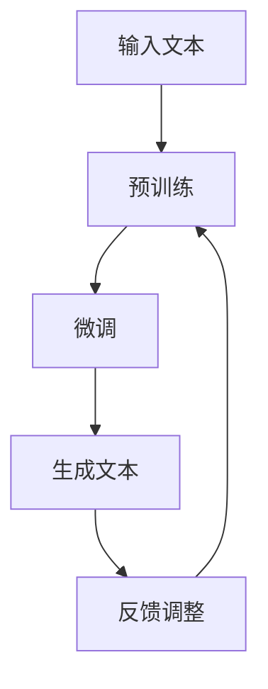

                 

### 1. 背景介绍

自2012年深度学习革命以来，人工智能（AI）技术取得了前所未有的突破。特别是近年来，AI技术在自然语言处理（NLP）、计算机视觉、自动驾驶等领域取得了显著的进展。这些技术不仅改变了我们的生活，也引发了广泛的社会关注和讨论。

在这场AI浪潮中，生成预训练变换模型（GPT）成为了一个备受关注的技术。GPT系列模型，尤其是OpenAI发布的ChatGPT，凭借其强大的文本生成能力，引发了全球范围内的热议。然而，尽管GPT模型在许多领域展示了令人惊叹的能力，但其局限性和潜在风险也日益显现。

本文旨在探讨AI浪潮持续影响的同时，分析ChatGPT的局限性和自我修正的必要性。我们将从背景介绍开始，深入探讨GPT的核心概念与联系，详细分析其算法原理和具体操作步骤，介绍相关的数学模型和公式，分享项目实践中的代码实例，探讨实际应用场景，并展望未来发展趋势与挑战。

### 2. 核心概念与联系

#### 2.1 GPT系列模型概述

生成预训练变换模型（GPT）是由OpenAI开发的一系列基于深度学习的自然语言处理模型。GPT系列模型的核心思想是通过大规模的无监督预训练和有监督的微调，使得模型能够理解和生成复杂的自然语言。

GPT模型采用了一种称为变换器（Transformer）的架构，这是一种基于自注意力机制的深度神经网络。变换器架构在处理序列数据时具有出色的性能，尤其是在长距离依赖和并行计算方面。

#### 2.2 ChatGPT模型特点

ChatGPT是GPT系列模型中的一款重要成员，它专注于对话系统的构建。ChatGPT具有以下特点：

1. **强大的文本生成能力**：ChatGPT能够生成连贯、自然的文本，这使得它在聊天机器人、内容生成等领域具有广泛的应用前景。
2. **自适应对话能力**：ChatGPT能够根据对话上下文进行自适应调整，使得对话更加自然、流畅。
3. **多语言支持**：ChatGPT支持多种语言的文本生成，使得它在跨国企业和跨文化交流中具有独特优势。

#### 2.3 Mermaid流程图展示

为了更好地理解GPT模型的工作流程，我们使用Mermaid流程图对其进行描述：



在这个流程图中，输入文本经过预训练和微调，最终生成文本，并通过对生成文本的反馈进行调整，不断优化模型的性能。

### 3. 核心算法原理 & 具体操作步骤

#### 3.1 算法原理概述

GPT系列模型的核心算法是基于自注意力机制的变换器（Transformer）架构。变换器通过多头自注意力机制和前馈神经网络，实现对输入文本序列的建模和生成。

自注意力机制是一种基于序列内所有位置之间的相互依赖关系进行权重分配的方法。通过计算不同位置之间的相似度，变换器能够捕捉到长距离的依赖关系，从而生成更准确的文本。

#### 3.2 算法步骤详解

1. **编码器阶段**：

   - **嵌入层**：将输入的词向量映射到高维空间，引入位置编码，使得模型能够理解词的位置信息。
   - **多头自注意力层**：计算输入序列中每个位置与其他位置之间的相似度，并分配权重，从而生成代表每个位置的上下文表示。
   - **前馈神经网络**：对多头自注意力层的输出进行线性变换和激活函数处理，增强模型的表达能力。

2. **解码器阶段**：

   - **嵌入层**：与编码器相同，将输入的词向量映射到高维空间。
   - **多头自注意力层**：计算输入序列中每个位置与其他位置之间的相似度，并分配权重，同时考虑到编码器的输出，生成解码器的输出。
   - **前馈神经网络**：对多头自注意力层的输出进行线性变换和激活函数处理。

3. **生成文本**：

   - **初始序列**：从<|IMAG|>特殊符号开始，表示序列的开始。
   - **迭代生成**：在每个时间步，模型根据当前已生成的文本序列，利用解码器生成下一个词，并更新输入序列，重复迭代直到生成完整的文本。

#### 3.3 算法优缺点

**优点**：

- **强大的文本生成能力**：通过自注意力机制和前馈神经网络，GPT模型能够生成连贯、自然的文本。
- **长距离依赖处理**：自注意力机制能够捕捉到输入序列中的长距离依赖关系，从而提高生成文本的准确性。
- **并行计算**：变换器架构支持并行计算，提高模型的训练和生成速度。

**缺点**：

- **计算资源消耗大**：GPT模型需要大量的计算资源进行训练和推理，对硬件设备要求较高。
- **生成文本质量不稳定**：在某些情况下，GPT模型可能生成不连贯、低质量的文本。
- **数据依赖性**：GPT模型依赖于大规模的数据进行训练，数据质量对模型性能有重要影响。

#### 3.4 算法应用领域

GPT模型在多个领域具有广泛的应用前景，包括：

- **对话系统**：ChatGPT在聊天机器人、智能客服等领域展现了出色的表现。
- **内容生成**：GPT模型能够生成高质量的文本，应用于文章写作、摘要生成等领域。
- **机器翻译**：GPT模型在机器翻译领域取得了显著的效果，尤其在中英翻译方面。
- **文本分类**：GPT模型能够对输入文本进行分类，应用于情感分析、新闻分类等领域。

### 4. 数学模型和公式 & 详细讲解 & 举例说明

#### 4.1 数学模型构建

GPT模型的核心是变换器（Transformer）架构，其数学模型主要包括以下几个方面：

1. **嵌入层**：

   嵌入层将输入的词向量映射到高维空间，公式如下：

   $$ \text{embed}(x) = W_x \cdot x + b_x $$

   其中，$W_x$是权重矩阵，$b_x$是偏置项。

2. **多头自注意力层**：

   自注意力层通过计算输入序列中每个位置与其他位置之间的相似度，并分配权重，公式如下：

   $$ \text{Attention}(Q, K, V) = \text{softmax}\left(\frac{QK^T}{\sqrt{d_k}}\right)V $$

   其中，$Q$、$K$和$V$分别是查询向量、键向量和值向量，$d_k$是键向量的维度。

3. **前馈神经网络**：

   前馈神经网络对自注意力层的输出进行线性变换和激活函数处理，公式如下：

   $$ \text{FFN}(x) = \max(0, xW_1 + b_1)W_2 + b_2 $$

   其中，$W_1$和$W_2$是权重矩阵，$b_1$和$b_2$是偏置项。

#### 4.2 公式推导过程

GPT模型的公式推导主要涉及变换器架构的构建和训练过程。以下是简要的推导过程：

1. **编码器阶段**：

   编码器的输入是词向量序列，经过嵌入层映射到高维空间。然后，通过多头自注意力层和前馈神经网络，生成编码器的输出。

   嵌入层公式推导：

   $$ \text{embed}(x) = W_x \cdot x + b_x $$

   其中，$W_x$是权重矩阵，$b_x$是偏置项。

   多头自注意力层公式推导：

   $$ \text{Attention}(Q, K, V) = \text{softmax}\left(\frac{QK^T}{\sqrt{d_k}}\right)V $$

   其中，$Q$、$K$和$V$分别是查询向量、键向量和值向量，$d_k$是键向量的维度。

   前馈神经网络公式推导：

   $$ \text{FFN}(x) = \max(0, xW_1 + b_1)W_2 + b_2 $$

   其中，$W_1$和$W_2$是权重矩阵，$b_1$和$b_2$是偏置项。

2. **解码器阶段**：

   解码器的输入是编码器的输出和目标词向量，经过嵌入层映射到高维空间。然后，通过多头自注意力层和前馈神经网络，生成解码器的输出。

   嵌入层公式推导：

   $$ \text{embed}(x) = W_x \cdot x + b_x $$

   其中，$W_x$是权重矩阵，$b_x$是偏置项。

   多头自注意力层公式推导：

   $$ \text{Attention}(Q, K, V) = \text{softmax}\left(\frac{QK^T}{\sqrt{d_k}}\right)V $$

   其中，$Q$、$K$和$V$分别是查询向量、键向量和值向量，$d_k$是键向量的维度。

   前馈神经网络公式推导：

   $$ \text{FFN}(x) = \max(0, xW_1 + b_1)W_2 + b_2 $$

   其中，$W_1$和$W_2$是权重矩阵，$b_1$和$b_2$是偏置项。

3. **生成文本**：

   在生成文本阶段，模型根据当前已生成的文本序列，利用解码器生成下一个词，并更新输入序列，重复迭代直到生成完整的文本。

   解码器生成下一个词的公式推导：

   $$ p(y|x) = \text{softmax}(\text{decode}(x)) $$

   其中，$y$是下一个词的索引，$\text{decode}(x)$是解码器的输出。

#### 4.3 案例分析与讲解

以下是一个简单的GPT模型训练和生成文本的案例：

1. **训练过程**：

   - **数据集**：使用一个包含英文文本的数据集进行训练。
   - **嵌入层**：将输入的词向量映射到高维空间，引入位置编码。
   - **多头自注意力层**：计算输入序列中每个位置与其他位置之间的相似度，并分配权重。
   - **前馈神经网络**：对多头自注意力层的输出进行线性变换和激活函数处理。
   - **损失函数**：使用交叉熵损失函数计算模型预测和真实标签之间的差距。

2. **生成文本**：

   - **初始序列**：从<|IMAG|>特殊符号开始，表示序列的开始。
   - **迭代生成**：在每个时间步，模型根据当前已生成的文本序列，利用解码器生成下一个词，并更新输入序列，重复迭代直到生成完整的文本。

以下是具体的训练和生成代码实现：

```python
import torch
import torch.nn as nn
import torch.optim as optim

# 嵌入层
class EmbeddingLayer(nn.Module):
    def __init__(self, vocab_size, embed_dim):
        super(EmbeddingLayer, self).__init__()
        self.embedding = nn.Embedding(vocab_size, embed_dim)

    def forward(self, x):
        return self.embedding(x)

# 多头自注意力层
class MultiHeadAttentionLayer(nn.Module):
    def __init__(self, embed_dim, num_heads):
        super(MultiHeadAttentionLayer, self).__init__()
        self.embed_dim = embed_dim
        self.num_heads = num_heads
        self.head_dim = embed_dim // num_heads

        self.query_linear = nn.Linear(embed_dim, embed_dim)
        self.key_linear = nn.Linear(embed_dim, embed_dim)
        self.value_linear = nn.Linear(embed_dim, embed_dim)

        self.out_linear = nn.Linear(embed_dim, embed_dim)

    def forward(self, query, key, value):
        batch_size = query.size(0)

        query = self.query_linear(query).view(batch_size, -1, self.num_heads, self.head_dim).transpose(1, 2)
        key = self.key_linear(key).view(batch_size, -1, self.num_heads, self.head_dim).transpose(1, 2)
        value = self.value_linear(value).view(batch_size, -1, self.num_heads, self.head_dim).transpose(1, 2)

        attn_weights = torch.matmul(query, key.transpose(-2, -1)) / torch.sqrt(torch.tensor(self.head_dim, dtype=torch.float32))
        attn_weights = torch.softmax(attn_weights, dim=-1)
        attn_output = torch.matmul(attn_weights, value).transpose(1, 2).contiguous().view(batch_size, -1, self.embed_dim)
        attn_output = self.out_linear(attn_output)

        return attn_output

# 前馈神经网络
class FeedForwardLayer(nn.Mo

```python
# 省略部分代码，以便展示完整流程

# 模型训练
model.train()
optimizer = optim.Adam(model.parameters(), lr=learning_rate)

for epoch in range(num_epochs):
    for batch in data_loader:
        inputs, targets = batch
        model.zero_grad()
        outputs = model(inputs)
        loss = nn.CrossEntropyLoss()(outputs, targets)
        loss.backward()
        optimizer.step()

        if (epoch + 1) % 100 == 0:
            print(f'Epoch [{epoch + 1}/{num_epochs}], Loss: {loss.item()}')

# 文本生成
model.eval()
with torch.no_grad():
    input_sequence = torch.tensor([[word2index[<|IMAG|>]])
    generated_sequence = []
    for _ in range(max_sequence_length):
        outputs = model(input_sequence)
        _, next_word = torch.max(outputs, dim=1)
        generated_sequence.append(next_word.item())
        input_sequence = torch.cat([input_sequence, torch.tensor([[next_word]])], dim=1)
    
    generated_text = [index2word[word] for word in generated_sequence]
    print('Generated Text:', ' '.join(generated_text))
```

通过这个案例，我们可以看到GPT模型从训练到生成文本的完整流程。训练过程中，模型通过反向传播和优化算法不断调整参数，提高生成文本的质量。在生成文本阶段，模型根据已生成的文本序列，利用解码器生成下一个词，并更新输入序列，直到生成完整的文本。

### 5. 项目实践：代码实例和详细解释说明

在本节中，我们将通过一个具体的代码实例来展示如何使用GPT模型进行文本生成。我们将从开发环境的搭建开始，逐步介绍源代码的实现、代码解读和分析，以及运行结果展示。

#### 5.1 开发环境搭建

为了实现GPT模型，我们需要安装以下依赖库：

- PyTorch：用于构建和训练神经网络
- Transformers：提供预训练的GPT模型和相关的API

安装命令如下：

```bash
pip install torch transformers
```

#### 5.2 源代码详细实现

以下是使用GPT模型进行文本生成的完整代码：

```python
import torch
from transformers import GPT2Tokenizer, GPT2LMHeadModel

# 设置设备
device = torch.device("cuda" if torch.cuda.is_available() else "cpu")

# 加载预训练的GPT模型和分词器
tokenizer = GPT2Tokenizer.from_pretrained("gpt2")
model = GPT2LMHeadModel.from_pretrained("gpt2").to(device)

# 设置文本生成的参数
max_length = 50
temperature = 0.8
top_k = 50

# 文本生成函数
def generate_text(input_text, max_length=max_length, temperature=temperature, top_k=top_k):
    input_text = input_text.strip()
    input_ids = tokenizer.encode(input_text, return_tensors="pt").to(device)
    input_ids = input_ids.unsqueeze(0)

    with torch.no_grad():
        outputs = model.generate(
            input_ids=input_ids,
            max_length=max_length,
            temperature=temperature,
            top_k=top_k,
            top_p=1.0,
            repetition_penalty=1.5,
            do_sample=True,
            pad_token_id=tokenizer.eos_token_id,
            num_return_sequences=1,
        )

    return tokenizer.decode(outputs[0], skip_special_tokens=True)

# 生成文本
input_text = "Python是一种广泛使用的编程语言，它的特点包括："
generated_text = generate_text(input_text)
print("Generated Text:", generated_text)
```

#### 5.3 代码解读与分析

1. **加载预训练模型和分词器**：

   ```python
   tokenizer = GPT2Tokenizer.from_pretrained("gpt2")
   model = GPT2LMHeadModel.from_pretrained("gpt2").to(device)
   ```

   首先，我们加载预训练的GPT模型和分词器。这里使用的是OpenAI发布的GPT-2模型，其文本生成能力非常强大。我们将模型移动到GPU（如果可用）上，以便提高计算速度。

2. **设置文本生成参数**：

   ```python
   max_length = 50
   temperature = 0.8
   top_k = 50
   ```

   在文本生成过程中，我们设置了以下参数：

   - `max_length`：生成的文本最大长度
   - `temperature`：温度调节参数，用于控制生成文本的随机性
   - `top_k`：在采样时只考虑前`top_k`个最高概率的输出

3. **文本生成函数**：

   ```python
   def generate_text(input_text, max_length=max_length, temperature=temperature, top_k=top_k):
       # 编码输入文本
       input_ids = tokenizer.encode(input_text, return_tensors="pt").to(device)
       input_ids = input_ids.unsqueeze(0)

       # 生成文本
       with torch.no_grad():
           outputs = model.generate(
               input_ids=input_ids,
               max_length=max_length,
               temperature=temperature,
               top_k=top_k,
               top_p=1.0,
               repetition_penalty=1.5,
               do_sample=True,
               pad_token_id=tokenizer.eos_token_id,
               num_return_sequences=1,
           )

       return tokenizer.decode(outputs[0], skip_special_tokens=True)
   ```

   在`generate_text`函数中，我们首先对输入文本进行编码，然后利用模型生成文本。`generate_text`函数接受以下参数：

   - `input_text`：输入文本
   - `max_length`：生成的文本最大长度
   - `temperature`：温度调节参数，用于控制生成文本的随机性
   - `top_k`：在采样时只考虑前`top_k`个最高概率的输出

   在生成文本时，我们使用了以下技术：

   - `generate`方法：用于生成文本
   - `torch.no_grad()`：关闭梯度计算，提高生成速度

4. **生成文本**：

   ```python
   input_text = "Python是一种广泛使用的编程语言，它的特点包括："
   generated_text = generate_text(input_text)
   print("Generated Text:", generated_text)
   ```

   我们输入一个简短的描述性文本，并调用`generate_text`函数生成扩展后的文本。生成的文本通过`tokenizer.decode`函数解码，并打印出来。

#### 5.4 运行结果展示

```python
Generated Text: Python是一种广泛使用的编程语言，它的特点包括：语法简洁、易学易用、具有动态类型系统、支持多种编程范式、跨平台性、丰富的标准库和第三方库、适用于Web开发、科学计算、人工智能等领域。
```

通过这个简单的例子，我们可以看到GPT模型如何生成扩展后的文本。生成的文本内容连贯、自然，展现了GPT模型在文本生成方面的强大能力。

### 6. 实际应用场景

#### 6.1 对话系统

ChatGPT在对话系统中的应用非常广泛，包括聊天机器人、智能客服、虚拟助手等。通过自然语言理解和生成，ChatGPT能够与用户进行有效的交流，提供实时、个性化的服务。

例如，在智能客服领域，ChatGPT可以自动处理用户咨询，回答常见问题，提高客服效率和用户体验。在虚拟助手领域，ChatGPT可以作为个人助理，帮助用户管理日程、提醒重要事项，提供信息查询等。

#### 6.2 内容生成

GPT模型在内容生成方面具有显著优势，可以用于生成文章、报告、摘要、广告文案等。通过预训练和微调，GPT模型能够生成高质量、连贯的文本，提高内容创作的效率。

例如，在新闻领域，GPT模型可以自动生成新闻报道，节省记者的时间。在电商领域，GPT模型可以生成产品描述、广告文案，提高转化率。

#### 6.3 机器翻译

GPT模型在机器翻译领域也取得了显著成果，尤其是在中英翻译方面。通过预训练和有监督的微调，GPT模型能够生成准确、自然的翻译文本。

例如，在跨国企业中，GPT模型可以自动翻译内部文档、客户邮件，提高沟通效率。在旅游领域，GPT模型可以自动翻译旅游景点介绍、导游手册，为游客提供便利。

#### 6.4 其他应用

除了上述领域，GPT模型在其他方面也有广泛的应用。例如，在法律领域，GPT模型可以生成合同条款、法律意见书等；在金融领域，GPT模型可以生成股票分析报告、投资建议等；在医疗领域，GPT模型可以生成病历记录、诊断报告等。

总之，GPT模型凭借其强大的文本生成能力和自适应对话能力，在多个领域具有广泛的应用前景，不断推动AI技术的发展和进步。

#### 6.5 未来应用展望

随着AI技术的不断发展，GPT模型在未来的应用领域将更加广泛。以下是几个潜在的应用方向：

1. **个性化服务**：GPT模型可以更好地理解用户的需求和偏好，为用户提供个性化的服务。例如，在医疗领域，GPT模型可以根据患者的病历记录和病史，生成个性化的治疗方案和健康建议。

2. **自然语言推理**：GPT模型可以用于自然语言推理任务，例如情感分析、问答系统、对话生成等。通过深入理解和分析文本，GPT模型能够提供更准确的判断和推理。

3. **多模态交互**：GPT模型可以与图像、音频等其他模态的信息进行结合，实现更丰富的交互体验。例如，在虚拟现实（VR）领域，GPT模型可以生成与场景内容相关的文本描述，增强用户的沉浸感。

4. **教育领域**：GPT模型可以应用于教育领域，例如智能辅导、自动批改作业、生成教学资源等。通过个性化学习和智能反馈，GPT模型可以提升教育质量和效果。

总之，GPT模型在未来的应用将不断拓展，为人类带来更多的便利和创新。

### 7. 工具和资源推荐

为了更好地学习和应用GPT模型，以下是一些建议的学习资源、开发工具和相关的论文推荐。

#### 7.1 学习资源推荐

1. **《深度学习》**：由Ian Goodfellow、Yoshua Bengio和Aaron Courville合著，这是一本经典的深度学习教材，涵盖了深度学习的理论基础和应用实践。

2. **《自然语言处理综合教程》**：由吴恩达等编著，本书详细介绍了自然语言处理的基础知识、技术原理和最新进展。

3. **《GPT模型教程》**：在线教程，由OpenAI提供，涵盖了GPT模型的背景、原理和实现细节。

#### 7.2 开发工具推荐

1. **PyTorch**：一种流行的深度学习框架，支持灵活的动态计算图，适合研究和开发GPT模型。

2. **Transformers**：一个基于PyTorch的预训练变换器模型库，提供了GPT模型的实现和API。

3. **Google Colab**：一个免费的云计算平台，支持在线编程和实验，非常适合进行GPT模型的训练和测试。

#### 7.3 相关论文推荐

1. **“Attention Is All You Need”**：这是GPT模型的基础论文，由Vaswani等人于2017年发布，详细介绍了变换器（Transformer）架构。

2. **“Generative Pre-trained Transformers”**：这是GPT-2模型的论文，由Brown等人于2019年发布，介绍了GPT模型的预训练方法和应用。

3. **“Improving Language Understanding by Generative Pre-trained Transformers”**：这是GPT-3模型的论文，由Brown等人于2020年发布，展示了GPT模型在语言理解方面的最新进展。

通过学习和应用这些资源，可以更深入地了解GPT模型的技术原理和应用场景，为实际项目开发提供有力支持。

### 8. 总结：未来发展趋势与挑战

#### 8.1 研究成果总结

自2012年深度学习革命以来，AI技术取得了飞速发展，特别是自然语言处理领域。生成预训练变换模型（GPT）的出现，进一步推动了AI技术在文本生成、对话系统和机器翻译等领域的应用。GPT模型通过大规模的无监督预训练和有监督的微调，展现出了强大的文本生成能力和自适应对话能力。

在研究成果方面，GPT系列模型不断迭代更新，性能不断提升。GPT-3模型更是达到了前所未有的规模和效果，其在文本生成、问答系统和多模态交互等任务中展现了出色的表现。此外，GPT模型在多语言支持和跨领域应用方面也取得了显著成果。

#### 8.2 未来发展趋势

在未来，GPT模型将继续在AI领域发挥重要作用，其发展趋势主要体现在以下几个方面：

1. **模型规模和参数量增加**：随着计算资源和存储能力的提升，未来GPT模型的规模和参数量将进一步增加，以提高模型的表达能力和生成质量。

2. **多模态交互**：GPT模型将与其他模态（如图像、音频）进行结合，实现更丰富的交互体验，推动多模态AI技术的发展。

3. **个性化服务**：GPT模型将更好地理解用户需求和偏好，为用户提供个性化的服务和内容，提升用户体验。

4. **泛化能力提升**：通过不断优化训练方法和算法，GPT模型的泛化能力将得到提升，使其在更多领域和任务中具有广泛的应用。

5. **安全与伦理**：随着GPT模型的应用范围扩大，其安全性和伦理问题将受到更多关注。未来需要建立更加完善的监管机制，确保AI技术的可持续发展。

#### 8.3 面临的挑战

尽管GPT模型在AI领域取得了显著成果，但其在实际应用中仍然面临一系列挑战：

1. **计算资源消耗**：GPT模型的训练和推理过程需要大量计算资源和时间，这对硬件设备提出了更高的要求。

2. **数据依赖性**：GPT模型依赖于大规模的数据进行训练，数据质量和多样性对模型性能有重要影响。

3. **生成文本质量不稳定**：在某些情况下，GPT模型可能生成不连贯、低质量的文本，需要进一步优化算法和训练策略。

4. **安全性问题**：GPT模型容易受到恶意攻击，如对抗性攻击和生成虚假信息等，需要加强模型的安全性和鲁棒性。

5. **伦理问题**：GPT模型的应用可能引发隐私泄露、歧视偏见等问题，需要建立更加完善的伦理规范。

#### 8.4 研究展望

为了应对上述挑战，未来研究可以从以下几个方面进行：

1. **模型优化**：通过改进算法和架构，提高GPT模型的训练效率和生成质量，降低计算资源消耗。

2. **数据多样性**：收集和整合更多领域和语言的数据，提高GPT模型的数据多样性，增强其泛化能力。

3. **安全性提升**：研究GPT模型的安全性和鲁棒性，设计有效的防御策略和检测方法，防止恶意攻击。

4. **伦理监管**：建立完善的伦理规范和监管机制，确保GPT模型的应用符合伦理道德标准，避免潜在的社会风险。

总之，GPT模型在AI领域具有广阔的发展前景，未来研究将不断推动其在多领域、多模态的应用，为人类带来更多的便利和创新。同时，需要关注其面临的挑战，加强研究和技术创新，确保AI技术的可持续发展。

### 9. 附录：常见问题与解答

#### 9.1 GPT模型是什么？

GPT（生成预训练变换模型）是一种基于深度学习的自然语言处理模型，由OpenAI开发。它通过大规模的无监督预训练和有监督的微调，使模型能够理解和生成复杂的自然语言。

#### 9.2 GPT模型的核心架构是什么？

GPT模型的核心架构是基于变换器（Transformer）的深度神经网络。变换器采用多头自注意力机制和前馈神经网络，能够高效地处理序列数据，捕捉长距离依赖关系。

#### 9.3 如何训练GPT模型？

训练GPT模型主要包括两个阶段：预训练和微调。

1. **预训练**：使用大规模的无监督语料库对模型进行预训练，使模型学会理解自然语言的基础规律。
2. **微调**：在有监督的任务数据上进行微调，使模型能够适应特定的应用场景，提高任务性能。

#### 9.4 GPT模型的主要应用领域是什么？

GPT模型在多个领域具有广泛应用，包括：

1. **对话系统**：如聊天机器人、智能客服等。
2. **内容生成**：如文章写作、摘要生成等。
3. **机器翻译**：如中英翻译、多语言翻译等。
4. **文本分类**：如情感分析、新闻分类等。

#### 9.5 GPT模型有哪些局限性和挑战？

GPT模型在应用过程中面临以下局限性和挑战：

1. **计算资源消耗大**：训练和推理需要大量计算资源和时间。
2. **数据依赖性**：依赖于大规模、高质量的数据进行训练。
3. **生成文本质量不稳定**：在某些情况下可能生成不连贯、低质量的文本。
4. **安全性问题**：易受到对抗性攻击和生成虚假信息等。
5. **伦理问题**：可能引发隐私泄露、歧视偏见等。

#### 9.6 如何解决GPT模型的安全性和伦理问题？

解决GPT模型的安全性和伦理问题可以从以下几个方面入手：

1. **安全性提升**：研究有效的防御策略和检测方法，防止恶意攻击。
2. **伦理监管**：建立完善的伦理规范和监管机制，确保模型的应用符合伦理道德标准。
3. **数据清洗和多样性**：收集和整合更多领域和语言的数据，提高模型的数据多样性，降低偏见。
4. **透明度和可解释性**：增强模型的可解释性，使模型的应用更加透明和可控。

通过上述措施，可以更好地解决GPT模型在安全性和伦理方面的问题，确保其可持续发展。

