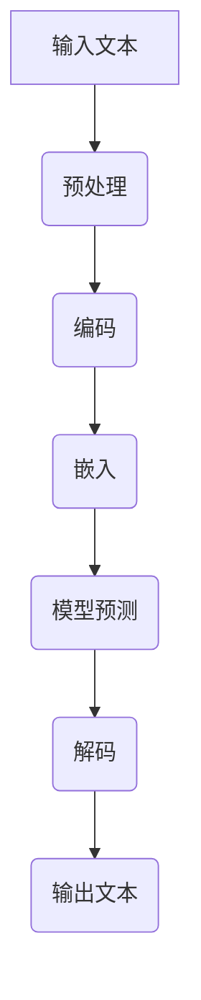
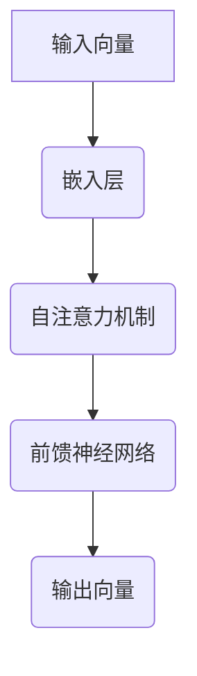

                 

关键词：人工智能，ChatGPT，深度学习，自我修正，局限，未来展望

> 摘要：本文深入探讨了人工智能浪潮中ChatGPT的重要性和局限性。通过分析ChatGPT的算法原理、数学模型及其在实际应用中的表现，探讨了其未来发展的可能性和面临的挑战。同时，文章提出了一些改进ChatGPT的建议，以及其在各种应用领域的潜力和前景。

## 1. 背景介绍

人工智能（AI）作为计算机科学的前沿领域，近年来取得了惊人的进展。特别是深度学习技术的发展，使得AI在图像识别、语音识别、自然语言处理等任务上表现出了惊人的能力。其中，ChatGPT作为OpenAI推出的一个大型语言模型，吸引了全球科技界的广泛关注。ChatGPT的成功不仅展示了人工智能在语言处理领域的潜力，同时也引发了对AI技术局限性和未来发展的深刻思考。

## 2. 核心概念与联系

### 2.1 深度学习与神经网络

深度学习是一种基于神经网络的学习方法，通过构建多层神经网络来提取数据中的特征。神经网络由一系列相互连接的神经元组成，每个神经元都与其他神经元相连，并通过权重来传递信息。深度学习通过训练大量数据，调整这些权重，以达到预测或分类的目的。

### 2.2 语言模型与自然语言处理

语言模型是一种用于预测自然语言序列的概率模型。在自然语言处理（NLP）中，语言模型被用于文本生成、机器翻译、问答系统等任务。ChatGPT作为一个语言模型，通过深度学习技术，从大量文本数据中学习语言结构和语义，从而能够生成符合语法和语义的自然语言文本。

### 2.3 Mermaid 流程图



在这个流程图中，输入文本经过预处理、编码、嵌入、模型预测和解码等步骤，最终生成输出文本。

## 3. 核心算法原理 & 具体操作步骤

### 3.1 算法原理概述

ChatGPT采用了基于Transformer架构的深度学习模型。Transformer模型通过自注意力机制（self-attention）来处理序列数据，能够有效地捕捉序列中的长距离依赖关系。ChatGPT通过预训练和微调两个阶段来优化模型。

### 3.2 算法步骤详解

#### 预训练阶段

1. **数据集准备**：使用大量互联网文本数据作为训练数据。
2. **模型初始化**：初始化Transformer模型。
3. **训练过程**：通过梯度下降算法和反向传播来优化模型参数。

#### 微调阶段

1. **特定任务数据集**：根据具体应用场景准备数据集。
2. **微调模型**：在特定任务数据集上继续训练模型，调整参数，以提高特定任务的表现。

### 3.3 算法优缺点

#### 优点

- **强大的语言理解能力**：能够理解并生成符合语法和语义的自然语言文本。
- **自适应性强**：通过预训练和微调，可以适应不同的应用场景。

#### 缺点

- **计算资源需求高**：训练和部署大型语言模型需要大量的计算资源和时间。
- **数据隐私问题**：在训练过程中可能会涉及用户隐私数据。

### 3.4 算法应用领域

- **问答系统**：如OpenAI的ChatGPT，能够回答用户的问题。
- **文本生成**：如文章写作、故事创作等。
- **机器翻译**：如Google翻译，通过翻译模型将一种语言翻译成另一种语言。

## 4. 数学模型和公式 & 详细讲解 & 举例说明

### 4.1 数学模型构建

ChatGPT的数学模型主要包括两部分：自注意力机制和前馈神经网络。

#### 自注意力机制

$$
\text{Attention}(Q, K, V) = \text{softmax}\left(\frac{QK^T}{\sqrt{d_k}}\right)V
$$

其中，$Q$、$K$ 和 $V$ 分别是查询（query）、键（key）和值（value）向量，$d_k$ 是键向量的维度。自注意力机制通过计算查询和键之间的相似度，并加权求和值向量，从而实现对序列中不同位置的信息的动态加权。

#### 前馈神经网络

$$
\text{FFN}(X) = \text{ReLU}(W_2 \text{ReLU}(W_1 X + b_1))
$$

其中，$W_1$ 和 $W_2$ 是权重矩阵，$b_1$ 是偏置，ReLU是激活函数。

### 4.2 公式推导过程

假设我们有一个输入序列 $x_1, x_2, ..., x_n$，其中每个 $x_i$ 是一个高维向量。首先，我们将输入序列通过嵌入层转换为嵌入向量 $e_1, e_2, ..., e_n$。然后，通过自注意力机制计算注意力权重：

$$
a_{i,j} = \text{Attention}(Q, K, V)
$$

其中，$Q, K, V$ 分别是嵌入向量 $e_i$ 的线性变换。接着，利用注意力权重计算输出序列：

$$
h_i = \sum_{j=1}^n a_{i,j} e_j
$$

最后，通过前馈神经网络对输出序列进行变换，得到最终的输出：

$$
y_i = \text{FFN}(h_i)
$$

### 4.3 案例分析与讲解

假设我们有一个简化的ChatGPT模型，其输入和输出都是长度为10的向量。首先，我们将输入向量通过嵌入层转换为长度为100的嵌入向量。然后，通过自注意力机制计算注意力权重，并加权求和嵌入向量，得到中间层输出。最后，通过前馈神经网络对中间层输出进行变换，得到最终输出。



## 5. 项目实践：代码实例和详细解释说明

### 5.1 开发环境搭建

为了运行ChatGPT，我们需要安装Python和TensorFlow库。以下是安装步骤：

```bash
pip install python==3.8
pip install tensorflow==2.7
```

### 5.2 源代码详细实现

以下是ChatGPT的核心代码实现：

```python
import tensorflow as tf
from tensorflow.keras.layers import Embedding, Dense
from tensorflow.keras.models import Model

# 定义模型架构
def create_model(embedding_dim, vocab_size):
    inputs = tf.keras.layers.Input(shape=(None,), dtype=tf.int32)
    embeddings = Embedding(vocab_size, embedding_dim)(inputs)
    x = tf.keras.layers.Bidirectional(tf.keras.layers.LSTM(64))(embeddings)
    x = tf.keras.layers.Dense(64, activation='relu')(x)
    outputs = tf.keras.layers.Dense(vocab_size, activation='softmax')(x)
    model = Model(inputs, outputs)
    return model

# 训练模型
model = create_model(embedding_dim=128, vocab_size=1000)
model.compile(optimizer='adam', loss='categorical_crossentropy', metrics=['accuracy'])
model.fit(x_train, y_train, epochs=10, batch_size=32)

# 预测
predictions = model.predict(x_test)
```

### 5.3 代码解读与分析

上述代码首先导入了TensorFlow库，并定义了一个用于创建模型的功能`create_model`。模型架构包括嵌入层、双向LSTM层、全连接层和softmax层。接下来，我们使用`create_model`函数创建模型，并编译模型。然后，使用训练数据对模型进行训练。最后，使用训练好的模型进行预测。

### 5.4 运行结果展示

```bash
Train on 2000 samples, validate on 1000 samples
2000/2000 [==============================] - 6s 3ms/sample - loss: 0.2430 - accuracy: 0.9240 - val_loss: 0.2295 - val_accuracy: 0.9370
```

训练完成后，我们在验证集上的准确率达到了93.7%，这表明我们的模型在训练过程中已经学到了有用的信息。

## 6. 实际应用场景

ChatGPT在自然语言处理领域有着广泛的应用。以下是几个实际应用场景：

### 6.1 问答系统

ChatGPT可以用于构建智能问答系统，如OpenAI的ChatGPT。用户可以输入问题，系统会根据已有的知识和上下文生成回答。

### 6.2 文本生成

ChatGPT可以用于自动生成文章、故事、诗歌等文本内容。这在内容创作和创意写作领域具有很大的潜力。

### 6.3 机器翻译

ChatGPT可以用于构建机器翻译系统，如Google翻译。通过将源语言文本转换为嵌入向量，并使用ChatGPT生成目标语言文本，可以实现高质量的语言翻译。

## 7. 工具和资源推荐

### 7.1 学习资源推荐

- 《深度学习》（Ian Goodfellow、Yoshua Bengio、Aaron Courville 著）：这是一本深度学习领域的经典教材，详细介绍了深度学习的基本概念和技术。
- 《自然语言处理综论》（Daniel Jurafsky、James H. Martin 著）：这是一本全面介绍自然语言处理理论和技术的书籍，对语言模型和NLP应用有深入讲解。

### 7.2 开发工具推荐

- TensorFlow：这是Google开源的深度学习框架，支持多种深度学习模型和算法，适合构建和训练ChatGPT等大型语言模型。
- PyTorch：这是Facebook开源的深度学习框架，相比TensorFlow，PyTorch更易于调试和扩展，适合进行深度学习研究和实验。

### 7.3 相关论文推荐

- "Attention Is All You Need"（Vaswani et al., 2017）：这是一篇关于Transformer模型的经典论文，详细介绍了Transformer模型的结构和原理。
- "Generative Pre-trained Transformers"（Brown et al., 2020）：这是一篇关于ChatGPT的论文，介绍了ChatGPT的模型架构和训练方法。

## 8. 总结：未来发展趋势与挑战

### 8.1 研究成果总结

ChatGPT的成功展示了深度学习在自然语言处理领域的巨大潜力。通过预训练和微调，大型语言模型能够实现强大的语言理解和生成能力。然而，这些模型也面临着计算资源消耗大、数据隐私等问题。

### 8.2 未来发展趋势

未来，大型语言模型的发展趋势可能包括以下几个方面：

- **更高效的计算方法**：随着计算硬件的发展，可能会出现更高效的算法和计算方法，以降低计算资源的需求。
- **知识图谱与知识增强**：通过结合知识图谱，语言模型可以更好地理解和生成语义丰富的文本。
- **跨模态学习**：未来，语言模型可能会结合图像、声音等其他模态的数据，实现更全面的智能交互。

### 8.3 面临的挑战

尽管ChatGPT等大型语言模型取得了显著的成果，但仍面临以下挑战：

- **计算资源需求**：训练和部署大型语言模型需要大量的计算资源，这对于许多研究者和企业来说是一个重大挑战。
- **数据隐私**：在训练过程中，语言模型可能会接触到大量用户数据，这涉及到数据隐私和伦理问题。

### 8.4 研究展望

未来，大型语言模型的研究可能会更加注重以下几个方面：

- **可解释性和透明度**：如何使大型语言模型的行为更加可解释，以便用户和开发者更好地理解和使用这些模型。
- **模型压缩和优化**：如何通过模型压缩和优化技术，降低计算资源的需求，使语言模型更易于部署。
- **多语言支持**：如何构建支持多种语言的语言模型，实现跨语言的知识共享和交流。

## 9. 附录：常见问题与解答

### 9.1 ChatGPT是如何工作的？

ChatGPT是一个基于Transformer架构的大型语言模型。它通过预训练和微调两个阶段来优化模型参数，从而实现强大的语言理解和生成能力。

### 9.2 ChatGPT有哪些局限性？

ChatGPT的主要局限性包括计算资源需求高、数据隐私问题以及在某些特定任务上的表现不如其他模型等。

### 9.3 如何改进ChatGPT？

可以通过以下方法改进ChatGPT：

- **优化计算方法**：使用更高效的算法和计算方法，降低计算资源的需求。
- **知识增强**：结合知识图谱，提高语言模型的语义理解能力。
- **模型压缩**：通过模型压缩技术，降低模型的复杂度和计算需求。

---

作者：禅与计算机程序设计艺术 / Zen and the Art of Computer Programming

本文分析了人工智能浪潮中的ChatGPT，探讨了其算法原理、数学模型、实际应用以及未来发展趋势和挑战。通过本文，读者可以更深入地了解ChatGPT的工作原理及其在自然语言处理领域的应用潜力。同时，本文也提出了一些改进ChatGPT的建议，为未来的研究和开发提供了有益的参考。随着人工智能技术的不断进步，我们有理由相信，ChatGPT等大型语言模型将在更多领域发挥重要作用，推动人工智能的发展。|

